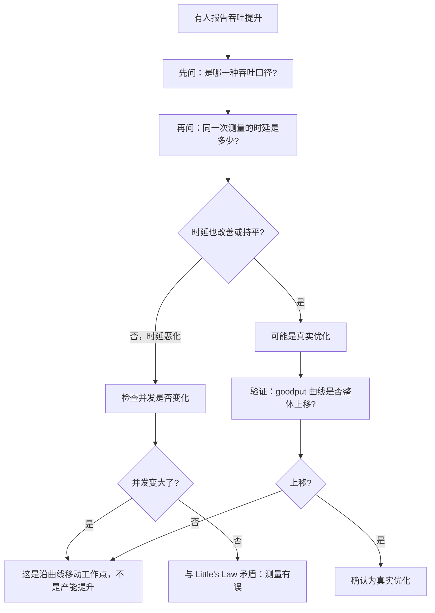

# 吞吐、并发与 goodput

> 位置：[InferenceAtlas](../../INDEX.md) > [模块 11](README.md) > 当前文档
> 信息截至：2026-07-29 ｜ 最后核验：2026-07-29 ｜ 内容版本：v0.1
> 时效性等级：低
> 相关主题：[时延指标定义](03_ttft_tpot_itl_and_end_to_end_latency.md)｜[benchmark 方法论](01_inference_benchmarking_methodology.md)｜`05_power_energy_and_cost_benchmarks.md`

## 本章导读

「吞吐」是推理系统里最容易被误用的一个词。
它至少有五种互不等价的口径——每秒请求数、每秒输出 token 数、
每秒总 token 数（含输入）、每秒有效 token 数、以及每卡归一化后的值——
**而同一个系统在这五种口径下的数字可以相差一个量级以上**。

比这更根本的问题是：**孤立的吞吐数字可以被任意抬高**。
只要不断增大批，吞吐就会上升，直到算力饱和为止；
代价是 TPOT 同步恶化，但如果报告不提时延，读者看不出这一点。
**因此「吞吐」本身不是一个可以用于比较的量**——
可比的量是 **goodput**：在满足 SLO 的前提下真正交付的有用产出。

本章做四件事：**厘清五种吞吐口径的定义与换算**、
**用 Little's Law 把吞吐、并发与时延三者绑定起来**、
**给出 goodput 的精确定义与它和吞吐的差距来源**、
以及**说明并发数为什么不是一个可以自由设定的参数**——
它被 KV 显存与 SLO 双向夹住。

其中 Little's Law 是本章的主线：
它说明**吞吐、并发、驻留时间三者只有两个自由度**，
所以「同时提高吞吐和降低时延」在并发不变时是不可能的——
**这个约束是硬的，任何声称同时改善两者的优化都必然改变了第三个量**。

## 学习目标

读完本章后，读者应能够：

1. 列出五种吞吐口径并说明它们之间的换算关系与适用场合
2. 用 Little's Law 把吞吐、并发与驻留时间绑定，并解释它对优化的约束
3. 精确定义 goodput，并列出吞吐与 goodput 之间的四类差距来源
4. 说明并发数被哪两个约束夹住，以及为什么它不能自由设定
5. 判断一次「吞吐提升」是真实的产能提高还是时延的转移

## 核心结论

- **吞吐至少有五种口径**，其中「每秒输出 token 数」与「每秒总 token 数」在长输入场景下可以相差数倍；报数字必须说清是哪一种。
- **Little's Law 把三者绑死**：$C = \lambda \cdot T$。并发、吞吐、驻留时间只有两个自由度，**任何「同时改善吞吐与时延」的说法都隐含了并发的变化**。
- **goodput 才是可比的量**：它只计入满足 SLO 且被用户实际使用的产出，因此不能靠增大批来虚高。
- **吞吐与 goodput 的差距有四个来源**：违反 SLO 的产出、失败与超时、被放弃的流式输出、以及非付费流量。
- **并发数被双向夹住**：上界是 KV 显存，下界是达成目标吞吐所需的并发；两者冲突时必须先动其中一个约束，而不是硬调并发。
- **吞吐随批大小的曲线有饱和点**，超过它之后继续增大批只恶化时延而不再提高吞吐——这个点应当被实测出来。

## 1. 问题定义、系统边界与工作负载

### 1.1 本章要解决的问题

让「吞吐」这个词在报告中有确定含义，
并给出一个不能被工作点操纵的替代量（goodput）。

**本章不涉及**：具体系统的吞吐数字（本库无法核验），
提高吞吐的具体手段（见模块 03 与 04）。

### 1.2 为什么吞吐比时延更容易被误用

时延有一个天然的锚点——用户的耐心，
所以时延数字大到一定程度会被立刻质疑。
**吞吐没有这样的锚点**：更高的吞吐总是「看起来更好」，
**而它的代价（时延）如果不被同时报告就完全不可见**。

这造成一个不对称：
**报一个漂亮的吞吐数字比报一个漂亮的时延数字容易得多**，
只需要把批调大。

### 1.3 三类工作负载对吞吐的关心程度不同

| 负载类型 | 主要关心 | 吞吐的角色 |
|---|---|---|
| 交互式对话 | TPOT、TTFT | **次要**：在 SLO 约束下越高越好 |
| 批量离线处理 | 吞吐、成本 | **主要**：时延几乎不重要 |
| 混合 | 两者 | 需要分级：在线优先，离线填谷 |

**这个区分很重要**：
对交互式服务报「最大吞吐」几乎没有意义，
因为那个工作点的时延必然不可接受。
**应当报的是 SLO 约束下的吞吐**。

## 2. 原理、数学与性能模型

### 2.1 五种吞吐口径

设服务在窗口 $\Delta$ 内完成了 $R$ 个请求，
第 $j$ 个请求的输入长度 $S_{\text{in}}^{(j)}$、输出长度 $S_{\text{out}}^{(j)}$：

| 口径 | 定义 | 适用 |
|---|---|---|
| 请求吞吐 | $\lambda = R/\Delta$ | 容量规划、排队分析 |
| 输出 token 吞吐 | $\sum_j S_{\text{out}}^{(j)} / \Delta$ | **decode 侧产能** |
| 总 token 吞吐 | $\sum_j (S_{\text{in}}^{(j)} + S_{\text{out}}^{(j)}) / \Delta$ | 含 prefill 的总工作量 |
| 有效 token 吞吐（goodput） | 只计满足 SLO 且被使用的输出 | **唯一可横向比较** |
| 单卡归一化吞吐 | 上述任一 ÷ 卡数 | 跨规模比较 |

**第二与第三种的差距由输入输出比决定**：

$$
\frac{\text{总 token 吞吐}}{\text{输出 token 吞吐}} = 1 + \frac{\overline{S_{\text{in}}}}{\overline{S_{\text{out}}}}
$$

**在长输入短输出的场景（如摘要、分类）下这个比值可以很大**，
所以用「总 token 吞吐」报出的数字会显著高于「输出 token 吞吐」。
**两者都不是错的，但混用会造成数倍的误读**。

**一个重要的物理区别**：输入 token 与输出 token 的成本结构不同——
输入在 prefill 阶段被批量处理（算力受限、并行度高），
输出在 decode 阶段逐个产生（带宽受限、并行度低）。
**所以把两者相加成一个「总 token 吞吐」在物理上是可疑的**，
它把两种成本完全不同的东西按 1:1 加在了一起。
**报告时更推荐分开给两个数字**。

### 2.2 Little's Law 与三者的绑定

对一个稳态系统：

$$
C = \lambda \cdot T
$$

其中 $C$ 是平均在飞请求数（并发）、$\lambda$ 是吞吐（请求/秒）、
$T$ 是平均驻留时间（端到端时延）。

**这个式子是恒等式，不依赖任何调度细节**。它的三个推论：

**（一）三者只有两个自由度**。
固定并发时，提高吞吐必然降低驻留时间，反之亦然。
**因此「同时提高吞吐并降低时延」在并发不变时不可能**——
任何声称做到这一点的优化，必然是提高了并发（更大的批），
或者改变了工作负载（更短的输出）。
**追问「并发变了吗」是识别虚假优化的有效手段**。

**（二）并发是吞吐的上界来源**。

$$
\lambda = \frac{C}{T} \le \frac{C_{\max}}{T_{\min}}
$$

**其中 $C_{\max}$ 由 KV 显存决定**（见 2.4），
$T_{\min}$ 由权重扫描时间与输出长度决定。
**这给出了一台机器的吞吐上界，且它完全由硬件与模型决定**。

**（三）可以用它做交叉验证**。
如果测出的三个量不满足 $C \approx \lambda T$，
**说明至少有一个测错了**——
常见原因是并发统计的是「已提交」而非「在飞」，
或者驻留时间没有包含排队。
**这是一个便宜且有效的测量自检**。

### 2.3 吞吐随批大小的曲线

设单步时间 $\tau(B)$，则输出 token 吞吐为

$$
\Theta(B) = \frac{B}{\tau(B)}
$$

在带宽受限区，权重读取被 $B$ 个 token 摊薄，
$\tau(B)$ 增长慢于线性，所以 $\Theta$ 上升；
进入算力受限区后 $\tau(B)$ 近似线性，$\Theta$ 趋于饱和。

**三段行为**：

| 区间 | $\tau(B)$ 的行为 | $\Theta(B)$ | 该做什么 |
|---|---|---|---|
| 小批（带宽受限） | 几乎不随 $B$ 增长 | **近似线性上升** | 增大批收益很大 |
| 过渡区 | 开始随 $B$ 增长 | 增速放缓 | 收益递减 |
| 大批（算力受限） | 近似正比于 $B$ | **趋于饱和** | 再增大只恶化时延 |

**饱和点应当被实测出来**，因为它是「增大批」这个手段的终点。
**超过饱和点继续增大批是纯损失**：吞吐不再上升，TPOT 继续恶化。

**注意 KV 读取会让实际曲线更早饱和**：
每步除了读权重还要读批内全部 KV，
而 KV 读取量正比于 $B \cdot S$，**不会被摊薄**。
所以长上下文场景下饱和点显著提前。

### 2.4 并发被双向夹住

**上界来自 KV 显存**：

$$
C_{\max} = \frac{M_{\text{avail}} - M_{\text{weight}} - M_{\text{act}}}{\overline{S} \cdot m_{\text{tok}}}
$$

**下界来自目标吞吐**（由 Little's Law 反解）：

$$
C_{\min} = \lambda_{\text{target}} \cdot T
$$

**两者冲突时（$C_{\min} > C_{\max}$）说明这台机器达不到目标吞吐**，
此时硬调并发只会导致抢占与拒绝。**正确的动作是改变某个约束**：

| 动作 | 改变哪个约束 |
|---|---|
| KV 量化、GQA/MLA | 提高 $C_{\max}$ |
| 缩短上下文上限 | 提高 $C_{\max}$ |
| 缩短输出长度 | 降低 $T$，从而降低 $C_{\min}$ |
| 增加机器 | 降低每台的 $\lambda_{\text{target}}$ |

**这张表说明「并发数」不是一个可以自由调的旋钮**——
它是两个更基本的约束的结果。
**在生产中把并发上限调高而不动这两个约束，等于把问题从「拒绝」转移成「抢占」**。

### 2.5 goodput 的定义

$$
\text{Goodput} = \frac{1}{\Delta}\sum_{j \in \mathcal{G}} S_{\text{out}}^{(j)}
$$

其中 $\mathcal{G}$ 是**同时满足下列条件**的请求集合：

1. 成功完成（未失败、未超时、未被拒绝）；
2. **满足时延 SLO**（TTFT 与 TPOT 均达标）；
3. 输出被用户实际使用（未被中途放弃）；
4. 属于需要被计入的流量（例如付费流量，视核算目的而定）。

**关键性质：goodput 不能靠增大批来虚高**。
增大批会让部分请求违反 TPOT SLO，
**这些请求的产出被排除在 $\mathcal{G}$ 之外**，
所以 goodput 在某个批大小之后会**下降**而不是饱和。

**这给出一个比吞吐曲线更有用的图形**：
goodput 随批大小先升后降，**峰值就是最优工作点**。
而吞吐曲线是单调上升后饱和的，**它没有告诉你该停在哪里**。

### 2.6 吞吐与 goodput 的四类差距

| 差距来源 | 机制 | 什么时候显著 |
|---|---|---|
| 违反 SLO 的产出 | 批过大导致 TPOT 超标 | 高负载、批策略激进 |
| 失败与超时 | 请求未完成 | 过载、故障恢复期 |
| 被放弃的流式输出 | 用户中途关闭 | 长输出、体验差 |
| 非计入流量 | 健康检查、金丝雀、内部测试 | 始终存在但通常很小 |

**第三项在推理服务中特有且常被忽略**：
流式接口下，如果用户在生成到一半时关闭，
**已经产出的 token 消耗了完整的资源但只有部分被使用**。
**如果服务不检测断连并提前终止生成，这部分是纯浪费**——
而这是一个可以直接优化的点。

## 3. 实现机制与系统设计

### 3.1 测量并发的正确方式

并发指**在飞请求数**——已被接纳且尚未完成的请求。
三个常见错误：

| 错误 | 后果 |
|---|---|
| 统计「已提交」（含排队中的） | 高估并发，Little's Law 交叉验证会失败 |
| 统计「当前批内的」 | 低估并发，漏掉排队与被抢占的 |
| 用配置的最大并发代替实测值 | **完全无信息**：实际可能远低于配置 |

**正确做法是采样**：以固定频率记录当前在飞请求数，
**报告它的分布而不只是均值**——
因为并发的波动本身是一个重要信号
（波动大说明到达过程不稳或服务时间方差大）。

### 3.2 goodput 的实现

要计算 goodput，服务需要能对每个请求判定「是否满足 SLO」。
实现要点：

1. **逐请求记录 TTFT 与 TPOT**，而不只是聚合分位数；
2. **SLO 判定要在请求完成时做并落到记录里**，
   而不是事后从聚合指标反推；
3. **断连要被检测并记录**——
   流式接口下要区分「正常完成」与「客户端断开」；
4. **被抢占的请求要标记**（见 [第 3 章](03_ttft_tpot_itl_and_end_to_end_latency.md)）。

有了这些，goodput 就是一次简单的过滤求和。
**难点不在计算而在打点的完整性**。

### 3.3 报告模板

一份吞吐报告应当包含：

```text
工作点：
  批大小分布（实测，非配置上限）
  并发分布（在飞请求数的采样）
  输入/输出长度分布
产能：
  请求吞吐            R/Δ
  输出 token 吞吐     Σ S_out / Δ
  总 token 吞吐       Σ (S_in + S_out) / Δ     [与上一行分开报]
  goodput             Σ_{j∈G} S_out / Δ
时延（同一次测量）：
  TTFT  p50/p95/p99  + 样本量
  TPOT  p50/p95/p99  + 样本量
损耗：
  拒绝率、超时率、断连率、抢占率
交叉验证：
  C ≈ λ · T 是否成立
```

**最后一行是自检**：如果 Little's Law 不成立，
**报告里至少有一个数字是错的**，应当先修测量再解读结果。

### 3.4 并发与批大小的区别

两者经常被混用，但它们不同：

| 概念 | 含义 |
|---|---|
| 并发 $C$ | 已接纳且未完成的请求数（含被抢占、等待中的） |
| 批大小 $B$ | **某一步中实际参与计算的请求数** |

**关系是 $B \le C$**，差额是那些暂时不在批内的请求
（被抢占、等待工具返回、或因调度策略未被选入本步）。

**混淆的后果**：用并发代替批大小去估算算术强度会高估性能，
因为真正决定算术强度的是 $B$ 而不是 $C$。

**这也解释了为什么「实际批大小分布」是必需的监控项**
（见 [Q092](../17_interview_prep/07_debug_benchmark_and_reliability_questions.md)）：
配置的最大并发、实际并发、实际批大小是三个不同的数，
**而只有最后一个决定单步的效率**。

## 4. 性能、成本、能耗与可靠性 trade-off

### 4.1 吞吐与时延的交换是硬约束

由 Little's Law，在并发固定时吞吐与驻留时间成反比。
**因此「优化」只有三种真实形式**：

| 形式 | 机制 | 是否真实提高产能 |
|---|---|---|
| 降低单位工作的成本 | 量化、更好的 kernel、缓存 | **是**：同样并发下 $T$ 下降 |
| 提高并发上限 | KV 缩减、更大显存 | **是**：$C_{\max}$ 上升 |
| 单纯增大批 | 调参 | **否**：只是沿曲线移动工作点 |

**第三种不是优化而是选择工作点**。
把它报告成「性能提升」是本章要防止的主要误导。

**识别方法**：问「时延变了吗、并发变了吗」。
**真实的优化会让 goodput 曲线整体上移，
而调批只是沿着同一条曲线移动**。

### 4.2 goodput 峰值与成本的关系

goodput 峰值处的工作点不一定是成本最优的：

- **goodput 最优**：满足 SLO 的产出最大；
- **成本最优**：单位有效 token 的成本最低。

两者在 SLO 宽松时接近，**在 SLO 很紧时可能显著分离**——
因为紧 SLO 要求低利用率，而低利用率抬高单位成本。

**所以 SLO 的紧松是一个直接的成本决策**，
应该被明确计算而不是当成纯技术选择。

### 4.3 离线与在线混合的收益

在线服务为满足 SLO 必须保留余量，
**而这些余量在低谷期是闲置的**。
把离线批处理填进去可以显著提高整体利用率
（见 [Q099](../17_interview_prep/08_company_paper_and_strategy_questions.md)）。

**代价与要求**：

1. 离线任务必须**可被抢占**，否则会挤压在线；
2. 需要**优先级隔离**，保证在线的 SLO 不受影响；
3. 离线的 goodput 定义不同（时延不重要，只看完成量）。

**这是提高利用率最有效的手段之一，而它是一个调度问题不是硬件问题**。

## 5. benchmark、真实案例或公开部署案例

**本章不引用任何具体系统的吞吐数字**。

受当前环境的网络出口策略限制（详见 [AGENTS.md 第 11 节](../../AGENTS.md)），
本库无法核验任何公开的推理吞吐数据，
**因此不给出任何具体数值**。

**读者应自行测出的曲线**（按 [第 1 章](01_inference_benchmarking_methodology.md) 的开环方法）：

| 批大小 | 输出 token 吞吐 | TPOT p99 | 满足 SLO 的比例 | goodput |
|---|---|---|---|---|
| 待填 | 待填 | 待填 | 待填 | 待填 |
| … | … | … | … | … |

**画出 goodput 随批大小的曲线并找到峰值**——
这是本章最有操作价值的产出。

**同时记录三个用于交叉验证的量**：

| 量 | 值 | 用途 |
|---|---|---|
| 平均并发 $C$（在飞采样） | 待填 | Little's Law 验证 |
| 请求吞吐 $\lambda$ | 待填 | Little's Law 验证 |
| 平均驻留时间 $T$ | 待填 | Little's Law 验证 |

**如果 $C \approx \lambda T$ 不成立，先修测量再看结论**。

> 实验方法论要求见 [如何读推理 benchmark](../00_start_here/03_how_to_read_inference_benchmarks.md)。

## 6. 设计决策框架



**图解读**：

1. **本图展示什么**：判断一次「吞吐提升」真伪的流程。
   起点是口径与时延，
   核心判据是 Little's Law 与 goodput 曲线是否整体上移。
2. **核心瓶颈**：瓶颈在 F 节点。
   **「并发变了吗」这个问题最常被漏问**，
   而它恰好是区分「真实优化」与「调大批」的关键——
   后者在报告里看起来完全一样。
3. **图中的 trade-off**：走到 J 节点需要重测一条 goodput 曲线，
   成本不低。**但只有曲线整体上移才能证明产能真的提高了**，
   单点比较无法区分「上移」与「沿曲线移动」。
4. **面试如何引用**：可以说
   「我会先问是哪种吞吐口径、同一次测量的时延是多少、
   以及并发有没有变——
   **因为 Little's Law 说这三个量只有两个自由度**」。

**H 分支值得注意**：如果时延恶化而并发没变，
按 $C = \lambda T$，吞吐应当下降而不是上升。
**观察到相反的结果说明测量本身有问题**，
这是一个有用的自检。

## 7. 常见失败模式与排查路径

| 症状 | 根因 | 修正 |
|---|---|---|
| 两份报告的吞吐差数倍 | 口径不同（输出 vs 总 token） | 统一口径，分开报两个数 |
| 吞吐提升但用户体验变差 | 沿曲线移动而非产能提升 | 看 goodput 与时延 |
| $C \ne \lambda T$ | 并发统计口径错（含排队中的） | 只统计在飞请求 |
| 增大批后吞吐不再上升 | 已过饱和点 | 停止增大批，改优化单位成本 |
| 长上下文下吞吐远低于预期 | KV 读取不被摊薄，饱和点提前 | 按 KV 占比重新估饱和点 |
| goodput 远低于吞吐 | SLO 违反或断连比例高 | 分解四类差距来源 |
| 调高并发上限后抢占激增 | 并发被 KV 显存夹住，硬调无效 | 改动 $C_{\max}$ 或 $C_{\min}$ 的约束 |

**排查顺序**：**先统一口径，再用 Little's Law 自检，最后看 goodput 分解**。
**多数「吞吐异常」的问题在前两步就能定位**。

## 8. 关联面试主题

1. 「吞吐 5000 tokens/s」要追问什么——见 [Q002](../17_interview_prep/01_inference_system_design.md)
2. goodput 为什么比原始吞吐有决策价值——见 [Q005](../17_interview_prep/01_inference_system_design.md)
3. 用 Little's Law 算机器的吞吐上限——见 [Q008](../17_interview_prep/01_inference_system_design.md)
4. 连续批处理的收益来源——见 [Q029](../17_interview_prep/03_serving_scheduling_and_slo_questions.md)
5. 实际批大小分布为什么是必需的监控项——见 [Q030](../17_interview_prep/03_serving_scheduling_and_slo_questions.md)

## 9. 小结

「吞吐」在推理系统里是一个需要被限定才有意义的词。
本章的四条主线：

**第一，口径**。五种吞吐口径中，
「输出 token 吞吐」与「总 token 吞吐」在长输入场景下差数倍，
**而把输入与输出 token 相加在物理上是可疑的**——
它们分别对应算力受限的 prefill 与带宽受限的 decode，
成本结构完全不同。**推荐分开报两个数**。

**第二，Little's Law 是硬约束**。$C = \lambda T$ 把并发、吞吐、
驻留时间绑成两个自由度。
**因此任何「同时提高吞吐并降低时延」的说法都隐含了并发的变化**，
而追问「并发变了吗」是识别虚假优化最有效的一个问题。

**第三，goodput 才可比**。它只计满足 SLO 且被实际使用的产出，
**因此不能靠增大批虚高**——
goodput 随批大小先升后降，峰值就是最优工作点，
而吞吐曲线单调饱和、不告诉你该停在哪里。

**第四，并发不是自由参数**。它被 KV 显存（上界）
与目标吞吐（下界）双向夹住，
**两者冲突时硬调并发只会把「拒绝」变成「抢占」**，
正确的动作是改变其中一个约束。

本章不含任何具体系统的吞吐数字——当前环境无法核验。
第 5 节给出的是读者应自行测出的 goodput 曲线模板，
**其中「找到 goodput 峰值」是最有操作价值的一步**。

## 关键术语

| 中文术语 | 英文 | 定义 | 单位/口径 | 关联文档 |
|---|---|---|---|---|
| 输出 token 吞吐 | output token throughput | 单位时间产出的输出 token 数 | token/s | 本章 2.1 |
| 有效吞吐 | goodput | 满足 SLO 且被实际使用的产出 | token/s | 本章 2.5 |
| Little's Law | Little's Law | $C = \lambda T$，并发等于吞吐乘驻留时间 | — | 本章 2.2 |
| 在飞请求数 | in-flight requests | 已接纳且未完成的请求数 | 个 | 本章 3.1 |
| 饱和点 | saturation point | 吞吐不再随批大小上升的批大小 | token 数 | 本章 2.3 |
| 断连率 | abandonment rate | 流式输出被客户端中途放弃的比例 | 无量纲比例 | 本章 2.6 |

## 延伸阅读

- [benchmark 方法论](01_inference_benchmarking_methodology.md)
- [时延指标的精确定义](03_ttft_tpot_itl_and_end_to_end_latency.md)
- [时延、吞吐与 SLO](../01_foundations_and_metrics/02_latency_throughput_and_slo.md)
- [推理排队论](../01_foundations_and_metrics/03_queueing_theory_for_inference.md)
- [容量规划](../01_foundations_and_metrics/08_capacity_planning.md)
- [静态、动态与连续批处理](../03_serving_engines_and_scheduling/02_static_dynamic_and_continuous_batching.md)

## 主要来源

本章由 [模块 01 第 2–3、8 章](../01_foundations_and_metrics/02_latency_throughput_and_slo.md) 的指标、
排队与容量模型推导而成，并引用 [模块 02 第 5 章](../02_transformer_and_kv_cache/05_kv_cache_capacity_and_memory_models.md) 的 KV 容量约束。

**不含任何需要外部核验的吞吐数字**。
受当前环境的网络出口策略限制，本库无法核验任何公开的推理吞吐数据
（详见 [AGENTS.md 第 11 节](../../AGENTS.md)）。

| 类别 | 说明 | 披露标签 |
|---|---|---|
| 五种口径、Little's Law、饱和点、goodput 四个模型 | 由模块 01–02 推导 | — |
| 吞吐与 goodput 的四类差距 | 由定义推导 | — |
| 读者自行测出的 goodput 曲线 | 应自行测量 | `独立可复现实验` |
| 任何具体系统的吞吐数字 | **本章未给出** | `待核实` |

## 更新记录

| 日期 | 版本 | 变更 | 核验人 |
|---|---|---|---|
| 2026-07-29 | v0.1 | 初稿：五种口径、Little's Law 绑定、goodput 定义与并发的双向约束 | — |
