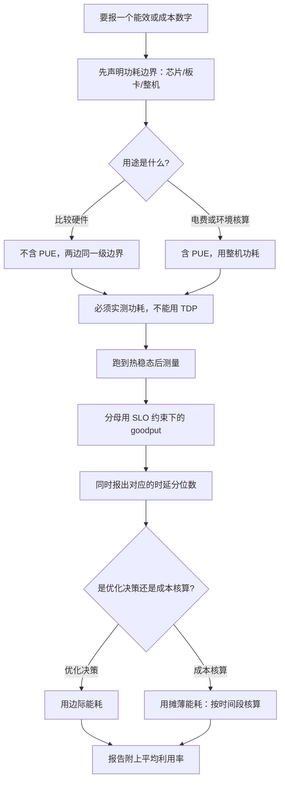

# 功耗、能耗与成本基准

> 位置：[InferenceAtlas](../../INDEX.md) > [模块 11](README.md) > 当前文档
> 信息截至：2026-07-29 ｜ 最后核验：2026-07-29 ｜ 内容版本：v0.1
> 时效性等级：低
> 相关主题：[吞吐与 goodput](04_throughput_concurrency_and_goodput.md)｜[能效与每 token 焦耳](../01_foundations_and_metrics/07_energy_efficiency_and_joules_per_token.md)｜`06_profiling_gpu_cpu_network_and_memory.md`

## 本章导读

能耗与成本的 benchmark 比性能 benchmark 更容易出错，
原因是它多了一层**口径嵌套**：
性能数字只需要说清工作点，
**而能耗数字要同时说清工作点、功耗的测量边界、以及是否含设施开销**。

三个口径问题在实践中反复出现：

**第一，功耗有三级边界**——芯片、板卡、整机。
三者逐级包含更多部件，**用芯片功耗报出的每 token 能耗会系统性偏低**，
因为它不含板上内存、供电转换损耗、主机 CPU 与风扇。

**第二，设施开销要不要计入**取决于用途：
比较硬件效率时不应含，讨论电费或环境影响时必须含。

**第三，也是最容易被利用的一点：每 token 能耗可以通过牺牲时延任意压低**。
它在大批时最优，**所以一个不带时延约束的能效数字没有信息量**——
和吞吐一样，它必须与时延配对报告。

本章给出**三级功耗口径与换算**、
**边际能耗与摊薄能耗的区别**（两者可以差很多，且用途不同）、
**成本的完整拆解**，
以及**为什么提高利用率通常是能效与成本优化中最大的杠杆**。

## 学习目标

读完本章后，读者应能够：

1. 区分芯片、板卡、整机三级功耗口径，并说明各自包含与不包含什么
2. 正确计算每 token 能耗，并说明分子分母的口径为什么必须一致
3. 区分边际能耗与摊薄能耗，并说明各自的适用场景
4. 完整拆解每百万 token 成本，并指出最容易被漏掉的三项
5. 说明为什么提高平均利用率通常是最大的成本杠杆，且它是一个调度问题

## 核心结论

- **功耗必须声明口径**：芯片、板卡、整机三级逐级包含更多部件，用芯片功耗报能耗会系统性偏低。
- **每 token 能耗必须与时延配对报告**：它在大批时最优，可以通过牺牲时延任意压低。
- **边际能耗与摊薄能耗差别很大**：前者用于优化决策，后者用于成本与环境核算；利用率越低两者差距越大。
- **用 TDP 代替实测功耗会高估能耗**，因为实际功耗常低于 TDP 上限。
- **成本最容易被漏掉的三项是：空闲时间、冗余容量、以及非计算成本**（设施、运维、网络与存储）。
- **提高平均利用率通常是最大的成本杠杆**，而它是一个调度与产品决策，不是硬件优化。

## 1. 问题定义、系统边界与工作负载

### 1.1 本章要解决的问题

让「每 token 能耗」与「每百万 token 成本」这两个数字**可比且可复现**。
这需要把测量边界、时延约束与核算方式全部写清。

**本章不涉及**：具体硬件的功耗数字、电价、
或任何厂商能效数据（本库无法核验，见第 5 节）。

### 1.2 三个用途对应三种口径

| 用途 | 需要的口径 | 是否含 PUE |
|---|---|---|
| 比较两款硬件的效率 | 板卡或整机，同一级 | **否** |
| 估算电费 | 整机 | **是** |
| 环境影响核算 | 整机 + 电力结构 | **是** |

**混用是最常见的错误**：
用不含设施开销的数字讨论电费会低估，
用含设施开销的数字比较硬件会引入与硬件无关的变量。

## 2. 原理、数学与性能模型

### 2.1 三级功耗口径

$$
P_{\text{chip}} \;\le\; P_{\text{board}} \;\le\; P_{\text{server}}
$$

| 口径 | 包含 | 不包含 |
|---|---|---|
| 芯片 | 计算芯片本身 | 板上内存、板上供电转换损耗、散热 |
| 板卡 | 芯片 + 板上内存 + 板上供电 | 主机 CPU、系统内存、风扇、存储、网卡 |
| 整机 | 整台服务器（含全部加速卡与主机部件） | 设施侧的制冷与配电损耗 |

再往上一级是设施：

$$
P_{\text{facility}} = P_{\text{server}} \times \text{PUE}
$$

**PUE 恒大于 1**，它是设施总电力与 IT 设备电力之比。

### 2.2 每 token 能耗

$$
E_{\text{tok}} = \frac{P}{\text{有效 token 吞吐}}
$$

单位是「瓦 ÷ (token/秒)」＝「焦耳/token」。

**分子分母的口径必须一致**：
若分子用整机功耗，分母必须是这台整机的总吞吐（含所有卡）；
若分子用单卡板卡功耗，分母就是单卡的吞吐。

**分母用「有效」吞吐（goodput）而非原始吞吐**，
理由与 [第 4 章](04_throughput_concurrency_and_goodput.md) 相同：
违反 SLO 的产出不应计入收益。

### 2.3 能耗随工作点的变化

| 工作点 | 吞吐 | 功耗 | 每 token 能耗 |
|---|---|---|---|
| 大批、算力饱和 | 高 | 高 | **最低** |
| 小批、带宽受限 | 低 | 中（功耗没同比下降） | 高 |
| 空闲但通电 | ≈0 | 有基础功耗 | 趋于无穷 |

**关键性质是功耗的下降慢于吞吐的下降**：
批变小时吞吐大幅下降，
**而设备的静态功耗与内存刷新功耗基本不变**，
所以每 token 能耗上升。

**由此得到与吞吐相同的结论**：
**能效必须与时延配对报告**，
否则它可以通过增大批任意压低——
而那个工作点的时延可能完全不可接受。

**正确的报告形式**：

$$
E^{*} = \min\{\,E_{\text{tok}}(B) \;:\; \text{TPOT}_{p99}(B) \le \text{SLO}\,\}
$$

### 2.4 边际能耗与摊薄能耗

**两者定义不同、用途不同、数值可以差很多**：

| 量 | 定义 | 用途 |
|---|---|---|
| **边际能耗** | 多产生一个 token 的增量能耗 | **优化决策**（这个优化省多少电） |
| **摊薄能耗** | 一段时间的总电力 ÷ 该时段的总 token | **成本与环境核算** |

**两者的关系由利用率决定**。设静态功耗 $P_0$（无论有没有请求都消耗）、
动态功耗随负载变化，平均利用率 $u$，则粗略地：

$$
E_{\text{摊薄}} \approx \frac{E_{\text{边际}} \cdot u + \frac{P_0}{\text{满载吞吐}}}{u}
$$

**定性结论**：**利用率越低，摊薄能耗越高于边际能耗**，
因为静态功耗被更少的 token 分摊。

**这解释了一个重要的实践判断**：
**提高利用率对能效的改善，可能超过任何 kernel 级优化**——
因为它直接改变了静态功耗的分摊。

### 2.5 TDP 不是实测功耗

TDP 是散热设计的上限，**实际运行功耗通常低于它**，
且随工作点变化：

| 工作点 | 相对 TDP |
|---|---|
| 算力饱和 | 接近 TDP |
| 带宽受限（decode 常态） | **明显低于 TDP** |
| 空闲 | 远低于 TDP |

**用 TDP 代替实测会系统性高估能耗**，
在 decode 主导的负载上高估尤其明显。

**因此能耗 benchmark 必须实测功耗**，
而不是用规格表上的 TDP 推算。

## 3. 实现机制与系统设计

### 3.1 功耗测量的三种方式

| 方式 | 边界 | 优点 | 缺点 |
|---|---|---|---|
| 设备自报 | 芯片或板卡 | 易获取、可高频采样 | **边界不含主机部件** |
| 服务器电源读数 | 整机 | 边界清晰 | 采样频率通常较低 |
| 机柜/PDU 读数 | 多机 | 含配电损耗 | 无法归因到单机 |

**推荐组合**：用设备自报做高频的相对变化观察，
**用整机读数做绝对值的核算**。

**采样频率的影响**：推理的功耗随批组成变化而波动，
**低频采样会平滑掉峰值**。
若用于设施容量规划（需要知道峰值），必须用足够的采样率。

### 3.2 能耗测量的流程

```text
1. 固定工作点（模型、量化、长度分布、批策略）
2. 预热到热稳态                    ← 温度影响功耗与频率
3. 同步开始：功耗采样 + 请求计数
4. 运行足够长的窗口（覆盖多个批组成周期）
5. 计算：
     总能量 = ∫ P dt              （用采样求和近似）
     有效 token = 满足 SLO 的输出 token 数
     E_tok = 总能量 / 有效 token
6. 记录：功耗口径、是否含 PUE、时延分位数、样本量
```

**第 2 步不可省略**：
冷机的功耗与频率与热稳态不同
（见 [模块 07 第 2 章](../07_hardware_and_server_architecture/02_gpu_architecture_for_inference.md)），
**未达热稳态的测量会低估功耗、高估性能**。

**第 3 步的「同步」很重要**：
功耗采样窗口与请求计数窗口必须对齐，
**否则会把一段时间的能量除以另一段时间的产出**。

### 3.3 成本的完整拆解

$$
C_{\text{1M}} = \frac{\sum_i C_i \cdot \Delta t}{\text{有效付费 token 数}} \times 10^{6}
$$

**分子的五项**：

| 项 | 内容 | 常见遗漏 |
|---|---|---|
| 硬件摊销 | 加速器与服务器按折旧年限 | **只算加速卡，漏掉主机** |
| 电力 | 整机功耗 × PUE × 电价 × 时间 | 用芯片功耗或不含 PUE |
| 设施 | 机柜空间、制冷设施摊销 | **完全遗漏** |
| 运维 | 人力、监控系统、值班 | **完全遗漏** |
| 网络与存储 | 出网流量、模型存储、日志 | 长上下文场景下不小 |

**云上部署时前三项被打包进实例价格**，
**但运维、网络与存储仍需单独计算**。

**分母的四项扣减**：

| 扣减 | 为什么 |
|---|---|
| 违反 SLO 的产出 | 不是有效交付 |
| 失败与重试消耗 | 消耗资源无产出 |
| 冗余容量 | 不产出但计入成本 |
| 非付费流量（健康检查、金丝雀、内部测试） | 若算「每百万付费 token」则须扣除 |

### 3.4 按时间段核算优于按产能推算

**推荐做法**：分子取一段时间的实际支出，
分母取同一时间段的实际有效产出。

**理由**：这种算法**自动包含了空闲、冗余与失败**，
而按「理论产能」推算会系统性低估成本——
因为它隐含假设了 100% 利用率与零失败。

**两者的差距就是利用率的倒数量级**：
平均利用率 40% 时，
**按理论产能推算的成本约为实际的 40%**——
即低估了 2.5 倍。

### 3.5 报告模板

一份能耗与成本报告应当包含：

```text
口径声明：
  功耗边界（芯片 / 板卡 / 整机）
  是否含 PUE，PUE 取值
  实测还是 TDP 推算            ← 必须是实测
  边际还是摊薄
工作点：
  模型、量化、长度分布、批大小
  对应的 TTFT / TPOT 分位数     ← 必须配对
结果：
  平均功耗、峰值功耗
  有效 token 吞吐（goodput）
  每 token 能耗
  每百万 token 成本（分子五项、分母四项扣减各自列出）
核算方式：
  按时间段核算，窗口长度与平均利用率
```

**「平均利用率」这一行是解读成本数字的钥匙**：
没有它就无法判断这个成本是在什么运行状态下达成的。

## 4. 性能、成本、能耗与可靠性 trade-off

### 4.1 能效与时延

与吞吐完全相同的交换关系：
**大批能效最优、时延最差**。

**因此延迟敏感的在线服务在能效上天然差于批量离线处理**，
这不是实现问题而是工作点决定的。

**混合负载是缓解手段**：
用离线批处理填充在线服务为满足 SLO 而保留的余量，
**整体能效与成本都改善**。

### 4.2 四条成本杠杆的排序

| 杠杆 | 机制 | 典型影响 | 是什么问题 |
|---|---|---|---|
| **提高平均利用率** | 摊薄固定成本与静态功耗 | **通常最大** | **调度与产品** |
| 量化与更小的模型 | 减少每 token 的资源消耗 | 大 | 模型优化 |
| 前缀缓存 | 消除重复 prefill | 中到大 | 系统设计 |
| kernel 与编译优化 | 提高有效利用率 | 中 | 工程 |

**第一行最大也最容易被忽略**，
因为它不是一个技术优化——
**它需要产品与调度层的配合（混合负载、弹性、多租户共享）**。

**在纯工程视角的成本讨论中它经常缺席**，
而实际上把利用率从 40% 提到 80% 就直接把单位成本减半，
**这个幅度往往超过其他三项在同一时间内的总和**。

### 4.3 能效优化与可靠性

主动限制功耗上限会降低峰值性能但让性能更可预测
（见 [模块 07 第 2 章](../07_hardware_and_server_architecture/02_gpu_architecture_for_inference.md)）。

**对 SLO 敏感的服务，「稳定的较低性能」常优于「波动的较高性能」**，
因为容量规划按可保证的性能做，
**波动的峰值无法被计入容量**。

## 5. benchmark、真实案例或公开部署案例

**本章不引用任何具体的功耗、PUE、电价或成本数值**。

受当前环境的网络出口策略限制（详见 [AGENTS.md 第 11 节](../../AGENTS.md)），
本库无法访问任何厂商的功耗规格、设施能效数据或电价信息，
**因此无法核验任何一项**。
**在无可靠来源时写出这类数字属于本库明确禁止的行为**。

**读者应自行填充的能耗与成本表**：

| 项 | 你的值 | 口径说明 |
|---|---|---|
| 功耗测量边界 | 待填 | 芯片 / 板卡 / **整机** |
| 是否含 PUE、PUE 取值 | 待填 | 设施提供 |
| 平均功耗（实测，非 TDP） | 待填 | 热稳态下 |
| 峰值功耗 | 待填 | 采样率要足够 |
| SLO 约束下的 goodput | 待填 | 与时延配对 |
| 每 token 能耗 $E^{*}$ | 待填 | 分子分母口径一致 |
| 边际能耗 | 待填 | 用于优化决策 |
| 摊薄能耗 | 待填 | 用于成本核算 |
| **平均利用率** | 待填 | **解读上面两行差距的钥匙** |
| 每百万 token 成本（五项分子） | 待填 | 逐项列出 |
| 分母的四项扣减 | 待填 | 逐项列出 |

**「边际能耗与摊薄能耗的差距」这一对数字最有诊断价值**：
差距大说明利用率低，
**而这指向的优化方向是调度而不是硬件或 kernel**。

> 实验方法论要求见 [如何读推理 benchmark](../00_start_here/03_how_to_read_inference_benchmarks.md)。

## 6. 设计决策框架



**图解读**：

1. **本图展示什么**：能效与成本数字的口径决策链。
   起点是功耗边界，中间按用途分叉（含不含 PUE、边际还是摊薄），
   终点统一要求附上平均利用率。
2. **核心瓶颈**：瓶颈在 F 节点「必须实测功耗」。
   **用 TDP 推算是最常见的捷径**，
   而它会系统性高估——尤其在 decode 主导的负载上，
   因为那时实际功耗明显低于 TDP。
3. **图中的 trade-off**：G 节点的热稳态要求会拉长测量时间。
   **但冷机测量会同时低估功耗与高估性能**，
   两个方向的误差叠加，结果偏差很大。
4. **面试如何引用**：可以说
   「报能效数字前我会先声明是芯片、板卡还是整机功耗、
   是否含 PUE、以及对应的时延——
   **因为每 token 能耗可以通过增大批任意压低**」。

**M 节点（附上平均利用率）不可省略**：
它是区分「这个系统效率高」与「这个系统当时跑得很满」的唯一依据。

## 7. 常见失败模式与排查路径

| 症状 | 根因 | 修正 |
|---|---|---|
| 两份能效报告差数倍 | 功耗边界不同 | 统一到整机或同一级 |
| 能效数字很好但时延不可接受 | 在大批工作点测的 | 与时延配对，用 $E^{*}$ |
| 实测成本远高于预算 | 按理论产能推算，忽略了空闲与冗余 | 改按时间段核算 |
| 能耗比预期高 | 用了 TDP 而非实测 | 实测功耗 |
| 冷机测量与生产不符 | 未达热稳态 | 预热后再测 |
| 优化了 kernel 但成本几乎没降 | 主要成本来自低利用率 | 先看边际与摊薄能耗的差距 |
| 峰值功耗估计不足导致机柜跳闸 | 采样频率太低平滑了峰值 | 提高采样率 |

**排查顺序**：**先核对口径，再看是否实测与热稳态，最后看利用率**。

## 8. 关联面试主题

1. 每 token 能耗怎么算、口径怎么统一——见 [Q082](../17_interview_prep/06_hardware_and_datacenter_questions.md)
2. 每百万 token 成本的完整拆解——见 [Q085](../17_interview_prep/06_hardware_and_datacenter_questions.md)
3. 为什么「算力/功耗」是错误的能效口径——见 [Q011](../17_interview_prep/01_inference_system_design.md)
4. 推理成本下降的四条驱动线——见 [Q099](../17_interview_prep/08_company_paper_and_strategy_questions.md)
5. 降频对容量规划的影响——见 [Q083](../17_interview_prep/06_hardware_and_datacenter_questions.md)

## 9. 小结

能耗与成本 benchmark 比性能 benchmark 多一层口径嵌套，
因此更容易出错。本章的四条主线：

**第一，功耗有三级边界**——芯片、板卡、整机——
**逐级包含更多部件，用芯片功耗报能耗会系统性偏低**。
再往上乘 PUE 才是设施侧的电力。
**比较硬件时不应含 PUE，讨论电费时必须含**。

**第二，能效必须与时延配对**。
每 token 能耗在大批时最优，
**可以通过牺牲时延任意压低**——
所以一个不带时延约束的能效数字没有信息量。
正确的形式是「SLO 约束下的最优能效」。

**第三，边际能耗与摊薄能耗是两个不同的量**。
前者用于优化决策，后者用于成本与环境核算，
**而两者的差距由利用率决定**。
差距大本身就是一个诊断信号——
**它说明优化方向在调度而不在硬件或 kernel**。

**第四，成本应当按时间段核算而不是按理论产能推算**。
按时间段核算自动包含了空闲、冗余与失败；
**按理论产能推算会系统性低估，低估的倍数大致就是利用率的倒数**。

一条贯穿的实践结论：**提高平均利用率通常是最大的成本与能效杠杆**，
它直接摊薄固定成本与静态功耗。
**而它是一个调度与产品决策，不是硬件或 kernel 优化**——
这也是它在纯工程视角的讨论中经常缺席的原因。

本章不给出任何具体的功耗、PUE、电价或成本数值——当前环境无法核验。
第 5 节给出的是一份填充模板。

## 关键术语

| 中文术语 | 英文 | 定义 | 单位/口径 | 关联文档 |
|---|---|---|---|---|
| 三级功耗口径 | chip/board/server power | 逐级包含更多部件的三种功耗定义 | 瓦 | 本章 2.1 |
| 设施能效比 | PUE | 设施总电力与 IT 设备电力之比 | 无量纲 | 本章 2.1 |
| 每 token 能耗 | joules per token | 产生一个 token 消耗的电能 | 焦耳/token | 本章 2.2 |
| 边际能耗 | marginal energy | 多产生一个 token 的增量能耗 | 焦耳/token | 本章 2.4 |
| 摊薄能耗 | amortized energy | 时段总电力除以时段总 token | 焦耳/token | 本章 2.4 |
| 按时间段核算 | period-based accounting | 用实际支出除以同期实际产出 | — | 本章 3.4 |

## 延伸阅读

- [能效与每 token 焦耳](../01_foundations_and_metrics/07_energy_efficiency_and_joules_per_token.md)
- [成本建模与单位经济学](../01_foundations_and_metrics/06_cost_modeling_and_unit_economics.md)
- [容量规划](../01_foundations_and_metrics/08_capacity_planning.md)
- [吞吐、并发与 goodput](04_throughput_concurrency_and_goodput.md)
- [面向推理的 GPU 架构](../07_hardware_and_server_architecture/02_gpu_architecture_for_inference.md)

## 主要来源

本章由 [模块 01 第 6–8 章](../01_foundations_and_metrics/06_cost_modeling_and_unit_economics.md) 的成本与能耗模型、
以及 [模块 07 第 1–2 章](../07_hardware_and_server_architecture/01_ai_inference_hardware_overview.md) 的功耗口径整理而成。

**不含任何需要外部核验的功耗、PUE、电价或成本数值**。
受当前环境的网络出口策略限制，本库无法访问厂商功耗规格或设施能效数据
（详见 [AGENTS.md 第 11 节](../../AGENTS.md)）。

| 类别 | 说明 | 披露标签 |
|---|---|---|
| 三级口径、边际与摊薄、成本拆解、按时间段核算 | 由模块 01、07 推导 | — |
| 测量流程与报告模板 | 由口径分析整理 | — |
| 读者自行测量的功耗与成本 | 应自行测量与核算 | `独立可复现实验` |
| 任何具体的功耗、PUE、电价与成本数值 | **本章未给出** | `待核实` |

## 更新记录

| 日期 | 版本 | 变更 | 核验人 |
|---|---|---|---|
| 2026-07-29 | v0.1 | 初稿：三级功耗口径、能效与时延配对、边际与摊薄能耗、按时间段核算 | — |
