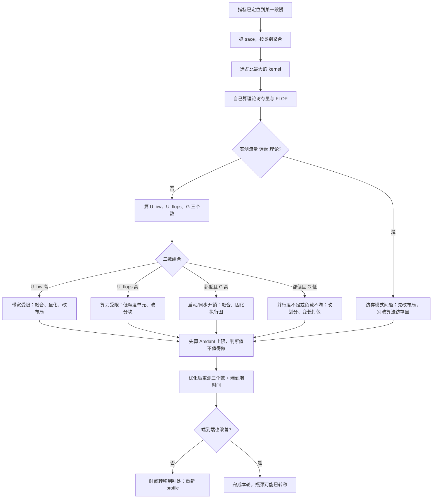

# 全栈 profiling：加速器、主机、网络与内存

> 位置：[InferenceAtlas](../../INDEX.md) > [模块 11](README.md) > 当前文档
> 信息截至：2026-07-29 ｜ 最后核验：2026-07-29 ｜ 内容版本：v0.1
> 时效性等级：低
> 相关主题：[可观测性](07_observability_metrics_logs_traces.md)｜[编译器调试与 profiling](../04_compilers_runtimes_and_kernels/11_compiler_debugging_and_profiling.md)｜`09_reliability_incidents_and_capacity_failures.md`

## 本章导读

指标告诉你「哪一段慢」，profiling 告诉你「那一段里的时间花在哪」。
两者是接力关系：**没有指标就不知道该 profile 什么，
没有 profile 就无法把「decode 慢」变成「某个 kernel 的访存模式有问题」**。

推理 profiling 的核心动作只有一个：
**把 profiler 报出的相对百分比换算成绝对的带宽与算力数字**。
原因是百分比无法区分三类瓶颈——
一个「利用率 95%」的 kernel 可能在跑满算力，
也可能在跑满带宽而算力空转，
**而这两种情况的优化方向完全相反**。

本章给出**三分诊断法**（算力受限 / 带宽受限 / 延迟受限）、
**「两者都低」时的四种细分**（这是 decode 阶段最常见也最容易漏诊的情形）、
**主机侧与网络侧的 profiling 要点**，
以及**在生产环境做 profiling 的约束与安全做法**。

一条贯穿全章的提醒：**GPU 利用率在整个流程里没有位置**。
它只回答「有没有 kernel 在跑」，
**在四种「两者都低」的情形里它都可以接近 100%**。

## 学习目标

读完本章后，读者应能够：

1. 把 profiler 的输出换算成实测带宽与实测算力两个绝对量
2. 用三分诊断法判断一个 kernel 受什么限制，并给出对应的优化方向
3. 在「算力与带宽都低」时进一步细分为四种原因并给出各自判据
4. 判断主机侧（CPU、数据准备、采样）是否成为瓶颈
5. 在生产环境安全地做 profiling，并说明观察者效应的影响

## 核心结论

- **profiling 的第一动作是换算成绝对量**：实测带宽与实测算力；百分比无法区分三类瓶颈。
- **必须自己按算法算出理论访存量**，与 profiler 报的实际流量对比——实际远超理论说明访存模式有问题，此时优化算法访存量是白做的。
- **decode 阶段最常见的情形是「算力与带宽都低」**，即延迟受限；只做算力/带宽二分会漏掉它。
- **「两者都低」有四种原因**：并行度不足、kernel 太短、同步串行化、负载不均；四者的判据与修正各不相同。
- **主机侧可能是瓶颈**：采样、请求组装、tokenize 与调度决策都在 CPU 上，而它们与设备计算竞争同一个关键路径。
- **验证优化时必须同时看单 kernel 时间与端到端时间**，否则会把「时间转移到别处」当成优化成功。

## 1. 问题定义、系统边界与工作负载

### 1.1 profiling 在排查链中的位置

```text
告警（SLO 达成率下降）
    ↓
指标分诊（哪一段：排队 / prefill / decode / 中断）
    ↓
profiling（这一段里时间花在哪）      ← 本章
    ↓
定位到具体 kernel 或主机函数
    ↓
优化并验证
```

**profiling 的成本远高于指标**，所以它应当是被指标引导的、
**针对性的动作，而不是常态开启的采集**。

### 1.2 四个可能的瓶颈位置

| 位置 | 典型问题 | 主要工具 |
|---|---|---|
| 加速器 | kernel 效率、访存模式、并行度 | 设备 profiler / kernel trace |
| 主机 | 采样、tokenize、调度、数据搬运 | CPU profiler / 火焰图 |
| 网络 | 集合通信、KV 传输 | 通信库统计 / 时间线对齐 |
| 内存 | 碎片、分配抖动、换入换出 | 分配器统计 / 占用曲线 |

**四者要一起看**，因为时间可能在它们之间转移：
优化了 kernel 之后瓶颈可能移到主机侧，
**而如果只 profile 加速器，会看到「kernel 变快了但端到端没变」这个令人困惑的结果**。

### 1.3 本章不涉及

具体 profiler 工具的使用方法与选项
（受出口策略限制无法核验，见第 5 节），
kernel 的具体优化技术（见 [模块 04](../04_compilers_runtimes_and_kernels/)）。

## 2. 原理、数学与性能模型

### 2.1 把百分比换算成绝对量

对一个 kernel，需要两个绝对量：

$$
\text{BW}_{\text{achieved}} = \frac{\text{访存字节数}}{\text{执行时间}}, \qquad
\text{FLOPS}_{\text{achieved}} = \frac{\text{浮点运算数}}{\text{执行时间}}
$$

分别除以设备标称值得到两个利用率。

**关键要求：访存字节数与 FLOP 数应当由你自己按算法算出**，
而不是只看 profiler 报的数字。原因是两者的差异本身是一个诊断信号：

| 观察 | 含义 |
|---|---|
| 实际流量 ≈ 理论访存量 | 访存模式良好 |
| **实际流量 ≫ 理论访存量** | **重复读取或非合并访问** |
| 实际流量 < 理论访存量 | 缓存命中（正常，说明有复用） |

**第二行是一个重要发现**：如果算法只需要读 $X$ 字节而实测流量是数倍于 $X$，
**那么「减少算法访存量」的优化是白做的**——
应该先修访存模式（数据布局、访问顺序）。

### 2.2 三分诊断

| 观察 | 结论 | 优化方向 |
|---|---|---|
| 带宽利用率高、算力低 | **带宽受限** | 减少字节：融合、量化、改布局 |
| 算力利用率高、带宽低 | **算力受限** | 低精度单元、更好的分块与流水 |
| **两者都低** | **延迟受限或其他** | 见 2.3 |

**推理场景下的先验**：

- **prefill**：批中 token 数大，算术强度高 → 通常算力受限；
- **decode**：批等于在飞请求数，算术强度约 $2B/b_w$ → 通常带宽受限；
- **decode 的小 kernel**：单个 kernel 处理的数据量小 → **常常延迟受限**。

**第三条是最容易被忽略的**。

### 2.3 「两者都低」的四种细分

这是 decode 阶段最常见的情形，四种原因的判据与修正：

**（一）并行度不足**。

启动的并行工作单元数少于设备的执行单元数，
**设备有一部分完全空闲**。

判据：比较 kernel 的启动配置（线程块数 × 每块线程数）
与设备的执行单元数。**decode 时张量很小，容易出现这种情况**。

修正：改并行划分方式。例如注意力 kernel 除了按批与头切分，
**还可以沿 KV 长度方向再切分并做在线 softmax 合并**
（见 [第 10 章的 E2](../17_interview_prep/10_coding_exercises.md)）——
这正是分段注意力在 decode 阶段的价值。

**（二）kernel 太短，启动开销占比高**。

判据：单 kernel 执行时间与启动开销同量级；
trace 上相邻 kernel 之间有系统性的空隙。

修正：算子融合（减少 kernel 数）、
执行图固化（减少每次的提交开销）。
**两者正交，可以叠加**（见 [Q048](../17_interview_prep/04_compiler_kernel_and_quantization_questions.md)）。

**（三）同步或依赖串行化**。

判据：trace 上有显式同步点、
或主机与设备之间的往返（例如把中间结果拷回主机做判断）。

修正：去掉不必要的同步、把主机侧决策提前、
用异步拷贝与多流重叠。

**推理中一个常见来源是采样**：
如果每步都要把 logits 拷回主机采样再拷回去，
**这个往返会成为每步的固定开销**。

**（四）负载不均或分支分歧**。

判据：同一 kernel 内不同执行单元的耗时差异大。

**推理中的典型来源是变长序列被填充到同一长度**——
填充部分的计算是浪费但仍占用执行单元。

修正：变长打包、按长度分组批处理。

### 2.4 三个诊断量的组合

把上面归纳成三个数字，它们的组合唯一确定诊断：

$$
(U_{\text{bw}},\; U_{\text{flops}},\; G)
$$

其中 $G$ 是 kernel 之间空隙占总时间的比例。

| $U_{\text{bw}}$ | $U_{\text{flops}}$ | $G$ | 诊断 |
|---|---|---|---|
| 高 | 低 | 低 | 带宽受限 |
| 低 | 高 | 低 | 算力受限 |
| 低 | 低 | **高** | 启动/同步开销 |
| 低 | 低 | 低 | 并行度不足或负载不均 |

**最后两行的区分靠 $G$**：
如果时间花在 kernel 之间，是提交开销；
**如果时间花在 kernel 内部但两个利用率都低，是 kernel 内部的问题**
（并行度或负载不均）。

**这三个数字应当是每次 profiling 的第一批产出**。

### 2.5 主机侧的成本模型

一步 decode 的主机侧工作包括：
批组装、采样参数张量化、采样、
检查停止条件、以及流式输出的序列化与发送。

设主机侧单步耗时 $\tau_{\text{host}}$、设备侧 $\tau_{\text{dev}}$。
**如果两者不能重叠**，单步时间是两者之和；
**如果能重叠（主机为下一步做准备的同时设备在算当前步）**，
单步时间是 $\max(\tau_{\text{host}}, \tau_{\text{dev}})$。

**判据**：如果 $\tau_{\text{host}} > \tau_{\text{dev}}$，
**主机是瓶颈，优化设备侧 kernel 完全无效**。

**这种情况在小批 decode 下并不罕见**，
因为设备侧的工作量随批下降，
**而主机侧的固定开销（调度决策、Python 层开销）不随批下降**。

## 3. 实现机制与系统设计

### 3.1 profiling 的标准流程

```text
1. 先用指标定位到段（prefill / decode / 通信）
2. 抓一步（或若干步）的完整 trace
3. 按 kernel 类别聚合，找出占比最大的几个
4. 对每个候选 kernel：
     a. 自己算出理论访存量与 FLOP 数
     b. 除以实测时间，得到 U_bw 与 U_flops
     c. 计算 kernel 间空隙占比 G
     d. 按 2.4 的表诊断
5. 检查主机侧：τ_host 与 τ_dev 的关系
6. 优化并重测同样的三个数字
7. 同时验证端到端时间是否改善
```

**第 4a 步是最容易被跳过的**，
而跳过它就退化成了「看百分比猜原因」。

**第 7 步同样关键**：常见的假成功是
**「kernel 时间下降了但整步时间没变」**——
说明时间只是转移到了别处，或者这个 kernel 本来就不在关键路径上。

### 3.2 decode 单步的典型结构

一步 decode 包含数百到上千个 kernel，
**按类别聚合后通常只有少数几类占大头**：

| 类别 | 典型特征 | 常见问题 |
|---|---|---|
| 线性层 GEMM | 数量多、单个短 | 小批下算术强度极低 |
| 注意力 | 与 KV 长度成正比 | 长上下文下占比上升 |
| 逐元素与归一化 | 数量最多、单个最短 | **融合的主要目标** |
| 集合通信 | 每层若干次 | 小消息下由延迟支配 |
| 采样与后处理 | 每步一次 | 可能涉及主机往返 |

**聚合的价值在于它把上千个 kernel 变成五行**，
从而能快速判断该往哪个方向深入。

### 3.3 通信的 profiling

分布式部署下必须把通信单独看。三个要点：

**（一）区分「通信慢」与「等待慢」**。
同步集合通信要求所有参与方到齐，
**所以一个实例慢会让其他实例在通信处等待**，
表现为所有实例的通信时间都长。

**判据是看各实例进入通信调用的时刻**：

- 几乎同时进入、然后一起花很久 → **真的是通信慢**；
- 大部分早早进入并等待，少数很晚才到 → **是那少数实例慢**。

**这需要跨设备对齐的时间戳**——
**没有这个能力，分布式性能问题基本无法定位**，
这本身就是一个应当在基础设施上先解决的前提。

**（二）判断是带宽还是延迟支配**。
把消息大小除以链路带宽，与实测通信时间比较：
**若理论传输时间远小于实测，说明由固定延迟支配**，
此时优化方向是减少通信次数而不是提高带宽。

**（三）区分集合通信与点对点 KV 传输**。
两者的特征相反：集合通信是小消息、延迟敏感、在关键路径；
**KV 传输是大消息、带宽敏感、可与计算重叠**。
**混在一起看会得出错误结论**。

### 3.4 内存的 profiling

三类问题：

| 问题 | 症状 | 检查 |
|---|---|---|
| 碎片 | 有空闲但分配失败 | 分配器的空闲块分布 |
| 分配抖动 | 频繁分配释放导致开销 | 分配调用频率 |
| 泄漏 | 占用随时间单调上升 | 长时运行的占用曲线 |

**推理服务的一个特有检查是 KV 占用与在飞请求数的关系**：
两者应当大致成正比。
**若占用远高于按在飞请求估算的值，说明有 KV 未被及时释放**——
这可能是请求异常终止时的清理路径有问题。

### 3.5 生产环境的 profiling

**观察者效应是真实的**：开启详细 profiling 会改变系统行为
（额外的同步、数据采集开销），
**一个原本正常的系统可能因此变慢，从而干扰判断**。

**安全做法，四条**：

1. **先在影子流量或压测环境复现**，能复现就不要动生产；
2. **必须在生产做时，限制在少数实例上**，
   并把它们从正常流量中摘出或降低权重；
3. **限时开启**，并且开关必须是配置驱动、无需重启的；
4. **记录「profiling 已开启」这个状态**，
   否则后续看到的指标异常可能被误判为系统问题。

**第四条常被忽略但很重要**：
**一个正在被 profile 的实例的指标不应当参与告警判断**。

## 4. 性能、成本、能耗与可靠性 trade-off

### 4.1 profiling 深度与开销

| 深度 | 开销 | 能得到 |
|---|---|---|
| kernel 名与耗时 | 低 | 按类别聚合、找出占比大的 |
| + 启动配置与访存计数 | 中 | 三分诊断所需的绝对量 |
| + 指令级采样 | **高** | kernel 内部的细节 |

**多数问题在第二层就能定位**。
第三层通常只在自己写 kernel 时才需要。

### 4.2 优化的投入产出

在决定优化一个 kernel 之前，先算 Amdahl 上限：

$$
\text{整体上限} = \frac{1}{(1-f) + f\cdot r}
$$

其中 $f$ 是该 kernel 占单步时间的比例、
$r$ 是优化后的相对耗时。

**举例**：一个占单步 15% 的 kernel 即使优化到零，
整体上限也只有 $1/0.85 \approx 1.18$ 倍。
**先算这个数能避免在低价值目标上投入**。

### 4.3 优化后瓶颈会转移

**这是 profiling 的一个常态而不是意外**：
优化了带宽受限的 kernel 之后，
它可能变成延迟受限；
优化了设备侧之后，主机侧可能成为瓶颈。

**因此优化应当是迭代的**：每轮优化后重新 profile，
**而不是一次性列出所有优化点然后全部实施**——
后者会在瓶颈转移后做无用功。

## 5. benchmark、真实案例或公开部署案例

**本章不引用任何具体 profiler 工具的能力、选项或输出格式**。

受当前环境的网络出口策略限制（详见 [AGENTS.md 第 11 节](../../AGENTS.md)），
本库无法访问任何 profiling 工具的文档，
**因此不描述任何具体工具的使用方法**。
本章给出的是**与工具无关的诊断方法**——
任何能提供「kernel 名、耗时、启动配置、访存计数」的工具都可以套用。

**读者应自行完成的 profiling 记录表**（对一步 decode）：

| 项 | 值 | 怎么得到 |
|---|---|---|
| 单步总时间 | 待填 | 端到端计时 |
| kernel 总数 | 待填 | trace 条目计数 |
| 按类别的时间占比（GEMM / 注意力 / 逐元素 / 通信 / 采样） | 待填 | 聚合 |
| 占比最大的三个 kernel | 待填 | 排序 |
| 对每个：理论访存量、实测流量、$U_{\text{bw}}$、$U_{\text{flops}}$ | 待填 | **自己算 + profiler** |
| kernel 间空隙占比 $G$ | 待填 | trace 上相邻 kernel 的间隔求和 |
| 主机侧单步耗时 $\tau_{\text{host}}$ | 待填 | CPU profiler |
| 是否有主机-设备往返 | 待填 | trace 上的拷贝与同步 |

**「理论访存量」这一列是最有价值也最常被跳过的**——
它是判断访存模式是否有问题的唯一途径。

> 实验方法论要求见 [如何读推理 benchmark](../00_start_here/03_how_to_read_inference_benchmarks.md)。

## 6. 设计决策框架



**图解读**：

1. **本图展示什么**：从 trace 到诊断到验证的完整闭环。
   核心是 D→E 的理论访存量对比与 G→H 的三数诊断。
2. **核心瓶颈**：瓶颈在 D 节点「自己算理论访存量」。
   **跳过它就无法区分「算法访存多」与「访存模式差」**，
   而这两者的修正完全不同——
   对后者做算法优化是纯浪费。
3. **图中的 trade-off**：M 节点的 Amdahl 检查会「劝退」一些优化。
   **这正是它的价值**：一个占单步 15% 的 kernel 即使优化到零，
   整体上限也不到 1.2 倍。
4. **面试如何引用**：可以说
   「我会先按类别聚合找出大头，
   然后自己算理论访存量与实测流量对比——
   **如果实测远超理论，问题在访存模式而不在算法**；
   再用带宽利用率、算力利用率、kernel 间空隙这三个数做三分诊断」。

**O→P 分支是这张图不可省略的部分**：
**「kernel 变快但端到端没变」是最常见的假成功**，
它说明时间转移了或者优化的 kernel 不在关键路径上。

## 7. 常见失败模式与排查路径

| 症状 | 根因 | 修正 |
|---|---|---|
| 只看 profiler 百分比，判断不了瓶颈 | 未换算成绝对量 | 算实测带宽与算力 |
| 优化了算法访存量但没效果 | 真实问题是访存模式 | 先比理论流量与实测流量 |
| 「两者都低」时无法继续 | 只会算力/带宽二分 | 用 $G$ 细分四种原因 |
| kernel 变快但端到端没变 | 时间转移或不在关键路径 | 同时验证端到端 |
| 优化了设备侧仍然慢 | 主机侧是瓶颈 | 比较 $\tau_{\text{host}}$ 与 $\tau_{\text{dev}}$ |
| 分布式下认定「网络慢」但换网络无效 | 实为某实例慢，通信只是等待 | 看各实例进入通信的时刻 |
| 生产 profiling 后指标异常 | 观察者效应 | 摘除该实例、限时开启、记录状态 |
| 优化清单做完收益远低于预期 | 瓶颈在中途转移 | 每轮优化后重新 profile |

**排查顺序**：**先换算绝对量，再比理论与实测流量，
再用三数诊断，最后验证端到端**。

## 8. 关联面试主题

1. 一个 kernel 慢了怎么用 profile 定位——见 [Q055](../17_interview_prep/04_compiler_kernel_and_quantization_questions.md)
2. 怎么判断算力受限还是带宽受限——见 [Q045](../17_interview_prep/04_compiler_kernel_and_quantization_questions.md)
3. 分布式下区分通信慢与实例慢——见 [Q076](../17_interview_prep/05_distributed_and_moe_questions.md)
4. 执行图固化解决什么问题——见 [Q048](../17_interview_prep/04_compiler_kernel_and_quantization_questions.md)
5. 算子融合的收益上限——见 [Q046](../17_interview_prep/04_compiler_kernel_and_quantization_questions.md)

## 9. 小结

profiling 的核心动作是**把相对百分比换算成绝对的带宽与算力数字**，
因为百分比无法区分三类瓶颈，而三者的优化方向完全相反。

**本章的四条主线**：

**第一，理论与实测的对比是一个独立的诊断信号**。
自己按算法算出访存量，与 profiler 报的实际流量比较：
**实际远超理论说明访存模式有问题**，
此时优化算法访存量是白做的——应该先改数据布局。
**这一步最常被跳过，因为它需要动手算而不只是读数字**。

**第二，「两者都低」不是诊断的终点而是起点**。
decode 阶段最常见的恰恰是这种情形，
而它有四种原因——并行度不足、kernel 太短、
同步串行化、负载不均——
**靠 kernel 间空隙占比 $G$ 可以把它们二分**。

**第三，瓶颈会在优化后转移**。
这是常态不是意外，
**所以优化必须是「优化一轮、重测一轮」的迭代**，
而不是一次列出全部优化点然后全部实施。
同时验证必须包含端到端时间——
**「kernel 变快但端到端没变」是最常见的假成功**。

**第四，主机侧不能被忽略**。
设备侧工作量随批下降而主机侧固定开销不随批下降，
**所以小批 decode 下主机侧成为瓶颈并不罕见**，
此时优化 kernel 完全无效。

本章不描述任何具体 profiler 工具——当前环境无法核验它们的能力。
给出的方法与工具无关：**任何能提供 kernel 名、耗时、
启动配置与访存计数的工具都可以套用这套诊断**。

## 关键术语

| 中文术语 | 英文 | 定义 | 单位/口径 | 关联文档 |
|---|---|---|---|---|
| 实测带宽利用率 | achieved bandwidth utilization | 实际访存率与标称带宽之比 | 无量纲比例 | 本章 2.1 |
| kernel 间空隙占比 | inter-kernel gap ratio | 相邻 kernel 之间空闲时间占总时间的比例 | 无量纲比例 | 本章 2.4 |
| 三分诊断 | three-way bottleneck diagnosis | 按算力/带宽/延迟三类判定瓶颈 | — | 本章 2.2 |
| 并行度不足 | insufficient parallelism | 工作单元数少于设备执行单元数 | — | 本章 2.3 |
| 观察者效应 | observer effect | profiling 本身改变被测系统行为 | — | 本章 3.5 |
| 瓶颈转移 | bottleneck migration | 优化一处后瓶颈移到另一处 | — | 本章 4.3 |

## 延伸阅读

- [编译器调试与 profiling](../04_compilers_runtimes_and_kernels/11_compiler_debugging_and_profiling.md)
- [可观测性：指标、日志与 trace](07_observability_metrics_logs_traces.md)
- [roofline 与性能建模](../01_foundations_and_metrics/04_roofline_and_performance_modeling.md)
- [内存带宽与算术强度](../01_foundations_and_metrics/05_memory_bandwidth_and_arithmetic_intensity.md)
- [算子融合与优化](../04_compilers_runtimes_and_kernels/07_kernel_fusion_and_operator_optimization.md)
- [CUDA Graph 与执行开销](../04_compilers_runtimes_and_kernels/10_cuda_graphs_and_execution_overhead.md)

## 主要来源

本章由 [模块 04 第 11 章](../04_compilers_runtimes_and_kernels/11_compiler_debugging_and_profiling.md) 的排查流程、
[模块 01 第 4–5 章](../01_foundations_and_metrics/04_roofline_and_performance_modeling.md) 的 roofline 模型、
以及 [模块 06 第 11 章](../06_distributed_and_moe_inference/11_distributed_serving_case_studies.md) 的分布式诊断整理而成。

**不含任何需要外部核验的 profiler 工具信息**。
受当前环境的网络出口策略限制，本库无法访问任何 profiling 工具的文档
（详见 [AGENTS.md 第 11 节](../../AGENTS.md)），
因此本章只给与工具无关的诊断方法。

| 类别 | 说明 | 披露标签 |
|---|---|---|
| 三分诊断、四种细分、主机侧模型、Amdahl 检查 | 由模块 01、04、06 推导 | — |
| 生产 profiling 的安全做法 | 由观察者效应推导 | — |
| 读者自行采集的 profiling 记录 | 应自行测量 | `独立可复现实验` |
| 任何具体 profiler 工具的能力与用法 | **本章未给出** | `待核实` |

## 更新记录

| 日期 | 版本 | 变更 | 核验人 |
|---|---|---|---|
| 2026-07-29 | v0.1 | 初稿：绝对量换算、三分诊断、「两者都低」的四种细分与生产 profiling 约束 | — |
