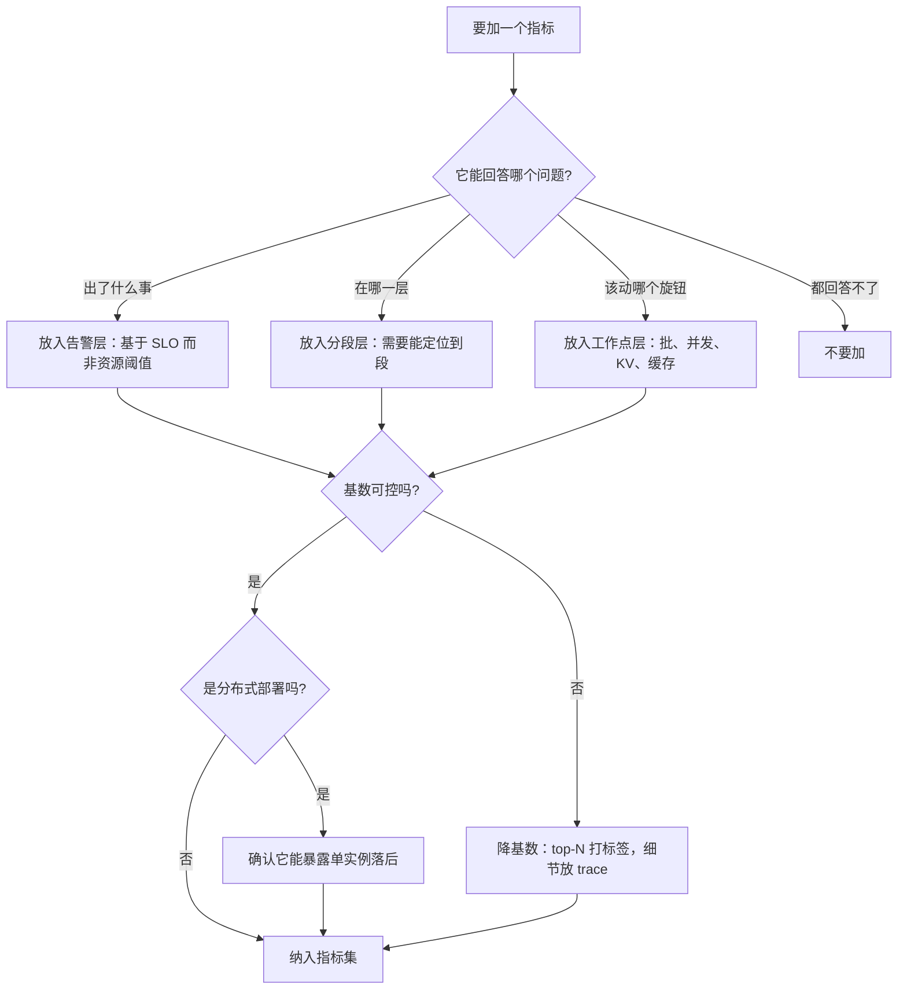

# 可观测性：指标、日志与 trace

> 位置：[InferenceAtlas](../../INDEX.md) > [模块 11](README.md) > 当前文档
> 信息截至：2026-07-29 ｜ 最后核验：2026-07-29 ｜ 内容版本：v0.1
> 时效性等级：低
> 相关主题：[时延指标定义](03_ttft_tpot_itl_and_end_to_end_latency.md)｜[吞吐与 goodput](04_throughput_concurrency_and_goodput.md)｜`08_slos_slas_and_error_budgets.md`

## 本章导读

可观测性的目标可以用一句话概括：
**当系统在生产中劣化时，需要哪些信号才能在数分钟内定位到层**。

推理服务的可观测性与传统 Web 服务有三个结构性差异，
它们决定了直接套用通用监控方案会失效：

**第一，最常用的资源指标是失真的**。
GPU 利用率在 decode 阶段常年接近 100% 而算力在空转
（因为带宽受限），
**所以它既不能判断瓶颈类型，也不能作为扩缩容信号**——
而它恰恰是大多数监控面板上最显眼的那个数字。

**第二，请求的成本高度不均**。
一个请求可能消耗另一个的数百倍资源，
**所以按请求计数的指标（QPS、错误率）远不足以描述系统状态**，
必须有按 token 与按 KV 占用的视角。

**第三，质量劣化不产生任何错误信号**。
系统返回 200、返回流畅的文本、延迟正常——
**只是内容变差了**。这类问题在传统监控里完全不可见。

本章给出**一个十六项的最小指标集**（分五组）、
**一份应当被排除的指标清单及其理由**、
**分层采集策略**，以及**从告警到定位的信号链设计**。
核心判断是：**指标的价值不在于「有多少」，而在于「能不能在三个问题上给出答案」**——
出了什么事、在哪一层、该动哪个旋钮。

## 学习目标

读完本章后，读者应能够：

1. 列出推理服务的最小可观测性指标集，并说明每一项为什么必需
2. 说明为什么 GPU 利用率、平均时延、孤立吞吐三个常见指标应当被排除
3. 设计分层采集策略，并说明「事故时临时提高采样率」这一能力为什么必须事先具备
4. 为分布式部署设计能暴露「单实例落后」的指标
5. 说明质量信号为什么必须被主动设计，以及最低限度应当采集什么

## 核心结论

- **GPU 利用率不应作为核心指标**：它只表示「有 kernel 在执行」，在 decode 的带宽受限区与延迟受限区都可以接近 100%；应改用实测带宽利用率。
- **实际批大小的分布是必需项**：配置的最大批没有信息量，而实际工作点决定了系统处在带宽受限还是算力受限区。
- **分位数必须带样本量与观测窗口**，且不能跨窗口平均——平均分位数没有统计意义。
- **分布式部署必须有「各实例单步时间的最大值/中位数比」**：同步通信会把「一个实例慢」伪装成「通信慢」，而这在聚合指标里完全不可见。
- **质量信号必须被主动采集**：质量回归不产生任何错误信号，因此监控上不主动做就等于没有。
- **「事故时临时提高采样率」的能力必须事先具备**：事故中才加打点来不及，而且加打点本身会改变系统行为。

## 1. 问题定义、系统边界与工作负载

### 1.1 可观测性要回答的三个问题

一套指标体系的价值由它能否回答下面三个问题决定：

| 问题 | 需要什么 | 时间要求 |
|---|---|---|
| **出了什么事** | SLO 达成率、错误与拒绝分类 | 秒级告警 |
| **在哪一层** | 分段时延、各层的资源指标 | 分钟级定位 |
| **该动哪个旋钮** | 工作点指标（批、并发、KV 占用） | 定位后立即可读 |

**第三个问题最容易被忽略**。
很多监控体系能告诉你「变慢了」和「decode 慢」，
**但答不出「该把哪个参数往哪个方向调」**——
因为缺少工作点指标。

### 1.2 三类信号的分工

| 类型 | 特征 | 在推理服务中的角色 |
|---|---|---|
| **指标（metrics）** | 聚合、低成本、可长期保留 | 告警与趋势；**主力** |
| **日志（logs）** | 逐事件、成本中等 | 错误细节、审计 |
| **trace** | 逐请求逐阶段、成本高 | **定位到段**；采样使用 |

**推理服务的特殊之处是 trace 的价值特别高**，
因为时延由四段组成且每段的根因不同
（见 [第 3 章](03_ttft_tpot_itl_and_end_to_end_latency.md)）。
**没有分段 trace，排查只能靠猜**。

### 1.3 与传统服务的三个差异

已在导读中说明，此处给出对指标设计的具体影响：

| 差异 | 对指标的要求 |
|---|---|
| 资源指标失真 | 用实测带宽/算力利用率替代 GPU 利用率 |
| 请求成本高度不均 | 除请求计数外必须有 token 与 KV 视角 |
| 质量劣化无错误信号 | 必须有独立的质量指标 |

## 2. 原理、数学与性能模型

### 2.1 指标的三种类型与推理场景的选择

| 类型 | 适合 | 推理场景的例子 |
|---|---|---|
| 计数器 | 累积事件 | 请求数、拒绝数、抢占数 |
| 仪表 | 瞬时状态 | 在飞请求数、KV 占用率、批大小 |
| 直方图 | 分布 | TTFT、TPOT、ITL、输出长度 |

**直方图是推理服务的核心**，原因是分位数需求：
时延与长度都是重尾分布，
**均值几乎不携带有用信息**。

**直方图相对于「预聚合的分位数」的关键优势是可合并**：
多个实例的直方图相加后重新求分位数是正确的，
**而把各实例的 P99 平均是错误的**。
**这一点决定了应当导出直方图而不是导出分位数**。

### 2.2 为什么 GPU 利用率是错的

设备的「利用率」通常定义为「有 kernel 在执行的时间占比」：

$$
U_{\text{gpu}} = \frac{\text{有 kernel 执行的时间}}{\text{总时间}}
$$

**这个定义与「资源被有效使用」无关**。三种情形下它都接近 100%：

| 情形 | 实际状态 | $U_{\text{gpu}}$ |
|---|---|---|
| 算力饱和 | 真正跑满 | ≈100% |
| 带宽受限（decode 常态） | **算力大量空转** | ≈100% |
| 延迟受限（大量小 kernel） | 算力与带宽都低 | 可接近 100% |

**应当用的替代指标**：

$$
U_{\text{bw}} = \frac{\text{实际搬运字节数} / \Delta}{\text{标称带宽}}, \qquad
U_{\text{flops}} = \frac{\text{实际 FLOP} / \Delta}{\text{标称算力}}
$$

**两者同时看才能区分三种情形**：

| $U_{\text{bw}}$ | $U_{\text{flops}}$ | 结论 |
|---|---|---|
| 高 | 低 | 带宽受限 |
| 低 | 高 | 算力受限 |
| **都低** | | **延迟受限**：kernel 启动与同步开销 |

**第三行是 decode 阶段最容易出现且最容易被漏诊的情形**，
而 GPU 利用率对它完全无能为力。

### 2.3 分布式部署的落后实例检测

同步集合通信要求所有参与方到齐。
**因此一个实例慢会让所有实例在通信处等待**，
表现为「所有实例的通信时间都很长」——
**这个症状看起来像网络问题，实际是某一个实例的计算问题**。

**检测指标**：

$$
\text{skew} = \frac{\max_i \tau_i}{\text{median}_i \tau_i}
$$

其中 $\tau_i$ 是实例 $i$ 的单步计算时间。

**这个比值在聚合指标里完全不可见**——
如果只监控「平均单步时间」，一个落后实例会被其他实例稀释。
**所以必须按实例采集并计算这个比值**。

$\text{skew}$ 显著大于 1 时，排查方向是：
该实例的降频（温度/功耗）、额外负载、
或数据不均（MoE 场景下热门专家所在的实例）。

### 2.4 基数与成本

指标的存储成本正比于**时间序列的条数**，
而条数是各标签取值数的乘积：

$$
N_{\text{series}} = \prod_k |L_k|
$$

**推理服务的危险标签**：

| 标签 | 基数 | 是否安全 |
|---|---|---|
| 模型名 | 小（个位到十位） | 安全 |
| 租户 | **可能很大** | 需要限制或只对 top-N 打标签 |
| 请求 ID | **无界** | **绝不能作为指标标签**（应放 trace） |
| 状态码 | 小 | 安全 |
| 实例 | 中 | 通常安全，但要随规模评估 |

**基数爆炸是监控系统被压垮的最常见原因**。
处理租户维度的实用做法：
**对流量最大的若干租户单独打标签，其余聚合为「其他」**，
同时在日志或 trace 里保留完整的租户信息。

## 3. 实现机制与系统设计

### 3.1 十六项最小指标集

**第一组：请求层（4 项）**

| 指标 | 类型 | 为什么必需 |
|---|---|---|
| 到达率 | 计数器 | 容量与排队分析的输入 |
| 结果分类计数（成功/失败/拒绝/超时） | 计数器 | **拒绝与超时必须单列**，否则「成功请求的时延」是自我选择的乐观样本 |
| 输入长度分布 | 直方图 | prefill 成本与 KV 占用的驱动量 |
| 输出长度分布 | 直方图 | **解释端到端时延尾部的关键** |

**第二组：时延分段（4 项）**

| 指标 | 类型 | 为什么必需 |
|---|---|---|
| 排队时间 | 直方图 | 区分「排队慢」与「计算慢」 |
| TTFT | 直方图 | 用户感知的第一个信号 |
| **TPOT** | 直方图 | **归一化时延，判断系统是否真的变慢** |
| ITL 异常间隔计数 | 计数器 | 检测中断（抢占、工具等待） |

**第三组：资源与工作点（4 项）**

| 指标 | 类型 | 为什么必需 |
|---|---|---|
| **实际批大小分布** | 直方图 | 配置上限无信息量；实际工作点决定受限类型 |
| KV 占用率 | 仪表 | 并发上限的决定因素，抢占的前导信号 |
| 抢占率 | 计数器 | 内存压力的直接信号，且抢占有正反馈 |
| 前缀缓存命中率 | 仪表 | 同时影响 prefill 成本与整体负载 |

**第四组：质量（2 项）**

| 指标 | 类型 | 为什么必需 |
|---|---|---|
| 金标准集指标 | 仪表 | **质量回归不会自己报警** |
| 输出异常率（空输出、截断、结构校验失败） | 计数器 | 便宜且能捕捉明显崩坏 |

**第五组：分布式一致性（2 项，多机部署才需要）**

| 指标 | 类型 | 为什么必需 |
|---|---|---|
| 各实例单步时间的 max/median 比 | 仪表 | **「一个实例落后」在聚合里不可见** |
| 通信占单步时间的比例 | 仪表 | 判断分布式开销是否异常 |

**合计十六项。** 这是「最小」集——
少于它就会在某类事故上失明。

### 3.2 应当被排除的三个指标

| 指标 | 为什么排除 | 替代 |
|---|---|---|
| GPU 利用率 | 只表示有 kernel 在跑，三种情形下都接近 100% | 实测带宽与算力利用率 |
| 平均时延 | 重尾分布下被少数长请求主导，掩盖尾部 | 分位数（由直方图导出） |
| 孤立的吞吐数字 | 可通过增大批任意提高 | 与时延配对，或用 goodput |

**「排除」的意思是不作为核心判据与告警依据**，
不是完全不采集——GPU 利用率作为一个辅助的存活信号仍有一点价值。
**问题在于它常常被放在面板最显眼处，从而误导判断**。

### 3.3 分层采集

| 层 | 内容 | 采样率 | 保留期 |
|---|---|---|---|
| 全量指标 | 上述十六项的聚合 | 100% | 长 |
| 采样 trace | 完整分段 + 逐 token 时间戳 | 低比例 | 中 |
| 按需详查 | 提高采样率、开启详细 profile | 事故时开启 | 短 |
| 审计日志 | 请求元数据（不含内容） | 100% | 按合规要求 |

**三个设计要点**：

**（一）「按需提高采样率」必须事先具备**。
事故中才去加打点来不及，
**而且加打点本身可能改变系统行为**（观察者效应）——
一个原本正常的系统可能因为突然打开详细 trace 而变慢，
从而干扰判断。**这个开关应当是配置驱动、无需重启的**。

**（二）trace 采样要「有偏」而不是纯随机**。
纯随机采样在低比例下几乎抓不到慢请求
（因为慢请求本来就少）。
**更有用的策略是：正常请求低比例随机采样，
超过时延阈值的请求全部保留**。
**这样尾部请求的 trace 覆盖率远高于随机采样**。

**（三）日志默认不含请求内容**。
日志系统通常防护弱于主服务，
**保留完整内容会让它成为一个新的数据泄漏面**。
若因合规需要保留，必须有明确的保留期、加密与访问审计。

### 3.4 从告警到定位的信号链

告警应当基于 **SLO 达成率**而不是资源指标，
理由是资源指标与用户体验之间没有稳定的映射。

```text
告警（秒级）
  SLO 达成率下降  或  错误/拒绝率上升
        ↓
分诊（一分钟内，见第 3 章的分诊树）
  TPOT 正常而端到端异常  →  输出变长，非系统问题
  TPOT 异常              →  继续
        ↓
分段（分钟级）
  排队 / prefill / decode / 中断  哪一段贡献了尾部
        ↓
工作点（立即可读）
  实际批大小、KV 占用率、抢占率、缓存命中率
        ↓
分布式（多机时）
  max/median 单步时间比  →  是否有落后实例
        ↓
动作
  调准入 / 调批 / 扩容 / 降级 / 摘除实例
```

**这条链的设计原则是「每一步都缩小一个数量级的搜索范围」**。
**第二步的归一化检查成本极低但排除了最常见的一类误判**
（把「输出变长」当成「系统变慢」）。

### 3.5 质量信号的最低配置

质量监控完整方案见 [Q093](../17_interview_prep/07_debug_benchmark_and_reliability_questions.md)。
**在可观测性层面，最低限度应当采集三项**：

1. **确定性检查的通过率**：空输出率、结构化输出的 schema 校验通过率、
   重复片段检出率。**这三项极便宜且能捕捉明显崩坏**；
2. **金丝雀请求的输出指标**：固定请求持续发送，
   **能检测出配置漂移与实例间不一致**——
   例如部分实例加载了错误的权重版本；
3. **输出长度分布的漂移**：突然变短可能是提前停止，
   突然变长可能是不收敛。

**第二项的一个实现细节**：金丝雀请求的输出会进入前缀缓存，
**所以要么禁用它们的缓存，要么在解读时把这一点纳入考虑**。

## 4. 性能、成本、能耗与可靠性 trade-off

### 4.1 采集开销与可观测性

| 采集强度 | 开销 | 能定位到 |
|---|---|---|
| 仅聚合指标 | 极低 | 「变慢了」 |
| + 分段时延 | 低 | 「哪一段慢」 |
| + 采样 trace | 中 | 「为什么这一段慢」 |
| + 逐 token 全量 | **高** | 完整还原 |

**推荐的默认是前三层**，第四层只在事故时按需开启。

**逐 token 全量采集的开销在长输出场景下不可忽视**：
它与输出 token 数成正比，
**而输出长度是重尾的，所以开销也是重尾的**——
最长的请求产生最多的数据。

### 4.2 基数与成本

见 2.4。**实用的控制手段**：

1. 高基数维度（租户、模型版本）只对 top-N 打标签；
2. 请求级信息放 trace 与日志，不放指标标签；
3. **定期审查时间序列条数的增长**——
   基数问题通常是缓慢累积的，突然暴露时已经很难回退。

### 4.3 告警的紧与松

| 设置 | 后果 |
|---|---|
| 过敏感 | 告警疲劳，真问题被淹没 |
| 过迟钝 | 用户先于监控发现问题 |

**推荐做法**：
**基于 SLO 与错误预算告警**（见下一章），
而不是基于固定的资源阈值——
因为资源阈值与用户体验之间的映射会随负载变化而漂移。

## 5. benchmark、真实案例或公开部署案例

**本章不引用任何具体系统的监控数据或配置**。

受当前环境的网络出口策略限制（详见 [AGENTS.md 第 11 节](../../AGENTS.md)），
本库无法核验任何监控工具的能力、
默认指标集或公开的生产监控实践，
**因此不引用任何具体工具或数值**。

**读者应自行完成的清单**（对照检查自己的服务）：

| 项 | 有吗 | 备注 |
|---|---|---|
| 十六项最小指标集 | 逐项对照 | 缺哪一项就在哪类事故上失明 |
| 直方图而非预聚合分位数 | 是/否 | 决定能否跨实例正确合并 |
| 分段时延（排队/prefill/decode/中断） | 是/否 | 没有它排查只能靠猜 |
| 实际批大小分布（非配置值） | 是/否 | **最常缺失的一项** |
| 按实例的单步时间 max/median 比 | 是/否 | 多机部署必需 |
| 质量信号（至少确定性检查） | 是/否 | **第二常缺失** |
| 事故时提高采样率的开关 | 是/否 | 必须事先具备 |
| 时间序列条数与增长趋势 | 是/否 | 基数失控的早期信号 |

**「实际批大小分布」与「质量信号」是实践中最常缺失的两项**，
而它们分别对应「不知道系统在什么工作点运行」
与「质量劣化完全不可见」这两类严重盲区。

> 实验方法论要求见 [如何读推理 benchmark](../00_start_here/03_how_to_read_inference_benchmarks.md)。

## 6. 设计决策框架



**图解读**：

1. **本图展示什么**：新增指标的准入流程。
   起点是「它能回答三个问题中的哪一个」，
   中间是基数检查，终点对分布式部署额外要求「能暴露单实例落后」。
2. **核心瓶颈**：瓶颈在 B 节点的第四个分支「都回答不了」。
   **监控体系膨胀的主要原因是「先加上再说」**，
   而每个无法回答问题的指标都在消耗存储与注意力。
   **GPU 利用率就是一个典型例子**——
   它看起来相关，但三个问题一个都答不了。
3. **图中的 trade-off**：G 节点的降基数会损失细节。
   **代价是可以接受的，因为细节应当放在 trace 与日志里**——
   指标的职责是告警与趋势，不是取证。
4. **面试如何引用**：可以说
   「我判断一个指标该不该加，看它能不能回答
   『出了什么事、在哪一层、该动哪个旋钮』中的至少一个；
   **答不了的就不加，因为它只会稀释注意力**」。

## 7. 常见失败模式与排查路径

| 症状 | 根因 | 修正 |
|---|---|---|
| 面板全绿但用户投诉 | 只有资源指标没有 SLO 指标 | 按 SLO 达成率告警 |
| 「GPU 利用率 100%」但吞吐上不去 | 该指标失真，实为带宽或延迟受限 | 改看实测带宽/算力利用率 |
| 多机部署时延恶化，查不出原因 | 缺少按实例的 max/median 比 | 补齐分布式一致性指标 |
| 跨实例合并后的 P99 不可信 | 对预聚合的分位数做了平均 | 导出直方图后重新求分位 |
| 监控系统被压垮 | 高基数标签（租户或请求 ID） | 降基数，细节放 trace |
| 质量回归靠用户投诉发现 | 完全没有质量指标 | 至少加确定性检查与金丝雀 |
| 事故时抓不到慢请求的 trace | 纯随机采样 | 改为「超阈值全保留」 |
| 知道慢但不知道调什么 | 缺工作点指标 | 补批大小、KV 占用、抢占率 |

**排查顺序**：**先确认指标本身是否可信**
（口径、基数、合并方式），**再解读它的值**。
**「监控说没问题」在指标失真时是最危险的状态**。

## 8. 关联面试主题

1. 可观测性的最小指标集与该排除什么——见 [Q092](../17_interview_prep/07_debug_benchmark_and_reliability_questions.md)
2. 为什么 GPU 利用率不是扩缩容信号——见 [Q041](../17_interview_prep/03_serving_scheduling_and_slo_questions.md)
3. 分布式部署怎么区分通信慢与实例慢——见 [Q076](../17_interview_prep/05_distributed_and_moe_questions.md)
4. 输出质量回归怎么检测——见 [Q093](../17_interview_prep/07_debug_benchmark_and_reliability_questions.md)
5. 实际批大小分布为什么必需——见 [Q030](../17_interview_prep/03_serving_scheduling_and_slo_questions.md)

## 9. 小结

推理服务的可观测性不能直接套用通用方案，
因为三个结构性差异：资源指标失真、请求成本高度不均、质量劣化无错误信号。

**本章的四条主线**：

**第一，指标的准入标准是「能回答三个问题之一」**——
出了什么事、在哪一层、该动哪个旋钮。
**GPU 利用率一个都答不了**，它只表示有 kernel 在执行，
在带宽受限与延迟受限两种情形下都可以接近 100%。
应当用实测带宽利用率与实测算力利用率替代，
**两者同时看才能区分三种受限类型**。

**第二，十六项最小集分五组**，
其中实践中最常缺失的两项是
**「实际批大小分布」**（导致不知道系统在什么工作点运行）
与**「质量信号」**（导致质量劣化完全不可见）。

**第三，分布式部署必须有 max/median 单步时间比**。
同步通信会把「一个实例慢」伪装成「通信慢」，
**而这个伪装在任何聚合指标里都无法被识破**。

**第四，能力要事先具备**。
「事故时提高采样率」的开关、
「超阈值 trace 全保留」的采样策略、
以及直方图（而非预聚合分位数）的导出方式——
**这三样都是事后无法补救的设计选择**。

本章不引用任何具体监控工具或生产数据——当前环境无法核验。
第 5 节给出的是一份对照清单，
**建议直接拿它检查自己的服务，缺哪一项就在哪类事故上失明**。

## 关键术语

| 中文术语 | 英文 | 定义 | 单位/口径 | 关联文档 |
|---|---|---|---|---|
| 实测带宽利用率 | achieved bandwidth utilization | 实际搬运字节率与标称带宽之比 | 无量纲比例 | 本章 2.2 |
| 落后实例偏斜 | straggler skew | 各实例单步时间的最大值与中位数之比 | 无量纲比值 | 本章 2.3 |
| 基数 | cardinality | 指标标签取值组合的数量 | 条 | 本章 2.4 |
| 有偏采样 | biased sampling | 对超过阈值的请求全量保留 trace | — | 本章 3.3 |
| 金丝雀请求 | canary request | 持续发送的固定请求，用于检测漂移 | 频率 | 本章 3.5 |
| 观察者效应 | observer effect | 打点本身改变被测系统的行为 | — | 本章 3.3 |

## 延伸阅读

- [时延指标的精确定义](03_ttft_tpot_itl_and_end_to_end_latency.md)
- [吞吐、并发与 goodput](04_throughput_concurrency_and_goodput.md)
- [推理指标速查](../01_foundations_and_metrics/09_inference_metrics_cheat_sheet.md)
- [服务事故排查手册](../03_serving_engines_and_scheduling/12_serving_incident_playbook.md)
- [容错与优雅降级](../06_distributed_and_moe_inference/10_fault_tolerance_and_graceful_degradation.md)
- [分布式服务案例分析](../06_distributed_and_moe_inference/11_distributed_serving_case_studies.md)

## 主要来源

本章由 [模块 01 第 9 章](../01_foundations_and_metrics/09_inference_metrics_cheat_sheet.md) 的指标清单、
[模块 03 第 12 章](../03_serving_engines_and_scheduling/12_serving_incident_playbook.md) 的排查方法、
以及 [模块 06 第 9、11 章](../06_distributed_and_moe_inference/09_multi_node_serving_topologies.md) 的分布式诊断方法整理而成。

**不含任何需要外部核验的监控工具能力或生产监控数据**。
受当前环境的网络出口策略限制，本库无法访问任何监控工具的文档
（详见 [AGENTS.md 第 11 节](../../AGENTS.md)），
因此本章只给指标设计原则与对照清单。

| 类别 | 说明 | 披露标签 |
|---|---|---|
| 十六项指标集、三个排除项、基数模型、落后实例检测 | 由模块 01、03、06 整理 | — |
| 分层采集与信号链设计 | 由本库的排查方法推导 | — |
| 读者自行对照的服务清单 | 应自行检查 | `独立可复现实验` |
| 任何具体监控工具的能力与生产数据 | **本章未给出** | `待核实` |

## 更新记录

| 日期 | 版本 | 变更 | 核验人 |
|---|---|---|---|
| 2026-07-29 | v0.1 | 初稿：十六项最小指标集、三个排除项、分层采集与从告警到定位的信号链 | — |
