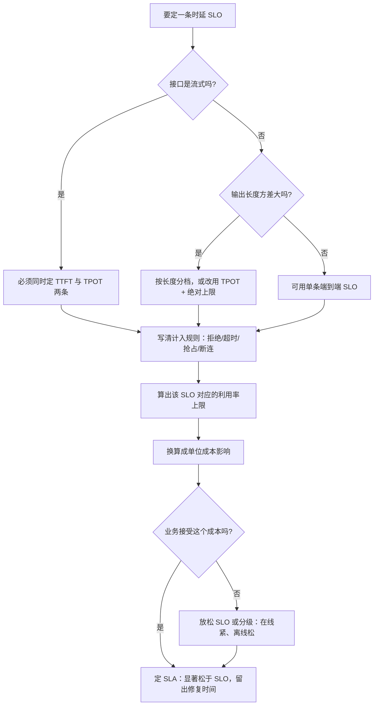

# SLO、SLA 与错误预算

> 位置：[InferenceAtlas](../../INDEX.md) > [模块 11](README.md) > 当前文档
> 信息截至：2026-07-29 ｜ 最后核验：2026-07-29 ｜ 内容版本：v0.1
> 时效性等级：低
> 相关主题：[可观测性](07_observability_metrics_logs_traces.md)｜[时延指标定义](03_ttft_tpot_itl_and_end_to_end_latency.md)｜`09_reliability_incidents_and_capacity_failures.md`

## 本章导读

推理服务的 SLO 有一个传统服务没有的结构性困难：
**请求的成本高度不均，因此「同一个 SLO 对所有请求」本身就不公平**。
一个生成 4000 token 的请求即使系统完全健康，
端到端时延也必然远高于生成 50 token 的请求——
**用同一个端到端阈值衡量两者，会把「输出长」误判为「服务违约」**。

第二个困难是**流式接口把时延拆成了两个用户可感知的量**。
TTFT 决定「多久开始看到内容」，TPOT 决定「读起来是否流畅」，
**两者互相交换**（增大批改善排队从而改善 TTFT，但恶化 TPOT）。
**只约束其中一个，优化就会把压力全部转移到另一个上**。

第三个困难是**SLO 的紧松直接决定成本**。
排队时间按 $\rho/(1-\rho)$ 形式恶化，
所以每收紧一档时延目标，可运行的利用率上限就下降一档，
**单位成本相应上升**。**SLO 因此不是一个纯技术决定**。

本章给出：**SLO 的正确定义方式**（为什么必须归一化、
为什么必须同时约束 TTFT 与 TPOT）、
**错误预算的计算与它在推理场景下的两个变体**、
**SLO 与利用率、成本的定量关系**，
以及**SLA 与 SLO 的区别及为什么前者必须比后者松**。

## 学习目标

读完本章后，读者应能够：

1. 为流式与非流式接口分别设计时延 SLO，并说明为什么非流式的端到端 SLO 需要分档
2. 解释为什么必须同时约束 TTFT 与 TPOT，而不能只约束其中一个
3. 计算错误预算，并说明推理场景下「违约」的两种不同定义
4. 定量说明 SLO 收紧如何通过利用率上限传导到单位成本
5. 区分 SLO 与 SLA，并说明两者之间应当留多大的余量

## 核心结论

- **端到端时延 SLO 对不同输出长度的请求不公平**：必须按输出长度分档，或改用归一化的 TPOT 加一个绝对上限。
- **必须同时约束 TTFT 与 TPOT**：两者互相交换，只约束一个会让优化把压力转移到另一个上。
- **错误预算把「可靠性」变成一个可以花的额度**，从而让「要不要发布」成为一个有依据的决定而不是一场辩论。
- **SLO 每收紧一档，可运行的利用率上限就下降一档**：排队按 $\rho/(1-\rho)$ 恶化，因此紧 SLO 直接抬高单位成本。
- **SLA 必须显著松于 SLO**：SLO 是内部运维目标，SLA 是对外承诺且带赔付；两者之间的余量就是发现问题并修复的时间。
- **被抢占与被拒绝的请求必须计入 SLO 统计**，否则统计口径本身会掩盖服务质量问题。

## 1. 问题定义、系统边界与工作负载

### 1.1 三个层次的目标

| 层次 | 含义 | 谁在用 |
|---|---|---|
| **SLI**（指标） | 实际测量的量，如 TPOT 的 P99 | 监控系统 |
| **SLO**（目标） | 内部目标，如「TPOT P99 ≤ 某值」 | 工程团队 |
| **SLA**（协议） | 对外承诺，违反有赔付 | 客户合同 |

**三者的紧松关系必须是 SLI 精度 < SLO < SLA**：
SLO 比 SLA 严格，**中间的余量就是「发现问题并修好」的时间**。
**如果 SLO 等于 SLA，那么任何一次 SLO 违反都直接是违约**，
团队将没有任何缓冲。

### 1.2 推理服务的三个特殊困难

已在导读中说明。此处给出对 SLO 设计的具体影响：

| 困难 | 对 SLO 的要求 |
|---|---|
| 请求成本高度不均 | 必须归一化或分档 |
| 流式接口有两个可感知时延 | 必须同时约束 TTFT 与 TPOT |
| SLO 紧松直接影响成本 | 必须与业务共同决定，并给出成本影响 |

### 1.3 本章不涉及

具体的 SLO 数值（依赖产品形态，且本库无法核验行业实践）、
具体的赔付条款（法律与商务范畴）。

## 2. 原理、数学与性能模型

### 2.1 为什么端到端 SLO 不公平

由 [第 3 章](03_ttft_tpot_itl_and_end_to_end_latency.md)：

$$
T_{\text{e2e}} = \text{TTFT} + (N-1)\cdot\text{TPOT}
$$

**在系统完全健康（TTFT 与 TPOT 都正常）的情况下**，
端到端时延仍然正比于输出长度 $N$。

设 SLO 为 $T_{\text{e2e}} \le \tau$，则它等价于

$$
N \le \frac{\tau - \text{TTFT}}{\text{TPOT}} + 1
$$

**也就是说：一个端到端 SLO 实际上是在限制输出长度**，
而不是在衡量服务质量。
**输出越长的请求越容易「违约」，即使系统运行得完美**。

**两种修正**：

| 方式 | 形式 | 优点 | 缺点 |
|---|---|---|---|
| 按长度分档 | 不同 $N$ 区间用不同 $\tau$ | 易于向业务解释 | 档位边界处有跳变 |
| 归一化 | 约束 TPOT，另加绝对上限 | **物理上正确** | 对业务方较难解释 |

**推荐归一化**：约束 $\text{TPOT}_{p99} \le \tau_2$，
再加一个防止无限生成的绝对上限。
**实践中分档更常见，因为它更容易被非工程角色理解**。

### 2.2 为什么必须同时约束 TTFT 与 TPOT

两者通过批大小互相交换：

| 动作 | TTFT | TPOT |
|---|---|---|
| 增大批 | **改善**（排队缩短） | **恶化**（单步变慢） |
| 分块 prefill | 略恶化 | 改善（减少对 decode 的干扰） |
| 优先调度 prefill | 改善 | 恶化 |

**因此只约束一个的后果是可预测的**：
若只约束 TPOT，系统会倾向于用小批，
**排队变长、TTFT 恶化**；
若只约束 TTFT，系统会倾向于大批与优先 prefill，
**TPOT 恶化**。

**两者必须同时出现在 SLO 里**，
否则优化会沿着未被约束的方向自由劣化。

### 2.3 错误预算

设 SLO 要求「$p$ 比例的请求达标」，窗口内共 $n$ 个请求，
则允许的不达标数为

$$
B = n \cdot (1 - p)
$$

已经用掉 $b$ 个时，**剩余预算比例**为

$$
\rho_{\text{budget}} = 1 - \frac{b}{B}
$$

**错误预算的价值在于它把可靠性变成一个可以花的额度**：

| 剩余预算 | 建议动作 |
|---|---|
| 充足 | 可以发布、可以做风险较高的变更 |
| 接近耗尽 | 冻结非必要变更，优先修复 |
| 已耗尽 | 停止功能发布，全部资源投入可靠性 |

**这把「要不要发布」从一场辩论变成一个有依据的决定**，
这是错误预算最大的实际价值。

### 2.4 推理场景下「违约」的两种定义

**这是推理服务特有的一个复杂性**：一个请求可能部分达标。

| 定义 | 计法 | 适合 |
|---|---|---|
| **按请求** | 该请求的 TTFT 与 TPOT 均达标才算达标 | 非流式、简单场景 |
| **按 token** | 统计 ITL 超标的 token 占比 | **流式场景更贴近体验** |

**两者可以给出很不同的结论**。
考虑一个生成 1000 token 的请求，
其中只有 5 个 token 的 ITL 超标（一次短暂中断）：

- **按请求计**：这个请求违约，贡献一个完整的失败；
- **按 token 计**：贡献 5/1000 的违约率。

**哪个更对取决于用户体验**：
一次明显的停顿是否毁掉整个回答的体验？
**对流式对话，一次长停顿确实很影响体验，所以按请求计更合理**；
**而对长文档生成，偶尔的停顿影响很小，按 token 计更合理**。

**关键是明确选择一种并写进 SLO 定义**，
而不是让不同的团队按不同的理解计算。

### 2.5 SLO 与利用率、成本的定量关系

排队时间随利用率 $\rho$ 按 $\rho/(1-\rho)$ 形式增长
（见 [模块 01 第 3 章](../01_foundations_and_metrics/03_queueing_theory_for_inference.md)），
并且还要乘一个与服务时间方差相关的因子——
**而推理的服务时间方差天然很大**（输出长度重尾）。

设 SLO 允许的最大排队时间为 $W_{\max}$，
则可运行的利用率上限 $\rho_{\max}$ 由

$$
\frac{\rho_{\max}}{1-\rho_{\max}} \cdot k = W_{\max} \;\Big/\; \bar{S}
$$

隐式确定（$\bar S$ 为平均服务时间，$k$ 为方差因子）。
而单位成本反比于利用率：

$$
C_{\text{unit}} \propto \frac{1}{\rho_{\max}}
$$

**两个定性结论**：

1. **$\rho/(1-\rho)$ 在高利用率处极陡**，
   所以在接近饱和时，**放松一点 SLO 能换来相当可观的利用率提升**；
2. **推理的方差因子 $k$ 很大**，
   所以同样的 SLO 在推理服务上对应的 $\rho_{\max}$
   **显著低于方差小的传统服务**。

**这个关系应当被算出来并向业务说明**：
「把 P99 目标收紧到某个值，意味着利用率上限从 A 降到 B，
单位成本上升约 A/B 倍」。
**把 SLO 的选择变成一个带价签的决定，而不是一个纯技术偏好**。

## 3. 实现机制与系统设计

### 3.1 SLO 的完整定义要素

一条 SLO 必须写清六件事：

| 要素 | 例子 | 不写清的后果 |
|---|---|---|
| 指标 | TPOT | 概念混淆 |
| 统计量 | P99 | 均值会掩盖尾部 |
| 阈值 | 某个值 | — |
| 窗口 | 滚动 28 天 / 日历月 | 影响预算的恢复速度 |
| 适用范围 | 哪些流量、哪些模型、哪些租户 | 范围不清导致争议 |
| **计入规则** | 拒绝、超时、被抢占的请求怎么算 | **最容易被钻空子的地方** |

**第六项是本章要强调的重点**。
如果拒绝的请求不计入分母，
**那么在过载时大量拒绝反而会让 SLO 达成率上升**——
这是一个明显错误但很常见的口径设计。

**推荐规则**：

- **拒绝与超时计为不达标**（它们确实是失败的用户体验）；
- **被抢占的请求正常计入**，但**同时单独统计其比例**，
  以便区分「普遍劣化」与「少数请求被抢占」；
- **客户端主动断开的请求排除**（不是服务的问题），
  但**要单独统计断连率**，因为断连率上升本身是体验差的信号。

### 3.2 分档 SLO 的设计

若采用按输出长度分档：

```text
若 N ≤ N1:  T_e2e P99 ≤ τ1
若 N1 < N ≤ N2:  T_e2e P99 ≤ τ2
若 N > N2:  改用 TPOT P99 ≤ τ_tpot
```

**两个设计要点**：

1. **档位边界应当基于实际的输出长度分布**，
   而不是取整数。**让每档内有足够的样本量**，
   否则该档的 P99 不可靠；
2. **最长的一档应当改用归一化指标**，
   因为对无上界的输出长度无法定一个合理的端到端阈值。

### 3.3 多维度的 SLO

一个成熟的推理服务通常需要一组 SLO 而不是一条：

| 维度 | SLO | 说明 |
|---|---|---|
| 可用性 | 成功率 ≥ 某值 | 分母含拒绝与超时 |
| 首 token 时延 | TTFT P99 ≤ 某值 | 流式接口的关键 |
| 生成流畅度 | TPOT P99 ≤ 某值 | 必须与 TTFT 同时存在 |
| 中断 | 单请求内 ITL 超标次数 ≤ 某值 | 检测抢占与工具等待 |
| 质量 | 金标准集指标 ≥ 某值 | **质量也应有 SLO** |

**最后一行常被遗漏**。
如果质量没有 SLO，
**那么「为了性能而牺牲质量」的变更就没有任何刹车**。

### 3.4 错误预算的运作

```text
每个窗口开始：预算 = n × (1 - p)

每次不达标：预算 -= 1

预算检查（每日）：
    剩余 > 50%  → 正常发布
    剩余 20–50% → 提高发布审查标准
    剩余 < 20%  → 冻结非必要变更
    剩余 = 0    → 停止功能发布，全部投入可靠性

窗口滚动：旧的不达标逐渐移出窗口，预算自然恢复
```

**滚动窗口优于日历窗口**：
日历窗口在月初会「重置」，
**导致月末谨慎、月初激进的行为模式**，
而滚动窗口没有这个断点。

### 3.5 SLA 与 SLO 的余量

**SLA 必须显著松于 SLO**。余量的作用：

1. **发现与修复的时间**：SLO 违反触发告警，
   团队有时间在触及 SLA 之前修复；
2. **测量误差的缓冲**：SLI 本身有测量误差；
3. **不可控因素**：网络、依赖服务、客户端环境。

**一个常见的错误是把 SLA 直接设成 SLO**，
**这会让每次 SLO 告警都变成商务事件**，
从而导致团队倾向于把 SLO 定得很松——
**结果是两者都失去了作用**。

**另一个要点**：**SLA 通常用比 SLO 更宽松的统计量**
（例如 SLO 用 P99、SLA 用月度可用性百分比），
因为对外承诺需要更容易验证与仲裁。

## 4. 性能、成本、能耗与可靠性 trade-off

### 4.1 SLO 紧松的成本传导

见 2.5。**决策建议**：

| 场景 | 建议 |
|---|---|
| 交互式对话，体验敏感 | TPOT 收紧，接受较低利用率 |
| 批量离线处理 | 时延 SLO 极松或不设，最大化利用率 |
| 混合负载 | **分级 SLO**：在线紧、离线松，用优先级隔离 |

**第三行是提高整体利用率的关键手段**：
让离线负载填充在线负载为满足紧 SLO 而保留的余量
（见 [Q099](../17_interview_prep/08_company_paper_and_strategy_questions.md)）。

### 4.2 可用性目标与冗余成本

可用性 SLO 决定所需的冗余度。
若单组可用性为 $a^n$（$n$ 台组成一个并行组），
$R$ 个副本中至少 $k$ 个可用的概率按二项分布计算
（见 [模块 06 第 10 章](../06_distributed_and_moe_inference/10_fault_tolerance_and_graceful_degradation.md)）。

**每提高一个「9」，所需的冗余显著增加**，
而冗余容量在正常时是闲置的。
**所以可用性目标同样是一个带价签的决定**。

### 4.3 质量 SLO 与性能优化的冲突

量化、更激进的批策略、投机解码——
**这些优化都可能影响输出质量**。

**如果只有性能 SLO 没有质量 SLO**，
优化会单向地牺牲质量换性能，
**而这个代价直到用户投诉才会显现**。

**因此质量 SLO 的作用是给性能优化装一个刹车**，
它的价值不在于精确衡量质量，
**而在于让质量退化变成一个必须被讨论的事件**。

## 5. benchmark、真实案例或公开部署案例

**本章不引用任何具体的 SLO 数值或行业实践**。

受当前环境的网络出口策略限制（详见 [AGENTS.md 第 11 节](../../AGENTS.md)），
本库无法核验任何公开的 SLO 实践或服务承诺，
**因此不给出任何具体数值**。
合理的 SLO 值高度依赖产品形态、
用户预期与成本结构，**本来也不存在一个可以照抄的通用值**。

**读者应自行完成的 SLO 定义表**：

| 要素 | 你的定义 | 备注 |
|---|---|---|
| 可用性 SLO（含拒绝与超时） | 待填 | 分母口径要写清 |
| TTFT SLO（指标 + 分位数 + 阈值） | 待填 | 流式接口必需 |
| TPOT SLO | 待填 | **必须与 TTFT 同时存在** |
| 输出长度分档或归一化方式 | 待填 | 解决长请求的不公平 |
| 中断 SLO（ITL 超标次数） | 待填 | 检测抢占与工具等待 |
| 质量 SLO | 待填 | **最常被遗漏** |
| 计入规则（拒绝/超时/抢占/断连） | 待填 | **最容易被钻空子** |
| 窗口（滚动 or 日历） | 待填 | 推荐滚动 |
| 对应的 SLA 与余量 | 待填 | SLA 必须显著更松 |
| 该 SLO 对应的利用率上限与成本影响 | 待填 | **把选择变成带价签的决定** |

**最后一行是本章最有价值的产出**：
它把 SLO 从一个技术偏好变成一个可以和业务讨论的成本决策。

> 实验方法论要求见 [如何读推理 benchmark](../00_start_here/03_how_to_read_inference_benchmarks.md)。

## 6. 设计决策框架



**图解读**：

1. **本图展示什么**：SLO 定义的完整流程。
   起点是接口形态（决定要定几条），
   中间是计入规则与成本换算，
   终点是 SLA 的余量设计。
2. **核心瓶颈**：瓶颈在 H→I 这一步。
   **「算出成本影响」最常被跳过**，
   结果是 SLO 被当成纯技术偏好定下来，
   **而它实际上通过利用率上限直接决定了单位成本**。
   跳过这一步意味着团队在不知情的情况下做了一个重大的成本承诺。
3. **图中的 trade-off**：J 节点的分叉。
   业务不接受成本时，
   **分级（在线紧、离线松）通常比全面放松更好**，
   因为它保住了对体验最敏感那部分流量的质量。
4. **面试如何引用**：可以说
   「定 SLO 时我会先看接口形态决定要定几条，
   然后写清计入规则——尤其是拒绝和超时怎么算，
   **最后把 SLO 换算成利用率上限与成本，让业务方带着价签做选择**」。

## 7. 常见失败模式与排查路径

| 症状 | 根因 | 修正 |
|---|---|---|
| 过载时 SLO 达成率反而上升 | 拒绝的请求未计入分母 | 拒绝与超时计为不达标 |
| 长输出请求频繁「违约」 | 用了统一的端到端 SLO | 分档或归一化 |
| 优化 TTFT 后用户抱怨卡顿 | 只约束了 TTFT | 同时约束 TPOT |
| SLO 达标但用户不满 | 缺中断或质量维度 | 补 ITL 超标次数与质量 SLO |
| 每次 SLO 告警都变成商务事件 | SLA 等于 SLO | 拉开余量 |
| 月初激进月末谨慎 | 用了日历窗口 | 改滚动窗口 |
| 质量因性能优化而缓慢下降 | 没有质量 SLO | 补上，作为优化的刹车 |
| 团队认为 SLO 无法达成 | SLO 定得比容量允许的更紧 | 用 $\rho/(1-\rho)$ 反算可行性 |

**最后一行值得展开**：
**SLO 的可行性应当被验证而不是假设**。
给定硬件与负载，可达到的时延分位数有一个物理上界
（扫描时间给出 TPOT 下界，排队给出 TTFT 下界）。
**定一个物理上不可达的 SLO 会让整个体系失去意义**，
因为团队会开始忽略持续飘红的指标。

## 8. 关联面试主题

1. 怎么为流式对话产品定义 SLO——见 [Q007](../17_interview_prep/01_inference_system_design.md)
2. 高利用率下 P99 恶化而 P50 不变的机制——见 [Q006](../17_interview_prep/01_inference_system_design.md)
3. goodput 与 SLO 的关系——见 [Q005](../17_interview_prep/01_inference_system_design.md)
4. 多租户下的 QoS 与配额——见 [Q095](../17_interview_prep/07_debug_benchmark_and_reliability_questions.md)
5. 容错与分级降级——见 [Q075](../17_interview_prep/05_distributed_and_moe_questions.md)

## 9. 小结

推理服务的 SLO 设计有三个结构性困难，本章分别给出了处理方式：

**第一，请求成本高度不均**。
端到端时延 SLO 实际上是在限制输出长度而不是衡量服务质量——
**输出越长的请求越容易「违约」，即使系统运行得完美**。
处理方式是按长度分档，或改用归一化的 TPOT 加绝对上限。
**归一化在物理上更正确，分档在沟通上更容易**。

**第二，流式接口有两个可感知的时延且它们互相交换**。
增大批改善 TTFT 而恶化 TPOT，
**所以只约束一个会让优化沿着未被约束的方向自由劣化**。
两者必须同时出现在 SLO 里。

**第三，SLO 的紧松直接决定成本**。
排队按 $\rho/(1-\rho)$ 恶化且推理的方差因子很大，
**所以每收紧一档 SLO，可运行的利用率上限就下降一档，单位成本相应上升**。
**把这个换算做出来并向业务说明，是本章最有实际价值的一步**——
它让 SLO 从技术偏好变成带价签的决定。

另外两条容易被忽略的要点：
**计入规则决定了口径能否被钻空子**
（拒绝的请求不计入分母会让过载时的 SLO 达成率反而上升），
以及**质量也应当有 SLO**——
否则「为性能牺牲质量」的变更没有任何刹车。

本章不给出任何具体的 SLO 数值——
它们高度依赖产品形态，本来也不存在可以照抄的通用值，
而当前环境亦无法核验行业实践。
第 5 节给出的是一份定义表模板。

## 关键术语

| 中文术语 | 英文 | 定义 | 单位/口径 | 关联文档 |
|---|---|---|---|---|
| 服务水平指标 | SLI | 实际测量的量 | 依指标而定 | 本章 1.1 |
| 服务水平目标 | SLO | 内部可靠性目标 | 依指标而定 | 本章 1.1 |
| 服务水平协议 | SLA | 对外承诺，违反有赔付 | 依指标而定 | 本章 1.1 |
| 错误预算 | error budget | 窗口内允许的不达标额度 | 请求数或比例 | 本章 2.3 |
| 计入规则 | accounting rule | 拒绝、超时、抢占、断连如何计入统计 | — | 本章 3.1 |
| 分档 SLO | tiered SLO | 按输出长度区间设定不同阈值 | — | 本章 3.2 |
| 滚动窗口 | rolling window | 错误预算按滑动时间窗计算 | 天 | 本章 3.4 |

## 延伸阅读

- [可观测性：指标、日志与 trace](07_observability_metrics_logs_traces.md)
- [时延指标的精确定义](03_ttft_tpot_itl_and_end_to_end_latency.md)
- [吞吐、并发与 goodput](04_throughput_concurrency_and_goodput.md)
- [时延、吞吐与 SLO](../01_foundations_and_metrics/02_latency_throughput_and_slo.md)
- [推理排队论](../01_foundations_and_metrics/03_queueing_theory_for_inference.md)
- [容错与优雅降级](../06_distributed_and_moe_inference/10_fault_tolerance_and_graceful_degradation.md)

## 主要来源

本章由 [模块 01 第 2–3 章](../01_foundations_and_metrics/02_latency_throughput_and_slo.md) 的 SLO 与排队模型、
[模块 03 第 6 章](../03_serving_engines_and_scheduling/06_multi_tenant_isolation_and_qos.md) 的 QoS 设计、
以及 [模块 06 第 10 章](../06_distributed_and_moe_inference/10_fault_tolerance_and_graceful_degradation.md) 的可用性模型整理而成。

**不含任何需要外部核验的 SLO 数值或行业实践**。
受当前环境的网络出口策略限制，本库无法核验任何公开的服务承诺
（详见 [AGENTS.md 第 11 节](../../AGENTS.md)）。
合理的 SLO 值依赖产品形态，本来也不存在通用值。

| 类别 | 说明 | 披露标签 |
|---|---|---|
| 端到端 SLO 的不公平性、TTFT/TPOT 交换、错误预算、利用率成本传导 | 由模块 01、03、06 推导 | — |
| SLO 定义的六要素与计入规则 | 由口径分析整理 | — |
| 读者自行定义的 SLO 表 | 应自行确定 | `独立可复现实验` |
| 任何具体的 SLO 数值与行业实践 | **本章未给出** | `待核实` |

## 更新记录

| 日期 | 版本 | 变更 | 核验人 |
|---|---|---|---|
| 2026-07-29 | v0.1 | 初稿：端到端 SLO 的不公平性、双指标约束、错误预算与利用率成本传导 | — |
