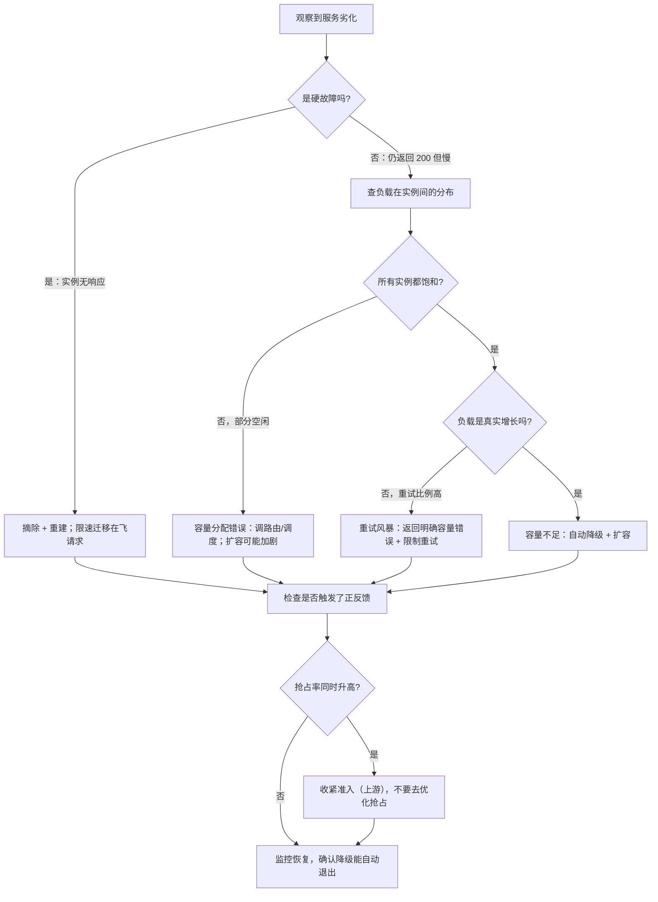

# 可靠性事故与容量失效模式

> 位置：[InferenceAtlas](../../INDEX.md) > [模块 11](README.md) > 当前文档
> 信息截至：2026-07-29 ｜ 最后核验：2026-07-29 ｜ 内容版本：v0.1
> 时效性等级：低
> 相关主题：[SLO 与错误预算](08_slos_slas_and_error_budgets.md)｜[服务事故排查手册](../03_serving_engines_and_scheduling/12_serving_incident_playbook.md)｜`10_safety_security_and_abuse_controls.md`

## 本章导读

推理服务的事故有一个显著特征：**大部分严重事故不是「坏了」，而是「变慢了然后崩塌」**。
硬故障（实例挂掉）反而相对好处理——健康检查会发现它，流量会被摘除。
**真正难的是软故障**：实例还活着、还在返回 200，
但处理速度降到了某个临界点以下，
**于是队列积压、超时增加、客户端重试、负载进一步上升**——
一个正反馈把「慢一点」放大成「全面不可用」。

推理服务里这类正反馈特别多，因为它有三个放大器：

1. **重试**：客户端超时后重发，而重发的请求需要完整的 prefill；
2. **抢占**：内存压力导致抢占，被抢占的请求重算后占用更久，进一步加剧压力；
3. **恢复**：故障恢复时大量请求同时重建，每个都要完整 prefill，形成尖峰。

**三者的共同结构是「系统变慢 → 工作量增加 → 更慢」**。
本章的核心内容就是识别这类正反馈并给出打断它们的方法。

本章给出：**六类典型失效模式及其正反馈机制**、
**过载时的正确行为设计**（为什么快速拒绝优于慢慢超时）、
**分级降级的五个层次**、
以及**事故复盘应当产出什么**。

## 学习目标

读完本章后，读者应能够：

1. 识别推理服务的三类正反馈放大器，并说明每一类的打断方法
2. 说明为什么过载时快速拒绝优于让请求慢慢超时
3. 设计五级降级路径，并说明每一级应当自动还是人工触发
4. 区分「容量不足」与「容量分配错误」两类失效，并给出各自的判据
5. 说明事故复盘应当产出什么，以及为什么「补监控」通常比「修代码」更重要

## 核心结论

- **推理服务的严重事故多数是软故障的正反馈放大**，而不是硬件损坏；识别放大器比修复单点更重要。
- **重试是最强的放大器**：超时重发的请求需要完整 prefill，因此重试风暴的成本远高于普通流量增长。
- **过载时快速拒绝优于慢慢超时**：超时的请求消耗了资源却没有产出，且会触发重试。
- **降级必须分级且能自动触发**：「部分可用」优于「全部失败」，而人工触发在事故初期总是太慢。
- **容量不足与容量分配错误的表现相似但修正相反**：前者要扩容，后者要调分配，扩容反而可能加剧问题。
- **未演练过的恢复路径应当假设它不工作**；复盘的首要产出通常是「补上当时缺失的监控信号」。

## 1. 问题定义、系统边界与工作负载

### 1.1 硬故障与软故障

| 类型 | 表现 | 检测难度 | 处理 |
|---|---|---|---|
| **硬故障** | 实例无响应、进程退出 | 低（健康检查即可） | 摘除 + 重建 |
| **软故障** | 仍返回 200 但显著变慢 | **高** | 需要基于时延的检测 |
| **静默故障** | 返回正常但内容错误 | **最高** | 需要质量信号 |

**三者的检测手段完全不同**，
而多数监控体系只覆盖第一类。

**软故障之所以更危险**，是因为它不会被摘除——
**流量继续被送进一个处理不了的实例然后超时**。
所以健康检查必须包含时延判据而不只是存活判据。

### 1.2 推理服务的三个正反馈放大器

| 放大器 | 机制 | 放大倍数的来源 |
|---|---|---|
| **重试** | 超时 → 客户端重发 → 负载上升 → 更多超时 | 重发需完整 prefill |
| **抢占** | 内存压力 → 抢占 → 重算 → 占用更久 → 压力更大 | 重算代价随已生成长度增长 |
| **恢复** | 故障 → 请求迁移 → 目标端尖峰 → 目标端也故障 | 迁移的请求都需完整 prefill |

**三者的共同点是「代价随系统劣化而上升」**，
这正是正反馈的定义。

**打断它们的通用手段是「加一个不随劣化而放大的上界」**：
限制重试、限制抢占率（通过收紧准入）、限速迁移。

### 1.3 本章不涉及

具体的事故案例（本库无法核验外部案例），
安全类事件（见下一章）。

## 2. 原理、数学与性能模型

### 2.1 排队的悬崖

排队时间随利用率按 $\rho/(1-\rho)$ 形式增长
（见 [模块 01 第 3 章](../01_foundations_and_metrics/03_queueing_theory_for_inference.md)），
且要乘一个与服务时间方差相关的因子——
**推理的服务时间方差天然很大**（输出长度重尾）。

**这个函数的关键性质是它在高利用率处极陡**：
从 $\rho = 0.7$ 到 $\rho = 0.85$，
$\rho/(1-\rho)$ 从约 2.33 升到约 5.67，**增长约 2.4 倍**；
再到 $\rho = 0.95$ 时是 19，**相对 0.7 增长约 8 倍**。

**运维含义**：

1. **利用率的安全区间比直觉窄**。在陡峭区，
   一点点负载上升会带来时延的大幅恶化；
2. **「平均利用率 70%」不等于安全**，
   因为峰值时刻的瞬时利用率可能远高于均值；
3. **这也是重试放大器如此危险的原因**：
   它在系统已经进入陡峭区时再增加负载。

### 2.2 重试放大的量化

设正常到达率 $\lambda$，超时比例 $q$，客户端最多重试 $k$ 次。
若每次重试都超时，则有效到达率为

$$
\lambda_{\text{eff}} = \lambda\left(1 + q + q^2 + \dots + q^k\right) = \lambda \cdot \frac{1 - q^{k+1}}{1 - q}
$$

**当 $q$ 接近 1 时（系统已严重过载），
这个和趋近于 $\lambda(k+1)$**——
**即负载被放大到 $k+1$ 倍**。

**更糟的是成本**：重试的请求需要完整的 prefill，
**而原请求可能已经完成了部分 prefill 甚至部分 decode**——
那部分工作被完全浪费。

**三个打断手段**：

| 手段 | 机制 |
|---|---|
| 指数退避 | 降低重试的密度 |
| **限制总重试次数** | 直接把 $k$ 变小 |
| **服务端返回明确的「不要重试」信号** | 让客户端在容量错误时不重试 |

**第三个最有效但最常被忽略**：
**过载时返回一个语义明确的容量错误（而不是超时或通用 5xx），
让客户端知道重试无用**。

### 2.3 抢占的正反馈

抢占一个已生成 $L_g$ 个 token 的请求，
恢复代价是 $\text{prefill}(S_{\text{prompt}} + L_g)$。

**$L_g$ 越大代价越高，而长请求恰好最可能被抢占**
（它们占用 KV 最久、增长最多）。

**由此形成的循环**：

```text
KV 压力 → 抢占长请求 → 该请求重算（代价更高）
       → 占用时间更长 → KV 压力更大 → 抢占更多
```

**打断方法是从上游动手**：
抢占率高的根因通常是**准入太松**，
**所以正确的动作是收紧准入而不是优化抢占实现**
（见 [Q034](../17_interview_prep/03_serving_scheduling_and_slo_questions.md)）。

**这是一个反直觉但重要的判断**：
看到抢占频繁时，本能是去优化抢占，
**而真正有效的是减少抢占的发生**。

### 2.4 容量不足 vs 容量分配错误

两者的症状相似（排队上升、拒绝增加），**但修正相反**：

| | 容量不足 | 容量分配错误 |
|---|---|---|
| 本质 | 总能力 < 总需求 | 总能力够，但被错误分配 |
| 判据 | **所有实例都饱和** | **部分实例饱和、部分空闲** |
| 修正 | 扩容或降级 | 调路由/调度 |
| 错误修正的后果 | — | **扩容会稀释亲和性，可能加剧** |

**区分判据是「负载在实例间的分布」**。
如果 P99 与中位数的实例负载差异很大，
**那是分配问题而不是容量问题**。

**分配错误的三个常见来源**：

1. **缓存亲和路由过强**，导致热点会话集中在少数实例；
2. **长请求分布不均**，某些实例聚集了更多长请求；
3. **实例能力不齐**（部分降频或有额外负载），
   而路由假设它们同质。

**第三点尤其隐蔽**：它看起来像分配问题，
根因却在硬件层（见 [Q083](../17_interview_prep/06_hardware_and_datacenter_questions.md)）。

### 2.5 过载时的正确行为

**核心判断：快速拒绝优于慢慢超时**。三个理由：

1. **超时的请求消耗了资源却没有产出**——
   它占用了 KV、消耗了算力，最后被丢弃；
2. **超时会触发重试**，形成 2.2 的放大；
3. **明确的容量错误让客户端能做出正确处理**
   （退避、降级、提示用户），而超时提供不了任何信息。

**因此准入控制在过载时的角色是「保护系统」而不是「限制用户」**。
**这个定位决定了它应当被积极使用而不是当成最后手段**。

## 3. 实现机制与系统设计

### 3.1 六类典型失效模式

**（一）重试风暴**

| 项 | 内容 |
|---|---|
| 触发 | 时延上升导致客户端超时 |
| 症状 | 请求量上升但都是重复内容；重试比例升高 |
| 判据 | **看请求中重试的比例**（需要客户端带重试标记） |
| 处理 | 返回明确容量错误、限制重试次数、指数退避 |

**判据需要客户端配合传递重试标记**——
**这是一个应当在协议层就设计好的字段**，
事后很难补。

**（二）抢占级联**

| 项 | 内容 |
|---|---|
| 触发 | KV 压力超过阈值 |
| 症状 | 抢占率上升、TPOT 恶化、部分请求时延极高 |
| 判据 | 抢占率与 KV 占用率同时高 |
| 处理 | **收紧准入**（上游），而不是优化抢占 |

**（三）恢复尖峰**

| 项 | 内容 |
|---|---|
| 触发 | 一个实例或区域故障后请求迁移 |
| 症状 | 接收方 prefill 负载突增、缓存命中率骤降 |
| 判据 | 迁移事件与接收方负载尖峰的时间相关 |
| 处理 | **限速迁移** + 接收方准入正常工作 |

**缓存命中率骤降是这类事故的特征信号**：
迁移过来的请求在新实例上没有缓存，
**所以 prefill 成本远高于正常水平**——
**接收方的实际压力比「请求数」暗示的高得多**。

**（四）慢实例拖累整体**

| 项 | 内容 |
|---|---|
| 触发 | 单实例降频、有额外负载、或数据不均 |
| 症状 | 分布式下所有实例的通信时间都长 |
| 判据 | **各实例单步时间的 max/median 比** |
| 处理 | 摘除该实例；查降频与额外负载 |

**这类事故最容易被误判为网络问题**（见 [第 7 章](07_observability_metrics_logs_traces.md) 2.3）。

**（五）内存泄漏与碎片累积**

| 项 | 内容 |
|---|---|
| 触发 | 长时间运行 |
| 症状 | 可用 KV 缓慢下降、并发上限逐渐降低 |
| 判据 | KV 占用与在飞请求数的比值随时间上升 |
| 处理 | 短期滚动重启；长期查释放路径（尤其异常终止时的清理） |

**「KV 占用 / 在飞请求数」这个比值是一个很好的泄漏探针**——
它应当基本稳定，**上升就说明有 KV 没被释放**。

**（六）依赖服务劣化**

| 项 | 内容 |
|---|---|
| 触发 | 检索、工具、存储等依赖变慢 |
| 症状 | ITL 序列出现大间隔；请求驻留时间上升但计算量不变 |
| 判据 | 等待外部的时间占比 |
| 处理 | 超时 + 降级；**换出等待中请求的 KV** |

**最后一项是推理特有的**：
等待工具返回的请求仍然占着 KV 但不产生任何计算，
**换出它们能显著提高有效并发**
（判据见 [Q070](../17_interview_prep/05_distributed_and_moe_questions.md)）。

### 3.2 分级降级

**五级，从轻到重**：

| 级 | 措施 | 影响 | 触发方式 |
|---|---|---|---|
| 1 | 缩短最大上下文与最大输出长度 | 每请求资源下降，可服务更多 | **自动** |
| 2 | 降低并发上限，保护 SLO | 吞吐下降，时延保持 | **自动** |
| 3 | 只服务高优先级流量 | 低优先级排队或拒绝 | **自动** |
| 4 | 路由到更小的备用模型 | 质量下降但可用 | 自动或人工 |
| 5 | 返回明确的容量错误 | 可用性下降但快速失败 | **自动** |

**三个设计要点**：

1. **前三级必须能自动触发**。
   事故初期的分钟级窗口里，人工决策总是太慢；
2. **每一级都要能自动恢复**，
   否则降级会变成永久状态；
3. **降级状态必须可见**——
   在指标里暴露「当前处于第几级降级」，
   否则后续的性能观测会被误读。

**第三点常被忽略**：一个处于降级状态的系统，
它的时延指标「看起来正常」是因为降级生效了，
**而不是因为问题消失了**。

### 3.3 过载保护的实现

```text
准入检查（每个新请求）：
    if 预估资源需求 > 总容量:
        return REJECT_PERMANENT      # 永远装不下，明确拒绝
    if 当前可用资源 < 预估需求:
        if 队列深度 < 上限:
            enqueue()
        else:
            return REJECT_CAPACITY   # 明确的容量错误，提示不要立即重试
    else:
        admit()

降级检查（周期性）：
    level = 0
    if SLO 达成率 < 阈值1: level = max(level, 1)
    if KV 占用率 > 阈值2:  level = max(level, 2)
    if 可用容量 < 需求 × 系数: level = max(level, 3)
    apply_degradation(level)
    export_metric("degradation_level", level)   # 必须可见
```

**两个关键点**：

1. **两种拒绝要区分**：
   `REJECT_PERMANENT`（请求本身超出能力，重试无用）
   与 `REJECT_CAPACITY`（当前容量不足，稍后可重试）。
   **给客户端不同的信号，才能引导正确的行为**；
2. **降级级别必须导出为指标**（最后一行）。

### 3.4 健康检查的设计

**存活检查不足以发现软故障**。健康检查应当包含：

| 检查 | 判据 |
|---|---|
| 存活 | 进程响应 |
| **时延** | 最近窗口的 P99 是否超过阈值 |
| **产能** | 最近窗口是否有请求成功完成 |
| **一致性** | 金丝雀请求的输出是否正常 |

**第二项是发现软故障的关键**。
**但要防止误判**：一个实例可能因为恰好接到了几个长请求而暂时变慢。
**所以时延判据应当用归一化的 TPOT 而不是端到端时延**，
并且需要连续多个窗口超标才判定为不健康。

### 3.5 事故复盘的产出

一次复盘应当产出四样东西，**按价值排序**：

| 产出 | 为什么重要 |
|---|---|
| **补上缺失的监控信号** | 下次能更快发现 |
| **补上缺失的自动降级** | 下次能自动缓解 |
| 修复根因 | 消除这一个问题 |
| 更新排查手册 | 知识传递 |

**第一项通常价值最高**。
**多数事故的时间消耗不在「修复」而在「定位」**，
而定位慢的根因通常是缺少某个信号。

**复盘应当明确记录的一个数字是「从告警到定位的时间」**——
它比「总修复时间」更能反映可观测性的质量。

## 4. 性能、成本、能耗与可靠性 trade-off

### 4.1 余量与成本

为容忍故障保留的余量是纯成本（正常时闲置）。
**余量的大小由两个因素决定**：

1. **故障域的粒度**：见 [Q084](../17_interview_prep/06_hardware_and_datacenter_questions.md)，
   $R$ 个区域要容忍一个故障，利用率上限是 $(R-1)/R$；
2. **恢复速度**：恢复越快，需要的余量越小——
   因为不需要长期承载故障期的全部流量。

**因此优化就绪时间（见 [案例七](../17_interview_prep/09_mock_interview_cases.md)）
是一个直接的成本优化**，而不只是体验改善。

### 4.2 快速失败与体验

快速拒绝保护了系统但对被拒的用户是差体验。
**缓解方式是分级**：

| 流量 | 过载时的处理 |
|---|---|
| 高优先级 / 付费 | 尽量服务，必要时降级质量 |
| 普通 | 排队，队列满则拒绝 |
| 低优先级 / 批量 | 优先拒绝或延后 |

**这要求准入控制是配额感知的**，
而不是简单的全局限流。

### 4.3 自动降级的风险

自动降级可能误触发，**导致不必要的质量或容量损失**。
两个防护：

1. **触发条件要有滞回**：
   进入降级的阈值应严于退出降级的阈值，
   **否则会在临界点附近反复抖动**；
2. **降级级别的变化应当被记录并告警**，
   即使它是自动的——**人需要知道系统正在降级运行**。

## 5. benchmark、真实案例或公开部署案例

**本章不引用任何具体的事故案例或行业数据**。

受当前环境的网络出口策略限制（详见 [AGENTS.md 第 11 节](../../AGENTS.md)），
本库无法核验任何公开的事故报告或可靠性实践，
**因此不引用任何外部案例**。

**读者应自行完成的可靠性对照清单**：

| 项 | 有吗 | 备注 |
|---|---|---|
| 健康检查含时延判据（而非只有存活） | 是/否 | 发现软故障的前提 |
| 请求带重试标记，可统计重试比例 | 是/否 | **协议层设计，事后难补** |
| 过载时返回明确的容量错误 | 是/否 | 打断重试放大 |
| 两种拒绝语义可区分 | 是/否 | 永久 vs 临时 |
| 五级降级，前三级可自动触发 | 是/否 | 人工在事故初期总是太慢 |
| 降级级别导出为指标 | 是/否 | **否则性能观测会被误读** |
| 迁移限速 | 是/否 | 打断恢复尖峰 |
| KV 占用 / 在飞请求数 的比值监控 | 是/否 | 泄漏探针 |
| 各实例单步时间 max/median 比 | 是/否 | 发现慢实例 |
| 做过故障注入演练 | 是/否 | **未演练的路径视为不工作** |
| 复盘记录「从告警到定位」的时间 | 是/否 | 可观测性质量的度量 |

**「请求带重试标记」与「降级级别可见」是两个最容易被遗漏
且事后补起来最麻烦的项**。

> 实验方法论要求见 [如何读推理 benchmark](../00_start_here/03_how_to_read_inference_benchmarks.md)。

## 6. 设计决策框架



**图解读**：

1. **本图展示什么**：从劣化到处置的分诊树。
   第一分叉是硬/软故障，
   第二分叉用「负载分布」区分容量不足与分配错误，
   第三分叉用「重试比例」区分真实增长与重试风暴。
2. **核心瓶颈**：瓶颈在 E 节点。
   **「所有实例都饱和吗」这个检查最常被跳过**，
   而跳过它会把分配问题误判为容量问题——
   **然后扩容，而扩容会稀释缓存亲和性，可能让情况更糟**。
3. **图中的 trade-off**：H 分支返回明确容量错误会立即降低成功率，
   **看起来像是把问题变严重了**。
   但它打断了正反馈，**总体恢复更快**——
   这是一个需要事先想清楚并写进预案的取舍。
4. **面试如何引用**：可以说
   「我会先区分硬故障与软故障，
   然后看负载在实例间的分布——
   **部分实例空闲说明是分配问题，此时扩容反而可能加剧**；
   同时看重试比例，判断负载增长是真实的还是重试放大的」。

## 7. 常见失败模式与排查路径

| 症状 | 根因 | 修正 |
|---|---|---|
| 扩容后情况反而变差 | 实为分配问题；扩容稀释了缓存亲和 | 先看实例负载分布 |
| 请求量暴增但内容重复 | 重试风暴 | 明确容量错误 + 限制重试 |
| 抢占率高，优化抢占无效 | 根因在准入太松 | 收紧准入 |
| 实例故障后接收方也故障 | 迁移未限速 + 缓存命中率骤降 | 限速迁移，按无缓存估算接收方压力 |
| 长时间运行后并发上限下降 | KV 泄漏或碎片 | 监控 KV/在飞比值；查异常终止的清理路径 |
| 分布式下判定「网络慢」但换网络无效 | 慢实例伪装 | 看 max/median 单步时间比 |
| 降级后指标「正常」但用户仍不满 | 降级状态不可见，指标被误读 | 导出降级级别 |
| 演练时恢复流程失败 | 从未演练过 | **未演练的路径视为不工作** |
| 降级在临界点反复抖动 | 触发条件无滞回 | 进入与退出用不同阈值 |

**排查顺序**：**先分硬/软，再看分布，再看重试比例，最后查正反馈**。

## 8. 关联面试主题

1. 线上时延突然恶化的排查顺序——见 [Q091](../17_interview_prep/07_debug_benchmark_and_reliability_questions.md)
2. 分布式单机故障的影响与恢复——见 [Q075](../17_interview_prep/05_distributed_and_moe_questions.md)
3. 抢占的正反馈与准入的关系——见 [Q034](../17_interview_prep/03_serving_scheduling_and_slo_questions.md)
4. 区域故障与全局容量不足的区别——见 [案例八](../17_interview_prep/09_mock_interview_cases.md)
5. 可观测性最小指标集——见 [Q092](../17_interview_prep/07_debug_benchmark_and_reliability_questions.md)

## 9. 小结

推理服务的严重事故多数不是「坏了」而是「变慢了然后崩塌」，
**因为系统里存在三个正反馈放大器**：
重试（超时重发需要完整 prefill）、
抢占（重算代价随已生成长度增长）、
恢复（迁移的请求都需完整 prefill 且无缓存）。
**三者的共同结构是「代价随劣化而上升」**，
而打断它们的通用手段是加一个不随劣化放大的上界。

**四条最有操作价值的结论**：

**第一，过载时快速拒绝优于慢慢超时**。
超时的请求消耗了资源却没有产出，还会触发重试；
**而一个语义明确的容量错误能让客户端不重试**。
这要求区分两种拒绝语义——永久性的与临时性的。

**第二，容量不足与容量分配错误的症状相似但修正相反**。
判据是「所有实例都饱和吗」：
**部分实例空闲说明是分配问题，此时扩容会稀释亲和性、可能加剧问题**。

**第三，抢占率高时应当收紧准入而不是优化抢占**。
这是一个反直觉的判断——本能是去优化看到的那个机制，
**而真正有效的是减少它的发生**。

**第四，降级必须分级、可自动触发、且状态可见**。
最后一点常被忽略：**一个降级运行的系统，
它「正常」的指标是降级生效的结果而不是问题消失**。

关于复盘：**首要产出通常是「补上缺失的监控信号」而不是「修代码」**，
因为多数事故的时间消耗在定位而非修复。
**建议在复盘中明确记录「从告警到定位」的时长**——
它比总修复时间更能反映可观测性的质量。

本章不引用任何外部事故案例——当前环境无法核验。
第 5 节给出的是一份对照清单，
**其中「请求带重试标记」与「降级级别可见」是两个事后最难补的设计**。

## 关键术语

| 中文术语 | 英文 | 定义 | 单位/口径 | 关联文档 |
|---|---|---|---|---|
| 软故障 | gray failure | 仍返回成功但显著劣化 | — | 本章 1.1 |
| 重试放大 | retry amplification | 超时重发导致有效负载成倍上升 | 倍数 | 本章 2.2 |
| 抢占级联 | preemption cascade | 抢占导致重算加剧内存压力的正反馈 | — | 本章 2.3 |
| 恢复尖峰 | recovery surge | 故障迁移造成接收方的负载尖峰 | — | 本章 3.1 |
| 分级降级 | graded degradation | 按严重程度分级的自动降级路径 | 级 | 本章 3.2 |
| 滞回 | hysteresis | 进入与退出用不同阈值以防抖动 | — | 本章 4.3 |
| 泄漏探针 | leak probe | KV 占用与在飞请求数的比值 | 无量纲比值 | 本章 3.1 |

## 延伸阅读

- [服务事故排查手册](../03_serving_engines_and_scheduling/12_serving_incident_playbook.md)
- [容错与优雅降级](../06_distributed_and_moe_inference/10_fault_tolerance_and_graceful_degradation.md)
- [SLO、SLA 与错误预算](08_slos_slas_and_error_budgets.md)
- [可观测性：指标、日志与 trace](07_observability_metrics_logs_traces.md)
- [请求调度与准入控制](../03_serving_engines_and_scheduling/04_request_scheduling_and_admission_control.md)
- [推理排队论](../01_foundations_and_metrics/03_queueing_theory_for_inference.md)

## 主要来源

本章由 [模块 03 第 4、12 章](../03_serving_engines_and_scheduling/12_serving_incident_playbook.md) 的准入与排查方法、
[模块 06 第 10 章](../06_distributed_and_moe_inference/10_fault_tolerance_and_graceful_degradation.md) 的容错设计、
以及 [模块 01 第 3 章](../01_foundations_and_metrics/03_queueing_theory_for_inference.md) 的排队模型整理而成。

**不含任何需要外部核验的事故案例或可靠性数据**。
受当前环境的网络出口策略限制，本库无法核验任何公开的事故报告
（详见 [AGENTS.md 第 11 节](../../AGENTS.md)）。

| 类别 | 说明 | 披露标签 |
|---|---|---|
| 三个正反馈放大器、六类失效模式、分级降级 | 由模块 01、03、06 推导 | — |
| 重试放大的量化与排队悬崖 | 由排队模型推导 | — |
| 读者自行对照的可靠性清单 | 应自行检查与演练 | `独立可复现实验` |
| 任何外部事故案例与行业可靠性数据 | **本章未给出** | `待核实` |

## 更新记录

| 日期 | 版本 | 变更 | 核验人 |
|---|---|---|---|
| 2026-07-29 | v0.1 | 初稿：三个正反馈放大器、六类失效模式、过载行为设计与分级降级 | — |
