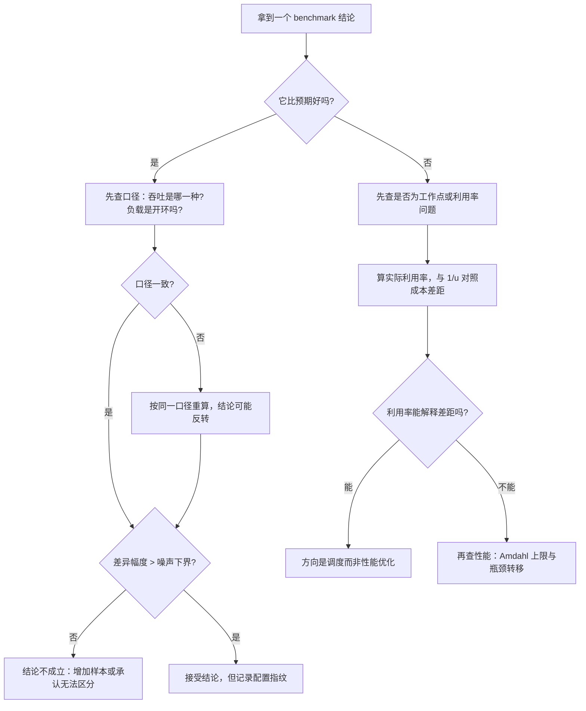

# benchmark 案例研究：五个走查

> 位置：[InferenceAtlas](../../INDEX.md) > [模块 11](README.md) > 当前文档
> 信息截至：2026-07-29 ｜ 最后核验：2026-07-29 ｜ 内容版本：v0.1
> 时效性等级：低
> 相关主题：[benchmark 方法论](01_inference_benchmarking_methodology.md)｜[可靠性事故](09_reliability_incidents_and_capacity_failures.md)｜[模块 17 案例走查](../17_interview_prep/09_mock_interview_cases.md)

## 本章导读

前十章给出了方法。这一章把方法用在五个具体场景上，
**每个场景都是一个「数字看起来没问题但结论是错的」的情形**。

**关于本章数字的说明**：五个案例中出现的所有参数
（长度、批大小、时延、比例）**都是为演示推导而设定的假设值**，
不对应任何真实系统。
受当前环境的网络出口策略限制（详见 [AGENTS.md 第 11 节](../../AGENTS.md)），
本库无法核验任何真实的 benchmark 数据，
**因此本章不引用任何外部结果**。
**这些假设值的作用是让推导可以被完整地走一遍并被读者复算**，
而推导方法本身与具体数值无关。

五个案例覆盖五类典型错误：
**口径不一致**、**闭环掩盖排队**、
**把噪声当改进**、**优化后瓶颈转移**、
以及**成本按理论产能推算**。

## 学习目标

读完本章后，读者应能够：

1. 在一份看似正常的报告中识别口径不一致并算出它造成的偏差
2. 判断一次压测是否因闭环设计而低估了生产时延
3. 用轮次间差异判断一个小幅改进是否成立
4. 识别「kernel 变快但端到端没变」并定位时间的去向
5. 用按时间段核算的方法修正被低估的成本

## 核心结论

- **口径不一致造成的偏差通常是倍数级的**，且方向可预测：多数捷径都朝乐观方向偏。
- **闭环压测测不出排队**，因此它给出的时延在生产（开环）下会被显著突破。
- **小于噪声下界的改进不成立**，而多数团队从未测过自己的噪声水平。
- **优化后瓶颈会转移**，所以验证必须同时看局部指标与端到端指标。
- **按理论产能推算成本会低估，低估的倍数约等于利用率的倒数**。

## 1. 问题定义、系统边界与工作负载

### 1.1 本章的体裁

不是新的方法，而是**方法的应用走查**。
每个案例的结构固定为：

```text
场景与给定数字（假设值）
    ↓
表面结论（看起来合理但错误）
    ↓
发现问题的那个检查
    ↓
修正后的计算
    ↓
本案例的通用教训
```

**「发现问题的那个检查」是每个案例的核心**——
它通常是一个成本很低但常被跳过的动作。

### 1.2 五个案例与对应章节

| 案例 | 错误类型 | 依据章节 |
|---|---|---|
| 一 | 吞吐口径不一致 | [第 4 章](04_throughput_concurrency_and_goodput.md) |
| 二 | 闭环掩盖排队 | [第 1 章](01_inference_benchmarking_methodology.md) |
| 三 | 把噪声当改进 | [第 1 章](01_inference_benchmarking_methodology.md) |
| 四 | 瓶颈转移 | [第 6 章](06_profiling_gpu_cpu_network_and_memory.md) |
| 五 | 成本按理论产能推算 | [第 5 章](05_power_energy_and_cost_benchmarks.md) |

## 2. 原理、数学与性能模型

本章用到的四个式子，均来自前面章节：

**（一）吞吐口径的换算**（[第 4 章](04_throughput_concurrency_and_goodput.md) 2.1）：

$$
\frac{\text{总 token 吞吐}}{\text{输出 token 吞吐}} = 1 + \frac{\overline{S_{\text{in}}}}{\overline{S_{\text{out}}}}
$$

**（二）Little's Law**（[第 4 章](04_throughput_concurrency_and_goodput.md) 2.2）：

$$
C = \lambda \cdot T
$$

**（三）Amdahl 形式的整体加速上限**（[模块 04](../04_compilers_runtimes_and_kernels/07_kernel_fusion_and_operator_optimization.md)）：

$$
\text{整体加速} = \frac{1}{(1-f) + f \cdot r}
$$

**（四）成本的按时间段核算**（[第 5 章](05_power_energy_and_cost_benchmarks.md) 3.4）：

$$
C_{\text{unit}} = \frac{\text{时段总支出}}{\text{时段总有效产出}}
$$

---

## 3. 实现机制与系统设计

### 3.1 案例一：两份报告差三倍

**场景**（假设值）。团队 A 与团队 B 分别报告同一个模型在同一硬件上的吞吐：

| 团队 | 报告的吞吐 | 声明的口径 |
|---|---|---|
| A | 12,000 tokens/s | 「token 吞吐」 |
| B | 4,000 tokens/s | 「token 吞吐」 |

**表面结论**：A 的配置比 B 快三倍，应该采用 A 的配置。

**发现问题的检查**：追问两者的输入输出长度分布。得到：

| 团队 | 平均输入 | 平均输出 |
|---|---|---|
| A | 2,000 | 100 |
| B | 2,000 | 100 |

**两者的工作负载完全相同**。那么差异从何而来？

继续追问「token 吞吐」的具体含义，发现：
**A 报的是总 token 吞吐（含输入），B 报的是输出 token 吞吐**。

**修正后的计算**。按换算式：

$$
\frac{\text{总}}{\text{输出}} = 1 + \frac{2000}{100} = 21
$$

若 B 的输出 token 吞吐是 4,000 tokens/s，
则它的总 token 吞吐应为 $4{,}000 \times 21 = 84{,}000$ tokens/s。

**结论完全反转**：按同一口径（总 token）比较，
**B 是 84,000 而 A 是 12,000——B 快了七倍**。

**或者按输出 token 口径**：A 的输出吞吐是 $12{,}000/21 \approx 571$ tokens/s，
仍然是 B 快约七倍。

**本案例的教训**：

1. **口径不一致造成的偏差在长输入场景下极大**——
   这里 $\overline{S_{\text{in}}}/\overline{S_{\text{out}}} = 20$，
   换算系数是 21 倍；
2. **「token 吞吐」这个说法本身就不够精确**，
   必须说明是输出还是总量；
3. **发现它只需要一个追问**：「你的输入输出长度分别是多少」。

**这也是 [第 4 章](04_throughput_concurrency_and_goodput.md) 建议
「分开报输出与总 token 两个数字」的原因**——
把两种成本结构完全不同的东西相加，本身就是可疑的。

### 3.2 案例二：压测通过但上线即违反 SLO

**场景**（假设值）。压测结论：

```text
并发 64 固定，运行 10 分钟
结果：TTFT p99 = 800 ms，TPOT p99 = 25 ms，吞吐 = 40 请求/s
结论：满足 SLO（TTFT p99 ≤ 1000 ms，TPOT p99 ≤ 30 ms）
```

上线后在相同的 40 请求/s 流量下，TTFT p99 达到数秒。

**表面结论**：生产环境有额外的开销（网络、代理），
应该去查基础设施。

**发现问题的检查**：**看压测是闭环还是开环**。

这里「并发 64 固定」说明是**闭环**：
始终保持 64 个在飞请求，一个完成才发下一个。

**为什么闭环会低估**。用 Little's Law 交叉验证：

$$
C = \lambda \cdot T \;\Rightarrow\; 64 = 40 \times T \;\Rightarrow\; T = 1.6\ \text{s}
$$

**这是自洽的**——但关键在于：
**闭环下 $\lambda$ 是因变量**。
系统慢下来时，在飞请求完成得慢，
**发压速率自动降低，队列永远不会积压**。

**生产是开环的**：请求按外部到达率到达，
**系统跟不上就积压**，排队时间按 $\rho/(1-\rho)$ 形式恶化。

**修正后的做法**。改用开环压测，扫一组到达率：

| 到达率（请求/s） | TTFT p99 | 是否满足 SLO |
|---|---|---|
| 20 | 待测 | — |
| 30 | 待测 | — |
| 35 | 待测 | — |
| 40 | 待测 | — |
| 45 | 待测 | — |

**曲线的膝点才是真实容量**，
而闭环压测测出的「40 请求/s」只是
「在 64 并发这个工作点上系统的自然输出速率」，
**它不保证系统能在外部施加 40 请求/s 时保持同样的时延**。

**本案例的教训**：

1. **闭环压测的结果不能直接当作容量**；
2. **区分方法很简单**：看压测是固定并发还是固定到达率；
3. **Little's Law 自洽不代表结论正确**——
   $C = \lambda T$ 在闭环下必然成立，
   **它验证的是测量的一致性，不是方法的适用性**。

**第三点值得强调**：一个常见的误解是
「Little's Law 验证通过了所以数据没问题」，
**而实际上它只能发现测量错误，不能发现方法错误**。

### 3.3 案例三：3% 的改进

**场景**（假设值）。一次 kernel 优化后重测：

```text
优化前：TPOT p99 = 25.0 ms
优化后：TPOT p99 = 24.3 ms
结论：改进 2.8%，合入
```

**表面结论**：小幅但真实的改进。

**发现问题的检查**：**问「跑了几轮，轮次之间差多少」**。

答案是：各跑了一轮。

**修正后的做法**。对同一配置重复五轮：

| 轮次 | 优化前 TPOT p99 | 优化后 TPOT p99 |
|---|---|---|
| 1 | 25.0 | 24.3 |
| 2 | 23.8 | 25.1 |
| 3 | 25.6 | 24.0 |
| 4 | 24.2 | 25.4 |
| 5 | 25.9 | 23.9 |

计算两组的均值与标准差：

- 优化前：均值 $24.9$，标准差约 $0.89$；
- 优化后：均值 $24.54$，标准差约 $0.70$。

**均值差 $0.36$ ms，而单组的标准差就有 $0.7$–$0.9$ ms**。

**结论**：**这个差异远小于测量噪声，改进不成立**。
第一次测量看到的 0.7 ms 差异只是随机波动——
**从表中可以看到，优化后有两轮（25.1 与 25.4）反而慢于优化前的两轮（23.8 与 24.2）**。

**本案例的教训**：

1. **单次测量的差异无法区分改进与噪声**；
2. **噪声下界必须先被测出来**，
   而这只需要对同一配置多跑几轮；
3. **一个实用的判断规则**：
   改进幅度应显著大于轮次间标准差，
   **且改进方向应在每一轮中都一致**——
   本例中方向不一致，是一个明确的否定信号。

**这不意味着该优化没有价值**——
可能它的收益确实存在但小于本次测量能分辨的精度。
**正确的表述是「在当前的测量精度下无法确认收益」**，
而不是「有 2.8% 的改进」。

### 3.4 案例四：kernel 快了 40%，端到端没变

**场景**（假设值）。profiling 显示某个逐元素算子序列占单步时间的 12%。
做了算子融合后，该序列的耗时下降 40%。
但重测端到端 TPOT：**几乎没有变化**。

**表面结论**：融合没有生效，或者测量有误。

**发现问题的检查**：**先算 Amdahl 上限**。

$$
\text{整体加速上限} = \frac{1}{(1 - 0.12) + 0.12 \times 0.6} = \frac{1}{0.88 + 0.072} = \frac{1}{0.952} \approx 1.050
$$

**即整体上限只有约 5%**。

**而 5% 的改进是否能被观测到，取决于噪声水平**（案例三的教训）。
若轮次间差异是 3%，**5% 的改进只是勉强可分辨**。

**继续检查**：重新 profile，发现另一件事——
**融合后该段的耗时确实下降了，但相邻的另一个 kernel 的耗时上升了**。

原因是：融合改变了数据布局，
**使得后续 kernel 的访存不再连续**
（[第 6 章](06_profiling_gpu_cpu_network_and_memory.md) 提到的第三种融合失效情形）。

**修正后的计算**。把两段一起看：

| 段 | 融合前占比 | 融合后占比 |
|---|---|---|
| 逐元素序列 | 12% | 7.2% |
| 相邻 kernel | 20% | 24% |
| 两段合计 | 32% | 31.2% |

**净收益只有 0.8 个百分点，落在噪声里**。

**本案例的教训**：

1. **优化前先算 Amdahl 上限**，
   它能提前告诉你「这件事最多值多少」——
   12% 的段即使优化到零，整体上限也只有约 1.14 倍；
2. **验证必须同时看局部与端到端**，
   否则会把「时间转移」当成「没生效」或反之；
3. **融合可能损害相邻算子**，
   这是 [第 6 章](06_profiling_gpu_cpu_network_and_memory.md) 与
   [模块 04](../04_compilers_runtimes_and_kernels/07_kernel_fusion_and_operator_optimization.md) 都提到的一种失效模式，
   **而它只有在「重新 profile 整个单步」时才会被发现**。

**一个方法论要点**：优化后不应只重测被优化的那一段，
**而应重测完整的 kernel 分布**。

### 3.5 案例五：实际成本是估算的两倍半

**场景**（假设值）。上线前的成本估算：

```text
单机满载吞吐：1,000 输出 tokens/s
单机月成本：C_machine
估算：每百万 token 成本 = C_machine / (1000 × 86400 × 30 / 1e6)
                        = C_machine / 2592
```

上线三个月后，财务核算显示实际单位成本约为估算的 2.5 倍。

**表面结论**：吞吐没达到预期，需要性能优化。

**发现问题的检查**：**按时间段核算重算一遍**。

取一个月的实际数据：

| 项 | 值（假设） |
|---|---|
| 该月总支出 | $C_{\text{total}}$ |
| 该月总输出 token | $T_{\text{actual}}$ |
| 部署的机器数 | $N$ |
| 理论满载产出 | $N \times 1000 \times 86400 \times 30$ |

计算实际利用率：

$$
u = \frac{T_{\text{actual}}}{N \times 1000 \times 86400 \times 30}
$$

**假设算出 $u = 0.40$**。

**修正后的解释**。单位成本与利用率成反比：

$$
C_{\text{unit}} = \frac{C_{\text{total}}}{T_{\text{actual}}} = \frac{C_{\text{total}}}{u \times \text{理论产出}} = \frac{1}{u} \times C_{\text{unit,理论}}
$$

$1/0.40 = 2.5$——**恰好解释了 2.5 倍的差距**。

**也就是说：吞吐并没有问题，问题在于机器有 60% 的时间没有满载运行**。

**利用率低的四个来源需要进一步分解**：

| 来源 | 检查 |
|---|---|
| 日内与周内的流量波动 | 看利用率的时间曲线 |
| 为容错保留的冗余 | 看副本数与最小可用数之差 |
| 为满足 SLO 保留的余量 | 看峰值时的利用率是否也不高 |
| 失败与重试的浪费 | 看拒绝率、超时率、抢占率 |

**修正的方向完全不同**：

- 若主要来自波动 → **混合负载**（离线填谷）或弹性扩缩容；
- 若主要来自冗余 → 重新评估可用性目标与恢复速度；
- 若主要来自 SLO 余量 → 与业务讨论 SLO 的成本
  （见 [第 8 章](08_slos_slas_and_error_budgets.md) 2.5）；
- 若主要来自失败 → 查可靠性问题。

**本案例的教训**：

1. **按理论产能推算会系统性低估成本，低估倍数约等于利用率的倒数**；
2. **「成本超预期」的第一个检查应当是利用率而不是性能**——
   性能优化在利用率只有 40% 时的边际收益，
   **远低于把利用率提上去**；
3. **按时间段核算自动包含了空闲、冗余与失败**，
   因此它是唯一可靠的核算方式。

---

## 4. 性能、成本、能耗与可靠性 trade-off

### 4.1 五个案例的共同结构

| 案例 | 表面结论的方向 | 真实情况 |
|---|---|---|
| 一 | A 比 B 快 | B 比 A 快 |
| 二 | 容量够 | 容量不够 |
| 三 | 有改进 | 无法确认 |
| 四 | 优化没生效 | 上限本来就低，且时间转移了 |
| 五 | 性能不达标 | 利用率低 |

**四个案例（一、二、三、五）的表面结论都朝乐观或误导方向偏**。
**这不是巧合**：多数测量捷径（用总 token 报吞吐、
用闭环压测、跑一轮、按理论产能推算）
**都恰好朝着让数字更好看的方向**。

**因此一个实用的启发是：当一个数字比预期好时，先检查口径**。

### 4.2 五个低成本的检查

每个案例的「发现问题的检查」都很便宜：

| 案例 | 检查 | 成本 |
|---|---|---|
| 一 | 追问输入输出长度 | 一句话 |
| 二 | 问是固定并发还是固定到达率 | 一句话 |
| 三 | 同配置多跑几轮 | 几十分钟 |
| 四 | 优化前先算 Amdahl 上限 | 几分钟 |
| 五 | 算实际利用率 | 几分钟 |

**五个检查的总成本不到一小时，而它们纠正的是倍数级的错误结论**。

### 4.3 什么时候可以跳过这些检查

**探索性测量可以跳过**，只要结论强度被明确标注：
「初步看下来 A 更快，还没核对口径」是完全合格的陈述。

**不能跳过的三种场景**：

1. **横向比较**（案例一）；
2. **容量规划**（案例二、五）；
3. **决定是否合入变更**（案例三、四）。

## 5. benchmark、真实案例或公开部署案例

**本章的全部数字都是为演示推导而设定的假设值**，
不对应任何真实系统或产品。

受当前环境的网络出口策略限制（详见 [AGENTS.md 第 11 节](../../AGENTS.md)），
本库无法访问任何真实的 benchmark 结果或生产数据，
**因此不引用任何外部案例**。

**读者应做的练习**：用自己服务的真实数据把五个案例各走一遍。

| 案例 | 你的检查结果 |
|---|---|
| 一：你报告吞吐时用的是哪种口径？$\overline{S_{\text{in}}}/\overline{S_{\text{out}}}$ 是多少？ | 待填 |
| 二：你的压测是闭环还是开环？ | 待填 |
| 三：你的轮次间相对差异（噪声下界）是多少？ | 待填 |
| 四：你最近一次优化的 Amdahl 上限是多少？实际达到多少？ | 待填 |
| 五：你的平均利用率是多少？$1/u$ 与「实际成本/估算成本」是否吻合？ | 待填 |

**第三行是最值得优先做的**：
**多数团队从未测过自己的噪声下界，
因此无法判断任何小幅改进是否成立**。

> 实验方法论要求见 [如何读推理 benchmark](../00_start_here/03_how_to_read_inference_benchmarks.md)。

## 6. 设计决策框架



**图解读**：

1. **本图展示什么**：拿到结论后的验证流程。
   分叉点是「比预期好还是差」——
   **两个方向要查的东西不同**。
2. **核心瓶颈**：瓶颈在 B 节点的判断。
   **「比预期好」时人的本能是接受而不是质疑**，
   而案例一、二、三、五都属于这一类。
   **把「先查口径」变成一个条件反射，是本章最实用的收获**。
3. **图中的 trade-off**：C 与 G 两步会拖慢结论的产出。
   **但它们的成本是分钟到小时级，而纠正的是倍数级的错误**——
   这个交换在需要做决策时永远划算。
4. **面试如何引用**：可以说
   「看到一个比预期好的数字我会先查口径与负载模式；
   看到比预期差的数字我会先算利用率——
   **因为成本超预期的第一嫌疑是利用率而不是性能**」。

## 7. 常见失败模式与排查路径

| 症状 | 对应案例 | 第一个检查 |
|---|---|---|
| 两份报告差数倍 | 一 | 追问输入输出长度与吞吐口径 |
| 压测通过但上线违反 SLO | 二 | 是固定并发还是固定到达率 |
| 小幅改进无法复现 | 三 | 同配置多跑几轮，算噪声下界 |
| 局部优化但端到端无变化 | 四 | 算 Amdahl 上限；重测完整 kernel 分布 |
| 成本远超估算 | 五 | 算实际利用率，与 $1/u$ 对照 |
| Little's Law 自洽但结论仍错 | 二 | 它验证测量一致性，不验证方法适用性 |

## 8. 关联面试主题

1. 读 benchmark 的九项口径清单——见 [Q089](../17_interview_prep/07_debug_benchmark_and_reliability_questions.md)
2. 可复现压测的设计——见 [Q090](../17_interview_prep/07_debug_benchmark_and_reliability_questions.md)
3. 「吞吐 5000 tokens/s」要追问什么——见 [Q002](../17_interview_prep/01_inference_system_design.md)
4. 算子融合的收益上限——见 [Q046](../17_interview_prep/04_compiler_kernel_and_quantization_questions.md)
5. 每百万 token 成本的拆解——见 [Q085](../17_interview_prep/06_hardware_and_datacenter_questions.md)

## 9. 小结

五个案例覆盖五类典型错误，
**而它们有一个共同结构：表面结论朝乐观或误导方向偏**。
这不是巧合——多数测量捷径
（用总 token 报吞吐、用闭环压测、只跑一轮、按理论产能推算）
**都恰好让数字更好看**。

**因此本章最实用的一条启发是：当一个数字比预期好时，先检查口径**。

**五个低成本检查**，总耗时不到一小时：

1. **追问输入输出长度**（案例一）——
   长输入场景下总 token 与输出 token 的换算系数可以是二十倍量级；
2. **问压测是固定并发还是固定到达率**（案例二）——
   闭环结构性地测不出排队，
   **而 Little's Law 自洽只能验证测量一致性，不能验证方法适用性**；
3. **同配置多跑几轮算噪声下界**（案例三）——
   小于噪声的改进不成立，**而方向在各轮之间不一致是明确的否定信号**；
4. **优化前先算 Amdahl 上限**（案例四）——
   它提前告诉你这件事最多值多少，
   **同时提醒你验证要重测完整分布而非只测被优化的那一段**；
5. **算实际利用率**（案例五）——
   **成本超预期的第一嫌疑是利用率而不是性能**，
   而低估的倍数约等于利用率的倒数。

**本章的全部数字都是假设值**，用于让推导可以被完整走一遍。
**方法本身与具体数值无关**——
建议读者用自己服务的真实数据把五个案例各走一遍，
**其中「测出自己的噪声下界」最值得优先做**。

## 关键术语

| 中文术语 | 英文 | 定义 | 单位/口径 | 关联文档 |
|---|---|---|---|---|
| 口径换算系数 | unit conversion factor | 总 token 与输出 token 吞吐之比 | 无量纲 | 本章 3.1 |
| 噪声下界 | measurement noise floor | 同配置多轮之间的相对差异 | 无量纲比例 | 本章 3.3 |
| 瓶颈转移 | bottleneck migration | 优化一处后时间转移到另一处 | — | 本章 3.4 |
| 利用率倒数效应 | inverse-utilization effect | 单位成本反比于平均利用率 | 无量纲倍数 | 本章 3.5 |

## 延伸阅读

- [推理 benchmark 方法论](01_inference_benchmarking_methodology.md)
- [吞吐、并发与 goodput](04_throughput_concurrency_and_goodput.md)
- [功耗、能耗与成本基准](05_power_energy_and_cost_benchmarks.md)
- [全栈 profiling](06_profiling_gpu_cpu_network_and_memory.md)
- [模块 17：系统设计案例走查](../17_interview_prep/09_mock_interview_cases.md)

## 主要来源

本章为**方法应用走查**，全部推导基于本模块第 1、4、5、6 章
与 [模块 04 第 7 章](../04_compilers_runtimes_and_kernels/07_kernel_fusion_and_operator_optimization.md) 的模型。

**本章的全部数字均为演示推导而设定的假设值，不对应任何真实系统**。
受当前环境的网络出口策略限制，本库无法核验任何真实的 benchmark 结果
（详见 [AGENTS.md 第 11 节](../../AGENTS.md)），
**因此不引用任何外部案例或数据**。

| 类别 | 说明 | 披露标签 |
|---|---|---|
| 五个案例的推导方法 | 由本模块第 1、4、5、6 章推导 | — |
| 案例中的全部数字 | **假设值**，为演示推导而设定 | — |
| 读者用自己数据完成的练习 | 应自行测量 | `独立可复现实验` |
| 任何真实系统的 benchmark 结果 | **本章未给出** | `待核实` |

## 更新记录

| 日期 | 版本 | 变更 | 核验人 |
|---|---|---|---|
| 2026-07-29 | v0.1 | 初稿：五个走查（口径不一致、闭环掩盖排队、噪声、瓶颈转移、利用率），全部数字为假设值 | — |
