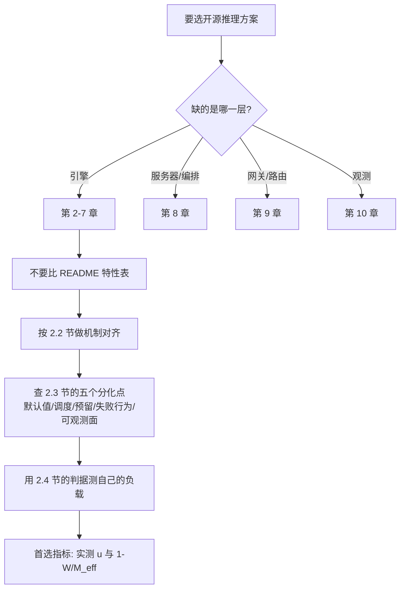

# 开源推理生态全景

> 位置：[InferenceAtlas](../../INDEX.md) > [模块 12](README.md) > 当前文档
> 信息截至：2026-08-10 ｜ 最后核验：2026-08-10 ｜ 内容版本：v0.1
> 时效性等级：**高**（上游演进快，见第 5 节的版本与核验日期）
> 相关主题：[serving 架构总览](../03_serving_engines_and_scheduling/01_serving_architecture_overview.md)｜[硬件选型框架](../07_hardware_and_server_architecture/13_hardware_selection_framework.md)｜[推理 benchmark 方法论](../11_benchmarking_reliability_and_observability/01_inference_benchmarking_methodology.md)

## 本章导读

选开源推理引擎时最常见的做法，是把各项目 README 的特性列表拉成一张对照表。
**本章要先证明这个做法不成立**。

下表是用正则在五个项目的 README 上做特性匹配的结果
（来源与核验日期见第 5 节）：

| 特性 / 项目 | vLLM | SGLang | TensorRT-LLM | TGI | LMDeploy |
|---|---|---|---|---|---|
| continuous batching | 有 | 有 | — | 有 | 有 |
| 分页 KV | 有 | 有 | — | 有 | 有 |
| prefix caching | 有 | 有 | 有 | — | 有 |
| TP/PP/EP 并行 | — | 有 | 有 | 有 | 有 |

**这张表有多处是错的，而错误不在项目而在方法**：

- TensorRT-LLM 的 README 里没有 "continuous batching" 字样，
  **但它有等价机制**，在该项目的术语里叫 **in-flight batching**；
- 它也没有 "prefix caching"，**而是写作 `KV Cache Reuse`**；
- SGLang 把前缀缓存写作 **`RadixAttention`**；
- vLLM 那一行的 "—" 更是纯粹的匹配失误——
  它的 README 原文是
  「Tensor, pipeline, data, expert, and context parallelism」，
  **五种并行俱全**。

**结论**：
**同一个机制在不同项目里有不同名字，因此基于 README 词面的对照表在多数格子上不可信**。
**特性清单对比法在这个生态里方法上就是无效的**。

本章给出替代方案：
**按机制而非按名词对齐**，
**用本库前几模块已经建立的判据去测自己的负载**，
而不是比较项目的自我描述。

**关于本章来源的说明**：
本章的全部事实性陈述**均来自本次实际读取的仓库文件**（第 5 节逐条列出路径与核验日期），
披露标签为 `开源代码/配置披露`。
受当前环境的网络出口策略限制（详见 [AGENTS.md 第 11 节](../../AGENTS.md)），
各项目的**官方文档站点不可达**（`docs.vllm.ai` 等均为 403），
**因此本章只使用仓库内的文档与代码**——
所幸这些项目的文档源文件就在仓库里。
**本章不引用任何项目的采用规模、客户名单或性能宣称**：
它们是项目自述的推广性陈述，未经独立核验，且对技术判断没有帮助。

## 学习目标

读完本章后，读者应能够：

1. 说明为什么基于 README 的特性对照表不可信，并举出至少三组同义术语
2. 按「引擎 / 服务器 / 编排 / 网关 / 观测」五层定位一个开源项目
3. 用机制对齐表把不同项目的术语映射到本库的统一概念
4. 设计一次不依赖项目自述的横向评估
5. 说明为什么本章的结论必须带版本与核验日期，以及怎样判断它是否已过期

## 核心结论

- **README 特性清单不可比**：同一机制有多个名字（prefix caching / RadixAttention / KV Cache Reuse 是同一件事）。
- **特性趋同、默认值分化**：成熟引擎的机制集合高度重叠，**真正的差异在默认参数、调度策略与运维面**。
- **必须按机制对齐而非按名词对齐**，本章第 2.2 节给出映射表。
- **生态分五层**，选型时要先确认自己缺的是哪一层——**混淆层次是选型失败的常见起点**。
- **任何横向结论都会过期**：本章的每条事实都带仓库路径与核验日期，读者应按第 5 节的方法复核。
- **评估必须用自己的负载**：项目的自我描述与他人的 benchmark 都不能替代
  [模块 11 第 1 章](../11_benchmarking_reliability_and_observability/01_inference_benchmarking_methodology.md) 的口径要求。

## 1. 问题定义、系统边界与工作负载

### 1.1 生态的五层

**混淆层次是选型失败的常见起点**——
「用 vLLM 还是 Kubernetes」这类问题本身就问错了，因为两者不在同一层。

| 层 | 职责 | 本模块对应章节 |
|---|---|---|
| **推理引擎** | 批处理、KV 管理、kernel、并行 | 第 2–7 章 |
| **推理服务器** | 多模型装载、协议、版本管理 | [第 8 章](README.md) |
| **编排** | 副本、扩缩容、滚动发布、调度 | [第 8 章](README.md) |
| **网关 / 路由** | 多模型路由、配额、计费、鉴权 | [第 9 章](README.md) |
| **观测** | 指标、日志、追踪 | [第 10 章](README.md) |

**一个项目可以横跨多层**，
因此「它属于哪一层」应当按**它替代了什么**来判断，而不是按它自称什么。

### 1.2 本章不做什么

| 不做 | 理由 |
|---|---|
| 排名或推荐「最好的引擎」 | 依赖负载，且会过期 |
| 复制各项目的性能宣称 | 未经独立核验；口径不明 |
| 引用采用规模与客户名单 | 推广性陈述，与技术判断无关 |
| 冻结一张特性对照表 | **本章的主论点就是它不可信** |

## 2. 原理、数学与性能模型

### 2.1 特性清单为什么不可比

**三重原因**：

| 原因 | 表现 | 例 |
|---|---|---|
| **命名分歧** | 同一机制不同名字 | prefix caching / RadixAttention / KV Cache Reuse |
| **粒度分歧** | 有的项目把一组机制合称一个特性 | 「continuous batching」是否含 chunked prefill 各家不同 |
| **深度分歧** | 「支持」可能只到能跑通 | 见 [模块 04 第 6 章](../04_compilers_runtimes_and_kernels/06_onnx_runtime_openvino_and_portability.md) 的 L1/L2/L3 |

**第三重最危险**：
README 上的一个勾对应的可能是 L1（能跑通）也可能是 L3（接近最优），
**而两者的性能差距可以是数倍**。

### 2.2 机制对齐表

**正确的做法是把各家术语映射到统一概念**。
下表左列是本库的统一概念（见 [GLOSSARY](../../GLOSSARY.md)），
右列是本次在仓库中实际读到的各家措辞：

| 本库概念 | 已实际读到的各家措辞 |
|---|---|
| 连续批处理 | `continuous batching`（vLLM/SGLang/TGI/LMDeploy）；`in-flight batching`（TensorRT-LLM 的术语） |
| 前缀缓存 | `prefix caching`（vLLM/SGLang）；`RadixAttention`（SGLang）；`KV Cache Reuse`（TensorRT-LLM） |
| 分页 KV | `PagedAttention`（vLLM）；`paged attention`（SGLang） |
| 分块 prefill | `chunked prefill`（vLLM/SGLang） |
| PD 分离 | `disaggregated prefill/decode`（vLLM）；`pd_disaggregation`（SGLang 文档目录名） |
| 结构化输出 | `structured outputs` + `xgrammar`/`guidance`（vLLM）；`structured_outputs`（SGLang） |
| 投机解码 | `speculative decoding`（vLLM/SGLang/TensorRT-LLM） |

**这张表本身也会过期**，因此第 5 节给出了逐条的仓库路径，
**读者应当按同样的方法在自己关心的版本上重建它**。

**注意 SGLang 同时使用 `prefix caching` 与 `RadixAttention`**：
前者是通用概念，后者是它的具体实现名。
**这提示了一个识别技巧**：
**当一个项目为某机制起了专名，通常意味着它在该处做了区别于通用实现的设计**——
值得单独读它的设计文档，而不是当作同名机制略过。

### 2.3 趋同与分化

**成熟引擎的机制集合高度重叠**（第 2.2 节即是证据：每一行都有多家）。
**因此差异不在「有没有」，而在下面这些不写进 README 的地方**：

| 分化点 | 为什么重要 | 怎么查 |
|---|---|---|
| **默认参数** | 默认值决定了开箱行为，且多数部署不改 | 读参数文档与代码默认值 |
| **调度策略** | 决定 TTFT/TPOT 的取舍方向 | 读调度器实现 |
| **内存预留策略** | 决定有效容量比 $u$（[模块 07 第 5 章](../07_hardware_and_server_architecture/05_memory_capacity_bandwidth_and_kv_cache.md)） | 读显存分配逻辑与相关参数 |
| **失败行为** | 超载时排队、拒绝还是抢占 | 读准入与抢占逻辑 |
| **可观测面** | 能不能拿到 [模块 11](../11_benchmarking_reliability_and_observability/07_observability_metrics_logs_traces.md) 要求的指标 | 读指标导出 |

**这五项都需要读代码或参数文档，不能从特性列表得到**——
这就是本模块后续各章要逐项目做的事。

### 2.4 评估应当用哪些判据

**不要新造判据**。本库前几模块已经给出了可直接套用的量：

| 判据 | 来源 | 用途 |
|---|---|---|
| $M_{\text{eff}}/W$ 与 $1-W/M$ | [模块 07 第 5 章](../07_hardware_and_server_architecture/05_memory_capacity_bandwidth_and_kv_cache.md) | 引擎的有效容量比直接改变它 |
| $B_{\text{half}} = W/(Sk)$ | 同上 | 批处理收益的拐点 |
| 通信占 TPOT 的比例 | [模块 08 第 1 章](../08_networking_and_interconnect/01_inference_networking_overview.md) | 分布式配置是否合理 |
| 实测 ÷ 标称带宽 | [模块 07 第 4 章](../07_hardware_and_server_architecture/04_hbm_dram_and_memory_hierarchy.md) | 区分带宽不足与并发不足 |
| 开环 vs 闭环、分位数配样本量 | [模块 11 第 1、3 章](../11_benchmarking_reliability_and_observability/01_inference_benchmarking_methodology.md) | 测量口径 |

**关键是第一行**：
**不同引擎在同样的硬件上给出的有效容量比 $u$ 可以差很多**
（预留策略、碎片处理、图捕获占用的差异），
而 $u$ 通过 $1-W/M_{\text{eff}}$ 直接决定可达吞吐比例。
**这是一个可测、可比、且与项目自述无关的量**——
**本库推荐把它作为横向评估的第一个指标**。



**图解读**：

1. **本图展示什么**：一条从「缺哪一层」出发的选型路径。
   **入口是层次判断而不是项目比较**——
   因为不同层的项目根本不构成替代关系。
2. **核心瓶颈**：瓶颈在节点 G→H。
   **特性对照表是最容易做、也最没有信息量的一步**；
   跳过它、直接做机制对齐，才能进入有区分度的部分（节点 I）。
3. **图中的 trade-off**：机制对齐与读代码的成本远高于抄特性表，
   换来的是**结论可用**。
   **在这个生态里这个取舍是划算的**，因为特性表的结论基本是噪声。
4. **面试如何引用**：可以说
   「我不会用 README 的特性表做横向对比——
   **同一个机制在三家有三个名字**，
   TensorRT-LLM 的 in-flight batching 就是连续批处理，
   它的 KV Cache Reuse 就是前缀缓存。
   我会按机制对齐，然后查默认值、调度、内存预留这些不写进 README 的地方，
   **横向评估的第一个指标我用实测的有效容量比**」。

## 3. 实现机制与系统设计

### 3.1 读一个项目的顺序

**从仓库读，而不是从宣传页读**：

| # | 读什么 | 得到 |
|---:|---|---|
| 1 | README | 定位它在五层中的位置 |
| 2 | 仓库内 `docs/` 的目录结构 | **它认为重要的东西**（目录名即优先级） |
| 3 | 参数/配置文档 | 默认值与可调面 |
| 4 | 设计文档（若有） | 调度与内存的真实策略 |
| 5 | 版本与发布节奏 | 时效性风险 |

**第 2 步值得强调**：
**一个项目的文档目录结构，比它的 README 更能说明它的重点**。
例如本次读到 SGLang 的 `docs/advanced_features/` 下有
`pd_disaggregation`、`hicache_design`、`expert_parallelism`、`speculative_decoding` 等条目
（完整路径见第 5 节），
**这组目录名本身就说明了该项目在分布式与缓存层次上的投入方向**。

### 3.2 版本与时效

**本模块是全库时效性最高的部分**。因此本模块的强制要求是：

| 要求 | 做法 |
|---|---|
| 每条事实带来源路径 | 精确到仓库内文件路径 |
| 每条事实带核验日期 | 见各章头部与第 5 节 |
| 配置示例标注版本 | 用可解析的 tag，不用 `main` |
| 提供复核方法 | 读者能自己重跑一遍 |

**「不用 `main`」这一条很重要**：
`main` 会漂移，**用 `main` 写的配置示例在读者读到时可能已经失效且无法追溯**。
**用 tag 则任何时候都能取回当时的确切内容**。

### 3.3 本章使用的复核方法

**读者可以用同样的方法复核本章的每一条**：

```bash
# 1) 取某个 tag 下的文件（tag 可解析即证明版本存在）
curl -sS https://raw.githubusercontent.com/<owner>/<repo>/<tag>/<path>

# 2) 浏览仓库目录（确认路径未变）
#    在浏览器或支持的抓取工具中打开：
#    https://github.com/<owner>/<repo>/tree/<tag>/<dir>

# 3) 确认最新 release tag
#    https://github.com/<owner>/<repo>/releases
```

**本章第 5 节列出的每一条都可以用第 1 条命令直接验证**。

## 4. 性能、成本、能耗与可靠性 trade-off

### 4.1 选型的四类成本

| 成本 | 说明 |
|---|---|
| **迁移成本** | 换引擎要重做部署、监控、调优 |
| **跟进成本** | 上游演进快，**不跟进则错过优化、跟进则要持续验证** |
| **调优成本** | 默认值未必适合你的负载（第 2.3 节） |
| **不可替代性风险** | 深度依赖某项目的专有特性会提高后续迁移成本 |

**第二项是这个生态特有的**：
项目迭代快是优点也是负担——
**每次升级都需要按 [模块 11](../11_benchmarking_reliability_and_observability/01_inference_benchmarking_methodology.md) 的口径重测**，
否则无法区分「升级带来的改善」与「测量条件变化」。

### 4.2 性能与可运维性

| 倾向 | 得到 | 付出 |
|---|---|---|
| 追最新版本 | 最新优化 | 稳定性与验证负担 |
| 锁定较旧版本 | 稳定 | 错过优化；安全修复滞后 |
| 深度定制 | 贴合负载 | **升级时的合并成本** |
| 只用默认配置 | 易维护 | 默认值未必适合（第 2.3 节） |

**第三行的成本容易被低估**：
定制越深，越难跟上上游，
**最终可能被迫停留在某个旧版本上**——
这是把「跟进成本」推迟而非消除。

### 4.3 可靠性

**开源项目的可靠性评估维度与商业产品不同**：

| 维度 | 怎么看 |
|---|---|
| 发布节奏 | releases 页的间隔 |
| 回归测试覆盖 | 仓库内的 CI 配置与测试目录 |
| 已知问题的处理 | issue 的响应与关闭方式 |
| 破坏性变更的沟通 | release notes 是否标注 |

**这些都可以在仓库里读到**，
**因此它们是本模块可以核验的部分**——
与性能宣称不同。

## 5. benchmark、真实案例或公开部署案例

**本节列出本章全部事实性陈述的来源，读者可逐条复核**。

**核验方法**：见第 3.3 节。**核验日期：2026-08-10**。

### 5.1 本次实际读取的文件

| 项目 | 文件路径（相对仓库根） | 用于本章的哪一处 |
|---|---|---|
| vLLM | `README.md` | 第 2.2 节的措辞、五种并行的原文 |
| vLLM | `docs/configuration/optimization.md` | 第 2.3 节的分化点 |
| vLLM | `docs/design/arch_overview.md` | 第 3.1 节的读法 |
| vLLM | `docs/serving/data_parallel_deployment.md` | 同上 |
| vLLM | `docs/features/disagg_prefill.md` | 第 2.2 节 PD 分离措辞 |
| SGLang | `README.md` | 第 2.2 节 RadixAttention 措辞 |
| SGLang | `docs/docs.json` | 第 3.1 节的文档目录结构 |
| SGLang | `docs/advanced_features/pd_disaggregation.mdx` | 第 2.2 节 |
| SGLang | `docs/advanced_features/structured_outputs.mdx` | 第 2.2 节 |
| SGLang | `docs/advanced_features/hicache_design.mdx` | 第 3.1 节 |
| TensorRT-LLM | `README.md` | 第 2.2 节 `KV Cache Reuse` 措辞 |
| TGI | `README.md` | 第 2.1 节的对照表 |
| LMDeploy | `README.md` | 同上 |
| llama.cpp | `README.md`（分支 `master`） | 第 1.1 节分层 |
| Triton Inference Server | `README.md` | 第 1.1 节分层 |

**披露标签：全部为 `开源代码/配置披露`**。

### 5.2 已核验存在的版本 tag

**下列 tag 在核验日期可解析**（方法见第 3.3 节第 1 条）：

| 项目 | 已验证可解析的 tag |
|---|---|
| vLLM | `v0.26.0`、`v0.25.0` |
| SGLang | `v0.5.17` |
| TensorRT-LLM | `v1.2.0` |

**说明**：
本表只声明「该 tag 在核验日期存在且可取回文件」，
**不声明它是最新版本**——后者会随时变化，读者应自行查 releases 页。
**发布日期本库未予采信**：
本次读取时该信息来自页面的相对时间描述，转换存在歧义，
**故标为 `待核实`**。

### 5.3 本章明确不提供的内容

| 类别 | 状态 | 理由 |
|---|---|---|
| 各项目的性能对比数字 | **未给出** | 口径不明且未独立核验 |
| 采用规模、客户名单 | **未给出** | 项目自述的推广性陈述 |
| 官方文档站点内容 | **不可达** | `docs.vllm.ai` 等均被出口策略拒绝（403） |
| 各项目的 release 发布日期 | `待核实` | 见第 5.2 节说明 |

> 测量方法论的通用要求见
> [推理 benchmark 方法论](../11_benchmarking_reliability_and_observability/01_inference_benchmarking_methodology.md)。

## 6. 设计决策框架

**判定标准**：

| 观察 | 结论 |
|---|---|
| 候选方案不在同一层 | **问题问错了**，先定位缺哪一层（第 1.1 节） |
| 只有 README 特性表作依据 | **依据不成立**，做机制对齐（第 2.2 节） |
| 某项目为某机制起了专名 | 值得单独读其设计文档（第 2.2 节） |
| 未测过实际有效容量比 $u$ | **先测**，它直接改变可达吞吐比例 |
| 配置示例用 `main` 而非 tag | 不可追溯，**要求改为 tag** |
| 结论没有核验日期 | 无法判断是否过期 |

**这些判据不依赖任何具体项目，可长期使用**。

## 7. 常见失败模式与排查路径

| 症状 | 首先怀疑 | 检查 |
|---|---|---|
| 按特性表选的方案不合适 | **特性表不可比** | 第 2.1、2.2 节 |
| 「支持」的特性性能很差 | L1 而非 L3 | [模块 04 第 6 章](../04_compilers_runtimes_and_kernels/06_onnx_runtime_openvino_and_portability.md) |
| 换引擎后可用显存差很多 | **有效容量比 $u$ 不同** | [模块 07 第 5 章](../07_hardware_and_server_architecture/05_memory_capacity_bandwidth_and_kv_cache.md) |
| 默认配置下表现不如预期 | 默认值面向别的负载 | 第 2.3 节 |
| 升级后性能变化说不清 | 测量条件也变了 | [模块 11 第 1 章](../11_benchmarking_reliability_and_observability/01_inference_benchmarking_methodology.md) |
| 文档里的配置跑不通 | 版本漂移 | 用 tag 而非 `main` |
| 找不到某项目的官方文档 | **站点被出口策略拒绝** | 改读仓库内 `docs/` |

**最后一行在本环境下是常态**：
**这些项目的文档源文件就在仓库里**，
因此站点不可达并不妨碍读到官方文档内容。

## 8. 关联面试主题

- 开源引擎的横向评估方法 → [模块 17 系统设计题](../17_interview_prep/01_inference_system_design.md)
- 特性「支持」的三个层次 → [模块 17 编译器与 kernel 题](../17_interview_prep/04_compiler_kernel_and_quantization_questions.md)
- 有效容量比与可达吞吐 → [模块 17 KV cache 题](../17_interview_prep/02_kv_cache_and_transformer_questions.md)
- 升级前后的可比性 → [模块 17 调试与 benchmark 题](../17_interview_prep/07_debug_benchmark_and_reliability_questions.md)

## 9. 小结

**本章的主论点是一个方法论否定**：
**基于 README 特性清单的横向对比在这个生态里不成立**。

证据是本次实际读取的五个 README：
同一个机制有三个名字——
**`prefix caching`（vLLM）、`RadixAttention`（SGLang）、`KV Cache Reuse`（TensorRT-LLM）**；
连续批处理在 TensorRT-LLM 的术语里是 **`in-flight batching`**。
**按词面匹配得到的对照表，多数格子是错的**。

**替代方案分三步**：

1. **定位层次**：引擎 / 服务器 / 编排 / 网关 / 观测。
   **不同层的项目不构成替代关系**，混淆层次是选型失败的常见起点。
2. **按机制对齐而非按名词对齐**（第 2.2 节的映射表）。
   一个识别技巧：**项目为某机制起了专名，通常意味着它在那里做了不同的设计**，
   值得单独读设计文档。
3. **用自己的负载测本库已有的判据**，
   **首选实测的有效容量比 $u$**——
   它通过 $1-W/M_{\text{eff}}$ 直接决定可达吞吐比例，
   且与项目的自我描述完全无关。

**真正的差异不在 README 上**，而在五个不写进特性表的地方：
**默认参数、调度策略、内存预留、失败行为、可观测面**。
本模块后续各章逐项目处理这五项。

**最后是本模块的时效性纪律**：
每条事实带仓库路径与核验日期，配置示例用 **tag 而非 `main`**——
否则读者读到时既无法复现也无法追溯。
**本章的每一条都可以用第 3.3 节的三条命令自行复核**。

## 关键术语

| 中文术语 | 英文 | 定义 | 单位/口径 | 关联文档 |
|---|---|---|---|---|
| 机制对齐 | mechanism alignment | 把各项目术语映射到统一概念，而非按词面比较 | — | 本章 2.2 |
| 命名分歧 | naming divergence | 同一机制在不同项目中的不同名称 | — | 本章 2.1 |
| 分化点 | differentiator | 不写进特性表但决定实际行为的设计选择 | — | 本章 2.3 |
| 有效容量比 | effective capacity ratio $u$ | 实际可分配给 KV 的容量占标称的比例；**推荐的首选横向指标** | % | [模块 07 第 5 章](../07_hardware_and_server_architecture/05_memory_capacity_bandwidth_and_kv_cache.md) |
| 跟进成本 | upstream-tracking cost | 随上游演进而持续验证与适配的成本 | — | 本章 4.1 |

## 延伸阅读

- [serving 架构总览](../03_serving_engines_and_scheduling/01_serving_architecture_overview.md)
- [连续批处理](../03_serving_engines_and_scheduling/02_static_dynamic_and_continuous_batching.md)
- [PagedAttention 与 KV 内存管理](../03_serving_engines_and_scheduling/03_pagedattention_and_kv_memory_management.md)
- [显存容量、带宽与 KV cache](../07_hardware_and_server_architecture/05_memory_capacity_bandwidth_and_kv_cache.md)
- [跨硬件可移植性与代价](../04_compilers_runtimes_and_kernels/06_onnx_runtime_openvino_and_portability.md)
- [推理 benchmark 方法论](../11_benchmarking_reliability_and_observability/01_inference_benchmarking_methodology.md)

## 主要来源

本章的全部事实性陈述来自 **2026-08-10 实际读取的开源仓库文件**，
逐条路径见第 5.1 节，已核验的版本 tag 见第 5.2 节。

**各项目的官方文档站点在当前环境不可达**
（`docs.vllm.ai` 等返回 403，详见 [AGENTS.md 第 11 节](../../AGENTS.md)），
**因此本章只使用仓库内的文档与代码**。

| 类别 | 说明 | 披露标签 |
|---|---|---|
| 各项目 README 与仓库内文档的措辞与内容 | 见第 5.1 节的逐条路径 | `开源代码/配置披露` |
| 版本 tag 的存在性 | 已按第 3.3 节方法验证可解析 | `开源代码/配置披露` |
| 机制对齐表 | 由上述来源归纳 | 推出 |
| 分层与评估方法 | 由本库前几模块的判据组织 | — |
| 各项目性能对比、采用规模、客户名单 | **本章未给出** | — |
| release 发布日期 | **本章未采信** | `待核实` |

## 更新记录

| 日期 | 版本 | 变更 | 核验人 |
|---|---|---|---|
| 2026-08-10 | v0.1 | 初稿：以实测证明 README 特性表不可比、生态五层划分、机制对齐表、五个分化点、以实测有效容量比为首选横向指标、版本与核验日期纪律 | — |
