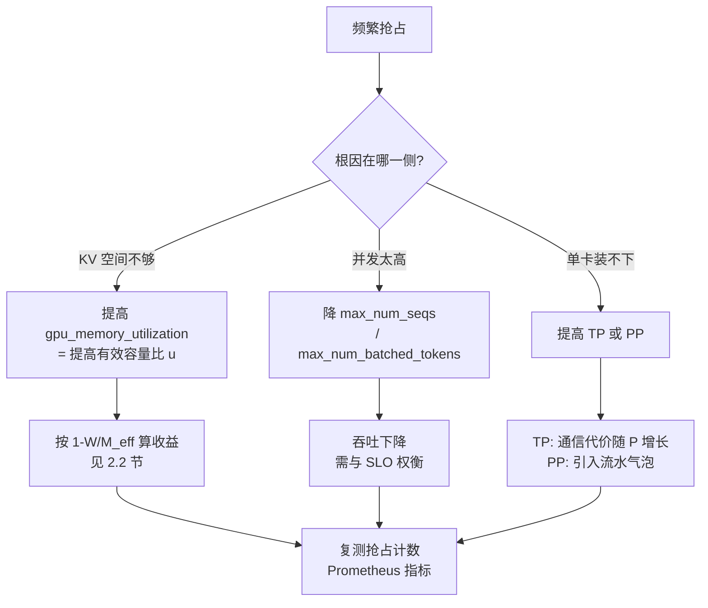

# vLLM：架构、优化与适用边界

> 位置：[InferenceAtlas](../../INDEX.md) > [模块 12](README.md) > 当前文档
> 信息截至：2026-08-10 ｜ 最后核验：2026-08-10 ｜ 内容版本：v0.1
> 时效性等级：**高**（上游演进快，见第 5 节的版本与核验日期）
> 相关主题：[开源推理生态全景](01_open_source_inference_ecosystem.md)｜[PagedAttention 与 KV 内存管理](../03_serving_engines_and_scheduling/03_pagedattention_and_kv_memory_management.md)｜[显存容量、带宽与 KV cache](../07_hardware_and_server_architecture/05_memory_capacity_bandwidth_and_kv_cache.md)

## 本章导读

[第 1 章](01_open_source_inference_ecosystem.md) 提出横向评估的首选指标是**实测的有效容量比 $u$**，
因为它经 $1 - W/M_{\text{eff}}$ 直接决定可达吞吐比例
（[模块 07 第 5 章](../07_hardware_and_server_architecture/05_memory_capacity_bandwidth_and_kv_cache.md)）。

**本章的第一个发现是：在 vLLM 里这个量有一个直接对应的参数**——
`gpu_memory_utilization`。
按仓库文档的原话，vLLM **用这个百分比预分配 GPU 缓存**
（`docs/configuration/optimization.md`，核验日期 2026-08-10）。
**这意味着本库的理论量与该项目的一个可调参数是同一个东西**，
因此第 1 章承诺的「首选横向指标」在 vLLM 上不仅可测，而且可直接调。

本章还要处理三件写不进特性表、但决定实际行为的事
（即第 1 章第 2.3 节的「分化点」）：

| 分化点 | vLLM 的选择（据仓库文档） |
|---|---|
| 调度策略 | **chunked prefill 默认开启，且优先调度 decode** |
| 失败行为 | 超出 KV 容量时**抢占并重算**（V1 默认 `RECOMPUTE` 而非 `SWAP`） |
| 进程模型 | 多进程，**CPU 核数不足是常见的性能退化来源** |

**第三项尤其值得注意**：
vLLM 的文档给出了一个明确的下界——
**至少 `2 + N` 个物理核**（$N$ 为 GPU 数），
而这正是 [模块 07 第 6 章](../07_hardware_and_server_architecture/06_gpu_server_node_architecture.md)
所讨论的「主机侧成为瓶颈」在具体项目上的体现。

**关于本章来源的说明**：
本章的全部事实性陈述**均来自本次实际读取的仓库文件**，
逐条路径与核验日期见第 5 节，披露标签为 `开源代码/配置披露`。
**官方文档站点 `docs.vllm.ai` 在当前环境返回 403**
（详见 [AGENTS.md 第 11 节](../../AGENTS.md)），
**但该站点的源文件就在仓库的 `docs/` 目录下**，本章读的正是这些源文件。
**本章不引用任何性能对比数字**：它们需要独立复现，见 [第 12 章](README.md)。

## 学习目标

读完本章后，读者应能够：

1. 说明 vLLM V1 的进程构成，并按 `A + DP + N` 算出某配置的进程数与最小 CPU 核数
2. 把 `gpu_memory_utilization` 与本库的有效容量比 $u$ 对应起来，并推出它对可达吞吐的影响
3. 解释 chunked prefill 的默认调度策略为什么同时改善 ITL 与 GPU 利用率
4. 说明 `max_num_batched_tokens` 在 TTFT 与 ITL 之间的取舍方向
5. 识别抢占频繁的四种应对手段，并判断各自的副作用

## 核心结论

- **`gpu_memory_utilization` 就是本库的有效容量比 $u$**：它决定 $M_{\text{eff}}$，进而经 $1-W/M_{\text{eff}}$ 决定可达吞吐比例。
- **V1 的默认调度是「先排 decode，再用剩余预算排 prefill」**，这与 [模块 03 第 5 章](../03_serving_engines_and_scheduling/05_prefill_decode_scheduling.md) 的分析一致。
- **V1 的默认抢占模式是 `RECOMPUTE` 而非 `SWAP`**，文档给出的理由是 V1 架构下重算开销更低。
- **`max_num_batched_tokens` 小则 ITL 好、大则 TTFT 好**，方向与本库的 prefill/decode 干扰分析一致。
- **进程数为 `A + DP + N`（DP>1 时再加 1）**，最小物理核数同此式；**核数不足是常见的性能退化来源**。
- **超线程环境下需要 `2×` 的 vCPU 数**——文档明确要求按物理核计。

## 1. 问题定义、系统边界与工作负载

### 1.1 定位

按 [第 1 章第 1.1 节](01_open_source_inference_ecosystem.md) 的五层划分，
vLLM 属于**推理引擎**层，并自带一个 OpenAI 兼容的服务端点。

据其 `README.md`（核验日期 2026-08-10），它自述为
「a fast and easy-to-use library for LLM inference and serving」，
并列出了张量、流水、数据、专家与上下文五种并行
（原文：「Tensor, pipeline, data, expert, and context parallelism」）。

### 1.2 本章的范围

| 在范围内 | 不在范围内 |
|---|---|
| 仓库文档中可核验的架构与参数 | 与其他项目的性能对比 |
| 参数与本库理论量的对应关系 | 采用规模、客户名单 |
| 默认值与失败行为 | 未在仓库中读到的行为 |

## 2. 原理、数学与性能模型

### 2.1 进程模型与 CPU 下界

据 `docs/design/arch_overview.md`，V1 采用多进程架构。
设 $N$ 为 GPU 总数、$\text{TP}$ 为张量并行度、$\text{DP}$ 为数据并行度、$A$ 为 API server 数：

| 进程类型 | 数量 | 职责（据文档） |
|---|---|---|
| API Server | $A$（默认等于 $\text{DP}$） | HTTP、分词、输入处理 |
| Engine Core | $\text{DP}$（默认 1） | **调度器与 KV cache 管理** |
| GPU Worker | $N = \text{DP}\times\text{PP}\times\text{TP}$ | 每 GPU 一个，执行前向 |
| DP Coordinator | $\text{DP}>1$ 时为 1，否则 0 | DP 间负载均衡 |

$$\text{总进程数} = A + \text{DP} + N \;(+\,1 \text{ 若 DP} > 1)$$

**文档给出的两个算例**：

| 配置 | 进程数 |
|---|---|
| `vllm serve -tp=4`（4 GPU） | 1 + 1 + 4 = **6** |
| `vllm serve -tp=2 -dp=4`（8 GPU） | 4 + 4 + 8 + 1 = **17** |

**最小物理核数与进程数同式**。据 `docs/configuration/optimization.md`：

$$\text{最小物理核数} = A + \text{DP} + N + (1 \text{ 若 DP} > 1)$$

**且文档特别强调两点**：

1. **是物理核而非 vCPU**——
   开启超线程时 1 vCPU = 半个物理核，**因此需要 $2\times(2+N)$ 个 vCPU**；
2. **engine core 进程跑忙轮询，对 CPU 饥饿特别敏感**。

**这与 [模块 07 第 6 章](../07_hardware_and_server_architecture/06_gpu_server_node_architecture.md) 的
$B^{*} = t_{\text{dev}}/h$ 是同一个问题的两种表述**：
那里说主机侧开销会成为吞吐上限，
**这里给出了该项目的具体下界形式**。
文档也直接指出了症状：
**「若观察到 GPU 利用率低于预期，CPU 争用可能就是瓶颈」**。

### 2.2 `gpu_memory_utilization` 即有效容量比

据 `docs/configuration/optimization.md` 的抢占一节，
**vLLM 用 `gpu_memory_utilization` 这个百分比预分配 GPU 缓存**。

**这正是 [模块 07 第 5 章](../07_hardware_and_server_architecture/05_memory_capacity_bandwidth_and_kv_cache.md)
中的有效容量比 $u$**：

$$M_{\text{eff}} = M_{\text{total}} \cdot u, \qquad \frac{\text{可达吞吐}}{\text{饱和上限}} = 1 - \frac{W}{M_{\text{eff}}}$$

**因此这个参数不是一个「调大一点试试」的旋钮，它有明确的量化后果**：

| $u$ | $M_{\text{eff}}/W$（设 $M_{\text{total}} = 4\,W$） | 可达吞吐占上限 |
|---:|---:|---:|
| 0.50 | 2.00 | **50%** |
| 0.70 | 2.80 | 64% |
| 0.90 | 3.60 | **72%** |

**上表由 [模块 07 第 5 章](../07_hardware_and_server_architecture/05_memory_capacity_bandwidth_and_kv_cache.md) 的恒等式推出**，
$M_{\text{total}} = 4\,W$ 为演示设定的假设值。
**它说明调高 `gpu_memory_utilization` 的收益是可以事先算出来的**，
而不必靠试。

**代价在另一侧**：预留过少会导致 OOM 或抢占（第 2.4 节）。

### 2.3 chunked prefill 与调度顺序

据 `docs/configuration/optimization.md`：
**V1 中 chunked prefill 在可能时默认开启**，
且其调度策略为——

> 先把所有待处理的 decode 请求组批，
> 再在 `max_num_batched_tokens` 预算的剩余部分中调度 prefill；
> 若某个 prefill 装不下，则自动分块。

**文档给出的两条收益**与本库的分析完全一致：

| 文档陈述 | 本库对应 |
|---|---|
| 改善 ITL，因为 decode 被优先 | [模块 03 第 5 章](../03_serving_engines_and_scheduling/05_prefill_decode_scheduling.md) 的干扰治理 |
| 把计算受限（prefill）与带宽受限（decode）放进同一批，提高 GPU 利用率 | [模块 02 第 2 章](../02_transformer_and_kv_cache/02_prefill_vs_decode.md) 的两阶段特征 |

**第二行值得展开**：
由 [模块 07 第 4 章](../07_hardware_and_server_architecture/04_hbm_dram_and_memory_hierarchy.md)，
decode 实际用到的算力不足峰值的 1%。
**把 prefill 混进同一批，正是让那部分闲置算力有事可做**——
**这是「两个阶段落在 roofline 两侧」这一事实的直接利用**。

### 2.4 `max_num_batched_tokens` 的取舍

据同一文档：

| 取值方向 | 后果（文档原述） |
|---|---|
| 较小（如 2048） | **ITL 更好**，因为拖慢 decode 的 prefill 更少 |
| 较大 | **TTFT 更好**，因为一批能处理更多 prefill token |
| 追求吞吐 | 文档建议 **> 8192**，尤其是大 GPU 上跑较小模型时 |
| 等于 `max_model_len` | 近似 V0 的默认调度（但仍优先 decode） |

**这条取舍的方向与本库的分析一致**：
prefill 与 decode 争夺同一批预算，
**给 prefill 多分预算则首 token 快、后续 token 慢**。

**文档还给出一个必须注意的约束**：
**关闭 chunked prefill 时，`max_num_batched_tokens` 必须大于 `max_model_len`**，
否则服务可能在启动时崩溃。

### 2.5 抢占：失败行为

据 `docs/configuration/optimization.md`：
KV cache 空间不足时 vLLM 会**抢占请求**，被抢占的请求在空间可用后**重算**。

**V1 的默认抢占模式是 `RECOMPUTE` 而非 `SWAP`**，
文档给出的理由是 **V1 架构下重算的开销更低**。

**文档列出的四种应对手段及其副作用**：

| 手段 | 机制 | 文档指出的副作用 |
|---|---|---|
| 提高 `gpu_memory_utilization` | 更多 KV 空间 | （见第 2.2 节的另一侧代价） |
| 降低 `max_num_seqs` / `max_num_batched_tokens` | 减少并发 | 吞吐下降 |
| 提高 `tensor_parallel_size` | 权重分片，每卡腾出空间 | **可能带来过多同步开销** |
| 提高 `pipeline_parallel_size` | 层分布到多卡 | **可能带来时延惩罚** |

**后两行与 [模块 08 第 6 章](../08_networking_and_interconnect/06_scale_up_vs_scale_out.md) 的结论对应**：
增大 TP 的通信代价随 $P$ 增长，增大 PP 引入流水气泡。
**该章给出了这两个副作用的定量形式**，可与此处的定性描述互相印证。

**抢占次数可以通过 Prometheus 指标观测**（文档明述），
这满足 [模块 11 第 7 章](../11_benchmarking_reliability_and_observability/07_observability_metrics_logs_traces.md) 的可观测性要求。

**图解读**：

1. **本图展示什么**：把文档列出的四种手段按**根因**而非按顺序组织。
   **四种手段作用在不同的量上**，选错了根因则改了也没用。
2. **核心瓶颈**：判定点 B 是关键，
   而它需要的信息不在抢占日志里——
   **抢占只说明「不够」，不说明「为什么不够」**。
   需要结合 $W$、$M_{\text{eff}}$ 与当前并发一起判断。
3. **图中的 trade-off**：三条支路的代价性质不同——
   提高 $u$ 逼近 OOM 边界，降并发直接损失吞吐，
   **增大 TP/PP 则把显存问题换成通信或气泡问题**。
   [模块 08 第 6 章](../08_networking_and_interconnect/06_scale_up_vs_scale_out.md) 给出了后者的定量形式。
4. **面试如何引用**：可以说
   「vLLM 的 `gpu_memory_utilization` 就是有效容量比，
   **调它的收益能用 $1-W/M_{\text{eff}}$ 事先算出来**，不用试；
   而 V1 的默认抢占是重算不是换出，
   **所以频繁抢占的代价是重复的 prefill，会直接打在 TTFT 上**」。

## 3. 实现机制与系统设计

### 3.1 优化级别与启动时间

据 `docs/configuration/optimization.md`，vLLM 提供四个优化级别，
**用启动时间换性能**：

| 级别 | 文档描述 |
|---|---|
| `-O0` | 无优化，启动最快、性能最低 |
| `-O1` | 快速优化：简单编译与融合，PIECEWISE cudagraph |
| `-O2` | **默认**：更多编译范围与融合，FULL_AND_PIECEWISE cudagraph |
| `-O3` | 激进优化，**当前等同 `-O2`**，未来可能加入更耗时或实验性的优化 |

**注意 `-O3` 当前等同 `-O2`**——
这是一个容易被误设的参数：**设了不会更快，只是预留了未来的空间**。

### 3.2 加快重复启动

文档给出三个机制，针对**同一 (模型, 配置, 硬件) 组合的重复启动**：

| 机制 | 做法 | 注意事项（文档明述） |
|---|---|---|
| 复用编译缓存 | `torch.compile` 产物存于 `VLLM_CACHE_ROOT`（默认 `~/.cache/vllm`），**可在机器间拷贝或烘进镜像** | 设 `VLLM_FORCE_AOT_LOAD=1` 可在缓存未命中时报错而非静默重编译 |
| 跳过显存 profiling | 启动时 vLLM 会打印可复现当前分配的 `--kv-cache-memory` 值，下次传回即可跳过测量 | **KV cache 将被固定为该值**：保守则限制并发，激进则分配失败；**仅在同一 GPU 与同样初始空闲显存下有效** |
| `--enforce-eager` | 跳过编译与 CUDA graph 捕获 | **牺牲稳态 decode 性能**；适合开发循环与测量启动构成 |

**第一行对 [模块 07 第 6 章](../07_hardware_and_server_architecture/06_gpu_server_node_architecture.md) 的冷启动分析是一个重要补充**：
该章把冷启动近似为 $W/\text{BW}_{\text{存储}}$，
**但编译与图捕获也是冷启动的一部分**，
而这一部分可以通过缓存复用被消除。
**因此实测冷启动时应当分别计时「权重加载」与「编译/捕获」**——
两者的优化手段完全不同。

**第二行的告警值得强调**：
`--kv-cache-memory` 把测量换成了固定值，
**这等于把有效容量比 $u$ 从「自动测得」变成「手工指定」**，
其风险与收益都落在第 2.2 节的公式上。

### 3.3 输入处理与多 API server

文档指出输入处理（分词、聊天模板渲染、多模态数据加载）**全部在 CPU 上运行**，
并可通过多 API server 进程并行化
（`--api-server-count`，默认随 DP 规模）。

**这对应 [模块 07 第 6 章第 3.1 节](../07_hardware_and_server_architecture/06_gpu_server_node_architecture.md) 中
「主机侧工作能否批量化」那一列**：
**输入处理是可以横向扩进程的，因此它不是 $h$ 中不可压缩的部分**。

### 3.4 与本库理论量的对应总表

**本章最有用的产出是这张对应表**：

| vLLM 参数/概念 | 本库理论量 | 出处 |
|---|---|---|
| `gpu_memory_utilization` | **有效容量比 $u$** | [模块 07 第 5 章](../07_hardware_and_server_architecture/05_memory_capacity_bandwidth_and_kv_cache.md) |
| `max_num_seqs` | 并发批 $B$ 的上限 | 同上 |
| `max_num_batched_tokens` | 每批 token 预算，决定 prefill/decode 配比 | [模块 03 第 5 章](../03_serving_engines_and_scheduling/05_prefill_decode_scheduling.md) |
| `tensor_parallel_size` | $P$（TP 度） | [模块 08 第 6 章](../08_networking_and_interconnect/06_scale_up_vs_scale_out.md) |
| `pipeline_parallel_size` | PP 度，引入气泡 $\frac{N-1}{m+N-1}$ | 同上 |
| 最小物理核数 $A+\text{DP}+N$ | 主机侧下界，对应 $B^{*}=t_{\text{dev}}/h$ | [模块 07 第 6 章](../07_hardware_and_server_architecture/06_gpu_server_node_architecture.md) |
| 抢占计数 | 容量不足的可观测证据 | [模块 03 第 4 章](../03_serving_engines_and_scheduling/04_request_scheduling_and_admission_control.md) |

**有了这张表，本库前 11 个模块的判据就可以直接用在 vLLM 的参数上**——
这是本模块存在的意义。

## 4. 性能、成本、能耗与可靠性 trade-off

### 4.1 参数之间的相互作用

| 调高 | 直接收益 | 但会 |
|---|---|---|
| `gpu_memory_utilization` | $M_{\text{eff}}$ ↑ → 可达吞吐 ↑ | 逼近 OOM 边界 |
| `max_num_batched_tokens` | TTFT ↑ | **ITL ↓** |
| `tensor_parallel_size` | 每卡显存 ↑ | **通信代价 ↑**（文档：同步开销） |
| `pipeline_parallel_size` | 每卡显存 ↑ | **时延 ↑**（文档：latency penalties） |
| 优化级别 | 稳态性能 ↑ | **启动时间 ↑** |

**最后一行与弹性直接相关**：
由 [模块 07 第 6 章](../07_hardware_and_server_architecture/06_gpu_server_node_architecture.md)，
冷启动时间与负载尖峰时长的比较决定了自动扩缩容是否有效。
**因此优化级别的选择不只是性能问题，也是弹性问题**——
**在需要频繁扩缩容的部署里，编译缓存复用（第 3.2 节）比提高优化级别更重要**。

### 4.2 适合与不适合的 workload

**本节只给出可由前述机制推出的判断，不引用任何性能对比**：

| 适合 | 理由 |
|---|---|
| 高并发在线服务 | 连续批处理 + 分页 KV + 默认优先 decode |
| 混合长短请求 | chunked prefill 默认开启，缓解长 prefill 阻塞 |
| 需要 OpenAI 兼容接口 | 自带该端点 |
| 显存宽裕（$M/W \ge 2$） | 批处理收益可兑现（[模块 07 第 5 章](../07_hardware_and_server_architecture/05_memory_capacity_bandwidth_and_kv_cache.md)） |

| 不适合 / 需谨慎 | 理由 |
|---|---|
| CPU 核数受限的环境 | **最小 $A+\text{DP}+N$ 物理核**；不足则显著退化 |
| 极短生命周期的实例 | 编译与图捕获的启动开销；除非复用缓存 |
| $M/W$ 接近 1 的配置 | 批处理几乎无收益，且抢占会频繁 |
| 要求确定性时延上界 | 抢占重算会造成时延尖峰 |

**第一行是本章最实用的一条**：
**在虚拟化或容器配额受限的环境中，CPU 核数不足是文档明确点名的常见退化来源**，
而它的表现（GPU 利用率低）容易被误判为 GPU 侧问题。

### 4.3 可靠性

| 项 | 说明 |
|---|---|
| 抢占 | 保证鲁棒性，**但代价是重算，影响端到端时延** |
| 显存预留 | 过高则 OOM 风险，过低则抢占频繁 |
| `--kv-cache-memory` | 固定值在硬件或同租户变化后可能 OOM，**文档建议此时移除该参数重新 profiling** |

## 5. benchmark、真实案例或公开部署案例

**本章不给出任何性能数字或与其他项目的对比**。

性能结论必须由读者在自己的负载上复现，方法见 [第 12 章](README.md)
与 [模块 11 第 1 章](../11_benchmarking_reliability_and_observability/01_inference_benchmarking_methodology.md)。

### 5.1 本章的来源

**核验日期：2026-08-10**。核验方法见 [第 1 章第 3.3 节](01_open_source_inference_ecosystem.md)。

| 仓库路径 | 用于本章 |
|---|---|
| `README.md` | 第 1.1 节的定位与并行方式 |
| `docs/design/arch_overview.md` | 第 2.1 节的进程模型与两个算例 |
| `docs/configuration/optimization.md` | 第 2.2–2.5、3.1–3.3、4.3 节 |
| `docs/serving/data_parallel_deployment.md` | 第 2.1 节 DP 相关 |
| `docs/features/disagg_prefill.md` | PD 分离机制的存在性 |

**已核验可解析的版本 tag**：`v0.26.0`、`v0.25.0`（方法见 [第 1 章第 3.3 节](01_open_source_inference_ecosystem.md)）。
**本表不声明何者为最新版本**，读者应自行查 releases 页。

**披露标签：全部为 `开源代码/配置披露`**。

### 5.2 读者应自行完成的测量

| 项 | 你的值 | 方法 |
|---|---|---|
| 实际 `gpu_memory_utilization` 与实测可分配 KV | 待填 | 启动日志 |
| **$M_{\text{eff}}/W$ 与 $1-W/M_{\text{eff}}$** | 待填 | [模块 07 第 5 章](../07_hardware_and_server_architecture/05_memory_capacity_bandwidth_and_kv_cache.md) |
| 进程数与实际物理核数 | 待填 | 第 2.1 节的公式对照 |
| **抢占计数（Prometheus）** | 待填 | 文档明述该指标存在 |
| `max_num_batched_tokens` 扫描下的 TTFT/ITL 曲线 | 待填 | 第 2.4 节 |
| 冷启动中「权重加载」与「编译/捕获」的分别耗时 | 待填 | 第 3.2 节 |
| 启用/复用编译缓存前后的启动时间 | 待填 | 同上 |

## 6. 设计决策框架

| 观察 | 结论 |
|---|---|
| GPU 利用率低于预期 | **先查 CPU 核数**（第 2.1 节），不要先怀疑 GPU |
| 抢占计数持续上升 | 按第 2.5 节的四条按根因选手段 |
| ITL 差而 TTFT 好 | `max_num_batched_tokens` 偏大 |
| TTFT 差而 ITL 好 | 反之 |
| 扩缩容跟不上 | 优先复用编译缓存，而非降低优化级别 |
| $M_{\text{eff}}/W < 2$ | **先解决权重体积**，调参数收益有限 |
| 设了 `-O3` 期待更快 | **当前等同 `-O2`** |

## 7. 常见失败模式与排查路径

| 症状 | 首先怀疑 | 检查 |
|---|---|---|
| GPU 利用率低 | **CPU 争用** | 物理核数 vs $A+\text{DP}+N$ |
| 吞吐低于预期且抢占频繁 | 有效容量比过低 | `gpu_memory_utilization` 与 $1-W/M_{\text{eff}}$ |
| 时延偶发大尖峰 | **抢占重算** | 抢占计数 |
| 关闭 chunked prefill 后启动崩溃 | `max_num_batched_tokens < max_model_len` | 第 2.4 节的告警 |
| 启动慢 | 编译与图捕获 | 第 3.2 节的三个机制 |
| 换机器后 OOM | `--kv-cache-memory` 固定值不再适用 | 移除该参数重新 profiling |
| 超线程环境下性能差 | **按 vCPU 而非物理核配核** | 需 $2\times$ vCPU |
| 提高 TP 后时延变差 | 同步开销 | [模块 08 第 6 章](../08_networking_and_interconnect/06_scale_up_vs_scale_out.md) |

## 8. 关联面试主题

- 有效容量比与可达吞吐 → [模块 17 KV cache 题](../17_interview_prep/02_kv_cache_and_transformer_questions.md)
- chunked prefill 的调度顺序 → [模块 17 serving 与 SLO 题](../17_interview_prep/03_serving_scheduling_and_slo_questions.md)
- 抢占的代价与应对 → [模块 17 系统设计题](../17_interview_prep/01_inference_system_design.md)
- 主机侧瓶颈的识别 → [模块 17 调试与 benchmark 题](../17_interview_prep/07_debug_benchmark_and_reliability_questions.md)

## 9. 小结

**本章最有价值的产出是第 3.4 节的对应表**：
它把 vLLM 的参数映射到本库前 11 个模块已经建立的理论量，
**从而使那些判据可以直接用在实际部署上**。

**三条最重要的对应**：

1. **`gpu_memory_utilization` 就是有效容量比 $u$**。
   它经 $1-W/M_{\text{eff}}$ 决定可达吞吐比例，
   **因此调它的收益可以事先算出来，不必靠试**。
2. **最小物理核数 $A+\text{DP}+N$** 是 [模块 07 第 6 章](../07_hardware_and_server_architecture/06_gpu_server_node_architecture.md)
   主机瓶颈分析的项目级具体化。
   **文档明确点名它是常见的性能退化来源，且症状是「GPU 利用率低」**——
   容易被误判为 GPU 侧问题。
   **超线程环境需 $2\times$ 的 vCPU**。
3. **V1 的默认失败行为是抢占并重算（`RECOMPUTE` 而非 `SWAP`）**。
   因此频繁抢占的代价是重复 prefill，**直接打在 TTFT 与时延尾部上**。

**两条调参方向**（均据仓库文档）：

- **chunked prefill 默认开启且优先 decode**，
  这既改善 ITL，又通过把计算受限与带宽受限的请求混批提高 GPU 利用率——
  **后者正是「两阶段落在 roofline 两侧」这一事实的利用**。
- **`max_num_batched_tokens` 小则 ITL 好、大则 TTFT 好**；
  文档对吞吐优先场景建议 > 8192。

**最后一条运维提示**：
在需要频繁扩缩容的部署里，
**复用 `torch.compile` 缓存比降低优化级别更值得做**——
前者不牺牲稳态性能。

## 关键术语

| 中文术语 | 英文 | 定义 | 单位/口径 | 关联文档 |
|---|---|---|---|---|
| 引擎核心进程 | engine core process | 运行调度器与 KV 管理的进程；**忙轮询，对 CPU 饥饿敏感** | — | 本章 2.1 |
| 显存利用率参数 | `gpu_memory_utilization` | 预分配 GPU 缓存的百分比；**即本库的有效容量比 $u$** | % | 本章 2.2 |
| 每批 token 预算 | `max_num_batched_tokens` | 一批中 prefill+decode 的 token 上限 | token | 本章 2.4 |
| 重算式抢占 | `RECOMPUTE` preemption | KV 不足时丢弃并重算，**V1 默认** | — | 本章 2.5 |
| 优化级别 | optimization level `-O0`~`-O3` | 以启动时间换稳态性能；**`-O3` 当前等同 `-O2`** | — | 本章 3.1 |
| 编译缓存复用 | compile cache reuse | 复用 `torch.compile` 产物以缩短启动 | — | 本章 3.2 |

## 延伸阅读

- [开源推理生态全景](01_open_source_inference_ecosystem.md)
- [PagedAttention 与 KV 内存管理](../03_serving_engines_and_scheduling/03_pagedattention_and_kv_memory_management.md)
- [chunked prefill 与 prefill/decode 干扰治理](../03_serving_engines_and_scheduling/05_prefill_decode_scheduling.md)
- [显存容量、带宽与 KV cache](../07_hardware_and_server_architecture/05_memory_capacity_bandwidth_and_kv_cache.md)
- [服务器节点架构](../07_hardware_and_server_architecture/06_gpu_server_node_architecture.md)
- [scale-up 与 scale-out 的决策框架](../08_networking_and_interconnect/06_scale_up_vs_scale_out.md)

## 主要来源

本章的全部事实性陈述来自 **2026-08-10 实际读取的 vLLM 仓库文件**，
逐条路径见第 5.1 节。

**官方文档站点 `docs.vllm.ai` 在当前环境返回 403**
（详见 [AGENTS.md 第 11 节](../../AGENTS.md)），
**但其源文件位于仓库 `docs/` 目录，本章读的正是这些源文件**。

| 类别 | 说明 | 披露标签 |
|---|---|---|
| 进程模型、参数语义、默认值、告警 | 见第 5.1 节的逐条路径 | `开源代码/配置披露` |
| 版本 tag 的存在性 | 已验证可解析 | `开源代码/配置披露` |
| 参数与本库理论量的对应 | 由上述来源与本库前几模块推出 | 推出 |
| 第 2.2 节的收益表 | **$M_{\text{total}} = 4\,W$ 为演示设定的假设值** | — |
| 任何性能数字与项目间对比 | **本章未给出** | — |

## 更新记录

| 日期 | 版本 | 变更 | 核验人 |
|---|---|---|---|
| 2026-08-10 | v0.1 | 初稿：V1 进程模型与 CPU 下界、`gpu_memory_utilization` 与有效容量比的对应、chunked prefill 的默认调度、`max_num_batched_tokens` 取舍、重算式抢占与四种应对、启动优化三机制、参数-理论量对应表 | — |
