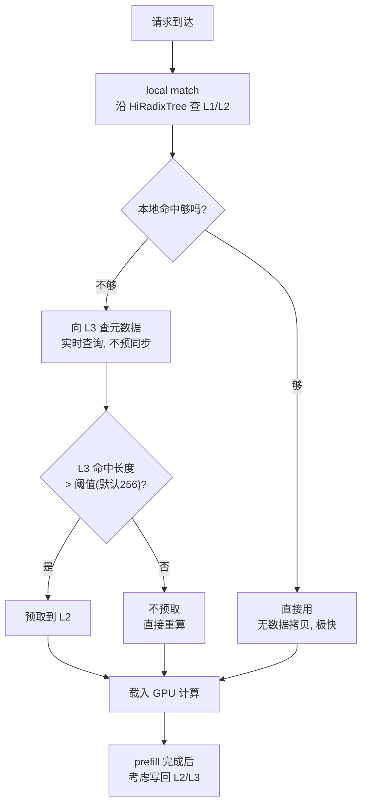

# SGLang：RadixAttention、分层缓存与 PD 分离

> 位置：[InferenceAtlas](../../INDEX.md) > [模块 12](README.md) > 当前文档
> 信息截至：2026-08-10 ｜ 最后核验：2026-08-10 ｜ 内容版本：v0.1
> 时效性等级：**高**（上游演进快，见第 5 节的版本与核验日期）
> 相关主题：[开源推理生态全景](01_open_source_inference_ecosystem.md)｜[vLLM](02_vllm.md)｜[前缀缓存](../03_serving_engines_and_scheduling/08_prompt_caching_and_prefix_caching.md)｜[HBM 与存储层次](../07_hardware_and_server_architecture/04_hbm_dram_and_memory_hierarchy.md)

## 本章导读

[第 1 章](01_open_source_inference_ecosystem.md) 指出：
**当一个项目为某机制起了专名，通常意味着它在那里做了区别于通用实现的设计**。
SGLang 有两个这样的专名——**RadixAttention** 与 **HiCache**——
本章的重点就在这两处。

**HiCache 是本章最值得读的部分**。
[模块 07 第 4 章](../07_hardware_and_server_architecture/04_hbm_dram_and_memory_hierarchy.md) 曾论证：
**KV 卸载的可行性不在带宽，而在「可选择性」与「可预取性」**。
**HiCache 正是把这个论证做成了系统**：据其设计文档，
它仿照 CPU 三级缓存，把 GPU 显存作 L1、主机内存作 L2、分布式存储作 L3，
并以**预取**为核心优化——
**当 L3 命中长度超过阈值（默认 256 token）时触发预取**。

本章还要指出一个比第 1 章「命名分歧」更隐蔽的问题：
**参数同名不同义**。

| 参数 | 项目 | 覆盖范围（据各自文档） |
|---|---|---|
| `gpu_memory_utilization` | vLLM | 预分配 **GPU 缓存**的百分比 |
| `--mem-fraction-static` | SGLang | 静态分配的比例，**含模型权重与 KV 内存池** |

**两个参数都像是「用多少显存」，但分母里装的东西不同**，
因此**不能直接把一个的取值搬到另一个上**——
这是跨引擎迁移配置时的一个真实陷阱。

**关于本章来源的说明**：
本章的全部事实性陈述**均来自本次实际读取的仓库文件**，
逐条路径与核验日期见第 5 节，披露标签为 `开源代码/配置披露`。
**本章不引用该项目 README 中的采用规模与性能宣称**：
它们是项目自述的推广性陈述，未经独立核验。
**本章也不引用其文档中链接的外部博客**（`lmsys.org` 在当前环境不可达）。

## 学习目标

读完本章后，读者应能够：

1. 说明 RadixAttention 与 HiRadixTree 的关系，以及后者多记录了什么
2. 解释 HiCache 的三级结构，并说明它为什么把 L3 元数据设计成「不同步、实时查询」
3. 复述 SGLang 文档给出的 PD 分离动机，并与本库的分析对照
4. 识别 `--mem-fraction-static` 与 vLLM 同类参数的口径差异
5. 说明 `--schedule-policy` 的可选值中哪一个与前缀缓存直接相关

## 核心结论

- **HiCache 把 KV 缓存扩展为 L1(GPU)/L2(主机)/L3(分布式) 三级**，其中 L1/L2 为实例私有、**L3 在集群内共享**。
- **L3 的元数据不被持续同步，而是访问时实时查询后端**——用查询延迟换元数据同步开销。
- **预取的触发条件是 L3 命中长度超过阈值（默认 256 token，可配置）**。
- **PD 分离的动机被文档明确写为两条**：prefill 打断 decode，以及 DP attention 下的负载不均。
- **`--mem-fraction-static` 含权重与 KV 池**，与 vLLM 的 `gpu_memory_utilization` 口径不同，**配置不可直接搬运**。
- **「抢占」在 SGLang 文档中的用词是 retract**——又一处命名分歧，影响按关键词查文档。

## 1. 问题定义、系统边界与工作负载

### 1.1 定位

按 [第 1 章第 1.1 节](01_open_source_inference_ecosystem.md) 的五层划分，
SGLang 属于**推理引擎**层，并提供服务端点。

据其 `README.md`（核验日期 2026-08-10），它自述为
「a high-performance serving framework for large language models and multimodal models」，
其列出的运行时特性包括
**RadixAttention 前缀缓存、零开销 CPU 调度器、prefill-decode 分离、
投机解码、连续批处理、分页 attention、TP/PP/EP/DP 并行、结构化输出、chunked prefill、
量化与 multi-LoRA 批处理**。

### 1.2 与 vLLM 的比较原则

**本章不做性能对比**（理由见 [第 1 章](01_open_source_inference_ecosystem.md)）。
可以比较的是**设计选择与参数口径**，因为它们在文档中有明确表述。

## 2. 原理、数学与性能模型

### 2.1 RadixAttention 与 HiRadixTree

据 `docs/advanced_features/hicache_design.mdx`：

**RadixAttention** 的结构是一棵 radix 树：
**每个节点对应 GPU 显存中一段连续 token 的 KV cache**，
从根到叶的一条路径代表一个请求的前缀，
**多个请求的共享前缀复用同一批节点，从而避免重复存储**。

**HiRadixTree** 在此之上扩展：
**每个节点额外记录该段 KV cache 存在哪里**——
本地显存、主机内存、L3 存储，或同时存在于多层。

**两者的差别是一个元数据问题而非算法问题**：
radix 树负责「哪些前缀可复用」，
**HiRadixTree 额外负责「可复用的那份现在在哪一层」**。

### 2.2 HiCache 的三级结构

据同一文档，HiCache 仿照现代 CPU 的三级缓存：

| 层 | 介质 | 作用域（文档明述） |
|---|---|---|
| L1 | GPU 显存 | **实例私有** |
| L2 | 主机内存 | **实例私有** |
| L3 | 分布式存储 | **集群内所有推理实例共享** |

**L3 共享是这个设计的关键**：
它使一个实例产生的前缀 KV 可以被**其他实例**复用，
**从而把前缀缓存的收益从单实例扩展到集群**。

**这与 [模块 07 第 4 章第 2.4 节](../07_hardware_and_server_architecture/04_hbm_dram_and_memory_hierarchy.md) 的论证一致**：
该节指出权重卸载在 decode 上不可行（每步全读），
**而 KV 卸载可行，因为它具备「可选择性」与「可预取性」**。
**HiCache 正是围绕这两点构建的**：

| 本库的可行性条件 | HiCache 的对应机制 |
|---|---|
| 可选择性（只取所需部分） | 按前缀匹配定位所需的那段 |
| 可预取性（提前知道要什么） | **预取**（第 2.3 节） |

### 2.3 三个操作与预取阈值

据文档，HiCache 的工作流有三个关键操作：

| 操作 | 做什么 |
|---|---|
| **local match** | 在本地 L1/L2 沿 HiRadixTree 匹配；**不涉及实际数据拷贝，因此极快** |
| **prefetch** | 本地未命中的部分向 L3 查询并预取到 L2 |
| **write-back** | prefill 完成后，考虑把新产生的数据写入 L2 或 L3 |

**预取的触发条件是可量化的**：

> 本地匹配后，对未在 L1/L2 命中的部分向 L3 查询元数据；
> **若 L3 中命中的缓存长度超过阈值（默认 256 token，可配置），则触发预取**。

**这个阈值是一个典型的开销-收益分界**：
命中太短时，预取的往返开销超过省下的重算，
**因此设阈值而非无条件预取**。
**读者应按自己的 L3 时延与 prefill 速度重新校准这个值**——
方法见 [模块 03 第 8 章](../03_serving_engines_and_scheduling/08_prompt_caching_and_prefix_caching.md) 的命中率与收益分析。

### 2.4 L3 元数据的设计取舍

**文档给出了一个明确的工程取舍**：

> HiRadixTree **不存储也不持续同步 L3 的元数据**。
> 访问 L3 数据时，**实时向后端查询**所需元数据
> （是否存在、位于哪台服务器与哪个位置）。

**这是「同步开销」与「查询延迟」之间的选择**：

| 方案 | 得到 | 付出 |
|---|---|---|
| 持续同步 L3 元数据 | 查询快 | **同步开销随集群规模增长** |
| **实时查询（HiCache 的选择）** | 无同步开销 | 每次访问多一次往返 |

**选择后者是合理的**，因为 L3 本身就是慢层：
**在一次已经要走分布式存储的访问上，再加一次元数据往返的相对代价不大**；
而元数据同步的开销会随实例数增长，**是一个会随规模恶化的量**。

**这与 [模块 08 第 1 章](../08_networking_and_interconnect/01_inference_networking_overview.md) 的判断方式一致**：
**先看这一项在总时间中占多大比例，再决定值不值得优化**。

### 2.5 PD 分离的动机

据 `docs/advanced_features/pd_disaggregation.mdx`，
文档把统一调度的问题明确写为**两条**：

| 问题 | 文档原述 |
|---|---|
| **Prefill Interruption** | 到来的 prefill 批频繁打断进行中的 decode 批，造成 token 生成的显著延迟 |
| **DP Attention Imbalance** | DP attention 下，一个 DP worker 处理 prefill 而另一个处理 decode，导致 decode 时延上升 |

**第一条与 [模块 03 第 5 章](../03_serving_engines_and_scheduling/05_prefill_decode_scheduling.md) 的干扰分析完全对应**。

**第二条值得单独注意**：
它是**数据并行特有**的问题——
各 DP rank 独立调度时，
**某些 rank 在做计算受限的 prefill、另一些在做带宽受限的 decode**，
而集合通信要等最慢者
（[模块 08 第 11 章](../08_networking_and_interconnect/11_network_observability_and_debugging.md) 的掉队者分析）。
**这使 DP 与 PD 分离之间存在一个本库此前未展开的联系**：
**DP 规模越大，统一调度造成的相位不齐越严重**。

**图解读**：

1. **本图展示什么**：一次请求在三级缓存中的完整路径。
   **两个判定点（C 与 F）都是「值不值得再往下找」的开销权衡**，
   而不是简单的命中/未命中。
2. **核心瓶颈**：瓶颈在 F。
   **阈值定得太低会让短命中的预取往返白付，太高则放弃可复用的长前缀**；
   而合适的值取决于 L3 时延与本地 prefill 速度之比——
   **这两个量都需要实测，不能沿用默认值就当最优**。
3. **图中的 trade-off**：节点 E 体现了第 2.4 节的取舍——
   **不预同步元数据省下了随规模增长的同步开销，代价是每次多一次往返**。
   在一条本来就慢的路径上，这个代价是划算的。
4. **面试如何引用**：可以说
   「分层 KV 缓存的关键不是多加一层，而是**预取的触发条件**。
   SGLang 的做法是 L3 命中长度超过阈值才预取，默认 256 token；
   **而 L3 元数据刻意不做持续同步，改为实时查询**——
   因为同步开销会随集群规模恶化，而查询延迟摊在一次本来就慢的访问上」。

## 3. 实现机制与系统设计

### 3.1 关键参数与已核验的默认值

**下列默认值来自 `docs/advanced_features/server_arguments.mdx`，核验日期 2026-08-10**：

| 参数 | 默认值 | 说明（据文档） |
|---|---|---|
| `--mem-fraction-static` | 未设时自动计算 | **静态分配比例，含模型权重与 KV 内存池**；未设时按 `(GPU 显存 − 保留量)/GPU 显存` 计算，**检测不到显存时取 `0.88`**；**遇 OOM 应调小** |
| `--schedule-policy` | `fcfs` | 可选：`lpm`、`random`、`fcfs`、`dfs-weight`、`lof`、`priority`、`routing-key` |
| `--schedule-conservativeness` | `1.0` | **值越大调度越保守**；**若频繁看到请求被 retract 则调大** |
| `--page-size` | `1` | KV 分页粒度 |

**四行各有一处值得注意**：

**第一行是本章导读指出的口径陷阱**。
它覆盖**权重 + KV 池**，
而 [第 2 章](02_vllm.md) 中 vLLM 的 `gpu_memory_utilization` 是**预分配 GPU 缓存**的比例。
**两者的分母内容不同，数值不可直接搬运**。
若要把它映射到 [模块 07 第 5 章](../07_hardware_and_server_architecture/05_memory_capacity_bandwidth_and_kv_cache.md) 的 $M_{\text{eff}}$，
**需要先把权重那部分扣掉**。

**第二行的 `lpm` 是与前缀缓存直接相关的一项**：
按最长前缀匹配排序调度，
**可以让共享前缀的请求相邻执行，从而提高缓存命中**——
这正是 [模块 03 第 8 章](../03_serving_engines_and_scheduling/08_prompt_caching_and_prefix_caching.md) 讨论的
「调度与缓存的耦合」。
**默认是 `fcfs` 而非 `lpm`**，因此这项收益默认不开启。

**第三行揭示了又一处命名分歧**：
**SGLang 文档用 retract 描述本库所称的「抢占」**
（vLLM 用 preempt）。
**这会直接影响按关键词检索文档的效果**——
查不到「preemption」不代表没有该机制。

**第四行的默认值 `1`** 意味着默认按 token 粒度分页，
分页粒度对碎片与匹配效率的影响见
[模块 03 第 3 章](../03_serving_engines_and_scheduling/03_pagedattention_and_kv_memory_management.md)。

### 3.2 参数与本库理论量的对应

| SGLang 参数 | 本库理论量 | 注意 |
|---|---|---|
| `--mem-fraction-static` | 与 $u$ 相关，**但含权重** | 需扣除权重后才是 KV 可用量 |
| `--max-running-requests` | 并发批 $B$ 的上限 | 对应 $C_{\max}$ 的人为下调 |
| `--chunked-prefill-size` | 每批 prefill token 预算 | 对应 vLLM 的 `max_num_batched_tokens` 一部分 |
| `--schedule-policy=lpm` | 提高前缀命中率 | [模块 03 第 8 章](../03_serving_engines_and_scheduling/08_prompt_caching_and_prefix_caching.md) |
| `--schedule-conservativeness` | 抢占（retract）频率的调节 | 越大越保守 |
| `--page-size` | KV 分页粒度 | [模块 03 第 3 章](../03_serving_engines_and_scheduling/03_pagedattention_and_kv_memory_management.md) |
| HiCache L2/L3 | KV 卸载与远程 KV | [模块 07 第 4 章](../07_hardware_and_server_architecture/04_hbm_dram_and_memory_hierarchy.md)、[模块 06 第 8 章](../06_distributed_and_moe_inference/08_kv_cache_transfer_and_remote_memory.md) |

### 3.3 PD 分离的部署形态

据 `docs/advanced_features/pd_disaggregation.mdx`：

- **传输引擎**：文档称当前支持 **Mooncake 与 NIXL**；
- **prefill 与 decode 需分别启动**，文档给出了单节点与多节点的启动命令示例；
- **profiling 需分别进行**：文档指出受 torch profiler 限制，
  **prefill 与 decode worker 必须用各自的命令行选项分别 profile**。

**最后一条对 [模块 08 第 11 章](../08_networking_and_interconnect/11_network_observability_and_debugging.md) 是一个实践补充**：
该章强调埋点要能分离「等待段」与「通信段」，
**而在 PD 分离部署中，连 profile 都必须分开做**——
这使跨阶段的时间对齐更困难，
**因此该章第 3.2 节的时钟精度要求在这里更为重要**。

### 3.4 HiCache 与 PD 分离的组合

文档中有专门一节讨论 HiCache 与 PD 分离部署模式的集成。
**这个组合在结构上是自然的**：
PD 分离本就要把 prefill 产生的 KV 传给 decode 侧
（[模块 06 第 7 章](../06_distributed_and_moe_inference/07_prefill_decode_disaggregation.md)），
**而 HiCache 的 L3 恰好是一个集群级的 KV 存放处**。

**但要注意 [模块 06 第 7 章](../06_distributed_and_moe_inference/07_prefill_decode_disaggregation.md) 的一个结论**：
**前缀缓存命中率提高时，prefill 变短而传输量不变，因此传输占比反而上升**。
**HiCache 提高命中率，因此它会放大 PD 分离中传输环节的相对权重**——
两者组合时应当重新核算传输占 TTFT 的比例。

## 4. 性能、成本、能耗与可靠性 trade-off

### 4.1 分层缓存的取舍

| 增加 | 得到 | 付出 |
|---|---|---|
| L2（主机内存） | 更大的前缀缓存容量 | 主机内存成本；取回需经主机总线 |
| L3（分布式存储） | **跨实例共享命中** | 网络往返；元数据查询延迟 |
| 降低预取阈值 | 更多预取机会 | **短命中的预取往返变成纯开销** |
| `lpm` 调度 | 更高命中率 | **可能牺牲公平性与首字时延的可预测性** |

**最后一行值得强调**：
按前缀排序调度会改变请求的执行顺序，
**因此它与 [模块 03 第 6 章](../03_serving_engines_and_scheduling/06_multi_tenant_isolation_and_qos.md) 的公平性目标存在张力**。
**默认不开启是一个保守而合理的选择**。

### 4.2 适合与不适合的 workload

**只给出可由前述机制推出的判断**：

| 适合 | 理由 |
|---|---|
| 前缀高度共享（多轮对话、同 system prompt、多 QA） | RadixAttention + HiCache 的收益直接来自共享 |
| 长上下文且有复用 | 文档明述 HiCache 面向此类负载 |
| 集群多实例且前缀跨实例共享 | **L3 是集群共享的** |
| 需要 PD 分离 | 有成型的部署路径与传输引擎集成 |

| 不适合 / 需谨慎 | 理由 |
|---|---|
| 前缀几乎不共享 | 分层缓存的收益来源不存在，只剩开销 |
| L3 时延高且命中短 | 预取往返可能得不偿失（第 2.3 节） |
| 严格公平性要求 | `lpm` 与公平性有张力（第 4.1 节） |
| 主机内存紧张 | L2 需要主机内存 |

**第一行是最重要的边界**：
**分层缓存的全部收益都建立在前缀共享上**，
而共享率是负载性质而非配置项。
**因此上线前应先测自己负载的前缀共享率**——
方法见 [模块 03 第 8 章](../03_serving_engines_and_scheduling/08_prompt_caching_and_prefix_caching.md)。

### 4.3 可靠性

| 项 | 说明 |
|---|---|
| retract（抢占） | 用 `--schedule-conservativeness` 调节频率 |
| L3 后端依赖 | **引入外部存储系统作为依赖**，其可用性进入整体可用性 |
| PD 分离 | 两组实例，故障域与调度复杂度均上升 |

**第二行是采用 L3 时必须计入的**：
按 [模块 08 第 6 章第 4.2 节](../08_networking_and_interconnect/06_scale_up_vs_scale_out.md) 的可用性组合，
**新增的外部依赖会乘进整体可用性**。

## 5. benchmark、真实案例或公开部署案例

**本章不给出任何性能数字或与其他项目的对比**。

**文档中链接的外部 blog 在当前环境不可达**（`lmsys.org` 未在可达白名单内），
**因此其中的 benchmark 结果本章不予引用**，标为 `待核实`。

### 5.1 本章的来源

**核验日期：2026-08-10**。核验方法见 [第 1 章第 3.3 节](01_open_source_inference_ecosystem.md)。

| 仓库路径 | 用于本章 |
|---|---|
| `README.md` | 第 1.1 节的定位与特性列表 |
| `docs/docs.json` | 文档目录结构（第 1 章第 3.1 节亦用） |
| `docs/advanced_features/hicache_design.mdx` | 第 2.1–2.4 节 |
| `docs/advanced_features/pd_disaggregation.mdx` | 第 2.5、3.3 节 |
| `docs/advanced_features/server_arguments.mdx` | 第 3.1 节的默认值 |
| `docs/advanced_features/structured_outputs.mdx` | 结构化输出机制的存在性 |

**已核验可解析的版本 tag**：`v0.5.17`。
**本表不声明它是最新版本**。

**披露标签：全部为 `开源代码/配置披露`**。

### 5.2 读者应自行完成的测量

| 项 | 你的值 | 方法 |
|---|---|---|
| **负载的前缀共享率** | 待填 | **决定分层缓存是否有收益** |
| L1/L2/L3 各层的命中率 | 待填 | 观测指标 |
| L3 访问时延（含元数据查询往返） | 待填 | 实测 |
| **预取阈值的最优值** | 待填 | **按 L3 时延与 prefill 速度之比校准** |
| `--mem-fraction-static` 扣除权重后的 KV 可用量 | 待填 | 与 $M_{\text{eff}}$ 对应 |
| `lpm` 与 `fcfs` 下的命中率与公平性差异 | 待填 | 两种策略分别测 |
| retract 频率与 `--schedule-conservativeness` 的关系 | 待填 | 扫参数 |
| PD 分离下传输占 TTFT 的比例 | 待填 | [模块 06 第 7 章](../06_distributed_and_moe_inference/07_prefill_decode_disaggregation.md) |

## 6. 设计决策框架

| 观察 | 结论 |
|---|---|
| 前缀共享率低 | **分层缓存收益有限**，不必引入 L2/L3 |
| L3 命中多但预取常不触发 | 阈值偏高，按第 2.3 节校准 |
| 频繁 retract | 调大 `--schedule-conservativeness` 或按 [第 2 章](02_vllm.md) 第 2.5 节的四类根因排查 |
| 想提高命中率 | 考虑 `--schedule-policy=lpm`，**但先评估公平性影响** |
| 从 vLLM 迁移配置 | **不要直接搬 `gpu_memory_utilization` 的值** |
| 启用 HiCache + PD 分离 | 重新核算传输占 TTFT 的比例 |

## 7. 常见失败模式与排查路径

| 症状 | 首先怀疑 | 检查 |
|---|---|---|
| 引入 L2/L3 后没有收益 | **前缀共享率低** | 先测共享率 |
| 预取似乎从不发生 | 命中长度未超阈值 | 默认 256 token |
| 从 vLLM 迁移后 OOM 或容量异常 | **参数口径不同** | `--mem-fraction-static` 含权重 |
| 按 "preemption" 查文档查不到 | **该项目用词是 retract** | 第 3.1 节 |
| 命中率低于预期 | 调度策略是 `fcfs` | `lpm` 默认不开启 |
| PD 分离下难以对齐时间线 | **prefill/decode 需分别 profile** | 第 3.3 节 |
| 集群可用性下降 | L3 外部依赖 | 第 4.3 节 |

## 8. 关联面试主题

- 前缀缓存与调度的耦合 → [模块 17 serving 与 SLO 题](../17_interview_prep/03_serving_scheduling_and_slo_questions.md)
- 分层 KV 缓存与卸载可行性 → [模块 17 KV cache 题](../17_interview_prep/02_kv_cache_and_transformer_questions.md)
- PD 分离的动机与代价 → [模块 17 分布式与 MoE 题](../17_interview_prep/05_distributed_and_moe_questions.md)
- 跨引擎迁移的参数陷阱 → [模块 17 系统设计题](../17_interview_prep/01_inference_system_design.md)

## 9. 小结

**SGLang 的两个专名各自对应一处真实的设计差异**。

**RadixAttention → HiRadixTree** 的扩展是元数据性质的：
radix 树管「哪些前缀可复用」，
**HiRadixTree 额外管「那份现在在哪一层」**。

**HiCache 把 KV 缓存做成三级**——
L1(GPU)/L2(主机)/L3(分布式)，
**其中 L1/L2 实例私有而 L3 集群共享**，
从而把前缀缓存的收益从单实例扩展到集群。
它有两个值得记住的设计决定：

1. **预取有触发阈值**（L3 命中长度 > 默认 256 token）。
   **无条件预取会让短命中的往返变成纯开销**，
   而合适的阈值取决于 L3 时延与本地 prefill 速度之比——**需实测校准**。
2. **L3 元数据不做持续同步，改为访问时实时查询**。
   这是用「每次多一次往返」换「不随集群规模增长的同步开销」，
   **在一条本来就慢的路径上是划算的**。

**PD 分离的动机被文档写得很明确**：
prefill 打断 decode，以及 **DP attention 下各 rank 相位不齐**。
**第二条揭示了 DP 规模与 PD 分离必要性之间的联系**——
DP 越大，统一调度造成的相位不齐越严重。

**最后是两处必须记住的命名/口径分歧**：

- **`--mem-fraction-static` 含权重与 KV 池**，
  与 vLLM 的 `gpu_memory_utilization` 分母内容不同，
  **跨引擎迁移时数值不可直接搬运**；
- **本库所称「抢占」在该项目文档中写作 retract**，
  按 preemption 检索会漏掉。

**而全部收益的前提只有一个**：
**前缀共享率**。它是负载性质而非配置项，
**共享率低时，分层缓存只剩开销**。

## 关键术语

| 中文术语 | 英文 | 定义 | 单位/口径 | 关联文档 |
|---|---|---|---|---|
| RadixAttention | RadixAttention | 以 radix 树组织前缀 KV 的复用机制 | — | 本章 2.1 |
| HiRadixTree | HiRadixTree | 在 radix 树节点上额外记录 KV 所在层级 | — | 本章 2.1 |
| 分层 KV 缓存 | HiCache | L1(GPU)/L2(主机)/L3(分布式) 三级；**L3 集群共享** | — | 本章 2.2 |
| 预取阈值 | prefetch threshold | 触发从 L3 预取所需的最小 L3 命中长度（默认 256 token） | token | 本章 2.3 |
| 静态分配比例 | `--mem-fraction-static` | 静态分配占显存的比例，**含权重与 KV 池** | % | 本章 3.1 |
| retract | retract | 该项目对「抢占」的用词 | — | 本章 3.1 |
| 最长前缀匹配调度 | `lpm` schedule policy | 按最长前缀匹配排序以提高命中率；**默认不启用** | — | 本章 3.1 |

## 延伸阅读

- [开源推理生态全景](01_open_source_inference_ecosystem.md)
- [vLLM：架构、优化与适用边界](02_vllm.md)
- [前缀缓存的命中率、收益与隐私边界](../03_serving_engines_and_scheduling/08_prompt_caching_and_prefix_caching.md)
- [PagedAttention 与 KV 内存管理](../03_serving_engines_and_scheduling/03_pagedattention_and_kv_memory_management.md)
- [HBM、DRAM 与存储层次](../07_hardware_and_server_architecture/04_hbm_dram_and_memory_hierarchy.md)
- [prefill/decode 分离](../06_distributed_and_moe_inference/07_prefill_decode_disaggregation.md)

## 主要来源

本章的全部事实性陈述来自 **2026-08-10 实际读取的 SGLang 仓库文件**，
逐条路径见第 5.1 节。

**该项目文档中链接的外部 blog 在当前环境不可达**，
**其中的 benchmark 结果本章不予引用**（详见 [AGENTS.md 第 11 节](../../AGENTS.md)）。

| 类别 | 说明 | 披露标签 |
|---|---|---|
| HiCache 结构、工作流、预取阈值、元数据策略 | `docs/advanced_features/hicache_design.mdx` | `开源代码/配置披露` |
| PD 分离的动机与部署要求 | `docs/advanced_features/pd_disaggregation.mdx` | `开源代码/配置披露` |
| 参数默认值与说明 | `docs/advanced_features/server_arguments.mdx` | `开源代码/配置披露` |
| 版本 tag 的存在性 | 已验证可解析 | `开源代码/配置披露` |
| 与本库理论量的对应 | 由上述来源与本库前几模块推出 | 推出 |
| 项目 README 中的采用规模与性能宣称 | **本章未引用** | — |
| 外部 blog 中的 benchmark 结果 | **不可达，未引用** | `待核实` |

## 更新记录

| 日期 | 版本 | 变更 | 核验人 |
|---|---|---|---|
| 2026-08-10 | v0.1 | 初稿：RadixAttention 与 HiRadixTree 的关系、HiCache 三级结构与 L3 集群共享、预取阈值与 L3 元数据的实时查询取舍、PD 分离的两条动机、参数默认值与跨引擎口径陷阱、retract 命名分歧 | — |
