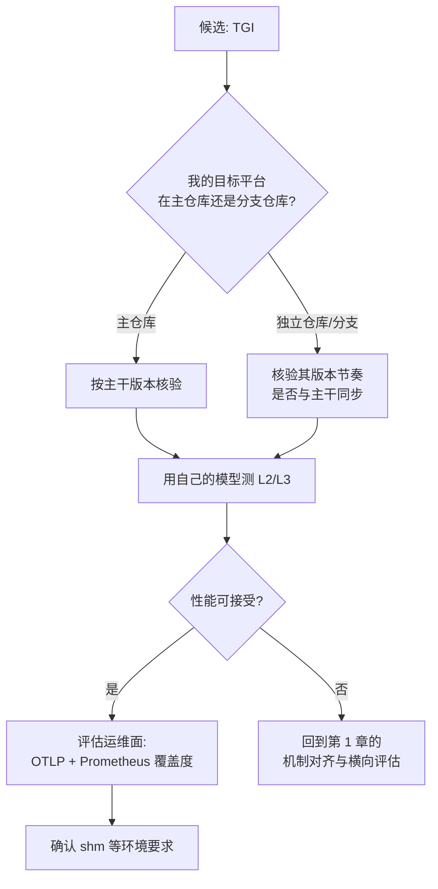

# Text Generation Inference（TGI）

> 位置：[InferenceAtlas](../../INDEX.md) > [模块 12](README.md) > 当前文档
> 信息截至：2026-08-10 ｜ 最后核验：2026-08-10 ｜ 内容版本：v0.1
> 时效性等级：**高**（上游演进快，见第 5 节）
> 相关主题：[开源推理生态全景](01_open_source_inference_ecosystem.md)｜[vLLM](02_vllm.md)｜[可观测性](../11_benchmarking_reliability_and_observability/07_observability_metrics_logs_traces.md)

## 本章导读

前两章处理的两个项目都以**引擎内部机制**为卖点。
**TGI 的重心不同：它把「可运维」放在与性能同等的位置**。

据其 `README.md`（核验日期 2026-08-10），它自述为
「a toolkit for deploying and serving Large Language Models」，
特性列表的**第二条**就是
「Production ready (distributed tracing with Open Telemetry, Prometheus metrics)」。

**这是一个值得注意的排序**：
在多数推理项目的特性列表里，可观测性即使被提及也排在很后面，
**而 TGI 把它放在紧邻「简单启动器」之后的位置**。

这与本库的判断一致：
[模块 11 第 7 章](../11_benchmarking_reliability_and_observability/07_observability_metrics_logs_traces.md) 指出
**可观测性不是运行时的附属品，它决定了系统能否被诊断**；
而 [模块 08 第 11 章](../08_networking_and_interconnect/11_network_observability_and_debugging.md) 进一步指出
**归因所需的埋点通常不存在**。
**一个把 OpenTelemetry 与 Prometheus 写进核心特性的项目，
在这一点上省掉的工作量是实打实的**。

本章因此以「运维面」为主线，
而不重复前两章已经讲过的通用机制。

**关于本章来源的说明**：
本章的事实性陈述**均来自本次实际读取的仓库文件**（第 5 节列出路径）。
**该项目的官方文档站点在 `huggingface.co` 域下，当前环境返回 403**
（详见 [AGENTS.md 第 11 节](../../AGENTS.md)），
**因此本章只使用仓库内的 README 与 `docs/source/` 下的源文件**。
**README 中标注为「~2x latency」的投机解码收益本章不予采信**——
它没有给出测量口径，标为 `待核实`。

## 学习目标

读完本章后，读者应能够：

1. 说明 TGI 在五层生态中的位置，及其与纯引擎类项目的重心差异
2. 列出 TGI 自带的可观测性设施，并对照 [模块 11](../11_benchmarking_reliability_and_observability/07_observability_metrics_logs_traces.md) 的要求判断覆盖度
3. 解释 SSE 流式返回对 TTFT/ITL 观测的意义
4. 判断共享内存（shm）配置不当会造成什么后果
5. 说明为什么「硬件支持广」在选型中既是优点也是需要核验的点

## 核心结论

- **TGI 把可观测性放在核心特性的第二条**：自带 OpenTelemetry 分布式追踪与 Prometheus 指标。
- **流式返回用 SSE**，这使 TTFT 与 ITL 可以在客户端直接观测，无需额外埋点。
- **它自述的定位是 toolkit 而非 library**，重心在部署与服务而非引擎内核。
- **共享内存配置不当会影响性能**：文档明确指出禁用 shm 共享会有性能影响。
- **硬件支持面广**（NVIDIA/AMD/Inferentia/Intel GPU/Gaudi/TPU），**但各平台由不同仓库或分支承载**，需按 L1/L2/L3 逐一核验。
- **README 中的性能宣称（如投机解码「~2x」）无测量口径**，本库不予采信。

## 1. 问题定义、系统边界与工作负载

### 1.1 定位

按 [第 1 章第 1.1 节](01_open_source_inference_ecosystem.md) 的五层划分，
TGI 同时覆盖**推理引擎**与**推理服务器**两层，
其自述用词是 **toolkit**（工具箱）而非 library。

**这个用词差异对应了重心差异**：
[第 2 章](02_vllm.md) 的 vLLM 自述为 library，
其文档的重心在调度、内存与并行；
**而 TGI 的 README 里，启动器、追踪、指标、API 兼容占了显著篇幅**。

### 1.2 本章的取材原则

| 取用 | 不取用 |
|---|---|
| README 中的特性与硬件支持列表 | 带「~2x」等无口径的性能宣称 |
| `docs/source/` 下的机制说明 | `huggingface.co` 上的文档（不可达） |
| 启动与运维相关的明确要求 | 第三方博客（不可达且非一手） |

## 2. 原理、数学与性能模型

### 2.1 可观测性设施

据 `README.md`，TGI 自带两类可观测性设施：

| 设施 | 配置方式（文档明述） |
|---|---|
| **OpenTelemetry 分布式追踪** | `--otlp-endpoint` 指定 OTLP collector 地址；`--otlp-service-name` 覆盖服务名 |
| **Prometheus 指标** | 列为「Production ready」特性的一部分 |

**对照 [模块 11 第 7 章](../11_benchmarking_reliability_and_observability/07_observability_metrics_logs_traces.md) 的三类信号**：

| 信号 | TGI 是否自带 | 说明 |
|---|---|---|
| 指标（metrics） | **是** | Prometheus |
| 追踪（traces） | **是** | OpenTelemetry |
| 日志（logs） | 运行时输出 | 未在 README 中作为特性单列 |

**追踪那一项尤其值得注意**：
[模块 08 第 11 章](../08_networking_and_interconnect/11_network_observability_and_debugging.md) 指出
**把网络/引擎侧事件关联到具体请求是排查的关键，而这需要请求级追踪**，
且该章把「请求级追踪贯穿到集合通信」列为「强但开销大且实现复杂」的方案。
**项目自带 OTLP 接入，等于把这条路径的实现成本前移到了上游**。

### 2.2 SSE 流式返回与时延观测

据 README，TGI 的 token 流式返回使用 **Server-Sent Events（SSE）**。

**这对时延观测有直接意义**。由 [模块 01 第 2 章](../01_foundations_and_metrics/02_latency_throughput_and_slo.md)：

| 指标 | 定义 | 在 SSE 下如何观测 |
|---|---|---|
| TTFT | 首 token 到达时间 | **第一个 SSE 事件的到达时刻** |
| ITL | 相邻 token 间隔 | **相邻 SSE 事件的时间差** |
| 端到端 | 完整响应耗时 | 最后一个事件的时刻 |

**因此在 SSE 下，TTFT 与 ITL 可以完全在客户端测得，不需要服务端配合埋点**。

**这一点在跨引擎对比时很有用**：
[模块 11 第 1 章](../11_benchmarking_reliability_and_observability/01_inference_benchmarking_methodology.md) 要求测量口径一致，
**而客户端侧的 SSE 时间戳是一个与引擎实现无关的公共口径**——
它测的是用户实际感受到的东西。

**但要注意一个口径陷阱**：
SSE 事件可能携带多个 token（取决于实现与配置），
**此时「相邻事件时间差」不等于 ITL**。
**做跨系统对比前必须确认每个事件携带的 token 数**。

### 2.3 共享内存的要求

README 中有专门一节讨论共享内存（shm）。
文档明确指出：
**可以用 `NCCL_SHM_DISABLE=1` 禁用 shm 共享，但这会影响性能**。

**这属于 [第 1 章第 2.3 节](01_open_source_inference_ecosystem.md) 所说的「分化点」中的失败行为类**：
**它不是一个特性，而是一个若配置不当就会静默降低性能的环境要求**。

**在容器化部署中这尤其容易出问题**：
容器的默认共享内存往往很小，
**而这类问题的表现是「性能不如预期」而非报错**——
属于 [模块 04 第 10 章](../04_compilers_runtimes_and_kernels/10_cuda_graphs_and_execution_overhead.md) 所说的**静默失效**。

### 2.4 硬件支持的广度与核验

README 列出的硬件支持包括
**NVIDIA、AMD（-rocm）、Inferentia、Intel GPU、Gaudi、Google TPU**。

**但注意其中多项由不同的仓库或分支承载**（据 README 中各项的链接指向）：
例如 Inferentia 指向 `optimum-neuron`、Gaudi 指向 `tgi-gaudi`。

**这直接触及 [模块 04 第 6 章](../04_compilers_runtimes_and_kernels/06_onnx_runtime_openvino_and_portability.md) 的 L1/L2/L3 问题**：

| 层次 | 含义 | 在此处的表现 |
|---|---|---|
| L1 | 能跑通 | 列表中出现即至少宣称 L1 |
| L2 | 性能可接受 | **需在目标平台实测** |
| L3 | 接近最优 | **通常只有主力平台达到** |

**因此「支持列表长」在选型中是一个需要核验而非直接采信的信号**——
尤其当各平台由不同仓库维护时，**其版本节奏与主干可能不同步**。

**图解读**：

1. **本图展示什么**：一条以**平台归属**为第一判定点的评估路径。
   **当硬件支持由多个仓库承载时，「支持」这个词的含义在各平台上并不等价**。
2. **核心瓶颈**：判定点 B 决定了后续核验的可靠性。
   **独立仓库承载的平台，其版本可能滞后于主干**，
   因此在其上测得的结论不能外推到主干，反之亦然。
3. **图中的 trade-off**：广泛的硬件支持换来了选型灵活性，
   **代价是每个平台都需要单独核验**——
   支持面越广，核验成本越高。
4. **面试如何引用**：可以说
   「看到很长的硬件支持列表，我会先查每一项由哪个仓库承载。
   **不同仓库意味着不同的版本节奏，L1 和 L3 的距离在各平台上不一样**；
   然后再用自己的模型实测，而不是采信列表」。

## 3. 实现机制与系统设计

### 3.1 运维面的清单

**据 README 可核验的运维相关项**：

| 项 | 说明 |
|---|---|
| 启动器 | 自述为「Simple launcher to serve most popular LLMs」 |
| OTLP 追踪 | `--otlp-endpoint`、`--otlp-service-name` |
| Prometheus 指标 | 列为 production-ready 特性 |
| OpenAI Chat Completion 兼容 | 通过 Messages API |
| 权重加载 | Safetensors |
| 共享内存 | 有明确的配置要求与性能影响说明 |

**「Safetensors 权重加载」这一项与 [模块 07 第 6 章](../07_hardware_and_server_architecture/06_gpu_server_node_architecture.md) 的冷启动分析相关**：
权重格式影响加载路径，
**而冷启动时间 $\approx W/\text{BW}_{\text{存储}}$ 是弹性能力的决定因素**。
**读者应实测该格式在自己存储上的加载吞吐**，而非假定。

### 3.2 生成控制面

README 列出的生成侧能力包括：
**logits warper（温度、top-p、top-k、重复惩罚等）、停止序列、
对数概率、水印、Guidance/JSON 结构化输出、投机解码**。

**这些对应 [模块 05](../05_decoding_and_generation_algorithms/) 的内容**：

| TGI 特性 | 本库对应章节 |
|---|---|
| logits warper | [模块 05 采样与过滤](../05_decoding_and_generation_algorithms/) |
| Guidance/JSON | [结构化输出与语法约束解码](../05_decoding_and_generation_algorithms/09_structured_output_and_grammar_constrained_decoding.md) |
| 投机解码 | [模块 05 投机解码](../05_decoding_and_generation_algorithms/) |

**注意 README 对结构化输出的描述是
「Specify output format to speed up inference and make sure the output is valid」**——
其中「speed up inference」需要谨慎理解：
由 [模块 05](../05_decoding_and_generation_algorithms/09_structured_output_and_grammar_constrained_decoding.md)，
语法约束会**减少需要生成的 token 数**（因为格式部分可被确定性填充），
**但约束本身的检查有开销**。
**净效果取决于两者的比值，不是无条件加速**。

### 3.3 参数与本库理论量的对应

| TGI 概念 | 本库理论量 | 出处 |
|---|---|---|
| 连续批处理 | 批 $B$ 与吞吐饱和 | [模块 07 第 5 章](../07_hardware_and_server_architecture/05_memory_capacity_bandwidth_and_kv_cache.md) |
| Paged Attention | 分页 KV 管理 | [模块 03 第 3 章](../03_serving_engines_and_scheduling/03_pagedattention_and_kv_memory_management.md) |
| Tensor Parallelism | $P$（TP 度） | [模块 08 第 6 章](../08_networking_and_interconnect/06_scale_up_vs_scale_out.md) |
| SSE 流式 | TTFT / ITL 的客户端观测口径 | [模块 01 第 2 章](../01_foundations_and_metrics/02_latency_throughput_and_slo.md) |
| OTLP + Prometheus | 可观测性三信号中的两类 | [模块 11 第 7 章](../11_benchmarking_reliability_and_observability/07_observability_metrics_logs_traces.md) |

## 4. 性能、成本、能耗与可靠性 trade-off

### 4.1 运维面前移的收益与代价

| | 项目自带运维设施 | 自行搭建 |
|---|---|---|
| 接入成本 | **低** | 高 |
| 与引擎内部状态的贴合度 | **高**（上游知道该暴露什么） | 取决于可导出的信息 |
| 定制自由度 | 受限于上游暴露的内容 | **高** |
| 升级时的兼容负担 | **指标名可能变** | 自己控制 |

**第四行是长期成本**：
**上游的指标命名与语义会随版本变化**，
而监控与告警建立在这些名字上。
**因此升级时应把「指标兼容性」列入检查项**——
这是 [第 1 章第 4.1 节](01_open_source_inference_ecosystem.md)「跟进成本」的一个具体形态。

### 4.2 适合与不适合的 workload

**只给出可由前述机制推出的判断**：

| 适合 | 理由 |
|---|---|
| 需要快速接入既有监控体系 | 自带 OTLP 与 Prometheus |
| 需要 OpenAI 兼容接口 | Messages API |
| 需要丰富的生成控制 | logits warper、停止序列、结构化输出 |
| 多种硬件后端并存的环境 | 支持面广（**但需逐平台核验**） |

| 不适合 / 需谨慎 | 理由 |
|---|---|
| 目标平台由独立仓库承载 | 版本节奏可能不同步（第 2.4 节） |
| 容器共享内存受限 | 会静默降低性能（第 2.3 节） |
| 需要深度定制引擎内部策略 | 定位是 toolkit，内核可调面小于纯引擎项目 |

### 4.3 可靠性

| 项 | 说明 |
|---|---|
| 追踪与指标 | **有助于快速定位**，直接改善 MTTR |
| shm 配置 | 配置不当为静默性能问题 |
| 多平台后端 | 各后端的成熟度不一致 |

## 5. benchmark、真实案例或公开部署案例

**本章不给出任何性能数字或与其他项目的对比**。

**README 中标注的「Speculation ~2x latency」本库不予采信**：
它没有给出模型、负载、批大小与测量口径，
按 [模块 11 第 1 章](../11_benchmarking_reliability_and_observability/01_inference_benchmarking_methodology.md) 的要求**不构成可用结论**，标为 `待核实`。

**README 中链接的第三方博客在当前环境不可达且非一手来源，本章未引用**。

### 5.1 本章的来源

**核验日期：2026-08-10**。核验方法见 [第 1 章第 3.3 节](01_open_source_inference_ecosystem.md)。

| 仓库路径 | 用于本章 |
|---|---|
| `README.md` | 第 1.1、2.1、2.3、2.4、3.1、3.2 节 |
| `docs/source/conceptual/streaming.md` | 第 2.2 节的流式机制 |

**披露标签：全部为 `开源代码/配置披露`**。

### 5.2 读者应自行完成的测量

| 项 | 你的值 | 方法 |
|---|---|---|
| **每个 SSE 事件携带的 token 数** | 待填 | **决定能否用事件间隔当 ITL** |
| 客户端观测的 TTFT / ITL 分布 | 待填 | [模块 11 第 3 章](../11_benchmarking_reliability_and_observability/03_ttft_tpot_itl_and_end_to_end_latency.md) |
| Prometheus 暴露的指标清单 | 待填 | 对照 [模块 11 第 7 章](../11_benchmarking_reliability_and_observability/07_observability_metrics_logs_traces.md) 的需求 |
| 目标硬件平台由哪个仓库承载 | 待填 | 第 2.4 节 |
| **该平台上的实际性能（L2/L3）** | 待填 | **用自己的模型测** |
| shm 大小与禁用前后的性能差 | 待填 | 第 2.3 节 |
| Safetensors 加载吞吐 | 待填 | 冷启动分析（[模块 07 第 6 章](../07_hardware_and_server_architecture/06_gpu_server_node_architecture.md)） |
| 结构化输出开启前后的净时延变化 | 待填 | 第 3.2 节：**不是无条件加速** |

## 6. 设计决策框架

| 观察 | 结论 |
|---|---|
| 已有 Prometheus/OTel 体系 | TGI 的接入成本低，是一项实际优势 |
| 目标平台在独立仓库 | **先核验版本节奏**，再测性能 |
| 容器化部署 | **检查 shm 配置** |
| 需要跨引擎比较时延 | 用客户端 SSE 口径，**但先确认每事件 token 数** |
| 看到「~2x」之类的宣称 | **无口径不采信** |
| 需要深度调引擎策略 | 考虑纯引擎类项目 |

## 7. 常见失败模式与排查路径

| 症状 | 首先怀疑 | 检查 |
|---|---|---|
| 容器中性能明显低于裸机 | **shm 不足** | 第 2.3 节 |
| 客户端算出的 ITL 异常小 | 单事件含多 token | 每事件 token 数 |
| 某硬件平台性能远低于预期 | L1 而非 L3 | 第 2.4 节 |
| 升级后监控面板空白 | **指标名变更** | 第 4.1 节 |
| 结构化输出后反而变慢 | 约束检查开销 > 省下的 token | 第 3.2 节 |
| 冷启动慢 | 权重加载路径 | [模块 07 第 6 章](../07_hardware_and_server_architecture/06_gpu_server_node_architecture.md) |

## 8. 关联面试主题

- 可观测性三信号与推理系统 → [模块 17 调试与 benchmark 题](../17_interview_prep/07_debug_benchmark_and_reliability_questions.md)
- TTFT/ITL 的客户端观测口径 → [模块 17 serving 与 SLO 题](../17_interview_prep/03_serving_scheduling_and_slo_questions.md)
- 结构化输出的净收益 → [模块 17 解码算法题](../17_interview_prep/05_distributed_and_moe_questions.md)
- 跨平台支持的 L1/L2/L3 → [模块 17 编译器与 kernel 题](../17_interview_prep/04_compiler_kernel_and_quantization_questions.md)

## 9. 小结

**TGI 与前两章项目的差别不在机制清单，而在重心**：
它自述为 **toolkit**，
并把「Production ready（OpenTelemetry 追踪 + Prometheus 指标）」
放在核心特性的**第二条**。

**这个排序有实际价值**：
[模块 08 第 11 章](../08_networking_and_interconnect/11_network_observability_and_debugging.md) 指出
**归因所需的埋点通常不存在**，且请求级追踪的自建成本高。
**上游自带 OTLP 接入，等于把这部分成本前移**。

**三条可直接使用的结论**：

1. **SSE 流式使 TTFT 与 ITL 可在客户端测得**，
   这是一个与引擎实现无关的公共口径，适合跨系统比较。
   **但必须先确认每个 SSE 事件携带几个 token**——
   否则事件间隔不等于 ITL。
2. **共享内存配置不当会静默降低性能**（文档明述禁用 shm 有性能影响），
   在容器化部署中尤其容易踩到，
   **且症状是「慢」而不是「报错」**。
3. **硬件支持列表长是需要核验而非采信的信号**：
   其中多项由独立仓库承载，
   **版本节奏可能与主干不同步，L1 与 L3 的距离在各平台上不一样**。

**两处本库不予采信的内容**：
README 中「Speculation ~2x latency」**无测量口径**；
结构化输出被描述为「speed up inference」，
**但语法约束既减少待生成 token 也带来检查开销，净效果需实测**。

## 关键术语

| 中文术语 | 英文 | 定义 | 单位/口径 | 关联文档 |
|---|---|---|---|---|
| 工具箱定位 | toolkit | 覆盖引擎与服务器两层，重心在部署与运维 | — | 本章 1.1 |
| SSE 流式 | Server-Sent Events | 服务端推送事件；**使 TTFT/ITL 可在客户端观测** | — | 本章 2.2 |
| 每事件 token 数 | tokens per event | 单个 SSE 事件携带的 token 数；**决定事件间隔能否当 ITL** | token | 本章 2.2 |
| 静默性能问题 | silent performance issue | 配置不当导致变慢但不报错（如 shm 不足） | — | 本章 2.3 |
| 指标兼容性 | metric compatibility | 升级时指标名与语义的稳定性；属跟进成本 | — | 本章 4.1 |

## 延伸阅读

- [开源推理生态全景](01_open_source_inference_ecosystem.md)
- [vLLM：架构、优化与适用边界](02_vllm.md)
- [可观测性：指标、日志与追踪](../11_benchmarking_reliability_and_observability/07_observability_metrics_logs_traces.md)
- [TTFT/TPOT/ITL 与端到端时延](../11_benchmarking_reliability_and_observability/03_ttft_tpot_itl_and_end_to_end_latency.md)
- [结构化输出与语法约束解码](../05_decoding_and_generation_algorithms/09_structured_output_and_grammar_constrained_decoding.md)
- [跨硬件可移植性与代价](../04_compilers_runtimes_and_kernels/06_onnx_runtime_openvino_and_portability.md)

## 主要来源

本章的全部事实性陈述来自 **2026-08-10 实际读取的 TGI 仓库文件**，路径见第 5.1 节。

**该项目的官方文档站点位于 `huggingface.co` 域下，当前环境返回 403**
（详见 [AGENTS.md 第 11 节](../../AGENTS.md)），
**因此本章只使用仓库内文件**。

| 类别 | 说明 | 披露标签 |
|---|---|---|
| 特性列表、硬件支持、追踪与 shm 说明 | `README.md` | `开源代码/配置披露` |
| 流式机制 | `docs/source/conceptual/streaming.md` | `开源代码/配置披露` |
| 与本库理论量的对应 | 由上述来源推出 | 推出 |
| 「Speculation ~2x latency」 | **无测量口径，不予采信** | `待核实` |
| README 链接的第三方博客 | **不可达且非一手，未引用** | `待核实` |

## 更新记录

| 日期 | 版本 | 变更 | 核验人 |
|---|---|---|---|
| 2026-08-10 | v0.1 | 初稿：toolkit 定位与运维重心、自带 OTLP/Prometheus 的价值、SSE 与客户端时延口径及其陷阱、shm 的静默性能影响、硬件支持广度需逐平台核验、对无口径性能宣称的处理 | — |
