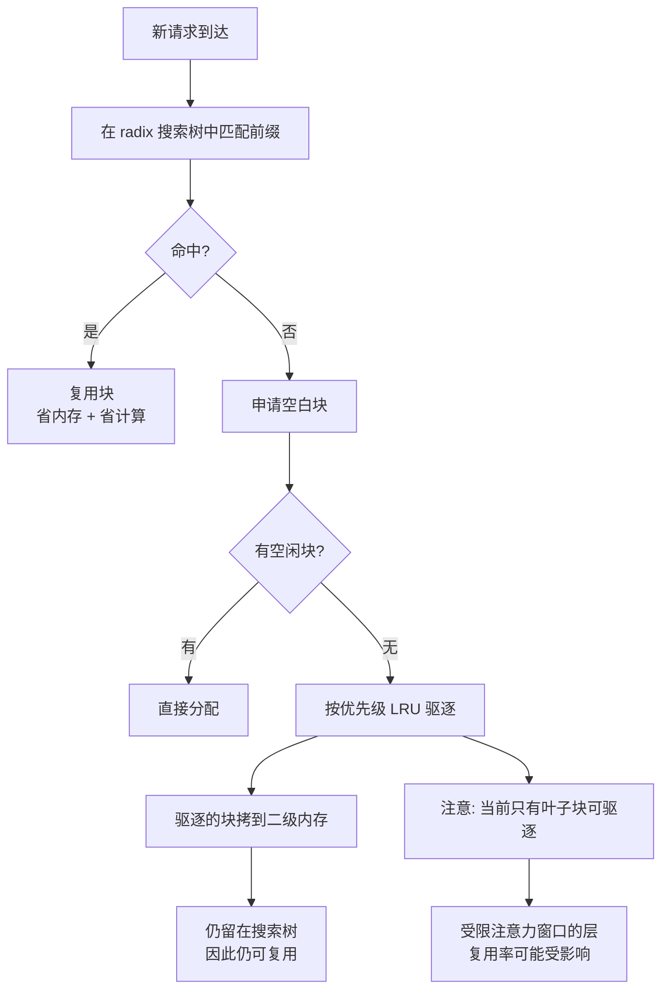

# TensorRT-LLM：KV 块池、优先级驱逐与部署实践

> 位置：[InferenceAtlas](../../INDEX.md) > [模块 12](README.md) > 当前文档
> 信息截至：2026-08-10 ｜ 最后核验：2026-08-10 ｜ 内容版本：v0.1
> 时效性等级：**高**（上游演进快，见第 5 节）
> 相关主题：[开源推理生态全景](01_open_source_inference_ecosystem.md)｜[vLLM](02_vllm.md)｜[SGLang](03_sglang.md)｜[PagedAttention 与 KV 内存管理](../03_serving_engines_and_scheduling/03_pagedattention_and_kv_memory_management.md)

## 本章导读

**本章交付本模块到目前为止最有实用价值的一张表**。

[第 1 章](01_open_source_inference_ecosystem.md) 论证了「同一机制有不同名字」，
[第 3 章](03_sglang.md) 进一步指出「参数同名不同义」。
**读完本章的三家 KV 显存参数之后，这个问题的严重程度才完整**：

| 项目 | 参数 | **分母是什么**（据各自文档） |
|---|---|---|
| vLLM | `gpu_memory_utilization` | **总显存**的百分比，用于预分配 GPU 缓存 |
| SGLang | `--mem-fraction-static` | **总显存**的比例，**且包含模型权重** |
| TensorRT-LLM | `free_gpu_memory_fraction` | **空闲显存**（权重加载后剩下的）的比例，**默认 0.9** |

**三个参数的分母各不相同**。
设单卡 96 GB、权重 40 GB、其他开销 4 GB（假设值），**同样填 0.9**：

| 项目 | 实际给到 KV 的容量 |
|---|---|
| TensorRT-LLM | $0.9 \times (96-40-4) = 46.8$ GB |
| SGLang | $0.9\times 96 - 40 = 46.4$ GB |
| vLLM | $0.9\times 96 - 40 - 4 \approx 42.4$ GB |

**差异来自分母与包含项，不是实现差异**。
**因此跨引擎搬运这个数值会得到不同的 KV 容量，进而按
$1 - W/M_{\text{eff}}$ 得到不同的可达吞吐**
（[模块 07 第 5 章](../07_hardware_and_server_architecture/05_memory_capacity_bandwidth_and_kv_cache.md)）。

本章的第二个重点是**该项目文档中罕见的坦率限制说明**——
它明确写出了两处「当前不最优、将来会改」的地方（第 2.4 节）。
**厂商文档很少这样写，因此这两条特别值得记录**。

**关于本章来源的说明**：
本章的事实性陈述**均来自本次实际读取的仓库文件**（第 5 节列出路径）。
**该项目的官方文档站点 `nvidia.github.io` 与 `docs.nvidia.com` 在当前环境不可达**
（详见 [AGENTS.md 第 11 节](../../AGENTS.md)），
**因此本章只使用仓库内 `docs/source/` 下的源文件**。
**本章不引用任何性能数字，也不涉及任何硬件规格**——
后者属于 [模块 07 的受阻章节](../07_hardware_and_server_architecture/README.md)。

## 学习目标

读完本章后，读者应能够：

1. 说明 KV 块池的组织方式，以及为什么会出现「多个池」
2. 比较三家的显存比例参数，并把它们统一换算到 KV 可用容量
3. 描述优先级 LRU 驱逐与二级内存的关系，并说明「块被驱逐后仍可复用」的含义
4. 复述文档自陈的两处当前限制，并判断它们各自影响什么负载
5. 用 `max_tokens` 与 `free_gpu_memory_fraction` 的取小规则解释实际分配结果

## 核心结论

- **三家的显存比例参数分母不同**（总显存 / 总显存含权重 / 空闲显存），**数值不可跨引擎搬运**。
- **`free_gpu_memory_fraction` 默认 0.9**；若同时设了 `max_tokens`，**实际取两者所需内存的较小者**。
- **KV 块的 token 数必须是大于 1 的 2 的幂**，且**多层被打包进同一块**，这要求这些层的头数与注意力窗口一致。
- **每个（注意力窗口, 头数）组合会创建独立的池**，而**池间的内存划分在初始化时确定且是静态的**——文档自陈这不是最优解。
- **驱逐是优先级 LRU**（优先级 0–100，默认 35），且**被驱逐的块会拷到二级内存并仍留在搜索树中，因此仍可复用**。
- **当前只有叶子块可被驱逐**——文档自陈这对受限注意力窗口的层不理想。

## 1. 问题定义、系统边界与工作负载

### 1.1 定位

按 [第 1 章第 1.1 节](01_open_source_inference_ecosystem.md) 的五层划分，
TensorRT-LLM 属于**推理引擎**层，并与编译工具链深度绑定
（编译相关内容见 [模块 04 第 3 章](../04_compilers_runtimes_and_kernels/03_tensorrt_llm.md)）。

**本章不重复模块 04 已覆盖的编译内容**，只处理部署与 KV 管理。

### 1.2 术语提醒

由 [第 1 章第 2.2 节](01_open_source_inference_ecosystem.md)，
该项目对若干通用机制使用自有术语：

| 本库概念 | 该项目术语 |
|---|---|
| 连续批处理 | **in-flight batching** |
| 前缀缓存 | **KV Cache Reuse** |

**按通用词检索该项目文档会漏掉相应章节**。

## 2. 原理、数学与性能模型

### 2.1 KV 块池的组织

据 `docs/source/features/kvcache.md`：

> KV cache 是一个**块池**，每块可容纳固定数量 token 的 KV 状态。
> **多个层被打包进同一个块**，这要求这些层具有**相同的头数与相同的注意力窗口大小**。

**两条由此产生的约束**：

| 约束 | 后果 |
|---|---|
| 单块的 token 数**必须是大于 1 的 2 的幂**（引擎构建时设定） | 粒度不可任意取 |
| 层间需头数与窗口一致才能同池 | **异构层结构会导致多池** |

**多池的产生机制**：
文档明述**为每个（注意力窗口大小, 头数）组合创建一个独立的池**，
以支持可变注意力窗口与 GQA 等优化。

**这与 [模块 02 第 6 章](../02_transformer_and_kv_cache/06_gqa_mqa_mla_and_kv_reduction.md) 的分析对应**：
GQA/MQA 改变的正是头数，
**而滑动窗口等机制改变的是注意力窗口**——
**两者都会切分池**。

### 2.2 显存分配规则

据同一文档：

| 属性 | 语义（文档原述） |
|---|---|
| `free_gpu_memory_fraction` | **空闲 GPU 显存中分配给 KV cache 的比例**，取值 $(0,1)$，**默认 0.9** |
| `max_tokens` | 若同时设置，**KV cache 会计算容纳 `max_tokens` 所需的内存，并取它与 `free_gpu_memory_fraction` 二者中的较小值** |
| `enable_block_reuse` | 跨请求块复用，**默认开启** |
| `dtype` | KV 的数据类型，**默认 `auto`**（由模型配置推断） |

**第二行的「取小」规则值得强调**：
**同时设两个参数时，实际分配是两者的下界**。
**这意味着设了较大的 `free_gpu_memory_fraction` 未必生效**——
若 `max_tokens` 更紧，它才是实际约束。
**排查容量问题时必须同时看这两个值**。

**换算到本库的量**：

$$M_{\text{KV}} = \min\Big(\text{mem}(\text{max\_tokens}),\; f_{\text{free}}\cdot(M_{\text{total}} - W - \text{其他})\Big)$$

而 [模块 07 第 5 章](../07_hardware_and_server_architecture/05_memory_capacity_bandwidth_and_kv_cache.md) 的并发上限是

$$C_{\max} = \frac{M_{\text{KV}}}{S k}$$

**注意 TensorRT-LLM 的参数形式其实最直接对应 $C_{\max}$**：
它的分母已经是扣掉权重之后的空闲显存，
**因此不需要像另外两家那样再手工扣一次权重**。

### 2.3 复用与驱逐

**复用结构**：
文档明述块被填满后即存入**radix 搜索树**，
新请求加入时进行搜索，**命中的块被复用而非重算**，
且**复用的块可在多个请求间共享，因此同时省内存与省计算**。

**这与 [第 3 章](03_sglang.md) 的 RadixAttention 是同一类数据结构**——
**两个项目用不同的名字（`KV Cache Reuse` 与 `RadixAttention`）
描述了基于 radix 树的同类机制**，
这是 [第 1 章](01_open_source_inference_ecosystem.md) 命名分歧论点的又一实证。

**驱逐策略**：

| 规则 | 文档原述 |
|---|---|
| 基本策略 | **带优先级的 LRU** |
| 优先级范围 | **0–100**（100 最重要） |
| 优先级顺序 | **必须先驱逐完最低优先级的全部块，才能驱逐下一优先级** |
| 同优先级内 | 最近最少使用者先驱逐 |
| 默认优先级 | 保留策略到期后**回落到 35** |

**二级内存的作用**：

> 块从主内存被驱逐时，其 KV 状态被**拷贝到二级内存的一个块**。
> **该二级块仍留在搜索树中，因此它仍然可复用**，
> 直到它自己也被驱逐。

**这是一个重要设计**：
**「被驱逐」不等于「失效」**——
它降级到更慢的一层但仍参与匹配。
**这与 [第 3 章](03_sglang.md) 的 HiCache 分层思路同源**，
也印证 [模块 07 第 4 章](../07_hardware_and_server_architecture/04_hbm_dram_and_memory_hierarchy.md) 的判断：
**KV 具备「可选择性」，因此适合分层存放**。

### 2.4 文档自陈的两处限制

**厂商文档很少写限制，因此这两条特别值得记录**（均为文档原文的转述）：

| 限制 | 文档原述 | 影响 |
|---|---|---|
| **多池的内存划分是静态的** | 「分配给各池的比例在初始化时确定，是静态的。**这不是最优的，我们正在研究更好的方案**」 | **负载在各池间不均衡时，部分池的空间被浪费** |
| **只有叶子块可被驱逐** | 「当前代码的一个 caveat 是只有叶子块（在 radix 树中没有后代的块）可被驱逐。这对全注意力层工作良好，**但对受限注意力窗口的层则不然**。**将在未来版本修复**」 | **影响使用滑动窗口/受限注意力的模型** |

**第一条的实践含义**：
由第 2.1 节，池由（窗口, 头数）组合切分。
**若模型含多种注意力配置，且实际负载对各配置的使用比例与初始化时的划分不符，
就会出现「总容量够但某个池不够」的情形**。
**这类问题在总显存指标上看不出来**——
排查时需要看**分池的占用**而非总量。

**第二条的实践含义**：
使用滑动窗口注意力的模型在该实现上可能达不到理想的复用率。
**这属于 [模块 04 第 6 章](../04_compilers_runtimes_and_kernels/06_onnx_runtime_openvino_and_portability.md) 的 L2 问题**：
能跑通，但性能未达最优。

**图解读**：

1. **本图展示什么**：一个块从复用到驱逐再到降级的完整生命周期。
   **关键在右下：驱逐不是终点，块降级到二级内存后仍在搜索树里参与匹配**。
2. **核心瓶颈**：瓶颈在节点 H 的约束——
   **只有叶子块可驱逐**。
   这意味着当树的中间节点占用了空间但其后代仍在时，那部分空间无法回收；
   **在受限注意力窗口的场景下这一约束更容易被触发**。
3. **图中的 trade-off**：优先级 LRU 用「先清空最低优先级」的严格顺序
   换取可预测的保留语义。
   **代价是优先级设置不当会导致高优先级块长期占用空间**——
   而默认值是 35，**保留策略到期后一律回落到它**。
4. **面试如何引用**：可以说
   「这个实现里被驱逐的块会拷到二级内存并**仍留在 radix 树中**，
   所以驱逐是降级不是失效；
   **但当前只有叶子块可被驱逐，文档自己说这对受限注意力窗口的层不理想**——
   这类自陈的限制在选型时比特性列表有价值得多」。

## 3. 实现机制与系统设计

### 3.1 保留策略

据文档，块的优先级由请求的**保留策略**决定：

| 概念 | 说明 |
|---|---|
| `TokenRangeRetentionConfig` | 为**指定 token 区间**设定优先级，如「给第 10–61 个 token 优先级 X」 |
| 适用范围 | **仅作用于输入（prompt）token** |
| `duration_ms` | 该设定的有效时长；**自块首次可复用起计时**，到期后回落到默认 35 |
| `decode_retention_policy` | 为**生成的 token** 所在块指定优先级 |
| `decode_duration_ms` | 上者的有效时长 |
| 设为 `None` | 表示该部分**永不过期** |

**这提供了一个本库其他章节未展开的能力**：
**按 token 区间而非按请求设定缓存优先级**。

**典型用法可由机制推出**：
若一批请求共享很长的 system prompt，
**给该区间设高优先级可以让它优先留驻**，
从而提高 [模块 03 第 8 章](../03_serving_engines_and_scheduling/08_prompt_caching_and_prefix_caching.md) 所说的命中率。

**文档同时标注 `transfer_mode` 是调试选项，不应使用**——
这类标注在选型与调优时应当遵守。

### 3.2 与另外两家的参数对照

**统一到「实际给 KV 的容量」这一个量**：

| 项目 | 参数 | 换算式 |
|---|---|---|
| TensorRT-LLM | `free_gpu_memory_fraction`（默认 0.9） | $f\cdot(M_{\text{total}}-W-\text{其他})$，**且与 `max_tokens` 取小** |
| SGLang | `--mem-fraction-static` | $f\cdot M_{\text{total}} - W$（**该比例含权重**） |
| vLLM | `gpu_memory_utilization` | $f \cdot M_{\text{total}}$ 中扣除权重与激活后的部分 |

**迁移配置时必须做这个换算，而不是直接搬数值**。

**本表是 [第 1 章](01_open_source_inference_ecosystem.md) 主论点的最强实证**：
**三个参数名字不同、语义不同、分母不同，
但都会被人当作「显存利用率」直接对比或搬运**。

### 3.3 与本库理论量的对应

| TensorRT-LLM 概念 | 本库理论量 | 出处 |
|---|---|---|
| `free_gpu_memory_fraction` | 直接决定 $M_{\text{KV}}$，进而定 $C_{\max}$ | [模块 07 第 5 章](../07_hardware_and_server_architecture/05_memory_capacity_bandwidth_and_kv_cache.md) |
| 块 token 数（2 的幂） | 分页粒度 | [模块 03 第 3 章](../03_serving_engines_and_scheduling/03_pagedattention_and_kv_memory_management.md) |
| radix 树复用 | 前缀缓存命中率 | [模块 03 第 8 章](../03_serving_engines_and_scheduling/08_prompt_caching_and_prefix_caching.md) |
| 优先级 LRU + 二级内存 | KV 分层与驱逐 | [模块 02 第 8 章](../02_transformer_and_kv_cache/08_kv_cache_compression_quantization_and_eviction.md) |
| 多池划分 | 有效容量比 $u$ 的一个隐藏损耗项 | [模块 07 第 5 章](../07_hardware_and_server_architecture/05_memory_capacity_bandwidth_and_kv_cache.md) |
| in-flight batching | 连续批处理 | [模块 03 第 2 章](../03_serving_engines_and_scheduling/02_static_dynamic_and_continuous_batching.md) |

**最后一行的「隐藏损耗项」值得强调**：
静态的多池划分意味着
**即使总 KV 容量充足，实际可用的也可能更少**。
**这使实测的有效容量比低于参数设定值**——
**因此 [第 1 章](01_open_source_inference_ecosystem.md) 强调的「实测 $u$」在这里尤其必要**。

## 4. 性能、成本、能耗与可靠性 trade-off

### 4.1 主要取舍

| 选择 | 得到 | 付出 |
|---|---|---|
| 提高 `free_gpu_memory_fraction` | $C_{\max}$ ↑ | 逼近 OOM |
| 同时设 `max_tokens` | 可预测的上界 | **可能使前者失效（取小）** |
| 更大的块 token 数 | 元数据开销小 | 内部碎片增加 |
| 更小的块 | 碎片少、匹配细 | 元数据与搜索开销 |
| 高优先级保留长前缀 | 命中率 ↑ | **占用空间，挤压其他请求** |
| 关闭 `enable_block_reuse` | 行为简单可预测 | **失去复用收益** |

**倒数第二行是保留策略的核心风险**：
**优先级是一种「占位权」**，
给得过多会让高优先级块长期不被驱逐，
**从而减少可供新请求使用的空间**——
其表现与容量不足相同，但根因不同。

### 4.2 适合与不适合的 workload

| 适合 | 理由 |
|---|---|
| 前缀高度共享且**共享段可识别** | 保留策略可按 token 区间设优先级 |
| 层结构均匀（同头数、同窗口） | 单池，无静态划分损耗 |
| 已在使用该编译工具链 | 与 [模块 04 第 3 章](../04_compilers_runtimes_and_kernels/03_tensorrt_llm.md) 的产物衔接 |

| 不适合 / 需谨慎 | 理由 |
|---|---|
| 层结构异构（多种窗口/头数） | **多池 + 静态划分**，文档自陈非最优 |
| 使用受限注意力窗口 | **叶子块驱逐限制**，文档自陈将来修复 |
| 需要跨引擎搬运显存配置 | 分母不同（第 3.2 节） |

**前两行都直接来自文档自陈的限制**——
**这类信息比任何特性列表都更适合用于选型**。

### 4.3 可靠性

| 项 | 说明 |
|---|---|
| 显存分配的取小规则 | 排查时须同时看两个参数 |
| 静态池划分 | **总量够但分池不够**，指标上难发现 |
| 编译产物绑定 | 见 [模块 04 第 3 章](../04_compilers_runtimes_and_kernels/03_tensorrt_llm.md)：产物与硬件、形状、量化、并行度绑定 |

## 5. benchmark、真实案例或公开部署案例

**本章不给出任何性能数字、硬件规格或与其他项目的对比**。

**该项目的官方文档站点在当前环境不可达**
（`nvidia.github.io`、`docs.nvidia.com` 均返回 403），
**因此文档中指向这些站点的 API 参考链接本章未能核验**，
仅采用仓库内 Markdown 源文件中的正文表述。

### 5.1 本章的来源

**核验日期：2026-08-10**。核验方法见 [第 1 章第 3.3 节](01_open_source_inference_ecosystem.md)。

| 仓库路径 | 用于本章 |
|---|---|
| `README.md` | 第 1.2 节的术语（`KV Cache Reuse`） |
| `docs/source/features/kvcache.md` | 第 2.1–2.4、3.1 节 |

**已核验可解析的版本 tag**：`v1.2.0`。**本表不声明它是最新版本**。

**披露标签：全部为 `开源代码/配置披露`**。

### 5.2 读者应自行完成的测量

| 项 | 你的值 | 方法 |
|---|---|---|
| `free_gpu_memory_fraction` 与 `max_tokens` **哪个更紧** | 待填 | **取小规则，两者都要看** |
| **实测 KV 容量 ÷ 参数推算值** | 待填 | **差距即静态池划分等隐藏损耗** |
| 模型的（窗口, 头数）组合数 | 待填 | 决定池数 |
| 各池的占用率 | 待填 | **总量够而某池不够时的唯一线索** |
| 块 token 数（2 的幂）与碎片率 | 待填 | [模块 03 第 3 章](../03_serving_engines_and_scheduling/03_pagedattention_and_kv_memory_management.md) |
| 复用命中率 | 待填 | [模块 03 第 8 章](../03_serving_engines_and_scheduling/08_prompt_caching_and_prefix_caching.md) |
| 保留策略下高优先级块的占用比例 | 待填 | 第 4.1 节的占位风险 |
| 是否使用受限注意力窗口 | 是/否 | 若是，注意叶子块驱逐限制 |

## 6. 设计决策框架

| 观察 | 结论 |
|---|---|
| 从别的引擎迁移显存配置 | **必须按第 3.2 节换算，不可直接搬** |
| 设了 `free_gpu_memory_fraction` 但容量没变 | **`max_tokens` 更紧**（取小规则） |
| 总显存充足但仍抢占/失败 | **查分池占用**（静态划分） |
| 模型用滑动窗口 | 注意叶子块驱逐限制，实测复用率 |
| 命中率低但前缀确实共享 | 考虑用保留策略提高关键区间优先级 |
| 高优先级块过多 | **占位挤压新请求**，回看优先级设置 |

## 7. 常见失败模式与排查路径

| 症状 | 首先怀疑 | 检查 |
|---|---|---|
| KV 容量小于参数推算 | 静态池划分等损耗 | 实测 ÷ 推算 |
| 调大显存比例无效 | `max_tokens` 更紧 | 两参数同看 |
| 某类请求频繁失败而整体容量够 | **某个池不够** | 分池占用 |
| 滑动窗口模型复用率低 | 叶子块驱逐限制 | 文档自陈的限制 |
| 命中率随时间下降 | 保留策略到期回落到 35 | `duration_ms` 设置 |
| 按 "prefix caching" 查文档查不到 | **该项目术语是 KV Cache Reuse** | 第 1.2 节 |
| 按 "continuous batching" 查不到 | **该项目术语是 in-flight batching** | 同上 |

## 8. 关联面试主题

- 三家显存参数的口径差异 → [模块 17 系统设计题](../17_interview_prep/01_inference_system_design.md)
- 前缀缓存的复用与驱逐 → [模块 17 KV cache 题](../17_interview_prep/02_kv_cache_and_transformer_questions.md)
- 分页粒度与碎片 → [模块 17 serving 与 SLO 题](../17_interview_prep/03_serving_scheduling_and_slo_questions.md)
- 编译产物的绑定维度 → [模块 17 编译器与 kernel 题](../17_interview_prep/04_compiler_kernel_and_quantization_questions.md)

## 9. 小结

**本章最重要的产出是第 3.2 节的三家参数对照**：

| 项目 | 参数 | 分母 |
|---|---|---|
| vLLM | `gpu_memory_utilization` | 总显存 |
| SGLang | `--mem-fraction-static` | 总显存，**含权重** |
| TensorRT-LLM | `free_gpu_memory_fraction`（默认 0.9） | **空闲显存**（权重之后） |

**同样填 0.9，在同一台机器上得到的 KV 容量不同**
（算例中约 46.8 / 46.4 / 42.4 GB，均为假设参数下的推算）。
**这是 [第 1 章](01_open_source_inference_ecosystem.md)「不要按名词对比」这一论点最直接的实证**，
且它有实际后果：**KV 容量经 $C_{\max}=M_{\text{KV}}/(Sk)$ 直接决定并发上限**。

**四条该项目特有的机制**：

1. **块池按（注意力窗口, 头数）组合切分**，
   块的 token 数须为大于 1 的 2 的幂，多层打包进同一块。
2. **显存分配遵循「取小」规则**：
   同时设 `max_tokens` 与 `free_gpu_memory_fraction` 时，
   **实际分配是两者的下界**——调大后者未必生效。
3. **驱逐是优先级 LRU（0–100，默认回落到 35），
   且被驱逐的块拷到二级内存后仍留在搜索树中**——
   **驱逐是降级而非失效**。
4. **保留策略可按 token 区间设优先级**，仅作用于输入 token，
   并可设有效时长；这为「让长 system prompt 优先留驻」提供了直接手段。
   **但优先级是一种占位权，给多了会挤压新请求**。

**最后是本章认为最有选型价值的两条——文档自陈的限制**：

- **多池的内存划分是静态的**，文档明写「这不是最优的，我们正在研究更好的方案」。
  后果是**总容量够而某个池不够**，且这在总量指标上看不出来。
- **当前只有叶子块可被驱逐**，文档明写这对受限注意力窗口的层不理想、将来会修。

**厂商文档很少写限制**。
**这类自陈比任何特性列表都更适合用于选型**——
它直接告诉你哪类负载会踩坑。

## 关键术语

| 中文术语 | 英文 | 定义 | 单位/口径 | 关联文档 |
|---|---|---|---|---|
| KV 块池 | KV block pool | 固定 token 容量的块集合；多层打包进同一块 | — | 本章 2.1 |
| 多池切分 | multiple pools | 按（注意力窗口, 头数）组合创建独立池；**划分静态** | 池数 | 本章 2.1、2.4 |
| 空闲显存比例 | `free_gpu_memory_fraction` | 分配给 KV 的空闲显存比例，**默认 0.9**；与 `max_tokens` **取小** | % | 本章 2.2 |
| 优先级 LRU | prioritized LRU | 先清空最低优先级，再按 LRU；范围 0–100，**默认回落 35** | — | 本章 2.3 |
| 二级内存降级 | secondary memory offload | 驱逐的块拷到二级内存并**仍留在搜索树中，仍可复用** | — | 本章 2.3 |
| 保留策略 | retention policy | 按 token 区间设定优先级与有效时长；**仅作用于输入 token** | ms | 本章 3.1 |
| 叶子块驱逐限制 | leaf-only eviction | 当前只有无后代的块可被驱逐 | — | 本章 2.4 |

## 延伸阅读

- [开源推理生态全景](01_open_source_inference_ecosystem.md)
- [vLLM](02_vllm.md)｜[SGLang](03_sglang.md)
- [TensorRT-LLM 的架构、优化与适用边界](../04_compilers_runtimes_and_kernels/03_tensorrt_llm.md)
- [PagedAttention 与 KV 内存管理](../03_serving_engines_and_scheduling/03_pagedattention_and_kv_memory_management.md)
- [前缀缓存的命中率、收益与隐私边界](../03_serving_engines_and_scheduling/08_prompt_caching_and_prefix_caching.md)
- [显存容量、带宽与 KV cache](../07_hardware_and_server_architecture/05_memory_capacity_bandwidth_and_kv_cache.md)

## 主要来源

本章的全部事实性陈述来自 **2026-08-10 实际读取的 TensorRT-LLM 仓库文件**，路径见第 5.1 节。

**该项目的官方文档站点在当前环境返回 403**
（详见 [AGENTS.md 第 11 节](../../AGENTS.md)），
**因此文档中指向该站点的 API 参考本章未能核验**，
只采用仓库内 Markdown 源文件的正文表述。

| 类别 | 说明 | 披露标签 |
|---|---|---|
| KV 块池、分配规则、驱逐与保留策略 | `docs/source/features/kvcache.md` | `开源代码/配置披露` |
| 文档自陈的两处限制 | 同上（原文转述） | `开源代码/配置披露` |
| 版本 tag 的存在性 | 已验证可解析 | `开源代码/配置披露` |
| 第 3.2 节的三家换算与算例 | **设备与权重参数为演示设定的假设值** | 推出 |
| 指向官方站点的 API 参考细节 | **不可达，未核验** | `待核实` |
| 任何性能数字与硬件规格 | **本章未给出** | — |

## 更新记录

| 日期 | 版本 | 变更 | 核验人 |
|---|---|---|---|
| 2026-08-10 | v0.1 | 初稿：KV 块池与多池切分、三家显存参数的分母差异与换算、取小规则、优先级 LRU 与二级内存降级、按 token 区间的保留策略、文档自陈的两处限制 | — |
