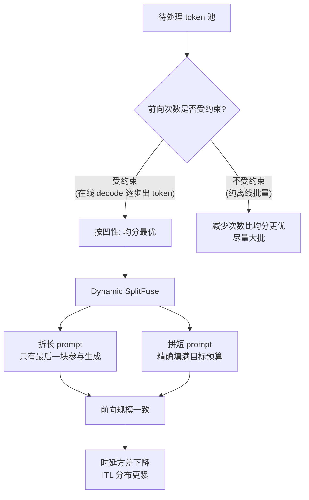

# DeepSpeed-FastGen 与 Dynamic SplitFuse

> 位置：[InferenceAtlas](../../INDEX.md) > [模块 12](README.md) > 当前文档
> 信息截至：2026-08-10 ｜ 最后核验：2026-08-10 ｜ 内容版本：v0.1
> 时效性等级：中（其核心论证为数学性质，不随版本变化）
> 相关主题：[开源推理生态全景](01_open_source_inference_ecosystem.md)｜[chunked prefill 与调度](../03_serving_engines_and_scheduling/05_prefill_decode_scheduling.md)｜[roofline 与性能建模](../01_foundations_and_metrics/04_roofline_and_performance_modeling.md)

## 本章导读

本章的价值不在于「又一个引擎」，
**而在于它的项目文档给出了一个可以被独立检验的数学论证**——
这在本模块读过的项目文档中是少见的。

DeepSpeed-FastGen 提出 **Dynamic SplitFuse** 调度策略，
其文档给出的推理链是：

1. **前向的性能主要由该次前向的 token 总数决定**，而非序列的组成方式；
2. **吞吐对 token 数的曲线是凹的**（小 token 数时受限于读模型，大 token 数时受限于计算而趋于平坦）；
3. 由凹性，对固定的 $2x$ 个 token，**均分成两批的吞吐之和最大**：
   $$2f(x) \ge f(x+h) + f(x-h)$$
4. 因此**应当让每次前向的规模保持一致**，
   把长 prompt 拆开、把短 prompt 拼满到目标预算。

**第 3 步就是 Jensen 不等式在凹函数上的形式，成立**。
**但本章要指出一个该文档没有写明的前提**：
**这个结论是在「前向次数已固定」的条件下成立的**。
本章第 2.3 节用一个可复算的例子说明：
**若前向次数可以自由减少，单次大批反而更快**——
**在 serving 中把次数固定下来的，是 decode 必须逐步出 token 这一约束**。

**关于本章来源的说明**：
本章的机制描述来自本次实际读取的项目文档
（`blogs/deepspeed-fastgen/README.md`，分支 `master`，核验日期 2026-08-10）。
**该文档中的全部性能评测结果本章不予引用**——
它们是项目自述的对比结果，未经独立复现，
按 [模块 11 第 1 章](../11_benchmarking_reliability_and_observability/01_inference_benchmarking_methodology.md) 的要求标为 `待核实`。
**本章只采用其机制描述与数学论证**，因为后者可以被独立检验。

## 学习目标

读完本章后，读者应能够：

1. 复述 Dynamic SplitFuse 的三条性能观察，并说明它们如何导出该策略
2. 验证凹性论证的代数，并指出它成立所需的前提
3. 说明为什么「每次前向规模一致」能同时改善响应性与稳定性
4. 把该策略与 chunked prefill 对照，说明两者的异同
5. 判断哪些负载能从「拼满短 prompt」中获益

## 核心结论

- **文档的核心观察是：前向性能主要由 token 总数决定，而非序列组成**——这使调度可以围绕单一信号构建。
- **吞吐-token 曲线的两个区间正是本库的 roofline 两侧**：小 token 数受限于读模型（带宽），大 token 数受限于计算。
- **凹性论证（$2f(x)\ge f(x+h)+f(x-h)$）成立**，它是 Jensen 不等式的直接形式。
- **但该结论以「前向次数固定」为前提**：次数可减少时，单次大批更快——本章第 2.3 节给出可复算的反例。
- **在 serving 中固定次数的约束来自 decode 必须逐步出 token**，因此该前提在实际场景中通常满足。
- **该策略与 chunked prefill 同源但目标更强**：后者只拆长 prompt，前者还要**把短 prompt 拼满到目标预算**。

## 1. 问题定义、系统边界与工作负载

### 1.1 定位

按 [第 1 章第 1.1 节](01_open_source_inference_ecosystem.md) 的五层划分，
DeepSpeed-FastGen 属于**推理引擎**层。

据其文档，它建立在**连续批处理与非连续 KV cache** 之上
（文档原文提到这一点与 TRT-LLM、TGI、vLLM 类似），
**其区别在于 SplitFuse 这一调度策略**。

**因此本章只讲 SplitFuse**——
其余机制在 [第 2](02_vllm.md)、[3](03_sglang.md)、[5 章](05_tensorrt_llm_deployment.md) 已覆盖。

### 1.2 本章的取材原则

| 取用 | 不取用 |
|---|---|
| 三条性能观察与其论证 | **文档中的全部性能评测结果** |
| Dynamic SplitFuse 的机制描述 | 与其他项目的对比结论 |
| 可独立检验的数学 | 图表中的数值 |

## 2. 原理、数学与性能模型

### 2.1 三条性能观察

据文档，SplitFuse 的设计由三个问题的答案推动：

**观察一：前向性能主要由 token 总数决定。**

> 前向中序列的组成方式（以序列计的批大小）对性能的影响，
> 相比前向中**原始 token 数**而言可以忽略。
> 这意味着有效的调度器可以围绕**单一信号**构建：前向中的 token 数。

**这与本库的分析一致**：
由 [模块 02 第 2 章](../02_transformer_and_kv_cache/02_prefill_vs_decode.md)，
矩阵乘的规模由参与的 token 总数决定，
**而这些 token 来自一条长序列还是多条短序列，对 GEMM 的形状影响是次要的**。

**观察二：吞吐随 token 数有两个区间。**

> token 数少时，GPU 的瓶颈是**从内存读模型**，因此吞吐随 token 数增长；
> token 数多时，模型**受计算限制**，吞吐接近常数。

**这正是本库反复使用的 roofline 两侧**
（[模块 01 第 4 章](../01_foundations_and_metrics/04_roofline_and_performance_modeling.md)）：

| 文档表述 | 本库对应 |
|---|---|
| 瓶颈是读模型 | **带宽受限**（decode 侧） |
| 受计算限制、吞吐近常数 | **计算受限**（prefill 侧） |

**观察三：应当如何在多次前向间分配 token。**
这是第 2.2 节的凹性论证。

### 2.2 凹性论证

据文档，设 $f(x)$ 为该模型的（时延到吞吐的）**凹函数**，则由凹性：

$$0 \ge \lim_{h\to 0}\frac{f(x+h)-2f(x)+f(x-h)}{h^2}$$

$$0 \ge f(x+h)-2f(x)+f(x-h)$$

$$\boxed{2f(x) \ge f(x+h)+f(x-h)}$$

文档由此得出：

> 对给定的 $2x$ 个待处理 token，**使吞吐最大的方式是把它们均分到两批**。
> 更一般地，在一个必须用 $F$ 次前向处理 $P$ 个 token 的系统中，
> **理想的划分方案是均分**。

**这一步的代数是正确的**——
它就是 Jensen 不等式在凹函数上的两点形式。

**注意文档自己给出的一般化表述里含有关键限定**：
「在一个**必须用 $F$ 次前向**处理 $P$ 个 token 的系统中」。
**即前向次数 $F$ 是给定的**。

### 2.3 前提的检验

**本节用一个可复算的例子说明该前提为什么重要**。

取一个凹且饱和的吞吐函数（**演示用假设形式**）：

$$f(s) = \frac{f_{\max}\, s}{s+k}, \qquad f_{\max}=1000,\ k=200$$

**情形 A：前向次数固定为 2，把 $2x=800$ 个 token 分成 $(x+h)$ 与 $(x-h)$。**

| $h$ | $f(x+h)+f(x-h)$ | 总时间 |
|---:|---:|---:|
| 0 | **1333.3** | 1.200 s |
| 100 | 1314.3 | 1.200 s |
| 200 | 1250.0 | 1.200 s |
| 300 | 1111.1 | 1.200 s |

**吞吐之和确实在均分处最大**，与文档一致。

**但注意总时间一栏是常数**。这不是巧合：

$$\frac{s}{f(s)} = \frac{s(s+k)}{f_{\max}s} = \frac{s+k}{f_{\max}}$$

$$T_{\text{total}} = \frac{(x+h)+k}{f_{\max}} + \frac{(x-h)+k}{f_{\max}} = \frac{2x+2k}{f_{\max}}$$

**与 $h$ 无关**。**在这个 $f$ 下，均分优化的是吞吐之和这个指标，而不是总耗时**。

**情形 B：允许改变前向次数。**

| 方案 | 总时间 |
|---|---:|
| 1 次前向，$s=800$ | **1.000 s** |
| 2 次前向，$s=400$ 各一次 | 1.200 s |

**单次大批更快**——因为固定开销项 $k$ 只付一次而不是两次。

**结论**：

> **「均分」的最优性成立于「前向次数已固定」这一前提之下**。
> 若次数可以自由减少，**减少次数比均分更有效**。

**那么在 serving 中，是什么固定了前向次数？**
**是 decode 必须逐步出 token 这一约束**：
每个 token 需要一次前向，
**因此活跃请求的存在本身就规定了前向的节奏**。
**在这个前提下，文档的结论成立**，
而 SplitFuse 要做的是**在每次必然发生的前向中把 token 预算填满且填得一致**。

**本库把这一点补充进来，是因为它决定了该策略的适用边界**：
在**纯批量离线推理**（无逐 token 出流要求）中，
**前向次数不受约束，此时「尽量大批」比「均分」更优**。

### 2.4 Dynamic SplitFuse 的两条行为

据文档，该策略做两件事：

| 行为 | 文档原述 |
|---|---|
| **拆长 prompt** | 长 prompt 被分解为小得多的块，跨多次前向调度，**只有最后一次执行生成** |
| **拼短 prompt** | 短 prompt 被**组合以恰好填满目标 token 预算**；**即使是短 prompt 也可能被拆分，以确保预算被精确填满、前向规模对齐** |

**第二条是它与 chunked prefill 的关键区别**：

| | chunked prefill（[第 2 章](02_vllm.md)） | Dynamic SplitFuse |
|---|---|---|
| 拆长 prompt | **是** | 是 |
| **拼短 prompt 到目标预算** | 不强调 | **是，且为核心** |
| 目标 | 缓解长 prefill 阻塞 decode | **让每次前向规模一致** |

**「规模一致」是一个比「不阻塞」更强的目标**，
它直接指向第 2.2 节的均分结论。

### 2.5 文档声称的三项收益

| 收益 | 文档给出的理由 | 本库的评注 |
|---|---|---|
| **更好的响应性** | 长 prompt 不再需要极长的单次前向，同一时间窗内前向次数更多 | 与 [模块 03 第 5 章](../03_serving_engines_and_scheduling/05_prefill_decode_scheduling.md) 的干扰分析一致 |
| **更高的效率** | 把短 prompt 融合到较大预算，使模型持续处于高吞吐区间 | 即观察二的计算受限区 |
| **更低的方差与更好的一致性** | **前向规模一致 ⇒ 每次前向的时延更一致**；文档称不存在抢占或长时间运行的 prompt 来推高时延 | **这一条对尾部时延的意义最大** |

**第三条值得展开**。
由 [模块 11 第 3 章](../11_benchmarking_reliability_and_observability/03_ttft_tpot_itl_and_end_to_end_latency.md)，
**用户感受由分布而非均值决定**。
**若前向规模一致，则每步时延的方差被压缩，ITL 的分布更紧**——
这正是 [模块 08 第 1 章第 2.6 节](../08_networking_and_interconnect/01_inference_networking_overview.md)
所说的「每 token 都取最大值」场景下最需要的性质。

**但要注意文档中「没有抢占」这一表述的适用范围**：
它描述的是该调度策略下的行为，
**而抢占的根本原因是 KV 容量不足**（[第 2 章第 2.5 节](02_vllm.md)）。
**规模一致的调度不能消除容量约束**——
$C_{\max}=(M_{\text{eff}}-W)/(Sk)$ 仍然成立。
**因此这条陈述应理解为「不因 prompt 长短不一而抢占」，而非「不会抢占」**。

**图解读**：

1. **本图展示什么**：把文档的结论放回它成立的前提之下。
   **入口的判定点是本库补充的**——文档只在一般化表述中一笔带过。
2. **核心瓶颈**：判定点 B 决定了整条策略是否适用。
   **在线服务中它成立（decode 逐步出 token 固定了节奏），离线批量中不成立**。
   **把在线场景的调度智慧照搬到离线批处理上，会得到相反的结论**。
3. **图中的 trade-off**：右下的「规模一致」用**放弃单次最大批**换来**时延方差下降**。
   在吞吐指标上这可能略有损失，
   **但在尾部时延指标上收益明显**——取舍方向取决于 SLO 关心哪一个。
4. **面试如何引用**：可以说
   「SplitFuse 的论证是：前向性能主要由 token 总数决定，吞吐曲线是凹的，
   **由 Jensen 不等式，固定次数下均分最优**。
   **但这个『固定次数』的前提很重要**——
   离线批量时次数不受约束，那时减少次数比均分更划算；
   在线场景下是 decode 逐步出 token 把次数固定住了」。

## 3. 实现机制与系统设计

### 3.1 与本库理论量的对应

| SplitFuse 概念 | 本库理论量 | 出处 |
|---|---|---|
| 前向 token 预算 | 每批 token 预算 | [模块 03 第 5 章](../03_serving_engines_and_scheduling/05_prefill_decode_scheduling.md) |
| 吞吐曲线的两个区间 | roofline 两侧 | [模块 01 第 4 章](../01_foundations_and_metrics/04_roofline_and_performance_modeling.md) |
| 规模一致 ⇒ 时延方差小 | ITL 分布的紧致度 | [模块 11 第 3 章](../11_benchmarking_reliability_and_observability/03_ttft_tpot_itl_and_end_to_end_latency.md) |
| 拆长 prompt | chunked prefill | [第 2 章](02_vllm.md) |
| 非连续 KV cache | 分页 KV | [模块 03 第 3 章](../03_serving_engines_and_scheduling/03_pagedattention_and_kv_memory_management.md) |

### 3.2 部署形态

据文档，该项目通过 **MII** 与 **DeepSpeed-Inference** 提供部署能力，
文档中列出了支持的模型与部署选项两节。

**本章不复制模型支持列表**——
它随版本变化快，且 [第 1 章](01_open_source_inference_ecosystem.md) 已说明
这类清单应由读者在目标版本上自行核验。

### 3.3 目标预算的选取

**文档没有给出预算的推荐值**（这是合理的，它依赖硬件与模型）。
**读者可以按本库的方法自行确定**：

| 步骤 | 方法 | 出处 |
|---|---|---|
| 1. 测吞吐-token 曲线 | 扫前向 token 数作图 | [模块 11 第 1 章](../11_benchmarking_reliability_and_observability/01_inference_benchmarking_methodology.md) |
| 2. 找出饱和拐点 | 曲线由陡变平之处 | 观察二 |
| 3. 取预算略高于拐点 | 使前向落在计算受限区 | 第 2.1 节 |
| 4. 校验 ITL 是否满足 SLO | 预算越大，单次前向越久 | [模块 01 第 2 章](../01_foundations_and_metrics/02_latency_throughput_and_slo.md) |

**第 3、4 步之间存在取舍**：
**预算越大越靠近吞吐饱和区，但单次前向的时长也越长，ITL 随之上升**。
**这与 [第 2 章](02_vllm.md) 中 `max_num_batched_tokens` 的取舍是同一件事**——
**两个项目用不同机制处理同一个权衡**。

## 4. 性能、成本、能耗与可靠性 trade-off

### 4.1 主要取舍

| 选择 | 得到 | 付出 |
|---|---|---|
| 提高目标 token 预算 | 更靠近吞吐饱和区 | **单次前向更久 ⇒ ITL 上升** |
| 严格保持规模一致 | **时延方差小** | 可能牺牲单次最大批的峰值吞吐 |
| 拆长 prompt | 长 prompt 不阻塞 | 该 prompt 的 TTFT 上升（分多次） |
| 拼短 prompt | 提高效率 | 短 prompt 可能等待凑批 |

**最后一行是「拼满」策略的固有代价**：
**为了填满预算而等待，会给已经就绪的短请求增加延迟**。
**这与 [模块 03 第 2 章](../03_serving_engines_and_scheduling/02_static_dynamic_and_continuous_batching.md)
中「凑批等待」的分析是同一个问题**。

### 4.2 适合与不适合的 workload

| 适合 | 理由 |
|---|---|
| prompt 长度差异大的在线服务 | 拆长拼短正是针对这种分布 |
| 对 ITL 稳定性要求高 | 规模一致压缩时延方差 |
| 长 prompt 与生成混合 | 长 prompt 不再阻塞生成 |

| 不适合 / 需谨慎 | 理由 |
|---|---|
| **纯离线批量推理** | **前向次数不受约束，均分不再最优**（第 2.3 节） |
| prompt 长度高度一致 | 拆拼的收益小 |
| 极低 ITL 要求 | 预算需调小，效率收益随之下降 |

**第一行是本章相对文档的主要补充**，
也是本章认为最值得记住的一条。

### 4.3 可靠性

| 项 | 说明 |
|---|---|
| 时延一致性 | **规模一致直接改善尾部** |
| 抢占 | **不因 prompt 长短不一而抢占，但容量约束仍在**（第 2.5 节） |

## 5. benchmark、真实案例或公开部署案例

**本章不引用该项目文档中的任何性能评测结果**。

其文档包含吞吐-时延分析、有效吞吐分析、token 级时序分析、
负载均衡可扩展性与其他硬件平台等多节评测，
**但这些是项目自述的对比结果，未经独立复现**，
按 [模块 11 第 1 章](../11_benchmarking_reliability_and_observability/01_inference_benchmarking_methodology.md) 的口径要求标为 `待核实`。

**本章采用的只有其机制描述与数学论证**——
**后者可以被独立检验，且本章已在第 2.3 节做了检验并补充了前提**。

### 5.1 本章的来源

**核验日期：2026-08-10**。核验方法见 [第 1 章第 3.3 节](01_open_source_inference_ecosystem.md)。

| 仓库路径 | 用于本章 |
|---|---|
| `blogs/deepspeed-fastgen/README.md`（分支 `master`） | 第 2.1–2.5、3.2 节 |
| `README.md`（分支 `master`） | 第 1.1 节的定位 |

**注意分支名为 `master` 而非 `main`**——
按 [第 1 章第 3.3 节](01_open_source_inference_ecosystem.md) 的方法核验时需注意。

**披露标签：机制描述为 `开源代码/配置披露`；
第 2.3 节的检验为本库推出**。

### 5.2 读者应自行完成的测量

| 项 | 你的值 | 方法 |
|---|---|---|
| **吞吐-token 曲线与饱和拐点** | 待填 | 第 3.3 节步骤 1–2 |
| 目标 token 预算 | 待填 | 步骤 3 |
| 该预算下的 ITL 分布 | 待填 | 步骤 4 |
| **前向规模的实际一致性** | 待填 | **该策略的直接证据** |
| ITL 的方差（与其他策略对比） | 待填 | [模块 11 第 3 章](../11_benchmarking_reliability_and_observability/03_ttft_tpot_itl_and_end_to_end_latency.md) |
| 短 prompt 的凑批等待时间 | 待填 | 第 4.1 节的代价 |
| 是否为离线批量场景 | 是/否 | **若是，重新评估均分假设** |

## 6. 设计决策框架

| 观察 | 结论 |
|---|---|
| 在线服务、prompt 长度差异大 | SplitFuse 类策略适用 |
| **纯离线批量** | **均分前提不成立，改为尽量大批** |
| ITL 方差大 | 前向规模不一致是常见原因之一 |
| 提高预算后 ITL 变差 | 正常取舍，按 SLO 定夺 |
| 短请求延迟上升 | 凑批等待，检查预算与等待上限 |
| 仍有抢占 | **容量问题，与调度策略无关** |

## 7. 常见失败模式与排查路径

| 症状 | 首先怀疑 | 检查 |
|---|---|---|
| 离线批量下吞吐不如预期 | **均分假设不适用** | 第 2.3 节 |
| ITL 方差仍然大 | 规模未真正一致 | 实测前向规模分布 |
| 短请求时延上升 | 凑批等待 | 第 4.1 节 |
| 长 prompt 的 TTFT 变差 | 拆分导致 | 属预期取舍 |
| 抢占依旧 | 容量不足 | $C_{\max}$（[模块 07 第 5 章](../07_hardware_and_server_architecture/05_memory_capacity_bandwidth_and_kv_cache.md)） |
| 按 `main` 分支取文件 404 | **该仓库用 `master`** | 第 5.1 节 |

## 8. 关联面试主题

- 凹性与批划分 → [模块 17 系统设计题](../17_interview_prep/01_inference_system_design.md)
- roofline 两区间与调度 → [模块 17 硬件与数据中心题](../17_interview_prep/06_hardware_and_datacenter_questions.md)
- 前向规模一致性与尾部时延 → [模块 17 serving 与 SLO 题](../17_interview_prep/03_serving_scheduling_and_slo_questions.md)
- chunked prefill 与 SplitFuse 的异同 → [模块 17 调试与 benchmark 题](../17_interview_prep/07_debug_benchmark_and_reliability_questions.md)

## 9. 小结

**本章处理的是一个论证而非一个产品**。

Dynamic SplitFuse 的推理链是清晰且可检验的：

1. **前向性能主要由 token 总数决定**，因此调度可围绕单一信号构建；
2. **吞吐-token 曲线有两个区间**——这正是本库的 roofline 两侧；
3. **由凹性与 Jensen 不等式，$2f(x)\ge f(x+h)+f(x-h)$**，固定次数下均分最优；
4. 因此**拆长 prompt、拼满短 prompt，使每次前向规模一致**。

**第 3 步的代数正确**。
**但本章补充了它成立的前提：前向次数必须是固定的**。
第 2.3 节用可复算的例子说明——
在该例的 $f$ 下，**总耗时与分割方式无关，而单次大批比两次均分快**
（1.000 s 对 1.200 s，因为固定开销只付一次）。

**在线 serving 中把次数固定住的，是 decode 必须逐步出 token 这一约束**。
**因此该策略在在线场景成立，而在纯离线批量推理中不成立**——
那里应当尽量减少前向次数而非追求均分。
**这是本章相对原文档的主要补充，也是最值得记住的一条**。

**该策略与 chunked prefill 的区别在于目标更强**：
后者只拆长 prompt 以免阻塞 decode，
**前者还要把短 prompt 拼满到目标预算，以求前向规模一致**。
**规模一致的直接收益是时延方差下降**，
而由 [模块 11 第 3 章](../11_benchmarking_reliability_and_observability/03_ttft_tpot_itl_and_end_to_end_latency.md)，
**用户感受由分布决定，因此这项收益落在最要紧的地方**。

**最后一条需要澄清的表述**：
文档称该策略下「不存在抢占或长时间运行的 prompt 来推高时延」。
**这应理解为「不因 prompt 长短不一而抢占」**——
**抢占的根本原因是 KV 容量不足，$C_{\max}$ 的约束不会被任何调度策略消除**。

## 关键术语

| 中文术语 | 英文 | 定义 | 单位/口径 | 关联文档 |
|---|---|---|---|---|
| Dynamic SplitFuse | Dynamic SplitFuse | 拆长 prompt、拼满短 prompt，使每次前向规模一致的调度策略 | — | 本章 2.4 |
| 前向 token 预算 | forward token budget | 单次前向的目标 token 数 | token | 本章 3.3 |
| 凹性论证 | concavity argument | $2f(x)\ge f(x+h)+f(x-h)$；**前提是前向次数固定** | — | 本章 2.2、2.3 |
| 规模一致性 | forward-size consistency | 各次前向的 token 数接近相等；**直接压缩时延方差** | — | 本章 2.5 |

## 延伸阅读

- [开源推理生态全景](01_open_source_inference_ecosystem.md)
- [vLLM：chunked prefill 与调度](02_vllm.md)
- [chunked prefill 与 prefill/decode 干扰治理](../03_serving_engines_and_scheduling/05_prefill_decode_scheduling.md)
- [Roofline 与性能建模](../01_foundations_and_metrics/04_roofline_and_performance_modeling.md)
- [TTFT/TPOT/ITL 与端到端时延](../11_benchmarking_reliability_and_observability/03_ttft_tpot_itl_and_end_to_end_latency.md)

## 主要来源

本章的机制描述来自 **2026-08-10 实际读取的 DeepSpeed 仓库文件**
（`blogs/deepspeed-fastgen/README.md`，分支 `master`）。

**该文档中的全部性能评测结果本章不予引用**，理由见第 5 节。

| 类别 | 说明 | 披露标签 |
|---|---|---|
| 三条性能观察与 SplitFuse 的机制描述 | 文档原文转述 | `开源代码/配置披露` |
| 凹性论证的代数 | 文档给出，**本章已独立验证为 Jensen 不等式的形式** | 推出 |
| **第 2.3 节对前提的检验与反例** | **本库补充**；$f(s)=f_{\max}s/(s+k)$ 为演示用假设形式 | 推出 |
| 文档中的性能评测结果 | **未经独立复现，本章不予引用** | `待核实` |
| 模型支持列表 | **随版本变化，本章未复制** | — |

## 更新记录

| 日期 | 版本 | 变更 | 核验人 |
|---|---|---|---|
| 2026-08-10 | v0.1 | 初稿：三条性能观察与 roofline 的对应、凹性论证的验证、**补充其成立所需的「前向次数固定」前提并给出反例**、与 chunked prefill 的异同、规模一致性对尾部时延的意义、对「无抢占」表述的澄清 | — |
