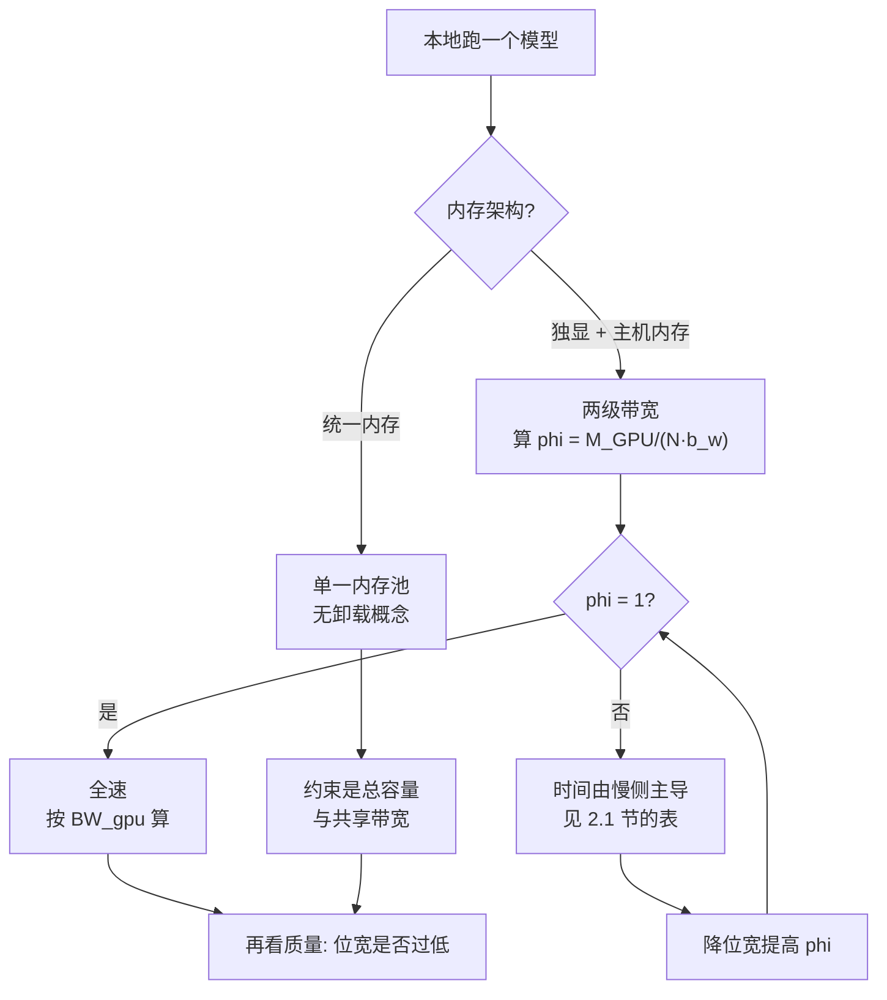

# 本地与端侧 serving：llama.cpp、MLX 与 Ollama

> 位置：[InferenceAtlas](../../INDEX.md) > [模块 12](README.md) > 当前文档
> 信息截至：2026-08-10 ｜ 最后核验：2026-08-10 ｜ 内容版本：v0.1
> 时效性等级：**高**（上游演进快，见第 5 节）
> 相关主题：[开源推理生态全景](01_open_source_inference_ecosystem.md)｜[HBM 与存储层次](../07_hardware_and_server_architecture/04_hbm_dram_and_memory_hierarchy.md)｜[移动 SoC 与内存约束](../10_edge_and_on_device_inference/02_mobile_npu_soc_and_memory_constraints.md)

## 本章导读

前五章的项目都以**多租户在线服务**为目标。
**本章的三个项目服务于一个完全不同的处境：单用户、本地、batch = 1**。

**这个处境改变了取舍的方向，而最清楚的例子是权重卸载**。

[模块 07 第 4 章第 2.4 节](../07_hardware_and_server_architecture/04_hbm_dram_and_memory_hierarchy.md) 曾论证：
**decode 每步都要读全部权重，因此权重卸载的代价直接等于带宽比，在服务场景下几乎不可行**。
**而 llama.cpp 的 README 明确把它列为特性**：

> 「CPU+GPU hybrid inference to **partially accelerate models larger than the total VRAM capacity**」

**两者并不矛盾，但需要解释清楚**。
设权重的比例 $\varphi$ 放在 GPU、其余在主机内存（假设值：$W=20$ GB、GPU 800 GB/s、主机 50 GB/s）：

| $\varphi$ | 每步 | 吞吐 | **CPU 段占时间比** |
|---:|---:|---:|---:|
| 1.00 | 25.0 ms | 40.0 tok/s | 0% |
| 0.90 | 62.5 ms | 16.0 tok/s | **64%** |
| 0.50 | 212.5 ms | 4.7 tok/s | 94% |

**只把 10% 的权重放到主机内存，吞吐就降到 40%**——
模块 07 的结论完全成立。

**但在本地场景下，这个取舍的对照项不同**：
服务场景比较的是「快」与「更快」，
**本地场景比较的是「能跑」与「跑不了」**。
**16 tok/s 对单用户阅读是可用的，而装不下则是零**。

**这就是本章的主线**：
**本地 serving 优化的不是吞吐，而是「可行性」与「上手成本」**。

**关于本章来源的说明**：
本章的事实性陈述**均来自本次实际读取的仓库 README**（第 5 节列出路径与分支）。
**这三个项目的官方文档站点均不在可达白名单内**
（详见 [AGENTS.md 第 11 节](../../AGENTS.md)），
**因此本章只使用仓库内文件**，覆盖面相应较浅。
**本章不引用任何性能数字**。

## 学习目标

读完本章后，读者应能够：

1. 说明本地 serving 与在线服务在优化目标上的根本差异
2. 用混合推理的两段模型算出卸载比例对吞吐的影响
3. 解释 MLX 的统一内存模型与 [模块 10](../10_edge_and_on_device_inference/02_mobile_npu_soc_and_memory_constraints.md) 中端侧统一内存的对应关系
4. 区分「推理引擎」与「本地分发/打包层」在这一层的分工
5. 判断本地部署中量化位宽选择的主导因素

## 核心结论

- **本地 serving 的目标是可行性与上手成本，不是吞吐**——这改变了几乎所有取舍的方向。
- **混合推理的时间几乎完全由留在慢侧的那部分决定**：算例中 10% 权重放主机，CPU 段即占 64% 的时间。
- **但在「装不下就跑不了」的对照下，这个代价是值得付的**——服务场景没有这个对照。
- **MLX 的统一内存模型使数组可在不同设备上操作而无需传输**，这与 [模块 10 第 2 章](../10_edge_and_on_device_inference/02_mobile_npu_soc_and_memory_constraints.md) 分析的端侧统一内存是同一结构。
- **llama.cpp 提供 1.5–8 bit 的宽量化谱系**，位宽在此处的主导因素是「能否装下」而非质量微调。
- **Ollama 类工具属于分发与打包层**，与引擎层不构成替代关系。

## 1. 问题定义、系统边界与工作负载

### 1.1 这一层的定位

按 [第 1 章第 1.1 节](01_open_source_inference_ecosystem.md) 的五层划分：

| 项目 | 层次 | 据其 README 的自述 |
|---|---|---|
| llama.cpp | **推理引擎** | 「enable LLM (and VLM) inference with minimal setup and state-of-the-art performance on a wide range of hardware - locally and in the cloud」 |
| MLX | **数组/计算框架**（引擎之下） | 「an array framework for machine learning on Apple silicon」 |
| Ollama | **分发与打包层**（引擎之上） | 面向「Start building with open models」的本地获取与运行 |

**三者不在同一层，因此不构成替代关系**——
这正是 [第 1 章](01_open_source_inference_ecosystem.md) 强调的「先定位层次」。

**MLX 的位置尤其需要说明**：
它是**框架**而非推理引擎，
面向推理的上层封装在单独的仓库（`mlx-lm`）中。

### 1.2 本地场景的约束集

| 约束 | 与在线服务的差别 |
|---|---|
| batch | **通常为 1**，无批处理摊薄 |
| 并发 | 单用户 |
| 内存 | **与操作系统和其他应用共享**（见 [模块 10 第 2 章](../10_edge_and_on_device_inference/02_mobile_npu_soc_and_memory_constraints.md)） |
| 首要问题 | **能不能跑起来** |
| 次要问题 | 跑多快 |

**由 [模块 07 第 5 章](../07_hardware_and_server_architecture/05_memory_capacity_bandwidth_and_kv_cache.md)**，
batch = 1 意味着 $B \ll B_{\text{half}}$，
**因此权重搬运完全无法被摊薄**——
每 token 的搬运量就是 $W$ 本身。
**这使权重体积（即量化位宽）成为本地场景的支配性参数**。

## 2. 原理、数学与性能模型

### 2.1 混合推理的两段模型

设权重总量 $W$，比例 $\varphi$ 驻留在 GPU 显存（带宽 $\text{BW}_g$），
其余 $(1-\varphi)$ 在主机内存（带宽 $\text{BW}_c$）。
batch = 1 的每步时间近似为

$$t_{\text{step}} \approx \frac{\varphi W}{\text{BW}_g} + \frac{(1-\varphi)W}{\text{BW}_c}$$

**算例（假设值：$W = 20$ GB、$\text{BW}_g = 800$ GB/s、$\text{BW}_c = 50$ GB/s）**：

| $\varphi$ | GPU 段 | 主机段 | 每步 | 吞吐 | 主机段占比 |
|---:|---:|---:|---:|---:|---:|
| 1.00 | 25.0 ms | 0 | 25.0 ms | 40.0 tok/s | 0% |
| 0.90 | 22.5 ms | 40.0 ms | 62.5 ms | 16.0 tok/s | **64%** |
| 0.75 | 18.8 ms | 100.0 ms | 118.8 ms | 8.4 tok/s | 84% |
| 0.50 | 12.5 ms | 200.0 ms | 212.5 ms | 4.7 tok/s | 94% |
| 0.00 | 0 | 400.0 ms | 400.0 ms | 2.5 tok/s | 100% |

**关键观察**：
**主机段占比上升得比 $(1-\varphi)$ 快得多**。
$\varphi=0.9$ 时只有 10% 的权重在慢侧，
**但它已占用 64% 的时间**——
因为两侧的带宽比是 16 倍。

**一般形式**：主机段占比为

$$\frac{(1-\varphi)/\text{BW}_c}{\varphi/\text{BW}_g + (1-\varphi)/\text{BW}_c}$$

**当 $\text{BW}_g/\text{BW}_c = r$ 时，$(1-\varphi) = 1/(1+r)$ 处两段各半**。
算例中 $r=16$，故 $\varphi \approx 0.94$ 时两段相当。

**结论**：
**混合推理的时间几乎完全由留在慢侧的那部分决定**，
**因此 $\varphi$ 应尽可能接近 1**，
而「装不下的那一点点」就是全部代价的来源。

### 2.2 为什么这在本地场景仍然值得

**同一个数字在两种场景下的意义不同**：

| | 在线服务 | 本地单用户 |
|---|---|---|
| 对照项 | 用更多卡装下，全速跑 | **装不下就完全跑不了** |
| 16 tok/s 的评价 | **不可接受**（远低于 SLO） | **可用**（快于多数人阅读速度） |
| 成本结构 | 每 token 成本上升数倍 | **硬件已有，边际成本为零** |
| 摊薄可能 | 批处理可摊薄 | **batch=1，无可摊薄** |

**第一行是关键**：
[模块 07 第 4 章](../07_hardware_and_server_architecture/04_hbm_dram_and_memory_hierarchy.md) 的结论
「权重卸载在 decode 上几乎不可行」
**是在「可以增加设备」这个前提下成立的**。
**本地场景没有这个前提**，
因此同样的技术在这里从「不可行」变成「唯一可行」。

**这是一个方法论提醒**：
**本库的定量结论都有其成立的场景前提，换场景时要重新检查前提而不是套用结论**。

### 2.3 量化位宽的主导因素

据 llama.cpp 的 README，它提供
**1.5、2、3、4、5、6、8 bit 的整数量化**。

**如此宽的谱系在服务场景中很少见**，原因由第 2.1 节可推出：

$$\varphi = \min\left(1,\ \frac{M_{\text{GPU}}}{N_{\text{param}}\cdot b_w}\right)$$

**降低 $b_w$ 直接提高 $\varphi$**，
而由第 2.1 节，**$\varphi$ 接近 1 与否几乎决定了全部性能**。

**因此本地场景的量化选择逻辑是**：

| 服务场景 | 本地场景 |
|---|---|
| 在质量约束下尽量降位宽以提吞吐 | **先选能让 $\varphi = 1$ 的最高位宽** |
| 位宽是性能调优参数 | **位宽是可行性参数** |

**这解释了为什么本地生态里 2 bit、3 bit 这类在服务场景中罕见的位宽有实际需求**——
**它们的存在理由是「让模型整个装进显存」，而不是「再快一点」**。

**质量代价仍然存在**，见
[模块 10 第 7 章](../10_edge_and_on_device_inference/07_quantization_distillation_and_pruning_for_edge.md) 的质量断点分析：
**位宽降到某处之后质量会迅速劣化**，
**因此「装得下」与「还能用」之间有一个必须实测的边界**。

### 2.4 统一内存

据 MLX 的 README：

> **统一内存模型**是 MLX 与其他框架的一个显著差异。
> MLX 的数组存在于**共享内存**中。
> 对 MLX 数组的操作可以在任何受支持的设备类型上执行，**而无需传输数据**。

**这与 [模块 10 第 2 章](../10_edge_and_on_device_inference/02_mobile_npu_soc_and_memory_constraints.md) 分析的端侧统一内存是同一结构**：

| 统一内存的性质 | 后果 |
|---|---|
| 无需设备间传输 | **消除了 [模块 07 第 6 章](../07_hardware_and_server_architecture/06_gpu_server_node_architecture.md) 中的主机总线瓶颈** |
| 容量与带宽被共享 | **CPU 与加速器争用同一带宽**（模块 10 第 2 章的共享折扣） |
| 无独立显存概念 | **第 2.1 节的两段模型退化**：不存在「装不下要卸载」 |

**第三行值得强调**：
**在统一内存架构上，混合推理这个概念本身不适用**——
不存在两级带宽的分割，只有一个内存池。
**因此第 2.1 节的分析适用于独显架构，而不适用于统一内存架构**。

**取而代之的约束是总容量与共享带宽**，
分析见 [模块 10 第 2 章](../10_edge_and_on_device_inference/02_mobile_npu_soc_and_memory_constraints.md)。

**图解读**：

1. **本图展示什么**：本地部署的第一个分岔不是选引擎，**而是内存架构**。
   **两种架构下「卸载」这个概念的适用性完全不同**。
2. **核心瓶颈**：左支的瓶颈是 $\varphi$。
   **由第 2.1 节，它接近 1 与否几乎决定全部性能**，
   因此「降位宽」这个动作在此处的作用是**把 $\varphi$ 推到 1**，
   而不是通常意义上的加速。
3. **图中的 trade-off**：降位宽提高 $\varphi$，代价是质量。
   **两者的交汇处就是本地部署的可行域边界**——
   低于某个位宽装得下但不能用（质量断点）。
4. **面试如何引用**：可以说
   「本地部署我会先算 $\varphi$——能放进显存的权重比例。
   **因为混合推理的时间几乎由留在慢侧的那部分决定**：
   带宽比 16 倍时，只放 10% 到主机内存，它就占掉 64% 的时间。
   **所以本地场景的量化位宽是可行性参数而不是调优参数**」。

## 3. 实现机制与系统设计

### 3.1 llama.cpp 的取材要点

据其 `README.md`（分支 `master`）：

| 特性 | 说明 |
|---|---|
| 实现 | **纯 C/C++，无依赖** |
| Apple silicon | 自述为「first-class citizen」，经 ARM NEON、Accelerate 与 Metal 优化 |
| x86 | AVX、AVX2、AVX512、AMX |
| RISC-V | RVV、ZVFH、ZFH、ZICBOP、ZIHINTPAUSE |
| GPU | 自定义 CUDA kernel；AMD 经 HIP、摩尔线程经 MUSA |
| 其他后端 | Vulkan、SYCL |
| 量化 | **1.5/2/3/4/5/6/8 bit 整数量化** |
| 混合推理 | **CPU+GPU，用于部分加速超出总显存容量的模型** |
| 底层 | 构建于 `ggml` 库之上 |

**「无依赖的纯 C/C++」这一条对本地场景的意义**：
它直接降低了 [第 1 章第 4.1 节](01_open_source_inference_ecosystem.md) 所说的**上手成本**，
**而在本地场景中上手成本是首要指标之一**。

### 3.2 分发与打包层

**Ollama 属于引擎之上的分发层**——
它解决的是「获取模型、管理版本、一条命令跑起来」，
**而不是推理机制本身**。

**这一层的价值应当按 [第 1 章](01_open_source_inference_ecosystem.md) 的层次观来评估**：

| 该层解决 | 该层不解决 |
|---|---|
| 模型获取与本地存储 | 推理速度 |
| 版本与变体管理 | 显存约束 |
| 统一的本地调用入口 | 量化质量 |

**因此「用 Ollama 还是 llama.cpp」是一个层次混淆的问题**——
它们通常是叠在一起的。

### 3.3 与本库理论量的对应

| 本地场景概念 | 本库理论量 | 出处 |
|---|---|---|
| GPU 驻留比例 $\varphi$ | 卸载比例；决定有效带宽 | [模块 07 第 4 章](../07_hardware_and_server_architecture/04_hbm_dram_and_memory_hierarchy.md) |
| 量化位宽 $b_w$ | 权重体积 $W = N b_w$ | [模块 07 第 3 章](../07_hardware_and_server_architecture/03_tensor_cores_matrix_engines_and_low_precision.md) |
| batch = 1 | $B \ll B_{\text{half}}$，无摊薄 | [模块 07 第 5 章](../07_hardware_and_server_architecture/05_memory_capacity_bandwidth_and_kv_cache.md) |
| 统一内存 | 共享容量与带宽 | [模块 10 第 2 章](../10_edge_and_on_device_inference/02_mobile_npu_soc_and_memory_constraints.md) |
| 质量断点 | 位宽下界 | [模块 10 第 7 章](../10_edge_and_on_device_inference/07_quantization_distillation_and_pruning_for_edge.md) |

## 4. 性能、成本、能耗与可靠性 trade-off

### 4.1 主要取舍

| 选择 | 得到 | 付出 |
|---|---|---|
| 降低位宽使 $\varphi=1$ | **性能跃升**（见第 2.1 节的表） | 质量下降 |
| 保持高位宽、接受卸载 | 质量好 | **吞吐按第 2.1 节下降** |
| 更小的模型 | 全驻留 + 质量稳定 | 能力下降 |
| 统一内存平台 | 无卸载问题 | 带宽通常低于独显 |

**第一行与第二行的比较是本地部署的核心决策**，
**而它可以被量化**：
第 2.1 节给出性能侧，
[模块 10 第 7 章](../10_edge_and_on_device_inference/07_quantization_distillation_and_pruning_for_edge.md) 给出质量侧。

### 4.2 适合与不适合

| 适合 | 理由 |
|---|---|
| 单用户本地使用 | batch=1 的处境正是其设计点 |
| 隐私优先、离线 | 见 [模块 10 第 8 章](../10_edge_and_on_device_inference/08_private_hybrid_cloud_edge_architectures.md) |
| 硬件已有、边际成本为零 | 卸载的代价可接受 |
| 快速试用与原型 | 上手成本低 |

| 不适合 | 理由 |
|---|---|
| 多用户并发服务 | 无批处理摊薄；见 [第 2](02_vllm.md)–[6 章](06_deepspeed_fastgen.md) |
| 有 SLO 要求 | 卸载导致的时延不可控 |
| 需要高吞吐 | batch=1 的结构性限制 |

### 4.3 可靠性

| 项 | 说明 |
|---|---|
| 内存竞争 | **与操作系统及其他应用共享**，见 [模块 10 第 9 章](../10_edge_and_on_device_inference/09_edge_deployment_case_studies.md) 案例二 |
| 热降频 | 见 [模块 10 第 9 章](../10_edge_and_on_device_inference/09_edge_deployment_case_studies.md) 案例一 |
| 量化质量 | 需按能力逐项验收，见 [模块 10 第 9 章](../10_edge_and_on_device_inference/09_edge_deployment_case_studies.md) 案例四 |

**这三行都指向 [模块 10 第 9 章](../10_edge_and_on_device_inference/09_edge_deployment_case_studies.md)**——
**本地部署的失败模式在那里已有完整的走查**，本章不重复。

## 5. benchmark、真实案例或公开部署案例

**本章不给出任何性能数字**。

**这三个项目的官方文档站点均不在当前可达白名单内**
（详见 [AGENTS.md 第 11 节](../../AGENTS.md)），
**因此本章的覆盖面限于仓库 README，比前几章浅**。
**这是一个应当明确说明的局限，而不是本章内容的完整边界**。

### 5.1 本章的来源

**核验日期：2026-08-10**。核验方法见 [第 1 章第 3.3 节](01_open_source_inference_ecosystem.md)。

| 仓库 | 路径与分支 | 用于本章 |
|---|---|---|
| `ggml-org/llama.cpp` | `README.md`（分支 **`master`**） | 第 2.3、3.1 节 |
| `ml-explore/mlx` | `README.md` | 第 2.4 节的统一内存 |
| `ml-explore/mlx-lm` | `README.md` | 第 1.1 节的分层 |
| `ollama/ollama` | `README.md` | 第 1.1、3.2 节 |

**注意 llama.cpp 使用 `master` 分支**。

**披露标签：全部为 `开源代码/配置披露`**。

### 5.2 读者应自行完成的测量

| 项 | 你的值 | 方法 |
|---|---|---|
| 内存架构（独显 / 统一） | 待填 | **决定第 2.1 节是否适用** |
| **$\varphi$：能驻留显存的权重比例** | 待填 | $M_{\text{GPU}}/(N b_w)$ |
| 两侧带宽比 $r$ | 待填 | 分别实测 |
| **实测吞吐与两段模型的偏差** | 待填 | 偏差大说明有其他瓶颈 |
| 使 $\varphi=1$ 所需的最高位宽 | 待填 | 第 2.3 节 |
| 该位宽下的能力验收 | 待填 | [模块 10 第 9 章](../10_edge_and_on_device_inference/09_edge_deployment_case_studies.md) 案例四 |
| 热稳态吞吐（非峰值） | 待填 | [模块 10 第 9 章](../10_edge_and_on_device_inference/09_edge_deployment_case_studies.md) 案例一 |
| 系统内存压力下的驻留额度 | 待填 | 同上，案例二 |

## 6. 设计决策框架

| 观察 | 结论 |
|---|---|
| 统一内存架构 | **第 2.1 节不适用**，看总容量与共享带宽 |
| $\varphi < 1$ | 时间由慢侧主导，**优先降位宽把 $\varphi$ 推到 1** |
| 降位宽后质量不可接受 | 换更小的模型，而非继续降位宽 |
| 需要服务多用户 | **换用第 2–6 章的引擎** |
| 只是想快速试用 | 分发层（如 Ollama）足够 |
| 实测远低于两段模型预测 | 查热降频与内存压力（[模块 10 第 9 章](../10_edge_and_on_device_inference/09_edge_deployment_case_studies.md)） |

## 7. 常见失败模式与排查路径

| 症状 | 首先怀疑 | 检查 |
|---|---|---|
| 吞吐远低于预期 | **少量权重在主机侧** | 算 $\varphi$ 与主机段占比 |
| 降位宽后提升巨大 | $\varphi$ 跨过 1 | 属预期（第 2.3 节） |
| 位宽很低但质量崩了 | 越过质量断点 | [模块 10 第 7 章](../10_edge_and_on_device_inference/07_quantization_distillation_and_pruning_for_edge.md) |
| 用一会儿变慢 | 热降频 | [模块 10 第 9 章](../10_edge_and_on_device_inference/09_edge_deployment_case_studies.md) 案例一 |
| 切后台被杀 | 内存压力 | 同上，案例二 |
| 按 `main` 取 llama.cpp 文件 404 | **该仓库用 `master`** | 第 5.1 节 |

## 8. 关联面试主题

- 卸载的可行性与场景前提 → [模块 17 硬件与数据中心题](../17_interview_prep/06_hardware_and_datacenter_questions.md)
- batch=1 的结构性限制 → [模块 17 系统设计题](../17_interview_prep/01_inference_system_design.md)
- 统一内存的取舍 → [模块 17 KV cache 题](../17_interview_prep/02_kv_cache_and_transformer_questions.md)
- 量化位宽作为可行性参数 → [模块 17 编译器与 kernel 题](../17_interview_prep/04_compiler_kernel_and_quantization_questions.md)

## 9. 小结

**本章的三个项目服务于一个与前五章完全不同的处境：单用户、本地、batch = 1**。

**这个处境改变了取舍方向，最清楚的例子是权重卸载**：

- **混合推理的时间几乎完全由留在慢侧的那部分决定**。
  算例中带宽比 16 倍时，$\varphi = 0.9$（仅 10% 权重在主机）
  就使主机段占用 **64%** 的时间，吞吐从 40 降到 16 tok/s。
- **两段各半的临界点是 $(1-\varphi) = 1/(1+r)$**，
  算例中 $\varphi \approx 0.94$。
- **[模块 07 第 4 章](../07_hardware_and_server_architecture/04_hbm_dram_and_memory_hierarchy.md) 的结论完全成立**，
  但它的对照项是「加设备全速跑」；
  **本地场景的对照项是「跑不了」**，
  因此同一技术从「不可行」变成「唯一可行」。

**这是一个方法论提醒**：
**本库的定量结论都有场景前提，换场景时要重新检查前提，而不是套用结论**。

**三条派生结论**：

1. **本地场景的量化位宽是可行性参数而非调优参数**：
   降位宽的作用是**把 $\varphi$ 推到 1**，
   这解释了 2 bit、3 bit 这类在服务场景罕见的位宽为何在本地生态中有实际需求。
   **但质量断点仍在**，「装得下」与「还能用」之间的边界必须实测。
2. **统一内存架构下，第 2.1 节的两段模型不适用**——
   不存在两级带宽的分割，约束变为总容量与共享带宽
   （[模块 10 第 2 章](../10_edge_and_on_device_inference/02_mobile_npu_soc_and_memory_constraints.md)）。
   **因此本地部署的第一个判断是内存架构，而不是选哪个引擎**。
3. **三个项目不在同一层**：
   MLX 是框架、llama.cpp 是引擎、Ollama 是分发与打包层。
   **「用 A 还是 B」在这里常常是层次混淆的问题**——它们通常叠在一起用。

**本章的覆盖面比前几章浅**，
因为这三个项目的官方文档站点均不可达，
**本章只使用了仓库 README**。**这是局限而非边界**。

## 关键术语

| 中文术语 | 英文 | 定义 | 单位/口径 | 关联文档 |
|---|---|---|---|---|
| GPU 驻留比例 | resident fraction $\varphi$ | 驻留显存的权重比例；**接近 1 与否几乎决定全部性能** | 无量纲 | 本章 2.1 |
| 混合推理 | CPU+GPU hybrid inference | 权重分驻显存与主机内存 | — | 本章 2.1 |
| 两段模型 | two-segment model | $t = \varphi W/\text{BW}_g + (1-\varphi)W/\text{BW}_c$ | 秒 | 本章 2.1 |
| 可行性参数 | feasibility parameter | 决定「能否跑」而非「跑多快」的参数；本地场景的位宽即是 | — | 本章 2.3 |
| 分发与打包层 | distribution layer | 负责模型获取、版本与本地入口，**不改变推理机制** | — | 本章 3.2 |

## 延伸阅读

- [开源推理生态全景](01_open_source_inference_ecosystem.md)
- [HBM、DRAM 与存储层次](../07_hardware_and_server_architecture/04_hbm_dram_and_memory_hierarchy.md)
- [移动 SoC、NPU 与内存约束](../10_edge_and_on_device_inference/02_mobile_npu_soc_and_memory_constraints.md)
- [AI PC 的推理路径](../10_edge_and_on_device_inference/04_pc_ai_inference.md)
- [面向端侧的模型压缩](../10_edge_and_on_device_inference/07_quantization_distillation_and_pruning_for_edge.md)
- [端侧部署案例：五个走查](../10_edge_and_on_device_inference/09_edge_deployment_case_studies.md)

## 主要来源

本章的全部事实性陈述来自 **2026-08-10 实际读取的仓库 README**，路径与分支见第 5.1 节。

**这三个项目的官方文档站点均不在可达白名单内**
（详见 [AGENTS.md 第 11 节](../../AGENTS.md)），
**因此本章覆盖面限于 README**。

| 类别 | 说明 | 披露标签 |
|---|---|---|
| 各项目的定位、特性与量化谱系 | 见第 5.1 节的逐条路径 | `开源代码/配置披露` |
| MLX 的统一内存表述 | `ml-explore/mlx` 的 `README.md` | `开源代码/配置披露` |
| 第 2.1 节的两段模型与算例 | 由带宽定义推出；**参数为演示设定的假设值** | 推出 |
| 各项目的性能数字 | **本章未给出** | — |
| 官方文档站点内容 | **不可达** | `待核实` |

## 更新记录

| 日期 | 版本 | 变更 | 核验人 |
|---|---|---|---|
| 2026-08-10 | v0.1 | 初稿：本地场景与在线服务的目标差异、混合推理的两段模型与临界点、卸载结论的场景前提、位宽作为可行性参数、统一内存下两段模型的不适用、三个项目的层次划分 | — |
