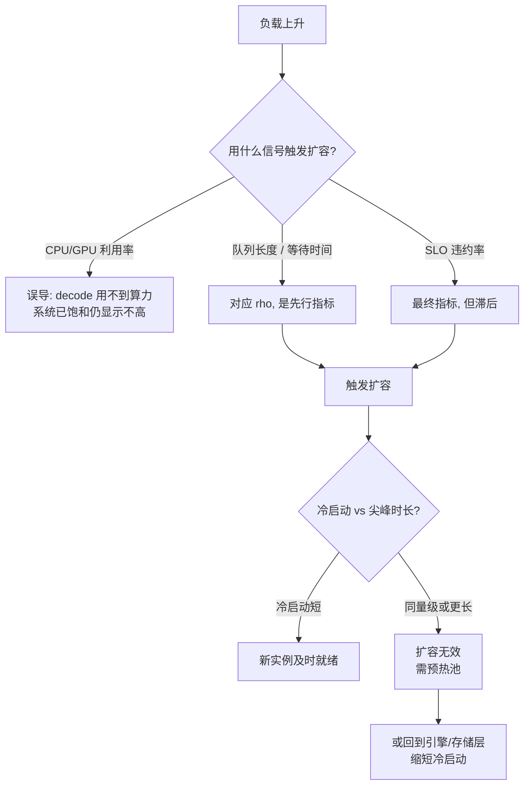

# 编排层与推理服务器：Ray、Kubernetes、KServe 与 Triton

> 位置：[InferenceAtlas](../../INDEX.md) > [模块 12](README.md) > 当前文档
> 信息截至：2026-08-10 ｜ 最后核验：2026-08-10 ｜ 内容版本：v0.1
> 时效性等级：中
> 相关主题：[开源推理生态全景](01_open_source_inference_ecosystem.md)｜[自动扩缩容与负载均衡](../03_serving_engines_and_scheduling/10_autoscaling_and_load_balancing.md)｜[服务器节点架构](../07_hardware_and_server_architecture/06_gpu_server_node_architecture.md)

## 本章导读

[第 1 章](01_open_source_inference_ecosystem.md) 把生态分为五层，
并指出**混淆层次是选型失败的常见起点**。
**本章处理的是「引擎之上」的两层——推理服务器与编排**，
而这两层最容易与引擎层被放在一起比较。

**本章要说明的核心问题是：编排层解决的是引擎解决不了的那些事，
而它们大多不是性能问题**：

| 引擎层负责 | 编排层负责 |
|---|---|
| 单实例内的批处理、KV、并行 | **多少个实例、放在哪、何时增减** |
| 一次请求的执行 | **请求到实例的分配** |
| 显存与算力的使用 | **实例的生命周期与发布** |

**而本章要强调的一条与本库前文直接相连的结论是**：
[模块 07 第 6 章](../07_hardware_and_server_architecture/06_gpu_server_node_architecture.md) 已论证
**当冷启动时间与负载尖峰时长同量级时，自动扩缩容形同虚设**。
**这个约束不在编排层能解决的范围内**——
无论编排器多智能，它都无法让一个需要 20 秒加载权重的实例在 30 秒的尖峰里发挥作用。
**因此编排层的能力上界由引擎层与存储层决定**。

**关于本章来源的说明**：
本章的事实性陈述**均来自本次实际读取的仓库 README**（第 5 节列出路径与分支）。
**这些项目的官方文档站点均不在可达白名单内**
（详见 [AGENTS.md 第 11 节](../../AGENTS.md)），
**因此本章的覆盖面限于 README 与本库已有的分析**，
**不涉及各项目的具体配置语法**——那需要官方文档核验。

## 学习目标

读完本章后，读者应能够：

1. 区分推理服务器层与编排层的职责，并说明它们与引擎层的关系
2. 说明为什么编排层的弹性能力上界由冷启动时间决定
3. 判断一个需求应当在哪一层解决
4. 列出 GPU 负载在编排层特有的、与无状态服务不同的约束
5. 说明为什么「按 CPU 利用率扩缩容」对推理服务通常不适用

## 核心结论

- **编排层解决的是「多少、放哪、何时增减」，不是「跑多快」**。
- **弹性能力的上界由冷启动决定**，而冷启动属于引擎与存储层——编排器无法突破它。
- **推理服务是有状态的**：KV cache 与前缀缓存使「随意迁移请求」的代价远高于无状态服务。
- **按 CPU 利用率扩缩容对推理不适用**：由 [模块 07 第 4 章](../07_hardware_and_server_architecture/04_hbm_dram_and_memory_hierarchy.md)，decode 用到的算力不足峰值 1%，**GPU「利用率」也是误导指标**。
- **合适的扩缩容信号是队列长度与 SLO 违约率**，而非资源利用率。
- **Triton 属于推理服务器层**（多模型、多框架装载），与引擎层不构成替代关系。

## 1. 问题定义、系统边界与工作负载

### 1.1 三个项目的层次定位

据各自 `README`（核验日期 2026-08-10）：

| 项目 | 自述定位 | 本库归入的层 |
|---|---|---|
| **Triton Inference Server** | 推理服务（多框架模型装载与服务） | **推理服务器** |
| **KServe** | 「a standardized distributed generative and predictive AI inference platform for scalable, multi-framework deployment on **Kubernetes**」；CNCF 孵化项目 | **编排** |
| **Ray** | 通用分布式计算框架，其 Serve 组件面向在线服务 | **编排**（其 Serve 部分） |

**三者与引擎层的关系是叠加而非替代**：
**KServe / Ray Serve 之下通常仍然跑着 [第 2](02_vllm.md)–[6 章](06_deepspeed_fastgen.md) 的某个引擎**。

### 1.2 本章的范围限制

**本章不给出各项目的配置语法与 API 细节**。
理由：它们需要官方文档核验，**而官方文档站点在当前环境不可达**。
**本章只处理层次职责与本库能够推出的结构性结论**。

**这是一个应当明说的覆盖面限制**。

## 2. 原理、数学与性能模型

### 2.1 编排层的能力上界

**编排层能做的事有一个硬上界，而它不在编排层内部**。

由 [模块 07 第 6 章第 2.3 节](../07_hardware_and_server_architecture/06_gpu_server_node_architecture.md)：

$$t_{\text{冷启动}} \approx \frac{W}{\text{BW}_{\text{存储}}} + t_{\text{编译/捕获}}$$

**新实例从「决定扩容」到「可服务」至少需要这么久**。
**因此**：

| 冷启动 ÷ 尖峰时长 | 自动扩缩容的效果 |
|---|---|
| $\ll 1$ | 有效 |
| $\approx 1$ | **基本无效**：就绪时尖峰已过 |
| $> 1$ | 完全无效 |

**该章的算例**：140 GB 权重从 NVMe 加载约 20 s；
**若尖峰持续 30 s，新副本只在尖峰的最后 33% 时间内可用**。

**结论**：
**无论编排器的扩缩容策略多先进，它都无法突破这个时间**。
**能突破它的是引擎层与存储层的手段**：

| 手段 | 所属层 | 出处 |
|---|---|---|
| 复用编译缓存 | **引擎** | [第 2 章第 3.2 节](02_vllm.md) |
| 更小的权重（量化） | 引擎/模型 | [模块 07 第 3 章](../07_hardware_and_server_architecture/03_tensor_cores_matrix_engines_and_low_precision.md) |
| 更快的存储、多盘并行 | **存储** | [模块 07 第 6 章](../07_hardware_and_server_architecture/06_gpu_server_node_architecture.md) |
| **预热池** | **编排** | 同上 |

**注意只有最后一行属于编排层**，
**而它的做法是「不冷启动」——即以持续成本绕开这个约束，而不是缩短它**。

### 2.2 推理服务的有状态性

**编排层的通用假设是「实例可替换、请求可重路由」**。
**推理服务在两处破坏这个假设**：

| 状态 | 后果 |
|---|---|
| **KV cache** | 同一请求的后续 token 必须回到同一实例（除非做 KV 迁移） |
| **前缀缓存** | 把共享前缀的请求分散到不同实例会**降低命中率** |

**第二行的量化后果由 [模块 03 第 8 章](../03_serving_engines_and_scheduling/08_prompt_caching_and_prefix_caching.md) 给出**：
命中率直接影响 prefill 的计算量。
**因此「均匀分散负载」这个通用编排目标与「提高缓存命中」是冲突的**——
后者要求把相似请求**聚集**到同一实例。

**这解释了为什么推理服务的路由不能用通用的轮询或最少连接数**：
**它需要前缀感知的路由**
（见 [模块 03 第 10 章](../03_serving_engines_and_scheduling/10_autoscaling_and_load_balancing.md)
与 [第 3 章](03_sglang.md) 的 `lpm` 调度）。

**而 [第 3 章](03_sglang.md) 的 HiCache L3 提供了另一条路**：
**把前缀缓存做成集群共享，从而使路由不必再为命中率负责**——
**这是一个把编排层难题下推到引擎层解决的例子**。

### 2.3 扩缩容信号的选择

**通用编排的默认信号是 CPU 利用率**。
**这对推理服务不适用，且理由是本库已经建立的**：

| 候选信号 | 是否适用 | 理由 |
|---|---|---|
| CPU 利用率 | **否** | 推理的瓶颈不在 CPU（除非核数不足，见 [第 2 章](02_vllm.md)） |
| **GPU「利用率」** | **否** | 由 [模块 07 第 4 章](../07_hardware_and_server_architecture/04_hbm_dram_and_memory_hierarchy.md)，decode 用到的算力不足峰值 1%；该指标不反映饱和度 |
| 显存占用 | 部分 | 反映 $C_{\max}$ 的逼近程度，但不反映排队 |
| **队列长度 / 等待时间** | **是** | 直接对应 [模块 01 第 3 章](../01_foundations_and_metrics/03_queueing_theory_for_inference.md) 的 $\rho$ |
| **SLO 违约率** | **是** | 最终指标 |
| 抢占/retract 频率 | **是** | 容量不足的直接证据（[第 2](02_vllm.md)、[3 章](03_sglang.md)） |

**第二行值得强调**：
**「GPU 利用率」这个指标在推理场景中具有误导性**，
[模块 07 第 2 章](../07_hardware_and_server_architecture/02_gpu_architecture_for_inference.md) 已专门讨论过。
**用它做扩缩容触发条件，会在系统实际已经饱和时仍显示「利用率不高」**。

**正确的做法由 [模块 01 第 3 章](../01_foundations_and_metrics/03_queueing_theory_for_inference.md) 给出**：
排队时延随 $\rho/(1-\rho)$ 发散，
**因此队列长度是一个提前于 SLO 违约的先行指标**。

**图解读**：

1. **本图展示什么**：扩缩容的两个独立失败点——
   **信号选错**（上半）与**来不及**（下半）。
   **两者都不是「扩缩容策略不够聪明」，而是更基础的问题**。
2. **核心瓶颈**：判定点 G 是编排层的能力边界。
   **它的答案由引擎层与存储层决定**，编排层只能用预热池绕开。
3. **图中的 trade-off**：预热池以**持续成本**换**就绪时间**。
   **这个取舍无法避免**——若冷启动无法缩短，就只能付这个成本或接受尖峰期降级。
4. **面试如何引用**：可以说
   「推理服务的扩缩容我不会用 GPU 利用率做信号——
   **decode 用到的算力不足峰值 1%，这个指标在系统饱和时仍然不高**。
   我会用队列长度，因为它对应排队论里的 $\rho$，是先行指标。
   **而更根本的问题是冷启动与尖峰时长的比较**：
   两者同量级时，再好的策略也来不及，只能上预热池」。

### 2.4 故障域与编排

由 [模块 07 第 6 章第 4.3 节](../07_hardware_and_server_architecture/06_gpu_server_node_architecture.md)：
**若 TP 组横跨节点内全部加速器，单卡故障的影响等同于整节点故障**。

**这对编排层有直接含义**：

| 通用编排假设 | 推理场景的实际 |
|---|---|
| 副本是最小调度单位 | **一个副本可能横跨多张卡甚至多个节点** |
| 单个 Pod 失败只影响自己 | **并行组不完整则整组不可用** |
| 可以细粒度调度 | **调度粒度是并行组，不是单卡** |

**因此推理服务的编排需要「组调度」（gang scheduling）语义**——
**要么整组就位，要么都不启动**。
**部分就位的并行组不能服务，却占着资源**。

## 3. 实现机制与系统设计

### 3.1 需求应当落在哪一层

**这是本章最实用的一张表**：

| 需求 | 应在哪一层解决 | 出处 |
|---|---|---|
| 单实例吞吐不够 | **引擎层**（批、KV、并行） | [第 2](02_vllm.md)–[6 章](06_deepspeed_fastgen.md) |
| 显存装不下 | 引擎/模型层（量化、并行） | [模块 07 第 5 章](../07_hardware_and_server_architecture/05_memory_capacity_bandwidth_and_kv_cache.md) |
| 需要更多容量 | **编排层**（加副本） | 本章 |
| 尖峰跟不上 | **引擎+存储层**（缩短冷启动）或编排层（预热池） | 第 2.1 节 |
| 前缀命中率低 | 引擎层（`lpm`/L3）或编排层（前缀感知路由） | 第 2.2 节 |
| 多模型共存 | **推理服务器层** | 本章 1.1 |
| 多提供方统一入口 | **网关层** | [第 9 章](09_litellm_gateways_and_model_routing.md) |
| 滚动发布与回滚 | **编排层** | 本章 |

**「加副本」是编排层唯一能独立解决的性能类需求**，
**而它的前提是负载可以被水平切分**——
由 [模块 08 第 6 章](../08_networking_and_interconnect/06_scale_up_vs_scale_out.md)，
**副本之间不通信，因此这是最廉价的扩展方向**。

### 3.2 推理服务器层的作用

**Triton 这类推理服务器解决的是「一台机器上服务多个模型」**：

| 能力 | 说明 |
|---|---|
| 多框架装载 | 同一服务进程内承载不同框架的模型 |
| 模型版本管理 | 多版本共存与切换 |
| 统一协议 | 对外一致的推理接口 |

**它与 LLM 专用引擎的关系**：
**LLM 引擎（如 [第 2](02_vllm.md)–[5 章](05_tensorrt_llm_deployment.md)）可以作为其后端之一**，
**因此两者是叠加关系**。

**在纯 LLM 场景中，推理服务器层的价值取决于是否真的需要多模型/多框架**——
**若只服务一个 LLM，这一层可能是不必要的中间环节**。

### 3.3 与本库理论量的对应

| 编排层概念 | 本库理论量 | 出处 |
|---|---|---|
| 副本数 | 容量规划 | [模块 01 第 8 章](../01_foundations_and_metrics/08_capacity_planning.md) |
| 扩容触发阈值 | 目标利用率 $\rho$ | [模块 08 第 10 章](../08_networking_and_interconnect/10_network_congestion_tail_latency_and_qos.md) 第 3.1 节 |
| 冷启动 | $W/\text{BW}_{\text{存储}}$ | [模块 07 第 6 章](../07_hardware_and_server_architecture/06_gpu_server_node_architecture.md) |
| 组调度 | 并行组的故障域 | [模块 08 第 6 章](../08_networking_and_interconnect/06_scale_up_vs_scale_out.md) |
| 前缀感知路由 | 命中率 | [模块 03 第 8 章](../03_serving_engines_and_scheduling/08_prompt_caching_and_prefix_caching.md) |

**第二行值得特别注意**：
[模块 08 第 10 章第 3.1 节](../08_networking_and_interconnect/10_network_congestion_tail_latency_and_qos.md) 论证过
**推理系统的目标利用率应显著低于通用服务**，
因为排队放大 $\rho/(1-\rho)$ 在 0.8 以上迅速发散。
**因此扩容阈值应设得比通用 Web 服务更保守**——
**这是一个常被沿用通用默认值而设错的参数**。

## 4. 性能、成本、能耗与可靠性 trade-off

### 4.1 主要取舍

| 选择 | 得到 | 付出 |
|---|---|---|
| 预热池 | **尖峰可用** | 持续的空闲成本 |
| 更低的扩容阈值 | 更早扩容、排队少 | 更多副本、成本上升 |
| 前缀感知路由 | 命中率 ↑ | **负载可能不均** |
| 组调度 | 并行组完整性 | **调度灵活性下降、可能等待** |
| 多一层推理服务器 | 多模型管理能力 | **额外的一跳与运维面** |

**第三行是第 2.2 节冲突的直接体现**：
**「命中率」与「负载均衡」是两个方向相反的目标**，
需按负载的前缀共享率决定偏向哪一边。

### 4.2 成本

**编排层的成本主要不是它自身的开销，而是它的策略造成的资源占用**：

| 策略 | 成本影响 |
|---|---|
| 预热池规模 | 直接的空闲成本 |
| 扩容阈值 | 决定平均副本数 |
| 缩容延迟 | 防抖动 vs 释放及时性 |

**由 [模块 01 第 6 章](../01_foundations_and_metrics/06_cost_modeling_and_unit_economics.md)，
成本应按 $/token 核算而非按副本数**，
**因为副本的利用率差异很大**。

### 4.3 可靠性

| 项 | 说明 |
|---|---|
| 组调度 | **部分就位的并行组占资源但不可服务** |
| 滚动发布 | 需保证发布期间容量不低于 SLO 所需 |
| 故障域 | 见 [模块 08 第 6 章](../08_networking_and_interconnect/06_scale_up_vs_scale_out.md) 的 $a^S$ |
| 容错利用率上界 | $(R-1)/R$，见 [模块 09 第 7 章](../09_datacenter_power_thermal_and_operations/07_reliability_redundancy_and_maintenance.md) |

**最后一行对副本数规划有直接约束**：
**要容忍 1 个副本故障，利用率上界是 $(R-1)/R$**，
**因此副本数越少，为容错留的余量比例越大**。

## 5. benchmark、真实案例或公开部署案例

**本章不给出任何性能数字、配置语法或部署案例**。

**这些项目的官方文档站点均不在当前可达白名单内**
（详见 [AGENTS.md 第 11 节](../../AGENTS.md)），
**因此本章的覆盖面限于 README 与本库已有分析**。
**具体的配置写法必须以官方文档为准，本章不作猜测**。

### 5.1 本章的来源

**核验日期：2026-08-10**。核验方法见 [第 1 章第 3.3 节](01_open_source_inference_ecosystem.md)。

| 仓库 | 路径与分支 | 用于本章 |
|---|---|---|
| `triton-inference-server/server` | `README.md` | 第 1.1、3.2 节 |
| `kserve/kserve` | `README.md`（分支 **`master`**） | 第 1.1 节的定位 |
| `ray-project/ray` | `README.rst`（分支 **`master`**） | 第 1.1 节的定位 |

**注意 KServe 与 Ray 均使用 `master` 分支**。

**披露标签：`开源代码/配置披露`**。
**本章的结构性结论多为由本库前几模块推出，已在各处标注出处**。

### 5.2 读者应自行完成的测量

| 项 | 你的值 | 方法 |
|---|---|---|
| **冷启动时间（实测到可服务）** | 待填 | [模块 07 第 6 章](../07_hardware_and_server_architecture/06_gpu_server_node_architecture.md) |
| 负载尖峰的典型时长 | 待填 | 生产流量统计 |
| **冷启动 ÷ 尖峰时长** | 待填 | **决定扩缩容是否有效** |
| 当前扩容信号是什么 | 待填 | **若为 CPU/GPU 利用率，应改** |
| 队列长度与 SLO 违约的相关性 | 待填 | 验证先行性 |
| 目标 $\rho$ | 待填 | [模块 08 第 10 章](../08_networking_and_interconnect/10_network_congestion_tail_latency_and_qos.md) 第 3.1 节 |
| 前缀共享率与当前路由策略 | 待填 | 决定是否需要前缀感知路由 |
| 并行组是否使用组调度 | 是/否 | 第 2.4 节 |
| 容错所需的余量 $(R-1)/R$ | 待填 | [模块 09 第 7 章](../09_datacenter_power_thermal_and_operations/07_reliability_redundancy_and_maintenance.md) |

## 6. 设计决策框架

| 观察 | 结论 |
|---|---|
| 需求是「跑得更快」 | **不在编排层解决**，回引擎层 |
| 需求是「更多容量」 | 编排层：加副本 |
| 扩容跟不上尖峰 | **先算冷启动 ÷ 尖峰时长** |
| 扩容信号是 GPU 利用率 | **改为队列长度或 SLO 违约率** |
| 前缀共享率高 | 需要前缀感知路由，或用引擎层的集群共享缓存 |
| 并行组跨多卡 | **必须组调度** |
| 只服务一个 LLM | 推理服务器层可能是多余的一跳 |

## 7. 常见失败模式与排查路径

| 症状 | 首先怀疑 | 检查 |
|---|---|---|
| 扩容了但尖峰仍打挂 | **冷启动过长** | 冷启动 ÷ 尖峰时长 |
| 系统很慢但监控显示利用率不高 | **用了误导性指标** | 改看队列长度 |
| 加副本后命中率下降 | **前缀被分散** | 路由策略 |
| 部分 Pod 起来了但服务不可用 | **并行组不完整** | 是否组调度 |
| 发布期间容量不足 | 滚动策略未留余量 | $(R-1)/R$ |
| 副本数够但仍频繁排队 | 目标 $\rho$ 设得过高 | [模块 08 第 10 章](../08_networking_and_interconnect/10_network_congestion_tail_latency_and_qos.md) |

## 8. 关联面试主题

- 扩缩容信号的选择 → [模块 17 serving 与 SLO 题](../17_interview_prep/03_serving_scheduling_and_slo_questions.md)
- 冷启动与弹性上界 → [模块 17 系统设计题](../17_interview_prep/01_inference_system_design.md)
- 有状态服务的路由 → [模块 17 KV cache 题](../17_interview_prep/02_kv_cache_and_transformer_questions.md)
- 组调度与故障域 → [模块 17 调试与可靠性题](../17_interview_prep/07_debug_benchmark_and_reliability_questions.md)

## 9. 小结

**编排层解决的是「多少、放哪、何时增减」，不是「跑多快」**。
**把性能问题带到编排层解决，是层次混淆的典型表现**。

**四条与本库前文直接相连的结论**：

1. **编排层的弹性能力有一个它无法突破的上界——冷启动时间**。
   [模块 07 第 6 章](../07_hardware_and_server_architecture/06_gpu_server_node_architecture.md) 的算例中，
   140 GB 权重从 NVMe 加载约 20 s，
   **若尖峰持续 30 s，新副本只在最后 33% 的时间内可用**。
   **能缩短它的手段都在引擎层与存储层**；
   编排层能做的只有预热池——**以持续成本绕开，而非缩短**。
2. **推理服务是有状态的**：KV cache 使请求不能自由重路由，
   前缀缓存使「均匀分散」与「提高命中」直接冲突。
   **因此通用的轮询/最少连接路由不适用**。
   而 [第 3 章](03_sglang.md) 的集群共享缓存提供了另一条路——
   **把编排层的难题下推到引擎层解决**。
3. **按 CPU 或 GPU 利用率扩缩容对推理不适用**。
   由 [模块 07 第 4 章](../07_hardware_and_server_architecture/04_hbm_dram_and_memory_hierarchy.md)，
   **decode 用到的算力不足峰值 1%**，
   **该指标在系统已经饱和时仍会显示「不高」**。
   **合适的信号是队列长度**（对应 $\rho$，是先行指标）**与 SLO 违约率**。
   且由 [模块 08 第 10 章](../08_networking_and_interconnect/10_network_congestion_tail_latency_and_qos.md)，
   **推理的目标 $\rho$ 应显著低于通用服务**——
   沿用通用默认阈值是一个常见错误。
4. **并行组需要组调度语义**：
   一个副本可能横跨多卡甚至多节点，
   **部分就位的组占着资源却不能服务**。

**第 3.1 节的「需求应落在哪一层」表是本章最实用的产出**。
其中**「加副本」是编排层唯一能独立解决的性能类需求**，
而它之所以廉价，是因为**副本之间不通信**
（[模块 08 第 6 章](../08_networking_and_interconnect/06_scale_up_vs_scale_out.md)）。

**本章的覆盖面受限于官方文档不可达**，
**因此不涉及各项目的具体配置语法**——那部分必须以官方文档为准。

## 关键术语

| 中文术语 | 英文 | 定义 | 单位/口径 | 关联文档 |
|---|---|---|---|---|
| 编排层 | orchestration layer | 负责副本数量、放置与生命周期 | — | 本章 1.1 |
| 推理服务器层 | inference server layer | 多模型、多框架的装载与统一协议 | — | 本章 3.2 |
| 弹性上界 | elasticity ceiling | 由冷启动时间决定的扩缩容有效性上界 | — | 本章 2.1 |
| 前缀感知路由 | prefix-aware routing | 把共享前缀的请求聚集到同一实例 | — | 本章 2.2 |
| 组调度 | gang scheduling | 并行组要么整组就位、要么不启动 | — | 本章 2.4 |

## 延伸阅读

- [开源推理生态全景](01_open_source_inference_ecosystem.md)
- [自动扩缩容与负载均衡](../03_serving_engines_and_scheduling/10_autoscaling_and_load_balancing.md)
- [服务器节点架构](../07_hardware_and_server_architecture/06_gpu_server_node_architecture.md)
- [推理排队论](../01_foundations_and_metrics/03_queueing_theory_for_inference.md)
- [拥塞控制、incast 与 tail latency](../08_networking_and_interconnect/10_network_congestion_tail_latency_and_qos.md)
- [容错与优雅降级](../06_distributed_and_moe_inference/10_fault_tolerance_and_graceful_degradation.md)

## 主要来源

本章的事实性陈述来自 **2026-08-10 实际读取的仓库 README**，路径与分支见第 5.1 节；
**结构性结论多由本库前几模块推出，已逐处标注出处**。

**这些项目的官方文档站点均不在可达白名单内**
（详见 [AGENTS.md 第 11 节](../../AGENTS.md)），
**因此本章不涉及具体配置语法**。

| 类别 | 说明 | 披露标签 |
|---|---|---|
| 各项目的自述定位 | 见第 5.1 节的逐条路径 | `开源代码/配置披露` |
| 弹性上界、有状态性、扩缩容信号、组调度 | 由本库前几模块推出 | 推出 |
| 各项目的配置语法与 API | **本章未给出**（官方文档不可达） | `待核实` |
| 性能数字与部署案例 | **本章未给出** | — |

## 更新记录

| 日期 | 版本 | 变更 | 核验人 |
|---|---|---|---|
| 2026-08-10 | v0.1 | 初稿：三个项目的层次定位、冷启动决定的弹性上界、推理服务的有状态性与路由冲突、扩缩容信号的选择与 GPU 利用率的误导性、组调度、需求应落在哪一层的对照表 | — |
