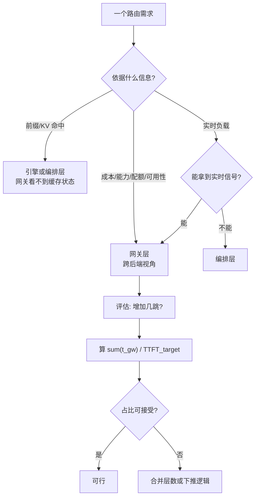

# 网关与多模型路由

> 位置：[InferenceAtlas](../../INDEX.md) > [模块 12](README.md) > 当前文档
> 信息截至：2026-08-10 ｜ 最后核验：2026-08-10 ｜ 内容版本：v0.1
> 时效性等级：中
> 相关主题：[开源推理生态全景](01_open_source_inference_ecosystem.md)｜[模型路由与级联](../03_serving_engines_and_scheduling/07_model_routing_and_cascade_systems.md)｜[多租户隔离与 QoS](../03_serving_engines_and_scheduling/06_multi_tenant_isolation_and_qos.md)

## 本章导读

网关是五层中**唯一不接触模型权重的一层**。
它处理的是**接口、身份、配额与去向**——
而这些恰恰是引擎层完全不管的事。

**本章的主线是一个容易被忽略的结论**：
**网关的时延预算与引擎的时延预算不在一个量级，因此它的性能要求应当被单独审视**。

以本次读到的一个具体宣称为例。LiteLLM 的 README 写道：

> **8ms P95 latency** at 1k RPS

**这个数字看起来很具体，但按 [模块 11 第 1 章](../11_benchmarking_reliability_and_observability/01_inference_benchmarking_methodology.md) 的口径要求，它仍不可复现**：
未给出硬件、部署形态、请求体大小、后端是否被 mock。
**因此本库标为 `待核实`**。

**但它引出的问题是真的**：
网关在关键路径上增加的时延，
相对于 [模块 01 第 2 章](../01_foundations_and_metrics/02_latency_throughput_and_slo.md) 的 TTFT 预算是什么量级？
**若 TTFT 目标是 500 ms，8 ms 占 1.6%——可以忽略**；
**若网关串了三层（认证、路由、限流各一跳），且每层 P99 是 P95 的数倍，情况就不同了**。
**这正是本章要给出的分析方法**。

**关于本章来源的说明**：
本章的事实性陈述**来自本次实际读取的仓库 README**（第 5 节列出路径）。
**该项目的官方文档站点 `docs.litellm.ai` 在当前环境不可达**
（详见 [AGENTS.md 第 11 节](../../AGENTS.md)），
**因此本章不涉及具体配置语法**。
**本章不引用其性能宣称与采用方名单**。

## 学习目标

读完本章后，读者应能够：

1. 说明网关层的职责边界，及其与引擎层、编排层的分工
2. 把网关时延放进 TTFT 预算中评估，并说明为什么要看 P99 而非 P95
3. 列出网关承担的四类跨切面职责，并判断它们能否下推到别处
4. 说明多提供方统一接口带来的语义差异风险
5. 判断路由策略应放在网关层还是引擎层

## 核心结论

- **网关是唯一不接触权重的一层**，其职责是接口、身份、配额与去向。
- **网关时延应放进 TTFT 预算按比例评估**，且**要看 P99 与串联层数**，而非单层 P95。
- **多层网关的时延是累加的，而尾部比中位数累加得更快**——串联三层的 P99 远不是单层 P99 的三倍那么直观。
- **「统一接口」掩盖语义差异**：不同提供方在采样参数、停止条件、token 计数上的行为未必一致。
- **路由策略的归属取决于它依赖什么信息**：依赖成本/能力的放网关，依赖前缀/KV 状态的**必须放引擎或编排层**。
- **网关是天然的计量点**，因此配额、计费与审计放在这里代价最低。

## 1. 问题定义、系统边界与工作负载

### 1.1 网关层的职责

据 LiteLLM 的 `README.md`（核验日期 2026-08-10），
它自述为「Open Source AI Gateway for 100+ LLMs」，
并把能力概括为
**统一 API、OpenAI 兼容、虚拟密钥、开销追踪、护栏、负载均衡与管理面板**。

**归纳为四类跨切面职责**：

| 职责 | 说明 | 能否下推到引擎层 |
|---|---|---|
| **接口统一** | 用一种格式调用多种后端 | 否（跨后端才有意义） |
| **身份与配额** | 虚拟密钥、限额 | 否（引擎不知道租户体系） |
| **计量与计费** | 开销追踪 | 否（需跨后端汇总） |
| **去向决策** | 路由、负载均衡、回退 | **部分可以**（见第 2.4 节） |

**前三行是网关层不可替代的理由**——
**它们都需要「跨后端」这个视角，而单个引擎实例没有这个视角**。

### 1.2 与前几层的分工

| 层 | 关心 |
|---|---|
| 引擎 | 一次请求怎么算得快 |
| 推理服务器 | 一台机器上服务哪些模型 |
| 编排 | 多少实例、放在哪 |
| **网关** | **谁能调、调什么、算谁的账、去哪** |

## 2. 原理、数学与性能模型

### 2.1 网关时延应当怎么评估

**单看网关自身的时延数字没有意义，要看它占 TTFT 预算的比例**：

$$\text{网关占比} = \frac{\sum_i t_{\text{gw},i}}{\text{TTFT}_{\text{target}}}$$

**算例（全部为演示设定的假设值）**：
设单层网关在其高分位上的耗时预算取 20 ms（**这是为演示设定的假设参数，不是测量结果**），
串联层数为 $n$：

| TTFT 目标 | $n=1$ | $n=2$ | $n=3$ |
|---:|---:|---:|---:|
| 200 ms | 10.0% | 20.0% | **30.0%** |
| 500 ms | 4.0% | 8.0% | 12.0% |
| 2000 ms | 1.0% | 2.0% | 3.0% |

**两条判断**：

1. **在长 TTFT 场景（长 prompt、大模型）中，网关时延通常可忽略**；
2. **在短 TTFT 场景中，串联多层网关会吃掉可观的预算**。

**因此「网关快不快」这个问题不能脱离 TTFT 目标回答**——
这与 [模块 08 第 1 章](../08_networking_and_interconnect/01_inference_networking_overview.md) 中
「网络够不够快不能脱离 SLO 回答」是同一条方法论。

### 2.2 为什么要看 P99 而不是 P95

**这一点在网关层特别重要，理由来自本库已有的分析**。

由 [模块 11 第 3 章](../11_benchmarking_reliability_and_observability/03_ttft_tpot_itl_and_end_to_end_latency.md)，
**用户感受由分布决定**；
而由 [模块 01 第 3 章](../01_foundations_and_metrics/03_queueing_theory_for_inference.md)，
排队时延随 $\rho/(1-\rho)$ 发散，
**因此尾部与中位数的比值随负载迅速扩大**。

**对串联的多层网关，一个请求要依次经过每一层**。
**若各层的慢事件相互独立**，则请求**至少碰上一次慢事件**的概率为

$$P_{\text{hit}} = 1 - (1-p)^{n}$$

**这与 [模块 08 第 1 章第 2.6 节](../08_networking_and_interconnect/01_inference_networking_overview.md) 的抖动放大是同一个式子**，
只是这里的 $n$ 是网关层数而非 $2L$。

| 单层慢事件率 $p$ | $n=2$ | $n=3$ | $n=5$ |
|---:|---:|---:|---:|
| 1% | 2.0% | 3.0% | 4.9% |
| 5% | 9.8% | 14.3% | 22.6% |

**因此报告网关性能时应给出 P99 与串联层数**，
**单层 P95 会系统性低估用户实际遇到的尾部**。

**这也是本章不采信「8ms P95 @ 1k RPS」这类宣称的第二个理由**——
**除了缺少可复现条件之外，P95 这个分位数本身对串联场景就不够**。

### 2.3 统一接口掩盖的语义差异

**「用 OpenAI 格式调用一切」是网关最大的卖点，也是最大的风险来源**。

**格式统一不等于语义统一**。可能不一致的地方：

| 维度 | 风险 |
|---|---|
| **采样参数** | 同名参数（temperature、top_p）在不同后端的实现未必等价 |
| **停止条件** | 停止序列的匹配规则与是否包含在输出中 |
| **token 计数** | **分词器不同，同一文本的 token 数不同** |
| 结构化输出 | 各后端的语法约束实现不同（[模块 05](../05_decoding_and_generation_algorithms/09_structured_output_and_grammar_constrained_decoding.md)） |
| 流式分块 | 每个事件携带的 token 数（见 [第 4 章](04_tgi.md) 第 2.2 节） |

**第三行的后果最实际**：
**token 计数不同意味着计费与配额在不同后端之间不可直接比较**，
**且上下文长度的余量也不同**。
**由 [模块 01 第 6 章](../01_foundations_and_metrics/06_cost_modeling_and_unit_economics.md)，
$/token 的口径必须一致才能比较**——
**而跨提供方时这个前提默认不成立**。

**因此网关的「无缝切换」应理解为「调用代码无需改」，
而不是「行为完全一致」**。
**切换提供方后必须重新验证输出质量与计费口径**。

### 2.4 路由策略该放哪一层

**这是本章最需要判断力的一处**。
**归属取决于路由决策依赖什么信息**：

| 路由依据 | 应放的层 | 理由 |
|---|---|---|
| 成本 / 模型能力 | **网关** | 跨后端信息，只有网关有 |
| 配额 / 租户优先级 | **网关** | 身份信息在网关 |
| 提供方可用性、故障回退 | **网关** | 跨后端视角 |
| **前缀 / KV 命中** | **引擎或编排层** | **网关不知道各实例的缓存状态** |
| 队列长度 / 实时负载 | 编排层或网关（需实时反馈） | 取决于能否拿到实时信号 |

**第四行是关键**：
由 [第 8 章第 2.2 节](08_ray_serve_kubernetes_kserve_and_triton.md)，
**前缀感知路由要求知道各实例缓存了什么**，
**而这是引擎内部状态，网关默认看不到**。
**因此把前缀路由放在网关层需要额外的状态同步，代价高**。

**[第 3 章](03_sglang.md) 的集群共享 L3 缓存给出了另一条路**：
**若缓存本身是集群共享的，路由就不必为命中率负责**——
**这再次说明「难题下推」往往比「在上层解决」更划算**。

### 2.5 级联路由与本库已有分析

**网关常被用来实现「先小模型、不行再大模型」的级联**。
**[模块 03 第 7 章](../03_serving_engines_and_scheduling/07_model_routing_and_cascade_systems.md) 与
[模块 10 第 8 章](../10_edge_and_on_device_inference/08_private_hybrid_cloud_edge_architectures.md) 已给出这类结构的定量分析**，
其中最重要的一条是：

> **事后检测的回退把两条路径的成本相加，而不是二选一**。
> 盈亏平衡条件是 $T_{\text{小}} < q\,T_{\text{大}}$，
> **比 $T_{\text{小}} < T_{\text{大}}$ 更严**。

**在网关上实现级联时这条完全适用**，
**且网关层还额外增加了每一跳的固定开销**（第 2.1 节）。
**因此网关级联的盈亏平衡比引擎内的级联更难满足**。

**图解读**：

1. **本图展示什么**：路由归属的判定，**入口是「依据什么信息」而不是「哪层方便」**。
   **信息在哪一层，决策就该在哪一层**——否则需要昂贵的状态同步。
2. **核心瓶颈**：判定点 B 的第二个分支。
   **前缀/KV 状态是引擎内部信息**，
   把依赖它的决策放到网关，要么拿不到、要么代价高。
3. **图中的 trade-off**：网关每多一层，功能更清晰但时延累加。
   **且尾部比中位数累加得快**（第 2.2 节），
   因此「拆成多个小网关」在架构上清晰、在时延上有代价。
4. **面试如何引用**：可以说
   「路由放哪一层取决于它依赖什么信息。
   成本和配额只有网关知道，**但前缀命中是引擎内部状态，网关看不到**。
   而且网关每多串一层，**时延是累加的，尾部累加得比中位数快**——
   我会把 $\sum t_{\text{gw}}$ 除以 TTFT 目标来判断能串几层」。

## 3. 实现机制与系统设计

### 3.1 网关作为计量点

**网关是系统中唯一能看到「所有请求、所有后端」的位置**，
**因此它是计量、计费与审计的天然落点**。

| 能力 | 为什么适合放网关 |
|---|---|
| 用量统计 | 跨后端汇总 |
| 配额与限流 | 需要租户视角 |
| 审计日志 | 统一入口便于合规 |
| 密钥管理 | 隔离后端凭据 |

**「隔离后端凭据」这一项有安全价值**：
**调用方持有网关签发的密钥而非后端的真实凭据**，
因此撤销与轮换的影响面被限制在网关内。
**相关的技术性约束见 [模块 11 第 10 章](../11_benchmarking_reliability_and_observability/10_safety_security_and_abuse_controls.md)**；
**本库不对合规问题作判断**。

### 3.2 与本库理论量的对应

| 网关层概念 | 本库理论量 | 出处 |
|---|---|---|
| 网关时延占比 | TTFT 预算分解 | [模块 01 第 2 章](../01_foundations_and_metrics/02_latency_throughput_and_slo.md) |
| 多层串联的尾部 | $1-(1-p)^n$ | [模块 08 第 1 章](../08_networking_and_interconnect/01_inference_networking_overview.md) |
| 级联回退 | $T_{\text{小}} < q T_{\text{大}}$ | [模块 10 第 8 章](../10_edge_and_on_device_inference/08_private_hybrid_cloud_edge_architectures.md) |
| 配额与优先级 | 多租户 QoS | [模块 03 第 6 章](../03_serving_engines_and_scheduling/06_multi_tenant_isolation_and_qos.md) |
| token 计数差异 | $/token 口径 | [模块 01 第 6 章](../01_foundations_and_metrics/06_cost_modeling_and_unit_economics.md) |

### 3.3 部署形态的选择

据 README，LiteLLM 提供两种用法：
**作为 Python SDK 直接集成**，或**部署为代理服务（AI Gateway）作为集中式服务**。

**两者的取舍可由第 2.1 节推出**：

| 形态 | 时延 | 集中式能力 |
|---|---|---|
| SDK 内嵌 | **无额外网络跳** | 配额与计量需各自实现 |
| 独立网关服务 | **多一跳** | **集中式配额、计量、审计** |

**选择取决于是否需要跨调用方的集中管控**：
**若只是想统一调用格式，SDK 形态没有时延代价**；
**若需要配额与计费，则必须有集中式的一跳**。

## 4. 性能、成本、能耗与可靠性 trade-off

### 4.1 主要取舍

| 选择 | 得到 | 付出 |
|---|---|---|
| 独立网关服务 | 集中管控 | **每请求一跳** |
| 拆成多个专职网关 | 职责清晰 | **时延与尾部累加**（第 2.2 节） |
| 网关内做级联 | 成本优化 | 盈亏平衡更难满足（第 2.5 节） |
| 统一接口 | 调用代码不变 | **语义差异被掩盖**（第 2.3 节） |
| 网关侧重试 | 提高成功率 | **可能放大后端过载** |

**最后一行值得展开**：
**网关重试在后端过载时会加剧过载**——
这与 [模块 08 第 10 章](../08_networking_and_interconnect/10_network_congestion_tail_latency_and_qos.md) 中
拥塞控制的道理一致。
**因此重试必须配退避与熔断**，
且 [模块 03 第 4 章](../03_serving_engines_and_scheduling/04_request_scheduling_and_admission_control.md) 的
准入控制与背压应当在后端侧同时存在。

### 4.2 成本

**网关本身的资源成本通常很小**（不接触权重），
**但它的策略决定了后端成本**：

| 策略 | 成本影响 |
|---|---|
| 路由到便宜/贵的后端 | **直接决定 $/token** |
| 级联 | 见第 2.5 节的盈亏平衡 |
| 配额 | 控制上限 |
| 缓存（若有） | 命中即省全部后端成本 |

**由 [模块 01 第 6 章](../01_foundations_and_metrics/06_cost_modeling_and_unit_economics.md)，
跨后端比较 $/token 必须先统一 token 计数口径**（第 2.3 节）。

### 4.3 可靠性

| 项 | 说明 |
|---|---|
| **单点风险** | 网关在关键路径上，**它挂了全部后端都不可达** |
| 故障回退 | 跨提供方回退是网关的核心价值之一 |
| 重试放大 | 见第 4.1 节 |
| 凭据集中 | 便于轮换，**但也是集中的风险点** |

**第一行是引入网关的主要代价**：
**它把一个跨后端的可用性优势与一个新的单点风险同时引入**。
**因此网关自身需要按 [模块 09 第 7 章](../09_datacenter_power_thermal_and_operations/07_reliability_redundancy_and_maintenance.md) 的冗余原则部署**。

## 5. benchmark、真实案例或公开部署案例

**本章不引用任何性能宣称与采用方名单**。

**具体地**：
README 中的「8ms P95 latency at 1k RPS」**未给出硬件、部署形态、请求体大小、
后端是否为 mock**，按 [模块 11 第 1 章](../11_benchmarking_reliability_and_observability/01_inference_benchmarking_methodology.md)
的口径要求**不构成可用结论**，标为 `待核实`；
其链接的 benchmarks 页面位于 `docs.litellm.ai`，**当前环境不可达**。

**README 中列出的采用方名单属于推广性陈述，本章未引用**。

### 5.1 本章的来源

**核验日期：2026-08-10**。核验方法见 [第 1 章第 3.3 节](01_open_source_inference_ecosystem.md)。

| 仓库 | 路径 | 用于本章 |
|---|---|---|
| `BerriAI/litellm` | `README.md` | 第 1.1、3.3 节 |

**披露标签：`开源代码/配置披露`**。
**本章的分析性结论多由本库前几模块推出，已逐处标注出处**。

### 5.2 读者应自行完成的测量

| 项 | 你的值 | 方法 |
|---|---|---|
| **网关单层 P99（非 P95）** | 待填 | 生产采样 |
| 串联的网关层数 $n$ | 待填 | 架构图 |
| **$\sum t_{\text{gw}}$ ÷ TTFT 目标** | 待填 | **第 2.1 节的核心判据** |
| 各后端对同一文本的 token 计数 | 待填 | **决定 $/token 是否可比** |
| 同名采样参数的行为差异 | 待填 | 固定 seed 对比输出 |
| 停止序列的行为差异 | 待填 | 构造测试用例 |
| 级联的 $q$ 与 $T_{\text{小}}/T_{\text{大}}$ | 待填 | [模块 10 第 8 章](../10_edge_and_on_device_inference/08_private_hybrid_cloud_edge_architectures.md) |
| 重试策略是否配退避与熔断 | 是/否 | 第 4.1 节 |
| 网关自身的冗余度 | 待填 | 单点风险 |

## 6. 设计决策框架

| 观察 | 结论 |
|---|---|
| 只需统一调用格式 | **SDK 形态即可**，无额外跳 |
| 需要配额与计费 | 必须集中式网关 |
| TTFT 目标短且串了多层 | **算占比**，考虑合并层 |
| 路由依赖前缀命中 | **不要放网关**，下推到引擎/编排 |
| 跨后端比成本 | **先统一 token 计数口径** |
| 网关做级联 | 用 $T_{\text{小}} < q T_{\text{大}}$ 检验 |
| 网关无冗余 | **单点风险**，按冗余原则部署 |

## 7. 常见失败模式与排查路径

| 症状 | 首先怀疑 | 检查 |
|---|---|---|
| TTFT 比引擎实测高不少 | **网关跳数** | $\sum t_{\text{gw}}$ |
| P99 差但 P95 正常 | **串联放大尾部** | $1-(1-p)^n$ |
| 切换后端后输出行为变了 | **语义差异** | 采样参数与停止条件 |
| 跨后端成本对不上 | **token 计数口径不同** | 同文本分词对比 |
| 后端过载时越来越糟 | **重试放大** | 退避与熔断 |
| 级联没省钱 | 盈亏平衡不满足 | 第 2.5 节 |
| 网关故障导致全面不可用 | 单点 | 冗余部署 |

## 8. 关联面试主题

- 级联路由的盈亏平衡 → [模块 17 案例走查](../17_interview_prep/09_mock_interview_cases.md)
- 多层串联的尾部放大 → [模块 17 调试与 benchmark 题](../17_interview_prep/07_debug_benchmark_and_reliability_questions.md)
- 多租户配额与优先级 → [模块 17 serving 与 SLO 题](../17_interview_prep/03_serving_scheduling_and_slo_questions.md)
- 路由决策的层次归属 → [模块 17 系统设计题](../17_interview_prep/01_inference_system_design.md)

## 9. 小结

**网关是五层中唯一不接触权重的一层**，
其不可替代的职责是**接口统一、身份与配额、计量计费**——
**三者都需要「跨后端」视角，而单个引擎实例没有这个视角**。

**四条实践结论**：

1. **网关时延要放进 TTFT 预算按比例评估**，
   且**必须看 P99 与串联层数**。
   多层串联时，请求至少碰上一次慢事件的概率是 $1-(1-p)^n$——
   **与 [模块 08](../08_networking_and_interconnect/01_inference_networking_overview.md) 的抖动放大是同一个式子**。
   **因此单层 P95 会系统性低估用户遇到的尾部**。
2. **「统一接口」掩盖语义差异**：
   采样参数、停止条件、**token 计数**在不同后端未必一致。
   **token 计数差异使跨后端的 $/token 不可直接比较**，
   因此「无缝切换」应理解为「调用代码不用改」，**而非「行为一致」**。
3. **路由归属取决于它依赖什么信息**：
   成本、配额、可用性只有网关知道；
   **但前缀/KV 命中是引擎内部状态，网关默认看不到**，
   把依赖它的决策放在网关需要昂贵的状态同步。
   **[第 3 章](03_sglang.md) 的集群共享缓存是另一条路——把难题下推到引擎层**。
4. **网关级联的盈亏平衡比引擎内级联更难满足**：
   除了 $T_{\text{小}} < q\,T_{\text{大}}$ 这个本就比 $T_{\text{小}} < T_{\text{大}}$ 更严的条件外，
   **网关还额外增加每跳的固定开销**。

**引入网关的主要代价是单点风险**：
它把跨后端的可用性优势与一个新的关键路径单点同时引入，
**因此网关自身必须按冗余原则部署**。

**最后是本章对一个具体宣称的处理**：
「8ms P95 at 1k RPS」**未给出硬件、部署形态、请求体大小与后端是否 mock**，
且其 benchmarks 页面不可达，
**故本库标为 `待核实`**——
**这不是质疑该数字，而是它不满足可复现的最低条件**。

## 关键术语

| 中文术语 | 英文 | 定义 | 单位/口径 | 关联文档 |
|---|---|---|---|---|
| 网关层 | AI gateway | 不接触权重，负责接口、身份、配额与去向 | — | 本章 1.1 |
| 网关时延占比 | gateway latency share | $\sum t_{\text{gw}}/\text{TTFT}_{\text{target}}$ | % | 本章 2.1 |
| 串联尾部放大 | serial tail amplification | $1-(1-p)^n$，$n$ 为串联层数 | — | 本章 2.2 |
| 语义差异 | semantic divergence | 接口统一但行为不一致（采样、停止、token 计数） | — | 本章 2.3 |
| 路由信息归属 | routing information locality | 决策应放在拥有其依据信息的那一层 | — | 本章 2.4 |

## 延伸阅读

- [开源推理生态全景](01_open_source_inference_ecosystem.md)
- [模型路由与级联系统](../03_serving_engines_and_scheduling/07_model_routing_and_cascade_systems.md)
- [多租户隔离、公平性与 QoS](../03_serving_engines_and_scheduling/06_multi_tenant_isolation_and_qos.md)
- [云-边混合与隐私优先架构](../10_edge_and_on_device_inference/08_private_hybrid_cloud_edge_architectures.md)
- [成本建模与单位经济学](../01_foundations_and_metrics/06_cost_modeling_and_unit_economics.md)
- [安全、滥用防护与租户隔离](../11_benchmarking_reliability_and_observability/10_safety_security_and_abuse_controls.md)

## 主要来源

本章的事实性陈述来自 **2026-08-10 实际读取的 `BerriAI/litellm` 的 `README.md`**；
**分析性结论多由本库前几模块推出，已逐处标注出处**。

**该项目的官方文档站点 `docs.litellm.ai` 在当前环境不可达**
（详见 [AGENTS.md 第 11 节](../../AGENTS.md)），
**因此本章不涉及具体配置语法**。

| 类别 | 说明 | 披露标签 |
|---|---|---|
| 自述定位与能力概括、两种部署形态 | `README.md` | `开源代码/配置披露` |
| 时延占比、串联尾部、路由归属、级联平衡 | 由本库前几模块推出 | 推出 |
| 「8ms P95 at 1k RPS」 | **缺可复现条件，且 benchmarks 页不可达** | `待核实` |
| 采用方名单 | **推广性陈述，未引用** | — |
| 具体配置语法与 API | **本章未给出** | `待核实` |

## 更新记录

| 日期 | 版本 | 变更 | 核验人 |
|---|---|---|---|
| 2026-08-10 | v0.1 | 初稿：网关的四类跨切面职责、时延占 TTFT 预算的评估与串联尾部放大、统一接口掩盖的语义差异（尤其 token 计数与计费口径）、路由归属由信息位置决定、网关级联的盈亏平衡、单点风险 | — |
