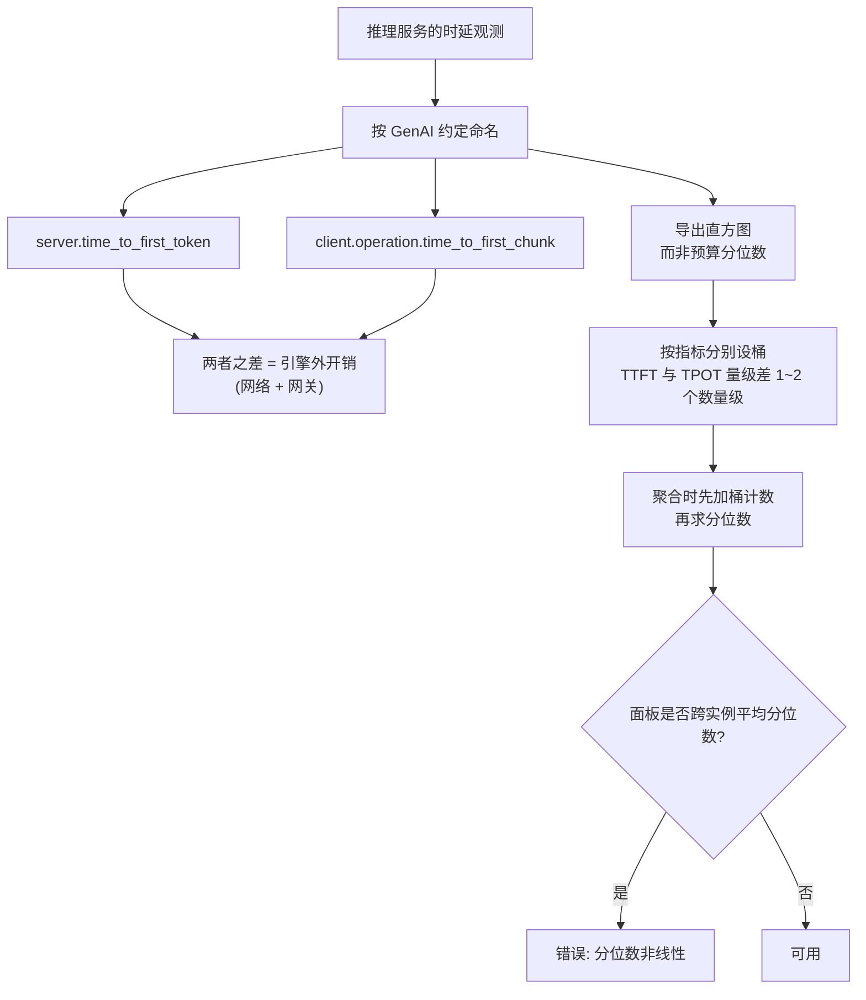

# 观测栈：Prometheus、Grafana 与 OpenTelemetry

> 位置：[InferenceAtlas](../../INDEX.md) > [模块 12](README.md) > 当前文档
> 信息截至：2026-08-10 ｜ 最后核验：2026-08-10 ｜ 内容版本：v0.1
> 时效性等级：中
> 相关主题：[开源推理生态全景](01_open_source_inference_ecosystem.md)｜[可观测性：指标、日志与追踪](../11_benchmarking_reliability_and_observability/07_observability_metrics_logs_traces.md)｜[TTFT/TPOT/ITL 与端到端时延](../11_benchmarking_reliability_and_observability/03_ttft_tpot_itl_and_end_to_end_latency.md)

## 本章导读

[模块 11 第 3 章](../11_benchmarking_reliability_and_observability/03_ttft_tpot_itl_and_end_to_end_latency.md) 反复强调
**时延指标的口径必须写清楚，尤其是「在哪一侧测的」**；
[第 4 章](04_tgi.md) 第 2.2 节又指出一个具体陷阱：
**SSE 事件可能携带多个 token，此时事件间隔不等于 ITL**。

**本章的核心发现是：这两条纪律已经被写进了一个开放标准**。

OpenTelemetry 的 GenAI 语义约定
（`open-telemetry/semantic-conventions-genai`，核验日期 2026-08-10）
定义了一组标准指标名，其中：

| 标准指标名 | 本库概念 | **注意用词** |
|---|---|---|
| `gen_ai.server.time_to_first_token` | TTFT（服务端） | token |
| `gen_ai.server.time_per_output_token` | TPOT（服务端） | token |
| `gen_ai.client.operation.time_to_first_chunk` | 首块到达（客户端） | **chunk** |
| `gen_ai.client.operation.time_per_output_chunk` | 每块间隔（客户端） | **chunk** |
| `gen_ai.server.request.duration` | 端到端（服务端） | — |
| `gen_ai.client.token.usage` | token 用量 | — |

**两点值得单独指出**：

1. **该约定在指标名里就区分了 server 与 client 侧**——
   **这正是 [模块 11](../11_benchmarking_reliability_and_observability/03_ttft_tpot_itl_and_end_to_end_latency.md) 要求写清楚的那个口径**；
2. **客户端侧用的是 `chunk` 而不是 `token`**。
   **这与 [第 4 章](04_tgi.md) 的警告是同一件事**：
   客户端看到的是流式分块，**一个块未必是一个 token**，
   **因此标准刻意不把客户端指标叫作 per_output_token**。

**一个把口径差异编进命名的标准，比任何文档提醒都更有效**。
本章因此以「如何让观测栈承载正确的口径」为主线。

**关于本章来源的说明**：
本章的指标名与语义**来自本次实际读取的仓库文件**（第 5 节列出路径）。
**Prometheus / Grafana / OpenTelemetry 的官方站点均不在可达白名单内**
（详见 [AGENTS.md 第 11 节](../../AGENTS.md)），
**因此本章不涉及具体的部署与配置语法**。

## 学习目标

读完本章后，读者应能够：

1. 说明观测栈三个组件的分工，以及推理场景对每一个的特殊要求
2. 使用 GenAI 语义约定的标准指标名，并解释 server/client 与 token/chunk 的区分
3. 说明为什么分位数必须在正确的层级聚合，以及错误聚合会造成什么
4. 设计一组覆盖 [模块 11](../11_benchmarking_reliability_and_observability/07_observability_metrics_logs_traces.md) 要求的推理指标
5. 判断一个观测问题应当由指标、日志还是追踪回答

## 核心结论

- **OpenTelemetry 的 GenAI 语义约定已给出标准指标名**，直接对应本库的 TTFT/TPOT 词汇。
- **该约定在命名上区分 server 与 client 侧，且客户端用 `chunk` 而非 `token`**——把口径差异编进了名字。
- **分位数不能跨实例平均**：这是推理观测中最常见的统计错误。
- **直方图必须按指标特性选桶**：TTFT 与 TPOT 的量级相差一到两个数量级，共用桶配置会使其中之一失去分辨率。
- **指标回答「有没有问题」，追踪回答「问题在哪个请求的哪一段」**——两者不可互相替代。
- **升级会改变指标名与语义**，这是 [第 1 章](01_open_source_inference_ecosystem.md) 所说「跟进成本」的一个具体形态。

## 1. 问题定义、系统边界与工作负载

### 1.1 三个组件的分工

| 组件 | 角色 | 推理场景的特殊要求 |
|---|---|---|
| **OpenTelemetry** | 采集与传输的**标准与 SDK** | **GenAI 语义约定**（第 2.1 节） |
| **Prometheus** | 指标的存储与查询 | 直方图桶配置（第 2.3 节） |
| **Grafana** | 展示与告警 | **不要在面板上跨实例平均分位数**（第 2.4 节） |

**三者不是替代关系**：
OTel 负责「以什么形式产生」，Prometheus 负责「存起来能查」，
Grafana 负责「看得见并触发告警」。

### 1.2 本章不做什么

| 不做 | 理由 |
|---|---|
| 部署与配置语法 | 官方文档不可达，不作猜测 |
| 各组件的性能对比 | 与推理系统的判断无关 |
| 完整的告警规则库 | 依赖具体 SLO |

## 2. 原理、数学与性能模型

### 2.1 GenAI 语义约定

据 `open-telemetry/semantic-conventions-genai` 的
`docs/gen-ai/gen-ai-metrics.md`（核验日期 2026-08-10），
定义的指标包括（本章只列与推理服务直接相关者）：

| 指标名 | 文档中的语义（转述） |
|---|---|
| `gen_ai.server.time_to_first_token` | 生成响应**第一个 token** 所花的时延 |
| `gen_ai.server.time_per_output_token` | **第一个 token 之后**每个生成 token 的时延 |
| `gen_ai.server.request.duration` | 服务端的请求耗时 |
| `gen_ai.client.operation.duration` | 客户端观测的操作耗时 |
| `gen_ai.client.operation.time_to_first_chunk` | 客户端观测的首**块**到达时间 |
| `gen_ai.client.operation.time_per_output_chunk` | 客户端观测的每**块**间隔 |
| `gen_ai.client.token.usage` | token 用量 |

**另有一组面向 agent 与工具调用的指标**
（`gen_ai.invoke_agent.*`、`gen_ai.execute_tool.duration`、
`gen_ai.invoke_workflow.*` 等），
**它们对 agent 类负载的观测有直接价值**，
本库对该类负载的分析见 [模块 01 第 1 章](../01_foundations_and_metrics/01_inference_workload_taxonomy.md)。

**关键属性**（用于打标签）包括
`gen_ai.operation.name`、`gen_ai.provider.name`、
`gen_ai.request.model`、`gen_ai.response.model`、`gen_ai.token.type`。

**`gen_ai.request.model` 与 `gen_ai.response.model` 分开**这一点有实际意义：
**在有路由或回退的系统中，请求的模型与实际服务的模型可能不同**
（见 [第 9 章](09_litellm_gateways_and_model_routing.md)）。
**分开记录使「实际用了哪个模型」可被审计与计费**。

### 2.2 server / client 与 token / chunk

**这是本章最值得记住的一点**。

| | 服务端指标 | 客户端指标 |
|---|---|---|
| 首字 | `..server.time_to_first_token` | `..client.operation.time_to_first_chunk` |
| 后续 | `..server.time_per_output_token` | `..client.operation.time_per_output_chunk` |
| 单位 | **token** | **chunk** |
| 包含 | 引擎内部 | **网络 + 网关 + 引擎**（见 [第 9 章](09_litellm_gateways_and_model_routing.md)） |

**两条推论**：

1. **服务端与客户端指标的差值，就是引擎之外的开销**——
   包括网络往返与网关跳数。
   **这给了 [第 9 章第 2.1 节](09_litellm_gateways_and_model_routing.md) 的
   「网关时延占比」一个可直接测量的实现方式**：
   $$\text{引擎外开销} \approx \text{client.time\_to\_first\_chunk} - \text{server.time\_to\_first\_token}$$
2. **客户端用 chunk 是因为一个流式块未必对应一个 token**。
   **因此把 `time_per_output_chunk` 直接当作 ITL 是错误的**，
   除非已确认每块恰好一个 token——
   **这正是 [第 4 章第 2.2 节](04_tgi.md) 给出的警告**。

**标准把这个区分编进了名字，因此照标准命名的系统不容易犯这个错**。
**反过来，若一个系统把客户端指标命名为 `..._per_token`，
就应当怀疑它是否核实过每块的 token 数**。

### 2.3 直方图桶的选择

**Prometheus 的分位数由直方图桶近似得到，因此桶的选择决定了分辨率**。

**推理场景的困难在于两类指标量级差异很大**：

| 指标 | 典型量级 |
|---|---|
| TTFT | 数百毫秒到数秒 |
| TPOT / ITL | **数十毫秒** |
| 端到端 | 秒到数十秒 |

**若三者共用一套桶配置，其中至少一个会失去分辨率**：
**为秒级设计的桶在几十毫秒处只有一两个边界，
此时 P99 的估计误差可以很大**。

**因此每类指标应当有各自的桶**，
且桶边界应覆盖该指标的实际分布范围——
**这需要先测一遍分布再定桶，而不是沿用默认值**。

**这与 [模块 11 第 3 章](../11_benchmarking_reliability_and_observability/03_ttft_tpot_itl_and_end_to_end_latency.md) 的
「分位数须与样本量、观测窗口一同给出」是配套的要求**：
**桶配置决定了分位数能否被准确估计，样本量决定了它是否稳定**。

### 2.4 分位数不能跨实例平均

**这是推理观测中最常见的统计错误**。

**若面板上把各实例的 P99 取平均，得到的既不是全局 P99，也不是任何有意义的量**。
理由：**分位数不是线性统计量**。

**举例说明**（**构造的假设情形，非测量数据**）：
两个实例各服务一半流量，
设两者的高分位取值恰好相同（记为 $x$），
**但两者的慢请求发生在不同时刻**——
**则全局的同一分位数未必等于 $x$**。
**原因是分位数按全体样本的排序定义，而不是各子集分位数的函数**。

**正确做法**：

| 做法 | 是否正确 |
|---|---|
| 各实例 P99 取平均 | **错误** |
| 各实例 P99 取最大 | 保守但不精确 |
| **把各实例的直方图桶计数相加，再求分位数** | **正确** |

**第三行是 Prometheus 直方图的设计意图**：
桶计数是可加的，因此可以先聚合桶、再算分位数。
**这也是为什么应当导出直方图而非预先算好的分位数**——
**预算好的分位数无法再聚合**。

**图解读**：

1. **本图展示什么**：从命名到聚合的完整链路，
   **其中三处都是容易出错且后果隐蔽的地方**：
   命名混淆口径、桶配置不当、聚合方式错误。
2. **核心瓶颈**：节点 F 是关键分叉。
   **一旦在实例侧就把分位数算好导出，后面的正确聚合就不可能了**——
   **信息在那一步已经丢失**。
3. **图中的 trade-off**：导出直方图比导出单个分位数占用更多存储与传输，
   换来的是**可聚合性**。
   **在多实例部署中这个取舍是必须的**。
4. **面试如何引用**：可以说
   「我会按 OTel 的 GenAI 语义约定命名，
   **它在名字里就区分了 server 和 client，而且客户端用的是 chunk 不是 token**——
   因为一个流式块未必是一个 token。
   聚合上我会导出直方图而不是预算好的分位数，
   **因为分位数不能跨实例平均，必须先加桶计数再求**」。

## 3. 实现机制与系统设计

### 3.1 一组最小可用的推理指标

**对照 [模块 11 第 7 章](../11_benchmarking_reliability_and_observability/07_observability_metrics_logs_traces.md) 的要求**，
并采用 GenAI 约定的命名：

| 指标 | 用途 | 对应本库的判据 |
|---|---|---|
| `gen_ai.server.time_to_first_token` | TTFT 分布 | SLO（[模块 01 第 2 章](../01_foundations_and_metrics/02_latency_throughput_and_slo.md)） |
| `gen_ai.server.time_per_output_token` | TPOT 分布 | 同上 |
| `gen_ai.client.operation.time_to_first_chunk` | 用户实际感受 | 与服务端之差 = 引擎外开销 |
| `gen_ai.client.token.usage` | 用量与计费 | [模块 01 第 6 章](../01_foundations_and_metrics/06_cost_modeling_and_unit_economics.md) |
| 队列长度 / 等待时间 | **扩缩容信号** | [第 8 章第 2.3 节](08_ray_serve_kubernetes_kserve_and_triton.md) |
| 抢占 / retract 计数 | 容量不足的证据 | [第 2](02_vllm.md)、[3 章](03_sglang.md) |
| 前缀缓存命中率 | 缓存收益 | [模块 03 第 8 章](../03_serving_engines_and_scheduling/08_prompt_caching_and_prefix_caching.md) |
| KV 占用 / $C_{\max}$ 逼近度 | 容量水位 | [模块 07 第 5 章](../07_hardware_and_server_architecture/05_memory_capacity_bandwidth_and_kv_cache.md) |

**注意后四行不在 GenAI 约定中**——
**它们是引擎内部指标，由各引擎自行命名**
（[第 2 章](02_vllm.md) 提到 vLLM 通过 Prometheus 暴露抢占计数）。
**因此实际的观测栈是「标准指标 + 引擎特有指标」的混合**，
**而后者会随引擎升级改名**（第 4.2 节）。

### 3.2 指标、日志与追踪的分工

| 问题 | 应由谁回答 |
|---|---|
| 「现在有没有问题」 | **指标** |
| 「哪些请求受影响」 | **追踪** |
| 「这个请求为什么慢」 | **追踪 + 日志** |
| 「是网络还是某台机器」 | **追踪**（[模块 08 第 11 章](../08_networking_and_interconnect/11_network_observability_and_debugging.md)） |
| 「趋势如何」 | 指标 |

**[模块 08 第 11 章](../08_networking_and_interconnect/11_network_observability_and_debugging.md) 的归因方法在这里有直接应用**：
该章指出**区分「网络慢」与「单点掉队」需要逐 rank 的等待时长**，
**而这类信息属于追踪而非指标**——
**指标的聚合天然抹掉了「是哪一个」这个维度**。

### 3.3 采样策略

由 [模块 08 第 11 章第 3.4 节](../08_networking_and_interconnect/11_network_observability_and_debugging.md)，
**触发式采样（只详记超阈值的事件）通常是开销与可见性的最佳平衡**。

**在推理场景中的具体化**：

| 策略 | 适用 |
|---|---|
| 指标：常开、全量 | 开销低，且需要完整分布 |
| 追踪：**尾部采样** | **只保留慢请求的完整链路** |
| 日志：按级别 + 关联 trace id | 便于从追踪跳到日志 |

**「尾部采样」在这里尤其合适**，
因为由 [模块 11 第 3 章](../11_benchmarking_reliability_and_observability/03_ttft_tpot_itl_and_end_to_end_latency.md)，
**问题主要在尾部，而尾部事件本来就少**。

## 4. 性能、成本、能耗与可靠性 trade-off

### 4.1 观测的开销

| 项 | 开销来源 |
|---|---|
| 指标 | 基数（label 组合数）× 采集频率 |
| 直方图 | 桶数 × 序列数 |
| 追踪 | 采样率 × 每 span 的数据量 |

**「基数爆炸」是最常见的成本失控来源**：
**把请求 id、用户 id 之类的高基数字段放进 label，会使序列数急剧膨胀**。
**GenAI 约定的属性（模型名、提供方、操作名）都是低基数的**，
**这是它可以安全用作 label 的原因**。

### 4.2 升级与指标兼容

**由 [第 1 章第 4.1 节](01_open_source_inference_ecosystem.md) 的「跟进成本」**：
**引擎特有指标的名称与语义会随版本变化**，
而告警规则与面板建立在这些名字上。

| 缓解手段 | 说明 |
|---|---|
| 优先使用标准命名 | GenAI 约定的指标更稳定 |
| 在采集侧做名称映射 | 把引擎特有名映射到内部稳定名 |
| **升级前检查指标清单** | 列入升级检查项 |

**第二行是实践中最有效的一条**：
**在 collector 侧做一层重命名，可以把上游改名的影响限制在一个地方**。

### 4.3 可靠性

| 项 | 说明 |
|---|---|
| 观测系统自身的可用性 | **它挂了不影响服务，但会致盲** |
| 采集对被测系统的扰动 | 见 [模块 08 第 11 章第 4.1 节](../08_networking_and_interconnect/11_network_observability_and_debugging.md) |
| 告警的误报与漏报 | 由桶配置与聚合方式共同决定 |

## 5. benchmark、真实案例或公开部署案例

**本章不给出任何部署配置或性能数字**。

**Prometheus / Grafana / OpenTelemetry 的官方站点均不在当前可达白名单内**
（详见 [AGENTS.md 第 11 节](../../AGENTS.md)），
**因此本章的指标名与语义来自其规范仓库的 Markdown 源文件，
而部署与配置语法本章不作猜测**。

### 5.1 本章的来源

**核验日期：2026-08-10**。核验方法见 [第 1 章第 3.3 节](01_open_source_inference_ecosystem.md)。

| 仓库 | 路径 | 用于本章 |
|---|---|---|
| `open-telemetry/semantic-conventions-genai` | `docs/gen-ai/gen-ai-metrics.md` | 第 2.1、2.2、3.1 节的指标名与语义 |
| `open-telemetry/semantic-conventions` | `docs/gen-ai/README.md` | 确认 GenAI 约定已迁出至独立仓库 |

**一条应当记录的事实**：
**GenAI 语义约定已从 `semantic-conventions` 迁移到 `semantic-conventions-genai` 仓库**，
原路径下仅保留一个指向新仓库的说明。
**按旧路径查找会得到一个已不再维护的页面**。

**披露标签：`开源代码/配置披露`**。

### 5.2 读者应自行完成的工作

| 项 | 你的值 | 方法 |
|---|---|---|
| 当前指标是否采用标准命名 | 是/否 | 对照第 2.1 节 |
| **服务端与客户端指标之差** | 待填 | **即引擎外开销** |
| **每个流式块的 token 数** | 待填 | **决定 chunk 指标能否当 token 用** |
| TTFT / TPOT / 端到端的实际分布 | 待填 | **用于定桶** |
| 各指标的桶配置是否分别设定 | 是/否 | 第 2.3 节 |
| **面板是否跨实例平均分位数** | 是/否 | **若是则为错误** |
| 导出的是直方图还是预算分位数 | 待填 | 后者不可聚合 |
| label 基数 | 待填 | 成本失控的主因 |
| 引擎特有指标清单 | 待填 | 升级检查项 |

## 6. 设计决策框架

| 观察 | 结论 |
|---|---|
| 新建观测栈 | **优先采用 GenAI 语义约定命名** |
| 客户端指标名含 `per_token` | **核实每块 token 数**，否则应改为 chunk |
| 只导出分位数 | **改为导出直方图**，否则无法正确聚合 |
| TTFT 与 TPOT 共用桶 | **分开设桶** |
| 面板跨实例平均 P99 | **改为先聚合桶再求分位数** |
| 需要「是哪一个」 | **用追踪**，指标回答不了 |
| 升级频繁 | 在 collector 侧做名称映射 |

## 7. 常见失败模式与排查路径

| 症状 | 首先怀疑 | 检查 |
|---|---|---|
| P99 面板与用户反馈对不上 | **跨实例平均分位数** | 聚合方式 |
| TPOT 的 P99 看起来很整齐 | **桶分辨率不足** | 桶边界 vs 实际分布 |
| 客户端与服务端指标差很多 | 引擎外开销（网络+网关） | [第 9 章](09_litellm_gateways_and_model_routing.md) |
| ITL 异常小 | **一块含多 token** | 每块 token 数 |
| 监控成本失控 | **label 基数爆炸** | 高基数字段 |
| 升级后面板空白 | 指标改名 | 第 4.2 节 |
| 按旧路径找不到 GenAI 约定 | **已迁到独立仓库** | 第 5.1 节 |

## 8. 关联面试主题

- 分位数的聚合与桶配置 → [模块 17 调试与 benchmark 题](../17_interview_prep/07_debug_benchmark_and_reliability_questions.md)
- server/client 口径与 SLO → [模块 17 serving 与 SLO 题](../17_interview_prep/03_serving_scheduling_and_slo_questions.md)
- 指标与追踪的分工 → [模块 17 系统设计题](../17_interview_prep/01_inference_system_design.md)

## 9. 小结

**本章最有价值的发现是：本库反复强调的口径纪律已经被写进了一个开放标准**。

OpenTelemetry 的 GenAI 语义约定给出了
`gen_ai.server.time_to_first_token`、`gen_ai.server.time_per_output_token` 等标准名，
**并在命名上做了两处关键区分**：

1. **server 与 client 分开**——
   这正是 [模块 11](../11_benchmarking_reliability_and_observability/03_ttft_tpot_itl_and_end_to_end_latency.md) 要求写清的口径；
   **两者之差就是引擎外开销**，为 [第 9 章](09_litellm_gateways_and_model_routing.md) 的
   「网关时延占比」提供了直接的测量方式。
2. **客户端用 `chunk` 而非 `token`**——
   因为一个流式块未必是一个 token。
   **这与 [第 4 章](04_tgi.md) 给出的警告完全一致**，
   而标准把它编进了名字，**因此照标准命名的系统不容易犯这个错**。

**三条实现纪律**：

- **导出直方图而非预算好的分位数**：
  **分位数不能跨实例平均**（它不是线性统计量），
  正确做法是**先把各实例的桶计数相加，再求分位数**——
  而一旦在实例侧算好分位数，这个信息就永久丢失了。
- **按指标分别设桶**：TTFT 与 TPOT 的量级相差一到两个数量级，
  **共用桶会使其中之一失去分辨率**，P99 的估计随之失真。
- **指标回答「有没有问题」，追踪回答「是哪一个」**——
  **指标的聚合天然抹掉了后者这个维度**
  （[模块 08 第 11 章](../08_networking_and_interconnect/11_network_observability_and_debugging.md) 的归因需要追踪）。

**两条成本与维护提示**：
**label 基数是监控成本失控的主因**，
而 GenAI 约定的属性都是低基数的，这是它们可安全作 label 的原因；
**引擎特有指标会随版本改名**，
在 collector 侧做一层名称映射可以把影响限制在一处。

**最后记录一个易踩的事实**：
**GenAI 语义约定已从 `semantic-conventions` 迁出到 `semantic-conventions-genai`**，
按旧路径查找会得到一个不再维护的页面。

## 关键术语

| 中文术语 | 英文 | 定义 | 单位/口径 | 关联文档 |
|---|---|---|---|---|
| GenAI 语义约定 | GenAI semantic conventions | OTel 为生成式 AI 定义的标准指标与属性命名 | — | 本章 2.1 |
| server/client 口径 | server- vs client-side | 指标在引擎侧还是调用方侧测量；**两者之差为引擎外开销** | — | 本章 2.2 |
| 块与 token | chunk vs token | 流式块未必对应一个 token；**标准在命名上区分二者** | — | 本章 2.2 |
| 桶分辨率 | bucket resolution | 直方图桶边界对分位数估计精度的决定作用 | — | 本章 2.3 |
| 分位数不可平均 | percentiles are not averageable | 分位数非线性；**须先聚合桶计数再求** | — | 本章 2.4 |
| 基数爆炸 | cardinality explosion | 高基数 label 导致序列数急剧膨胀 | 序列数 | 本章 4.1 |

## 延伸阅读

- [开源推理生态全景](01_open_source_inference_ecosystem.md)
- [可观测性：指标、日志与追踪](../11_benchmarking_reliability_and_observability/07_observability_metrics_logs_traces.md)
- [TTFT/TPOT/ITL 与端到端时延](../11_benchmarking_reliability_and_observability/03_ttft_tpot_itl_and_end_to_end_latency.md)
- [网络可观测性与排查](../08_networking_and_interconnect/11_network_observability_and_debugging.md)
- [网关与多模型路由](09_litellm_gateways_and_model_routing.md)

## 主要来源

本章的指标名与语义来自 **2026-08-10 实际读取的 OpenTelemetry 规范仓库文件**，路径见第 5.1 节。

**Prometheus / Grafana / OpenTelemetry 的官方站点均不在可达白名单内**
（详见 [AGENTS.md 第 11 节](../../AGENTS.md)），
**因此本章不涉及部署与配置语法**。

| 类别 | 说明 | 披露标签 |
|---|---|---|
| GenAI 指标名、语义与属性 | `semantic-conventions-genai` 的 `docs/gen-ai/gen-ai-metrics.md` | `开源代码/配置披露` |
| 约定已迁仓这一事实 | `semantic-conventions` 的 `docs/gen-ai/README.md` | `开源代码/配置披露` |
| 分位数聚合、桶配置、采样策略 | 由统计性质与本库前几模块推出 | 推出 |
| 部署与配置语法 | **本章未给出** | `待核实` |

## 更新记录

| 日期 | 版本 | 变更 | 核验人 |
|---|---|---|---|
| 2026-08-10 | v0.1 | 初稿：GenAI 语义约定的标准指标名、server/client 与 token/chunk 的命名区分及其与本库口径纪律的对应、直方图桶与分位数聚合的正确做法、指标与追踪的分工、基数与升级维护 | — |
