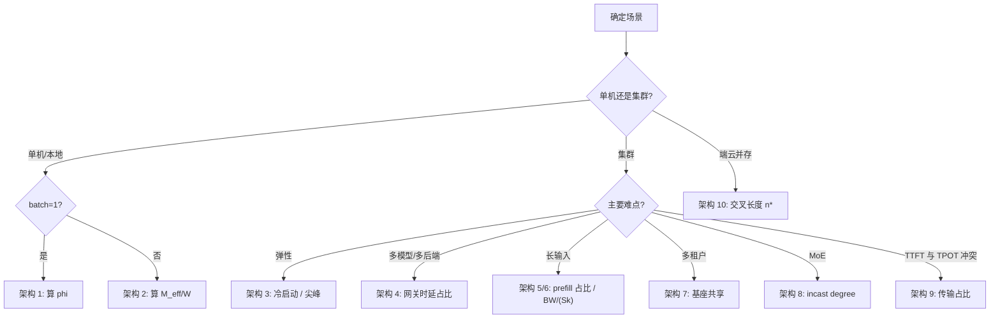

# 十个参考架构

> 位置：[InferenceAtlas](../../INDEX.md) > [模块 12](README.md) > 当前文档
> 信息截至：2026-08-10 ｜ 最后核验：2026-08-10 ｜ 内容版本：v0.1
> 时效性等级：低（结构与判据部分）
> 相关主题：[开源推理生态全景](01_open_source_inference_ecosystem.md)｜[硬件选型框架](../07_hardware_and_server_architecture/13_hardware_selection_framework.md)｜[复现实验手册](12_reproduction_playbooks.md)

## 本章导读

本章给出十个教学性参考架构。
**每一个都不是「组件连线图」，而是一组「这个架构的成败取决于哪个数」**。

**本章的组织方式**：每个架构给出四项——

| 项 | 说明 |
|---|---|
| **层次组成** | 按 [第 1 章](01_open_source_inference_ecosystem.md) 的五层 |
| **决定性约束** | 该架构最先撞上的那个上界 |
| **判据** | 本库中可直接套用的那个公式 |
| **最易踩的坑** | 该架构特有的失败模式 |

**「决定性约束」这一项是本章的重点**。
十个架构中，**没有一个的决定性约束是「引擎选得对不对」**——
它们分别落在显存比、冷启动、前缀共享率、通信占比、KV 容量等处。
**这与 [第 1 章](01_open_source_inference_ecosystem.md) 的主论点一致：
选型不是比较项目，而是找出自己的紧约束**。

**关于本章的性质**：
**本章不含任何产品规格或性能数字**，
所有判据均来自本库前 11 个模块的推导，出处逐条标注。
架构中提到的项目仅用于说明层次归属，**不构成推荐**。

## 学习目标

读完本章后，读者应能够：

1. 对给定场景选出最接近的参考架构，并说出它的决定性约束
2. 用本库的判据在纸上判断一个架构是否可行
3. 说明为什么十个架构的决定性约束各不相同
4. 识别每个架构特有的失败模式
5. 由参考架构推导出需要实测的量（对应 [第 12 章](12_reproduction_playbooks.md)）

## 核心结论

- **十个架构的决定性约束各不相同**，且**没有一个是「引擎选型」**。
- **单机类架构的约束在显存**：$M_{\text{eff}}/W$ 与 $\varphi$（驻留比例）。
- **集群类架构的约束在通信与弹性**：通信占 TPOT 的比例、冷启动 ÷ 尖峰时长。
- **缓存类架构的约束在负载性质**：前缀共享率是负载属性而非配置项。
- **分离类架构（PD、云边）的约束在传输**，且**上游优化会放大传输占比**。
- **每个架构都可以在纸上被否决**——这是本章最实用的性质。

## 1. 问题定义、系统边界与工作负载

### 1.1 十个架构一览

| # | 架构 | 决定性约束 | 判据出处 |
|---:|---|---|---|
| 1 | 单卡本地 LLM | **驻留比例 $\varphi$** | [第 7 章](07_llama_cpp_mlx_ollama_and_local_serving.md) |
| 2 | 单节点多卡 serving | **$M_{\text{eff}}/W$ 与通信占比** | [模块 07 第 13 章](../07_hardware_and_server_architecture/13_hardware_selection_framework.md) |
| 3 | Kubernetes 服务 | **冷启动 ÷ 尖峰时长** | [第 8 章](08_ray_serve_kubernetes_kserve_and_triton.md) |
| 4 | 多模型路由网关 | **网关时延占 TTFT 比例** | [第 9 章](09_litellm_gateways_and_model_routing.md) |
| 5 | RAG serving | **prefill 占比与前缀共享率** | [模块 03 第 8 章](../03_serving_engines_and_scheduling/08_prompt_caching_and_prefix_caching.md) |
| 6 | 长上下文服务 | **饱和上限 $\text{BW}/(Sk)$** | [模块 07 第 5 章](../07_hardware_and_server_architecture/05_memory_capacity_bandwidth_and_kv_cache.md) |
| 7 | 多租户 LoRA | **适配器切换与显存分摊** | [模块 03 第 6 章](../03_serving_engines_and_scheduling/06_multi_tenant_isolation_and_qos.md) |
| 8 | MoE serving | **all-to-all 的 incast** | [模块 08 第 10 章](../08_networking_and_interconnect/10_network_congestion_tail_latency_and_qos.md) |
| 9 | PD 分离 | **传输占 TTFT 比例** | [模块 06 第 7 章](../06_distributed_and_moe_inference/07_prefill_decode_disaggregation.md) |
| 10 | 云边混合 | **交叉输出长度 $n^{*}$** | [模块 10 第 8 章](../10_edge_and_on_device_inference/08_private_hybrid_cloud_edge_architectures.md) |

**这张表本身就是本章的主要产出**：
**它把「我该用什么架构」翻译成「我该先算哪个数」**。

## 2. 原理、数学与性能模型

### 2.1 架构一：单卡本地 LLM

| 项 | 内容 |
|---|---|
| **层次组成** | 引擎（本地）+ 可选分发层 |
| **决定性约束** | **驻留比例 $\varphi = M_{\text{GPU}}/(N b_w)$** |
| **判据** | 两段模型（[第 7 章第 2.1 节](07_llama_cpp_mlx_ollama_and_local_serving.md)）：$t = \varphi W/\text{BW}_g + (1-\varphi)W/\text{BW}_c$ |
| **最易踩的坑** | 只把一小部分权重放主机就损失大半吞吐（带宽比 16 倍时 $\varphi=0.9$ 已使主机段占 64%） |

**设计动作**：**降位宽直到 $\varphi = 1$，再检查质量断点**。
**统一内存架构下本条不适用**，改看总容量与共享带宽。

### 2.2 架构二：单节点多卡 serving

| 项 | 内容 |
|---|---|
| **层次组成** | 引擎（TP 并行）+ 服务端点 |
| **决定性约束** | **$M_{\text{eff}}/W$**，其次是域内通信占比 |
| **判据** | $1 - W/M_{\text{eff}}$（[模块 07 第 5 章](../07_hardware_and_server_architecture/05_memory_capacity_bandwidth_and_kv_cache.md)）；$T_{\text{comm}}=2L\,T_{\text{AR}}$（[模块 08 第 1 章](../08_networking_and_interconnect/01_inference_networking_overview.md)） |
| **最易踩的坑** | **$M_{\text{eff}}/W < 2$ 时批处理收益不足一半**，此时调任何参数都收效有限 |

**设计动作**：按 [模块 07 第 13 章](../07_hardware_and_server_architecture/13_hardware_selection_framework.md) 的流程——
**先定量化，再算 $M_{\text{eff}}/W$，再把通信从 TPOT 预算里扣掉算 $B_{\text{SLO}}$**。

### 2.3 架构三：Kubernetes 服务

| 项 | 内容 |
|---|---|
| **层次组成** | 引擎 + 编排（含组调度）+ 观测 |
| **决定性约束** | **冷启动 ÷ 尖峰时长** |
| **判据** | $t_{\text{冷启动}} \approx W/\text{BW}_{\text{存储}} + t_{\text{编译}}$（[模块 07 第 6 章](../07_hardware_and_server_architecture/06_gpu_server_node_architecture.md)） |
| **最易踩的坑** | **用 CPU/GPU 利用率做扩缩容信号**（[第 8 章第 2.3 节](08_ray_serve_kubernetes_kserve_and_triton.md)） |

**设计动作**：
**扩缩容信号改用队列长度**；
**并行组必须用组调度**；
**若冷启动与尖峰同量级，只能上预热池**。

### 2.4 架构四：多模型路由网关

| 项 | 内容 |
|---|---|
| **层次组成** | 网关 + 多个后端（可跨提供方） |
| **决定性约束** | **$\sum t_{\text{gw}} / \text{TTFT}_{\text{target}}$** |
| **判据** | 串联尾部 $1-(1-p)^n$（[第 9 章第 2.2 节](09_litellm_gateways_and_model_routing.md)） |
| **最易踩的坑** | **跨后端 token 计数口径不同**，使 $/token 不可比 |

**设计动作**：
**先统一 token 计数口径再比成本**；
**路由若依赖前缀命中，则下推到引擎/编排层**。

### 2.5 架构五：RAG serving

| 项 | 内容 |
|---|---|
| **层次组成** | 检索 + 引擎 + 网关 |
| **决定性约束** | **prefill 占比**（检索结果拼进 prompt 使输入变长） |
| **判据** | prefill 与 decode 的时间构成（[模块 02 第 2 章](../02_transformer_and_kv_cache/02_prefill_vs_decode.md)）；前缀命中率（[模块 03 第 8 章](../03_serving_engines_and_scheduling/08_prompt_caching_and_prefix_caching.md)） |
| **最易踩的坑** | **检索结果放在 prompt 前部会破坏前缀共享** |

**这一条值得展开**：
前缀缓存按**从头开始的最长公共前缀**匹配。
**若把每次都不同的检索结果拼在 system prompt 之前，则共享前缀长度归零**，
**缓存完全失效**。
**把固定部分放前、可变部分放后，是 RAG 架构中一个几乎零成本的优化**。

### 2.6 架构六：长上下文服务

| 项 | 内容 |
|---|---|
| **层次组成** | 引擎（大 KV 预算）+ 可选 KV 分层 |
| **决定性约束** | **饱和吞吐上限 $\text{BW}/(Sk)$** |
| **判据** | $B_{\text{half}} = W/(Sk)$ 与 $C_{\max}=(M_{\text{eff}}-W)/(Sk)$（[模块 07 第 5 章](../07_hardware_and_server_architecture/05_memory_capacity_bandwidth_and_kv_cache.md)） |
| **最易踩的坑** | **$S$ 增大使 $B_{\text{half}}$ 迅速下降**，加批的边际收益很快耗尽 |

**由 [模块 07 第 5 章](../07_hardware_and_server_architecture/05_memory_capacity_bandwidth_and_kv_cache.md) 的算例**，
$S$ 从 2048 增到 32768 时 $B_{\text{half}}$ 从约 209 降到约 13。
**因此长上下文场景的首要手段是降 $k$（GQA/MLA/KV 量化）而非加批**。

### 2.7 架构七：多租户 LoRA 适配器服务

| 项 | 内容 |
|---|---|
| **层次组成** | 引擎（多 LoRA）+ 网关（租户识别）+ 编排 |
| **决定性约束** | **适配器数量与显存分摊**；其次是租户间的 QoS 隔离 |
| **判据** | 有效容量比（基座共享，适配器额外占用）；QoS 分层（[模块 03 第 6 章](../03_serving_engines_and_scheduling/06_multi_tenant_isolation_and_qos.md)） |
| **最易踩的坑** | **把租户隔离寄望于引擎**——引擎不知道租户体系（[第 9 章第 1.1 节](09_litellm_gateways_and_model_routing.md)） |

**这个架构的价值来自基座共享**：
多个适配器复用同一份基座权重，
**因此 $W$ 只付一次**，边际成本是适配器本身。
**由 [模块 07 第 5 章](../07_hardware_and_server_architecture/05_memory_capacity_bandwidth_and_kv_cache.md)，
这直接改善 $M_{\text{eff}}/W$**——
**这是本架构成立的定量理由**。

### 2.8 架构八：MoE serving

| 项 | 内容 |
|---|---|
| **层次组成** | 引擎（EP 并行）+ 高二分带宽网络 |
| **决定性约束** | **all-to-all 的 incast degree $P-1$** |
| **判据** | 突发量 $(P-1)s_{\text{msg}}$ vs 交换机缓冲（[模块 08 第 10 章第 2.2 节](../08_networking_and_interconnect/10_network_congestion_tail_latency_and_qos.md)） |
| **最易踩的坑** | **平均带宽不高但 P99 很差且无规律**——这是 incast 的特征 |

**由 [模块 08 第 12 章](../08_networking_and_interconnect/12_inference_network_case_studies.md) 案例三**，
**MoE 的专家并行度存在一个由交换机缓冲决定的上界**，
**它与算力、显存都无关**，且通常不在容量核算中。

**另一条**：由 [模块 08 第 5 章](../08_networking_and_interconnect/05_collectives_rdma_and_communication_libraries.md)，
all-to-all 的消息比 all-reduce 小 $P$ 倍，
**因此它更深地落在时延主导区**——**加带宽对它的帮助比对 TP 更小**。

### 2.9 架构九：prefill/decode 分离

| 项 | 内容 |
|---|---|
| **层次组成** | 两组引擎实例 + 传输引擎 + 编排（组调度） |
| **决定性约束** | **KV 传输占 TTFT 的比例** |
| **判据** | $\frac{T_{\text{transfer}}}{T_{\text{prefill}}} = \frac{m_{\text{tok}}}{2P_{\text{model}}}\cdot\frac{\text{FLOPS}}{\text{BW}}$（[模块 06 第 7 章](../06_distributed_and_moe_inference/07_prefill_decode_disaggregation.md)） |
| **最易踩的坑** | **前缀缓存命中率提高会放大传输占比** |

**最后一条是 PD 架构中最反直觉的一点**：
**命中率提高使 prefill 变短，而传输量不变，因此传输在 TTFT 中的占比上升**。
**把它误判为「缓存导致变慢」是常见的归因错误**
（[模块 08 第 1 章第 7 节](../08_networking_and_interconnect/01_inference_networking_overview.md) 亦列出此项）。

**由 [第 3 章](03_sglang.md)**，
**HiCache 与 PD 分离组合时这个效应会更明显**，
因为前者正是用来提高命中率的。

### 2.10 架构十：云边混合服务

| 项 | 内容 |
|---|---|
| **层次组成** | 端侧引擎 + 云端引擎 + 路由 |
| **决定性约束** | **交叉输出长度 $n^{*}$** |
| **判据** | $n^{*} = \frac{\text{RTT}+\text{TTFT}_c-\text{TTFT}_l}{1/r_l - 1/r_c}$（[模块 10 第 9 章](../10_edge_and_on_device_inference/09_edge_deployment_case_studies.md)） |
| **最易踩的坑** | **事后回退把两条路径的成本相加** |

**由 [模块 10 第 9 章](../10_edge_and_on_device_inference/09_edge_deployment_case_studies.md) 案例五**，
事后回退的盈亏平衡是 $T_l < q\,T_c$，
**比 $T_l < T_c$ 更严**——
**因此回退救不了一个本身就慢的本地路径**。

**且本地占优的区间是「短输出 + 高 RTT」**，
$n^{*}$ 随 RTT 线性增长。

**图解读**：

1. **本图展示什么**：从场景到「该先算哪个数」的映射。
   **每个终点都是一个公式而不是一个产品名**——
   这是本章与通常「参考架构图」的根本区别。
2. **核心瓶颈**：判定点 F 处的分支彼此不重叠，
   **因为它们对应的紧约束落在不同的物理量上**（显存、时间、缓冲、带宽）。
   **选错分支意味着优化了一个不紧的约束**。
3. **图中的 trade-off**：每个架构都在增加某种复杂度以换取某种能力——
   **而复杂度的代价往往落在可运维性与故障域上**，
   这在第 4 节汇总。
4. **面试如何引用**：可以说
   「我不会先选架构，我会先问哪个约束最紧。
   **单机看 $M_{\text{eff}}/W$，集群弹性看冷启动比尖峰，
   长上下文看 $\text{BW}/(Sk)$，MoE 看 incast degree**——
   **架构是这些判断的结果，不是起点**」。

## 3. 实现机制与系统设计

### 3.1 组合与叠加

**十个架构不是互斥的**，实际系统常是若干个的叠加：

| 组合 | 需要同时满足 |
|---|---|
| 长上下文 + PD 分离 | $\text{BW}/(Sk)$ **且** 传输占比 |
| MoE + 多租户 | incast **且** QoS 隔离 |
| RAG + 云边混合 | 前缀布局 **且** $n^{*}$ |
| K8s + PD 分离 | 冷启动 **且** 两组实例的组调度 |

**叠加时约束是取交而非取并**——
**任何一个不满足，整体就不可行**。

**且叠加会引入新的相互作用**，
最典型的是第 2.9 节指出的
**「命中率提高 → 传输占比上升」**——
**这是两个各自正确的优化组合后产生的负面相互作用**。

### 3.2 每个架构需要的最小观测

**按 [第 10 章](10_observability_stack.md) 的标准命名**：

| 架构 | 除通用指标外还必须看 |
|---|---|
| 1 | 驻留比例、热稳态吞吐 |
| 2 | 抢占计数、$M_{\text{eff}}$ 实测 |
| 3 | **冷启动实测（到可服务）**、队列长度 |
| 4 | **server 与 client 指标之差** |
| 5 | 前缀命中率、prefill/decode 时间构成 |
| 6 | KV 占用、$B_{\text{half}}$ 附近的吞吐曲线 |
| 7 | 分租户的时延与占用 |
| 8 | **突发量与缓冲、丢包** |
| 9 | **传输段耗时占 TTFT** |
| 10 | 本地成功率 $q$、RTT 分布 |

**加粗的四项是各自架构中最容易被漏掉的**。

## 4. 性能、成本、能耗与可靠性 trade-off

### 4.1 复杂度的代价

| 架构 | 增加的复杂度 | 落在哪 |
|---|---|---|
| 3 K8s | 编排与组调度 | 运维 |
| 4 网关 | 一跳 + 单点 | **可用性** |
| 7 多租户 | 隔离与配额 | 运维 + 公平性 |
| 8 MoE | 网络要求 | **基础设施** |
| 9 PD 分离 | 两组实例 + 传输 | **故障域与调度** |
| 10 云边 | 两套栈 | 发布与一致性 |

**由 [模块 08 第 6 章](../08_networking_and_interconnect/06_scale_up_vs_scale_out.md)，
每引入一个必经组件，其可用性都乘进整体**。
**因此架构 4、9、10 都需要为新增组件单独做冗余**。

### 4.2 成本

**由 [模块 01 第 6 章](../01_foundations_and_metrics/06_cost_modeling_and_unit_economics.md)，
成本应按 $/token 核算**。
**十个架构中真正改变 $/token 的是**：

| 架构 | 对 $/token 的主要影响 |
|---|---|
| 2 | $M_{\text{eff}}/W$ 决定可达吞吐 → 直接影响 |
| 5 | 前缀命中率省下 prefill 计算 |
| 7 | **基座共享使多租户摊薄 $W$** |
| 9 | 各自优化 prefill/decode 的资源配比 |
| 10 | 端侧承担部分请求 |

**其余架构主要改变的是可运维性与弹性，而非单位成本**——
**这个区分在做投入决策时很重要**。

## 5. benchmark、真实案例或公开部署案例

**本章不含任何产品规格、性能数字或真实部署案例**。

十个架构均为**教学性蓝图**，
其判据全部来自本库前 11 个模块的推导（第 1.1 节逐条标注出处）。
**架构中提到的开源项目仅用于说明层次归属，不构成推荐**。

**每个架构的可行性都应由读者按 [第 12 章](12_reproduction_playbooks.md) 的方法自行实测**。

## 6. 设计决策框架

**选架构的顺序**：

| # | 步骤 |
|---:|---|
| 1 | 写清 SLO 与负载画像（[模块 01](../01_foundations_and_metrics/01_inference_workload_taxonomy.md)） |
| 2 | **按第 1.1 节的表找出最接近的架构与其决定性约束** |
| 3 | **在纸上算那个约束** |
| 4 | 不满足则换架构或改参数，**不要先搭起来再调** |
| 5 | 搭建最小版本，按第 3.2 节的观测项验证 |
| 6 | 叠加其他架构时按第 3.1 节检查相互作用 |

**第 3、4 步是本章的实用价值所在**：
**十个架构中的每一个都可以在纸上被否决**，
**而纸上否决的成本比搭起来再发现低两个数量级**。

## 7. 常见失败模式与排查路径

| 症状 | 可能的架构级根因 |
|---|---|
| 本地跑得很慢 | 架构 1：$\varphi < 1$ |
| 加卡后吞吐没有线性增长 | 架构 2：通信占比上升 |
| 扩容跟不上尖峰 | 架构 3：冷启动过长 |
| 跨后端成本对不上 | 架构 4：token 计数口径 |
| 前缀缓存没有收益 | 架构 5：**可变内容放在了前部** |
| 长上下文吞吐极低 | 架构 6：$\text{BW}/(Sk)$ 本身低 |
| 某租户影响其他租户 | 架构 7：隔离放错了层 |
| MoE 偶发尖峰 | 架构 8：incast 溢出 |
| 命中率提高后 TTFT 占比变差 | 架构 9：**传输占比上升，非缓存的错** |
| 本地优先反而更慢 | 架构 10：事后回退成本相加 |

## 8. 关联面试主题

- 从场景到架构的推导 → [模块 17 案例走查](../17_interview_prep/09_mock_interview_cases.md)
- 各架构的决定性约束 → [模块 17 系统设计题](../17_interview_prep/01_inference_system_design.md)
- 架构叠加的相互作用 → [模块 17 分布式与 MoE 题](../17_interview_prep/05_distributed_and_moe_questions.md)

## 9. 小结

**本章的主要产出是第 1.1 节的表**：
它把「我该用什么架构」翻译成「我该先算哪个数」。

**十个架构的决定性约束各不相同，且没有一个是「引擎选型」**：

| 类别 | 架构 | 紧约束落在 |
|---|---|---|
| 单机 | 1、2 | **显存**（$\varphi$、$M_{\text{eff}}/W$） |
| 集群 | 3、8 | **弹性与网络**（冷启动、incast） |
| 接入 | 4、7 | **跨切面**（网关时延、租户隔离） |
| 缓存相关 | 5 | **负载性质**（前缀共享率） |
| 容量相关 | 6 | **$\text{BW}/(Sk)$** |
| 分离类 | 9、10 | **传输与回退** |

**三条跨架构的提醒**：

1. **架构叠加时约束取交**——任何一个不满足则整体不可行；
   **且叠加会产生新的相互作用**，
   最典型的是「命中率提高 → PD 传输占比上升」这一组
   **两个各自正确的优化组合后的负面效应**。
2. **RAG 架构中把可变的检索结果放在 prompt 前部会使前缀共享归零**——
   **这是一个几乎零成本却极易踩的坑**。
3. **本地优先与事后回退的盈亏平衡是 $T_l < q\,T_c$**，
   比 $T_l < T_c$ 更严，**回退救不了本身就慢的本地路径**。

**最后是本章最实用的性质**：
**每个架构都可以在纸上被否决**。
**先算那个决定性约束，再决定要不要搭**——
**纸上否决的成本比搭起来再发现低两个数量级**。

## 关键术语

本章不引入新术语；各架构的判据术语见其出处章节。

| 中文术语 | 英文 | 定义 | 单位/口径 | 关联文档 |
|---|---|---|---|---|
| 决定性约束 | binding constraint | 某架构最先撞上的那个上界 | — | 本章 1.1 |
| 约束取交 | constraint intersection | 架构叠加时须同时满足各自的约束 | — | 本章 3.1 |
| 纸上否决 | paper rejection | 在实施前用判据排除不可行架构 | — | 本章 6 |

## 延伸阅读

- [开源推理生态全景](01_open_source_inference_ecosystem.md)
- [复现实验手册](12_reproduction_playbooks.md)
- [硬件选型框架](../07_hardware_and_server_architecture/13_hardware_selection_framework.md)
- [显存容量、带宽与 KV cache](../07_hardware_and_server_architecture/05_memory_capacity_bandwidth_and_kv_cache.md)
- [推理网络总览](../08_networking_and_interconnect/01_inference_networking_overview.md)
- [端侧部署案例：五个走查](../10_edge_and_on_device_inference/09_edge_deployment_case_studies.md)

## 主要来源

本章的十个架构为**教学性蓝图**，
其判据全部来自本库前 11 个模块的推导，出处见第 1.1 节与各小节的逐条标注。

| 类别 | 说明 | 披露标签 |
|---|---|---|
| 各架构的判据与公式 | 见各处标注的本库章节 | 推出 |
| 层次归属中提到的开源项目 | 见 [第 1](01_open_source_inference_ecosystem.md)–[10 章](10_observability_stack.md) 的来源 | `开源代码/配置披露` |
| 任何产品规格、性能数字与真实部署 | **本章未给出** | — |

## 更新记录

| 日期 | 版本 | 变更 | 核验人 |
|---|---|---|---|
| 2026-08-10 | v0.1 | 初稿：十个参考架构，每个给出层次组成、决定性约束、可套用的判据与特有失败模式；架构叠加时约束取交与相互作用；每个架构均可在纸上被否决 | — |
