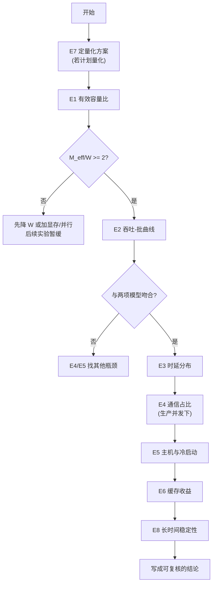

# 可复现实验手册

> 位置：[InferenceAtlas](../../INDEX.md) > [模块 12](README.md) > 当前文档
> 信息截至：2026-08-10 ｜ 最后核验：2026-08-10 ｜ 内容版本：v0.1
> 时效性等级：低（方法论部分）
> 相关主题：[推理 benchmark 方法论](../11_benchmarking_reliability_and_observability/01_inference_benchmarking_methodology.md)｜[十个参考架构](11_reference_architectures.md)｜[硬件选型框架](../07_hardware_and_server_architecture/13_hardware_selection_framework.md)

## 本章导读

本库前 11 个模块给出了大量判据，
**它们的共同特点是：都需要读者代入自己实测的数字**。
**本章把这些判据收拢成一组可执行的实验，并配一个可运行的换算工具**。

**配套代码**：[`code/reproduction_toolkit.py`](../../code/reproduction_toolkit.py)
——仅用标准库，运行即执行全部 17 项自测：

```bash
python3 code/reproduction_toolkit.py
```

**该工具箱只做换算与判定，不产生任何测量数据**。
**输入必须来自读者自己的实验**——这是本章的核心纪律。

**本章的组织**：
八个实验，**每个给出「测什么、怎么测、代入哪个函数、结论如何解读」**。
八个实验的顺序不是随意的——
**前面的结论是后面的输入，且早期实验可以直接否决后续实验的必要性**。

**关于本章的性质**：
**本章不含任何测量结果**。
所有数字都应由读者产生；
本章给出的是**产生它们的方法与解读它们的判据**。

## 学习目标

读完本章后，读者应能够：

1. 按依赖顺序执行八个实验，并在早期实验否决后续实验时及时停止
2. 用配套工具把实测值换算成本库的判据量
3. 说明每个实验最容易被做错的地方
4. 区分「测量口径问题」与「系统真实问题」
5. 把实验结论写成可被他人复核的形式

## 核心结论

- **实验有依赖顺序**：先测能否否决整个方向的量，再测细节。
- **最先该测的是有效容量比 $u$ 与 $M_{\text{eff}}/W$**——它可能直接否决配置。
- **每个实验都要先确认口径**，否则测的是口径而非系统。
- **通信必须在生产并发下测**，空载值会系统性偏乐观。
- **分位数必须配样本量与观测窗口**，且不可跨实例平均。
- **结论必须带版本、日期与复现命令**，否则无法被复核。

## 1. 问题定义、系统边界与工作负载

### 1.1 八个实验与依赖关系

| # | 实验 | 产出 | 可否决什么 |
|---:|---|---|---|
| **E1** | 有效容量比 | $u$、$M_{\text{eff}}$、$M_{\text{eff}}/W$ | **$<2$ 则批处理收益不足一半** |
| **E2** | 吞吐-批曲线 | $B_{\text{half}}$、饱和上限、实测 vs 模型 | 模型不符则瓶颈在别处 |
| **E3** | 时延分布 | TTFT/TPOT 的分布与分位数 | SLO 是否可达 |
| **E4** | 通信占比 | $T_{\text{comm}}$、占 TPOT 比例 | $>30\%$ 则并行度需重选 |
| **E5** | 主机与冷启动 | $B^{*}$、冷启动时间 | 冷启动 ≈ 尖峰则扩缩容无效 |
| **E6** | 缓存收益 | 前缀共享率、命中率 | 共享率低则缓存方案不必上 |
| **E7** | 量化验证 | 实际搬运字节、逐能力通过率 | 未融合则量化无收益 |
| **E8** | 稳定性 | 长时间的尾部与异常率 | 尾部不达标则不可上线 |

**依赖关系**：

- **E1 是入口**：由 [模块 07 第 5 章](../07_hardware_and_server_architecture/05_memory_capacity_bandwidth_and_kv_cache.md)，
  $M_{\text{eff}}/W < 2$ 时**可达吞吐不足饱和上限的一半**，
  **此时先解决权重体积，做后面的实验意义不大**。
- **E2 依赖 E1**（需要 $M_{\text{eff}}$）；
- **E4 的结论会改变 E3 的解读**（通信占了多少 TPOT）；
- **E7 会改变 E1 与 E2 的输入**（$W$ 变小），
  **因此若计划量化，应先做 E7 再回头做 E1**。

**最后一条是本章最实用的流程提示**：
**量化必须在选型与容量核算之前定**——
这与 [模块 07 第 13 章第 3.2 节](../07_hardware_and_server_architecture/13_hardware_selection_framework.md) 的顺序要求一致。

### 1.2 通用前提

**每个实验开始前必须固定并记录**：

| 项 | 为什么 |
|---|---|
| 引擎版本（**tag 而非 `main`**） | 见 [第 1 章第 3.2 节](01_open_source_inference_ecosystem.md) |
| 模型与量化方案 | $W$ 的来源 |
| 硬件与驱动 | 带宽与算力的来源 |
| 负载分布（$S$ 的均值与高分位） | 判据的输入 |
| **开环还是闭环**产生负载 | [模块 11 第 1 章](../11_benchmarking_reliability_and_observability/01_inference_benchmarking_methodology.md) |

**倒数第一行是最容易出错且后果最大的一项**：
**闭环压测测不出排队**，因此它给出的时延在生产（开环）下会被显著突破。

## 2. 原理、数学与性能模型

### 2.1 E1：有效容量比

**测什么**：引擎实际能分配给 KV 的容量。

**怎么测**：

1. 按目标配置启动引擎，读启动日志中报告的 KV 容量；
2. 若日志不报，用「逐步增加并发直到拒绝/抢占」反推；
3. **与参数推算值对比**——差值即碎片、预留与实现开销。

**代入**：

```python
from code.reproduction_toolkit import kv_bytes_per_token, decode_capacity
k = kv_bytes_per_token(n_layers=L, n_kv_heads=n_kv, head_dim=d_h, bytes_per_elem=b_kv)
cap = decode_capacity(weight_bytes=W, mem_eff_bytes=M_eff,
                      bandwidth_bytes_s=BW, seq_len=S, kv_per_token=k)
print(cap.reachable_fraction, cap.b_half, cap.c_max)
```

**解读**：

| $M_{\text{eff}}/W$ | 结论 |
|---|---|
| $< 2$ | **可达吞吐 < 50%**，先降 $W$（见 E7）或加显存/并行度 |
| $2\!-\!4$ | 可用 |
| $> 4$ | 容量宽裕，瓶颈在别处 |

**最容易做错的地方**：
**用参数值当实测值**。
由 [第 3](03_sglang.md)、[5 章](05_tensorrt_llm_deployment.md)，
**三家引擎的显存参数分母各不相同**，
**而实际可用量还要再扣碎片与预留**。
**必须实测**。

### 2.2 E2：吞吐-批曲线

**测什么**：吞吐随批大小的变化，及其与两项模型的吻合度。

**怎么测**：固定 $S$，扫 $B$，记录稳态吞吐与每步时间。

**代入**：`decode_throughput(batch, W, BW, S, k)` 与 E1 得到的 `cap`。

**解读**：

| 观察 | 结论 |
|---|---|
| 曲线在 $B_{\text{half}}$ 附近达上限一半 | **与模型吻合**，可用模型外推 |
| 实测显著低于模型 | **有其他瓶颈**（主机、通信、调度） |
| 曲线提前平坦 | 可能已受 $C_{\max}$ 或 $B_{\text{SLO}}$ 限制 |

**最容易做错的地方**：
**没有等到稳态**。
批增大后系统需要时间进入稳态，
**过早采样会得到偏乐观的值**。

### 2.3 E3：时延分布

**测什么**：TTFT 与 TPOT 的完整分布。

**怎么测**：**开环**产生负载（[模块 11 第 1 章](../11_benchmarking_reliability_and_observability/01_inference_benchmarking_methodology.md)），
按 [第 10 章](10_observability_stack.md) 的标准命名采集，
**导出直方图而非预算好的分位数**。

**解读**：

| 观察 | 结论 |
|---|---|
| P99/P50 比值大 | 尾部问题，转 E8 |
| TTFT 随 $S$ 线性增长 | 正常（prefill 计算量） |
| TPOT 随 $B$ 增长 | 正常（[模块 07 第 5 章](../07_hardware_and_server_architecture/05_memory_capacity_bandwidth_and_kv_cache.md)） |
| 客户端与服务端指标差距大 | **引擎外开销**（[第 9](09_litellm_gateways_and_model_routing.md)、[10 章](10_observability_stack.md)） |

**最容易做错的地方**（三条，均来自本库前文）：

1. **闭环压测**：测不出排队；
2. **分位数不配样本量**；
3. **跨实例平均分位数**（[第 10 章第 2.4 节](10_observability_stack.md)）。

### 2.4 E4：通信占比

**测什么**：单次集合通信耗时，及其占 TPOT 的比例。

**怎么测**：**在生产并发下测，而非空载**
（[模块 08 第 1 章第 3.4 节](../08_networking_and_interconnect/01_inference_networking_overview.md)）。
**并扫 $P$ 作图**——增长是线性还是对数，直接说明库用了哪类算法
（[模块 08 第 5 章第 6 节](../08_networking_and_interconnect/05_collectives_rdma_and_communication_libraries.md)）。

**代入**：

```python
from code.reproduction_toolkit import (allreduce_ring, allreduce_rhd,
                                       comm_share_of_tpot, b_slo)
share = comm_share_of_tpot(t_allreduce_measured, n_layers=L, tpot_s=TPOT)
b = b_slo(TPOT, comm_s=2*L*t_allreduce_measured, weight_bytes=W,
          bandwidth_bytes_s=BW, seq_len=S, kv_per_token=k)
```

**解读**：

| 占比 | 结论 |
|---|---|
| $< 10\%$ | 网络不是瓶颈 |
| $10\!-\!30\%$ | 值得优化但非首要 |
| $> 30\%$ | **首要矛盾**，改并行度或放置 |
| $> 50\%$ | **视为硬上界**，不应再增大 $P$ |

**最容易做错的地方**：
**空载测量**，以及**忘记把通信从 TPOT 预算里扣掉再算 $B_{\text{SLO}}$**——
后者会系统性高估可行批，**且 $P$ 越大高估越多**
（工具箱的自测 T9 演示了这一点：395 → 263，高估 1.50 倍）。

### 2.5 E5：主机与冷启动

**测什么**：$B^{*} = t_{\text{dev}}/h$ 与冷启动时间。

**怎么测**：

| 量 | 方法 |
|---|---|
| $t_{\text{dev}}$ | profile 单步设备时间 |
| $h$ | CPU profile，按 [模块 07 第 6 章第 3.1 节](../07_hardware_and_server_architecture/06_gpu_server_node_architecture.md) 分类 |
| 冷启动 | **从进程启动到可服务**，并**分别计时权重加载与编译/捕获** |

**代入**：`host_bound_batch(t_device_s, per_request_host_s)`。

**解读**：

| 观察 | 结论 |
|---|---|
| $B \ll B^{*}$ | 主机有富余，**不要加 CPU** |
| $B$ 接近 $B^{*}$ | 先优化 $h$ |
| 冷启动 ÷ 尖峰时长 $\gtrsim 1$ | **自动扩缩容无效**，需预热池 |

**最容易做错的地方**：
**只测「进程起来了」而非「可服务」**，
以及**不分开计时权重加载与编译**——
两者的优化手段完全不同（[第 2 章第 3.2 节](02_vllm.md)）。

### 2.6 E6：缓存收益

**测什么**：负载的**前缀共享率**，以及实际命中率。

**怎么测**：在真实流量样本上，统计任意两请求的最长公共前缀分布。

**解读**：

| 观察 | 结论 |
|---|---|
| 共享率低 | **分层缓存方案不必上**（[第 3 章](03_sglang.md)） |
| 共享率高但命中率低 | 调度策略问题（如未用 `lpm`） |
| 命中率高但 TTFT 未改善 | 检查是否 PD 分离下传输占比上升（[第 11 章](11_reference_architectures.md) 架构九） |

**最容易做错的地方**：
**把可变内容放在 prompt 前部**，
使共享前缀长度归零（[第 11 章第 2.5 节](11_reference_architectures.md)）。
**这不是测量问题而是系统设计问题，但它会先表现为「缓存没用」**。

### 2.7 E7：量化验证

**测什么**：**实际 HBM 读取量 ÷ 参数量**，以及逐能力通过率。

**怎么测**：

1. profile 得到每步的 HBM 读取量；
2. 除以参数量，**应等于 $b_{\text{eff}}/8$ 字节**；
3. 逐能力测试，样本量按可检出效应量倒推。

**代入**：

```python
from code.reproduction_toolkit import (effective_bit_width,
                                       sample_size_two_proportion)
b_eff = effective_bit_width(b_w=4, b_scale=16, group_size=g)
n = sample_size_two_proportion(p1=0.86, p2=0.81)   # 每组所需样本量
```

**解读**：

| 观察 | 结论 |
|---|---|
| 读取量 ÷ 参数量 $= b_{\text{eff}}/8$ | 访存效应已生效 |
| 明显偏大 | **反量化未融合**，或部分层未量化 |
| $b_s/g > 10\%$ | **group 过小**，开销侵蚀收益 |
| 聚合指标正常但用户投诉 | 用稀释倍数换算（`dilution_local_delta`） |

**最容易做错的地方**：
**用权重文件大小当证据**。
由 [模块 07 第 3 章](../07_hardware_and_server_architecture/03_tensor_cores_matrix_engines_and_low_precision.md)，
**「权重文件变小」不等于「搬运量变小」**——
中间隔着反量化是否融合。

### 2.8 E8：稳定性与尾部

**测什么**：长时间运行下的尾部与异常率。

**怎么测**：**长时间开环运行**，用触发式采样详记超过 P99 的事件
（[模块 08 第 11 章第 3.4 节](../08_networking_and_interconnect/11_network_observability_and_debugging.md)）。

**代入**：`jitter_amplification(p_single, n_ops)` 与 `queueing_amplification(rho)`。

**解读**：

| 观察 | 结论 |
|---|---|
| 单次异常率 $> 10^{-4}$ | 经 $2L$ 放大后已不可忽略 |
| $\rho > 0.7$ | 排队已显著（[模块 08 第 10 章](../08_networking_and_interconnect/10_network_congestion_tail_latency_and_qos.md)） |
| 尾部随时间恶化 | 查内存碎片、缓存失效、热降频 |



**图解读**：

1. **本图展示什么**：八个实验的执行顺序与两个提前退出点。
   **E7 在最前面**，因为量化改变 $W$，而 $W$ 是几乎所有后续判据的输入。
2. **核心瓶颈**：判定点 D 是最有价值的一步。
   **$M_{\text{eff}}/W < 2$ 时后续实验的意义有限**，
   因为无论怎么调，可达吞吐都不足饱和上限的一半。
   **在这里停下来去解决权重体积，比继续往下测省得多**。
3. **图中的 trade-off**：完整走完八个实验成本不低，
   **但它的替代方案是上线后再发现**——
   由 [模块 08 第 12 章](../08_networking_and_interconnect/12_inference_network_case_studies.md)，
   **事前计算的成本比事后排查低两个数量级**。
4. **面试如何引用**：可以说
   「我会按依赖顺序做：**先定量化方案，再测有效容量比**。
   $M_{\text{eff}}/W$ 小于 2 就先回去解决权重体积，
   **因为那时可达吞吐不足饱和上限一半，调别的收益有限**。
   **通信一定在生产并发下测**，而且要从 TPOT 预算里扣掉再算可行批」。

## 3. 实现机制与系统设计

### 3.1 结论应当怎么写

**一个可被他人复核的结论至少包含**：

| 项 | 例 |
|---|---|
| 引擎与版本 | **tag**，不是 `main` |
| 模型与量化方案 | 含 group 大小 |
| 硬件与驱动 | |
| 负载生成方式 | **开环/闭环**、$S$ 的分布 |
| 测量口径 | **server 还是 client 侧** |
| 分位数 + **样本量 + 观测窗口** | |
| **复现命令** | 他人能照做 |

**缺任何一项，结论都无法被复核**——
而**不可复核的结论在本库的口径下等同于未核验**。

### 3.2 工具箱的定位

[`code/reproduction_toolkit.py`](../../code/reproduction_toolkit.py) 实现了本库的核心判据：

| 函数 | 对应判据 | 出处 |
|---|---|---|
| `kv_bytes_per_token` | $k = 2Ln_{kv}d_hb_{kv}$ | 模块 02 第 5 章 |
| `decode_capacity` | 三个上界与 $1-W/M_{\text{eff}}$ | 模块 07 第 5 章 |
| `decode_throughput` | $B\cdot\text{BW}/(W+BSk)$ | 同上 |
| `half_power_size` | $n_{1/2}=\alpha\beta$ | 模块 08 第 1 章 |
| `allreduce_ring` / `allreduce_rhd` | 两种集合通信代价 | 模块 08 第 5 章 |
| `comm_share_of_tpot` | $2L\,T_{\text{AR}}/\text{TPOT}$ | 模块 08 第 1 章 |
| `b_slo` | **扣通信后的 SLO 批上界** | 模块 07 第 13 章 |
| `jitter_amplification` | $1-(1-p)^n$ | 模块 08 第 1、9 章 |
| `queueing_amplification` | $\rho/(1-\rho)$ | 模块 08 第 10 章 |
| `effective_bit_width` | $b_w+b_s/g$ | 模块 07 第 3 章 |
| `host_bound_batch` | $B^{*}=t_{\text{dev}}/h$ | 模块 07 第 6 章 |
| `hybrid_step_time` / `slow_side_share` | 混合推理两段模型 | 本模块第 7 章 |
| `crossover_length` / `posthoc_fallback_ok` | $n^{*}$ 与 $T_l<qT_c$ | 模块 10 第 9 章 |
| `dilution_local_delta` | 聚合指标的稀释 | 模块 10 第 9 章 |
| `sample_size_two_proportion` | 验收样本量 | 模块 10 第 9 章 |

**其自测覆盖 17 项**，
其中 **T2b 验证了 $C_{\max}/B_{\text{half}} = M/W-1$ 与 $S$、$k$ 无关**这一恒等式，
**T9 演示了不扣通信会高估 $B_{\text{SLO}}$ 约 1.50 倍**。

**工具箱不产生测量数据**——
**它只把实测值换算成判据，判断的责任仍在读者**。

### 3.3 常见的「测的是口径而非系统」

| 现象 | 实际在测什么 |
|---|---|
| 闭环压测的时延 | **负载生成器的节奏** |
| 空载的集合通信耗时 | 无争用时的下界 |
| 跨实例平均的 P99 | **一个无意义的数** |
| 单事件多 token 时的「ITL」 | 事件间隔而非 token 间隔 |
| 权重文件大小 | 存储格式而非搬运量 |
| 「GPU 利用率」 | 一个在 decode 下不反映饱和度的量 |

**这张表值得在每次实验前过一遍**——
**六项中的任何一项都会让结论指向错误的方向**。

## 4. 性能、成本、能耗与可靠性 trade-off

### 4.1 实验的成本

| 实验 | 成本 | 可否省 |
|---|---|---|
| E1 | 低 | **不可省**，它是入口 |
| E2 | 中（需扫 $B$） | 可用模型外推部分点 |
| E3 | 中 | 不可省（SLO 判定） |
| E4 | 中（需生产并发） | 单机部署可省 |
| E5 | 低 | 不可省（弹性判定） |
| E6 | 低（离线分析流量） | 无缓存方案时可省 |
| E7 | 中 | 不量化则可省 |
| E8 | **高（长时间）** | 不可省（上线前） |

**E1 与 E8 是两端**：
**E1 最便宜且可能否决一切，E8 最贵但不可省**。

### 4.2 与真实上线的关系

**本章的实验产生的是上界与判据，而非上线承诺**：

| 实验给出 | 上线还会遇到 |
|---|---|
| 稳态上界 | 流量波动、突发 |
| 单一负载分布 | 混合负载与长尾 |
| 受控环境 | 邻居干扰、共享资源 |

**因此实测值低于实验值是正常的**，
**而差距的大小本身是有用的信息**——
它衡量了受控实验与生产环境的距离。

## 5. benchmark、真实案例或公开部署案例

**本章不含任何测量结果**。

本章给出的是**实验方法与解读判据**；
**所有数字都应由读者在自己的系统上产生**。

**配套代码**：[`code/reproduction_toolkit.py`](../../code/reproduction_toolkit.py)，
仅用标准库，运行即执行 17 项自测。
**其自测中出现的数值均为本库前几模块中已推导的演示用假设值**，
**用于验证函数实现的正确性，不构成任何系统的性能陈述**。

### 5.1 实验记录模板

| 项 | 你的值 |
|---|---|
| 日期与执行人 | |
| 引擎与 **tag** | |
| 模型、量化方案、group 大小 | |
| 硬件、驱动 | |
| 负载：$S$ 分布、**开环/闭环** | |
| **E1** $u$、$M_{\text{eff}}/W$、$1-W/M_{\text{eff}}$ | |
| **E2** $B_{\text{half}}$、实测/模型比值 | |
| **E3** TTFT/TPOT 分位数 **+ 样本量 + 窗口** | |
| **E4** 单次通信耗时（生产并发）、占 TPOT | |
| **E5** $B^{*}$、冷启动（分权重/编译） | |
| **E6** 前缀共享率、命中率 | |
| **E7** 读取量 ÷ 参数量、逐能力通过率 | |
| **E8** 异常率、$\rho$、尾部趋势 | |
| **复现命令** | |

## 6. 设计决策框架

| 观察 | 下一步 |
|---|---|
| $M_{\text{eff}}/W < 2$ | **停下来降 $W$**，其余实验暂缓 |
| E2 实测远低于模型 | 转 E4/E5 找其他瓶颈 |
| E4 占比 $> 30\%$ | 改并行度或放置，**回到 [模块 07 第 13 章](../07_hardware_and_server_architecture/13_hardware_selection_framework.md)** |
| E5 冷启动 ≈ 尖峰 | 预热池，或缩短冷启动 |
| E6 共享率低 | **不要上分层缓存** |
| E7 读取量偏大 | 查反量化融合 |
| E8 异常率 $>10^{-4}$ | 上线前必须解决 |

## 7. 常见失败模式与排查路径

| 症状 | 首先怀疑 |
|---|---|
| 实验结论与生产表现不符 | **口径**（第 3.3 节的六项） |
| 换人重做结论不同 | 记录不全（第 3.1 节） |
| 数字漂亮但上线就崩 | **闭环压测** |
| 每次测都不一样 | 未进入稳态；或未固定版本 |
| 优化后指标没动 | 改的不是紧约束（[第 11 章](11_reference_architectures.md)） |

## 8. 关联面试主题

- 实验设计与依赖顺序 → [模块 17 案例走查](../17_interview_prep/09_mock_interview_cases.md)
- 口径问题的识别 → [模块 17 调试与 benchmark 题](../17_interview_prep/07_debug_benchmark_and_reliability_questions.md)
- 从判据到决策 → [模块 17 系统设计题](../17_interview_prep/01_inference_system_design.md)

## 9. 小结

**本章把本库前 11 个模块的判据收拢成八个实验，并配了一个可运行的换算工具**。

**八个实验有依赖顺序，且有两个提前退出点**：

1. **E7（量化方案）应当最先定**——
   量化改变 $W$，而 $W$ 是几乎所有后续判据的输入；
   **把它当作事后调优会导致全部核算重做**。
2. **E1（有效容量比）是入口**：
   **$M_{\text{eff}}/W < 2$ 时可达吞吐不足饱和上限的一半**，
   **此时应停下来解决权重体积，而不是继续往下测**。

**三条最容易被违反的纪律**：

- **通信必须在生产并发下测**，且**必须从 TPOT 预算中扣除后再算可行批**——
  工具箱的自测 T9 演示了不扣会高估约 **1.50 倍**，**且 $P$ 越大高估越多**。
- **分位数必须配样本量与观测窗口，且不可跨实例平均**——
  正确做法是先聚合直方图桶再求分位数（[第 10 章](10_observability_stack.md)）。
- **量化的证据是实际 HBM 读取量而非权重文件大小**——
  中间隔着「反量化是否融合」这一关。

**第 3.3 节的六项「测的是口径而非系统」值得在每次实验前过一遍**：
闭环压测、空载通信、跨实例平均分位数、单事件多 token、
权重文件大小、GPU 利用率——
**任何一项都会让结论指向错误的方向**。

**最后是本章的定位**：
**工具箱只做换算与判定，不产生测量数据**。
**判断的责任始终在读者**，
而一个不可复核的结论——缺版本、缺口径、缺样本量、缺复现命令——
**在本库的标准下等同于未核验**。

## 关键术语

| 中文术语 | 英文 | 定义 | 单位/口径 | 关联文档 |
|---|---|---|---|---|
| 实验依赖顺序 | experiment ordering | 前一实验的结论是后一实验的输入或否决条件 | — | 本章 1.1 |
| 提前退出点 | early exit | 该处结论可否决后续实验的必要性 | — | 本章 1.1 |
| 口径问题 | measurement-artifact | 测到的是测量方式而非系统性质 | — | 本章 3.3 |
| 可复核结论 | reproducible conclusion | 含版本、口径、样本量与复现命令 | — | 本章 3.1 |

## 延伸阅读

- [十个参考架构](11_reference_architectures.md)
- [推理 benchmark 方法论](../11_benchmarking_reliability_and_observability/01_inference_benchmarking_methodology.md)
- [硬件选型框架](../07_hardware_and_server_architecture/13_hardware_selection_framework.md)
- [观测栈](10_observability_stack.md)
- [benchmark 案例研究：五个走查](../11_benchmarking_reliability_and_observability/11_benchmark_case_studies.md)
- 配套代码：[`code/reproduction_toolkit.py`](../../code/reproduction_toolkit.py)

## 主要来源

本章的实验方法与判据全部来自本库前 11 个模块的推导，出处逐条标注。
**本章不含任何测量结果**。

配套代码 [`code/reproduction_toolkit.py`](../../code/reproduction_toolkit.py)
的每个函数在 docstring 中标注了对应的本库出处，
**其自测使用的是各章已推导的演示用假设值**。

| 类别 | 说明 | 披露标签 |
|---|---|---|
| 八个实验的方法与判据 | 由本库前 11 个模块推出 | 推出 |
| 工具箱的函数实现 | 同上；自测值为演示用假设值 | 推出 |
| 任何测量结果 | **本章未给出，应由读者产生** | — |

## 更新记录

| 日期 | 版本 | 变更 | 核验人 |
|---|---|---|---|
| 2026-08-10 | v0.1 | 初稿：八个实验及其依赖顺序与两个提前退出点、每个实验的方法与最易做错处、可复核结论的构成、六项「测的是口径而非系统」；配套 `code/reproduction_toolkit.py`（17 项自测全部通过） | — |
