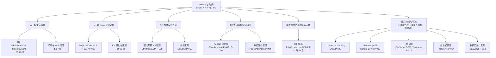

# 论文地图与阅读顺序

> 位置：[InferenceAtlas](../../INDEX.md) > [模块 13 — 论文与技术报告地图](README.md) > 当前文档
> 信息截至：2026-08-10
> 最后核验：2026-08-10
> 内容版本：v0.1
> 时效性等级：中（论文本身不变，但「哪些论文是当前工程共识」会随时间漂移）
> 相关主题：[模块 02 — Transformer 与 KV cache](../02_transformer_and_kv_cache/)｜[模块 03 — serving 引擎与调度](../03_serving_engines_and_scheduling/)｜[模块 12 — 开源部署与复现](../12_open_source_deployment_and_reproduction/)

---

## ⚠️ 降级声明：本模块**没有读过任何一篇论文的正文**

这不是免责声明，是本模块的**核心事实**，读者必须先接受它再往下读。

本仓库的构建环境施加了组织级出口白名单。截至 2026-08-10 复测，
`arxiv.org`、`export.arxiv.org`、`www.usenix.org`、`dl.acm.org`、`openreview.net`、
`aclanthology.org`、`papers.nips.cc`、`proceedings.mlsys.org` **全部返回 403**
（代理记录为 `connect_rejected`，属组织策略拒绝，非网络故障）。
按环境说明与 [AGENTS.md 第 11 节](../../AGENTS.md) 的规定，
**403 应当上报而不是绕行**——不更换 UA、不改用镜像站、不使用二级来源冒充一手来源。

因此本模块采取**降级书写**，并对每张卡片的每个字段标明其证据来源属于以下四类中的哪一类：

| 证据类别 | 可核验渠道 | 在本环境下 | 披露标签 | 典型字段 |
|---|---|:---:|---|---|
| **A. 书目元数据** | 作者在官方实现仓库 README 里给出的 BibTeX | ✅ 可读 | `开源代码/配置披露` | 标题、作者、venue、年份 |
| **B. 书目元数据（次优）** | WebSearch 返回的标题/作者/venue/arXiv 编号 | ✅ 可查 | `待核实` | 同上，但无作者自述佐证 |
| **C. 实现证据** | 官方仓库的代码、配置、默认参数 | ✅ 可读 | `开源代码/配置披露` | 是否开源、实现形态 |
| **D. 论文正文的一切** | 论文 PDF | ❌ **不可达** | `待核实` | 实验设置、关键结果、加速比、消融 |

**由此产生三条硬性纪律，本模块每一张卡片都遵守：**

1. **不转述任何论文自述的数值**。不写「提升 X 倍」「降低 Y%」「达到 Z% 峰值算力」。
   即使这些数字在搜索摘要里出现过，摘要片段也不是一手来源
   （[AGENTS.md 第 11 节](../../AGENTS.md)「禁止」第 1 条）。
2. **机制说明只写本库能独立论证的部分**。卡片里的「机制」一节，
   其推理链条来自本库模块 02–12 已经自行推导过的模型（带宽方程、容量方程、排队模型、
   α-β 通信模型），而不是来自论文正文。凡是必须读原文才能确认的细节，写 `待核实`。
3. **`data/papers.csv` 的 `citation_status` 全部为 `待核实`**。
   [`papers_schema.md`](../../data/schemas/papers_schema.md) 对 `已核验` 的定义是
   「已打开原文确认标题、作者、年份、venue」——本模块一次也没有做到，
   所以一条 `已核验` 都不能填。

## 关于存量数据的一次更正

写作本模块时发现：`data/papers.csv` 中 P-001 至 P-005 五条记录原本标为
`citation_status=已核验`、`last_verified_date=2026-07-29`。
但 [AGENTS.md 第 11 节](../../AGENTS.md) **同一天**的出口探测表把 `arxiv.org` 与
`www.usenix.org` 记为「拒绝」。两件事不可能同时为真。

本次已把这五条一律降级为 `待核实`，核验日期改为 2026-08-10（本次书目复核日）。
同时把其中未经确认的 `official_code_url=未公开` 改为 `待核实`——
schema 对「未公开」的定义是**确认厂商未披露**，而本库从未确认过这一点。

配套改动：[`scripts/paper_citation_audit.py`](../../scripts/paper_citation_audit.py)
原先把 `citation_status=待核实` 当作**阻断性错误**。这条规则在当前环境下有害：
它使「让门禁变绿」的唯一途径变成谎报 `已核验`。
现改为——`待核实` 单独计数并在报告中逐条列出（欠账可见），但不阻断门禁；
枚举越界、日期格式错误、bib 双向不一致等**真错误仍然阻断**。

## 本章导读

读论文最常见的失败不是读不懂，而是**读完之后不知道它约束了什么**。
推理系统方向的论文尤其如此：一篇论文报告的加速比，几乎总是绑定在
某个特定的模型规模、序列长度分布、batch 结构、GPU 代际与基线实现上；
换一组条件，收益可能减半，也可能为负。

因此本模块不按年份、也不按会议组织文献，而是按**它们各自消除了哪一个瓶颈**组织。
这样组织的好处是：当你手上有一个具体的性能问题时，
可以先用本库模块 07 的带宽方程判断瓶颈在哪一项，再直接跳到对应的论文簇，
而不是从一份按时间排列的百篇列表里大海捞针。

本章给出：瓶颈导向的论文地图、三条阅读路径、降级版卡片模板，
以及一张「哪些结论可以推导、哪些必须实测」的分界表。
后者是本模块在读不到正文的情况下**仍然有用**的原因——
论文的数值结论必须实测复现，但它们所处的**约束结构**是可以从第一性原理推出来的。

## 学习目标

读完本章后，读者应能够：

1. 从一个具体的性能症状出发，定位到应该读哪一簇论文，而不是漫无目的地读综述；
2. 说清「一篇推理论文的加速比为什么不可跨条件外推」，并列举至少三个使其失效的条件；
3. 使用本章的降级卡片模板，把一篇新论文拆成「可推导部分」与「必须实测部分」；
4. 判断一条来自论文的数字在自己的系统里应当如何被重新测量，而不是直接引用。

## 核心结论

- **论文地图应按瓶颈组织，不按时间组织。** 推理优化的论文簇几乎与
  「步时间方程 $t = (W + BSk)/\text{BW}$ 里的哪一项被打掉」一一对应。
- **绝大多数推理论文的贡献是「改变了某一项的系数」，而不是「改变了方程的形式」。**
  MQA/GQA 打的是 $k$，StreamingLLM 打的是 $S$，量化打的是 $W$ 和 $k$ 的位宽，
  投机解码打的是「每次前向产出多少 token」，chunked prefill 与 PD 分离打的是
  两阶段共用同一批次时的干扰项。认出这一点，一篇论文的适用边界就基本确定了。
- **论文的实验条件通常与生产环境相距甚远，识别这一差距本身就是能力。**
  最常见的三个差距：基线实现是否已启用当代默认优化、batch 结构是在线还是离线、
  GPU 代际是否改变了算力/带宽比。
- **在读不到正文的环境里，仍然可以严肃地做文献工作**——
  前提是把「能推导的」和「必须实测的」明确分开，并且**绝不**把后者伪装成前者。

## 1. 论文地图：按瓶颈组织

### 1.1 组织原则

本库模块 07 给出的 decode 步时间模型是：

$$t = \frac{W + B\,S\,k}{\text{BW}}$$

其中 $W$ 为每步必须读取的权重字节数，$B$ 为并发请求数，$S$ 为平均序列长度，
$k$ 为每 token 每层的 KV 字节数，$\text{BW}$ 为可用显存带宽（单位 B/s）。
prefill 侧则是算力受限，其主项是 $O(\text{prompt 长度} \times$ 模型 FLOP 密度$)$。

**几乎每一簇推理优化论文，都可以定位到它打的是这个方程里的哪一项。**
这不是一个巧合——方程里的项就是可动的自由度，能动的地方也就那么几处。

下图把主要论文簇挂到各自攻击的项上。



**图解读**：

1. **图展示什么**：把 decode 步时间方程的每一项作为一个分支，
   将本模块已建卡的论文挂到它实际攻击的那一项上。
   右侧带 `P-0XX` 编号的是本次已录入 [`data/papers.csv`](../../data/papers.csv) 的条目，
   标「→ 第 XX 章」的是本模块后续章节的位置。
2. **核心瓶颈**：图的根节点就是瓶颈本身——decode 是**带宽受限**的，
   分子上的每一个字节都要过一次 HBM。所有 decode 侧优化本质上都是在
   减少分子、或提高分母的有效利用率。注意最右下角的调度簇是个例外：
   它不改变方程，而是改变 $B$ 的取值与批内 prefill/decode 的混合比例。
3. **图中的 trade-off**：同一项上的不同方法互相竞争，不同项上的方法互相叠加。
   打 $k$ 的方法（GQA）和打 $S$ 的方法（StreamingLLM）可以同时用，收益近似相乘；
   但两个都打 $k$ 的方法（GQA 与 KV 量化）叠加后收益远低于各自收益之积，
   因为 $k$ 只有那么多可压缩的空间。**这是判断「两篇论文能不能同时用」的第一判据。**
4. **面试如何引用**：被问到「你会怎么优化这个推理服务的 TPOT」时，
   不要从技术名词开始答。先写出这个方程，问清楚 $W$、$B\,S\,k$ 哪一项占主导，
   再从对应分支里挑方法。这个顺序本身就是分数——它显示你在做诊断，而不是背清单。

### 1.2 各簇的定位与本模块章节对应

| 瓶颈项 | 论文簇 | 本模块章节 | 本次是否已建卡 |
|---|---|---|:---:|
| 基础计算图 | Transformer 架构本身 | [第 02 章](02_transformer_inference_and_kv_cache_papers.md) | ✅ P-001 |
| $\text{BW}$ 利用率 | IO 感知注意力 kernel | [第 02 章](02_transformer_inference_and_kv_cache_papers.md) | ✅ P-002、P-006 |
| $k$ | KV 头共享 | [第 02 章](02_transformer_inference_and_kv_cache_papers.md) | ✅ P-007、P-008 |
| 显存碎片 | 分页 KV 管理 | [第 02 章](02_transformer_inference_and_kv_cache_papers.md) | ✅ P-004 |
| $S$ | 固定预算 KV 驱逐 | [第 02 章](02_transformer_inference_and_kv_cache_papers.md) | ✅ P-009 |
| $B$ 与批内构成 | 迭代级调度、chunked prefill、PD 分离、抢占 | [第 03 章](03_batching_serving_and_scheduler_papers.md) | ✅ P-003、P-010、P-011、P-013、P-014、P-015 |
| $S$（跨请求复用） | 前缀复用与结构化解码 | [第 03 章](03_batching_serving_and_scheduler_papers.md) | ✅ P-012 |
| 每次前向产出 token 数 | 投机解码族 | `04_speculative_decoding_papers.md` | ⏳ P-005 已录入，卡片待写 |
| $W$、$k$ 的位宽 | 量化与压缩 | `05_quantization_and_compression_papers.md` | ⏳ |
| kernel 与编译 | 编译器、runtime | `06_compiler_runtime_and_kernel_papers.md` | ⏳ |
| 多设备切分 | 分布式与 MoE | `07_distributed_and_moe_inference_papers.md` | ⏳ |
| 硬件本身 | 体系结构 | `08_hardware_and_architecture_papers.md` | ⏳ |
| 互连 | 网络与数据中心 | `09_networking_and_datacenter_papers.md` | ⏳ |
| 端侧约束 | 边缘推理 | `10_edge_inference_papers.md` | ⏳ |
| 评测方法 | 基准与可靠性 | `11_reliability_and_benchmarking_papers.md` | ⏳ |

## 2. 降级版卡片模板

模块 README 的写作要求第 1 条列了 12 个字段。在读不到正文的条件下，
其中「实验设置」与「关键结果」两项**无法诚实填写**。
本模块的做法不是删掉它们（那会掩盖欠账），而是**保留字段并标注为 `待核实`，
同时给出原文链接与「需要什么来源才能填上」**。

模板如下，每张卡片按此结构书写：

```text
### P-0XX  <英文标题>

| 字段 | 内容 |
|---|---|
| 书目 | 作者 · venue · 年份 ·（证据类别 A 或 B） |
| 一手链接 | arXiv abs / DOI / 会议官方页 |
| 官方实现 | 仓库链接（证据类别 C）或 待核实 |

**问题**：它想解决什么（可由本库自行论证）
**背景**：在它之前，工程上是怎么做的（可由本库自行论证）
**机制**：核心做法（本库能独立论证的部分；不可论证处写 待核实）
**它打的是方程里的哪一项**：定位到 §1.1 的分支
**实验设置**：`待核实` — 未读原文
**关键结果**：`待核实` — 未读原文，且不转述搜索摘要中的数值
**适用边界**：什么条件下收益成立（本库推导）
**局限**：作者自述局限 `待核实` + 工程视角局限（本库推导）
**后续影响**：可由开源实现佐证的部分
**面试讨论角度**：至少一个能问出深度的切入点
**关联文档**：本库内部链接
```

### 2.1 为什么「适用边界」可以由本库推导，而「关键结果」不行

这一区分是本模块能成立的关键，值得说清楚。

- **「关键结果」是一个测量值。** 它依赖论文的具体实验条件：
  哪块 GPU、哪个模型、什么序列长度分布、基线是什么实现。
  这些条件只在论文正文里。没读正文而写下一个倍数，就是编造。
- **「适用边界」是一个结构性论断。** 它问的是：
  「这个机制的收益项在什么条件下趋近于零？」
  这个问题可以从机制本身的形状推出来，不需要论文的实验数据。

举例：前缀复用（P-012）的收益等于「被复用掉的 prefill 算力」。
不需要读论文就能断言：当 workload 中请求之间没有公共前缀时，
被复用掉的量为零，此时系统只剩下维护基数树的开销——**收益为负**。
这个论断是从机制推出来的，与论文报告的任何倍数无关，而且它恰恰是
工程上最需要知道的那一半。

## 3. 三条阅读路径

不同目的应该走不同顺序。以下三条路径覆盖多数场景。

### 3.1 路径 A：面试准备（最短闭环，约 6 篇）

目标是能就「推理系统为什么这么设计」展开对话，而不是背名词。

1. **P-001 Attention Is All You Need** — 只需理解 decoder 的自回归结构
   为什么**必然**导出 KV cache。这是后面一切的前提。
2. **P-004 PagedAttention** — 理解「显存是被浪费掉的，不是不够用」这个转折。
3. **P-003 Orca** — 理解迭代级调度，以及为什么 request-level 批处理必然浪费算力。
4. **P-002 FlashAttention** — 理解「优化目标是 HBM 访问量而不是 FLOP 数」。
   这一句话本身就是整个推理性能观的浓缩。
5. **P-007 / P-008 MQA / GQA** — 理解模型结构可以为推理效率让步，以及让步的代价。
6. **P-010 Sarathi-Serve 或 P-011 DistServe** — 二选一，理解 prefill/decode
   干扰是当代 serving 的核心矛盾。

配套阅读本库 [模块 03 第 5 章](../03_serving_engines_and_scheduling/05_prefill_decode_scheduling.md)
与 [模块 06 第 7 章](../06_distributed_and_moe_inference/07_prefill_decode_disaggregation.md)，
它们给出了这两条路线的完整量化对比。

### 3.2 路径 B：正在优化一个具体系统（诊断驱动）

不要按顺序读。按以下顺序**诊断**，诊断结果指向哪一簇就读哪一簇：

1. 测出 TTFT 与 TPOT 的分解（[模块 11 第 3 章](../11_benchmarking_reliability_and_observability/03_ttft_tpot_itl_and_end_to_end_latency.md)）；
2. 算出 $M_{\text{total}}/W$。若该比值 $< 2$，则按本库模块 07 的恒等式，
   批处理最多只能拿到饱和上限的 $1 - W/M_{\text{total}} < 50\%$ ——
   此时该读的是**显存容量**方向（P-004、P-009、KV 量化），而不是调度方向；
3. 若 TPOT 的**尾部**远大于中位数，读调度簇（P-010、P-011、P-014）；
4. 若 TTFT 高而 TPOT 正常，且请求间有公共前缀，读 P-012；
5. 若单请求延迟是硬约束、并发很低，读投机解码簇（第 04 章）。

### 3.3 路径 C：建立领域全貌（按本模块章节顺序）

第 02 章 → 第 03 章 → 第 04 章 → 第 05 章 → 第 06 章 → 第 07 章 →
第 08 章 → 第 09 章 → 第 10 章 → 第 11 章。
每章读完后回到本章 §1.1 的图，确认新读的这一簇挂在哪一项上。

## 4. 可推导 vs 必须实测：一张分界表

这张表是本模块的**使用说明**。左列的结论可以直接用；
右列的每一项在你自己的系统上都必须重测，论文里的数字只能作为「存在性证据」。

| 可以从机制推导（本库负责） | 必须在你的系统上实测（本库不提供数字） |
|---|---|
| 某方法攻击的是步时间方程的哪一项 | 该方法在你的模型/硬件上的实际加速比 |
| 收益趋近于零的条件 | 收益的具体幅度 |
| 两个方法能否叠加、叠加后是否近似相乘 | 叠加后的实测吞吐 |
| 引入了哪些新的失败域（如 KV 迁移链路） | 这些失败域的实际发生率 |
| 新增了哪些调优旋钮 | 这些旋钮在你的 workload 上的最优值 |
| 该方法与张量并行/量化等是否结构冲突 | 冲突带来的实际性能损失 |
| 质量是否可能受损、受损的机理 | 质量损失的具体大小 |

**表的用法**：读一篇新论文时，先把它的贡献填进左列。
如果左列填不满——说明你还没真正理解机制，此时去看右列的数字只会形成错觉。

## 5. 常见误读

以下五类误读在面试与工程决策中都很常见，且都可以在不读原文的情况下识别。

1. **把基线当成「当代默认配置」**。
   一篇 2023 年论文的基线，可能没有启用 chunked prefill、前缀复用或 GQA。
   相对该基线的倍数，与相对今天默认配置的倍数是两回事。
2. **把离线吞吐结论用到在线服务上**。
   离线批处理可以把 $B$ 推到显存上限；在线服务受 SLO 约束，
   $B$ 被 $B_{\text{SLO}}$ 卡住（见 [模块 07](../07_hardware_and_server_architecture/)）。
   在 $B$ 无法自由取值时，很多吞吐优化的收益结构完全不同。
3. **忽略 GPU 代际改变了算力/带宽比**。
   同一方法在算力/带宽比不同的两代硬件上，可能从「显著有效」变成「无关紧要」——
   因为瓶颈已经换了一项。
4. **把「支持无限长上下文」等同于「记得住无限长上下文」**。
   固定预算 KV 驱逐（P-009）让模型不崩溃，但被驱逐的信息不可恢复。
   这两件事在工程上完全不同，混淆的代价是线上答非所问。
5. **把系统论文的收益与算法论文的收益直接相加**。
   前者改变资源利用率，后者改变计算量，两者的交互往往不是相加，
   甚至可能互相抵消（如抢占式调度会降低批次饱和度，削弱投机解码的收益）。

## 6. 关联面试主题

1. 「你最近读了什么推理方向的论文？」——
   用 §1.1 的方程定位法回答，比复述摘要有效得多。参见
   [模块 17 第 1 章](../17_interview_prep/01_inference_system_design.md)。
2. 「PagedAttention 解决的到底是什么问题？」——
   答「显存碎片与预留浪费」，而不是「省显存」。参见
   [模块 03 第 3 章](../03_serving_engines_and_scheduling/03_pagedattention_and_kv_memory_management.md)。
3. 「chunked prefill 和 PD 分离，你选哪个？」——
   这是一道判断题不是知识题，取决于互连带宽与 workload 结构。参见
   [模块 06 第 7 章](../06_distributed_and_moe_inference/07_prefill_decode_disaggregation.md)。
4. 「GQA 的 group 数怎么定？」——
   把 KV 压缩比与张量并行度的整除关系讲清楚，参见
   [模块 02 第 6 章](../02_transformer_and_kv_cache/06_gqa_mqa_mla_and_kv_reduction.md)。
5. 「论文说提升 3 倍，你信吗？」——
   这是考察基线意识。用 §5 的第 1、3 条回答。参见
   [模块 11 第 1 章](../11_benchmarking_reliability_and_observability/01_inference_benchmarking_methodology.md)。

## 7. 小结

本模块在**读不到任何论文正文**的条件下书写，这一约束被前置声明而不是掩盖。
应对方式是把文献工作切成两半：**结构性论断由本库自行推导并负责**，
**测量性论断一律标 `待核实` 并给出原文链接**。

论文地图按瓶颈而非时间组织，其根节点是 decode 步时间方程；
认出一篇论文打的是方程里的哪一项，它的适用边界、叠加性与失效条件就基本确定了。
这个方法在读不到正文时仍然成立——恰恰因为它依赖的是机制的形状，而不是实验的数字。

存量 `papers.csv` 中五条不实的 `已核验` 已在本次更正为 `待核实`，
并同步调整了审计脚本，使「未核验」成为**可见的欠账**而不是**必须被消除的报错**。

## 关键术语

| 中文术语 | 英文 | 定义 | 单位/口径 | 关联文档 |
|---|---|---|---|---|
| 降级书写 | degraded authoring | 在一手来源不可达时，仅书写可独立论证的部分，并对其余部分显式标注欠账 | — | 本章 |
| 证据类别 | evidence class | 本模块对字段来源的四级划分（A 仓库 BibTeX / B 搜索书目 / C 实现代码 / D 论文正文） | — | 本章 §降级声明 |
| 瓶颈导向地图 | bottleneck-oriented map | 按论文攻击的性能方程分项、而非按时间组织文献 | — | 本章 §1.1 |
| 结构性论断 | structural claim | 可由机制形状推出、不依赖实验数据的结论（如收益归零条件） | — | 本章 §2.1 |
| 测量性论断 | measured claim | 必须由实验给出的结论（如加速比），跨条件不可外推 | — | 本章 §2.1 |

## 延伸阅读

- 本模块 [第 02 章](02_transformer_inference_and_kv_cache_papers.md)、[第 03 章](03_batching_serving_and_scheduler_papers.md)
- [模块 11 第 1 章 — 推理基准方法论](../11_benchmarking_reliability_and_observability/01_inference_benchmarking_methodology.md)：如何自己测，而不是引用别人的数字
- [模块 12 第 12 章 — 可复现实验手册](../12_open_source_deployment_and_reproduction/12_reproduction_playbooks.md)：把本模块的「必须实测」项真正跑起来
- [`code/reproduction_toolkit.py`](../../code/reproduction_toolkit.py)：本库自行实现的容量与通信模型计算器

## 主要来源

| 来源 | 类型 | 用途 | 披露标签 | 核验日期 |
|---|---|---|---|:---:|
| [`AGENTS.md` 第 11 节](../../AGENTS.md) | 本仓库规范 | 出口策略实测结果与降级纪律 | — | 2026-08-10 |
| [`data/schemas/papers_schema.md`](../../data/schemas/papers_schema.md) | 本仓库规范 | `citation_status` 的判定标准 | — | 2026-08-10 |
| [`Dao-AILab/flash-attention` README](https://github.com/Dao-AILab/flash-attention) | 官方仓库 BibTeX | P-002、P-006 书目 | `开源代码/配置披露` | 2026-08-10 |
| [`vllm-project/vllm` README](https://github.com/vllm-project/vllm) | 官方仓库 BibTeX | P-004 书目 | `开源代码/配置披露` | 2026-08-10 |
| [`microsoft/sarathi-serve` README](https://github.com/microsoft/sarathi-serve) | 官方仓库 BibTeX | P-010 书目 | `开源代码/配置披露` | 2026-08-10 |
| [`LLMServe/DistServe` README](https://github.com/LLMServe/DistServe) | 官方仓库 BibTeX | P-011 书目 | `开源代码/配置披露` | 2026-08-10 |
| [`mit-han-lab/streaming-llm` README](https://github.com/mit-han-lab/streaming-llm) | 官方仓库 BibTeX | P-009 书目 | `开源代码/配置披露` | 2026-08-10 |
| WebSearch 书目检索 | 二级来源 | P-007、P-008、P-012、P-013、P-014、P-015 的书目字段 | `待核实` | 2026-08-10 |
| 各论文正文 | 一手来源 | **未读**——出口策略拒绝 | `待核实` | — |

## 更新记录

| 日期 | 版本 | 变更 | 核验人 |
|---|---|---|---|
| 2026-08-10 | v0.1 | 初稿：降级声明、瓶颈导向论文地图、三条阅读路径、可推导/必实测分界表；同步更正 `papers.csv` 存量五条的 `citation_status` | — |
