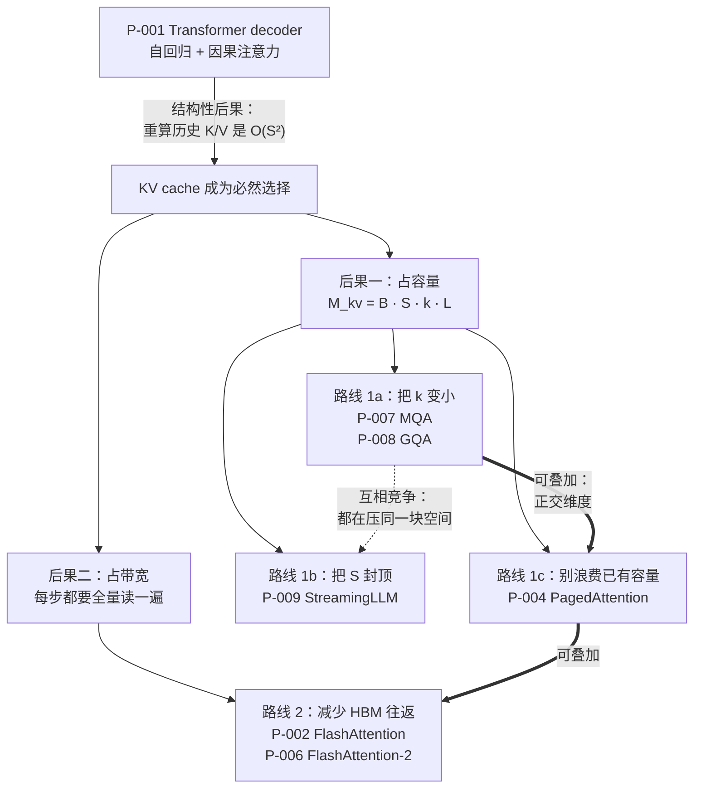

# Transformer 推理与 KV cache 论文卡片

> 位置：[InferenceAtlas](../../INDEX.md) > [模块 13 — 论文与技术报告地图](README.md) > 当前文档
> 信息截至：2026-08-10
> 最后核验：2026-08-10
> 内容版本：v0.1
> 时效性等级：低（这些论文的机制已成为工程共识，短期内不会变）
> 相关主题：[模块 02 — Transformer 与 KV cache](../02_transformer_and_kv_cache/)｜[模块 07 — 硬件与服务器架构](../07_hardware_and_server_architecture/)｜[本模块第 01 章 — 论文地图](01_paper_map.md)

---

> ⚠️ **降级书写**：本章**未读过任何一篇论文的正文**。
> 每张卡片的「实验设置」与「关键结果」一律为 `待核实`，且**不转述**搜索摘要中的任何数值。
> 完整的证据分级与纪律见 [第 01 章的降级声明](01_paper_map.md)。

## 本章导读

本章覆盖七篇论文，它们共同定义了「LLM 推理为什么是一个**内存问题**而不是一个算力问题」。

这条线索有一个清晰的因果顺序：Transformer 的 decoder 结构使自回归生成
**必须**缓存历史 K/V（P-001）；缓存一旦存在，它就同时消耗**容量**和**带宽**；
于是后续工作分成两路——一路降低缓存本身的大小（P-007 MQA、P-008 GQA、P-009 StreamingLLM），
另一路提高既有容量与带宽的利用效率（P-004 PagedAttention 治碎片，P-002/P-006 FlashAttention 治访存）。

读这一簇论文时最容易犯的错误，是把它们当作一组并列的「优化技巧」。
它们不是并列的：**降低 $k$ 的方法之间互相竞争，降低 $k$ 与提高利用率的方法之间互相叠加**。
本章每张卡片都标出它在 [第 01 章 §1.1 的步时间方程](01_paper_map.md) 里打的是哪一项，
就是为了让这个叠加关系可判断。

## 卡片索引

| 编号 | 简称 | 打的是哪一项 | 官方实现 | 本库对应章节 |
|---|---|---|---|---|
| [P-001](#p-001--attention-is-all-you-need) | Transformer | 定义了整个方程 | 待核实 | [模块 02 第 1 章](../02_transformer_and_kv_cache/01_transformer_inference_from_first_principles.md) |
| [P-002](#p-002--flashattention) | FlashAttention | $\text{BW}$ 利用率 | ✅ 仓库可读 | [模块 04 第 8 章](../04_compilers_runtimes_and_kernels/08_flashattention_and_memory_efficient_attention.md) |
| [P-006](#p-006--flashattention-2) | FlashAttention-2 | $\text{BW}$ 利用率（占用率） | ✅ 同上仓库 | [模块 04 第 8 章](../04_compilers_runtimes_and_kernels/08_flashattention_and_memory_efficient_attention.md) |
| [P-007](#p-007--multi-query-attention) | MQA | $k$ | 待核实 | [模块 02 第 6 章](../02_transformer_and_kv_cache/06_gqa_mqa_mla_and_kv_reduction.md) |
| [P-008](#p-008--gqa) | GQA | $k$（可调） | 待核实 | [模块 02 第 6 章](../02_transformer_and_kv_cache/06_gqa_mqa_mla_and_kv_reduction.md) |
| [P-004](#p-004--pagedattention) | PagedAttention | 有效显存容量 | ✅ 仓库可读 | [模块 03 第 3 章](../03_serving_engines_and_scheduling/03_pagedattention_and_kv_memory_management.md) |
| [P-009](#p-009--streamingllm) | StreamingLLM | $S$ | ✅ 仓库可读 | [模块 02 第 8 章](../02_transformer_and_kv_cache/08_kv_cache_compression_quantization_and_eviction.md) |

## 这七篇之间的关系

下图不是时间线，而是**约束的传导链**：上游的结构性事实迫使下游出现某类工作。

**图解读**：

1. **图展示什么**：从 Transformer 的结构性事实出发，展示 KV cache 为什么是**被迫**引入的，
   以及它的两个后果（占容量、占带宽）如何分别催生了四条技术路线。
   实线箭头是因果传导，虚线是竞争关系，粗线是可叠加关系。
2. **核心瓶颈**：图的中段 $M_{kv} = B \cdot S \cdot k \cdot L$ 就是瓶颈本身
   （$B$ 并发数、$S$ 序列长度、$k$ 每 token 每层 KV 字节数、$L$ 层数）。
   容量决定了能并发多少请求，带宽决定了每步要花多久——
   **同一份数据同时卡住了这两个完全不同的资源**，这是 LLM 推理区别于传统 DNN 推理的根本点。
3. **图中的 trade-off**：C1 与 C2 之间的虚线是本图最重要的信息。
   MQA/GQA 压 $k$、StreamingLLM 压 $S$，两者看似正交，
   但它们消耗的是**同一份质量预算**——都以牺牲模型对历史信息的访问能力为代价。
   叠加使用时质量下降往往超过各自单独使用之和，这个取舍必须在业务侧确认，不能由系统侧单方面决定。
   相对地，C3（消除浪费）与 D1（减少访存）不牺牲任何质量，属于「无条件应当先做」的一类。
4. **面试如何引用**：被问「为什么 LLM 推理和 CNN 推理不一样」时，
   直接讲这张图的中段——CNN 的中间激活用完即弃，LLM 的 KV cache 必须留到会话结束，
   于是显存占用随**并发数 × 会话长度**增长，而不是随模型大小固定。
   这一句话可以带出后面所有的技术选择。

---

## P-001 — Attention Is All You Need

| 字段 | 内容 |
|---|---|
| 书目 | Vaswani, Ashish; Shazeer, Noam; Parmar, Niki; 等 · NeurIPS 2017 ·（证据类别 B） |
| 一手链接 | https://arxiv.org/abs/1706.03762 |
| 官方实现 | [`tensorflow/tensor2tensor`](https://github.com/tensorflow/tensor2tensor)（`开源代码/配置披露`，核验于 2026-08-10；该仓库 README 给出的 BibTeX 是 tensor2tensor 自身的论文，**不是**本篇，故本篇书目仍属类别 B） |

**问题**：序列模型依赖循环结构，任意两个位置之间的信息传递路径长度随距离增长，
且时间步之间存在串行依赖，训练无法充分并行。

**背景**：此前主流是 RNN/LSTM 加注意力机制作为补充。注意力是配角。

**机制**（本库可独立论证的部分）：把注意力提升为唯一的序列交互机制。
scaled dot-product attention 使任意两位置的路径长度为常数；
multi-head 让模型在多个表示子空间上并行做这件事；
位置信息由显式的位置编码补回，因为注意力本身对顺序不敏感。

$$\text{Attention}(Q,K,V) = \text{softmax}\!\left(\frac{QK^{\mathsf T}}{\sqrt{d_k}}\right)V$$

其中 $Q,K,V$ 分别为查询、键、值矩阵；$d_k$ 为每头的键维度，单位是「维」；
$\sqrt{d_k}$ 的作用是把点积的方差归一化，避免 softmax 进入梯度极小的饱和区。

**它打的是方程里的哪一项**：它**定义了整个方程**。
后续所有推理优化都是在这个计算图上做的减法。

**对推理的结构性后果**（本章最重要的一段，本库可独立论证）：

论文的目标是训练与翻译质量，但它的 decoder 结构给推理留下了一个**不可回避**的后果。
自回归生成第 $n$ 个 token 时，注意力需要用到前 $n-1$ 个位置的 K 和 V。
有两个选择：

- **每步重算**：第 $n$ 步重算 $n-1$ 个位置的 K/V，全程累计 $O(S^2)$ 次投影计算；
- **缓存**：第一次算完就存下来，全程 $O(S)$ 次投影计算，代价是 $O(S)$ 的显存占用。

在任何合理的 $S$ 下，第二个选择都压倒性地更优——**所以 KV cache 不是一个优化，
而是这个架构下唯一合理的实现方式**。整个推理系统领域的显存压力，源头在这里。

**实验设置**：`待核实` — 未读原文。
**关键结果**：`待核实` — 未读原文；本库不转述任何 BLEU 分数或训练成本数字。

**适用边界**：原文面向机器翻译的 encoder-decoder 训练场景。
当代 LLM 使用的是 decoder-only 变体，且在归一化位置、位置编码方案、
激活函数、注意力头结构上均已偏离原文。**引用本文时应明确是在引用「架构范式」而非具体配置。**

**局限**：
- 作者自述局限：`待核实` — 未读原文。
- 工程视角局限（本库论证）：注意力对序列长度的二次复杂度在长上下文 prefill 阶段成为主要成本项
  （见 [模块 02 第 3 章](../02_transformer_and_kv_cache/03_attention_complexity_during_inference.md)）；
  原文完全没有讨论推理侧的缓存管理、批处理调度或服务化，这些都是后续二十年工程工作的内容。

**后续影响**：本模块其余全部卡片都是这篇的下游。

**面试讨论角度**：不要问「Transformer 是什么」。
应该问：「为什么 KV cache 是必需的，而不是一个可选优化？」
好的回答会给出上面的 $O(S^2)$ 与 $O(S)$ 对比，并指出这是**架构决定的**，
换任何一个自回归 + 因果注意力的模型都一样。

**关联文档**：[模块 02 第 1 章](../02_transformer_and_kv_cache/01_transformer_inference_from_first_principles.md)、
[模块 02 第 4 章](../02_transformer_and_kv_cache/04_kv_cache_fundamentals.md)

---

## P-002 — FlashAttention

| 字段 | 内容 |
|---|---|
| 书目 | Dao, Tri; Fu, Daniel Y.; Ermon, Stefano; Rudra, Atri; Ré, Christopher · NeurIPS 2022 ·（**证据类别 A**：作者在官方仓库 README 中给出的 BibTeX） |
| 一手链接 | https://arxiv.org/abs/2205.14135 |
| 官方实现 | [`Dao-AILab/flash-attention`](https://github.com/Dao-AILab/flash-attention)（`开源代码/配置披露`，核验于 2026-08-10） |

**问题**：标准注意力实现要把 $N \times N$ 的注意力矩阵写进 HBM 再读回来，
访存量随序列长度二次增长，而这一步在数学上是完全不必要的中间结果。

**背景**：此前的注意力优化多走「近似」路线（稀疏、低秩），
以改变数学语义为代价换取复杂度下降。

**机制**（本库可独立论证的部分）：把 Q/K/V 分块载入片上 SRAM，
用 online softmax 逐块累积输出，从不物化完整注意力矩阵；
反向传播时不保存中间矩阵而是重算，用算力换显存。
**结果与标准注意力逐位相等**——这是精确注意力，不是近似。

其核心主张可以用本库 [模块 01 第 5 章](../01_foundations_and_metrics/05_memory_bandwidth_and_arithmetic_intensity.md)
的语言复述：**优化目标是 HBM 访问字节数，而不是 FLOP 数**。
当一个 kernel 的算术强度低于机器平衡点时，减少 FLOP 毫无用处，减少访存才有用。

**它打的是方程里的哪一项**：$\text{BW}$ 的有效利用率——
同样的带宽，搬运更少的字节。

**实验设置**：`待核实` — 未读原文。
**关键结果**：`待核实` — 未读原文；本库不转述任何加速比或显存节省比例。

**适用边界**（本库论证）：
- 收益来源是「避免写读 $N \times N$ 矩阵」，因此**收益随序列长度增长**，短序列上收益有限；
- 主要作用在 **prefill** 阶段。decode 阶段每步只有一个新 query，
  注意力退化为 GEMV 形态，此时瓶颈是读 KV cache 本身，不是中间矩阵——
  **把 FlashAttention 当成 decode 阶段的解药是一个常见误解**；
- 收益依赖具体 GPU 的 SRAM 容量与 SRAM/HBM 带宽比，跨代际不可外推。

**局限**：
- 作者自述局限：`待核实` — 未读原文。
- 工程视角局限（本库论证）：这是一个 kernel 级实现，与注意力的具体变体
  （因果掩码、滑动窗口、ALiBi、各种位置编码）强耦合，每种变体都需要单独实现；
  这也是为什么实践中经常出现「某个新模型结构暂时没有 FlashAttention 支持」的情况。

**后续影响**：已成为主流推理引擎注意力实现的事实基线，可由 vLLM、SGLang、TGI
等仓库对该实现的依赖关系直接佐证（`开源代码/配置披露`）。

**面试讨论角度**：问「FlashAttention 在 decode 阶段能带来多少收益」。
这是一道**陷阱题**，正确回答是先反问 prefill 还是 decode，
再指出 decode 的瓶颈是 KV cache 读取而非中间矩阵物化。

**关联文档**：[模块 04 第 8 章](../04_compilers_runtimes_and_kernels/08_flashattention_and_memory_efficient_attention.md)、
[模块 01 第 5 章](../01_foundations_and_metrics/05_memory_bandwidth_and_arithmetic_intensity.md)

---

## P-006 — FlashAttention-2

| 字段 | 内容 |
|---|---|
| 书目 | Dao, Tri · ICLR 2024 ·（**证据类别 A**：作者在官方仓库 README 中给出的 BibTeX，其中 `booktitle` 为 ICLR、`year` 为 2024） |
| 一手链接 | https://arxiv.org/abs/2307.08691 |
| 官方实现 | [`Dao-AILab/flash-attention`](https://github.com/Dao-AILab/flash-attention)（`开源代码/配置披露`，核验于 2026-08-10；与 P-002 同一仓库） |

**问题**：FlashAttention 解决了访存量，但它的并行划分主要沿 batch 与 head 两个维度展开。
当 batch 小、head 数有限而序列很长时，GPU 上的 SM 无法被填满——
**访存对了，但机器没跑满**。

**背景**：这恰好是**推理**（而非训练）的典型工况：
在线服务的 batch 往往不大，而 prompt 可能很长。

**机制**（本库可独立论证的部分）：把并行维度扩展到序列块维度，
使可并行的工作单元数从 $\text{batch} \times \text{head}$ 变为
$\text{batch} \times \text{head} \times \text{序列块数}$；
调整循环顺序并重新划分 warp 之间的工作，减少 shared memory 往返；
同时削减 online softmax 中的非 matmul 指令——这类指令不走 Tensor Core，
在现代 GPU 上其单位吞吐远低于 matmul，占比一旦升高就会拖累整体。

**算法语义与 P-002 完全相同**，这是一次实现级重写。

**它打的是方程里的哪一项**：仍是 $\text{BW}$ 的有效利用率，
但攻击的子问题从「访存量」换成了「占用率与非 matmul 开销」。

**实验设置**：`待核实` — 未读原文。
**关键结果**：`待核实` — 未读原文；本库不转述任何相对 P-002 的加速倍数或峰值算力百分比。

**适用边界**（本库论证）：
- 收益条件是「SM 没填满」。若你的工况本来就是大 batch 长序列，SM 已经饱和，
  本文的并行划分改动收益有限；
- 与具体 GPU 的 SM 数量、shared memory 容量、Tensor Core 代际强耦合，
  跨代际结论不可搬运（见 [模块 07 第 2 章](../07_hardware_and_server_architecture/02_gpu_architecture_for_inference.md)）；
- 与 P-002 一样，**主战场是 prefill**。

**局限**：
- 作者自述局限：`待核实` — 未读原文。
- 工程视角局限（本库论证）：kernel 级优化的维护成本随注意力变体数量线性增长；
  一次硬件代际更替可能使部分划分策略失效，需要重新调优。

**后续影响**：与 P-002 共存于同一仓库，实践中「FlashAttention」一词通常已指代该版本或更新版本；
引用时应写明版本，否则「用了 FlashAttention」这句话不含信息量。

**面试讨论角度**：问「同样的算法，为什么重写一遍还能更快」。
这道题考察的是候选人能否区分**算法复杂度**与**实现效率**——
FLOP 数没变、访存量没变，变的是并行度与指令构成。

**关联文档**：[模块 04 第 7 章](../04_compilers_runtimes_and_kernels/07_kernel_fusion_and_operator_optimization.md)、
[模块 07 第 2 章](../07_hardware_and_server_architecture/02_gpu_architecture_for_inference.md)

---

## P-007 — Multi-Query Attention

> 原标题：*Fast Transformer Decoding: One Write-Head is All You Need*

| 字段 | 内容 |
|---|---|
| 书目 | Shazeer, Noam · arXiv preprint · 2019 ·（证据类别 B） |
| 一手链接 | https://arxiv.org/abs/1911.02150 |
| 官方实现 | `待核实` — 本库未能确认作者是否发布过官方实现 |

**问题**：增量解码时，每一步都要把全部注意力头的 K/V 从显存读进来，
读取量正比于头数 $h$。这是一个纯粹的**带宽**问题。

**背景**：multi-head attention 的设计初衷是让不同头关注不同子空间。
但「Q 需要多样性」和「K/V 需要多样性」是两个可以分开审视的假设。

**机制**（本库可独立论证的部分）：保留 $h$ 份 Q 投影，
但只保留**一份** K/V 投影供所有头共享。计算图形状不变，
改变的是 K/V 张量的存储规模与读取规模——两者都降到原来的 $1/h$。

**它打的是方程里的哪一项**：$k$（每 token 每层的 KV 字节数）。

**为什么这一项值得打**（本库独立推导）：
按本库 [模块 07 第 5 章](../07_hardware_and_server_architecture/05_memory_capacity_bandwidth_and_kv_cache.md)
的容量与半功率模型，

$$B_{\text{half}} = \frac{W}{S\,k}, \qquad C_{\max} = \frac{M_{\text{eff}} - W}{S\,k}$$

其中 $W$ 为权重字节数，$M_{\text{eff}}$ 为可用于 KV 的有效显存字节数。
$k$ 缩小 $h$ 倍会让 $B_{\text{half}}$ 与 $C_{\max}$ **同时**放大 $h$ 倍——
也就是说，批处理的有效区间被整体拉宽，而不只是「省了点显存」。
注意二者的比值 $C_{\max}/B_{\text{half}} = M_{\text{eff}}/W - 1$ 与 $k$ **无关**：
压缩 $k$ 不改变「批处理最多能拿到饱和上限的百分之多少」，只改变达到该点所需的并发数。
**这是一个很容易被讲错的地方，也是一个很好的面试追问点。**

**实验设置**：`待核实` — 未读原文。
**关键结果**：`待核实` — 未读原文；本库不转述任何解码速度提升或质量损失数字。

**适用边界**（本库论证）：
- 收益随 $B \cdot S$ 增大而增大——大并发、长上下文的服务场景收益最显著；
- 小 batch 短序列时 $W$ 项主导步时间，压 $k$ 几乎无感；
- **张量并行下存在结构冲突**：$h_{kv} = 1$ 无法沿头维切分，
  必须在每个张量并行 rank 上复制 K/V，或改变切分方式
  （见 [模块 06 第 2 章](../06_distributed_and_moe_inference/02_tensor_parallel_inference.md)）。
  这一代价在 2019 年的单机解码语境下不构成主题，但在今天是选型的关键约束。

**局限**：
- 作者自述局限：`待核实` — 未读原文。
- 工程视角局限（本库论证）：共享单一 K/V 头降低表示能力，代价大小依模型规模与任务而变；
  它是**训练期决策**，不能对已训练好的 MHA 模型直接施加——这正是 P-008 要解决的问题。

**后续影响**：直接催生了 GQA（P-008），并使「KV 结构是推理效率的一等设计变量」成为共识。

**面试讨论角度**：问「MQA 把 KV cache 压缩 $h$ 倍，吞吐能提升 $h$ 倍吗」。
正确回答是不能，并用上面的 $C_{\max}/B_{\text{half}}$ 恒等式说明为什么——
压缩 $k$ 移动的是达到饱和所需的并发数，不是饱和上限本身。

**关联文档**：[模块 02 第 6 章](../02_transformer_and_kv_cache/06_gqa_mqa_mla_and_kv_reduction.md)、
[模块 07 第 5 章](../07_hardware_and_server_architecture/05_memory_capacity_bandwidth_and_kv_cache.md)

---

## P-008 — GQA

> 原标题：*GQA: Training Generalized Multi-Query Transformer Models from Multi-Head Checkpoints*

| 字段 | 内容 |
|---|---|
| 书目 | Ainslie, Joshua; Lee-Thorp, James; de Jong, Michiel; Zemlyanskiy, Yury; Lebron, Federico; Sanghai, Sumit · EMNLP 2023 ·（证据类别 B） |
| 一手链接 | https://arxiv.org/abs/2305.13245 |
| 官方实现 | `待核实` — 本库未能确认官方实现仓库 |

**问题**：MHA 与 MQA 是两个极端——一个不压缩，一个压到底。
中间地带没有被探索，而且 MQA 要求从头训练，
使已有的 MHA 检查点无法享受推理侧收益。

**背景**：MQA（P-007）证明了 K/V 可以共享，但把共享程度固定为「全部共享」。

**机制**（本库可独立论证的部分）：把 $h$ 个查询头分成 $g$ 组，每组共享一份 K/V，
即 $h_{kv} = g$。$g = h$ 退化为 MHA，$g = 1$ 退化为 MQA，
中间取值给出连续可调的压缩比 $h/g$。
论文同时给出 **uptraining** 路径：把已训练 MHA 检查点的 K/V 投影按组做池化，
再短暂续训，从而不必为推理效率单独训练一个模型。

**它打的是方程里的哪一项**：$k$——但把它从一个二值开关变成了一个**旋钮**。

**为什么「可调」本身就是贡献**（本库论证）：
一旦压缩比连续可调，$k$ 就进入了容量规划的求解空间。
给定显存预算 $M_{\text{eff}}$、目标并发 $C$ 与平均序列长度 $S$，
可以直接反解出所需的 $k$，进而定出 $g$：

$$k \le \frac{M_{\text{eff}} - W}{C\,S}$$

这把「选哪个模型」从一次拍脑袋变成了一次带约束的计算。

**实验设置**：`待核实` — 未读原文。
**关键结果**：`待核实` — 未读原文；本库不转述任何质量保持率或加速比数字。

**适用边界**（本库论证）：
- $g$ 的选择应与**张量并行度整除关系**一并确定：
  $g \ge$ 张量并行度时 K/V 可沿头维自然切分，否则需要复制，
  这会吃掉一部分本来省下的显存；
- uptraining 需要原始检查点与训练算力，**不是纯推理侧改造**——
  这一点决定了它是模型提供方的工具，不是部署方的工具；
- 最优 $g$ 依赖模型规模与任务，不宜跨模型族外推。

**局限**：
- 作者自述局限：`待核实` — 未读原文。
- 工程视角局限（本库论证）：$g$ 是一个**已经被模型固化**的参数，
  部署方拿到权重后无法再调；对部署方而言 GQA 不是一个可选项，而是一个**既成事实**，
  真正的动作是在选型阶段把 $g$ 纳入比较维度。

**后续影响**：$g$ 已成为当代主流开源模型的常规配置项，
其取值可从各模型的 `config.json` 中直接读到（`开源代码/配置披露`）——
这也是部署方核验 $k$ 的最可靠途径。

**面试讨论角度**：问「GQA 的 group 数应该怎么定」。
好的回答会同时提到质量、显存与**张量并行度的整除关系**这三条约束，
而不是只讲前两条。

**关联文档**：[模块 02 第 6 章](../02_transformer_and_kv_cache/06_gqa_mqa_mla_and_kv_reduction.md)、
[模块 06 第 2 章](../06_distributed_and_moe_inference/02_tensor_parallel_inference.md)

---

## P-004 — PagedAttention

> 原标题：*Efficient Memory Management for Large Language Model Serving with PagedAttention*

| 字段 | 内容 |
|---|---|
| 书目 | Kwon, Woosuk; Li, Zhuohan; Zhuang, Siyuan; 等 · SOSP 2023 ·（**证据类别 A**：作者在 vLLM 仓库 README 中给出的 BibTeX） |
| 一手链接 | https://arxiv.org/abs/2309.06180 |
| 官方实现 | [`vllm-project/vllm`](https://github.com/vllm-project/vllm)（`开源代码/配置披露`，核验于 2026-08-10） |

**问题**：KV cache 通常按「该请求可能达到的最大长度」预留一段连续显存。
但请求的实际输出长度事先未知且方差极大，于是显存里同时存在
**内部碎片**（预留了没用完）、**外部碎片**（空隙太小放不下新请求）
与**预留浪费**（为未来可能的增长占着位置）。
**显存不是不够，是被浪费掉了。**

**背景**：这正是操作系统在 1960 年代面对物理内存时遇到的同一个问题，
并且已经有一个成熟答案：分页。

**机制**（本库可独立论证的部分）：把每个序列的 KV cache 切成固定 token 数的 block，
通过 block table 建立逻辑块到物理块的映射。
块按需分配，因此不必预留；块可以不连续，因此没有外部碎片；
块可以在请求之间共享（如共同前缀），并支持写时复制。

**它打的是方程里的哪一项**：不打分子上的任何一项——
它提高的是 $M_{\text{eff}}$，即**可真正用于 KV 的有效显存**。
在容量公式 $C_{\max} = (M_{\text{eff}} - W)/(S\,k)$ 中，
前面几篇压 $k$，这一篇抬 $M_{\text{eff}}$。**因此它与 MQA/GQA 完全可叠加。**

**实验设置**：`待核实` — 未读原文。
**关键结果**：`待核实` — 未读原文；本库不转述任何吞吐提升倍数或显存利用率百分比。

**适用边界**（本库论证）：
- 收益等于**被消除的浪费量**，因此它强依赖基线的预留策略：
  基线越保守（按最大长度预留），收益越大；若基线已有较好的动态管理，收益缩小。
  **跨系统比较该论文的收益幅度是没有意义的**——这是评测中最常见的失真来源之一；
- 输出长度方差越大，收益越大。定长输出的场景收益有限；
- block size 是新增的调优旋钮：太小则 block table 开销与间接寻址成本上升，
  太大则内部碎片回归。

**局限**：
- 作者自述局限：`待核实` — 未读原文。
- 工程视角局限（本库论证）：分页引入间接寻址，注意力 kernel 必须为非连续 KV 布局重写，
  这与 FlashAttention 一类 kernel 存在实现耦合；
  跨请求共享 KV 在多租户下需要明确隔离边界
  （见 [模块 03 第 6 章](../03_serving_engines_and_scheduling/06_multi_tenant_isolation_and_qos.md)）。

**后续影响**：分页 KV 管理已成为主流引擎的默认设计；
前缀缓存（[模块 03 第 8 章](../03_serving_engines_and_scheduling/08_prompt_caching_and_prefix_caching.md)）
与 KV offload 都建立在块化 KV 之上——**没有分页，就没有可共享的粒度**。

**面试讨论角度**：问「PagedAttention 省了多少显存」。
这题的正确姿势是先反问基线是什么。
接着可以追问：「如果所有请求输出长度完全相同，PagedAttention 还有收益吗？」
（答：内部碎片与预留浪费基本消失，收益主要只剩跨请求前缀共享。）

**关联文档**：[模块 03 第 3 章](../03_serving_engines_and_scheduling/03_pagedattention_and_kv_memory_management.md)、
[模块 12 第 2 章](../12_open_source_deployment_and_reproduction/02_vllm.md)

---

## P-009 — StreamingLLM

> 原标题：*Efficient Streaming Language Models with Attention Sinks*

| 字段 | 内容 |
|---|---|
| 书目 | Xiao, Guangxuan; Tian, Yuandong; Chen, Beidi; Han, Song; Lewis, Mike · ICLR 2024 ·（**证据类别 A**：作者在官方仓库 README 中给出的 BibTeX，其中 `journal` 记为 arXiv、`year` 为 2023；venue 与年份取自证据类别 B） |
| 一手链接 | https://arxiv.org/abs/2309.17453 |
| 官方实现 | [`mit-han-lab/streaming-llm`](https://github.com/mit-han-lab/streaming-llm)（`开源代码/配置披露`，核验于 2026-08-10） |

**问题**：多轮对话等流式场景中，KV cache 随会话时长**无界增长**。
朴素的应对是滑动窗口——只保留最近 $W$ 个 token 的 KV。
但实践中这样做会让模型在窗口滑过序列开头之后**急剧劣化**，而原因长期不清楚。

**背景**：当时的共识是「窗口注意力质量差」，但没有解释为什么差得如此突然。

**机制**（本库可独立论证的部分）：论文指出 softmax 的归一化约束
迫使注意力权重之和为 1——**注意力质量必须落到某个地方**。
当没有语义上真正需要关注的位置时，模型学会把多余的权重倾倒到序列最开头的少数 token 上，
这些 token 因此更像「泄压阀」而非语义载体，论文称之为 **attention sink**。
一旦这几个 token 被逐出缓存，泄压口消失，注意力分布被迫重新分配到实际内容上，
输出随即崩坏。

对策非常简单：KV 预算改为「**少量最靠前的 sink token + 最近的滑动窗口**」两段式，
并按缓存内的相对位置而非原始绝对位置来编码位置信息。

**它打的是方程里的哪一项**：$S$——把它从「随会话时长线性增长」变成**常数上界**。

**为什么这一改变是定性的**（本库论证）：
在 $M_{kv} = B \cdot S \cdot k \cdot L$ 中，$S$ 封顶意味着单会话的显存占用不再随时间增长，
于是长时会话的并发容量不再随会话时长坍缩。
对客服、陪伴、长期 agent 这类会话生命周期以小时计的场景，这是可行与不可行的分界。

**实验设置**：`待核实` — 未读原文。
**关键结果**：`待核实` — 未读原文；本库不转述任何困惑度数值或「支持多少 token」的长度声明。

**适用边界**（本库论证，本条尤其重要）：
- **被驱逐的 token 其信息不可恢复**。模型不会崩溃，但也**回答不了依赖窗口外内容的问题**。
  「支持无限长的流」与「记得住无限长的历史」是两件完全不同的事，
  混淆二者会在线上表现为「模型开始一本正经地忘事」，且不报任何错；
- 因此它适合**流式生成连续性**优先的场景，不适合长程检索、长文档问答、
  需要回溯早期约定的多轮任务；
- 与 RAG 是互补关系而非替代关系：把需要长期记住的东西放进外部检索，
  而不是指望固定预算的 KV 缓存。

**局限**：
- 作者自述局限：`待核实` — 未读原文。
- 工程视角局限（本库论证）：位置重编号意味着模型看到的位置分布与训练时不同，
  其影响随模型与位置编码方案而变；sink token 的数量是新增旋钮；
  与前缀缓存共存时，被驱逐的块可能正是别的请求想复用的块，
  两种机制的缓存策略需要协调。

**后续影响**：把「attention sink」确立为一个可被利用的结构性现象，
并使「固定 KV 预算」成为长会话服务的一条现实路线
（另一条是 KV 量化与压缩，见 [模块 02 第 8 章](../02_transformer_and_kv_cache/08_kv_cache_compression_quantization_and_eviction.md)）。

**面试讨论角度**：问「用滑动窗口把 KV cache 封顶，有什么代价」。
弱回答会说「质量下降」；强回答会区分**两种失效**——
一种是不保留 sink token 时的**突然崩坏**（机制性的，可修复），
另一种是窗口外信息**永久丢失**（本质性的，不可修复），并指出后者是业务决策而非技术决策。

**关联文档**：[模块 02 第 7 章](../02_transformer_and_kv_cache/07_long_context_inference.md)、
[模块 02 第 8 章](../02_transformer_and_kv_cache/08_kv_cache_compression_quantization_and_eviction.md)

---

## 本章小结

七篇论文构成一条因果链，而不是一份清单：

1. **P-001** 确立了自回归 + 因果注意力的架构，使 KV cache 成为**必然**；
2. KV cache 同时消耗容量与带宽，于是分出两路；
3. **容量路**：**P-007 / P-008** 压 $k$，**P-009** 封顶 $S$，**P-004** 抬 $M_{\text{eff}}$；
4. **带宽路**：**P-002** 减少访存字节，**P-006** 提高并行占用率。

叠加规则由此清晰：
**P-004 与 P-002/P-006 不牺牲质量，应无条件优先；
P-007/P-008 与 P-009 都在花同一份质量预算，叠加时需要业务侧确认。**

本章全部七张卡片的「实验设置」与「关键结果」均为 `待核实`，
原因见 [第 01 章的降级声明](01_paper_map.md)。
本章提供的是这些论文的**约束结构**——什么条件下有效、什么条件下归零、能否叠加——
这部分由本库模块 02 与 07 的推导独立支撑，不依赖论文正文。

## 关键术语

| 中文术语 | 英文 | 定义 | 单位/口径 | 关联文档 |
|---|---|---|---|---|
| 精确注意力 | exact attention | 与标准注意力逐位相等的实现，区别于稀疏/低秩等近似方法 | — | 本章 P-002 |
| 在线 softmax | online softmax | 分块流式计算 softmax 并增量修正归一化因子的算法 | — | [模块 04 第 8 章](../04_compilers_runtimes_and_kernels/08_flashattention_and_memory_efficient_attention.md) |
| 注意力泄压点 | attention sink | 序列最开头承接多余注意力质量的少数 token | 个 | 本章 P-009 |
| 内部碎片 | internal fragmentation | 已分配但未被使用的显存 | B | [模块 03 第 3 章](../03_serving_engines_and_scheduling/03_pagedattention_and_kv_memory_management.md) |
| 预留浪费 | reservation waste | 为请求未来可能的增长而占用、当前闲置的显存 | B | 本章 P-004 |
| 续训 | uptraining | 由已有检查点经结构变换与短期继续训练得到新结构 | — | 本章 P-008 |

## 延伸阅读

- [本模块第 01 章 — 论文地图](01_paper_map.md)：本章卡片在整体地图中的位置
- [本模块第 03 章 — batching、serving 与调度器论文](03_batching_serving_and_scheduler_papers.md)：这些机制如何进入调度层
- [模块 02 第 5 章 — KV cache 容量与内存模型](../02_transformer_and_kv_cache/05_kv_cache_capacity_and_memory_models.md)
- [`code/reproduction_toolkit.py`](../../code/reproduction_toolkit.py)：`kv_bytes_per_token`、`decode_capacity`、`half_power_size` 可直接验算本章的容量结论

## 主要来源

| 来源 | 类型 | 用途 | 披露标签 | 核验日期 |
|---|---|---|---|:---:|
| [`Dao-AILab/flash-attention` README](https://github.com/Dao-AILab/flash-attention) | 作者提供的 BibTeX | P-002、P-006 书目 | `开源代码/配置披露` | 2026-08-10 |
| [`vllm-project/vllm` README](https://github.com/vllm-project/vllm) | 作者提供的 BibTeX | P-004 书目 | `开源代码/配置披露` | 2026-08-10 |
| [`mit-han-lab/streaming-llm` README](https://github.com/mit-han-lab/streaming-llm) | 作者提供的 BibTeX | P-009 书目 | `开源代码/配置披露` | 2026-08-10 |
| WebSearch 书目检索 | 二级来源 | P-001、P-007、P-008 的书目字段与 P-009 的 venue | `待核实` | 2026-08-10 |
| 本库模块 02、07 的推导 | 本仓库自有推导 | 各卡片的容量/带宽论证与适用边界 | — | 2026-08-10 |
| 各论文正文 | 一手来源 | **未读**——出口策略拒绝，见 [AGENTS.md 第 11 节](../../AGENTS.md) | `待核实` | — |

## 更新记录

| 日期 | 版本 | 变更 | 核验人 |
|---|---|---|---|
| 2026-08-10 | v0.1 | 初稿：P-001、P-002、P-004、P-006、P-007、P-008、P-009 七张降级卡片，含约束传导图与叠加规则 | — |
