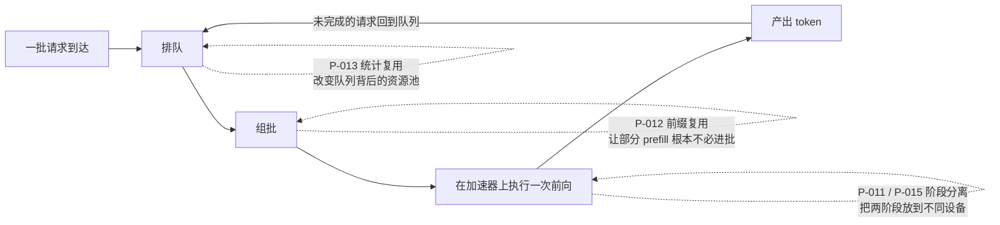

# batching、serving 与调度器论文卡片

> 位置：[InferenceAtlas](../../INDEX.md) > [模块 13 — 论文与技术报告地图](README.md) > 当前文档
> 信息截至：2026-08-10
> 最后核验：2026-08-10
> 内容版本：v0.1
> 时效性等级：中（机制稳定，但「哪条路线是主流」仍在移动）
> 相关主题：[模块 03 — serving 引擎与调度](../03_serving_engines_and_scheduling/)｜[模块 06 — 分布式与 MoE 推理](../06_distributed_and_moe_inference/)｜[本模块第 01 章 — 论文地图](01_paper_map.md)

---

> ⚠️ **降级书写**：本章**未读过任何一篇论文的正文**。
> 每张卡片的「实验设置」与「关键结果」一律为 `待核实`，且**不转述**搜索摘要中的任何数值。
> 完整的证据分级与纪律见 [第 01 章的降级声明](01_paper_map.md)。

## 本章导读

[第 02 章](02_transformer_inference_and_kv_cache_papers.md) 的论文改变的是
步时间方程 $t = (W + B\,S\,k)/\text{BW}$ 的**分子**。本章的论文一个都不改分子——
它们改变的是 $B$ 能取到多少、批里装的是什么、以及请求要等多久才轮到自己。

这条线索的内在张力只有一个：**吞吐要求把批填满，延迟要求别让任何人等**。
每一篇论文都是在这条张力上取一个不同的点：

- **Orca（P-003）** 把组批粒度从「请求」降到「迭代」，让批可以随时进出；
- **Sarathi-Serve（P-010）** 承认批里 prefill 与 decode 混在一起会互相伤害，
  于是把 prefill 切碎，让每次迭代的耗时趋于均匀；
- **DistServe（P-011）／Splitwise（P-015）** 走另一条路：干脆把两阶段拆到不同机器上，
  一个从系统角度、一个从机群与功耗角度；
- **FastServe（P-014）** 引入抢占，让短请求不必排在长请求后面；
- **AlpaServe（P-013）** 把视角从单模型抬到多模型，指出并行化本身可以降低排队；
- **SGLang（P-012）** 则指出请求之间并不独立——共享前缀是可以被复用的。

**这六条路线并不都能同时采用**，其中两组是直接互斥的。本章末尾给出选择判据。

## 卡片索引

| 编号 | 简称 | 它动的是什么 | 官方实现 | 本库对应章节 |
|---|---|---|---|---|
| [P-003](#p-003--orca) | Orca | 组批粒度 | 待核实 | [模块 03 第 2 章](../03_serving_engines_and_scheduling/02_static_dynamic_and_continuous_batching.md) |
| [P-010](#p-010--sarathi-serve) | Sarathi-Serve | 批内构成（时间维） | ✅ 仓库可读 | [模块 03 第 5 章](../03_serving_engines_and_scheduling/05_prefill_decode_scheduling.md) |
| [P-011](#p-011--distserve) | DistServe | 批内构成（空间维） | ✅ 仓库可读 | [模块 06 第 7 章](../06_distributed_and_moe_inference/07_prefill_decode_disaggregation.md) |
| [P-015](#p-015--splitwise) | Splitwise | 机群与机型构成 | 待核实 | [模块 09 第 6 章](../09_datacenter_power_thermal_and_operations/06_cluster_capacity_and_site_planning.md) |
| [P-014](#p-014--fastserve) | FastServe | 服务顺序 | 待核实 | [模块 03 第 4 章](../03_serving_engines_and_scheduling/04_request_scheduling_and_admission_control.md) |
| [P-013](#p-013--alpaserve) | AlpaServe | 资源池的划分方式 | ✅ 仓库可读 | [模块 01 第 3 章](../01_foundations_and_metrics/03_queueing_theory_for_inference.md) |
| [P-012](#p-012--sglang) | SGLang | 请求之间的独立性假设 | ✅ 仓库可读 | [模块 03 第 8 章](../03_serving_engines_and_scheduling/08_prompt_caching_and_prefix_caching.md) |

## 六条路线在同一张图上

**图解读**：

1. **图展示什么**：一条最简 serving 流水线——排队、组批、执行、回队——
   以及六篇论文各自挂载在哪个环节上。虚线表示「修改该环节的策略」，
   而非新增一个流水级。这张图的用途是回答「这两篇论文冲突吗」：
   **挂在同一环节上的往往互斥，挂在不同环节上的往往可叠加。**
2. **核心瓶颈**：瓶颈在 `EXEC` 这一步——加速器一次前向的成本几乎与批内 token 数无关
   （decode 侧的主项是读一遍权重 $W$）。因此**没填满的批就是浪费掉的带宽**，
   而填得太满又会让先到的请求等待后到的请求。整条流水线的所有策略都在处理这一个矛盾。
3. **图中的 trade-off**：`Q` 上的两条虚线（P-014、P-013）改善的是**等待时间**，
   代价是批次饱和度下降或通信开销上升；
   `BATCH` 上的三条改善的是**批次质量**，代价是新增旋钮与实现复杂度；
   `EXEC` 上的一条改善的是**干扰**，代价是引入了 KV 迁移这一全新的链路与失败域。
   三类代价的性质不同：前两类是调优问题，第三类是架构问题——**架构问题不可事后撤销**。
4. **面试如何引用**：被问「你会怎么设计一个 LLM 推理服务的调度器」时，
   照这张图从左到右讲：先讲入队与准入，再讲组批粒度，再讲批内混合，最后才讲要不要拆机器。
   多数候选人一上来就讲 continuous batching，跳过了准入控制——那恰恰是过载时唯一有效的手段。

---

## P-003 — Orca

> 原标题：*Orca: A Distributed Serving System for Transformer-Based Generative Models*

| 字段 | 内容 |
|---|---|
| 书目 | Yu, Gyeong-In; Jeong, Joo Seong; Kim, Geon-Woo; Kim, Soojeong; Chun, Byung-Gon · OSDI 2022 ·（证据类别 B） |
| 一手链接 | https://www.usenix.org/conference/osdi22/presentation/yu |
| 官方实现 | `待核实` — 本库未能确认作者是否发布过官方实现 |

**问题**：传统的请求级批处理要求整批一起进、一起出。
但生成式模型的输出长度差异极大——批里最长的那个请求没结束，
其余请求算完的位置就只能空转。**批越大，浪费越大。**

**背景**：这套批处理范式来自判别式模型的服务经验，
在那里每个请求的计算量基本固定，一起进出没有代价。
生成式模型打破了这个前提。

**机制**（本库可独立论证的部分）：把调度粒度从「一个请求」降到「一次生成迭代」。
每完成一次前向后重新组批：已完成的请求立即离开，等待中的请求立即加入。
由于批内各请求的序列长度不同，注意力算子无法像 FFN 那样直接批处理，
论文因此对不同算子采取差异化处理——**选择性批处理**：
形状无关的算子（FFN、线性层）整批做，形状相关的算子（注意力）分别做。

**它动的是什么**：组批粒度。方程本身不变，但 $B$ 从「一段时间内固定」
变成「每次迭代都可重新取值」。

**为什么这一改变是定性的**（本库论证）：
在请求级批处理下，一个请求占据批位的时长等于**批内最长请求的输出长度**；
在迭代级批处理下，它等于**自己的输出长度**。
当输出长度分布是重尾的（真实 workload 几乎总是如此），
这两者的差距可以很大，而且差距随批大小增加而扩大——
因为批越大，「批内最长」的期望值越高。**这解释了为什么请求级批处理越调越难。**

**实验设置**：`待核实` — 未读原文。
**关键结果**：`待核实` — 未读原文；本库不转述任何吞吐或延迟改善倍数。

**适用边界**（本库论证）：
- 收益随输出长度**方差**增大而增大；定长输出场景收益接近零；
- 迭代级重组批带来每步的调度开销，在极小模型上这一开销可能不再可忽略；
- 它解决的是「等待批内其他人结束」，**不解决**「等待批内的长 prefill 算完」——
  后者由 P-010 处理。

**局限**：
- 作者自述局限：`待核实` — 未读原文。
- 工程视角局限（本库论证）：未系统处理 KV cache 的显存碎片——
  迭代级组批让请求频繁进出，反而**加剧**了碎片问题，这一缺口由 P-004 补上；
  两篇论文因此是配套关系，而不是可以二选一的替代关系；
  论文的实验模型代际早于当代 LLM。

**后续影响**：continuous batching 的原始系统化表述，
当代几乎所有 LLM serving 引擎的调度器都是它的下游
（可由各引擎仓库中 `continuous batching` / `in-flight batching` 的实现直接佐证，
`开源代码/配置披露`）。

**面试讨论角度**：问「continuous batching 为什么能提升吞吐」。
弱回答是「因为批更大」；强回答会指出批大小其实未必变大，
真正变的是**批位的占用时长从「批内最长」变成「自身长度」**。
可以追问：「输出长度全都一样时，continuous batching 还有收益吗？」

**关联文档**：[模块 03 第 2 章](../03_serving_engines_and_scheduling/02_static_dynamic_and_continuous_batching.md)、
[模块 02 第 2 章](../02_transformer_and_kv_cache/02_prefill_vs_decode.md)

---

## P-010 — Sarathi-Serve

> 原标题：*Taming Throughput-Latency Tradeoff in LLM Inference with Sarathi-Serve*

| 字段 | 内容 |
|---|---|
| 书目 | Agrawal, Amey; Kedia, Nitin; Panwar, Ashish; Mohan, Jayashree; Kwatra, Nipun; Gulavani, Bhargav S.; Tumanov, Alexey; Ramjee, Ramachandran · OSDI 2024 ·（**证据类别 A**：作者在官方仓库 README 中给出的 BibTeX） |
| 一手链接 | https://arxiv.org/abs/2403.02310 |
| 官方实现 | [`microsoft/sarathi-serve`](https://github.com/microsoft/sarathi-serve)（`开源代码/配置披露`，核验于 2026-08-10） |

**问题**：continuous batching 让请求可以在迭代边界进出，
但如果某次迭代里包含了一个完整的长 prompt 的 prefill，
这次迭代的耗时会远超普通 decode 步——**批内所有正在生成的请求，
其 ITL 会被同步拉长**。一个用户提交长文档，所有人的输出都会卡一下。

**背景**：这是 Orca 范式暴露出的第二个问题。
第一个问题（等待批内最长请求）已由迭代级调度解决，
但迭代本身的耗时方差成了新的尾延迟来源。

**机制**（本库可独立论证的部分）：给每次迭代设定一个固定的 **token 预算**。
长 prefill 被切成若干块，每次迭代只处理一块；
预算的剩余部分用批内 decode 请求的 token 填满。
于是每次迭代处理的 token 数大致相同，**迭代耗时的方差被压下去**——
论文称之为无停顿调度。

**它动的是什么**：批内构成的**时间维**——
把一个大 prefill 摊到多次迭代里，而不是让它独占一次。

**为什么这是一个好交易**（本库论证）：
prefill 是算力受限的，decode 是带宽受限的
（见 [模块 02 第 2 章](../02_transformer_and_kv_cache/02_prefill_vs_decode.md)）。
把两者装进同一次前向，理论上可以同时吃满两种资源——
这不只是「让延迟均匀」，它同时提高了硬件利用率。
这是本条路线相对于纯粹「给 prefill 限速」的根本优势。

**实验设置**：`待核实` — 未读原文。
**关键结果**：`待核实` — 未读原文；本库不转述任何吞吐、ITL 或 P99 改善数字。

**适用边界**（本库论证）：
- 收益随 prompt 长度**方差**增大而增大。若所有 prompt 都短，本来就没有停顿可消除；
- **块大小是新增旋钮，且两端都有代价**：块太小，每块都要重读一遍权重，
  prefill 自身效率下降；块太大，停顿回归。最优值依赖 prompt 长度分布，**必须实测**；
- 分块改变了注意力的分块边界，与部分 kernel 实现存在耦合，
  并非所有注意力后端都能直接支持。

**局限**：
- 作者自述局限：`待核实` — 未读原文。
- 工程视角局限（本库论证）：它把 TTFT 换成了 ITL——
  长 prompt 的首 token 会来得更慢，因为它的 prefill 被摊开了。
  **如果业务对 TTFT 敏感而对 ITL 不敏感，这个交易方向是错的。**
  这一点在只看平均吞吐的评测里完全看不出来。

**后续影响**：chunked prefill 已成为主流引擎的常见默认或推荐配置
（可由各引擎的配置项与文档源文件佐证，`开源代码/配置披露`）。

**面试讨论角度**：问「chunked prefill 的块大小怎么定」。
好的回答会指出这是一个**双边约束**：下界由 prefill 的权重重读开销决定，
上界由可接受的 ITL 抖动决定，中间的可行区间由 prompt 长度分布决定。
再追问：「它对 TTFT 是好是坏？」——答案是**变坏**，这是很多人答不出来的。

**关联文档**：[模块 03 第 5 章](../03_serving_engines_and_scheduling/05_prefill_decode_scheduling.md)、
[模块 11 第 3 章](../11_benchmarking_reliability_and_observability/03_ttft_tpot_itl_and_end_to_end_latency.md)

---

## P-011 — DistServe

> 原标题：*DistServe: Disaggregating Prefill and Decoding for Goodput-optimized Large Language Model Serving*

| 字段 | 内容 |
|---|---|
| 书目 | Zhong, Yinmin; Liu, Shengyu; Chen, Junda; Hu, Jianbo; Zhu, Yibo; Liu, Xuanzhe; Jin, Xin; Zhang, Hao · OSDI 2024 ·（**证据类别 A**：作者在官方仓库 README 中给出的 BibTeX，其中记为 arXiv 预印本；venue 取自证据类别 B） |
| 一手链接 | https://arxiv.org/abs/2401.09670 |
| 官方实现 | [`LLMServe/DistServe`](https://github.com/LLMServe/DistServe)（`开源代码/配置披露`，核验于 2026-08-10） |

**问题**：与 P-010 同一个问题——prefill 与 decode 互相干扰。
但结论相反：**混在一起就一定会互相伤害，那就别混。**

**背景**：P-010 的路线是「调匀」，本文的路线是「分离」。
两者针对同一矛盾给出互斥的答案，这是本章最值得对比的一组。

**机制**（本库可独立论证的部分）：把 prefill 与 decode 放到**不同的 GPU** 上执行。
prefill 实例算完后把 KV cache 通过互连传给 decode 实例，
后者接手继续生成。由于 TTFT 只由 prefill 侧决定、TPOT 只由 decode 侧决定，
两侧的并行策略、批大小与实例数量都可以**独立**选择。
优化目标也随之改变：从吞吐改为 **goodput**——
即同时满足 TTFT 与 TPOT SLO 的请求速率。

**它动的是什么**：批内构成的**空间维**——两阶段不再共享同一次前向。

**为什么「goodput 而不是吞吐」是关键**（本库论证）：
只报吞吐的系统可以通过无限增大批大小把数字做得很好看，
代价是所有请求的延迟一起劣化。
把 SLO 写进目标函数后，「批大小再往上加会掉 goodput」成为一个可优化的边界，
而不是一个事后才发现的意外。这一点与本库
[模块 11 第 4 章](../11_benchmarking_reliability_and_observability/04_throughput_concurrency_and_goodput.md)
的评测立场一致。

**实验设置**：`待核实` — 未读原文。
**关键结果**：`待核实` — 未读原文；本库不转述任何 goodput 倍数或 SLO 收紧比例。

**适用边界**（本库论证，这条最关键）：
- **可行性由 KV 迁移带宽决定**。每个请求要迁移的字节数约为
  $S_{\text{prompt}} \cdot k \cdot L$（prompt 长度 × 每 token 每层 KV 字节 × 层数），
  这个量随 prompt 长度线性增长。若互连带宽不足，迁移时间会直接计入 TTFT，
  把分离的收益吃光——所以这条路线与高带宽互连**强绑定**
  （见 [模块 08 第 6 章](../08_networking_and_interconnect/06_scale_up_vs_scale_out.md)）；
- **短 prompt、短输出的 workload 上收益可能为负**：干扰本来就小，迁移开销却照付；
- 两侧实例比例由 workload 的输入/输出长度比决定，**该比例会随业务变化漂移**，
  静态划分在流量结构变化时会失配——这是运维上的长期负担。

**局限**：
- 作者自述局限：`待核实` — 未读原文。
- 工程视角局限（本库论证）：引入了一条全新的**失败域**——
  KV 迁移链路的抖动、丢包与拥塞会直接表现为用户可见的延迟毛刺，
  且难以归因（见 [模块 06 第 8 章](../06_distributed_and_moe_inference/08_kv_cache_transfer_and_remote_memory.md)）；
  这是架构级决策，事后撤销的成本远高于调一个块大小。

**后续影响**：PD 分离已成为大规模部署的主流架构选项之一，
主流引擎均已提供相应的实现路径（`开源代码/配置披露`）。

**面试讨论角度**：问「chunked prefill 和 PD 分离，你选哪个」。
这是一道**判断题不是知识题**。好的回答会先问三件事：
互连带宽多少、prompt 长度分布如何、业务对 TTFT 还是 ITL 更敏感。
凡是不问条件直接给答案的，无论选哪个都是错的。

**关联文档**：[模块 06 第 7 章](../06_distributed_and_moe_inference/07_prefill_decode_disaggregation.md)、
[模块 11 第 4 章](../11_benchmarking_reliability_and_observability/04_throughput_concurrency_and_goodput.md)

---

## P-015 — Splitwise

> 原标题：*Splitwise: Efficient Generative LLM Inference Using Phase Splitting*

| 字段 | 内容 |
|---|---|
| 书目 | Patel, Pratyush; Choukse, Esha; Zhang, Chaojie; Shah, Aashaka; Goiri, Íñigo; Maleki, Saeed; Bianchini, Ricardo · ISCA 2024 ·（证据类别 B） |
| 一手链接 | https://dl.acm.org/doi/10.1109/ISCA59077.2024.00019 |
| 官方实现 | `待核实` — 本库未能确认官方实现仓库 |

**问题**：与 P-011 同源，但提问的层级不同——
既然两个阶段对算力与带宽的需求比完全不同，
**那么用同一种机型服务两个阶段，在机群层面一定是浪费的。**

**背景**：这是一篇体系结构会议的论文，视角在机群、机型与功耗预算，
而不是单个 serving 实例的调度器。

**机制**（本库可独立论证的部分）：把 prefill 与 decode 拆到不同的**机器池**，
两池可以选用**不同代际、不同功耗特性的加速器**。
decode 池长期让算力闲置，因此不需要最新代际 GPU 的峰值算力，
可以选择单位成本与单位功耗更优的配置；prefill 池则相反。
两池的机器数按 workload 的输入/输出长度比确定。

**它动的是什么**：机群的机型构成与比例——比 P-011 高一层。

**为什么这一层值得单独讨论**（本库论证）：
在同构机群里，「算力/带宽比」是被机型**一次性锁死**的。
一旦 workload 的两阶段需求比与机型的供给比不匹配，
就必然有一种资源长期闲置，而**闲置的资源仍然占机架空间、仍然耗待机功耗、仍然计入折旧**。
把机型混搭之后，同样的功耗与成本预算下可部署的有效算力结构改变了——
这是一个采购与机房规划问题，不是一个调度问题
（见 [模块 09 第 6 章](../09_datacenter_power_thermal_and_operations/06_cluster_capacity_and_site_planning.md)）。

**实验设置**：`待核实` — 未读原文。
**关键结果**：`待核实` — 未读原文；本库**不转述**任何吞吐、成本或功耗改善倍数。
体系结构论文的这类数字对当时的机型价格与功耗结构高度敏感，转述尤其危险。

**适用边界**（本库论证）：
- 结论依赖**当时的**加速器代际、价格与功耗结构。
  硬件代际更替后必须重算，不能直接引用结论；
- 需要机群规模足够大，混搭才有意义——
  小规模部署下两池都无法达到规模经济，混搭反而增加运维复杂度；
- 与 P-011 一样受 KV 迁移带宽约束，且跨机型池的互连往往比同构池更弱。

**局限**：
- 作者自述局限：`待核实` — 未读原文。
- 工程视角局限（本库论证）：异构机群显著提高运维复杂度——
  两种机型的固件、驱动、故障率与备件库存都要分别管理；
  两池比例对 workload 结构敏感，混合流量下静态划分会失配，
  而机型比例的调整周期以**采购周期**计，远慢于软件配置。

**后续影响**：把两阶段瓶颈差异这一认识从调度层推到了采购与机房规划层，
使「decode 池用上一代加速器」成为一个可以严肃论证的选项。

**面试讨论角度**：问「如果让你规划一个推理机群，你会全买同一种卡吗」。
这道题考察的是候选人能否跳出单机视角。
好的回答会先分解 workload 的输入/输出长度比，
再指出两阶段的资源需求比不同，最后才谈机型——并主动提出互连带宽是可行性前提。

**关联文档**：[模块 09 第 5 章](../09_datacenter_power_thermal_and_operations/05_power_usage_effectiveness_and_energy_modeling.md)、
[模块 09 第 6 章](../09_datacenter_power_thermal_and_operations/06_cluster_capacity_and_site_planning.md)

---

## P-014 — FastServe

> 原标题：*Fast Distributed Inference Serving for Large Language Models*

| 字段 | 内容 |
|---|---|
| 书目 | Wu, Bingyang; Zhong, Yinmin; Zhang, Zili; Huang, Gang; Liu, Xuanzhe; Jin, Xin · arXiv preprint · 2023 ·（证据类别 B） |
| 一手链接 | https://arxiv.org/abs/2305.05920 |
| 官方实现 | `待核实` — 本库未能确认官方实现仓库 |

**问题**：continuous batching 让请求可以随时进出，但服务顺序仍是先来先服务。
一个输出很长的请求会长期占着批位，后到的短请求只能等。
**这正是排队论里 FCFS 的经典缺陷。**

**背景**：调度理论早已给出答案——最短作业优先（SJF）能最小化平均等待时间。
但 SJF 需要预先知道作业长度，而 LLM 的输出长度**事先未知**。

**机制**（本库可独立论证的部分）：利用自回归解码天然存在的 token 级边界实现抢占——
每生成一个 token 就是一个可抢占点。调度器采用**多级反馈队列**（MLFQ）近似 SJF：
已经生成了很多 token 的请求逐级降级，让新来的短请求先走。
论文进一步用 skip-join 策略——新请求按输入长度直接落入合适的优先级，
而不是一律从最高优先级开始逐级下降，以减少降级次数。
被抢占请求的 KV cache 在加速器显存与主机内存之间换出、换入。

**它动的是什么**：出队顺序。

**LLM 特有的代价**（本库论证，这是本卡片的重点）：
传统操作系统里，抢占一个进程要保存的上下文是几十个寄存器，成本可忽略。
LLM 里，被抢占请求的上下文是它的 **KV cache**——数量级在数百 MB 甚至更高，
换出换入要走主机互连。于是抢占频率与链路带宽之间出现一个硬约束：

$$\text{可持续抢占率} \le \frac{\text{链路带宽}}{\text{单请求 KV 字节数}}$$

**链路会先于算力饱和**，这是把经典调度理论搬到 LLM 上时最容易被忽略的一步
（见 [模块 06 第 8 章](../06_distributed_and_moe_inference/08_kv_cache_transfer_and_remote_memory.md)）。

**实验设置**：`待核实` — 未读原文。
**关键结果**：`待核实` — 未读原文；本库不转述任何 JCT 改善倍数。

**适用边界**（本库论证）：
- **抢占以吞吐换延迟**。它会打断已经组好的批，降低平均批饱和度——
  在吞吐优先的离线批处理场景中**不应启用**；
- 收益随输出长度分布的重尾程度增大而增大；
- MLFQ 的参数（队列数、时间片、降级阈值）需按 workload 整定，
  论文未给出通用整定方法（这一点是**本库判断**，非论文自述）。

**局限**：
- 作者自述局限：`待核实` — 未读原文。
- 工程视角局限（本库论证）：抢占引入**饥饿风险**——
  长输出请求可能被反复降级而迟迟无法完成，需要额外的老化机制兜底；
  未见官方开源实现，其工程细节难以核对。

**后续影响**：把「未知服务时间下如何近似 SJF」这一经典调度问题
正式引入 LLM serving，并暴露出 LLM 抢占代价的特殊性。
当代引擎中的抢占/换出机制与优先级调度是这一方向的下游。

**面试讨论角度**：问「LLM 服务里能不能做抢占式调度」。
这题的层次在于：能——因为 token 边界天然是抢占点；
但代价特殊——上下文是数百 MB 的 KV cache 而不是几十个寄存器。
能讲出第二层的候选人很少。

**关联文档**：[模块 03 第 4 章](../03_serving_engines_and_scheduling/04_request_scheduling_and_admission_control.md)、
[模块 01 第 3 章](../01_foundations_and_metrics/03_queueing_theory_for_inference.md)

---

## P-013 — AlpaServe

> 原标题：*AlpaServe: Statistical Multiplexing with Model Parallelism for Deep Learning Serving*

| 字段 | 内容 |
|---|---|
| 书目 | Li, Zhuohan; Zheng, Lianmin; Zhong, Yinmin; Liu, Vincent; Sheng, Ying; Jin, Xin; Huang, Yanping; Chen, Zhifeng; 等 · OSDI 2023 ·（证据类别 B） |
| 一手链接 | https://arxiv.org/abs/2302.11665 |
| 官方实现 | [`alpa-projects/mms`](https://github.com/alpa-projects/mms)（`开源代码/配置披露`，核验于 2026-08-10；该仓库 README 未提供 BibTeX，故书目仍属类别 B） |

**问题**：一台机器要服务多个模型时，直觉做法是「一个模型放一张卡」，
避免模型并行带来的通信开销。但这样一来，
**每个模型只能用自己那张卡的算力**——某个模型突发时它排长队，
而隔壁的卡在空转。

**背景**：当时的共识是「模型并行是为了装下放不下的模型」，
能不用就不用，因为通信开销是纯损失。

**机制**（本库可独立论证的部分）：论文指出模型并行还有第二个理由。
把每个模型切分到多个设备上、让所有设备共同承接所有模型的流量后，
各模型的突发被平摊到一个更大的资源池上——这是排队论里的**统计复用**效应。
系统据此在「并行策略 × 模型放置」的联合空间中搜索配置。

**它动的是什么**：资源池的划分方式——不是调度策略，是拓扑。

**统计复用为什么有效**（本库独立论证）：
$n$ 条互相独立的突发流合并后，总流量的相对波动按 $1/\sqrt{n}$ 量级下降
（方差可加、标准差按 $\sqrt{n}$ 增长，而均值按 $n$ 增长）。
峰均比下降意味着达到同一 SLO 所需的余量下降。
在排队论的等待时间放大因子 $\rho/(1-\rho)$ 中，能安全运行的 $\rho$ 被推高，
于是同样的硬件可以承载更多流量
（见 [模块 01 第 3 章](../01_foundations_and_metrics/03_queueing_theory_for_inference.md)）。
**这个收益与模型并行的通信开销直接竞争**——论文的贡献是指出前者可以大于后者，
而不是断言它总是更大。

**实验设置**：`待核实` — 未读原文。
**关键结果**：`待核实` — 未读原文；本库不转述任何 SLO 达成率或延迟改善数字。

**适用边界**（本库论证）：
- **强依赖设备间互连带宽**。通信开销一旦超过排队收益，结论**反转**——
  同一论证在高带宽域内与跨节点以太网上的适用性完全不同；
- 要求各模型的流量突发**互相独立**。若所有模型被同一个上游事件同时触发
  （例如同一个 agent 流水线里的连续调用），统计复用效应大幅减弱甚至消失；
- 模型数量少时 $1/\sqrt{n}$ 的收益本来就小。

**局限**：
- 作者自述局限：`待核实` — 未读原文。
- 工程视角局限（本库论证，**本条尤其重要**）：论文的实验对象以 OSDI 2023 时点的模型为主，
  早于当代 LLM 的「KV cache 主导型显存占用」。
  在当代 LLM 服务中，显存主要被 KV cache 而非权重吃掉，
  放置问题的**约束结构已经不同**——把结论直接搬过来需要重新论证，不能引用了事。

**后续影响**：确立了「并行化不只为容量，也为排队」这一论点，
是多模型/多租户推理平台做容量规划时的核心论证之一。

**面试讨论角度**：问「为什么要把一个能放进单卡的模型做张量并行」。
标准答案是降低单请求延迟；更深的答案是统计复用——
把多个模型的突发平摊到共享资源池上。
再追问「什么条件下这个论证不成立」，答案是流量不独立、或互连带宽不足。

**关联文档**：[模块 01 第 3 章](../01_foundations_and_metrics/03_queueing_theory_for_inference.md)、
[模块 03 第 10 章](../03_serving_engines_and_scheduling/10_autoscaling_and_load_balancing.md)

---

## P-012 — SGLang

> 原标题：*SGLang: Efficient Execution of Structured Language Model Programs*

| 字段 | 内容 |
|---|---|
| 书目 | Zheng, Lianmin; Yin, Liangsheng; Xie, Zhiqiang; Sun, Chuyue; Huang, Jeff; Yu, Cody Hao; Cao, Shiyi; Kozyrakis, Christos; 等 · NeurIPS 2024 ·（证据类别 B；该项目仓库 README 未提供 BibTeX） |
| 一手链接 | https://arxiv.org/abs/2312.07104 |
| 官方实现 | [`sgl-project/sglang`](https://github.com/sgl-project/sglang)（`开源代码/配置披露`，核验于 2026-08-10） |

**问题**：前面六篇论文都默认请求之间互相独立。
但在 agent、few-shot、多轮对话这类 workload 里，**请求之间大量共享前缀**——
系统却在为每个请求重新算一遍同样的 prefill。

**背景**：把 LLM 调用当作无状态的字符串到字符串的函数，
是从早期 API 服务继承下来的抽象。这个抽象对结构化的 LM 程序不再成立。

**机制**（本库可独立论证的部分）：两条相对独立的贡献。

1. **RadixAttention**：用基数树索引已缓存的 KV 块，
   新请求沿树匹配最长公共前缀并直接复用其 KV，缓存替换按树结构而非按请求进行。
   这一机制**建立在 P-004 的块化 KV 之上**——没有块，就没有可共享的粒度。
2. **压缩状态机加速受约束解码**：把语法约束（如 JSON schema）预编译成状态机。
   当状态机在某段路径上只有唯一合法的后继时，
   这些 token 是**确定的**，无需真正走一次前向即可直接填入
   （见 [模块 05 第 9 章](../05_decoding_and_generation_algorithms/09_structured_output_and_grammar_constrained_decoding.md)）。

**它动的是什么**：请求之间彼此独立这一**假设**本身。

**收益的形状**（本库论证）：
前缀复用把共享前缀的 prefill 算力从「每个请求各算一次」降为「整棵树上算一次」。
对一个有 $n$ 个请求共享长度为 $S_p$ 的前缀的场景，
被消去的 prefill 工作量正比于 $(n-1)\,S_p$ —— **随并发数线性增长**。
这是本章所有机制里收益增长最快的一个，前提是共享确实存在。

**实验设置**：`待核实` — 未读原文。
**关键结果**：`待核实` — 未读原文；本库不转述任何吞吐倍数。

**适用边界**（本库论证）：
- **收益完全取决于 workload 的前缀共享度**。
  无共享前缀时它退化为普通 serving，并额外承担基数树的维护成本——**净收益为负**；
- 缓存命中率随显存容量与驱逐策略变化，是一个典型的缓存问题：
  容量不足时树会被反复驱逐重建，命中率坍塌；
- 受约束解码的加速幅度取决于语法的**确定性程度**：
  自由文本字段多的 schema 收益小，枚举与固定键名多的 schema 收益大。

**局限**：
- 作者自述局限：`待核实` — 未读原文。
- 工程视角局限（本库论证）：跨请求共享 KV 在多租户环境下需要明确隔离边界——
  共享意味着一个租户的缓存状态会影响另一个租户的时延，
  这在原理上构成一条侧信道，需要按租户分区或显式授权
  （见 [模块 03 第 6 章](../03_serving_engines_and_scheduling/06_multi_tenant_isolation_and_qos.md)）；
  基数树的维护与驱逐策略本身也成为一个需要观测的子系统。

**后续影响**：前缀复用现已是主流引擎的通用能力
（在不同项目里分别称作 prefix caching、RadixAttention、KV cache reuse——
**同一机制的三个名字**，见 [模块 12 第 1 章](../12_open_source_deployment_and_reproduction/01_open_source_inference_ecosystem.md)）。

**面试讨论角度**：问「agent workload 的推理成本为什么可以显著低于表面 token 数」。
好的回答会指出多轮之间的前缀高度重叠，
被复用的 prefill 随轮数线性累积；
再追问「什么情况下前缀复用反而是负收益」——答案是无共享 workload 加上树维护开销。

**关联文档**：[模块 03 第 8 章](../03_serving_engines_and_scheduling/08_prompt_caching_and_prefix_caching.md)、
[模块 12 第 3 章](../12_open_source_deployment_and_reproduction/03_sglang.md)

---

## 本章小结：七条路线怎么选

把这七篇论文放在一起，可以得到一份**互斥与叠加**的判据表。
这是本章最有工程价值的产出。

| 组合 | 关系 | 判据 |
|---|---|---|
| P-003 + 其余全部 | **前提** | 迭代级调度是所有后续工作的基础，没有可选项 |
| P-004 + P-012 | **强依赖** | 前缀复用需要块化 KV 才有共享粒度 |
| P-010 vs P-011/P-015 | **基本互斥** | 「调匀」与「分离」是同一矛盾的两个答案；按互连带宽、prompt 长度分布、TTFT/ITL 敏感度三者选 |
| P-011 vs P-015 | **同一路线的两个层级** | P-011 是系统架构，P-015 是机群与机型；大规模部署两者叠加 |
| P-014 + P-010 | **张力** | 抢占打断批次，chunked prefill 依赖稳定的 token 预算；同时启用需要重新整定两侧参数 |
| P-013 + 其余 | **正交但需重新论证** | 其论证建立在权重主导显存的前提上，当代 LLM 由 KV cache 主导，须重推 |
| P-012 + 其余全部 | **正交，优先做** | 不牺牲质量、不改变架构，只要 workload 有共享前缀就是净收益 |

**一条实用的排序**：先确认 P-003 的迭代级调度已在位，
再上 P-004（消除浪费）与 P-012（消除重复计算）——这两项不牺牲质量、不改变架构；
之后才在 P-010 与 P-011 之间做架构判断；
P-014 与 P-013 属于特定条件下才值得引入的选项。

本章全部七张卡片的「实验设置」与「关键结果」均为 `待核实`，
理由见 [第 01 章的降级声明](01_paper_map.md)。
上表的每一条关系判据都来自机制的形状，而非论文的实验数字——
按 [第 01 章 §4](01_paper_map.md) 的分界，它们属于「可以从机制推导」的那一列。

## 关键术语

| 中文术语 | 英文 | 定义 | 单位/口径 | 关联文档 |
|---|---|---|---|---|
| 迭代级调度 | iteration-level scheduling | 以一次生成迭代为粒度重新组批 | — | [模块 03 第 2 章](../03_serving_engines_and_scheduling/02_static_dynamic_and_continuous_batching.md) |
| 选择性批处理 | selective batching | 对形状无关算子整批处理、对形状相关算子分别处理 | — | 本章 P-003 |
| 生成停顿 | generation stall | 批内出现长 prefill 导致同批 decode 请求 ITL 被同步拉长 | s | 本章 P-010 |
| 无停顿调度 | stall-free scheduling | 通过固定每迭代 token 预算使迭代耗时趋于均匀 | — | 本章 P-010 |
| goodput | goodput | 同时满足各项延迟 SLO 的请求速率，区别于原始吞吐 | req/s | [模块 11 第 4 章](../11_benchmarking_reliability_and_observability/04_throughput_concurrency_and_goodput.md) |
| 统计复用 | statistical multiplexing | 合并多条独立突发流以降低总体峰均比 | — | [模块 01 第 3 章](../01_foundations_and_metrics/03_queueing_theory_for_inference.md) |
| 多级反馈队列 | multi-level feedback queue | 以逐级降级近似最短作业优先的调度算法 | — | [模块 03 第 4 章](../03_serving_engines_and_scheduling/04_request_scheduling_and_admission_control.md) |
| 基数树 KV 复用 | RadixAttention | 用基数树索引已缓存 KV 块以复用跨请求公共前缀 | — | [模块 03 第 8 章](../03_serving_engines_and_scheduling/08_prompt_caching_and_prefix_caching.md) |

## 延伸阅读

- [本模块第 01 章 — 论文地图](01_paper_map.md)：本章卡片在整体地图中的位置
- [本模块第 02 章 — Transformer 推理与 KV cache 论文](02_transformer_inference_and_kv_cache_papers.md)：本章各机制所依赖的显存前提
- [模块 03 第 12 章 — serving 事故手册](../03_serving_engines_and_scheduling/12_serving_incident_playbook.md)：这些机制出问题时长什么样
- [模块 12 第 12 章 — 可复现实验手册](../12_open_source_deployment_and_reproduction/12_reproduction_playbooks.md)：把本章「必须实测」的项跑起来
- [`code/reproduction_toolkit.py`](../../code/reproduction_toolkit.py)：`queueing_amplification`、`b_slo`、`comm_share_of_tpot` 可验算本章的排队与通信结论

## 主要来源

| 来源 | 类型 | 用途 | 披露标签 | 核验日期 |
|---|---|---|---|:---:|
| [`microsoft/sarathi-serve` README](https://github.com/microsoft/sarathi-serve) | 作者提供的 BibTeX | P-010 书目 | `开源代码/配置披露` | 2026-08-10 |
| [`LLMServe/DistServe` README](https://github.com/LLMServe/DistServe) | 作者提供的 BibTeX | P-011 书目 | `开源代码/配置披露` | 2026-08-10 |
| [`sgl-project/sglang`](https://github.com/sgl-project/sglang) | 官方实现仓库 | P-012 实现存在性 | `开源代码/配置披露` | 2026-08-10 |
| [`alpa-projects/mms`](https://github.com/alpa-projects/mms) | 官方实现仓库 | P-013 实现存在性 | `开源代码/配置披露` | 2026-08-10 |
| WebSearch 书目检索 | 二级来源 | P-003、P-012、P-013、P-014、P-015 的书目字段与 P-011 的 venue | `待核实` | 2026-08-10 |
| 本库模块 01、03、06、09 的推导 | 本仓库自有推导 | 各卡片的排队/带宽论证、适用边界与互斥判据表 | — | 2026-08-10 |
| 各论文正文 | 一手来源 | **未读**——出口策略拒绝，见 [AGENTS.md 第 11 节](../../AGENTS.md) | `待核实` | — |

## 更新记录

| 日期 | 版本 | 变更 | 核验人 |
|---|---|---|---|
| 2026-08-10 | v0.1 | 初稿：P-003、P-010、P-011、P-012、P-013、P-014、P-015 七张降级卡片，含流水线挂载图与互斥/叠加判据表 | — |
