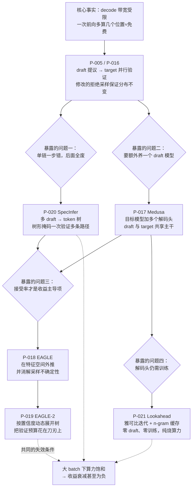

# 投机解码论文卡片

> 位置：[InferenceAtlas](../../INDEX.md) > [模块 13 — 论文与技术报告地图](README.md) > 当前文档
> 信息截至：2026-08-10
> 最后核验：2026-08-10
> 内容版本：v0.1
> 时效性等级：中（框架已稳定，draft 构造方式仍在快速演化）
> 相关主题：[模块 05 — 解码与生成算法](../05_decoding_and_generation_algorithms/)｜[模块 02 第 2 章 — prefill vs decode](../02_transformer_and_kv_cache/02_prefill_vs_decode.md)｜[本模块第 01 章 — 论文地图](01_paper_map.md)

---

> ⚠️ **降级书写**：本章**未读过任何一篇论文的正文**。
> 每张卡片的「实验设置」与「关键结果」一律为 `待核实`，且**不转述**搜索摘要中的任何数值
> ——包括那些在摘要里反复出现的加速比。
> 完整的证据分级与纪律见 [第 01 章的降级声明](01_paper_map.md)。

## 本章导读

投机解码是本库覆盖的所有推理优化里**逻辑最漂亮、也最容易被误用**的一类。

漂亮在于它的立足点是一个可以精确陈述的事实：decode 阶段是带宽受限的，
一次前向的时间主要花在把权重 $W$ 从显存读进来，
而**在这一次读取里顺便多算几个位置，几乎不增加时间**。
于是「用算力换步数」成了一笔明显划算的交易。

误用在于这笔交易的前提——**必须真的有闲置算力**。
一旦并发上来、算力接近饱和，同样的交易变成纯亏损：
多算的那些位置要和别的请求抢算力，而省下的步数补不回来。
按本库 [模块 05 第 4 章](../05_decoding_and_generation_algorithms/04_speculative_decoding.md)
的加速比模型，这个转折点是可以事先算出来的，而不是上线之后才发现的。

本章七张卡片沿一条清晰的演化线索排列，**每一步都在回答上一步暴露出的问题**：

1. **P-005 / P-016** 确立框架，并证明输出分布可以严格不变；
2. **P-020** 指出单条候选链太脆弱，改成候选**树**；
3. **P-017** 指出维护一个独立 draft 模型太贵，改成从目标模型自身长出 draft；
4. **P-018 / P-019** 指出接受率才是收益的主导因子，转而提高 draft 的准确度；
5. **P-021** 指出连训练 draft 都不必——把解码本身当方程组来解。

## 卡片索引

| 编号 | 简称 | draft 从哪来 | 官方实现 | 演化线索上的位置 |
|---|---|---|---|---|
| [P-005](#p-005--speculative-decoding) | Speculative Decoding | 独立小模型 | 待核实 | 框架 |
| [P-016](#p-016--speculative-sampling) | Speculative Sampling | 独立小模型 | 待核实 | 框架（同期独立） |
| [P-020](#p-020--specinfer) | SpecInfer | 多个小模型 → 树 | 待核实 | 单链 → 树 |
| [P-017](#p-017--medusa) | Medusa | 目标模型的额外头 | ✅ 仓库可读 | 去掉独立 draft |
| [P-018](#p-018--eagle) | EAGLE | 特征级轻量 draft | ✅ 仓库可读 | 提高接受率 |
| [P-019](#p-019--eagle-2) | EAGLE-2 | 同上 + 动态树 | ✅ 同上仓库 | 优化验证预算分配 |
| [P-021](#p-021--lookahead-decoding) | Lookahead Decoding | 无 draft（雅可比迭代） | ✅ 仓库可读 | 去掉 draft 本身 |

## 一张图看清这条演化线

**图解读**：

1. **图展示什么**：从「decode 带宽受限」这一个事实出发，
   展示投机解码框架如何被确立，以及它随后暴露的四个问题
   分别催生了哪一支后续工作。菱形节点是**问题**，不是方法——
   这张图的组织依据是「谁在回答谁」，而不是发表时间。
2. **核心瓶颈**：根节点就是全部前提。
   投机解码不创造算力，它只是把**闲置的算力**换成更少的串行步数。
   因此真正的瓶颈永远是「还有没有闲置算力」，
   而不是 draft 有多准——draft 再准，没有闲置算力也无从兑现。
3. **图中的 trade-off**：右下角的虚线汇聚点是本图最重要的部分。
   **这一整族方法共享同一个失效条件**：批处理本身已经在摊薄权重读取，
   当 $B\,S\,k$ 项开始与 $W$ 项可比时，算力逼近饱和，
   多算的位置不再免费。此时全族方法的收益一起衰减——
   **它们不是互为备份的，而是同生共死的**。
   与之相对，各方法之间的差异（draft 从哪来、树怎么展开）
   只影响收益的大小，不影响收益存在与否。
4. **面试如何引用**：被问「投机解码为什么有效」时，只讲 draft-verify 是不够的。
   讲这张图的根节点与虚线汇聚点——**前提是什么、什么时候失效**——
   才能显示你理解的是机制而不是流程。
   一个很好的自证方式是主动说出「在我们的高并发场景下我会先关掉它，再用公式算什么时候值得开」。

---

## P-005 — Speculative Decoding

> 原标题：*Fast Inference from Transformers via Speculative Decoding*

| 字段 | 内容 |
|---|---|
| 书目 | Leviathan, Yaniv; Kalman, Matan; Matias, Yossi · ICML 2023 ·（证据类别 B） |
| 一手链接 | https://arxiv.org/abs/2211.17192 |
| 官方实现 | `待核实` — 本库未能确认作者是否发布过官方实现 |

**问题**：自回归解码逐 token 串行，每个 token 都要付一次完整的权重读取代价。
而这次读取的成本与「本次前向算多少个位置」几乎无关——
**串行性本身，而不是计算量，才是延迟的来源。**

**背景**：此前降低 decode 延迟的手段主要是把模型做小（蒸馏、剪枝、量化），
代价是质量下降。本文提出的路线**不改变输出分布**。

**机制**（本库可独立论证的部分）：一个便宜的 draft 模型自回归产生 $k$ 个候选 token；
目标模型对这 $k+1$ 个位置做**一次**前向，并行得到每个位置的分布；
然后按修改的拒绝采样规则从左到右判定：接受与否取决于两个模型在该位置的概率之比，
一旦拒绝就在该位置按一个修正后的分布重采样并丢弃其后全部候选。

**关键性质是分布不变性**：这套接受/重采样规则被设计成使最终输出
与「直接从目标模型采样」**同分布**。
所以投机解码不是一个近似方法——它不牺牲任何质量，这是它与量化、剪枝的根本区别。

**它打的是方程里的哪一项**：每次前向产出的 token 数。
步时间 $t$ 不变，但产出 $n$ 个 token 所需的前向次数从 $n$ 降到 $n/\bar{a}$
（$\bar{a}$ 为平均接受长度）。

**收益的形状**（本库独立推导）：
设接受率为 $\alpha$、每次提议 $k$ 个、draft 相对 target 的成本比为 $r$，
则理想情况下的加速比可写为

$$\text{speedup} = \frac{(1-\alpha^{k+1})/(1-\alpha)}{k\,r + 1}$$

分子是期望接受长度，分母是「$k$ 次 draft 前向 + 1 次 target 前向」的相对成本。
这个式子的两个推论都很重要：
**其一，加速比可以小于 1**——当 $r$ 偏大而 $\alpha$ 偏低时启用它会让系统变慢；
**其二，$k$ 存在最优值**——分子随 $k$ 次线性饱和而分母线性增长，
所以一味加大提议长度是错的。
详细数值表见 [模块 05 第 4 章](../05_decoding_and_generation_algorithms/04_speculative_decoding.md)。

**实验设置**：`待核实` — 未读原文。
**关键结果**：`待核实` — 未读原文；本库不转述任何加速比或接受率数字。

**适用边界**（本库论证）：
- **前提是 target 前向仍有闲置算力**。大 batch 下算力接近饱和时收益显著缩小甚至为负；
- 收益随任务的可预测性上升。代码补全、结构化输出这类低熵任务接受率高，
  开放式创作接受率低；
- 需要一个与目标模型**词表兼容**的 draft 模型，这在工程上不总是现成的。

**局限**：
- 作者自述局限：`待核实` — 未读原文。
- 工程视角局限（本库论证）：额外的 draft 模型带来显存与运维成本；
  与 continuous batching 共存时，批内各请求的接受长度不同，
  会导致每步实际推进的 token 数不齐，调度与 KV 分配都变复杂；
  它**用能耗换时延**——总算力消耗上升，在按能耗计费的场景下需要单独核算。

**后续影响**：本章其余全部卡片都是这一框架的下游。

**面试讨论角度**：问「投机解码会不会降低生成质量」。
标准答案是不会，因为拒绝采样规则保证分布不变。
真正的追问在后面：「那它的代价是什么？」——答案是算力与能耗，不是质量。
再追问「什么时候不该开」——答案是算力已经饱和的时候。

**关联文档**：[模块 05 第 4 章](../05_decoding_and_generation_algorithms/04_speculative_decoding.md)、
[模块 05 第 6 章](../05_decoding_and_generation_algorithms/06_draft_model_selection_and_acceptance_rate.md)

---

## P-016 — Speculative Sampling

> 原标题：*Accelerating Large Language Model Decoding with Speculative Sampling*

| 字段 | 内容 |
|---|---|
| 书目 | Chen, Charlie; Borgeaud, Sebastian; Irving, Geoffrey; Lespiau, Jean-Baptiste; Sifre, Laurent; Jumper, John · arXiv preprint · 2023 ·（证据类别 B） |
| 一手链接 | https://arxiv.org/abs/2302.01318 |
| 官方实现 | `待核实` — 本库未能确认作者是否发布过官方实现 |

**问题**：与 P-005 相同。

**背景**：两组人在同一时期**独立**给出了等价的框架。
这一点本身值得当作阅读方法上的提示。

**机制**（本库可独立论证的部分）：draft 模型提议、target 模型并行打分、
修改的拒绝采样保证分布不变——与 P-005 是同一套框架。
本文额外强调该分布不变性在**有限精度算术**下依然成立，
即实现中的浮点误差不会让它退化成一个近似方法。

**它打的是方程里的哪一项**：与 P-005 相同。

**为什么要把两篇都读**（本库观点）：
同一个算法被两组人用不同语言描述，交叉阅读能帮你分清
**哪些是框架本身的性质**（分布不变性、接受率与加速比的关系），
**哪些只是某一次实现的选择**（提议长度、draft 模型规模、批处理方式）。
在只读一篇时，这两类内容很容易被当成一体，
于是「论文里 $k$ 取多少」被误当成「$k$ 应该取多少」。

**实验设置**：`待核实` — 未读原文。
**关键结果**：`待核实` — 未读原文；本库不转述任何加速比、模型规模或分布式配置。

**适用边界**（本库论证）：与 P-005 完全一致——
本质上是同一框架的两次陈述，其适用条件也就是同一组。

**局限**：
- 作者自述局限：`待核实` — 未读原文。
- 工程视角局限（本库论证）：同 P-005；未见官方开源实现，
  工程细节需参考社区实现，而社区实现与论文的差异需要自行核对。

**后续影响**：与 P-005 共同构成了整个方向的起点。
后续文献引用时常并列二者，这也是判断一篇后续工作是否读过原始文献的一个信号。

**面试讨论角度**：这张卡片本身不适合单独提问。
但它适合用来回答「你怎么读论文」——
指出同期独立工作的存在，并说明交叉阅读能分离「框架性质」与「实现选择」，
比复述任何一篇的内容更能显示方法论。

**关联文档**：[模块 05 第 4 章](../05_decoding_and_generation_algorithms/04_speculative_decoding.md)

---

## P-020 — SpecInfer

> 原标题：*SpecInfer: Accelerating Generative Large Language Model Serving with Tree-based Speculative Inference and Verification*

| 字段 | 内容 |
|---|---|
| 书目 | Miao, Xupeng; 等（**完整作者名单 `待核实`**）· ASPLOS 2024 ·（证据类别 B） |
| 一手链接 | https://dl.acm.org/doi/10.1145/3620666.3651335 |
| 官方实现 | `待核实` — FlexFlow 系仓库的 README 未给出本文的引用，本库无法确认哪个仓库是官方实现 |

**问题**：单条候选链有一个结构性弱点——**一步错，其后全废**。
若在第 2 个位置就被拒绝，第 3 到第 $k$ 个候选的计算全部白费，
而这些计算是已经付过的。

**背景**：P-005/P-016 的框架里，draft 产出的是一条线性序列。

**机制**（本库可独立论证的部分）：让多个小型投机模型同时提议，
把所有候选组织成一棵 **token 树**：树上每条从根到叶的路径都是一个候选序列。
关键在于验证——通过构造合适的注意力掩码，
使目标模型**一次前向**就能并行地为树上所有节点打分，
再按拒绝采样规则选出最长的可接受路径。

**它打的是方程里的哪一项**：仍是「每次前向产出的 token 数」，
但把这个量的分布从「一条链的接受长度」改成「一族路径中的最长接受长度」——
后者的期望严格更高。

**为什么树是对的方向**（本库论证）：
单链的期望接受长度受限于「每一步都必须猜对」。
树把每一步的多个可能取值都覆盖上，于是每一步猜错的概率下降。
代价是验证时要处理的 token 数增加——
**这把「投机深度 $k$」一个旋钮，扩展成了「深度 × 宽度」两个旋钮**，
并且把验证成本变成一个可以显式分配的算力预算。
后续 Medusa 与 EAGLE 系列的树形验证，都在这个框架里。

**实验设置**：`待核实` — 未读原文。
**关键结果**：`待核实` — 未读原文；本库不转述任何加速比或实验规模。

**适用边界**（本库论证）：
- 树宽增加会**线性**抬高验证所需的算力，而期望接受长度的增益是**递减**的——
  因此存在最优树规模，盲目加宽会翻车；
- 在算力已接近饱和的大 batch 场景下，加宽的成本立刻显性化，收益反转更早发生；
- 多个 draft 模型带来叠加的显存与维护成本。

**局限**：
- 作者自述局限：`待核实` — 未读原文。
- 工程视角局限（本库论证）：树形注意力掩码需要 kernel 支持，
  并非所有注意力后端都能直接跑；
  变长、变形的验证批与 continuous batching 的调度耦合紧密；
  本卡片的**作者名单与官方实现均未能核实**，这一点已如实记入
  [`data/papers.csv`](../../data/papers.csv)。

**后续影响**：确立了「树形投机 + 一次前向并行验证」这一组件，
此后几乎所有投机解码工作都默认使用树而非单链。

**面试讨论角度**：问「投机解码的提议长度应该设多大」。
好的回答会先指出这不是一维问题——树形投机下是深度与宽度两个维度，
再指出两者都存在边际收益递减，最优点由「验证算力预算」这一约束决定。

**关联文档**：[模块 05 第 5 章](../05_decoding_and_generation_algorithms/05_medusa_eagle_and_multi_token_prediction.md)、
[模块 05 第 6 章](../05_decoding_and_generation_algorithms/06_draft_model_selection_and_acceptance_rate.md)

---

## P-017 — Medusa

> 原标题：*Medusa: Simple LLM Inference Acceleration Framework with Multiple Decoding Heads*

| 字段 | 内容 |
|---|---|
| 书目 | Cai, Tianle; Li, Yuhong; Geng, Zhengyang; Peng, Hongwu; Lee, Jason D.; Chen, Deming; Dao, Tri · arXiv preprint · 2024 ·（**证据类别 A**：作者在官方仓库 README 中给出的 BibTeX） |
| 一手链接 | https://arxiv.org/abs/2401.10774 |
| 官方实现 | [`FasterDecoding/Medusa`](https://github.com/FasterDecoding/Medusa)（`开源代码/配置披露`，核验于 2026-08-10） |

**问题**：draft-verify 框架要求你**有一个合适的 draft 模型**——
词表要兼容、质量要够高、成本要够低、还要单独部署和维护。
对多数团队来说，这个前提比算法本身更难满足。

**背景**：这是投机解码从「论文里成立」走向「生产里可用」的主要障碍。

**机制**（本库可独立论证的部分）：不要独立的 draft 模型，
改为在目标模型最后一层隐状态上并联若干个轻量解码头，
第 $i$ 个头负责预测第 $i$ 个未来位置。
一次前向即可同时得到当前 token 与多个候选后续 token；
各头的 top-$k$ 候选组合成树，再由目标模型一次前向并行验证。

**它动的是什么**：draft 的来源——从「另一个模型」变成「同一个模型的额外输出」。
**draft 与 target 共享主干计算**，因此 draft 的边际成本只剩下解码头本身。

**为什么这一步在工程上分量很重**（本库论证）：
在 P-005 的加速比公式里，$r$（draft 相对成本）是分母里的关键项。
自投机把 $r$ 压到接近零——不需要第二次权重读取，
因为主干那一次前向本来就要做。
更重要的是**部署形态变了**：不再需要维护第二个模型的版本、显存与扩缩容，
整个方案退化成「模型多了几个头」。

**实验设置**：`待核实` — 未读原文。
**关键结果**：`待核实` — 未读原文；本库不转述任何加速比或接受率数字。

**适用边界**（本库论证）：
- 解码头需要**训练**——这是模型侧改造，不是纯部署侧改造。
  拿到别人的权重就想用，需要对方已经训好了头；
- 树形验证一次前向要处理更多 token，仍属**用算力换步数**，
  大 batch 下的失效条件与全族一致；
- 头数与各头 top-$k$ 是新增旋钮，需按任务整定。

**局限**：
- 作者自述局限：`待核实` — 未读原文。
- 工程视角局限（本库论证，**本条值得注意**）：draft 与 target 共享主干，
  意味着两者的**错误是相关的**——主干在某个上下文上没把握时，
  解码头大概率也没把握。这与独立 draft 模型的错误结构不同，
  其对接受率的实际影响需要按模型实测，不能假定与独立 draft 同等。

**后续影响**：确立了「自投机」这一支，
使投机解码的部署门槛从「找一个 draft 模型」降为「训几个头」。

**面试讨论角度**：问「Medusa 相比经典投机解码省掉了什么」。
浅层答案是「省掉了 draft 模型」；
深层答案要指出它把加速比公式里的 $r$ 压到接近零，
同时把部署形态从两个模型简化为一个模型——**后者往往是决定能否上线的因素**。

**关联文档**：[模块 05 第 5 章](../05_decoding_and_generation_algorithms/05_medusa_eagle_and_multi_token_prediction.md)

---

## P-018 — EAGLE

> 原标题：*EAGLE: Speculative Sampling Requires Rethinking Feature Uncertainty*

| 字段 | 内容 |
|---|---|
| 书目 | Li, Yuhui; Wei, Fangyun; Zhang, Chao; Zhang, Hongyang · ICML 2024 ·（**证据类别 A**：作者在官方仓库 README 中给出的 BibTeX；arXiv 编号经检索核对） |
| 一手链接 | https://arxiv.org/abs/2401.15077 |
| 官方实现 | [`SafeAILab/EAGLE`](https://github.com/SafeAILab/EAGLE)（`开源代码/配置披露`，核验于 2026-08-10） |

**问题**：Medusa 把 draft 的**成本**压到了接近零，
但收益还有另一半来自**接受率**。
在加速比公式的分子里，$\alpha$ 以幂次形式出现——它比 $r$ 更敏感。
**所以下一步应该攻接受率。**

**背景**：各种 draft 都在 token 空间做预测。
token 是离散的、由采样决定的，序列在 token 空间里并不平滑。

**机制**（本库可独立论证的部分）：改在**特征空间**做自回归。
draft 不直接预测下一个 token，而是预测目标模型倒数第二层的特征向量序列，
再交给目标模型自身的输出头把特征转成 token 分布——
这样 draft 可以很小，因为它不必自己学一个语言模型头。

关键的困难在标题里：**特征外推有不确定性**。
下一个特征取决于当前位置实际**采样出**了哪个 token，
而采样是随机的。若只用特征递推，这一随机性无从消解。
本文的做法是把「已经确定的 token」也作为 draft 的输入，
使特征外推以实际采样结果为条件。

**它动的是什么**：draft 的预测空间——从离散 token 换成连续特征，
目标是提高接受率。

**为什么这个方向的杠杆更大**（本库论证）：
把 P-005 的加速比分子 $(1-\alpha^{k+1})/(1-\alpha)$ 对 $\alpha$ 求导可知，
$\alpha$ 越接近 1，期望接受长度的增长越陡。
相比之下，$r$ 出现在分母里且已被自投机压到很小，
继续压 $r$ 的边际收益有限。
**所以在 Medusa 之后，攻接受率是唯一还剩下的大杠杆**——
这条推理不需要任何论文数据即可得出。

**实验设置**：`待核实` — 未读原文。
**关键结果**：`待核实` — 未读原文；本库不转述任何接受率或加速比数字。

**适用边界**（本库论证）：
- draft 需要针对**具体目标模型**训练——换模型即需重训，
  这一点与 Medusa 相同，都是模型侧工作；
- 依赖目标模型的内部特征，因此与任何改变特征分布的手段
  （量化、蒸馏、继续微调）存在潜在冲突，
  冲突的实际影响需实测；
- 大 batch 下的失效条件与全族一致。

**局限**：
- 作者自述局限：`待核实` — 未读原文。
- 工程视角局限（本库论证）：训练 draft 需要访问目标模型的中间层输出，
  在只提供推理接口的场景下不可行；
  特征级 draft 与目标模型的版本强绑定，模型更新时 draft 必须一起更新，
  这是一条容易被忽略的运维依赖。

**后续影响**：确立了「在特征空间做 draft」这一支，
并把研究重心从「降低 draft 成本」正式转向「提高接受率」。

**面试讨论角度**：问「Medusa 之后，投机解码还能往哪优化」。
好的回答会先写出加速比公式，指出 $r$ 已被压到很小、
而 $\alpha$ 在分子里以幂次出现，因此杠杆在接受率；
再讲 EAGLE 的特征空间路线是这个判断的一个具体实现。

**关联文档**：[模块 05 第 5 章](../05_decoding_and_generation_algorithms/05_medusa_eagle_and_multi_token_prediction.md)、
[模块 05 第 6 章](../05_decoding_and_generation_algorithms/06_draft_model_selection_and_acceptance_rate.md)

---

## P-019 — EAGLE-2

> 原标题：*EAGLE-2: Faster Inference of Language Models with Dynamic Draft Trees*

| 字段 | 内容 |
|---|---|
| 书目 | Li, Yuhui; Wei, Fangyun; Zhang, Chao; Zhang, Hongyang · EMNLP 2024 ·（**证据类别 A**：作者在官方仓库 README 中给出的 BibTeX；arXiv 编号经检索核对） |
| 一手链接 | https://arxiv.org/abs/2406.16858 |
| 官方实现 | [`SafeAILab/EAGLE`](https://github.com/SafeAILab/EAGLE)（`开源代码/配置披露`，核验于 2026-08-10；与 P-018 同一仓库，README 另列有 EAGLE-3 的 BibTeX，记为 NeurIPS 2025） |

**问题**：树形投机用的是**固定形状**的候选树——
不论上下文好猜还是难猜，都展开同样多的分支。
这显然是浪费：容易的位置本来一条分支就够，难的位置多给几条才有用。

**背景**：P-020 引入了树，但没有回答「树应该长什么样」。

**机制**（本库可独立论证的部分）：把树的展开变成**动态**的，
用 draft 模型自身的置信度作为信号：
高置信的位置往深里展开，低置信的位置早早剪枝。
在同样的验证 token 预算下，让预算流向更可能被接受的分支。

**它动的是什么**：验证算力预算的**分配方式**。
不改变 draft 的质量，也不改变总预算，只改变预算怎么花。

**为什么这是一个约束优化问题**（本库论证）：
一次前向能验证的 token 数受算力预算约束，记为 $N$。
目标是在「树的节点数 $\le N$」的约束下最大化期望接受长度。
若各分支的接受概率可估计，这就是一个标准的预算分配问题——
应该优先把节点分配给边际期望收益最高的分支。
**用 draft 置信度近似接受概率**，正是让这个问题变得可解的那一步。
这也解释了本方法的隐含前提：**置信度必须与真实接受概率相关**。

**实验设置**：`待核实` — 未读原文。
**关键结果**：`待核实` — 未读原文；本库不转述任何加速比数字。

**适用边界**（本库论证）：
- 隐含前提是 draft 置信度与真实接受概率相关。
  若 draft 过度自信（校准差），动态展开会把预算花在错的地方，效果劣于静态树；
- 动态树使每步的验证 token 数**可变**，
  这与固定形状的 CUDA graph 捕获、静态 kernel 存在张力
  （见 [模块 04 第 10 章](../04_compilers_runtimes_and_kernels/10_cuda_graphs_and_execution_overhead.md)）——
  灵活性的收益可能被执行开销吃掉一部分；
- 大 batch 下的失效条件与全族一致。

**局限**：
- 作者自述局限：`待核实` — 未读原文。
- 工程视角局限（本库论证）：变长验证批与 continuous batching 的调度耦合更紧，
  批内各请求的树形状不同会让批的形状难以规整；
  工程复杂度明显高于静态树，收益是否值得这份复杂度需按场景判断。

**后续影响**：把「树形状」确立为一个应当被优化的对象，
而不是一个拍脑袋定下的超参。同一仓库中另有 EAGLE-3（记为 NeurIPS 2025），
本库尚未建卡。

**面试讨论角度**：问「候选树该怎么构造」。
好的回答会把它表述为**固定验证预算下的分配问题**，
并指出用 draft 置信度做代理信号的前提是置信度校准良好——
能主动提到「校准」这个词的候选人很少。

**关联文档**：[模块 05 第 5 章](../05_decoding_and_generation_algorithms/05_medusa_eagle_and_multi_token_prediction.md)

---

## P-021 — Lookahead Decoding

> 原标题：*Break the Sequential Dependency of LLM Inference Using Lookahead Decoding*

| 字段 | 内容 |
|---|---|
| 书目 | Fu, Yichao; Bailis, Peter; Stoica, Ion; Zhang, Hao · arXiv preprint · 2024 ·（**证据类别 A**：作者在官方仓库 README 中给出的 BibTeX） |
| 一手链接 | https://arxiv.org/abs/2402.02057 |
| 官方实现 | [`hao-ai-lab/LookaheadDecoding`](https://github.com/hao-ai-lab/LookaheadDecoding)（`开源代码/配置披露`，核验于 2026-08-10） |

**问题**：Medusa 与 EAGLE 都去掉了独立 draft 模型，
但都还需要**训练**些东西。
对「拿到一个现成模型、不能改也不想训」的部署方，这一族方法仍然用不上。

**背景**：这是投机解码可用性的最后一道门槛。

**机制**（本库可独立论证的部分）：换一个视角看自回归解码。
若把待生成的整段序列视为未知量，
「第 $n$ 个 token 由前 $n-1$ 个决定」这组约束就构成一个非线性方程组，
而自回归解码不过是**逐个消元**地解它。
既然是方程组，就可以用**雅可比迭代**并行地解：
一次同时更新多个位置的猜测，反复迭代直到收敛。
迭代过程中会不断产生 $n$-gram 片段，把它们缓存下来，
就成了后续步骤天然的候选来源——**draft 来自模型自身的迭代历史，不需要任何额外模型或训练**。

**它动的是什么**：draft 的来源——从「另一个模型/另一组头」变成「解法本身的副产物」。

**为什么这条路线的定位很清楚**（本库论证）：
把三条路线放在一起，坐标就出来了：

| 路线 | 需要独立模型 | 需要训练 | 额外算力开销 |
|---|:---:|:---:|---|
| P-005 / P-016 draft-verify | 是 | 否（若有现成小模型） | 中 |
| P-017 / P-018 自投机 | 否 | **是** | 中 |
| P-021 Lookahead | 否 | 否 | **高** |

三者恰好把「模型、训练、算力」三种成本各自推到不同的角上。
**对不能改模型、也不想维护第二个模型的场景，本文是唯一可选项**——
代价是把成本完全压到算力上。

**实验设置**：`待核实` — 未读原文。
**关键结果**：`待核实` — 未读原文；本库不转述任何加速比或算力开销倍数。

**适用边界**（本库论证，这条尤其严格）：
- 额外算力开销**显著**高于其他路线。它只在算力大量闲置时成立——
  也就是小 batch、低并发、延迟敏感的场景；
- 在多租户共享的高并发服务上，它多消耗的算力会直接与其他请求争抢，
  收益极可能为负；
- $n$-gram 缓存的命中率依赖生成内容的**重复性**：
  代码、结构化文本命中率高；高熵的开放式创作命中率低。

**局限**：
- 作者自述局限：`待核实` — 未读原文。
- 工程视角局限（本库论证）：算力开销大意味着**能耗与成本上升**，
  在按 token 计价或按能耗核算的场景下需单独评估
  （见 [模块 01 第 7 章](../01_foundations_and_metrics/07_energy_efficiency_and_joules_per_token.md)）；
  迭代次数与窗口大小是新增旋钮，且与内容分布强相关。

**后续影响**：证明了投机解码的「猜测」可以完全来自模型自身的计算过程，
不必依赖任何外部结构——这把该方向的可用性推到了边界。

**面试讨论角度**：问「有没有不需要 draft 模型、也不需要训练的加速办法」。
好的回答会讲雅可比迭代的视角转换，
并**主动**指出它的代价是算力而非质量，因此只适合低并发场景。
能把上面那张三路线成本表口头复述出来的，基本就答满了。

**关联文档**：[模块 05 第 4 章](../05_decoding_and_generation_algorithms/04_speculative_decoding.md)、
[模块 05 第 10 章](../05_decoding_and_generation_algorithms/10_generation_quality_latency_tradeoffs.md)

---

## 本章小结

**这一族方法只有一个前提，也只有一个失效条件。**

前提：decode 带宽受限，算力有闲置，因此「一次前向多算几个位置」接近免费。
失效条件：并发上升到算力饱和，上述前提消失，全族方法一起失效。
**它们不是互为备份的**——在高并发场景下，换一篇论文不会救你，
应该做的是按 [模块 05 第 4 章](../05_decoding_and_generation_algorithms/04_speculative_decoding.md)
的公式算出转折点，并按负载动态开关。

在前提成立的范围内，七篇论文沿一条清晰的成本转移路径演化：

| 演化步 | 解决的问题 | 转移到哪种成本 |
|---|---|---|
| P-005 / P-016 | 串行性 | 算力 + 一个 draft 模型 |
| P-020 | 单链脆弱 | 更多验证算力 |
| P-017 | draft 模型的部署成本 | 训练成本（解码头） |
| P-018 / P-019 | 接受率不够高 | 训练成本 + 与目标模型的版本绑定 |
| P-021 | 训练成本 | **纯算力** |

**选型时看的不是哪篇最新，而是你手上哪种成本最便宜**：
能改模型就走自投机；不能改模型但并发很低就走 Lookahead；
两者都不满足，就先问自己是不是根本不该用投机解码。

本章全部七张卡片的「实验设置」与「关键结果」均为 `待核实`，
理由见 [第 01 章的降级声明](01_paper_map.md)。
上面两张表的每一条都来自机制的形状与本库自有的加速比模型，
不依赖任何一篇论文报告的数值。

## 关键术语

| 中文术语 | 英文 | 定义 | 单位/口径 | 关联文档 |
|---|---|---|---|---|
| 分布不变性 | distribution preservation | 接受/重采样规则使输出与直接从目标模型采样同分布 | — | 本章 P-005 |
| 期望接受长度 | expected acceptance length | 一次验证平均被接受的 token 数 | token | [模块 05 第 6 章](../05_decoding_and_generation_algorithms/06_draft_model_selection_and_acceptance_rate.md) |
| 自投机 | self-speculation | draft 与 target 共享主干计算，不引入第二个模型 | — | 本章 P-017 |
| token 树 | token tree | 多条候选序列组成的树，可由一次前向并行验证 | — | 本章 P-020 |
| 树形注意力掩码 | tree attention mask | 使一次前向中各候选路径互不干扰的掩码构造 | — | 本章 P-020 |
| 动态 draft 树 | dynamic draft tree | 按 draft 置信度决定展开与剪枝的候选树 | — | 本章 P-019 |
| 雅可比解码 | Jacobi decoding | 把自回归约束视为方程组并行迭代求解 | — | 本章 P-021 |
| 用算力换时延 | compute-for-latency trade | 增加总计算量以减少串行步数；能耗随之上升 | J/token | [模块 01 第 7 章](../01_foundations_and_metrics/07_energy_efficiency_and_joules_per_token.md) |

## 延伸阅读

- [本模块第 01 章 — 论文地图](01_paper_map.md)：本章在整体地图中的位置
- [模块 05 第 4 章 — 投机解码](../05_decoding_and_generation_algorithms/04_speculative_decoding.md)：加速比公式与数值表
- [模块 05 第 6 章 — draft 选型与接受率](../05_decoding_and_generation_algorithms/06_draft_model_selection_and_acceptance_rate.md)
- [`code/reproduction_toolkit.py`](../../code/reproduction_toolkit.py)：容量与带宽模型，可用于判断闲置算力是否存在

## 主要来源

| 来源 | 类型 | 用途 | 披露标签 | 核验日期 |
|---|---|---|---|:---:|
| [`FasterDecoding/Medusa` README](https://github.com/FasterDecoding/Medusa) | 作者提供的 BibTeX | P-017 书目 | `开源代码/配置披露` | 2026-08-10 |
| [`SafeAILab/EAGLE` README](https://github.com/SafeAILab/EAGLE) | 作者提供的 BibTeX | P-018、P-019 书目 | `开源代码/配置披露` | 2026-08-10 |
| [`hao-ai-lab/LookaheadDecoding` README](https://github.com/hao-ai-lab/LookaheadDecoding) | 作者提供的 BibTeX | P-021 书目 | `开源代码/配置披露` | 2026-08-10 |
| WebSearch 书目检索 | 二级来源 | P-005、P-016、P-020 书目；P-018、P-019 的 arXiv 编号核对 | `待核实` | 2026-08-10 |
| 本库模块 05 的加速比模型 | 本仓库自有推导 | 各卡片的收益形状、最优 $k$ 与失效条件 | — | 2026-08-10 |
| 各论文正文 | 一手来源 | **未读**——出口策略拒绝，见 [AGENTS.md 第 11 节](../../AGENTS.md) | `待核实` | — |

## 更新记录

| 日期 | 版本 | 变更 | 核验人 |
|---|---|---|---|
| 2026-08-10 | v0.1 | 初稿：P-005、P-016~P-021 七张降级卡片，含演化线索图、三路线成本表与共同失效条件 | — |
