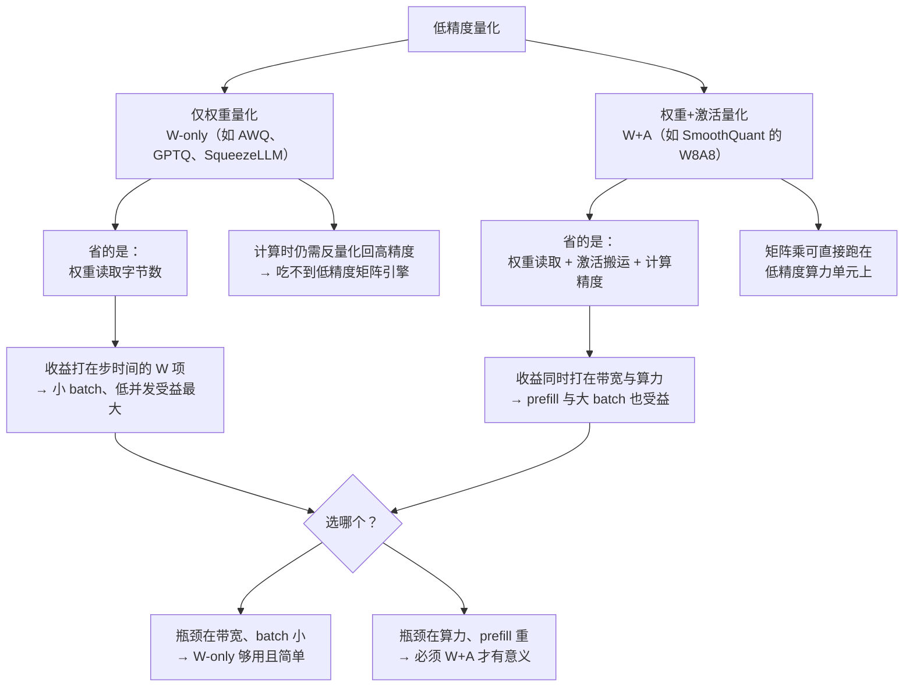

# 量化与压缩论文卡片

> 位置：[InferenceAtlas](../../INDEX.md) > [模块 13 — 论文与技术报告地图](README.md) > 当前文档
> 信息截至：2026-08-10
> 最后核验：2026-08-10
> 内容版本：v0.1
> 时效性等级：中（离群值这一核心认识稳定，具体算法仍在演化）
> 相关主题：[模块 04 第 9 章 — 量化 kernel](../04_compilers_runtimes_and_kernels/09_quantization_kernels.md)｜[模块 07 第 3 章 — Tensor Core 与低精度](../07_hardware_and_server_architecture/03_tensor_cores_matrix_engines_and_low_precision.md)｜[本模块第 01 章 — 论文地图](01_paper_map.md)

---

> ⚠️ **降级书写**：本章**未读过任何一篇论文的正文**。
> 每张卡片的「实验设置」与「关键结果」一律为 `待核实`——
> 这在量化方向尤其要紧：**困惑度、精度保持率、加速比是这一族论文的全部量化结论**，
> 本库一个都不转述。完整纪律见 [第 01 章的降级声明](01_paper_map.md)。

## 本章导读

量化是本库覆盖的优化里**唯一必然牺牲质量**的一类
（投机解码不牺牲质量，PagedAttention 与前缀复用也不牺牲）。
因此读这一族论文，关键不是「压到几位」，而是**「为什么能压到这里而不崩」**。

这个问题的答案在过去几年里收敛到了一件事上：**离群值**。

大模型的激活张量里存在少数幅值远超其余的维度。
均匀量化按全局最大值定标，这些离群值会把量化步长撑大，
使绝大多数正常取值被挤进极少的量化格子——精度崩塌不是因为位宽不够，
**而是因为位宽被浪费在了几乎没有数据的区域**。
认清这一点之后，整个方向就变成了一句话：**怎么处理离群值**。

本章七张卡片可以按「怎么处理离群值」分成三组回答：

| 回答 | 做法 | 卡片 |
|---|---|---|
| **隔离它** | 把离群部分单独用高精度算 | P-022 LLM.int8()、P-028 SqueezeLLM |
| **搬走它** | 用等价变换把难度转移到好量化的一侧 | P-024 SmoothQuant、P-025 AWQ |
| **绕开它** | 换分组轴，或换一种本身动态范围更大的数值格式 | P-027 KIVI、P-026 FP8 |

**P-023 GPTQ 不在这三组里**——它处理的是另一个正交问题：
给定要量化，**怎么让误差不简单累积**。

## 卡片索引

| 编号 | 简称 | 量化对象 | 对离群值的策略 | 官方实现 |
|---|---|---|---|---|
| [P-022](#p-022--llmint8) | LLM.int8() | 权重 + 激活 | 隔离 | ✅ 仓库可读 |
| [P-023](#p-023--gptq) | GPTQ | 权重 | 不针对（治误差累积） | ✅ 仓库可读 |
| [P-024](#p-024--smoothquant) | SmoothQuant | 权重 + 激活 | 搬走 | ✅ 仓库可读 |
| [P-025](#p-025--awq) | AWQ | 权重 | 搬走（保护重要通道） | ✅ 仓库可读 |
| [P-026](#p-026--fp8-formats) | FP8 Formats | 数值格式本身 | 绕开（更大动态范围） | 待核实 |
| [P-027](#p-027--kivi) | KIVI | KV cache | 绕开（换分组轴） | ✅ 仓库可读 |
| [P-028](#p-028--squeezellm) | SqueezeLLM | 权重 | 隔离 + 非均匀 | ✅ 仓库可读 |

## 一个必须先说清的区分：W-only 与 W+A

这是本章最容易被含糊过去、而工程后果最大的一处区分。

**图解读**：

1. **图展示什么**：把「量化」这个笼统的词拆成两条收益路径完全不同的分支，
   并给出各自的收益落点与选型判据。
2. **核心瓶颈**：分歧点在中间那两个节点。
   **W-only 量化在计算时必须把权重反量化回高精度**，
   所以矩阵乘仍然跑在高精度单元上——它省的是**搬运**，不是**算力**。
   W+A 才能让矩阵乘真正落到低精度算力单元上。
   把这两件事混为一谈，是「我量化了但没变快」这类线上困惑最常见的根因。
3. **图中的 trade-off**：W-only 简单、无需处理激活离群、对精度影响可控，
   但收益只在 $W$ 项主导时兑现——也就是小 batch、低并发。
   W+A 收益覆盖面大得多，代价是必须解决激活离群（这正是 P-024 存在的理由），
   且对校准数据的分布漂移更敏感。**收益越大，工程约束越硬。**
4. **面试如何引用**：被问「量化能带来多少加速」时，
   第一句话应该是反问「W-only 还是 W+A，batch 多大」。
   接着可以指出：在大 batch decode 场景下 $B\,S\,k$ 项已经与 $W$ 项可比，
   此时 W-only 量化的加速会明显低于位宽比暗示的数字——
   **这不是实现没做好，是收益本来就不在那儿**。

---

## P-022 — LLM.int8()

> 原标题：*LLM.int8(): 8-bit Matrix Multiplication for Transformers at Scale*

| 字段 | 内容 |
|---|---|
| 书目 | Dettmers, Tim; Lewis, Mike; Belkada, Younes; Zettlemoyer, Luke · arXiv preprint · 2022 ·（**证据类别 A**：作者在 `bitsandbytes` 仓库 README 中给出的 BibTeX；该 BibTeX 记为 arXiv 预印本，正式会议版本 `待核实`） |
| 一手链接 | https://arxiv.org/abs/2208.07339 |
| 官方实现 | [`bitsandbytes-foundation/bitsandbytes`](https://github.com/bitsandbytes-foundation/bitsandbytes)（`开源代码/配置披露`，核验于 2026-08-10） |

**问题**：小模型上跑得好好的 int8 量化，换到大模型上突然崩掉。
而且不是缓慢劣化，是**在某个规模之后急剧崩坏**——这说明存在一个结构性原因，
而不是「位宽不够」这么简单。

**背景**：当时的普遍做法是把 CNN 时代的量化方案直接搬到 Transformer 上。

**机制**（本库可独立论证的部分）：本文指出，随着模型规模增大，
激活张量中会出现少数**极端离群的特征维度**——它们的幅值远超其余维度，
且出现在固定的通道上。

为什么这会致命，可以纯从量化的定义推出来：
对称均匀量化的步长是

$$\Delta = \frac{\max|x|}{2^{b-1}-1}$$

其中 $b$ 为位宽。$\max|x|$ 由离群值决定，
于是步长被撑大，而绝大多数正常取值的幅值远小于 $\max|x|$，
它们全部落进最靠近零的少数几个格子里——**有效位宽远低于名义位宽**。

对策是按维度分解：检测出离群通道，让这部分走高精度矩阵乘，
其余走 int8，最后把两部分结果相加。

**它打的是方程里的哪一项**：$W$（权重读取量），
但本文的真正贡献是指出**激活**的分布形态才是可行性瓶颈。

**实验设置**：`待核实` — 未读原文。
**关键结果**：`待核实` — 未读原文；本库不转述任何精度保持或吞吐数字。

**适用边界**（本库论证）：
- 分解引入**不规则的稀疏结构**，对 kernel 极不友好——
  实测加速常明显低于位宽比暗示的理论值。
  这是「算法收益」与「工程收益」分离的典型案例；
- 离群维度的分布随模型与输入而变，检测阈值是需要整定的旁路参数；
- 离群通道占比越高，走高精度的部分越多，收益越小。

**局限**：
- 作者自述局限：`待核实` — 未读原文。
- 工程视角局限（本库论证）：混合精度分解使 kernel 必须支持两条路径并合并结果，
  实现复杂度高；它更像是一个**存在性证明**——
  证明了「隔离离群值就能量化」，但隔离的代价推动了后续「搬走离群值」的路线。

**后续影响**：把「激活离群值」确立为大模型量化的核心矛盾。
本章 P-024、P-025 都是从这个认识出发的。

**面试讨论角度**：问「为什么小模型能 int8，大模型不行」。
好的回答会写出上面那个步长公式，指出问题不在位宽而在**动态范围被离群值撑大**，
导致有效位宽塌陷。能把「名义位宽 vs 有效位宽」讲清楚的，基本就答到点上了。

**关联文档**：[模块 04 第 9 章](../04_compilers_runtimes_and_kernels/09_quantization_kernels.md)、
[模块 07 第 3 章](../07_hardware_and_server_architecture/03_tensor_cores_matrix_engines_and_low_precision.md)

---

## P-023 — GPTQ

> 原标题：*GPTQ: Accurate Post-Training Quantization for Generative Pre-trained Transformers*

| 字段 | 内容 |
|---|---|
| 书目 | Frantar, Elias; Ashkboos, Saleh; Hoefler, Torsten; Alistarh, Dan · ICLR 2023 ·（作者在官方仓库 README 中给出的 BibTeX 属**证据类别 A**，但其中记为 arXiv 预印本；**venue 与正式标题经检索核对，属类别 B**） |
| 一手链接 | https://arxiv.org/abs/2210.17323 |
| 官方实现 | [`IST-DASLab/gptq`](https://github.com/IST-DASLab/gptq)（`开源代码/配置披露`，核验于 2026-08-10；仓库 README 中的 BibTeX 使用的标题为早期预印本版本，与正式版略有差异） |

**问题**：量化最朴素的做法是**逐权重就近取整**。
但这样做默认了「每个权重的误差同等重要」，而这显然不成立——
误差经过后续矩阵乘会被放大或抵消，取决于该权重与什么相乘。

**背景**：需要一种不依赖重训练的一次性方法——
重训练大模型的成本让量化感知训练在多数场景下不现实。

**机制**（本库可独立论证的部分）：把量化重新表述为**逐层重构问题**：
在权重被离散化的约束下，最小化该层输出相对原输出的误差。

这个目标的曲率由 Hessian 刻画，可用一小批校准数据估计。
量化按列逐个进行，**每量化一列，就把由此引入的误差沿 Hessian 指示的方向补偿到尚未量化的列上**。
于是误差不是简单累加，而是被后续列部分吸收。

**它打的是方程里的哪一项**：$W$。
但与本章其他卡片不同，它不处理离群值——
它处理的是**同样位宽下，怎么把误差压得更小**，因此与「搬走离群值」的方法是正交的、可叠加的。

**为什么这一项值得单独做**（本库论证）：
按本库 [模块 07 第 5 章](../07_hardware_and_server_architecture/05_memory_capacity_bandwidth_and_kv_cache.md)
的恒等式 $C_{\max}/B_{\text{half}} = M_{\text{eff}}/W - 1$，
压缩 $W$ 不只是省显存——它同时抬高了「批处理能达到饱和上限的百分之多少」这一上限。
这与压缩 $k$ 的方法（GQA、KV 量化）性质不同：后者不改变这个比值。
**这是权重量化在容量规划上的独特价值，很少被讲清楚。**

**实验设置**：`待核实` — 未读原文。
**关键结果**：`待核实` — 未读原文；本库不转述任何困惑度、位宽或加速比数字。

**适用边界**（本库论证）：
- 依赖**校准数据**。校准集与线上分布不匹配时，实测精度损失会高于评测所示；
- 逐层重构误差最小 ≠ 端到端输出最优。误差仍可跨层累积，
  层数越深、位宽越低，这一差距越明显；
- 极低位宽下的表现对模型族敏感，跨模型族外推不成立。

**局限**：
- 作者自述局限：`待核实` — 未读原文。
- 工程视角局限（本库论证）：低位宽权重需要配套的反量化 kernel，
  实际收益取决于反量化开销能否被压到访存节省之下；
  这是 W-only 路线的共性约束（见本章开头的图）。

**后续影响**：确立了「用二阶信息引导的一次性 PTQ」这一范式，
是当代权重量化工具链的基础方法之一。

**面试讨论角度**：问「量化时为什么不能直接就近取整」。
好的回答会指出误差的重要性不均等，
并说明 GPTQ 的核心是**把已引入的误差补偿给尚未量化的权重**——
这个「补偿」而非「累加」的思路是它与朴素方法的分水岭。

**关联文档**：[模块 04 第 9 章](../04_compilers_runtimes_and_kernels/09_quantization_kernels.md)

---

## P-024 — SmoothQuant

> 原标题：*SmoothQuant: Accurate and Efficient Post-Training Quantization for Large Language Models*

| 字段 | 内容 |
|---|---|
| 书目 | Xiao, Guangxuan; Lin, Ji; Seznec, Mickael; Wu, Hao; Demouth, Julien; Han, Song · ICML 2023 ·（**证据类别 A**：作者在官方仓库 README 中给出的 BibTeX；arXiv 编号经检索核对） |
| 一手链接 | https://arxiv.org/abs/2211.10438 |
| 官方实现 | [`mit-han-lab/smoothquant`](https://github.com/mit-han-lab/smoothquant)（`开源代码/配置披露`，核验于 2026-08-10） |

**问题**：P-022 用**隔离**处理离群值，代价是不规则计算，工程收益打折。
有没有办法既处理离群值，又保持计算的规则性？

**背景**：观察到一个不对称——**激活难量化（有离群值），权重好量化（分布平坦）**。

**机制**（本库可独立论证的部分）：在矩阵乘 $XW$ 中插入一对互逆的对角缩放：

$$XW = \left(X\,\mathrm{diag}(s)^{-1}\right)\left(\mathrm{diag}(s)\,W\right)$$

乘积**完全不变**，但左边激活的动态范围被压窄、右边权重的被拉宽。
选取合适的 $s$（按逐通道的激活与权重幅值折中），
就能让两者的量化难度都落进可接受区间。

关键在于这是一次难度的**再分配**，不是消除：
激活变好量化的同时，权重变得稍难量化。
之所以划算，是因为权重原本有富余的「可量化余量」。

而且缩放可以**离线折叠**进前一层的权重里——**推理时零额外算子**。

**它动的是什么**：让 W+A 量化（如 W8A8）变得可行，
从而不仅压缩 $W$ 项，也降低激活搬运量并让矩阵乘落到低精度算力单元上。

**实验设置**：`待核实` — 未读原文。
**关键结果**：`待核实` — 未读原文；本库不转述任何精度或加速数字。

**适用边界**（本库论证）：
- 缩放因子依赖校准数据统计的激活幅值——**分布漂移会使 $s$ 失配**，
  且失配的表现是精度悄悄下降而非报错，线上难以察觉。
  这是它比 W-only 方案更需要监控的原因；
- 难度只是被迁移，不是消除。若激活离群极端到权重也无法承接，方法失效；
- 折叠要求前一层结构允许（例如前面是可吸收缩放的线性层或归一化层），
  并非网络的所有位置都能用。

**局限**：
- 作者自述局限：`待核实` — 未读原文。
- 工程视角局限（本库论证）：W+A 量化对整条 kernel 链路的要求高于 W-only，
  中间任何一个算子退回高精度，收益就会断在那里；
  端到端的实测加速需要逐算子核对，不能只看矩阵乘。

**后续影响**：使 W8A8 成为一条现实可用的路线，
也确立了「用等价变换搬移量化难度」这一手法——P-025 是同一手法的另一种用法。

**面试讨论角度**：问「W8A8 和 W8A16 有什么区别，为什么前者更难」。
好的回答会指出难点在激活离群，
并讲清 SmoothQuant 的等价变换是**再分配而非消除**难度。
可以追问：「这个缩放会不会引入额外算子？」——答案是可折叠，推理时零开销。

**关联文档**：[模块 04 第 9 章](../04_compilers_runtimes_and_kernels/09_quantization_kernels.md)、
[模块 07 第 3 章](../07_hardware_and_server_architecture/03_tensor_cores_matrix_engines_and_low_precision.md)

---

## P-025 — AWQ

> 原标题：*AWQ: Activation-aware Weight Quantization for LLM Compression and Acceleration*

| 字段 | 内容 |
|---|---|
| 书目 | Lin, Ji; Tang, Jiaming; Tang, Haotian; Yang, Shang; Chen, Wei-Ming; Wang, Wei-Chen; Xiao, Guangxuan; Dang, Xingyu; et al. · MLSys 2024 ·（**证据类别 A**：作者在官方仓库 README 中给出的 BibTeX；arXiv 编号经检索核对） |
| 一手链接 | https://arxiv.org/abs/2306.00978 |
| 官方实现 | [`mit-han-lab/llm-awq`](https://github.com/mit-han-lab/llm-awq)（`开源代码/配置披露`，核验于 2026-08-10） |

**问题**：做 W-only 低位宽量化时，哪些权重需要被优先保护？
直觉是「幅值大的重要」——但这个直觉是错的。

**背景**：权重量化误差是否有害，取决于它被放大了多少。

**机制**（本库可独立论证的部分）：本文指出权重的重要性应由
**与之相乘的激活的幅值**决定，而非权重自身的幅值。
道理很直接：某个权重的量化误差 $\delta w$ 对输出的贡献是 $x \cdot \delta w$——
如果对应的激活 $x$ 很小，再大的 $\delta w$ 也无所谓；
如果 $x$ 很大，微小的 $\delta w$ 也会被放大。

据此，用校准数据统计各输入通道的激活幅值，
对重要通道的权重施加逐通道缩放以降低其**相对**量化误差，
缩放的逆作用在激活侧并可离线折叠。
整个过程**只需前向统计，不需要梯度或重训练**。

**它动的是什么**：$W$——但用的是「保护重要通道」而非「隔离离群」的手法。
与 SmoothQuant 同属「等价变换搬移难度」这一族，
区别在于 SmoothQuant 的目标是让激活也可量化，
AWQ 的目标是在**只量化权重**的前提下把误差压到最小。

**为什么它在小 batch 场景特别值钱**（本库论证）：
W-only 量化的收益全部落在步时间方程的 $W$ 项上。
当 $B\,S\,k \ll W$（小 batch、短上下文）时，$W$ 项主导步时间，
位宽减半几乎直接等于步时间减半。
反过来，大 batch 长上下文时 $B\,S\,k$ 项抬头，同样的量化收益被稀释——
**这解释了为什么本地单用户部署对 W-only 量化的体感远好于高并发服务**。

**实验设置**：`待核实` — 未读原文。
**关键结果**：`待核实` — 未读原文；本库不转述任何精度保持率或加速比数字。

**适用边界**（本库论证）：
- 依赖校准数据的激活统计，分布不匹配时会**选错**要保护的通道；
- 收益随 batch 增大而衰减（见上一段）；
- **W-only 量化在计算时仍需反量化回高精度，吃不到低精度矩阵引擎的算力**——
  这是它与 SmoothQuant 类 W+A 方案的关键差别，也是本章开头那张图的要点。

**局限**：
- 作者自述局限：`待核实` — 未读原文。
- 工程视角局限（本库论证）：实际加速强依赖反量化 kernel 的质量，
  **论文的算法收益与部署的工程收益必须分别评估**；
  同一算法在不同推理引擎上的实测差异可能大于算法之间的差异。

**后续影响**：与 GPTQ 一起成为 W-only 低位宽量化的两条主流路径，
被广泛集成进各推理引擎与量化工具链。

**面试讨论角度**：问「量化时哪些权重更重要」。
这题的关键在于跳出「幅值大就重要」的直觉，
指出重要性由**对应激活的幅值**决定。
再追问「AWQ 量化后能吃到 INT4 算力吗」——答案是不能，
W-only 省的是带宽不是算力，这一条能答对的人不多。

**关联文档**：[模块 04 第 9 章](../04_compilers_runtimes_and_kernels/09_quantization_kernels.md)、
[模块 10 第 7 章](../10_edge_and_on_device_inference/07_quantization_distillation_and_pruning_for_edge.md)

---

## P-026 — FP8 Formats

> 原标题：*FP8 Formats for Deep Learning*

| 字段 | 内容 |
|---|---|
| 书目 | Micikevicius, Paulius; Stosic, Dusan; Burgess, Neil; Cornea, Marius; Dubey, Pradeep; Grisenthwaite, Richard; Ha, Sangwon; Heinecke, Alexander; et al. · arXiv preprint · 2022 ·（证据类别 B） |
| 一手链接 | https://arxiv.org/abs/2209.05433 |
| 官方实现 | `待核实` — 本文是格式定义，本库未确认是否有对应的官方参考实现 |

**问题**：前面几篇都在想办法让**定点**量化能用。
但离群值的根本困难在于**动态范围**——
而浮点格式天生就是为大动态范围设计的。
那么，8 位浮点应该长什么样？

**背景**：低精度硬件正在铺开，但缺少跨厂商的共同数值语义。
没有共同格式，模型在不同厂商硬件之间就无法可靠迁移。

**机制**（本库可独立论证的部分）：8 位的位预算必须在
**动态范围（指数位）**与**精度（尾数位）**之间取舍，
而不同张量对二者的需求不同。
本文因此定义**两种**编码而非一种：

- **E4M3**：4 位指数、3 位尾数——偏精度；
  为扩大可用范围，它牺牲了无穷大的表示，并压缩了 NaN 的编码空间；
- **E5M2**：5 位指数、2 位尾数——偏动态范围；遵循 IEEE 754 的特殊值约定。

**它动的是什么**：数值格式本身。
定点量化是在给定格式下想办法；本文是换一个格式。

**为什么浮点在这里有结构性优势**（本库论证）：
定点量化的分辨率在整个范围上是**均匀**的，
所以离群值撑大范围就必然浪费掉大量格子（见 P-022 的步长公式）。
浮点的分辨率是**相对**的——小数值用小步长、大数值用大步长，
因此离群值的存在不会等比例地损害正常取值的精度。
**这是「绕开离群值」而不是「处理离群值」。**

**实验设置**：`待核实` — 未读原文。
**关键结果**：`待核实` — 未读原文；本库不转述任何训练质量对比或模型规模。

**适用边界**（本库论证，本条尤其重要）：
- **本文是格式定义与训练侧验证，不等于推理侧的端到端精度结论**。
  把「FP8 能训练」直接读成「FP8 推理无损」是一个常见的越界；
- **「格式被定义」与「某芯片支持该格式」是两件事**。
  后者需查各厂商自己的技术文档——该类站点在本环境不可达，
  故本库**不给出任何硬件支持矩阵**；
- 两种编码的选择、缩放策略与累加精度都是实现自由度：
  不同实现「都叫 FP8」，但数值行为可能不同，跨系统比较必须核对具体配置。

**局限**：
- 作者自述局限：`待核实` — 未读原文。
- 工程视角局限（本库论证）：FP8 的实际精度还取决于**累加精度**——
  若累加仍在高精度进行，误差表现与全 FP8 通路差别很大；
  按本库 [模块 07 第 3 章](../07_hardware_and_server_architecture/03_tensor_cores_matrix_engines_and_low_precision.md)
  的分析，累加误差随规约长度 $K$ 增长（量级介于 $\sqrt{K}u$ 与 $Ku$ 之间，$u$ 为单位舍入误差），
  这一项在长序列与大隐藏维度下不可忽略。

**后续影响**：为跨厂商的低精度生态提供了共同的数值语义，
使 FP8 成为当代加速器低精度单元的设计基准之一。

**面试讨论角度**：问「同样是 8 位，FP8 和 INT8 有什么区别」。
好的回答会讲**均匀分辨率 vs 相对分辨率**，
并指出这直接决定了两者面对离群值时的表现差异。
再追问「为什么要定义两种 FP8 编码」——答案是范围与精度的取舍在不同张量上不同。

**关联文档**：[模块 07 第 3 章](../07_hardware_and_server_architecture/03_tensor_cores_matrix_engines_and_low_precision.md)、
[模块 04 第 9 章](../04_compilers_runtimes_and_kernels/09_quantization_kernels.md)

---

## P-027 — KIVI

> 原标题：*KIVI: A Tuning-Free Asymmetric 2bit Quantization for KV Cache*

| 字段 | 内容 |
|---|---|
| 书目 | Liu, Zirui; Yuan, Jiayi; Jin, Hongye; Zhong, Shaochen; Xu, Zhaozhuo; Braverman, Vladimir; Chen, Beidi; Hu, Xia · arXiv preprint · 2024 ·（**证据类别 A**：作者在官方仓库 README 中给出的 BibTeX） |
| 一手链接 | https://arxiv.org/abs/2402.02750 |
| 官方实现 | [`jy-yuan/KIVI`](https://github.com/jy-yuan/KIVI)（`开源代码/配置披露`，核验于 2026-08-10） |

**问题**：前面六篇都在量化**权重与激活**。
但在长上下文、高并发的服务里，显存的大头早已不是权重，而是 **KV cache**——
按 $M_{kv} = B \cdot S \cdot k \cdot L$，它随并发与会话长度增长，而权重是常数。
**量化 KV cache 的价值可能高于量化权重。**

**背景**：KV 量化长期用一套策略处理 K 与 V，效果不佳但原因不明。

**机制**（本库可独立论证的部分）：本文观察到 K 与 V 的**离群结构不同**——
key 张量存在固定的离群**通道**，value 张量则没有明显的结构性离群。

这个观察直接决定了分组轴的选择：
若沿 token 轴分组量化 key，每一组都会包含那些离群通道，
于是**每一组的定标都被污染**；
改为沿**通道轴**分组，离群就被隔离在少数几个组里，其余组不受影响。
value 没有这个结构，沿 token 轴分组即可。

于是 K 与 V 采用**非对称**的处理方式，这正是标题里 asymmetric 的含义。

**它打的是方程里的哪一项**：$k$（每 token 每层的 KV 字节数）——
压的是位宽，与 GQA 压头数**正交，可叠加**。

**有效位宽必须计入定标参数**（本库论证，这是最常被高估压缩比的地方）：
分组量化的真实平均位宽是

$$b_{\text{eff}} = b_w + \frac{b_s}{g}$$

其中 $b_w$ 为量化位宽，$b_s$ 为每组定标参数（如 scale 与 zero-point）的总位宽，
$g$ 为组大小。组越小，离群隔离得越好，但 $b_s/g$ 项越大。
**「2 bit KV」如果不说组大小，这个数字是没有意义的**——
这也是跨系统比较 KV 量化时必须核对的第一件事。

**实验设置**：`待核实` — 未读原文。
**关键结果**：`待核实` — 未读原文；本库不转述任何困惑度或内存节省数字。

**适用边界**（本库论证）：
- 低位宽 KV 的误差会**沿生成过程累积**——
  早期 token 的 KV 误差会影响后续所有步骤的注意力，
  因此短输出与长输出的表现可能显著不同，评测必须覆盖目标输出长度；
- 组大小是新增旋钮，且与压缩比直接冲突（见上式）；
- 与 prefix caching 共存时，量化后的块能否跨请求复用需要额外确认——
  若不同请求的定标参数不同，块就不可直接共享。

**局限**：
- 作者自述局限：`待核实` — 未读原文。
- 工程视角局限（本库论证）：沿通道轴分组与注意力 kernel 的内存布局**强耦合**，
  实现难度显著高于沿 token 轴分组；
  这是「算法上简单、工程上不简单」的典型，
  移植到新的注意力后端往往需要重写。

**后续影响**：把「K 与 V 应当区别对待」确立为 KV 量化的基本认识，
后续 KV 压缩工作大多接受了这一非对称视角。

**面试讨论角度**：问「KV cache 量化到 2 bit，显存能省多少」。
这是一道**陷阱题**：正确回答必须先问组大小，
再用 $b_{\text{eff}} = b_w + b_s/g$ 说明定标开销。
接着可以指出误差沿生成过程累积，评测必须覆盖真实输出长度。

**关联文档**：[模块 02 第 8 章](../02_transformer_and_kv_cache/08_kv_cache_compression_quantization_and_eviction.md)、
[本模块第 02 章 P-008 GQA](02_transformer_inference_and_kv_cache_papers.md)

---

## P-028 — SqueezeLLM

> 原标题：*SqueezeLLM: Dense-and-Sparse Quantization*

| 字段 | 内容 |
|---|---|
| 书目 | Kim, Sehoon; Hooper, Coleman; Gholami, Amir; Dong, Zhen; Li, Xiuyu; Shen, Sheng; Mahoney, Michael W.; Keutzer, Kurt · arXiv preprint · 2023 ·（**证据类别 A**：作者在官方仓库 README 中给出的 BibTeX；正式会议版本 `待核实`） |
| 一手链接 | https://arxiv.org/abs/2306.07629 |
| 官方实现 | [`SqueezeAILab/SqueezeLLM`](https://github.com/SqueezeAILab/SqueezeLLM)（`开源代码/配置披露`，核验于 2026-08-10） |

**问题**：均匀量化把动态范围**等分**。
但权重分布通常是钟形的——等分意味着把大量量化格子
浪费在几乎没有权重的分布尾部。

**背景**：这是与 P-022 相同的浪费，但角度不同：
P-022 关注的是离群值撑大范围，本文关注的是**格子分配与分布不匹配**。

**机制**（本库可独立论证的部分）：两条互补的做法。

1. **非均匀量化**：量化点的位置不再等距，
   而是按**敏感度加权**的聚类确定——
   权重密集且敏感的区域布置更多量化点，稀疏区域少布置。
2. **稠密-稀疏分解**：把少数离群权重与高敏感权重单独抽出，
   以稀疏格式保留高精度；其余走低位宽稠密格式。
   稀疏部分占比很小，因此平均位宽

$$b_{\text{avg}} = b_{\text{dense}} + \text{稀疏占比} \times b_{\text{sparse}}$$

仍然接近 $b_{\text{dense}}$。

**它打的是方程里的哪一项**：$W$。
它对离群值用的是**隔离**手法（与 P-022 同族），
但配合非均匀量化，把稠密部分的位宽压得更低。

**为什么这条链路特别直接**（本库论证）：
decode 阶段带宽受限，步时间 $\approx W/\text{BW}$。
平均位宽下降即 $W$ 下降，即步时间下降——
**这条因果链比「量化提高算力利用率」短得多，也更容易事先预估**。
代价是它只在 $W$ 项主导时（小 batch）兑现，与 P-025 相同。

**实验设置**：`待核实` — 未读原文。
**关键结果**：`待核实` — 未读原文；本库不转述任何困惑度或加速比数字。

**适用边界**（本库论证）：
- 非均匀量化需要**查表式反量化**，稀疏部分需要额外的稀疏矩阵乘——
  两者都对 kernel 提出要求。
  **算法上的位宽节省与工程上的实测加速之间可能有显著落差**；
- 敏感度估计依赖校准数据；
- 稀疏比例是需要整定的旋钮，且与 kernel 效率直接冲突：
  比例越高精度越好，但稀疏路径的开销越大。

**局限**：
- 作者自述局限：`待核实` — 未读原文。
- 工程视角局限（本库论证）：查表反量化与稀疏乘都是**不规则**计算，
  在把 kernel 写好之前，理论位宽收益可能完全不兑现——
  这与 P-022 遇到的是同一类工程障碍。

**后续影响**：把「非均匀量化」与「稠密-稀疏分解」组合成一条可行路线，
补上了均匀量化在低位宽区间的短板。

**面试讨论角度**：问「为什么低位宽量化要用非均匀量化点」。
好的回答会指出权重分布是钟形的，均匀分点会把格子浪费在尾部。
再追问「非均匀量化在工程上的代价是什么」——
答案是查表反量化，且它属于不规则计算，实测收益强依赖 kernel。

**关联文档**：[模块 04 第 9 章](../04_compilers_runtimes_and_kernels/09_quantization_kernels.md)、
[模块 10 第 7 章](../10_edge_and_on_device_inference/07_quantization_distillation_and_pruning_for_edge.md)

---

## 本章小结

**一句话概括这一族论文：量化的困难不在位宽，在动态范围。**

离群值把动态范围撑大，使名义位宽与有效位宽脱节。
三种应对各有代价：

| 策略 | 代表 | 代价 |
|---|---|---|
| 隔离 | P-022、P-028 | 不规则计算，工程收益常低于算法收益 |
| 搬走 | P-024、P-025 | 依赖校准数据，分布漂移时**静默劣化** |
| 绕开 | P-026、P-027 | 需要硬件/kernel 配合；有效位宽须计入定标开销 |

而 P-023 处理的是正交问题——**误差补偿而非误差累加**，可与上述任一策略叠加。

**三条工程判据**，都不依赖任何论文数值：

1. **先分清 W-only 与 W+A**。前者省带宽不省算力，
   收益只在小 batch（$W$ 项主导）时兑现；后者才能吃到低精度算力单元。
   「我量化了但没变快」多半是这一条没分清。
2. **有效位宽必须计入定标开销**：$b_{\text{eff}} = b_w + b_s/g$。
   不说组大小的「2 bit」「4 bit」是没有信息量的。
3. **算法收益与工程收益必须分别评估**。
   隔离类与非均匀类方法都引入不规则计算，
   同一算法在不同引擎上的实测差异可能大于算法之间的差异。

本章全部七张卡片的「实验设置」与「关键结果」均为 `待核实`，
理由见 [第 01 章的降级声明](01_paper_map.md)。
本章提供的是这一族方法的**约束结构**——
困难来自哪里、三种策略各自的代价、以及部署时必须先问清的三个问题。

## 关键术语

| 中文术语 | 英文 | 定义 | 单位/口径 | 关联文档 |
|---|---|---|---|---|
| 激活离群值 | activation outlier | 激活张量中幅值远超其余、且常固定出现在某些通道的取值 | — | 本章 P-022 |
| 有效位宽 | effective bit width | 计入定标参数开销后的平均位宽 $b_w + b_s/g$ | bit | 本章 P-027 |
| 名义位宽 | nominal bit width | 量化格式声明的位宽，不含定标开销 | bit | 本章 P-022 |
| 仅权重量化 | weight-only quantization | 只量化权重，计算时反量化回高精度；省带宽不省算力 | — | 本章 §W-only 与 W+A |
| 权重激活联合量化 | W+A quantization | 权重与激活同时量化，矩阵乘可跑在低精度单元上 | — | 本章 P-024 |
| 等价缩放变换 | equivalent scaling transform | 插入一对互逆对角缩放以在激活与权重之间**再分配**量化难度 | — | 本章 P-024 |
| 逐层重构误差 | layer-wise reconstruction error | 量化后该层输出相对原输出的误差，PTQ 的优化目标 | — | 本章 P-023 |
| 稠密-稀疏分解 | dense-and-sparse decomposition | 少数权重以稀疏高精度保留、其余低位宽稠密存储 | — | 本章 P-028 |
| 非均匀量化 | non-uniform quantization | 量化点按分布密度与敏感度布置而非等距 | — | 本章 P-028 |
| 累加精度 | accumulation precision | 矩阵乘规约过程所用的数值精度，独立于输入位宽 | bit | [模块 07 第 3 章](../07_hardware_and_server_architecture/03_tensor_cores_matrix_engines_and_low_precision.md) |

## 延伸阅读

- [本模块第 01 章 — 论文地图](01_paper_map.md)：本章在整体地图中的位置
- [本模块第 02 章](02_transformer_inference_and_kv_cache_papers.md)：GQA 压头数与本章 KV 量化压位宽的正交关系
- [模块 04 第 9 章 — 量化 kernel](../04_compilers_runtimes_and_kernels/09_quantization_kernels.md)：工程收益为什么常低于算法收益
- [模块 10 第 7 章 — 端侧量化、蒸馏与剪枝](../10_edge_and_on_device_inference/07_quantization_distillation_and_pruning_for_edge.md)
- [`code/reproduction_toolkit.py`](../../code/reproduction_toolkit.py)：`effective_bit_width` 可直接验算本章的有效位宽结论

## 主要来源

| 来源 | 类型 | 用途 | 披露标签 | 核验日期 |
|---|---|---|---|:---:|
| [`bitsandbytes-foundation/bitsandbytes` README](https://github.com/bitsandbytes-foundation/bitsandbytes) | 作者提供的 BibTeX | P-022 书目 | `开源代码/配置披露` | 2026-08-10 |
| [`IST-DASLab/gptq` README](https://github.com/IST-DASLab/gptq) | 作者提供的 BibTeX | P-023 书目 | `开源代码/配置披露` | 2026-08-10 |
| [`mit-han-lab/smoothquant` README](https://github.com/mit-han-lab/smoothquant) | 作者提供的 BibTeX | P-024 书目 | `开源代码/配置披露` | 2026-08-10 |
| [`mit-han-lab/llm-awq` README](https://github.com/mit-han-lab/llm-awq) | 作者提供的 BibTeX | P-025 书目 | `开源代码/配置披露` | 2026-08-10 |
| [`jy-yuan/KIVI` README](https://github.com/jy-yuan/KIVI) | 作者提供的 BibTeX | P-027 书目 | `开源代码/配置披露` | 2026-08-10 |
| [`SqueezeAILab/SqueezeLLM` README](https://github.com/SqueezeAILab/SqueezeLLM) | 作者提供的 BibTeX | P-028 书目 | `开源代码/配置披露` | 2026-08-10 |
| WebSearch 书目检索 | 二级来源 | P-026 书目；P-023~P-025、P-028 的 arXiv 编号与 venue 核对 | `待核实` | 2026-08-10 |
| 本库模块 04、07 的推导 | 本仓库自有推导 | 步长公式、有效位宽、W-only vs W+A 的收益落点 | — | 2026-08-10 |
| 各论文正文 | 一手来源 | **未读**——出口策略拒绝，见 [AGENTS.md 第 11 节](../../AGENTS.md) | `待核实` | — |
| 各芯片厂商技术文档 | 一手来源 | **未读**——出口策略拒绝；故本章**不给出任何硬件 FP8 支持矩阵** | `待核实` | — |

## 更新记录

| 日期 | 版本 | 变更 | 核验人 |
|---|---|---|---|
| 2026-08-10 | v0.1 | 初稿：P-022~P-028 七张降级卡片，含 W-only/W+A 分野图、三种离群值策略对照与三条工程判据 | — |
