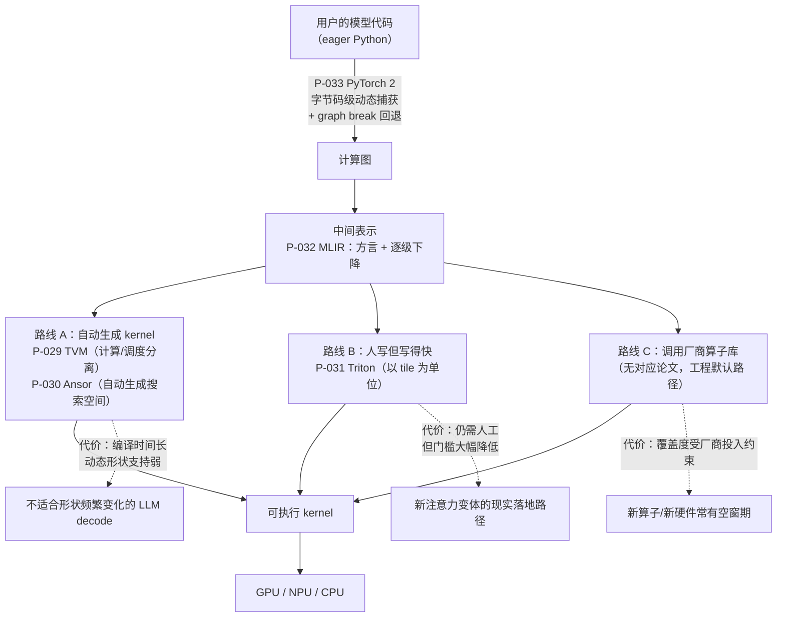

# 编译器、runtime 与 kernel 论文卡片

> 位置：[InferenceAtlas](../../INDEX.md) > [模块 13 — 论文与技术报告地图](README.md) > 当前文档
> 信息截至：2026-08-10
> 最后核验：2026-08-10
> 内容版本：v0.1
> 时效性等级：中（分层结构稳定，各层的具体实现仍在快速更替）
> 相关主题：[模块 04 — 编译器、runtime 与 kernel](../04_compilers_runtimes_and_kernels/)｜[模块 07 第 2 章 — GPU 架构](../07_hardware_and_server_architecture/02_gpu_architecture_for_inference.md)｜[本模块第 01 章 — 论文地图](01_paper_map.md)

---

> ⚠️ **降级书写**：本章**未读过任何一篇论文的正文**。
> 每张卡片的「实验设置」与「关键结果」一律为 `待核实`，且**不转述**搜索摘要中的任何数值。
> 完整的证据分级与纪律见 [第 01 章的降级声明](01_paper_map.md)。

## 本章导读

本章五篇论文与本模块其余各章有一个根本区别：
**它们几乎都不改变要算什么，只改变怎么算。**

前面各章的论文改的是计算本身——KV 少存点、权重少几位、前向少几次。
本章的论文面对的是同一份计算图，问的是另一个问题：
**同样的 FLOP，为什么在这块硬件上只跑出了峰值的一小部分？**

这个问题的答案分布在四个层级上，而这五篇论文恰好各占一层：

| 层级 | 问题 | 卡片 |
|---|---|---|
| **单个 kernel 怎么写** | 手写 CUDA 的心智负担太重 | P-031 Triton |
| **kernel 怎么自动生成** | 人工写不完所有算子 × 所有后端 | P-029 TVM、P-030 Ansor |
| **IR 怎么组织** | 每家各造一套编译器，通用优化被反复重写 | P-032 MLIR |
| **图怎么从框架里捕获** | 图模式好优化，eager 模式好用，长期二选一 | P-033 PyTorch 2 |

**读这一族论文最常见的错误，是把它们当成「性能优化」一起看待。**
只有 P-029/P-030 直接产出更快的代码；
P-031 降低的是**人写 kernel 的成本**，
P-032 降低的是**造编译器的成本**，
P-033 降低的是**用上编译器的成本**。
后三者的收益是间接的，但在工程上往往更决定性——
一个跑得快但没人会写、没人能接、没人愿意改代码去用的编译器，不产生任何价值。

## 卡片索引

| 编号 | 简称 | 降低的是什么成本 | 官方实现 | 本库对应章节 |
|---|---|---|---|---|
| [P-029](#p-029--tvm) | TVM | 跨后端适配 | ✅ 仓库可读 | [模块 04 第 2 章](../04_compilers_runtimes_and_kernels/02_graph_compilers_and_ir.md) |
| [P-030](#p-030--ansor) | Ansor | 人工写调度模板 | ✅ 同上仓库 | [模块 04 第 2 章](../04_compilers_runtimes_and_kernels/02_graph_compilers_and_ir.md) |
| [P-031](#p-031--triton) | Triton | 人写 kernel | ✅ 仓库可读 | [模块 04 第 4 章](../04_compilers_runtimes_and_kernels/04_torch_compile_inductor_and_triton.md) |
| [P-032](#p-032--mlir) | MLIR | 造编译器 | ✅ 仓库可读 | [模块 04 第 2 章](../04_compilers_runtimes_and_kernels/02_graph_compilers_and_ir.md) |
| [P-033](#p-033--pytorch-2) | PyTorch 2 | 用上编译器 | ✅ 仓库可读 | [模块 04 第 4 章](../04_compilers_runtimes_and_kernels/04_torch_compile_inductor_and_triton.md) |

## 五篇论文在栈上的位置

**图解读**：

1. **图展示什么**：从用户代码到可执行 kernel 的完整下降路径，
   以及五篇论文各自负责哪一段。中间三条并列路线（A/B/C）是**互相竞争**的 kernel 来源，
   而不是流水线上的连续阶段——**同一个算子最终只会走其中一条**。
2. **核心瓶颈**：瓶颈在图的下半部分。
   模型结构的演化速度远快于厂商算子库的覆盖速度，
   于是每出现一个新的注意力变体、新的量化格式，
   路线 C 就出现空窗期。路线 A 编译慢且对动态形状支持弱，
   在 LLM decode 这种形状每步都在变的场景下水土不服。
   **结果是路线 B（Triton）在实践中承担了大部分新算子的落地**——
   这解释了为什么当代推理引擎的仓库里有大量 Triton kernel。
3. **图中的 trade-off**：三条路线是「自动化程度」与「可控性」的取舍。
   路线 A 自动化最高但你无法预测它会生成什么，调不动；
   路线 C 可控性为零但性能最有保障（只要覆盖到了）；
   路线 B 在中间——需要人写，但写的是分块策略而非线程索引，
   既保留了控制权，成本又可接受。**在模型结构快速演化的时期，中间路线胜出。**
4. **面试如何引用**：被问「为什么不直接用 cuDNN / cuBLAS 就好」时，
   照这张图回答：厂商库覆盖不到新算子，编译路线对动态形状支持弱，
   所以实践中是三条路线并存，按算子挑。
   能说出「同一个模型里不同算子走不同路线」的候选人，说明真的读过引擎代码。

---

## P-029 — TVM

> 原标题：*TVM: An Automated End-to-End Optimizing Compiler for Deep Learning*

| 字段 | 内容 |
|---|---|
| 书目 | Chen, Tianqi; Moreau, Thierry; Jiang, Ziheng; Zheng, Lianmin; Yan, Eddie; Cowan, Meghan; Shen, Haichen; Wang, Leyuan; et al. · OSDI 2018 ·（证据类别 B） |
| 一手链接 | https://arxiv.org/abs/1802.04799 |
| 官方实现 | [`apache/tvm`](https://github.com/apache/tvm)（`开源代码/配置披露`，核验于 2026-08-10；该仓库 README 未提供 BibTeX，故书目仍属类别 B） |

**问题**：模型部署的实际路径是「框架 → 厂商算子库」。
这意味着每出现一个新算子或新硬件，就需要有人手写 kernel。
**算子种类 × 硬件后端数** 的组合增长得比人力快。

**背景**：当时的部署高度依赖 cuDNN 一类的厂商库，
其覆盖范围之外基本无路可走。

**机制**（本库可独立论证的部分）：把计算的**语义**与**调度**分离。

- **语义**描述算什么（这个张量等于那两个张量的某种缩并）；
- **调度**描述怎么算（循环怎么分块、怎么并行、哪一层放进片上存储、怎么向量化）。

同一份语义可以对应大量合法调度，它们计算结果相同但性能可以差一个数量级。
于是「写 kernel」变成了「在调度空间里搜索」，
而搜索可以自动化——这是把人力问题转化成算力问题。

**它降低的是什么成本**：跨后端适配。
一份模型定义，编译到多种后端，不必为每种后端重写。

**为什么这对推理比对训练更重要**（本库论证）：
训练基本集中在少数几种数据中心 GPU 上；
而推理要落到服务器 GPU、端侧 NPU、各种 CPU、各类加速器上——
**后端的多样性是推理特有的问题**。
本库 [模块 04 第 6 章](../04_compilers_runtimes_and_kernels/06_onnx_runtime_openvino_and_portability.md)
讨论的可移植性，其技术基础就在这里。

**实验设置**：`待核实` — 未读原文。
**关键结果**：`待核实` — 未读原文；本库不转述任何加速比或支持后端数量。

**适用边界**（本库论证）：
- 搜索需要大量真机实测，**编译时间可能远超单次推理本身**，
  只适合「编译一次、部署很久」的场景；
- **「编译一定比厂商库快」不成立**。厂商在热门算子上的投入极大，
  自动生成的 kernel 未必更优；编译路线的价值主要在**覆盖厂商库覆盖不到的地方**；
- 动态形状是这条路线的长期难点——而 LLM 推理的形状每步都在变。

**局限**：
- 作者自述局限：`待核实` — 未读原文。
- 工程视角局限（本库论证）：调优结果与具体设备绑定，换卡需重调；
  搜索出的 kernel 难以人工干预，出问题时调试路径远比手写 kernel 长。

**后续影响**：确立了「深度学习编译器」这一方向，
其计算/调度分离的抽象被后续大量工作沿用。

**面试讨论角度**：问「什么时候该用编译器，什么时候该用厂商算子库」。
好的回答会指出这不是二选一，而是**按算子挑**：
热门算子用厂商库，长尾算子与新硬件用编译。
再追问「LLM 推理适合走编译路线吗」——答案要提到动态形状这一约束。

**关联文档**：[模块 04 第 2 章](../04_compilers_runtimes_and_kernels/02_graph_compilers_and_ir.md)、
[模块 04 第 6 章](../04_compilers_runtimes_and_kernels/06_onnx_runtime_openvino_and_portability.md)

---

## P-030 — Ansor

> 原标题：*Ansor: Generating High-Performance Tensor Programs for Deep Learning*

| 字段 | 内容 |
|---|---|
| 书目 | Zheng, Lianmin; Jia, Chengfan; Sun, Minmin; Wu, Zhao; Yu, Cody Hao; Haj-Ali, Ameer; Wang, Yida; Yang, Jun; et al. · OSDI 2020 ·（证据类别 B） |
| 一手链接 | https://arxiv.org/abs/2006.06762 |
| 官方实现 | [`apache/tvm`](https://github.com/apache/tvm)（`开源代码/配置披露`，核验于 2026-08-10；Ansor 作为自动调度器并入 TVM） |

**问题**：TVM 的自动调优要求工程师先写一个**带可调参数的调度模板**，
搜索只在模板内部进行。
于是搜索空间的上限被模板作者的想象力锁死——
**模板没想到的优化，再好的搜索算法也找不到。**

**背景**：这是自动化做到一半的典型状态：参数自动了，结构还是人定的。

**机制**（本库可独立论证的部分）：改为**自动生成**搜索空间，分两层：

1. **草图（sketch）**：从计算定义自动枚举高层的程序结构——
   循环嵌套顺序、在哪里分块、哪些算子融合；
2. **标注（annotation）**：在草图确定后，随机采样低层细节参数——
   分块大小、并行度、向量化宽度。

采样由一个学习到的代价模型引导，并且**在多个子图之间按其对端到端时延的边际贡献分配调优预算**。

**它降低的是什么成本**：人工编写调度模板。

**最后那点常被忽略，却最有工程价值**（本库论证）：
按预算分配调优这一设计，本质上是把 Amdahl 定律写进了调优器——
占端到端时延 1% 的算子，优化到极致也只能省 1%。
这与本库 [模块 04 第 11 章](../04_compilers_runtimes_and_kernels/11_compiler_debugging_and_profiling.md)
「先 profile 再优化」的立场是同一件事，只不过 Ansor 把它自动化了。

**实验设置**：`待核实` — 未读原文。
**关键结果**：`待核实` — 未读原文；本库不转述任何加速比或调优时间数字。

**适用边界**（本库论证）：
- 调优依赖真机实测，**结果与具体设备型号绑定，换卡即需重调**——
  这是编译路线的隐性运维成本，容易在选型时被漏算；
- 调优本身耗时，不适合模型频繁更新的场景；
- 对动态形状的支持仍是难点，与 P-029 同。

**局限**：
- 作者自述局限：`待核实` — 未读原文。
- 工程视角局限（本库论证）：自动生成的搜索空间更大，
  意味着搜索到一个好解所需的实测次数也更多；
  「搜索空间更大」与「更快找到好解」是两件事，
  代价模型的质量决定了二者能否兼得。

**后续影响**：把自动调优从「模板内搜参数」推进到「自动生成结构」，
是自动 kernel 生成方向的一个分水岭。

**面试讨论角度**：问「自动调优的搜索空间从哪来」。
好的回答会区分**模板内搜索**与**自动生成空间**，
并指出前者的上限由人决定。
可以追问：「调优预算应该怎么在算子之间分配？」——
答案是按对端到端时延的边际贡献，这就是 Amdahl 定律。

**关联文档**：[模块 04 第 2 章](../04_compilers_runtimes_and_kernels/02_graph_compilers_and_ir.md)、
[模块 04 第 11 章](../04_compilers_runtimes_and_kernels/11_compiler_debugging_and_profiling.md)

---

## P-031 — Triton

> 原标题：*Triton: An Intermediate Language and Compiler for Tiled Neural Network Computations*

| 字段 | 内容 |
|---|---|
| 书目 | Tillet, Philippe; Kung, H. T.; Cox, David · MAPL 2019 ·（证据类别 B） |
| 一手链接 | [MAPL 2019 会议页](https://pldi19.sigplan.org/details/mapl-2019-papers/1/Triton-An-Intermediate-Language-and-Compiler-for-Tiled-Neural-Network-Computations) |
| 官方实现 | [`triton-lang/triton`](https://github.com/triton-lang/triton)（`开源代码/配置披露`，核验于 2026-08-10） |

**问题**：手写 CUDA 要求同时管理线程索引、共享内存搬运、bank 冲突与同步栅栏。
这些细节与算法本身无关，却占据了绝大部分心智负担与调试时间。
**结果是能写高性能 kernel 的人很少，写一个要很久。**

**背景**：自动生成（P-029/P-030）走的是「完全不用人写」的路，
但它对动态形状与不规则计算支持有限。中间地带一直是空的。

**机制**（本库可独立论证的部分）：把编程的基本单位从**线程**提升到**张量块**。

程序员写的是：加载一块 A、加载一块 B、算这两块的乘积、累加、写回一块 C。
块内的线程如何划分、数据如何进出 shared memory、
访存如何合并、何时需要同步——**全部由编译器负责**。

块大小仍然是显式的、需要调的参数，
因为它与硬件的 shared memory 容量和 warp 结构直接相关。
但**该调的只剩下它**，其余细节被抽象掉了。

**它降低的是什么成本**：人写 kernel 的成本——从数周降到数天。

**为什么这一条对 LLM 推理特别关键**（本库论证）：
本库 [第 02 章 P-002](02_transformer_inference_and_kv_cache_papers.md) 的局限一节已经指出，
FlashAttention 一类 kernel 与注意力的具体变体强耦合，
每出一个新变体（新的掩码形式、新的位置编码、新的 KV 布局）都要重写一遍。
而模型结构的演化速度不会等厂商库。
**Triton 让「重写一遍」从一个季度的工程变成一两周的工程**——
这直接决定了新模型能多快被推理引擎支持，
是当代引擎仓库里存在大量 Triton kernel 的原因。

**实验设置**：`待核实` — 未读原文。
**关键结果**：`待核实` — 未读原文；本库不转述任何性能对比或代码行数节省。

**适用边界**（本库论证）：
- 抽象层级提高意味着**放弃部分底层控制**。
  在需要极致榨取的场景下，仍可能不敌手写内联汇编；
- 对不规则计算（稀疏、分支密集）的表达能力有限——
  这也是本模块 [第 05 章 P-028](05_quantization_and_compression_papers.md) 那类
  稠密-稀疏分解方法工程落地困难的原因之一；
- 块大小仍需按目标 GPU 调，抽象降低了心智负担但**没有消除硬件差异**。

**局限**：
- 作者自述局限：`待核实` — 未读原文。
- 工程视角局限（本库论证）：编译器承担的工作越多，其行为越难预测——
  同一份 Triton 代码在编译器版本更替后性能可能变化，
  这类回归比手写 CUDA 更难定位。

**后续影响**：成为当代推理与训练栈中新算子的主要落地方式之一，
也是 P-033 的后端代码生成目标。

**面试讨论角度**：问「新出一个注意力变体，你怎么让它跑得快」。
好的回答会给出三条路线（等厂商库、自动编译、手写）并说明各自的时间尺度，
指出在模型结构快速演化时期，Triton 一类的中间路线是现实选择。

**关联文档**：[模块 04 第 4 章](../04_compilers_runtimes_and_kernels/04_torch_compile_inductor_and_triton.md)、
[模块 04 第 7 章](../04_compilers_runtimes_and_kernels/07_kernel_fusion_and_operator_optimization.md)

---

## P-032 — MLIR

> 原标题：*MLIR: Scaling Compiler Infrastructure for Domain Specific Computation*

| 字段 | 内容 |
|---|---|
| 书目 | Lattner, Chris; Amini, Mehdi; Bondhugula, Uday; Cohen, Albert; Davis, Andy; Pienaar, Jacques; Riddle, River; Shpeisman, Tatiana; et al. · CGO 2021 ·（证据类别 B） |
| 一手链接 | [CGO 2021 会议页](https://conf.researchr.org/details/cgo-2021/cgo-2021-papers/2/MLIR-Scaling-Compiler-Infrastructure-for-Domain-Specific-Computation) |
| 官方实现 | [`llvm/llvm-project`](https://github.com/llvm/llvm-project)（`开源代码/配置披露`，核验于 2026-08-10） |

> **书目注意**：存在一篇标题不同的 arXiv 预印本（*MLIR: A Compiler Infrastructure for the End of Moore's Law*，arXiv:2002.11054）。
> 两者标题不一致，**引用时不可互相替代**。本卡片指的是 CGO 2021 的正式版本。

**问题**：深度学习编译栈存在大量重复造轮子——
每个框架各有一套图 IR，彼此靠脆弱的转换器连接，
而循环优化、常量折叠这类通用能力在每套 IR 里被重写一遍。

**背景**：LLVM 解决了「一种低层 IR + 多种后端」的问题，
但深度学习需要的是**多个抽象层级**的 IR，从张量运算一路到向量指令。

**机制**（本库可独立论证的部分）：提供统一的 IR 骨架与**方言（dialect）**机制。

方言是同一 IR 框架下的一组领域特定操作：
高层方言表达张量运算，中层表达循环嵌套，低层表达向量与硬件指令。
编译过程是**逐级下降**（progressive lowering）而不是一步到底，
每一级都复用同一套 pass 管理、验证与打印基础设施。

**它降低的是什么成本**：造一个编译器的成本。

**它本身不产生任何加速**（本库强调）：
把 MLIR 列进「性能优化论文」是一个常见误读。
它是**基础设施**——它让别人更容易造出会产生加速的编译器。
读它的价值在于建立分层观：
当你问「这个融合是在哪一层做的」「为什么这个优化到了低层就做不了了」，
你问的就是 MLIR 的问题。

**实验设置**：`待核实` — 未读原文。
**关键结果**：`待核实` — 未读原文；本库不转述任何采用规模或工程收益数字。

**适用边界**（本库论证）：
- 它的收益是**长期的、间接的**，不体现在任何单次推理的时延上；
- 方言的自由度带来**碎片化风险**：
  各家定义互不兼容的方言时，复用只发生在框架层而非优化层——
  「大家都用 MLIR」并不自动意味着「优化可以互相复用」。

**局限**：
- 作者自述局限：`待核实` — 未读原文。
- 工程视角局限（本库论证）：学习曲线陡峭；
  多层 IR 使调试路径变长——一个数值错误可能出现在任何一次下降中，
  定位需要理解全部相关方言。

**后续影响**：当代多数深度学习编译栈（含各厂商的图编译器）都建立在其上，
使新硬件的接入成本从「造一个完整编译器」降为「定义低层方言与下降规则」。

**面试讨论角度**：问「算子融合应该在哪一层做」。
好的回答会指出这取决于融合所需的信息在哪一层还在：
高层还知道这是注意力，低层只剩循环——
信息一旦被下降掉就补不回来。
这就是分层 IR 与逐级下降的核心动机。

**关联文档**：[模块 04 第 2 章](../04_compilers_runtimes_and_kernels/02_graph_compilers_and_ir.md)、
[模块 04 第 1 章](../04_compilers_runtimes_and_kernels/01_inference_software_stack.md)

---

## P-033 — PyTorch 2

> 原标题：*PyTorch 2: Faster Machine Learning Through Dynamic Python Bytecode Transformation and Graph Compilation*

| 字段 | 内容 |
|---|---|
| 书目 | Ansel, Jason; Yang, Edward; He, Horace; 等（**完整作者名单 `待核实`**，人数众多）· ASPLOS 2024 ·（证据类别 B） |
| 一手链接 | https://dl.acm.org/doi/10.1145/3620665.3640366 |
| 官方实现 | [`pytorch/pytorch`](https://github.com/pytorch/pytorch)（`开源代码/配置披露`，核验于 2026-08-10） |

**问题**：编译器再好，用不上也没有价值。
长期以来「图模式」与「eager 模式」是二选一：
图模式能优化但要求用户改写代码去迎合 tracing/scripting 的限制；
eager 模式好写好调但放弃全部图级优化。
**绝大多数用户选了 eager，于是编译器的收益从未真正兑现。**

**背景**：这是本章唯一一篇把「采纳成本」当作头号问题的论文。

**机制**（本库可独立论证的部分）：在 **Python 字节码层面**动态拦截。

运行时改写字节码，把能处理的部分捕获成计算图；
遇到无法处理的构造（数据依赖的控制流、外部副作用）就
**优雅回退**到 eager 执行，即 graph break，
被打断处两侧的图各自编译。
守卫（guard）机制记录本次编译所依赖的输入属性，
属性变化时触发重新编译。

由此实现「不改代码即可编译」。
后端再把捕获到的图降低成融合后的 kernel（实践中大量生成 Triton 代码）。

**它降低的是什么成本**：用上编译器的成本。

**动态形状是它与 LLM 推理的连接点**（本库论证）：
LLM 推理的输入形状天然可变——batch 随调度器每步变化，
序列长度随生成增长。
把这些当常量处理会导致每个形状编译一次，重编译开销吞掉全部收益。
把它们作为**符号量**处理，才能让一次编译覆盖一族形状。
这也解释了它与 CUDA Graph 的张力：
后者要求形状固定才能捕获，两种技术的适用区间需要分开考虑
（见 [模块 04 第 10 章](../04_compilers_runtimes_and_kernels/10_cuda_graphs_and_execution_overhead.md)）。

**实验设置**：`待核实` — 未读原文。
**关键结果**：`待核实` — 未读原文；本库**不转述**任何加速比、模型数量或与其他编译器的对比结论。

**适用边界**（本库论证）：
- **graph break 使实际收益高度依赖具体代码写法**。
  同一个模型，改一行 Python 就可能把一个大图切成两个小图，
  融合机会随之消失——而这一点**事先难以预判**，
  只能通过工具查看实际的 break 位置；
- 形状频繁变化时重编译代价可能盖过收益，
  需要观察编译缓存的命中情况；
- 收益在小算子密集的模型上最大；
  在已经由少数大 GEMM 主导的模型上，融合的空间本来就有限。

**局限**：
- 作者自述局限：`待核实` — 未读原文。
- 工程视角局限（本库论证）：动态字节码改写使故障模式变得隐蔽——
  编译后行为异常时，需要区分是捕获错了、降低错了还是后端 kernel 错了；
  完整作者名单本库未能核实（人数众多），已如实记入
  [`data/papers.csv`](../../data/papers.csv)。

**后续影响**：使「默认开启编译」在主流框架上成为现实选项，
并把 Triton 确立为主要的后端代码生成目标之一。

**面试讨论角度**：问「`torch.compile` 为什么在我的模型上没提速」。
这是一道很好的实践题。
好的回答会依次检查：有没有大量 graph break、
形状是否频繁变化导致反复重编译、
模型是否本来就由少数大 GEMM 主导（融合空间有限）。
**能主动提到 graph break 的候选人，基本就是真用过。**

**关联文档**：[模块 04 第 4 章](../04_compilers_runtimes_and_kernels/04_torch_compile_inductor_and_triton.md)、
[模块 04 第 10 章](../04_compilers_runtimes_and_kernels/10_cuda_graphs_and_execution_overhead.md)

---

## 本章小结

**这五篇论文合起来回答的是同一个问题：同样的 FLOP，怎么真正跑出来。**

但它们降低的成本各不相同，这个区分比它们的性能数字更重要：

| 卡片 | 降低的成本 | 收益是否直接 |
|---|---|:---:|
| P-029 TVM | 跨后端适配 | 直接 |
| P-030 Ansor | 人工写调度模板 | 直接 |
| P-031 Triton | 人写 kernel | **间接**（缩短新算子落地周期） |
| P-032 MLIR | 造编译器 | **间接**（基础设施，本身不产生加速） |
| P-033 PyTorch 2 | 用上编译器 | **间接**（把已有收益真正兑现） |

**三条判据，都不依赖任何论文数值：**

1. **厂商库、自动编译、手写 kernel 三条路线并存，按算子挑，不是三选一。**
   同一个模型里不同算子走不同路线是常态。
2. **动态形状是这一族技术与 LLM 推理之间的主要摩擦点。**
   自动编译路线对它支持弱，CUDA Graph 直接要求形状固定，
   而 LLM 推理的形状每步都在变——凡是宣称「编译提速 N 倍」的结论，
   先问它测的是固定形状还是真实的可变形状。
3. **间接收益往往比直接收益更决定性。**
   一个跑得快但没人会写、没人能接、要改代码才能用的编译器，产生的价值是零。

本章全部五张卡片的「实验设置」与「关键结果」均为 `待核实`，
理由见 [第 01 章的降级声明](01_paper_map.md)。

## 关键术语

| 中文术语 | 英文 | 定义 | 单位/口径 | 关联文档 |
|---|---|---|---|---|
| 计算与调度分离 | compute/schedule separation | 语义描述算什么、调度描述怎么算，同一语义对应多种合法调度 | — | 本章 P-029 |
| 调度模板 | schedule template | 人工编写的带可调参数的调度骨架；其结构限定了搜索空间上限 | — | 本章 P-030 |
| 程序草图 | sketch | 自动枚举出的高层程序结构，与低层参数标注共同构成搜索空间 | — | 本章 P-030 |
| 分块抽象 | tile abstraction | 以张量块而非线程为编程基本单位 | — | 本章 P-031 |
| 方言 | dialect | MLIR 中同一 IR 框架下的领域特定操作集合 | — | 本章 P-032 |
| 逐级下降 | progressive lowering | 从高层抽象逐级降到低层，而非一步到底 | — | 本章 P-032 |
| 图打断 | graph break | 遇到无法捕获的构造时回退 eager 执行，图被切开 | 次 | 本章 P-033 |
| 守卫 | guard | 记录编译所依赖的输入属性，属性变化时触发重编译 | — | 本章 P-033 |
| 符号形状 | symbolic shape | 把 batch、序列长度等作为符号量而非常量编译 | — | 本章 P-033 |

## 延伸阅读

- [本模块第 01 章 — 论文地图](01_paper_map.md)：本章在整体地图中的位置
- [本模块第 02 章 P-002/P-006](02_transformer_inference_and_kv_cache_papers.md)：kernel 与注意力变体的耦合问题
- [模块 04 第 1 章 — 推理软件栈](../04_compilers_runtimes_and_kernels/01_inference_software_stack.md)
- [模块 04 第 11 章 — 编译器调试与 profiling](../04_compilers_runtimes_and_kernels/11_compiler_debugging_and_profiling.md)

## 主要来源

| 来源 | 类型 | 用途 | 披露标签 | 核验日期 |
|---|---|---|---|:---:|
| [`apache/tvm`](https://github.com/apache/tvm) | 官方实现仓库 | P-029、P-030 实现存在性 | `开源代码/配置披露` | 2026-08-10 |
| [`triton-lang/triton`](https://github.com/triton-lang/triton) | 官方实现仓库 | P-031 实现存在性 | `开源代码/配置披露` | 2026-08-10 |
| [`llvm/llvm-project`](https://github.com/llvm/llvm-project) | 官方实现仓库 | P-032 实现存在性 | `开源代码/配置披露` | 2026-08-10 |
| [`pytorch/pytorch`](https://github.com/pytorch/pytorch) | 官方实现仓库 | P-033 实现存在性 | `开源代码/配置披露` | 2026-08-10 |
| WebSearch 书目检索 | 二级来源 | 本章五篇的书目字段、arXiv 编号与 venue（逐条核对，未凭记忆填写） | `待核实` | 2026-08-10 |
| 本库模块 04 的推导 | 本仓库自有推导 | 三路线取舍、动态形状摩擦点、间接收益的论证 | — | 2026-08-10 |
| 各论文正文 | 一手来源 | **未读**——出口策略拒绝，见 [AGENTS.md 第 11 节](../../AGENTS.md) | `待核实` | — |

## 更新记录

| 日期 | 版本 | 变更 | 核验人 |
|---|---|---|---|
| 2026-08-10 | v0.1 | 初稿：P-029~P-033 五张降级卡片，含栈上位置图、三路线取舍与「降低的是哪种成本」对照表 | — |
