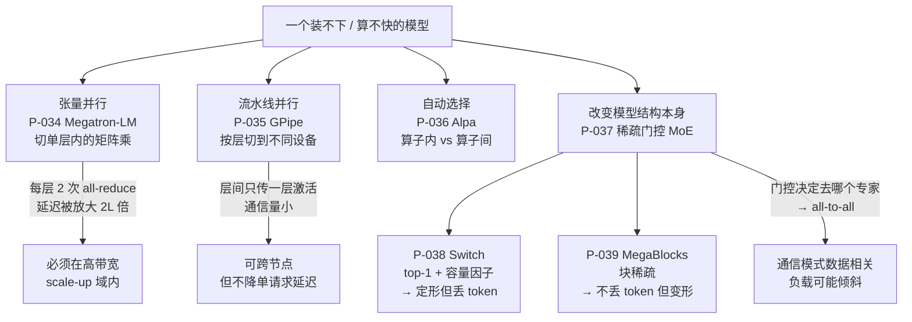

# 分布式与 MoE 推理论文卡片

> 位置：[InferenceAtlas](../../INDEX.md) > [模块 13 — 论文与技术报告地图](README.md) > 当前文档
> 信息截至：2026-08-10
> 最后核验：2026-08-10
> 内容版本：v0.1
> 时效性等级：中（并行方式与 MoE 结构已稳定，推理侧的工程实践仍在快速变化）
> 相关主题：[模块 06 — 分布式与 MoE 推理](../06_distributed_and_moe_inference/)｜[模块 08 — 网络与互连](../08_networking_and_interconnect/)｜[本模块第 01 章 — 论文地图](01_paper_map.md)

---

> ⚠️ **降级书写**：本章**未读过任何一篇论文的正文**。
> 每张卡片的「实验设置」与「关键结果」一律为 `待核实`。
> 完整的证据分级与纪律见 [第 01 章的降级声明](01_paper_map.md)。

## 本章还有一个额外的、更重要的警告

**本章六篇论文全部是训练论文。**

这不是本库的取材偏好——分布式并行与 MoE 的奠基工作确实都出自训练场景，
因为在很长一段时间里，只有训练才需要把一个模型摊到几百块卡上。
但这意味着：

> **它们的收益论证、扩展性结论与超参整定，全部建立在训练的计算/通信比之上。
> 而推理，尤其是 decode，的计算/通信比与训练相差一到两个数量级。**

具体地说，训练的一次前向-反向要处理一整个批次的完整序列，计算量巨大，
因此通信可以被计算掩盖；而 decode 每步只处理每个请求的**一个 token**，
计算量微小，但**通信量与训练时同一层的通信量是同一个量级**——
因为通信量取决于隐藏维度和 batch，不取决于每个请求推进了几个 token。

**结论：这六篇论文的机制可以直接用，结论一条都不能直接搬。**

本章因此把每张卡片的「适用边界」写成一个统一的问题：
**这条结论在训练里成立的理由是什么，那个理由在 decode 阶段还在不在？**
这是本章相对于原论文的主要增量，也是本库能独立负责的部分。

## 卡片索引

| 编号 | 简称 | 原始场景 | 到推理的迁移风险 | 官方实现 |
|---|---|---|---|---|
| [P-034](#p-034--megatron-lm) | Megatron-LM | 训练 | **高**：通信占比结构完全不同 | ✅ 仓库可读 |
| [P-035](#p-035--gpipe) | GPipe | 训练 | **高**：气泡公式依赖前向-反向结构 | 待核实 |
| [P-036](#p-036--alpa) | Alpa | 训练 | **中**：分类框架可迁移，代价模型不可 | ✅ 仓库可读 |
| [P-037](#p-037--sparsely-gated-moe) | Sparsely-Gated MoE | 训练 | **中**：结构可迁移，负载均衡手段不可 | 待核实 |
| [P-038](#p-038--switch-transformer) | Switch Transformer | 训练 | **高**：丢 token 在推理中不可补偿 | 待核实 |
| [P-039](#p-039--megablocks) | MegaBlocks | 训练 | **中**：机制有利于推理，但引入延迟方差 | ✅ 仓库可读 |

## 并行方式与 MoE 在推理侧的位置

**图解读**：

1. **图展示什么**：面对「一个模型装不下或算不快」，两条根本不同的应对——
   **切设备**（上半部分，模型不变）与**改结构**（下半部分，模型本身变稀疏）。
   底部三个节点是各自在推理侧的硬约束。
2. **核心瓶颈**：三个底部节点就是瓶颈。
   张量并行的瓶颈是**互连**：每层两次集合通信，$L$ 层就是 $2L$ 次，
   延迟被线性放大，所以它只能活在高带宽低时延的 scale-up 域内。
   流水线并行的瓶颈是**它不降低单请求延迟**——请求仍要串行走完所有流水级。
   MoE 的瓶颈是**通信模式由数据决定**：门控把 token 送到哪个专家是运行时才知道的，
   于是 all-to-all 的负载可能严重倾斜。
3. **图中的 trade-off**：上下两半是完全不同性质的取舍。
   切设备**不改变模型质量**，只在延迟、吞吐与互连成本之间权衡；
   改结构（MoE）**动了模型本身**——它用显存换算力，
   且带来一个稠密模型没有的新问题：同一批请求的计算量随路由结果波动。
   下半部分 Switch 与 MegaBlocks 的分叉，正是「定形但丢 token」与
   「不丢 token 但变形」这对取舍，两者**不能同时要**。
4. **面试如何引用**：被问「模型太大放不下怎么办」时，
   照这张图从上往下讲：先问是装不下还是算不快（两者的解法不同），
   再按互连拓扑决定张量并行的边界在哪，
   最后才谈要不要换成 MoE 结构。
   **主动指出「张量并行不该跨节点」的候选人，通常真的部署过。**

---

## P-034 — Megatron-LM

> 原标题：*Megatron-LM: Training Multi-Billion Parameter Language Models Using Model Parallelism*

| 字段 | 内容 |
|---|---|
| 书目 | Shoeybi, Mohammad; Patwary, Mostofa; Puri, Raul; LeGresley, Patrick; Casper, Jared; Catanzaro, Bryan · arXiv preprint · 2019 ·（**证据类别 A**：作者在官方仓库 README 中给出的 BibTeX） |
| 一手链接 | https://arxiv.org/abs/1909.08053 |
| 官方实现 | [`NVIDIA/Megatron-LM`](https://github.com/NVIDIA/Megatron-LM)（`开源代码/配置披露`，核验于 2026-08-10） |

**问题**：模型大到单卡放不下时，最直接的想法是把层切开放到不同卡上。
但这会让设备串行等待。能不能**把单层内部**切开，让多卡同时算同一层？

**背景**：数据并行只能解决「算得慢」，解决不了「放不下」。

**机制**（本库可独立论证的部分）：关键在于**选对切分方向，使通信点最少**。

MLP 部分：第一个权重矩阵按**列**切，第二个按**行**切。
这样第一个矩阵乘的输出（中间激活）天然是按列分块的，
正好作为第二个矩阵乘按行分块的输入——**中间不需要任何通信**。
只在第二个矩阵乘之后做一次 all-reduce 把部分和加起来。

注意力部分：按**头**切分，每个设备算自己那几个头的完整注意力，
在输出投影后同样一次 all-reduce。

于是推理侧每层只需 **2 次** all-reduce（MLP 一次、注意力一次）。

**通信量的关键性质**（本库独立推导）：
每次 all-reduce 的数据量正比于 $\text{batch} \times \text{序列长度} \times \text{隐藏维度}$，
**与设备数无关**。这解释了张量并行的扩展特性：
加设备能摊薄计算，但摊不薄通信量，
所以扩展曲线必然在某处饱和，饱和点由互连带宽决定。

**它在推理侧的迁移风险：高**（本库论证，本卡片的核心）：

训练时，一次前向-反向处理整批完整序列，计算量巨大，
通信可以被计算充分掩盖，因此论文里的扩展效率能做得很好。

**decode 阶段完全不同**：每步每个请求只推进一个 token，
计算量相对训练小了几个数量级；
而 all-reduce 的数据量取决于 batch 与隐藏维度，**几乎没有同比缩小**。
按本库 [模块 08](../08_networking_and_interconnect/) 的 $\alpha$-$\beta$ 模型，
此时通信中的固定延迟项 $\alpha$ 开始主导，
而 $2L$ 次通信把它放大了 $2L$ 倍——
**通信占 TPOT 的比例可以远高于训练中的占比**。

因此：**机制照用，扩展性结论必须在 decode 工况下重测。**

**实验设置**：`待核实` — 未读原文。
**关键结果**：`待核实` — 未读原文；本库不转述任何扩展效率或模型规模数字。

**适用边界**（本库论证）：
- **不应跨节点**。$2L$ 次集合通信意味着延迟被线性放大，
  跨节点的时延与带宽都无法支撑（见 [模块 08 第 6 章](../08_networking_and_interconnect/06_scale_up_vs_scale_out.md)）；
- **与 MQA/GQA 存在结构冲突**：注意力按头切分要求 KV 头数能被并行度整除。
  MQA 的 $h_{kv}=1$ 根本无法沿头维切，必须在每个 rank 复制 K/V——
  这会吃掉一部分本来省下的显存（见 [第 02 章 P-007、P-008](02_transformer_inference_and_kv_cache_papers.md)）；
- 并行度越高，每设备的计算越小，通信占比越高，收益递减越快。

**局限**：
- 作者自述局限：`待核实` — 未读原文。
- 工程视角局限（本库论证）：这是一篇**训练论文**，
  其收益论证建立在「通信可被计算掩盖」之上；
  decode 阶段该前提不成立，直接引用其扩展性结论属于越界。

**后续影响**：张量并行的标准做法，被几乎所有推理引擎实现。

**面试讨论角度**：问「张量并行为什么不能跨节点」。
好的回答会算通信次数（每层 2 次 × $L$ 层）并指出延迟被线性放大。
更好的回答会补一句：**decode 阶段的通信占比远高于训练**，
因为计算量缩小了而通信量没有——这一层很少有人答到。

**关联文档**：[模块 06 第 2 章](../06_distributed_and_moe_inference/02_tensor_parallel_inference.md)、
[模块 08 第 6 章](../08_networking_and_interconnect/06_scale_up_vs_scale_out.md)

---

## P-035 — GPipe

> 原标题：*GPipe: Efficient Training of Giant Neural Networks using Pipeline Parallelism*

| 字段 | 内容 |
|---|---|
| 书目 | Huang, Yanping; Cheng, Youlong; Bapna, Ankur; Firat, Orhan; Chen, Dehao; Chen, Mia Xu; Lee, HyoukJoong; Ngiam, Jiquan; et al. · NeurIPS 2019 ·（证据类别 B） |
| 一手链接 | [NeurIPS 2019 proceedings](https://proceedings.neurips.cc/paper/2019/hash/093f65e080a295f8076b1c5722a46aa2-Abstract.html) |
| 官方实现 | `待核实` — 本库未能确认官方实现仓库 |

**问题**：按层切到不同设备后，设备之间是串行依赖的——
设备 2 必须等设备 1 算完。若只送一个批次进去，
任一时刻只有一个设备在工作，其余全部空转。

**背景**：这是「按层切分」这一最朴素做法的直接后果。

**机制**（本库可独立论证的部分）：把 mini-batch 再切成**微批**依次送入流水线。
微批 1 在设备 2 上跑的同时，微批 2 已经在设备 1 上跑了——
不同微批在不同设备上同时推进，流水线被填满。
首尾仍有无法填充的空档，即**流水线气泡**。

**气泡占比**（本库独立推导）：

$$\text{气泡占比} \approx \frac{P-1}{P-1+M}$$

其中 $P$ 为流水级数，$M$ 为微批数。
增大 $M$ 可以摊薄气泡，但 $M$ 受显存与总批大小约束——
这是流水线并行的核心张力。

**它在推理侧的迁移风险：高**（本库论证）：

上面这个气泡公式是**训练的**公式，它建立在前向-反向的调度结构上。
推理只有前向，没有反向，流水线的填充结构与之不同，**公式需要重推**。

更关键的是 decode 场景：每个"微批"里每个请求只有**一个 token**，
每一级的计算量极小，而级间传递的激活量固定。
此时流水线的填充效率与训练时相差很远，
不能拿训练的气泡分析去估计 decode 的设备利用率。

**它与张量并行的根本区别**（本库论证，这是最该记住的一条）：
**流水线并行提高吞吐，但不降低单请求延迟。**
一个请求仍然要串行地走完全部流水级——
把模型切成 4 段，单请求的延迟不会变成 1/4，反而因为级间传输略有增加。
把流水线并行当成「拆得越多越快」是一个常见且代价很大的误解。

**实验设置**：`待核实` — 未读原文。
**关键结果**：`待核实` — 未读原文；本库不转述任何扩展效率或模型规模数字。

**适用边界**（本库论证）：
- 通信量小（层间只传一层激活），**因此可跨节点**——
  这是它与张量并行最重要的分工依据；
- 不降低单请求延迟，因此**在延迟敏感、并发低的场景中价值有限**；
- 微批数受显存与批大小约束，在线服务中批大小由 SLO 约束，
  可用的 $M$ 往往比训练时小得多，气泡相应更难摊薄。

**局限**：
- 作者自述局限：`待核实` — 未读原文。
- 工程视角局限（本库论证）：这是一篇**训练论文**，气泡分析不可直接搬到推理；
  流水级的负载均衡要求各级计算量相近，
  而 Transformer 各层虽然结构相同，首尾的 embedding 与输出头会破坏均衡；
  未确认官方开源实现。

**后续影响**：流水线并行的经典表述，
后续工作（如更精细的调度以减小气泡）大多以其为基线。

**面试讨论角度**：问「张量并行和流水线并行怎么选」。
好的回答会给出三条维度：**通信量**（张量并行大、流水线小）、
**是否降低单请求延迟**（张量并行降、流水线不降）、
**能否跨节点**（流水线可以、张量并行不该）。
能主动说出「流水线并行不降低单请求延迟」的，就抓住了关键。

**关联文档**：[模块 06 第 3 章](../06_distributed_and_moe_inference/03_pipeline_parallel_inference.md)、
[模块 06 第 9 章](../06_distributed_and_moe_inference/09_multi_node_serving_topologies.md)

---

## P-036 — Alpa

> 原标题：*Alpa: Automating Inter- and Intra-Operator Parallelism for Distributed Deep Learning*

| 字段 | 内容 |
|---|---|
| 书目 | Zheng, Lianmin; Li, Zhuohan; Zhang, Hao; Zhuang, Yonghao; Chen, Zhifeng; Huang, Yanping; Wang, Yida; Xu, Yuanzhong; et al. · OSDI 2022 ·（证据类别 B） |
| 一手链接 | https://arxiv.org/abs/2201.12023 |
| 官方实现 | [`alpa-projects/alpa`](https://github.com/alpa-projects/alpa)（`开源代码/配置披露`，核验于 2026-08-10） |

**问题**：数据并行、张量并行、流水线并行长期被当作三种并列的手段，
组合方式靠人工经验拼装。
但这三者真的是并列的吗？还是它们其实有更简单的结构？

**背景**：随着模型变大，「用哪几种并行、各用多少度」的搜索空间大到无法手工穷举。

**机制**（本库可独立论证的部分）：本文指出这些并行方式可以归成**两类**：

- **算子内并行**（intra-operator）：把单个算子的计算切开。
  通信频繁但每次通信后立即需要结果，因此要求低时延——张量并行属此类；
- **算子间并行**（inter-operator）：把不同算子放到不同设备。
  通信少，但存在依赖导致的等待——流水线并行属此类。

两层各自建立代价模型，用整数规划与动态规划分别求解再耦合，
避免在联合空间中组合爆炸。

**它的分类框架比它的搜索算法更有长期价值**（本库观点）：

面对任何一种并行方案，只要问一句
**「这是算子内还是算子间并行」**，就能立刻推出三件事：
通信频率、对互连时延的敏感度、以及**能不能跨节点用**。
这个问答不需要跑任何搜索，在白板上就能完成，
而且它对本文发表之后出现的新并行方式同样有效——
比如序列并行属算子内，专家并行的通信结构则介于两者之间。

**它在推理侧的迁移风险：中**（本库论证）：

**分类框架可以直接迁移**——它是结构性的，不依赖任何计算/通信比。

**代价模型不能迁移**——它以训练的计算/通信比为基准建立，
而 decode 的计算量远小于训练。
把训练标定的代价模型用到 decode 上，会系统性地低估通信占比，
从而搜出偏向算子内并行（张量并行度过高）的方案。

**实验设置**：`待核实` — 未读原文。
**关键结果**：`待核实` — 未读原文；本库不转述任何搜索质量或端到端加速数字。

**适用边界**（本库论证）：
- 代价模型显式建模设备网格的带宽层级（节点内高带宽域 vs 跨节点），
  这是本库 [模块 08 第 6 章](../08_networking_and_interconnect/06_scale_up_vs_scale_out.md)
  scale-up/scale-out 讨论的量化版本——**这部分建模思路可迁移，参数不可**；
- 搜索本身有成本，且结果与设备网格绑定，集群拓扑变化后需重搜；
- 面向训练：推理侧还多了 KV cache 这一在训练中不存在的显存主项，
  放置问题的约束结构因此不同。

**局限**：
- 作者自述局限：`待核实` — 未读原文。
- 工程视角局限（本库论证）：自动搜索出的方案难以人工解释，
  出问题时排查路径长；
  实际部署中并行策略还受制于模型结构的整除关系（如 KV 头数与并行度），
  这类离散约束会显著削减可行解空间。

**后续影响**：其**算子内/算子间**二分已成为讨论并行策略的通用语言。

**面试讨论角度**：问「序列并行属于哪一类并行」。
这是考察分类框架是否真的内化了。
好的回答会指出它切的是单个算子内部的计算，属算子内并行，
因此通信频繁、要求低时延、不宜跨节点。

**关联文档**：[模块 06 第 1 章](../06_distributed_and_moe_inference/01_distributed_inference_overview.md)、
[模块 06 第 4 章](../06_distributed_and_moe_inference/04_sequence_context_parallel_inference.md)

---

## P-037 — Sparsely-Gated MoE

> 原标题：*Outrageously Large Neural Networks: The Sparsely-Gated Mixture-of-Experts Layer*

| 字段 | 内容 |
|---|---|
| 书目 | Shazeer, Noam; Mirhoseini, Azalia; Maziarz, Krzysztof; Davis, Andy; Le, Quoc V.; Hinton, Geoffrey E.; Dean, Jeff · ICLR 2017 ·（证据类别 B） |
| 一手链接 | https://arxiv.org/abs/1701.06538 |
| 官方实现 | `待核实` — 本库未能确认官方实现仓库 |

**问题**：模型容量与计算量长期是绑死的——想要更多参数，就要付更多 FLOP。
**能不能让参数量增长而每个样本的计算量不变？**

**背景**：这是前面所有并行方法都没触及的维度：它们都不改变模型本身。

**机制**（本库可独立论证的部分）：在前馈层的位置放置多个并行的**专家**网络，
外加一个**门控**网络。门控为每个 token 输出各专家的权重，
只取 top-$k$ 个专家实际参与计算。

于是：**总参数量 $\propto$ 专家数，每 token 的 FLOP $\propto k$**。
两者解耦了。

论文同时指出一个必须处理的问题：门控会**自我强化**——
被选中多的专家训得更好，于是被选中得更多。
不加干预会退化成只有少数专家在用。
对策是加入**负载均衡辅助损失**，把 token 摊开。

**它给推理留下的最重要区分**（本库论证）：

**稠密参数 vs 激活参数。**

- **显存占用由稠密参数（全部专家）决定**——所有专家都要驻留；
- **算力占用由激活参数（top-$k$ 个专家）决定**。

因此 **MoE 省的是算力，不是显存**。
这个结论反直觉但极其重要：一个「激活参数只有稠密模型十分之一」的 MoE，
其显存需求可能远大于那个稠密模型。
按本库 [模块 07 第 5 章](../07_hardware_and_server_architecture/05_memory_capacity_bandwidth_and_kv_cache.md)
的容量恒等式 $C_{\max}/B_{\text{half}} = M_{\text{eff}}/W - 1$，
$W$（这里是全部专家权重）变大会**降低**批处理能达到的饱和上限——
**MoE 在带宽受限的 decode 阶段并不天然占优**。

**它在推理侧的迁移风险：中**（本库论证）：

**结构可迁移**——MoE 层的定义与训练无关。

**负载均衡手段不可迁移**——辅助损失只在**训练期**起作用，
它改善的是训练分布上的期望负载。
**推理期的专家负载倾斜是一个独立的、长期存在的工程问题**：
线上单批次的瞬时路由分布可能严重不均，
造成 all-to-all 的落后者效应（见 [模块 06 第 6 章](../06_distributed_and_moe_inference/06_moe_routing_all_to_all_and_load_balancing.md)）。
训练期把它解决了，不等于推理期不用管——**恰恰相反，推理期没有辅助损失可用**。

**实验设置**：`待核实` — 未读原文。
**关键结果**：`待核实` — 未读原文；本库不转述任何参数规模或质量提升数字。

**适用边界**（本库论证）：
- 专家分布在不同设备上时，门控结果决定通信目的地——
  这是 **all-to-all 通信进入推理栈的根源**，其负载是数据相关的；
- 显存需求由全部专家决定，因此 MoE 更适合**显存充裕而算力吃紧**的场景；
- 在小 batch decode 这种带宽受限工况下，需要仔细核算：
  每步仍要读取被激活的那些专家的权重，收益不像 FLOP 数暗示的那么大。

**局限**：
- 作者自述局限：`待核实` — 未读原文。
- 工程视角局限（本库论证）：**面向训练**，
  未讨论推理期的专家放置、负载倾斜、专家缓存与冷热分层；
  未确认官方开源实现。

**后续影响**：稀疏专家模型的起点，
后续 Switch（P-038）、MegaBlocks（P-039）都在解决它留下的工程问题。

**面试讨论角度**：问「MoE 模型省显存还是省算力」。
这是一道**必答对**的题：省算力，不省显存，
因为所有专家都要驻留而每次只算 top-$k$。
再追问「那 MoE 在 decode 阶段的优势有多大」——
答案要提到 decode 是带宽受限的，激活的专家权重仍要读，收益需实测。

**关联文档**：[模块 06 第 5 章](../06_distributed_and_moe_inference/05_moe_inference_and_expert_parallelism.md)、
[模块 06 第 6 章](../06_distributed_and_moe_inference/06_moe_routing_all_to_all_and_load_balancing.md)

---

## P-038 — Switch Transformer

> 原标题：*Switch Transformers: Scaling to Trillion Parameter Models with Simple and Efficient Sparsity*

| 字段 | 内容 |
|---|---|
| 书目 | Fedus, William; Zoph, Barret; Shazeer, Noam · JMLR 2022 ·（证据类别 B） |
| 一手链接 | [JMLR v23](https://jmlr.org/papers/v23/21-0998.html) |
| 官方实现 | `待核实` — 本库未能确认官方实现仓库 |

**问题**：top-$k$ 路由（$k>1$）带来更复杂的组合与更大的通信量。
而且更麻烦的是：**每个专家收到多少 token 是运行时才知道的**，
这让计算形状不固定，GPU 很不喜欢。

**背景**：这是把 MoE 从「能训」推向「好训」必须解决的工程问题。

**机制**（本库可独立论证的部分）：两步简化。

1. **top-1 路由**：每个 token 只走一个专家。
   路由大幅简化，每 token 的通信目的地唯一。
2. **容量因子**：给每个专家预设一个**固定**的 token 容量。
   超出容量的 token 被**丢弃**——跳过该层的专家计算，走残差直连。

第二步是关键：它把「每个专家收到多少 token」从数据相关的变量变成了**常量**，
于是计算形状固定、all-to-all 的消息大小固定，
一切都变得规整。**代价是丢 token。**

$$\text{专家容量} = \text{容量因子} \times \frac{\text{总 token 数}}{\text{专家数}}$$

容量因子调低则丢得多（质量损失），调高则大量专家在算填充（算力浪费）。

**它在推理侧的迁移风险：高**（本库论证，本章最重要的一条）：

在训练中，丢掉的 token 会在后续训练步里被再次看到，
损失可以被后续步骤**补偿**——所以适度丢弃是可接受的。

**在推理中，丢 token 是当次请求的质量直接损失，且不可恢复。**
用户不会重发一次让模型再试；而且**它不报任何错**——
被丢的 token 只是走了残差直连，输出会悄悄变差。
这是一类**静默失效**，线上极难发现。

更糟的是：**线上流量的路由分布与训练集不同**。
按训练期整定的容量因子，在线上未必合适。
这正是 MoE 服务必须专门观测**路由分布**这一指标的原因
（见 [模块 06 第 6 章](../06_distributed_and_moe_inference/06_moe_routing_all_to_all_and_load_balancing.md)）——
它不是锦上添花的可观测性，而是质量保障的必要条件。

**实验设置**：`待核实` — 未读原文。
**关键结果**：`待核实` — 未读原文；本库不转述任何参数规模、加速或质量结论。

**适用边界**（本库论证）：
- 定形计算使 all-to-all 的消息大小固定，对集合通信实现友好；
- **但固定容量意味着无论实际负载如何，通信量都按最坏情况付**——
  这在负载轻时是纯浪费；
- 容量因子在推理侧应当比训练侧更保守（宁可多算填充也别丢 token），
  但这会进一步抬高算力开销——**这个取舍在训练论文里不存在**。

**局限**：
- 作者自述局限：`待核实` — 未读原文。
- 工程视角局限（本库论证）：**面向训练**，
  丢 token 的可补偿性假设在推理中不成立；
  未确认官方开源实现。

**后续影响**：使 MoE 的训练工程可行，
其容量因子机制成为后续 MoE 系统的默认组件——
也成为 P-039 要拆掉的那个组件。

**面试讨论角度**：问「MoE 推理时的容量因子该怎么设」。
好的回答会先指出训练与推理的**根本差别**：训练丢 token 可补偿，推理不可。
因此推理侧应当更保守，并且**必须观测线上路由分布**，
因为训练期整定的值未必适用。

**关联文档**：[模块 06 第 6 章](../06_distributed_and_moe_inference/06_moe_routing_all_to_all_and_load_balancing.md)、
[模块 11 第 7 章](../11_benchmarking_reliability_and_observability/07_observability_metrics_logs_traces.md)

---

## P-039 — MegaBlocks

> 原标题：*MegaBlocks: Efficient Sparse Training with Mixture-of-Experts*

| 字段 | 内容 |
|---|---|
| 书目 | Gale, Trevor; Narayanan, Deepak; Young, Cliff; Zaharia, Matei · MLSys 2023 ·（证据类别 B） |
| 一手链接 | https://arxiv.org/abs/2211.15841 |
| 官方实现 | [`databricks/megablocks`](https://github.com/databricks/megablocks)（`开源代码/配置披露`，核验于 2026-08-10） |

**问题**：容量因子这个东西，本质上是被**稠密矩阵乘要求规整形状**这一约束逼出来的。
如果计算本身能容忍不规整，就根本不需要丢 token，也不需要算填充。

**背景**：Switch 用「丢 token」换来了规整，这笔交易在推理侧尤其不划算。

**机制**（本库可独立论证的部分）：把 MoE 的前向重新表述为**块稀疏矩阵乘**。

每个专家处理的那批 token 构成一个块——块内是规整的稠密计算，
但**块的大小可变、块的排布是稀疏的**。
配套的块稀疏 kernel 使这种结构仍能高效跑在 GPU 上。

于是每个专家收到多少 token 就算多少：
**既不丢弃，也不填充**。容量因子这个概念被整个取消了。

**它在推理侧的迁移风险：中**（本库论证）：

**机制方向对推理是有利的**——
它消除了 P-038 那类静默的质量损失，这在推理中比在训练中更值钱。

**但它引入了一个训练不在意、推理很在意的新问题**：
每步的计算量随实际路由分布**波动**。
训练只关心整体吞吐，波动无所谓；
而在线服务关心 TPOT 的**尾部**——
计算量波动直接转化为 TPOT 方差上升，
对紧 SLO 的服务是一个新的调度难题。

因此容量规划必须按**分位数**而非均值做：
按平均路由分布算出来的容量，会在倾斜的那些步上不够用。

**实验设置**：`待核实` — 未读原文。
**关键结果**：`待核实` — 未读原文；本库不转述任何吞吐或质量结论。

**适用边界**（本库论证）：
- 依赖专用的**块稀疏 kernel**，这是可行性前提；
  移植到新硬件或新框架的成本高；
- 变长计算使 CUDA Graph 一类的**定形捕获**更难施加
  （见 [模块 04 第 10 章](../04_compilers_runtimes_and_kernels/10_cuda_graphs_and_execution_overhead.md)）——
  这与本模块 [第 06 章 P-033](06_compiler_runtime_and_kernel_papers.md) 讨论的动态形状摩擦是同一类问题；
- 计算量随路由分布波动，容量规划需按分位数做。

**局限**：
- 作者自述局限：`待核实` — 未读原文。
- 工程视角局限（本库论证）：**面向训练**，
  推理侧的延迟方差问题不在其目标函数内；
  块稀疏 kernel 的效率与硬件矩阵引擎的粒度相关，跨代际不可外推。

**后续影响**：证明了「MoE 必须丢 token 或填充」是一个**实现约束而非本质约束**，
把这对取舍从 MoE 的必然代价降级为一个可选项。

**面试讨论角度**：问「MoE 一定要丢 token 吗」。
好的回答是不一定——丢 token 是稠密矩阵乘要求规整形状带来的实现约束，
块稀疏表述可以取消它。
再追问「那为什么不都用块稀疏」——
答案要提到专用 kernel 的依赖，以及**变长计算带来的延迟方差**，
后者在推理中是实打实的代价。

**关联文档**：[模块 06 第 5 章](../06_distributed_and_moe_inference/05_moe_inference_and_expert_parallelism.md)、
[模块 06 第 6 章](../06_distributed_and_moe_inference/06_moe_routing_all_to_all_and_load_balancing.md)

---

## 本章小结

**本章最重要的产出不是六张卡片，而是一张「训练结论到推理」的迁移检查表。**

对本章每一篇论文，都要问同一个问题：
**它在训练里成立的理由是什么，那个理由在 decode 阶段还在不在？**

| 卡片 | 训练里成立的理由 | 在 decode 阶段还成立吗 |
|---|---|---|
| P-034 Megatron-LM | 计算量大，通信可被掩盖 | ❌ 每步只推进一个 token，通信占比大幅上升 |
| P-035 GPipe | 气泡公式基于前向-反向调度 | ❌ 推理只有前向，公式需重推 |
| P-036 Alpa | 代价模型按训练的计算/通信比标定 | ⚠️ 分类框架成立，代价模型参数不成立 |
| P-037 MoE | 负载均衡辅助损失把 token 摊开 | ❌ 辅助损失只在训练期起作用 |
| P-038 Switch | 丢掉的 token 可被后续训练步补偿 | ❌ 推理中是当次请求的**静默**质量损失 |
| P-039 MegaBlocks | 只关心整体吞吐，计算量波动无妨 | ⚠️ 机制有利，但波动会抬高 TPOT 尾延迟 |

**四条可以直接用的结论：**

1. **张量并行不该跨节点**——每层 2 次集合通信，$2L$ 次的延迟放大扛不住跨节点时延。
2. **流水线并行提高吞吐但不降低单请求延迟**——请求仍要串行走完所有级。
3. **MoE 省算力不省显存**——全部专家驻留，只有 top-$k$ 参与计算；
   在带宽受限的 decode 阶段，MoE 并不天然占优。
4. **MoE 服务必须观测线上路由分布**——
   它不是可选的可观测性，而是质量保障的必要条件：
   容量因子由训练期整定，而线上分布不同，丢 token 是静默的。

本章全部六张卡片的「实验设置」与「关键结果」均为 `待核实`，
理由见 [第 01 章的降级声明](01_paper_map.md)。
上面两张表的每一条都来自机制的形状与本库模块 06、08 的自有推导。

## 关键术语

| 中文术语 | 英文 | 定义 | 单位/口径 | 关联文档 |
|---|---|---|---|---|
| 算子内并行 | intra-operator parallelism | 切开单个算子的计算；通信频繁、要求低时延 | — | 本章 P-036 |
| 算子间并行 | inter-operator parallelism | 把不同算子放到不同设备；通信少但有依赖等待 | — | 本章 P-036 |
| 流水线气泡 | pipeline bubble | 流水线首尾无法填满而空转的比例 | % | 本章 P-035 |
| 稠密参数 | total parameters | MoE 中全部专家的参数量，决定**显存**占用 | 个 | 本章 P-037 |
| 激活参数 | active parameters | 每 token 实际参与计算的参数量，决定**算力**占用 | 个 | 本章 P-037 |
| 容量因子 | capacity factor | 每专家 token 容量相对均分值的倍数；超出即丢弃 | — | 本章 P-038 |
| 丢 token | token dropping | 超出专家容量的 token 跳过专家计算走残差；**推理中不可补偿** | 个 | 本章 P-038 |
| 块稀疏 MoE | block-sparse MoE | 把 MoE 前向表述为块稀疏矩阵乘，取消容量上限 | — | 本章 P-039 |
| 路由倾斜 | routing skew | 单批次内 token 在专家间分布不均，导致 all-to-all 落后者 | — | [模块 06 第 6 章](../06_distributed_and_moe_inference/06_moe_routing_all_to_all_and_load_balancing.md) |

## 延伸阅读

- [本模块第 01 章 — 论文地图](01_paper_map.md)：本章在整体地图中的位置
- [本模块第 03 章 P-011/P-015](03_batching_serving_and_scheduler_papers.md)：PD 分离——另一种「把计算摊到多设备」的思路
- [模块 06 第 1 章 — 分布式推理总览](../06_distributed_and_moe_inference/01_distributed_inference_overview.md)
- [模块 08 第 5 章 — 集合通信、RDMA 与通信库](../08_networking_and_interconnect/05_collectives_rdma_and_communication_libraries.md)
- [`code/reproduction_toolkit.py`](../../code/reproduction_toolkit.py)：`allreduce_ring`、`allreduce_rhd`、`comm_share_of_tpot` 可验算本章的通信占比结论

## 主要来源

| 来源 | 类型 | 用途 | 披露标签 | 核验日期 |
|---|---|---|---|:---:|
| [`NVIDIA/Megatron-LM` README](https://github.com/NVIDIA/Megatron-LM) | 作者提供的 BibTeX | P-034 书目 | `开源代码/配置披露` | 2026-08-10 |
| [`alpa-projects/alpa`](https://github.com/alpa-projects/alpa) | 官方实现仓库 | P-036 实现存在性 | `开源代码/配置披露` | 2026-08-10 |
| [`databricks/megablocks`](https://github.com/databricks/megablocks) | 官方实现仓库 | P-039 实现存在性 | `开源代码/配置披露` | 2026-08-10 |
| WebSearch 书目检索 | 二级来源 | P-035~P-039 的书目字段、arXiv 编号与 venue（逐条核对，未凭记忆填写） | `待核实` | 2026-08-10 |
| 本库模块 06、07、08 的推导 | 本仓库自有推导 | 通信量分析、气泡公式、稠密/激活参数区分、迁移检查表 | — | 2026-08-10 |
| 各论文正文 | 一手来源 | **未读**——出口策略拒绝，见 [AGENTS.md 第 11 节](../../AGENTS.md) | `待核实` | — |

## 更新记录

| 日期 | 版本 | 变更 | 核验人 |
|---|---|---|---|
| 2026-08-10 | v0.1 | 初稿：P-034~P-039 六张降级卡片；核心产出为**训练结论到推理的迁移检查表**，逐条追问「训练里成立的理由在 decode 阶段还在不在」 | — |
