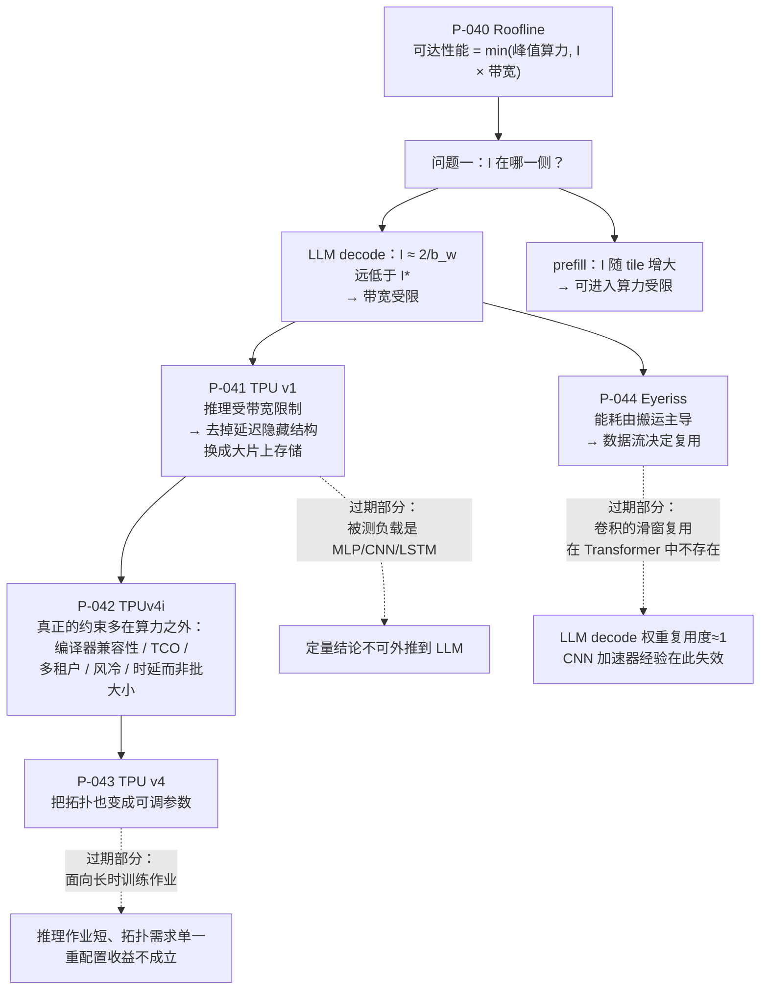

# 硬件与体系结构论文卡片

> 位置：[InferenceAtlas](../../INDEX.md) > [模块 13 — 论文与技术报告地图](README.md) > 当前文档
> 信息截至：2026-08-10
> 最后核验：2026-08-10
> 内容版本：v0.1
> 时效性等级：低（这些论文确立的是分析框架，框架比具体芯片长寿得多）
> 相关主题：[模块 07 — 硬件与服务器架构](../07_hardware_and_server_architecture/)｜[模块 01 第 4 章 — Roofline](../01_foundations_and_metrics/04_roofline_and_performance_modeling.md)｜[本模块第 01 章 — 论文地图](01_paper_map.md)

---

> ⚠️ **降级书写**：本章**未读过任何一篇论文的正文**。
> 每张卡片的「实验设置」与「关键结果」一律为 `待核实`。
> **本章尤其严格**：芯片规格（峰值算力、片上存储容量、功耗、能效比）是 AGENTS.md 第 11 节
> 「禁止」第 3 条明令不得凭记忆或二级来源填写的内容，
> 因此本章**一个芯片规格数字都不给**。
> 完整的证据分级与纪律见 [第 01 章的降级声明](01_paper_map.md)。

## 本章导读

本章五篇论文的共同点是：**它们提供的分析框架，比它们描述的任何一块芯片都长寿。**

Roofline 发表于 2009 年，那时还没有深度学习加速器；
Eyeriss 面向的是 CNN，其复用结构在 Transformer 里根本不存在；
TPU v1 剖析的是 MLP/CNN/LSTM 时代的负载。
**如果只看它们的数字，这些论文今天已经全部过期。**

但它们的框架没有过期：
「可达性能 = min(峰值算力, 算术强度 × 带宽)」今天仍然是判断 decode 瓶颈的第一步；
「能耗由数据搬运主导」今天仍然是 J/token 分析的物理基础；
「推理芯片可以去掉延迟隐藏结构」今天仍然是推理 DSA 与通用 GPU 的分野。

**所以本章的读法与前面各章不同**：
前面各章要判断的是「这个机制在我的系统上还成立吗」，
本章要判断的是「这个**框架**里的哪个变量，在我的场景下取值变了」。

## 卡片索引

| 编号 | 简称 | 提供的框架 | 框架里最容易变的变量 | 本库对应章节 |
|---|---|---|---|---|
| [P-040](#p-040--roofline) | Roofline | 性能上界与瓶颈判定 | 机器平衡点 $I^*$（随代际上升） | [模块 01 第 4 章](../01_foundations_and_metrics/04_roofline_and_performance_modeling.md) |
| [P-041](#p-041--tpu-v1) | TPU v1 | 推理 DSA 的取舍逻辑 | 负载形状（MLP/CNN → LLM） | [模块 07 第 7 章](../07_hardware_and_server_architecture/07_inference_asic_architectures.md) |
| [P-042](#p-042--tpuv4i) | TPUv4i | 推理芯片的**非算力**约束 | 约束的优先级排序 | [模块 07 第 13 章](../07_hardware_and_server_architecture/13_hardware_selection_framework.md) |
| [P-043](#p-043--tpu-v4) | TPU v4 | 拓扑作为可调参数 | 作业生命周期（训练 → 推理） | [模块 08 第 7 章](../08_networking_and_interconnect/07_network_topologies_fat_tree_dragonfly_rail_optimized.md) |
| [P-044](#p-044--eyeriss) | Eyeriss | 数据流分类与能耗建模 | 复用结构（卷积 → 注意力） | [模块 10 第 2 章](../10_edge_and_on_device_inference/02_mobile_npu_soc_and_memory_constraints.md) |

## 一张图：框架与它的过期部分

**图解读**：

1. **图展示什么**：以 Roofline 为根，展开「判断瓶颈 → 据此设计硬件 → 发现真正的约束在别处」这条链，
   并用虚线标出每篇论文中**已经过期的那一部分**。
   这张图的组织依据是框架的传承关系，不是发表时间。
2. **核心瓶颈**：根节点右下的 `DEC` 就是瓶颈。
   LLM decode 的算术强度约为 $2/b_w$（$b_w$ 为权重位宽的字节数）——
   即使 $b_w$ 降到 1 字节，这个值也只有 2 FLOP/byte 量级，
   而当代加速器的机器平衡点要高出两个数量级。
   **这一个不等式确定了 decode 的一切**：为什么要批处理、为什么量化有效、
   为什么投机解码有闲置算力可用。
3. **图中的 trade-off**：虚线是本图最该看的部分。
   每篇论文都同时携带**可迁移的框架**与**已过期的结论**，
   而两者在原文里是混在一起写的。
   Eyeriss 的数据流分类可迁移，但它针对的卷积滑窗复用在 Transformer 里不存在；
   TPU v1 的「推理受带宽限制」可迁移，但它的定量对比绑定在同期负载与同期 CPU/GPU 上。
   **读这类论文的技能，就是把这两半分开。**
4. **面试如何引用**：被问「为什么 decode 是 memory-bound」时，
   不要只说「因为要读权重」。写出 Roofline 的判据、算出 decode 的算术强度、
   跟机器平衡点比一下——**给出的是一个不等式，不是一个说法**。
   这张图的左半部分就是这个回答的完整骨架。

---

## P-040 — Roofline

> 原标题：*Roofline: An Insightful Visual Performance Model for Multicore Architectures*

| 字段 | 内容 |
|---|---|
| 书目 | Williams, Samuel; Waterman, Andrew; Patterson, David A. · Communications of the ACM 2009 ·（证据类别 B） |
| 一手链接 | https://dl.acm.org/doi/10.1145/1498765.1498785 |
| 官方实现 | `待核实` — 本库未确认是否有官方配套工具 |

**问题**：多核处理器的性能受多个因素共同限制，
但工程师面对一段慢代码时，往往不知道该去优化计算还是优化访存。
**缺的不是优化手段，是一个判断该用哪种手段的依据。**

**背景**：当时的性能分析要么过于粗糙（只看利用率），
要么过于复杂（完整的机器模型，参数多到无法使用）。

**机制**（本库可独立论证的部分）：用一张二维图承载三个量。

横轴是**算术强度** $I$（每字节访存对应的运算数，单位 FLOP/byte），
纵轴是可达性能（FLOP/s）。带宽给出一条斜率为带宽的斜屋顶
（性能 $= I \times \text{带宽}$），峰值算力给出一条水平屋顶。
二者的下包络就是性能上界：

$$\text{可达性能} = \min\left(\text{峰值算力},\; I \times \text{带宽}\right)$$

两条屋顶的交点是**机器平衡点**：

$$I^{*} = \frac{\text{峰值算力}}{\text{带宽}}$$

$I < I^{*}$ 即带宽受限，$I > I^{*}$ 即算力受限。**这是一个纯硬件属性。**

**它提供的框架**：瓶颈判定。

**为什么这个框架撑起了本库的大部分分析**（本库论证）：

LLM decode 每步要把全部权重读一遍，而每个权重只参与一次乘加，所以

$$I_{\text{decode}} \approx \frac{2}{b_w}$$

其中 $b_w$ 为权重位宽对应的字节数（分子的 2 来自一次乘加算两个浮点运算）。
即使量化到 1 字节，$I$ 也只有 2 FLOP/byte 量级，
而当代加速器的 $I^{*}$ 要高出两个数量级。
**decode 落在带宽受限区，不是一个经验观察，是一个可以在纸上算出来的结论。**

由此可以直接推出本库反复用到的几件事：
批处理有效（多个请求共享一次权重读取，抬高有效 $I$）；
权重量化有效（直接减少分母上的字节）；
投机解码有闲置算力可用（因为算力本来就没跑满）。

**实验设置**：`待核实` — 未读原文。
**关键结果**：`待核实` — 未读原文；本库不转述论文中的任何平台或实测数据。

**适用边界**（本库论证）：
- **它给出的是上界，不是预测值**。
  达不到上界不代表模型错了——可能是延迟没隐藏好、并行度不够、同步开销大。
  **把 roofline 当性能预测器是最常见的误用**；
- 单条屋顶忽略了缓存层次。需要**分层 roofline**（每级存储各画一条斜屋顶）
  才能刻画片上存储的作用，这在分析 FlashAttention 一类工作时是必需的；
- 对延迟受限、同步受限的场景没有解释力——
  分布式推理里「等最慢的 rank」这类问题，roofline 完全看不见。

**局限**：
- 作者自述局限：`待核实` — 未读原文。
- 工程视角局限（本库论证）：$I^{*}$ 随硬件代际**上升**（算力增速快于带宽增速），
  这意味着同一 workload 在新硬件上更容易落进带宽受限区——
  **「换新卡就能变快」在带宽受限区并不成立**，这是采购决策中最容易算错的一处。

**后续影响**：成为深度学习系统性能分析的默认语言，
TPU v1（P-041）等后续工作直接用它来定位负载类型。

**面试讨论角度**：问「怎么判断一个 kernel 是 compute-bound 还是 memory-bound」。
好的回答会给出算术强度与机器平衡点的比较，而不是「看 profiler 里哪个百分比高」。
可以追问：「那算出来是 memory-bound，但实测远低于带宽屋顶，说明什么？」——
答案是模型没错，问题出在 roofline 看不见的地方（延迟、并行度、同步）。

**关联文档**：[模块 01 第 4 章](../01_foundations_and_metrics/04_roofline_and_performance_modeling.md)、
[模块 01 第 5 章](../01_foundations_and_metrics/05_memory_bandwidth_and_arithmetic_intensity.md)

---

## P-041 — TPU v1

> 原标题：*In-Datacenter Performance Analysis of a Tensor Processing Unit*

| 字段 | 内容 |
|---|---|
| 书目 | Jouppi, Norman P.; Young, Cliff; Patil, Nishant; Patterson, David; Agrawal, Gaurav; Bajwa, Raminder; Bates, Sarah; Bhatia, Suresh; et al. · ISCA 2017 ·（证据类别 B；arXiv 编号经**两次独立检索**核对，第二次未预设编号） |
| 一手链接 | https://arxiv.org/abs/1704.04760 |
| 官方实现 | `待核实` — 商用芯片，无开源实现 |

**问题**：通用处理器为了隐藏内存延迟，投入了大量面积与功耗在
乱序执行、多级缓存、分支预测、预测执行上。
**但推理负载是可预测的、批处理式的——这些结构的收益，值它们的代价吗？**

**背景**：这是第一篇公开剖析一款**已在生产数据中心服役**的推理专用 ASIC 的论文。
在此之前，加速器论文大多停留在仿真或流片验证阶段。

**机制**（本库可独立论证的部分）：以**脉动阵列**作为矩阵乘单元——
数据在处理单元之间直接流动，大幅减少对寄存器堆与缓存的访问；
配以**软件管理**的大容量片上存储，替代硬件自动管理的多级缓存。

去掉的东西同样重要：乱序执行、多线程、预测执行、缓存一致性协议。
理由是推理的访存模式在编译期基本已知，
**可预测的负载不需要为不可预测性付费**。

论文同时用 roofline（P-040）分析被测负载，指出多数落在带宽受限一侧。

**它提供的框架**：推理 DSA 的取舍逻辑——
用确定性换掉延迟隐藏结构，把省下的面积给存储。

**它在推理侧的长期价值**（本库论证）：

**这是第一篇把「推理受带宽限制」写进体系结构主流叙事的论文。**
它的结论与本库模块 07 对 LLM decode 的分析同源——
虽然负载完全不同，但受限的原因是同一个：
权重要读一遍，而每个权重参与的运算太少。

它也确立了「为推理单独设计芯片」这条路线的合理性：
如果推理与训练的瓶颈不同，那么用同一种芯片服务两者就必然在某一侧浪费。

**实验设置**：`待核实` — 未读原文。
**关键结果**：`待核实` — 未读原文。
**本库不给出该芯片的峰值算力、片上存储容量、功耗或与 CPU/GPU 的任何对比倍数**——
这类数字属 AGENTS.md 第 11 节明令禁止凭二级来源填写的内容。

**适用边界**（本库论证，本条最重要）：
- **被测负载是该芯片同期的生产模型**（以 MLP、CNN、LSTM 为主）。
  这些负载的形状与当代 LLM 差异极大：
  没有 KV cache、没有自回归的逐 token 串行、序列长度短得多。
  **其定量结论一条都不能外推到 LLM**；
- 论文对比的 CPU/GPU 属同期产品，**跨代际比较无意义**——
  引用「TPU 比 GPU 快 N 倍」而不说年份，是这篇论文最常见的误用；
- 「去掉延迟隐藏结构」的前提是负载可预测。
  当代 LLM serving 的负载（变长序列、动态批、抢占）比 2017 年的推理负载
  **可预测性低得多**，这个前提需要重新审视。

**局限**：
- 作者自述局限：`待核实` — 未读原文。
- 工程视角局限（本库论证）：软件管理片上存储把复杂度从硬件转移到编译器，
  这一转移的代价在 P-042 中被正面讨论（编译器兼容性成为头号约束）。

**后续影响**：确立了推理 DSA 这一品类，
其分析框架（脉动阵列 + 软件管理存储 + roofline 定位）被后续大量加速器沿用。

**面试讨论角度**：问「推理芯片和训练芯片的设计取舍有什么不同」。
好的回答会指出两者的瓶颈不同（推理更偏带宽与时延，训练更偏算力与互连），
并给出具体的结构性后果：推理可以去掉部分延迟隐藏结构、
可以用更低精度、对片上存储容量更敏感。

**关联文档**：[模块 07 第 7 章](../07_hardware_and_server_architecture/07_inference_asic_architectures.md)、
[模块 07 第 3 章](../07_hardware_and_server_architecture/03_tensor_cores_matrix_engines_and_low_precision.md)

---

## P-042 — TPUv4i

> 原标题：*Ten Lessons From Three Generations Shaped Google's TPUv4i: Industrial Product*

| 字段 | 内容 |
|---|---|
| 书目 | Jouppi, Norman P.; Yoon, Doe Hyun; Ashcraft, Matthew B.; Gottscho, Mark; Jablin, Thomas B.; Kurian, George; Laudon, James; Li, Sheng; et al. · ISCA 2021 ·（证据类别 B） |
| 一手链接 | https://dl.acm.org/doi/10.1109/ISCA52012.2021.00010 |
| 官方实现 | `待核实` — 商用芯片，无开源实现 |

**问题**：设计一款推理芯片，真正的约束是什么？
如果只看论文标题里的算力数字，会以为是算力。**三代量产经验给出的答案不是。**

**背景**：本文体裁是**工业产品经验总结**，不是单点技术创新。
这类论文在学术会议上不多见，但对工程读者的价值往往更高。

**机制**（本库可独立论证的部分）：论文列出的教训中，多数与算力无关。
以下几条对推理系统尤其重要：

- **半导体各项工艺的进步速度不均衡**——逻辑密度提升快于线延迟与 SRAM 密度。
  这解释了为什么片上存储容量的增长跟不上算力，
  也解释了为什么「存储墙」是结构性的而非暂时的；
- **对 VLIW 类 DSA 而言，编译器兼容性比二进制兼容性更关键**。
  芯片的价值不在于它能跑多快，而在于**已有的模型能不能被编译到它上面**——
  这与本模块 [第 06 章](06_compiler_runtime_and_kernel_papers.md) 的「间接收益更决定性」是同一个道理；
- **按总拥有成本而非采购单价选型**；
- **支持多租户**；
- **推理 DSA 需要风冷**；
- **应用约束的是时延，而不是批大小**。

**它提供的框架**：推理芯片的**非算力**约束清单。

**最后一条与本库的一个核心公式直接对应**（本库论证）：

「应用限制时延而非批大小」这句话，在本库
[模块 07 第 13 章](../07_hardware_and_server_architecture/13_hardware_selection_framework.md)
里就是那个反解式：

$$B_{\text{SLO}} = \frac{(\text{TPOT} - T_{\text{comm}})\times\text{BW} - W}{S\,k}$$

**批大小不是自变量**——它是由时延预算、通信开销、带宽与 KV 尺寸共同反推出来的因变量。
把批大小当作可以随意调大的旋钮，是容量规划中最常见的错误。
这篇论文用三代产品的经验说了同一件事。

**实验设置**：`待核实` — 未读原文。
**关键结果**：`待核实` — 未读原文；**本库不给出任何芯片规格、能效比或代际对比数据**。

**适用边界**（本库论证）：
- **经验教训的可迁移性受限于 Google 自身的负载结构与部署模式**。
  「支持多租户」对自建云是硬约束，对单一业务的私有部署则未必；
  「需要风冷」的结论与其数据中心的散热方案绑定，
  在液冷已普及的场景下需要重新评估（见 [模块 09 第 4 章](../09_datacenter_power_thermal_and_operations/04_cooling_air_direct_liquid_and_immersion.md)）；
- 论文时点**早于 LLM 主导的推理负载**。
  长上下文带来的 KV cache 主导型显存占用，在当时不是主要矛盾，
  因此「片上存储 vs 片外带宽」的权衡结论需要重新算。

**局限**：
- 作者自述局限：`待核实` — 未读原文。
- 工程视角局限（本库论证）：经验总结类论文的结论**没有可证伪的实验支撑**，
  它们是有价值的先验，但不能当作被验证过的规律；
  引用时应说明这是某厂商的经验，而非普遍结论。

**后续影响**：把推理芯片的讨论从「峰值算力竞赛」拉回到系统性约束，
其教训清单常被后续的 DSA 设计工作引用为设计目标。

**面试讨论角度**：问「选推理加速器时你会看哪些指标」。
弱回答会列峰值算力与显存带宽；
强回答会先问 workload 的时延约束，再指出**批大小是因变量不是自变量**，
然后补上软件栈成熟度（能不能编译上去）与 TCO——
这三条恰好就是本文教训清单的核心。

**关联文档**：[模块 07 第 13 章](../07_hardware_and_server_architecture/13_hardware_selection_framework.md)、
[模块 09 第 4 章](../09_datacenter_power_thermal_and_operations/04_cooling_air_direct_liquid_and_immersion.md)

---

## P-043 — TPU v4

> 原标题：*TPU v4: An Optically Reconfigurable Supercomputer for Machine Learning with Hardware Support for Embeddings*

| 字段 | 内容 |
|---|---|
| 书目 | Jouppi, Norman P.; 等（**完整作者名单 `待核实`**）· ISCA 2023 ·（证据类别 B） |
| 一手链接 | https://arxiv.org/abs/2304.01433 |
| 官方实现 | `待核实` — 商用芯片，无开源实现 |

**问题**：机群的互连拓扑在布线时就被固定，
但不同作业对拓扑的需求不同——有的要环，有的要网格，有的要全互连。
**能不能让拓扑本身成为一个可调参数？**

**背景**：这是本章唯一一篇把网络当作主角的硬件论文，
因此它与 [第 09 章](09_networking_and_datacenter_papers.md) 有直接的对照关系。

**机制**（本库可独立论证的部分）：在机柜之间引入**光路交换机**。

光路交换与电域分组交换的根本区别在于：
**它不解析分组，只在物理层切换光路径**。
因此它不受线速处理能力的约束，功耗与成本结构完全不同。
代价是切换需要毫秒量级的时间——
**这决定了它只能做作业级的重配置，做不了分组级的负载均衡**。

**它提供的框架**：拓扑从固定资产变为可调参数。

**对推理的意义与它的边界**（本库论证）：

直接意义有限——推理作业通常不需要重配拓扑，
其并行结构在部署时就确定了，且生命周期远短于训练作业。

**但它确立的判据是通用的**：
光路交换省的是电域交换机的光电转换与分组处理开销，
代价是失去分组级的灵活性。
这与本库 [模块 08 第 7 章](../08_networking_and_interconnect/07_network_topologies_fat_tree_dragonfly_rail_optimized.md)
分析 rail-optimized 拓扑时的取舍是同一套：
**当通信模式高度规则且可预测时，就可以用更便宜的、更不灵活的交换换取成本与功耗**。
AI 集合通信恰好满足这个条件——这就是这条判据在推理侧的落点。

另一个可迁移的点是**故障隔离**：拓扑可重构意味着坏掉的机柜可以被绕开，
而不是让整个作业停下来等维修。

**实验设置**：`待核实` — 未读原文。
**关键结果**：`待核实` — 未读原文；**本库不给出规模、能效、成本或任何对比倍数**。

**适用边界**（本库论证）：
- **面向训练**：其收益论证建立在长时运行、拓扑需求稳定的训练作业上。
  推理作业生命周期短、拓扑需求单一，
  毫秒级的重配置开销相对于作业时长的占比完全不同，**重配置收益不成立**；
- 光路交换做不了分组级负载均衡，突发流量只能靠拓扑工程的时间尺度响应；
- 与自建数据中心的运营模式强绑定，租用机柜或使用公有云的部署方无法采用。

**局限**：
- 作者自述局限：`待核实` — 未读原文。
- 工程视角局限（本库论证）：完整作者名单未能核实，已如实记入
  [`data/papers.csv`](../../data/papers.csv)；
  光路交换机本身是一个新的故障域与运维对象，其可靠性数据本库无从获取。

**后续影响**：把光路交换从学术方案推到了生产规模，
使「可重构拓扑」成为大规模 AI 机群设计中的一个现实选项。

**面试讨论角度**：问「AI 机群的网络能不能比通用数据中心便宜」。
好的回答会指出 AI 通信模式**规则且可预测**，
因此可以用更专用、更不灵活的交换换取成本与功耗——
光路交换与 rail-optimized 拓扑都是这一判据的实例。

**关联文档**：[模块 08 第 7 章](../08_networking_and_interconnect/07_network_topologies_fat_tree_dragonfly_rail_optimized.md)、
[本模块第 09 章 P-047](09_networking_and_datacenter_papers.md)

---

## P-044 — Eyeriss

> 原标题：*Eyeriss: A Spatial Architecture for Energy-Efficient Dataflow for Convolutional Neural Networks*

| 字段 | 内容 |
|---|---|
| 书目 | Chen, Yu-Hsin; Emer, Joel S.; Sze, Vivienne · ISCA 2016 ·（证据类别 B） |
| 一手链接 | https://dl.acm.org/doi/10.1145/3007787.3001177 |
| 官方实现 | `待核实` — 流片芯片，本库未确认是否有开源实现 |

**问题**：在一个由大量处理单元组成的空间阵列上，
同一份计算可以有很多种数据编排方式。**哪一种最省能耗？**

**背景**：当时的加速器设计普遍以最大化 PE 利用率为目标。

**机制**（本库可独立论证的部分）：本文把数据流按
**「哪一类数据留在原地」**分类——权重驻留、输出驻留、输入驻留，
并另提出行驻留。

但真正的贡献是那个判据：**能耗由数据在存储层次间的搬运主导**，
而不是由乘加运算本身主导。
从片外 DRAM 取一个数的能耗，比一次乘加高出若干数量级。
因此数据流的选择目标应当是**最小化搬运**，
而不是最大化 PE 利用率——**这两个目标经常是冲突的**。

$$\text{能耗} \approx \sum_{\text{各级存储}} (\text{访问次数} \times \text{单次访问能耗})$$

其中 DRAM 项通常占绝对主导。

**它提供的框架**：数据流分类 + 以搬运为中心的能耗建模。

**为什么这个结论跨架构成立**（本库论证）：

「能耗由搬运主导」不依赖于卷积，也不依赖于空间阵列——
它是存储层次的物理性质。因此它同时解释了：

- 本库 [模块 01 第 7 章](../01_foundations_and_metrics/07_energy_efficiency_and_joules_per_token.md)
  的 J/token 分析为什么以访存量为主要变量；
- 为什么 FlashAttention（[第 02 章 P-002](02_transformer_inference_and_kv_cache_papers.md)）
  把优化目标定为 HBM 访问字节数而不是 FLOP 数是对的——
  **同一逻辑在 GPU 上的体现**。

**实验设置**：`待核实` — 未读原文。
**关键结果**：`待核实` — 未读原文；**本库不给出任何能耗数字、芯片规格或数据流之间的对比倍数**。

**适用边界**（本库论证，本条是本卡片的重点）：
- **面向 CNN**。卷积的复用机会来自滑窗——同一份权重在特征图上反复滑动，
  因此有大量复用可以被数据流利用。
  **这个复用结构在 Transformer 中不存在**；
- 更极端的是 **LLM decode：每个权重在一步内只用一次**，
  权重复用度约等于 1。此时无论选哪种数据流，权重都必须从片外读一遍——
  **数据流的选择空间在这里几乎坍塌了**。
  这是 CNN 加速器经验最容易失效的地方，也是端侧 NPU 跑 LLM 时
  表现常低于其 CNN 标称能力的结构性原因（见 [模块 10 第 2 章](../10_edge_and_on_device_inference/02_mobile_npu_soc_and_memory_constraints.md)）；
- 分类框架可迁移，**具体的最优数据流不可迁移**。

**局限**：
- 作者自述局限：`待核实` — 未读原文。
- 工程视角局限（本库论证）：能耗模型依赖各级存储的单次访问能耗，
  这类参数随工艺与设计而变，本库无从核验，故不给出任何数值；
  论文的评估对象是当时的 CNN，其层形状与当代模型差异很大。

**后续影响**：数据流分类成为讨论各类矩阵引擎与 NPU 的通用语言，
「能耗由搬运主导」则成为能效分析的默认起点。

**面试讨论角度**：问「端侧 NPU 标称算力很高，为什么跑 LLM 反而不快」。
这是一道很好的综合题。
好的回答会指出 NPU 的标称能力多针对 CNN 类高复用负载，
而 **LLM decode 的权重复用度约等于 1**，
瓶颈完全落到片外带宽上——标称算力在这里几乎用不上。

**关联文档**：[模块 10 第 2 章](../10_edge_and_on_device_inference/02_mobile_npu_soc_and_memory_constraints.md)、
[模块 01 第 7 章](../01_foundations_and_metrics/07_energy_efficiency_and_joules_per_token.md)

---

## 本章小结

**这五篇论文的框架都还活着，它们的数字都已经死了。**

| 卡片 | 仍然可用的框架 | 已经过期的部分 |
|---|---|---|
| P-040 Roofline | 可达性能 = min(峰值算力, $I\times$带宽)；$I^{*}$ 判据 | 论文中的具体平台 |
| P-041 TPU v1 | 推理受带宽限制；可去掉延迟隐藏结构 | 被测负载是 MLP/CNN/LSTM；对比的是同期 CPU/GPU |
| P-042 TPUv4i | 真正的约束多在算力之外；**时延约束批大小** | 约束优先级绑定 Google 的负载与散热方案 |
| P-043 TPU v4 | 通信规则可预测时，可用更专用的交换换成本 | 面向长时训练作业，推理侧重配置收益不成立 |
| P-044 Eyeriss | 能耗由搬运主导；数据流分类 | 卷积的滑窗复用在 Transformer 中不存在 |

**三条可以直接用的判断：**

1. **decode 是带宽受限的，这是算出来的不是猜的。**
   $I_{\text{decode}} \approx 2/b_w$，与机器平衡点差两个数量级。
   面试或设计评审中被问到时，给不等式而不是给说法。
2. **$I^{*}$ 随代际上升，所以「换新卡就能变快」在带宽受限区不成立。**
   算力增速快于带宽增速，同一 workload 在新硬件上只会更靠近带宽屋顶。
3. **LLM decode 的权重复用度约等于 1，CNN 加速器的数据流经验在此几乎失效。**
   这解释了端侧 NPU 标称算力与实际 LLM 表现之间的落差。

**本章一个芯片规格数字都没有给**——峰值算力、片上存储容量、功耗、能效比，
按 AGENTS.md 第 11 节均属不得凭二级来源填写的内容，
而本环境无法访问任何厂商技术文档。这是一处**刻意的空白**，不是遗漏。

## 关键术语

| 中文术语 | 英文 | 定义 | 单位/口径 | 关联文档 |
|---|---|---|---|---|
| 机器平衡点 | machine balance point $I^{*}$ | 峰值算力与带宽之比；算术强度低于它即为带宽受限 | FLOP/byte | [模块 01 第 4 章](../01_foundations_and_metrics/04_roofline_and_performance_modeling.md) |
| 分层 Roofline | hierarchical roofline | 为每级存储各画一条斜屋顶，以刻画片上存储的作用 | — | 本章 P-040 |
| 脉动阵列 | systolic array | 数据在 PE 间直接流动的矩阵乘结构，减少寄存器堆访问 | — | 本章 P-041 |
| 软件管理片上存储 | software-managed on-chip memory | 由编译器而非硬件缓存逻辑决定数据驻留的片上存储 | — | 本章 P-041 |
| 数据流 | dataflow | 空间阵列上「哪一类数据留在原地」的编排方式 | — | 本章 P-044 |
| 权重复用度 | weight reuse factor | 一份权重在一次前向中被使用的次数；LLM decode 约为 1 | 次 | 本章 P-044 |
| 光路交换 | optical circuit switch | 物理层路径切换，不解析分组；切换在毫秒量级 | — | 本章 P-043 |
| 编译器兼容性 | compiler compatibility | 已有模型能否被编译到该芯片上；VLIW 类 DSA 的首要约束 | — | 本章 P-042 |

## 延伸阅读

- [本模块第 01 章 — 论文地图](01_paper_map.md)：本章在整体地图中的位置
- [本模块第 09 章 — 网络与数据中心论文](09_networking_and_datacenter_papers.md)：P-043 的网络侧对照组
- [模块 07 第 7 章 — 推理 ASIC 架构](../07_hardware_and_server_architecture/07_inference_asic_architectures.md)
- [模块 07 第 13 章 — 硬件选型框架](../07_hardware_and_server_architecture/13_hardware_selection_framework.md)
- [`code/reproduction_toolkit.py`](../../code/reproduction_toolkit.py)：`decode_capacity`、`half_power_size` 可验算本章的带宽受限结论

## 主要来源

| 来源 | 类型 | 用途 | 披露标签 | 核验日期 |
|---|---|---|---|:---:|
| WebSearch 书目检索 | 二级来源 | 本章五篇的书目字段、DOI 与 arXiv 编号（逐条核对，未凭记忆填写） | `待核实` | 2026-08-10 |
| WebSearch（不预设编号的独立复核） | 二级来源 | P-041 的 arXiv 编号二次确认 | `待核实` | 2026-08-10 |
| 本库模块 01、07、10 的推导 | 本仓库自有推导 | 算术强度判据、$B_{\text{SLO}}$ 反解、权重复用度分析 | — | 2026-08-10 |
| 各论文正文 | 一手来源 | **未读**——出口策略拒绝，见 [AGENTS.md 第 11 节](../../AGENTS.md) | `待核实` | — |
| 各厂商芯片技术文档 | 一手来源 | **未读**——出口策略拒绝；故本章**不给出任何芯片规格数字** | `待核实` | — |

## 更新记录

| 日期 | 版本 | 变更 | 核验人 |
|---|---|---|---|
| 2026-08-10 | v0.1 | 初稿：P-040~P-044 五张降级卡片；核心产出为**「框架仍活、数字已死」对照表**；全章刻意不给任何芯片规格数字 | — |
