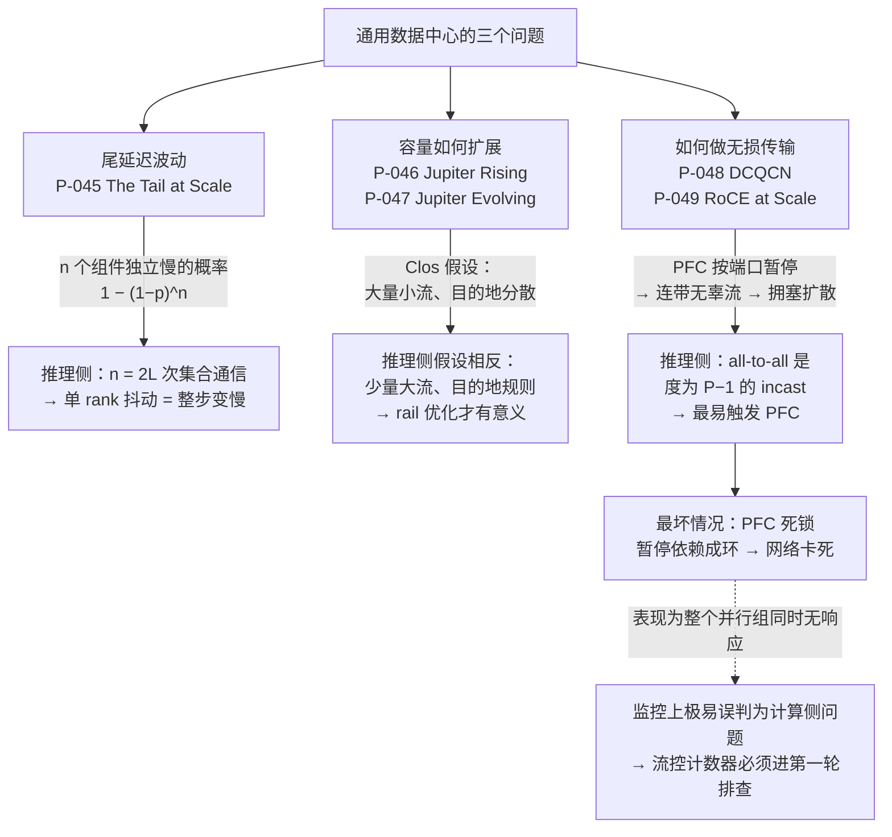

# 网络与数据中心论文卡片

> 位置：[InferenceAtlas](../../INDEX.md) > [模块 13 — 论文与技术报告地图](README.md) > 当前文档
> 信息截至：2026-08-10
> 最后核验：2026-08-10
> 内容版本：v0.1
> 时效性等级：中（机理与失败模式稳定，设备行为与配置随代际变化）
> 相关主题：[模块 08 — 网络与互连](../08_networking_and_interconnect/)｜[模块 09 — 数据中心、电力与运维](../09_datacenter_power_thermal_and_operations/)｜[本模块第 01 章 — 论文地图](01_paper_map.md)

---

> ⚠️ **降级书写**：本章**未读过任何一篇论文的正文**。
> 每张卡片的「实验设置」与「关键结果」一律为 `待核实`，
> 论文中的规模、带宽、成本与故障频率数据一律不转述。
> 完整的证据分级与纪律见 [第 01 章的降级声明](01_paper_map.md)。

## 本章导读

这五篇论文全都不是为 AI 写的。它们出自通用数据中心与云网络的建设经验，
时间跨度从 2013 到 2022 年，那时推理还不是数据中心的主要负载。

**但它们描述的机理，在推理机群里出现得更频繁、后果更严重。**

原因是 AI 集合通信的流量模式，恰好踩在这些论文所讨论的每一个痛点上：

| 论文关注的问题 | AI 推理里的对应现象 |
|---|---|
| 多组件系统中尾延迟被放大 | 张量并行每层 2 次通信，$L$ 层共 $2L$ 次，任一 rank 抖动拖住整步 |
| 少量大流、目的地规则 vs 大量小流 | 集合通信是少量大流，与通用云负载相反 |
| 多打一的 incast | all-to-all 天然是度为 $P-1$ 的 incast |
| 无损网络的连带损害 | PFC 暂停一条流会连累同端口所有流 |
| 单点故障经流控放大 | 一块坏网卡的暂停帧可拖垮整个广播域 |

**所以本章的读法是：把通用数据中心的经验当作下界。**
在那里偶尔发生的问题，在 AI 机群里是常态；
在那里可以靠重试掩盖的抖动，在同步的集合通信里会直接变成 TPOT 的尾部。

## 卡片索引

| 编号 | 简称 | 机理 | 在推理侧被放大的原因 | 本库对应章节 |
|---|---|---|---|---|
| [P-045](#p-045--the-tail-at-scale) | The Tail at Scale | 尾延迟放大 $1-(1-p)^n$ | 集合通信使 $n$ 变成 $2L$ | [模块 08 第 10 章](../08_networking_and_interconnect/10_network_congestion_tail_latency_and_qos.md) |
| [P-046](#p-046--jupiter-rising) | Jupiter Rising | Clos 拓扑与集中控制 | AI 流量模式与其假设相反 | [模块 08 第 7 章](../08_networking_and_interconnect/07_network_topologies_fat_tree_dragonfly_rail_optimized.md) |
| [P-047](#p-047--jupiter-evolving) | Jupiter Evolving | 光路交换与增量升级 | AI 硬件代际更替快于机房寿命 | [模块 09 第 6 章](../09_datacenter_power_thermal_and_operations/06_cluster_capacity_and_site_planning.md) |
| [P-048](#p-048--dcqcn) | DCQCN | RoCEv2 端到端拥塞控制 | all-to-all 是天然 incast | [模块 08 第 5 章](../08_networking_and_interconnect/05_collectives_rdma_and_communication_libraries.md) |
| [P-049](#p-049--rdma-over-commodity-ethernet-at-scale) | RoCE at Scale | PFC 死锁与暂停帧风暴 | 无损网络的故障是「卡死」不是「变慢」 | [模块 08 第 11 章](../08_networking_and_interconnect/11_network_observability_and_debugging.md) |

## 一张图：通用数据中心经验如何落到推理机群

**图解读**：

1. **图展示什么**：通用数据中心的三类问题（尾延迟、容量扩展、无损传输），
   以及每一类落到推理机群时**为什么会被放大**。
   左列是原论文的语境，右列是推理侧的对应形态。
2. **核心瓶颈**：右下角的 `L2 → F` 这条链是最该警惕的。
   all-to-all 是度为 $P-1$ 的 incast——$P-1$ 个发送端同时打向同一个接收端，
   这是最容易压垮缓冲区、触发 PFC 的模式。
   而 PFC 一旦形成环形依赖就是**死锁**，网络不是变慢而是**停住**。
3. **图中的 trade-off**：无损网络的本质是**把「丢包」换成了「卡死」**。
   丢包可以靠重传恢复，代价是延迟抖动；卡死不能自愈，需要人工或看门狗介入。
   RDMA 选择了前者的反面，因此获得了极低的 CPU 开销与稳定的低时延，
   代价就是这一整族新的失败模式。**这个交易在做之前必须知道自己买的是什么。**
4. **面试如何引用**：被问「分布式推理的 P99 突然变差，你怎么查」时，
   照这张图的右列走：先确认是不是所有 rank 同时慢（是则指向通信而非计算），
   再看流控计数器（PFC 暂停帧、ECN 标记数），最后才怀疑单卡性能。
   **主动提到「先看是不是所有 rank 同时慢」的候选人，通常真的排查过。**

---

## P-045 — The Tail at Scale

| 字段 | 内容 |
|---|---|
| 书目 | Dean, Jeffrey; Barroso, Luiz André · Communications of the ACM 2013 ·（证据类别 B） |
| 一手链接 | https://dl.acm.org/doi/10.1145/2408776.2408794 |
| 官方实现 | `待核实` — 综述性文章，无配套实现 |

**问题**：一台机器偶尔慢一下，看起来无害。
但如果一次用户请求需要几十台机器共同响应，
**这些「偶尔」会合并成「经常」。**

**背景**：这是大规模在线服务与单机性能优化在思维方式上的分水岭。

**机制**（本库可独立论证的部分）：设一次请求需要 $n$ 个组件各自响应，
每个组件独立地以概率 $p$ 出现慢响应，则整体出现慢响应的概率是

$$P(\text{整体慢}) = 1 - (1-p)^{n}$$

$n$ 稍大时这个值就迅速接近 1。
换句话说：**单机的 P99 会变成整体的常态。**

论文由此主张一个立场上的转变：延迟波动**无法根除**，
系统应当设计成能**容忍**它。手段包括对冲请求（延迟一小段后向副本重发）、
微分区、选择性复制与探测式重发。

**它在推理侧的对应形态**（本库论证，本卡片的核心）：

这个放大公式在推理栈里出现了**不止一次**：

- **张量并行**：每层两次集合通信，$L$ 层共 $2L$ 次。
  任一 rank 在任一次通信上抖动，整步就要等它。
  本库 [模块 08](../08_networking_and_interconnect/) 里的抖动放大式
  $1-(1-p)^{2L}$ 与本文是**同一个式子**；
- **MoE 的 all-to-all**：$P$ 个 rank 全参与，同理；
- **投机解码的树形验证**：树上任一分支的延迟都会影响该步。

**但推理侧还有一个更糟的性质**：本文讨论的是搜索类服务，
慢的那个组件的结果**可以被放弃**（对冲请求、或者干脆少返回一条结果）。
而集合通信**不能放弃任何一个 rank**——
它在数学上就要求全体参与。
**因此推理侧的尾延迟放大比本文的场景更难缓解**：
对冲请求这一招在这里用不了。

**实验设置**：`待核实` — 未读原文。
**关键结果**：`待核实` — 未读原文；本库不转述论文中的具体服务、分位数或实测改善。

**适用边界**（本库论证）：
- **独立性假设在实际系统中常不成立**。共享资源（网络、存储、供电、散热）
  会让慢响应**相关**——此时放大比公式预测的**更严重**而非更轻；
- 对冲请求以额外资源换尾延迟。资源紧张时它会加剧拥塞，形成正反馈——
  **过载时开启对冲是典型的雪崩加速器**；
- 在同步的集合通信中，容忍手段基本不适用（见上）。

**局限**：
- 作者自述局限：`待核实` — 未读原文。
- 工程视角局限（本库论证）：文章面向的是**可以放弃部分结果**的服务，
  这个前提在集合通信中不成立；直接照搬其缓解手段会失效。

**后续影响**：确立了「按分位数而非均值做容量规划」这一工程共识，
是尾延迟工程的奠基文本。

**面试讨论角度**：问「为什么张量并行度越高，P99 越难做」。
好的回答会写出 $1-(1-p)^{2L}$，指出通信次数随并行度与层数增长，
再补一句：**集合通信不能像搜索那样丢掉慢的那一路**，
所以对冲请求这类手段在这里用不上。

**关联文档**：[模块 08 第 10 章](../08_networking_and_interconnect/10_network_congestion_tail_latency_and_qos.md)、
[模块 01 第 3 章](../01_foundations_and_metrics/03_queueing_theory_for_inference.md)

---

## P-046 — Jupiter Rising

> 原标题：*Jupiter Rising: A Decade of Clos Topologies and Centralized Control in Google's Datacenter Network*

| 字段 | 内容 |
|---|---|
| 书目 | Singh, Arjun; Ong, Joon; Agarwal, Amit; Anderson, Glen; Armistead, Ashby; Bannon, Roy; Boving, Seb; Desai, Gaurav; et al. · SIGCOMM 2015 ·（证据类别 B） |
| 一手链接 | https://dl.acm.org/doi/10.1145/2785956.2787508 |
| 官方实现 | `待核实` — 生产网络，无开源实现 |

**问题**：数据中心网络的容量怎么扩展？
买更大的机箱式交换机有工程上限，且成本随端口数**超线性**增长。

**背景**：这是当时网络扩展的主流困境。

**机制**（本库可独立论证的部分）：用大量**商用小交换芯片**按 Clos（胖树）拓扑
堆出等效的高对分带宽。
容量扩展从「换一台更大的机箱」变成「加更多的芯片」，
成本与容量近似线性。

代价是多路径带来的复杂度：路由、故障处理、负载均衡都变难。
论文的另一半贡献是用**集中式控制平面**替代分布式协议来管理这一复杂度——
以全局视图换取多路径管理的可行性。

**它在推理侧的适用与不适用**（本库论证，本卡片的重点）：

**它是当代 AI 机群网络的拓扑基线**，这一点没有疑问。
但它的设计前提与 AI 负载**恰好相反**：

| 维度 | 通用数据中心（本文假设） | AI 集合通信 |
|---|---|---|
| 流的数量 | 大量 | 少量 |
| 单流大小 | 小 | 大 |
| 目的地分布 | 分散、难预测 | 高度规则、可预测 |
| 同步性 | 异步 | 强同步 |
| 对超订的容忍 | 较高 | 很低 |

正是因为 AI 通信模式**高度规则**，
才使 rail-optimized 这类更专用、更便宜的拓扑变得有意义
（见 [模块 08 第 7 章](../08_networking_and_interconnect/07_network_topologies_fat_tree_dragonfly_rail_optimized.md)）——
**通用 Clos 的灵活性，在这里是为不需要的东西付费**。

这也与本模块 [第 08 章 P-043](08_hardware_and_architecture_papers.md) 的光路交换判据一致：
通信模式越可预测，越可以用不灵活换成本。

**实验设置**：`待核实` — 未读原文。
**关键结果**：`待核实` — 未读原文；本库不转述论文中的规模、带宽或运营数据。

**适用边界**（本库论证）：
- **面向通用数据中心负载**，其流量模型与 AI 集合通信相反（见上表），
  拓扑与拥塞控制的结论都需要重新评估；
- 集中式控制的可行性依赖控制平面自身的可用性——
  它是一个新的单点风险，需要独立的容错设计；
- 超订比的选择在通用负载下有较大余地，在 AI 集合通信下余地很小。

**局限**：
- 作者自述局限：`待核实` — 未读原文。
- 工程视角局限（本库论证）：论文是**十年经验总结**，
  其结论与当时的商用交换芯片能力绑定；
  芯片端口密度与速率变化后，Clos 的层数与成本结构都会变。

**后续影响**：Clos + 集中控制成为超大规模数据中心网络的标准范式，
P-047 是同一网络的后续演进。

**面试讨论角度**：问「AI 机群为什么要用 rail-optimized 拓扑，通用 fat-tree 不行吗」。
好的回答会先说明 AI 通信模式的规则性，
再指出通用 Clos 的灵活性在此处是**为不需要的东西付费**，
最后给出代价：rail 优化对通信模式的假设一旦不成立（如引入 MoE 的 all-to-all），
收益会打折。

**关联文档**：[模块 08 第 7 章](../08_networking_and_interconnect/07_network_topologies_fat_tree_dragonfly_rail_optimized.md)、
[模块 08 第 6 章](../08_networking_and_interconnect/06_scale_up_vs_scale_out.md)

---

## P-047 — Jupiter Evolving

> 原标题：*Jupiter Evolving: Transforming Google's Datacenter Network via Optical Circuit Switches and Software-Defined Networking*

| 字段 | 内容 |
|---|---|
| 书目 | Poutievski, Leon; Mashayekhi, Omid; Ong, Joon; Singh, Arjun; Tariq, Muhammad Mukarram Bin; Wang, Rui; Zhang, Jianan; Beauregard, Virginia; et al. · SIGCOMM 2022 ·（证据类别 B） |
| 一手链接 | [Google Research 官方页](https://research.google/pubs/jupiter-evolving-transforming-googles-datacenter-network-via-optical-circuit-switches-and-software-defined-networking/) |
| 官方实现 | `待核实` — 生产网络，无开源实现 |

**问题**：标准 Clos 有一个运维上的硬伤——**最高层必须统一换代**。
任何一块用了新一代速率的机柜，都要等 spine 层全体升级才能发挥。
于是技术更新变成一次全场停机式的大工程。

**背景**：网络设备的代际速度快于数据中心的物理寿命，这个矛盾会反复出现。

**机制**（本库可独立论证的部分）：把 Clos 的 spine 层换成**光路交换机**。

光路交换不解析分组，因此对速率与协议**透明**——
不同代际、不同速率的机柜可以共存于同一网络，按块逐步替换，
而不是一次性全网升级。
配合软件定义的拓扑工程，还可以按当前流量矩阵重新配置逻辑拓扑。

**它对推理机群的意义主要在运维经济性**（本库论证）：

AI 硬件的代际更替速度**远快于**数据中心的物理寿命。
这就带来一个具体问题：当新一代加速器需要更高的网络速率时，
旧机柜是被迫提前退役，还是可以继续服役？

网络能否容纳**异构代际**，直接决定了这个答案，
进而决定了机群的实际折旧周期——
这与本库 [模块 09 第 6 章](../09_datacenter_power_thermal_and_operations/06_cluster_capacity_and_site_planning.md)
的容量规划直接相关，也与本模块
[第 03 章 P-015 Splitwise](03_batching_serving_and_scheduler_papers.md) 的
「decode 池用上一代加速器」构成配套——
**后者要能成立，前者必须先成立**。

**实验设置**：`待核实` — 未读原文。
**关键结果**：`待核实` — 未读原文；本库不转述论文自述的速率提升、成本或功耗下降比例。

**适用边界**（本库论证）：
- 光路交换**无法做分组级负载均衡**。突发流量只能靠拓扑工程的时间尺度响应，
  而这个时间尺度远长于一次集合通信；
- **与自建数据中心的运营模式强绑定**。
  租用机柜或使用公有云的部署方无法采用这一方案——
  对多数团队而言，这篇论文的价值是理解**供应商为什么这样定价**，
  而不是自己照做；
- 光路交换机本身是新的故障域与运维对象。

**局限**：
- 作者自述局限：`待核实` — 未读原文。
- 工程视角局限（本库论证）：方案与特定的光交换设备能力绑定，
  切换时间、端口规模与可靠性都会影响可行性，而这些数据本库无从获取。

**后续影响**：把光路交换从学术方案推到生产规模，
并使「网络支持异构代际共存」成为大规模机群规划中的一个显式变量。

**面试讨论角度**：问「AI 机群里，网络设备的更新节奏应该怎么和加速器对齐」。
好的回答会指出加速器代际快于机房寿命，
因此网络能否容纳异构代际决定旧机柜的实际折旧周期；
再指出这正是「decode 池用上一代卡」这类成本优化能否落地的前提。

**关联文档**：[模块 09 第 6 章](../09_datacenter_power_thermal_and_operations/06_cluster_capacity_and_site_planning.md)、
[本模块第 08 章 P-043](08_hardware_and_architecture_papers.md)

---

## P-048 — DCQCN

> 原标题：*Congestion Control for Large-Scale RDMA Deployments*

| 字段 | 内容 |
|---|---|
| 书目 | Zhu, Yibo; Eran, Haggai; Firestone, Daniel; Guo, Chuanxiong; Lipshteyn, Marina; Liron, Yehonatan; Padhye, Jitendra; Raindel, Shachar; et al. · SIGCOMM 2015 ·（证据类别 B） |
| 一手链接 | https://dl.acm.org/doi/10.1145/2785956.2787484 |
| 官方实现 | `待核实` — 实现在网卡固件中 |

**问题**：RDMA 要求近乎无损的网络。
传统做法是用 **PFC**（优先级流控）逐跳暂停发送端。
但 PFC 是**按端口粒度**暂停的——
一条拥塞的流会连累同端口的所有流，并沿路径向上游扩散，形成拥塞树。

**背景**：无损是 RDMA 的前提，而 PFC 是当时唯一现成的无损手段。

**机制**（本库可独立论证的部分）：在网卡上实现**端到端**的速率控制。

交换机在拥塞时用 ECN 标记分组，接收端把标记信息反馈给发送端，
发送端据此调整发送速率。
拥塞因此在**源头**被抑制，PFC 退化为最后一道保险而非常规手段。

速率控制必须在**网卡硬件**上实现——
否则 CPU 开销会抵消掉 RDMA 存在的意义。

**它在推理侧为什么格外重要**（本库论证）：

推理侧的分布式通信有三个特征，每一个都对拥塞控制不利：

1. **同步**：所有 rank 同时开始、同时等待结束；
2. **突发**：不是稳定流，而是每步一次的脉冲；
3. **多打一**：all-to-all 天然是度为 $P-1$ 的 **incast**——
   $P-1$ 个发送端同时打向同一个接收端。

incast 是最容易压垮交换机缓冲、触发 PFC 的模式。
而按本库 [模块 08](../08_networking_and_interconnect/) 的分析，
**任一 rank 被暂停就会拖住整步**——
所以**拥塞控制的质量直接体现在 TPOT 的尾部**，
它不是一个「网络团队的事」。

**实验设置**：`待核实` — 未读原文。
**关键结果**：`待核实` — 未读原文；本库不转述论文中的吞吐、公平性或实测参数。

**适用边界**（本库论证）：
- **参数整定（ECN 阈值、速率增减步长）对拓扑与流量模式敏感**。
  厂商默认值是按通用数据中心流量整定的，
  **未必适合 AI 集合通信这种同步突发模式**——这是一个常被忽略的调优面；
- 端到端控制有反馈延迟，对**微突发**的响应能力有限。
  而集合通信恰恰是微突发的典型；
- 它降低了对 PFC 的依赖，但**没有消除** PFC——P-049 讨论的失败模式依然存在。

**局限**：
- 作者自述局限：`待核实` — 未读原文。
- 工程视角局限（本库论证）：实现在网卡固件中，
  因此 RDMA 的实际行为与**具体网卡型号与固件版本强相关**；
  跨型号的性能结论不可搬运，这也让线上问题的复现变得困难。

**后续影响**：成为 RoCEv2 部署的事实标准拥塞控制方案，
被广泛实现在商用网卡中。

**面试讨论角度**：问「为什么 RDMA 网络还需要拥塞控制，PFC 不是已经无损了吗」。
好的回答会指出 PFC 是**按端口粒度**暂停的，
会连累无辜流并向上游扩散；
端到端拥塞控制把控制点移回源端，让 PFC 只做保险。
可以追问：「AI 流量下默认参数够用吗？」——答案是需要按同步突发模式重新整定。

**关联文档**：[模块 08 第 5 章](../08_networking_and_interconnect/05_collectives_rdma_and_communication_libraries.md)、
[模块 08 第 10 章](../08_networking_and_interconnect/10_network_congestion_tail_latency_and_qos.md)

---

## P-049 — RDMA over Commodity Ethernet at Scale

| 字段 | 内容 |
|---|---|
| 书目 | Guo, Chuanxiong; Wu, Haitao; Deng, Zhong; Soni, Gaurav; Ye, Jianxi; Padhye, Jitu; Lipshteyn, Marina · SIGCOMM 2016 ·（证据类别 B） |
| 一手链接 | https://dl.acm.org/doi/10.1145/2934872.2934908 |
| 官方实现 | `待核实` — 生产部署经验，无开源实现 |

**问题**：DCQCN 解决了拥塞控制。
但在真正的大规模部署里，**还有一整族失败模式在等着**，
而且它们的表现不是「变慢」。

**背景**：这是本章唯一一篇**以失败模式为主体**的论文，
也因此是对工程读者最有直接价值的一篇。

**机制**（本库可独立论证的部分）：论文报告了三类真实发生的故障。

1. **PFC 死锁**：暂停信号沿**环形依赖**传播，形成互相等待，网络永久卡死。
   其成因与路由环路同构——只是这里成环的是「谁在等谁停」；
2. **暂停帧风暴**：一块故障网卡持续发送暂停帧，
   把整个广播域拖垮。**单点故障经流控被放大成域级故障**；
3. **传输活锁**：重传策略与流控相互作用，导致有流量但无进展。

对策包括用 DSCP 而非 VLAN 承载优先级（以便跨三层部署），
以及在网卡与交换机侧加入看门狗。

**它给推理运维的核心结论**（本库论证，本卡片最该记住的一句）：

> **RDMA 网络的故障模式不是「变慢」，而是「停住」。**

这句话的运维后果很具体：
故障发生时，表现是**整个并行组同时无响应**。
在监控面板上，这看起来像是计算侧卡住了——
GPU 利用率掉到零、没有报错、请求全部超时。
**极易被误判为模型或调度问题，从而把排查方向引到完全错误的地方。**

因此本库 [模块 08 第 11 章](../08_networking_and_interconnect/11_network_observability_and_debugging.md)
把流控计数器（PFC 暂停帧计数、ECN 标记数）列为第一轮排查项，
其依据就在这里。

**无损网络的本质，是把「丢包」换成了「卡死」**——
丢包可以靠重传自愈，卡死不能。这是做这个交易时买到的东西。

**实验设置**：`待核实` — 未读原文。
**关键结果**：`待核实` — 未读原文；本库不转述论文中的部署规模、故障频率或实测数据。

**适用边界**（本库论证）：
- 对策与**当时的网卡、交换机固件行为绑定**，
  **具体配置不可直接照搬到今天的设备**——
  应当把这篇论文当作「要检查哪些东西」的清单，而不是「照着配」的手册；
- 论文面向通用数据中心。
  AI 集合通信的流量模式更极端（同步、突发、incast），
  **触发这些失败模式的门槛更低而非更高**；
- 死锁的检测依赖看门狗，而看门狗的阈值本身需要整定——
  过灵敏会误杀，过迟钝则死锁已经造成影响。

**局限**：
- 作者自述局限：`待核实` — 未读原文。
- 工程视角局限（本库论证）：这类经验总结的价值在于**问题清单**而非解法，
  解法会随设备演进而失效，问题不会。

**后续影响**：确立了「无损以太网的可运维性」这一议题，
其失败模式清单至今仍是 RDMA 部署的必查项。

**面试讨论角度**：问「分布式推理的所有 rank 突然全部无响应，你怎么查」。
这是一道很好的现场题。
好的回答会**先排除计算侧**（所有 rank 同时挂，通常不是计算问题），
再直接去看流控计数器与链路状态，
并主动提到 PFC 死锁与暂停帧风暴这两种「停住而不是变慢」的模式。

**关联文档**：[模块 08 第 11 章](../08_networking_and_interconnect/11_network_observability_and_debugging.md)、
[模块 08 第 12 章](../08_networking_and_interconnect/12_inference_network_case_studies.md)

---

## 本章小结

**这五篇论文都不是为 AI 写的，但推理机群把它们描述的每一个问题都放大了。**

| 卡片 | 通用数据中心里的形态 | 推理机群里的形态 |
|---|---|---|
| P-045 The Tail at Scale | 偶尔慢一下，可用对冲请求掩盖 | $2L$ 次同步通信，**对冲请求用不了** |
| P-046 Jupiter Rising | 大量小流、目的地分散 | 少量大流、目的地规则 → **rail 优化才有意义** |
| P-047 Jupiter Evolving | 网络代际快于机房寿命 | 加速器代际更快 → **决定旧机柜能否继续服役** |
| P-048 DCQCN | 通用流量下的拥塞控制 | all-to-all 是 $P-1$ 度 incast → **默认参数未必适用** |
| P-049 RoCE at Scale | 偶发的运维故障 | 触发门槛更低，且**表现为整组卡死而非变慢** |

**三条可以直接用的判断：**

1. **集合通信不能丢掉慢的那一路。**
   本文族的尾延迟缓解手段（对冲、部分结果）在同步通信里全部失效，
   所以推理侧只能从源头压制抖动，不能靠冗余掩盖。
2. **通信模式越可预测，越可以用不灵活换成本。**
   这条判据同时解释了 rail-optimized 拓扑（P-046 的反面）
   与光路交换（P-047、[第 08 章 P-043](08_hardware_and_architecture_papers.md)）。
3. **RDMA 网络的故障是「停住」不是「变慢」。**
   排查分布式推理的全组无响应时，
   **先看是不是所有 rank 同时慢，再看流控计数器**——
   在怀疑模型和调度之前。

本章全部五张卡片的「实验设置」与「关键结果」均为 `待核实`，
理由见 [第 01 章的降级声明](01_paper_map.md)。
上表每一行的右列都来自本库模块 08 的自有推导，而非论文数据。

## 关键术语

| 中文术语 | 英文 | 定义 | 单位/口径 | 关联文档 |
|---|---|---|---|---|
| 尾延迟放大 | tail latency amplification | $n$ 个组件参与时整体变慢的概率 $1-(1-p)^n$ | % | 本章 P-045 |
| 对冲请求 | hedged request | 延迟一小段后向副本重发，取先返回者；集合通信中不适用 | — | 本章 P-045 |
| 对分带宽 | bisection bandwidth | 把网络对半切开后跨越切面的总带宽 | Tb/s | [模块 08 第 7 章](../08_networking_and_interconnect/07_network_topologies_fat_tree_dragonfly_rail_optimized.md) |
| 超订比 | oversubscription ratio | 下行容量与上行容量之比；AI 集合通信对其容忍度低 | 无量纲 | 本章 P-046 |
| 优先级流控 | PFC (priority flow control) | 逐跳按端口暂停发送以实现无损；粒度粗，会连带无辜流 | — | 本章 P-048 |
| incast | incast | 多个发送端同时打向同一接收端；all-to-all 的度为 $P-1$ | — | 本章 P-048 |
| 显式拥塞通告 | ECN (explicit congestion notification) | 交换机标记分组以通知拥塞，供端到端速率控制使用 | — | 本章 P-048 |
| PFC 死锁 | PFC deadlock | 暂停依赖成环导致网络永久卡死，与路由环路同构 | — | 本章 P-049 |
| 暂停帧风暴 | pause frame storm | 故障网卡持续发送暂停帧，把单点故障放大为域级故障 | — | 本章 P-049 |

## 延伸阅读

- [本模块第 01 章 — 论文地图](01_paper_map.md)：本章在整体地图中的位置
- [本模块第 07 章](07_distributed_and_moe_inference_papers.md)：这些通信模式是从哪里来的
- [本模块第 08 章 P-043](08_hardware_and_architecture_papers.md)：光路交换的硬件侧视角
- [模块 08 第 11 章 — 网络可观测性与排障](../08_networking_and_interconnect/11_network_observability_and_debugging.md)
- [`code/reproduction_toolkit.py`](../../code/reproduction_toolkit.py)：`jitter_amplification`、`allreduce_ring`、`comm_share_of_tpot` 可验算本章的放大与占比结论

## 主要来源

| 来源 | 类型 | 用途 | 披露标签 | 核验日期 |
|---|---|---|---|:---:|
| WebSearch 书目检索 | 二级来源 | 本章五篇的书目字段与 DOI（逐条核对，未凭记忆填写） | `待核实` | 2026-08-10 |
| 本库模块 08、09 的推导 | 本仓库自有推导 | 抖动放大式、incast 分析、故障排查顺序、异构代际与折旧的关联 | — | 2026-08-10 |
| 各论文正文 | 一手来源 | **未读**——出口策略拒绝，见 [AGENTS.md 第 11 节](../../AGENTS.md) | `待核实` | — |
| 各设备厂商技术文档 | 一手来源 | **未读**——出口策略拒绝；故本章**不给出任何设备配置参数** | `待核实` | — |

## 更新记录

| 日期 | 版本 | 变更 | 核验人 |
|---|---|---|---|
| 2026-08-10 | v0.1 | 初稿：P-045~P-049 五张降级卡片；核心产出为**「通用数据中心形态 → 推理机群形态」对照表**，逐条说明为什么同一问题在推理侧被放大 | — |
