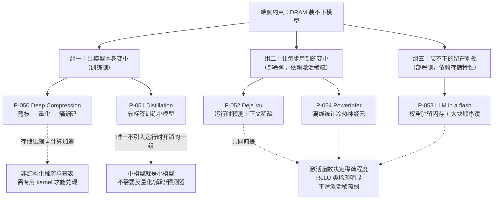

# 边缘推理论文卡片

> 位置：[InferenceAtlas](../../INDEX.md) > [模块 13 — 论文与技术报告地图](README.md) > 当前文档
> 信息截至：2026-08-10
> 最后核验：2026-08-10
> 内容版本：v0.1
> 时效性等级：中（约束结构稳定，具体方法随激活函数与存储介质演化）
> 相关主题：[模块 10 — Edge 与 On-Device 推理](../10_edge_and_on_device_inference/)｜[模块 02 第 8 章 — KV 压缩与驱逐](../02_transformer_and_kv_cache/08_kv_cache_compression_quantization_and_eviction.md)｜[本模块第 01 章 — 论文地图](01_paper_map.md)

---

> ⚠️ **降级书写**：本章**未读过任何一篇论文的正文**。
> 每张卡片的「实验设置」与「关键结果」一律为 `待核实`，
> 压缩倍数、加速比、精度保持率一律不转述。
> 完整的证据分级与纪律见 [第 01 章的降级声明](01_paper_map.md)。

## 本章导读

端侧推理与服务器推理面对的是**同一个方程、完全不同的约束**。

服务器侧的问题是「显存装得下，但带宽不够用」；
端侧的问题往往更靠前一步——**装不下**。
DRAM 容量以 GB 计而不是以百 GB 计，
于是「权重放哪」这个在服务器上不成问题的问题，成了端侧的核心问题。

本章五篇论文可以按它们**在哪一层解决「装不下」**分成三组：

| 层次 | 做法 | 卡片 |
|---|---|---|
| **让模型本身变小** | 剪枝+量化+熵编码；蒸馏 | P-050 Deep Compression、P-051 Distillation |
| **让每步用到的部分变小** | 上下文稀疏；冷热神经元分层 | P-052 Deja Vu、P-054 PowerInfer |
| **让装不下的部分留在别处** | 权重驻留闪存，按需加载 | P-053 LLM in a flash |

**这三组的工程性质完全不同**，混谈会导致选型错误：
第一组是**训练侧**手段（需要重训或教师模型），部署方拿到权重后无能为力；
第二、三组是**部署侧**手段，但都依赖一个共同前提——**激活稀疏性**，
而这个前提由模型用的激活函数决定，同样不在部署方手里。

**所以端侧优化的可行空间，在选型时就基本被锁死了。**
这是本章最该带走的一条判断。

## 卡片索引

| 编号 | 简称 | 解决「装不下」的层次 | 是否需要训练侧介入 | 官方实现 |
|---|---|---|:---:|---|
| [P-050](#p-050--deep-compression) | Deep Compression | 模型变小 | 是 | 待核实 |
| [P-051](#p-051--distillation) | Distillation | 模型变小 | 是 | 待核实 |
| [P-052](#p-052--deja-vu) | Deja Vu | 每步用到的变小 | 取决于激活函数 | 待核实 |
| [P-054](#p-054--powerinfer) | PowerInfer | 每步用到的变小 | 取决于激活函数 | ✅ 仓库可读 |
| [P-053](#p-053--llm-in-a-flash) | LLM in a flash | 装不下的留在别处 | 取决于激活函数 | 待核实 |

## 一张图：端侧的存储层次与三组方法的落点

**图解读**：

1. **图展示什么**：端侧「装不下」这一约束的三条解法，以及每条解法各自依赖的前提（虚线）。
   虚线指向的才是选型时真正要问的问题——**方法能不能用，取决于这些前提成不成立**。
2. **核心瓶颈**：右侧的 `A` 节点是本图最关键的信息。
   组二与组三**共享同一个前提**：模型的激活必须足够稀疏。
   而稀疏程度由激活函数决定——ReLU 类激活稀疏明显，
   当代常用的平滑激活稀疏性弱得多。
   **这意味着三种看似不同的方法，会在同一批模型上一起失效**，
   它们不是互为备份的。
3. **图中的 trade-off**：`B` 与 `C` 是两条相反的注解。
   Deep Compression 压的是**存储**，而 LLM decode 的瓶颈是**带宽**——
   两者只在「权重变小」这点重合，且非结构化稀疏与熵编码都需要专用 kernel 才能兑现为加速。
   蒸馏则相反：它是**唯一一组不引入任何运行时开销**的方法——
   小模型就是小模型，不需要反量化、不需要稀疏解码、不需要预测器。
   代价是它要训练算力与教师模型的访问权。
4. **面试如何引用**：被问「端侧部署一个大模型，你会怎么做」时，
   先问三件事：能不能改模型（决定组一可用性）、
   模型用的什么激活函数（决定组二、组三可用性）、
   存储介质是什么（决定组三的收益形状）。
   **不问前提直接报方案，是这道题最常见的失分点。**

---

## P-050 — Deep Compression

> 原标题：*Deep Compression: Compressing Deep Neural Networks with Pruning, Trained Quantization and Huffman Coding*

| 字段 | 内容 |
|---|---|
| 书目 | Han, Song; Mao, Huizi; Dally, William J. · ICLR 2016 ·（证据类别 B；arXiv 编号经限定域检索确认） |
| 一手链接 | https://arxiv.org/abs/1510.00149 |
| 官方实现 | `待核实` — 本库未能确认官方实现仓库 |

**问题**：模型太大，装不进设备的存储与内存。

**背景**：当时的压缩工作多是单点技巧——只剪枝，或只量化。

**机制**（本库可独立论证的部分）：把三种手段串成一条流水线：

1. **剪枝**：去掉不重要的连接；
2. **训练感知量化**：对剩余权重做聚类，使多个连接共享同一个量化中心；
3. **熵编码**：压缩权重索引的存储表示。

关键结构不在于这三步本身，而在于**每一步之后都重训**——
压缩不是一次性后处理，而是与训练交替进行的过程。
这个「压缩—重训—再压缩」的循环，是后续绝大多数压缩工作的组织方式。

**它解决「装不下」的层次**：让模型本身变小（训练侧）。

**它优化的是存储，而 LLM decode 的瓶颈是带宽**（本库论证，本卡片最该注意的一条）：

这两件事只在「权重变小」这一点上重合，收益路径并不相同：

- 存储压缩看的是**磁盘/内存占用**，熵编码在这里完全有效；
- 带宽瓶颈看的是**每步从内存读进计算单元的字节数**。
  熵编码后的权重必须先解码才能算，解码开销可能吃掉全部收益；
  非结构化稀疏在通用硬件上也难以兑现为跳过的访存。

**「压缩了 N 倍」与「快了 N 倍」是两个数字**，而且通常差得很远。
本文是这一落差最早的典型案例。

**实验设置**：`待核实` — 未读原文。
**关键结果**：`待核实` — 未读原文；本库不转述任何压缩倍数、精度保持或模型体积数字。

**适用边界**（本库论证）：
- **面向 CNN**。剪枝粒度与冗余结构基于卷积层，
  LLM 的权重冗余结构不同，压缩比不可外推；
- 非结构化稀疏对硬件不友好，收益强依赖专用 kernel
  （与本模块 [第 05 章 P-028](05_quantization_and_compression_papers.md) 遇到的是同一类障碍）；
- 三个阶段都需要训练侧介入——**部署方拿到权重后用不上**。

**局限**：
- 作者自述局限：`待核实` — 未读原文。
- 工程视角局限（本库论证）：流水线中每一步都引入超参（剪枝率、聚类数、编码方式），
  组合调优成本高；
  各步之间的交互不独立，单独调好不等于组合起来好。

**后续影响**：确立了「模型压缩」作为一个可组合流程的框架，
本库 [模块 10 第 7 章](../10_edge_and_on_device_inference/07_quantization_distillation_and_pruning_for_edge.md)
的端侧压缩讨论沿用这一分层。

**面试讨论角度**：问「模型压缩了 4 倍，推理会快 4 倍吗」。
好的回答会区分**存储压缩**与**带宽/算力收益**，
并指出熵编码需要解码、非结构化稀疏需要专用 kernel——
两者都可能让实测加速远低于压缩比。

**关联文档**：[模块 10 第 7 章](../10_edge_and_on_device_inference/07_quantization_distillation_and_pruning_for_edge.md)、
[本模块第 05 章](05_quantization_and_compression_papers.md)

---

## P-051 — Distillation

> 原标题：*Distilling the Knowledge in a Neural Network*

| 字段 | 内容 |
|---|---|
| 书目 | Hinton, Geoffrey; Vinyals, Oriol; Dean, Jeff · arXiv preprint · 2015 ·（证据类别 B；arXiv 编号经限定域检索确认） |
| 一手链接 | https://arxiv.org/abs/1503.02531 |
| 官方实现 | `待核实` — 本库未能确认官方实现仓库 |

**问题**：大模型（或模型集成）效果好但太贵。
能不能把它「学会的东西」转移到一个小模型里？

**背景**：直接用同样的数据训练小模型，效果通常明显更差。
差在哪里？

**机制**（本库可独立论证的部分）：差在**标签携带的信息量**。

硬标签只告诉学生「正确答案是第 3 类」；
而教师模型的输出分布还包含「第 7 类也有点像、第 2 类完全不像」这样的信息——
这部分信息在硬标签里被完全丢弃了。

提高 softmax 温度可以让分布更平滑，把这些类间相对关系放大出来：

$$\mathcal{L} = \alpha \cdot \mathcal{L}_{\text{软标签}}(T) + (1-\alpha)\cdot\mathcal{L}_{\text{硬标签}}$$

其中 $T$ 为温度，$\alpha$ 为两项的权重。

**它解决「装不下」的层次**：让模型本身变小（训练侧）。

**它是唯一一组不引入运行时开销的方法**（本库论证）：

这一点值得单独强调。量化需要反量化 kernel、
稀疏需要预测器或索引解码、闪存加载需要调度逻辑——
它们都在推理时增加了新的东西。

**蒸馏什么都不增加：小模型就是小模型。**
它直接减小步时间方程中的 $W$ 项，
没有任何需要配合的 kernel，也没有任何会静默失效的组件。
这是它在端侧部署中长期有效、且**最容易被低估**的原因。

在 LLM 时代它演化成了「用大模型生成训练数据」，
机制已经不同，但「把大模型的判断转移给小模型」这个思路同源。

**实验设置**：`待核实` — 未读原文。
**关键结果**：`待核实` — 未读原文；本库不转述任何精度数字或模型规模对比。

**适用边界**（本库论证）：
- 需要**训练算力**与**教师模型的访问权**——
  这两样在多数部署场景里都不具备；
- 学生模型的能力上限受其结构容量约束，**蒸馏不能突破**；
- 在 LLM 上，蒸馏出的小模型在长尾任务与推理任务上的退化，
  往往**比基准分数显示的更严重**——
  这一点与本模块 [第 11 章 P-057](11_reliability_and_benchmarking_papers.md) 的多维度评测主张直接相关。

**局限**：
- 作者自述局限：`待核实` — 未读原文。
- 工程视角局限（本库论证）：温度与损失权重是需要整定的超参；
  蒸馏的效果高度依赖教师与学生的结构匹配程度，跨结构族的蒸馏效果不稳定。

**后续影响**：知识蒸馏成为模型压缩的三大路线之一（另两条是量化与剪枝），
并在 LLM 时代以数据蒸馏的形式延续。

**面试讨论角度**：问「量化、剪枝、蒸馏，端侧部署你先做哪个」。
好的回答会指出蒸馏是**唯一不增加运行时组件**的一条，
但它要训练侧资源；而量化与剪枝是部署侧可做的，
但都需要 kernel 配合才能兑现收益。**选哪条取决于你手上有什么。**

**关联文档**：[模块 10 第 7 章](../10_edge_and_on_device_inference/07_quantization_distillation_and_pruning_for_edge.md)、
[模块 10 第 6 章](../10_edge_and_on_device_inference/06_small_language_models_and_on_device_agents.md)

---

## P-052 — Deja Vu

> 原标题：*Deja Vu: Contextual Sparsity for Efficient LLMs at Inference Time*

| 字段 | 内容 |
|---|---|
| 书目 | Liu, Zichang; Wang, Jue; Dao, Tri; Zhou, Tianyi; Yuan, Binhang; Song, Zhao; Shrivastava, Anshumali; Zhang, Ce; et al. · ICML 2023 ·（证据类别 B；PMLR 官方页链接由 PowerInfer 仓库 README 给出并经检索确认） |
| 一手链接 | [PMLR v202](https://proceedings.mlr.press/v202/liu23am.html) |
| 官方实现 | `待核实` — 存在同名社区仓库，但本库未能确认其官方性 |

**问题**：静态剪枝要求「这些权重对**所有**输入都不重要」——这个条件很强，
所以能剪掉的比例有限。**有没有更弱、但同样有用的条件？**

**背景**：这是从「静态稀疏」到「动态稀疏」的转折点。

**机制**（本库可独立论证的部分）：论文观察到一个弱得多的性质——
**对给定的某一个输入**，只有少量注意力头与 MLP 神经元的激活显著，其余接近零。
这被称为**上下文稀疏**：稀疏模式是**输入的函数**，而不是权重的固定属性。

代价是这个模式必须在运行时确定。
论文用轻量预测器，在计算某层之前就判断该层哪些单元需要算，
从而跳过其余部分。

**这里有一个必须满足的不等式**（本库论证）：

$$\text{预测器开销} < \text{跳过的计算与访存节省}$$

否则收益为负。这也解释了预测器为什么必须极轻——
它是这个方案能否成立的关键，而不是一个可有可无的组件。

**它解决「装不下」的层次**：让每步用到的变小（部署侧）。

**为什么这一条在 decode 上直接生效**（本库论证）：
跳过的神经元，其权重**根本不必从显存读进来**。
所以它压缩的是步时间方程里的 $W$ 项本身，
而且**不像量化那样需要反量化 kernel 配合**——
省下的访存是真省。

**实验设置**：`待核实` — 未读原文。
**关键结果**：`待核实` — 未读原文；本库不转述任何稀疏度、加速比或质量保持数字。

**适用边界**（本库论证，本条是全章的关键约束）：
- **依赖激活的稀疏结构，而该结构由激活函数决定**。
  ReLU 类激活天然产生大量精确的零，稀疏明显；
  当代模型常用的平滑激活不产生精确零，稀疏性弱得多。
  **这直接限制了方法的适用模型范围**——
  而且它与 P-053、P-054 共享这一前提，三者会一起失效；
- 预测器有开销与误判风险，误判造成的是**质量损失**而非报错；
- 动态稀疏使每步读取的权重集合可变，与固定形状的 kernel、
  CUDA Graph 捕获存在张力（见 [模块 04 第 10 章](../04_compilers_runtimes_and_kernels/10_cuda_graphs_and_execution_overhead.md)）。

**局限**：
- 作者自述局限：`待核实` — 未读原文。
- 工程视角局限（本库论证）：预测器需要针对具体模型训练，换模型即需重训；
  稀疏度随输入分布变化，容量规划需按分位数而非均值做——
  这与本模块 [第 07 章 P-039 MegaBlocks](07_distributed_and_moe_inference_papers.md) 遇到的是同一类问题。

**后续影响**：确立了「上下文稀疏」这一概念，
是 P-054 PowerInfer 的直接思想来源（后者的仓库 README 明确致谢本文）。

**面试讨论角度**：问「静态剪枝和动态稀疏有什么区别」。
好的回答会指出前者要求权重对所有输入都不重要（强条件），
后者只要求对当前输入不重要（弱条件），因此可跳过的比例大得多；
再追问「代价是什么」——答案是必须在运行时预测，且预测器开销必须小于收益。

**关联文档**：[模块 10 第 7 章](../10_edge_and_on_device_inference/07_quantization_distillation_and_pruning_for_edge.md)、
[模块 02 第 8 章](../02_transformer_and_kv_cache/08_kv_cache_compression_quantization_and_eviction.md)

---

## P-054 — PowerInfer

> 原标题：*PowerInfer: Fast Large Language Model Serving with a Consumer-grade GPU*

| 字段 | 内容 |
|---|---|
| 书目 | Song, Yixin; Mi, Zeyu; Xie, Haotong; Chen, Haibo · arXiv preprint · 2023 ·（**证据类别 A**：作者在官方仓库 README 中给出的 BibTeX） |
| 一手链接 | https://arxiv.org/abs/2312.12456 |
| 官方实现 | [`SJTU-IPADS/PowerInfer`](https://github.com/SJTU-IPADS/PowerInfer)（`开源代码/配置披露`，核验于 2026-08-10） |

**问题**：消费级显卡的显存装不下模型。
但主机内存装得下——**能不能让两者分工？**

**背景**：朴素的「放不下就换出到内存」会让 PCIe 成为瓶颈，
因为每步都要搬运大量权重。

**机制**（本库可独立论证的部分）：关键观察是
**激活频率在神经元之间高度不均**——少数神经元被绝大多数输入激活，
多数神经元很少被激活。

而且这个分布是**离线可统计的**，与具体输入无关。
这是它与 P-052 的根本区别：

| | P-052 Deja Vu | P-054 PowerInfer |
|---|---|---|
| 稀疏模式 | 随输入变化 | 统计意义上固定 |
| 何时确定 | 运行时预测 | 离线统计 |
| 需要预测器 | 是 | 否 |
| 划分粒度 | 每步不同 | 全程固定 |

据此把「热」神经元的权重常驻显存、「冷」神经元留在主机内存由 CPU 计算，
两侧结果合并。**显存容量约束因此被部分解除，而不必每步搬运权重。**

**它解决「装不下」的层次**：让每步用到的变小（部署侧）。

**它对应本库的两段式模型**（本库论证）：

$$t = \varphi\,\frac{W}{\text{BW}_{\text{gpu}}} + (1-\varphi)\,\frac{W}{\text{BW}_{\text{cpu}}}$$

其中 $\varphi$ 为常驻 GPU 的权重占比。
由于两侧带宽差距很大，**慢的一侧很快主导总时间**——
按本库 [模块 10](../10_edge_and_on_device_inference/) 的分析，
当带宽比为 $r$ 时，慢侧占比超过 $1/(1+r)$ 后收益迅速衰减。
**这意味着冷热划分比例存在一个陡峭的可用区间**，
不是「多放一点在 CPU 也没关系」。

**实验设置**：`待核实` — 未读原文。
**关键结果**：`待核实` — 未读原文；本库不转述任何显卡型号、模型规模或加速比。

**适用边界**（本库论证）：
- **同样依赖 ReLU 类激活的稀疏性**——与 P-052、P-053 共享这一前提。
  对使用平滑激活的模型，需要先做激活替换与续训，
  **这就把一个部署侧方案变成了训练侧方案**；
- 冷热划分是**静态**的。若线上输入分布与统计时不同，热集合会失配，
  且失配的表现是性能缓慢劣化而非报错；
- 在**集成显存的 SoC** 上（GPU 与 CPU 共享同一物理内存），
  两侧带宽相同，这一划分的意义大幅减弱——
  这是端侧设备与桌面独显机器的一个结构性差异。

**局限**：
- 作者自述局限：`待核实` — 未读原文。
- 工程视角局限（本库论证）：CPU 侧计算引入新的性能变量（核数、内存带宽、线程调度），
  使部署结果**难以跨机器复现**；
  两侧的负载均衡需要按具体机器整定，缺乏通用默认值。

**后续影响**：把「冷热分层」确立为消费级硬件上服务大模型的一条现实路线，
其仓库是本章唯一有官方实现可读的卡片。

**面试讨论角度**：问「显存不够，把一部分权重放 CPU 算，可行吗」。
好的回答会先写出两段式时间模型，指出**慢的一侧很快主导总时间**，
因此可用区间很窄；
再指出可行性依赖激活稀疏性与两侧带宽比，
最后补一句：**在共享内存的 SoC 上这个方案基本不成立**。

**关联文档**：[模块 10 第 8 章](../10_edge_and_on_device_inference/08_private_hybrid_cloud_edge_architectures.md)、
[模块 10 第 4 章](../10_edge_and_on_device_inference/04_pc_ai_inference.md)

---

## P-053 — LLM in a flash

> 原标题：*LLM in a flash: Efficient Large Language Model Inference with Limited Memory*

| 字段 | 内容 |
|---|---|
| 书目 | Alizadeh, Keivan; Mirzadeh, Iman; Belenko, Dmitry; Khatamifard, S. Karen; Cho, Minsik; Del Mundo, Carlo C; Rastegari, Mohammad; Farajtabar, Mehrdad · arXiv preprint · 2023 ·（证据类别 B；是否有正式会议版本 `待核实`） |
| 一手链接 | https://arxiv.org/abs/2312.11514 |
| 官方实现 | `待核实` — 本库未能确认官方实现仓库 |

**问题**：如果连主机内存也装不下呢？
端侧设备的 DRAM 以 GB 计——**再往下只剩闪存**。

**背景**：此前「装不下就放弃」是默认答案。

**机制**（本库可独立论证的部分）：把权重放在**闪存**里，按需加载到 DRAM。

难点在于闪存的性能特性与 DRAM 完全不同：
**大块顺序读远快于小块随机读**，两者可以差一个数量级。
因此朴素的「用到哪个神经元就读哪个」是最差的访问模式。

本文的做法是建立一个**以闪存特性为参数**的推理成本模型，
并据此做两件事：

1. **窗口化**：复用上一步已激活的神经元，减少每步新增的读取量；
2. **行列捆绑**：改变权重的存放布局，把要一起读的数据放在一起，
   增大连续读取的块大小。

**它解决「装不下」的层次**：装不下的留在别处（部署侧）。

**它把带宽分析下推了一层存储层次**（本库论证）：

本库模块 07 的步时间模型里，分母是显存带宽。
当权重不在 DRAM 而在闪存时，分母变成闪存的**有效**读取带宽——
而这个「有效」二字是关键：**它强依赖访问粒度**。

同一块闪存，按大块顺序读和按小块随机读，有效带宽可以差一个数量级。
所以在这一层，优化目标从「减少读取的字节数」变成了
「**减少字节数 + 改善读取模式**」，后者是 DRAM 层次上不存在的自由度。

这也解释了为什么端侧的冷启动与首 token 时延与服务器侧结构完全不同——
服务器的冷启动约为 $W/\text{BW}_{\text{storage}}$，
而端侧还要额外承担访问模式带来的效率折扣。

**实验设置**：`待核实` — 未读原文。
**关键结果**：`待核实` — 未读原文；本库不转述任何模型规模倍数或加速比。

**适用边界**（本库论证）：
- **窗口化依赖激活稀疏性**——与 P-052、P-054 共享同一前提；
- 结论随存储类型而变（UFS、NVMe、eMMC 的顺序/随机性能差异不同），
  **换设备需重新标定成本模型**；
- 闪存有写入寿命限制；长期高频读取的热效应与耐久性影响，
  本库无从核验，不作判断。

**局限**：
- 作者自述局限：`待核实` — 未读原文。
- 工程视角局限（本库论证）：权重布局的重排是**离线**的，
  与模型格式、加载器强耦合，移植成本高；
  venue 为预印本，是否有正式会议版本 `待核实`，已如实记入
  [`data/papers.csv`](../../data/papers.csv)。

**后续影响**：把存储层次的第三级（闪存）正式纳入 LLM 推理的设计空间，
使「设备内存装不下」不再等于「跑不了」。

**面试讨论角度**：问「手机上跑一个装不进内存的模型，可行吗」。
好的回答会指出可以把权重留在闪存按需加载，
但**必须为闪存的访问特性重新设计布局**——
大块顺序读远快于小块随机读，这是 DRAM 上不存在的约束。
再补一句：它同样依赖激活稀疏性，因此模型的激活函数决定了这条路能不能走。

**关联文档**：[模块 10 第 2 章](../10_edge_and_on_device_inference/02_mobile_npu_soc_and_memory_constraints.md)、
[模块 10 第 6 章](../10_edge_and_on_device_inference/06_small_language_models_and_on_device_agents.md)

---

## 本章小结

**端侧优化的可行空间，在模型选型时就基本被锁死了。**

这是本章五张卡片合起来给出的判断，它的依据是两条：

1. **组一（Deep Compression、Distillation）需要训练侧介入**——
   部署方拿到权重后无能为力；
2. **组二与组三（Deja Vu、PowerInfer、LLM in a flash）都依赖激活稀疏性**——
   而稀疏程度由模型用的激活函数决定，同样不在部署方手里。

换句话说：**这五种方法看似互为备选，实际上会成组失效。**
拿到一个用平滑激活训练的模型，组二与组三一起失效，
而组一需要你有训练资源——此时端侧部署的选项其实所剩无几。

**三条可以直接用的判断：**

1. **「压缩了 N 倍」不等于「快了 N 倍」。**
   Deep Compression 优化的是存储，LLM decode 的瓶颈是带宽；
   熵编码要解码、非结构化稀疏要专用 kernel，两处都可能吃掉收益。
2. **蒸馏是唯一不引入运行时组件的一条。**
   没有反量化 kernel、没有预测器、没有稀疏索引，
   因此也没有任何会**静默失效**的东西——这一点常被低估。
3. **CPU-GPU 混合的可用区间很窄。**
   两段式模型 $t = \varphi W/\text{BW}_g + (1-\varphi)W/\text{BW}_c$ 中，
   慢的一侧很快主导总时间；在共享内存的 SoC 上这一方案基本不成立。

本章全部五张卡片的「实验设置」与「关键结果」均为 `待核实`，
理由见 [第 01 章的降级声明](01_paper_map.md)。

## 关键术语

| 中文术语 | 英文 | 定义 | 单位/口径 | 关联文档 |
|---|---|---|---|---|
| 上下文稀疏 | contextual sparsity | 稀疏模式是**输入的函数**而非权重的固定属性 | — | 本章 P-052 |
| 静态稀疏 | static sparsity | 对所有输入都不重要的权重被永久剪除 | — | 本章 P-050 |
| 冷热神经元 | hot/cold neurons | 按离线统计的激活频率划分的神经元集合 | — | 本章 P-054 |
| 窗口化 | windowing | 复用上一步已激活的神经元以减少新增加载量 | — | 本章 P-053 |
| 行列捆绑 | row-column bundling | 重排权重布局以增大连续读取块，贴合闪存顺序访问优势 | — | 本章 P-053 |
| 有效读取带宽 | effective read bandwidth | 计入访问粒度折扣后的实际带宽；闪存上与标称差异可达一个数量级 | GB/s | 本章 P-053 |
| 软标签 | soft target | 教师模型的输出分布，携带类间相对关系信息 | — | 本章 P-051 |
| 存储压缩比 | storage compression ratio | 模型体积的缩小倍数；**与加速比不是同一个量** | 无量纲 | 本章 P-050 |

## 延伸阅读

- [本模块第 01 章 — 论文地图](01_paper_map.md)：本章在整体地图中的位置
- [本模块第 05 章 — 量化与压缩论文](05_quantization_and_compression_papers.md)：与本章组一互补的部署侧路线
- [模块 10 第 7 章 — 端侧量化、蒸馏与剪枝](../10_edge_and_on_device_inference/07_quantization_distillation_and_pruning_for_edge.md)
- [模块 10 第 9 章 — 端侧部署案例](../10_edge_and_on_device_inference/09_edge_deployment_case_studies.md)
- [`code/reproduction_toolkit.py`](../../code/reproduction_toolkit.py)：`hybrid_step_time`、`slow_side_share` 可直接验算本章 P-054 的两段式结论

## 主要来源

| 来源 | 类型 | 用途 | 披露标签 | 核验日期 |
|---|---|---|---|:---:|
| [`SJTU-IPADS/PowerInfer` README](https://github.com/SJTU-IPADS/PowerInfer) | 作者提供的 BibTeX | P-054 书目；并由其致谢确认 P-052 的 PMLR 链接 | `开源代码/配置披露` | 2026-08-10 |
| WebSearch 书目检索 | 二级来源 | P-050~P-053 的书目字段；arXiv 编号经限定 `arxiv.org` 域检索确认 | `待核实` | 2026-08-10 |
| 本库模块 07、10 的推导 | 本仓库自有推导 | 两段式混合模型、存储压缩与带宽收益的区分、成组失效的论证 | — | 2026-08-10 |
| 各论文正文 | 一手来源 | **未读**——出口策略拒绝，见 [AGENTS.md 第 11 节](../../AGENTS.md) | `待核实` | — |

## 更新记录

| 日期 | 版本 | 变更 | 核验人 |
|---|---|---|---|
| 2026-08-10 | v0.1 | 初稿：P-050~P-054 五张降级卡片；核心产出为**「三组方法会成组失效」**这一判断，及其两条依据（训练侧介入、激活稀疏前提） | — |
