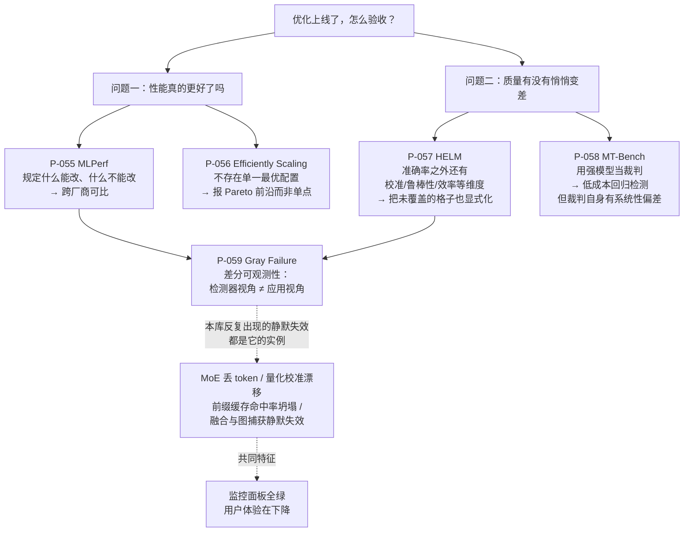

# 可靠性与基准测试论文卡片

> 位置：[InferenceAtlas](../../INDEX.md) > [模块 13 — 论文与技术报告地图](README.md) > 当前文档
> 信息截至：2026-08-10
> 最后核验：2026-08-10
> 内容版本：v0.1
> 时效性等级：中（方法论稳定，具体榜单与模型排名快速过期）
> 相关主题：[模块 11 — Benchmark、可靠性与可观测性](../11_benchmarking_reliability_and_observability/)｜[模块 01 第 4 章 — Roofline](../01_foundations_and_metrics/04_roofline_and_performance_modeling.md)｜[本模块第 01 章 — 论文地图](01_paper_map.md)

---

> ⚠️ **降级书写**：本章**未读过任何一篇论文的正文**。
> 每张卡片的「实验设置」与「关键结果」一律为 `待核实`。
> **本章尤其要紧**：这一族论文的产出**本身就是数字与排名**，
> 而这些数字是本库最不该转述的东西——它们随模型版本、硬件与提交配置快速失效。
> 完整的证据分级与纪律见 [第 01 章的降级声明](01_paper_map.md)。

## 本章导读

前面九章讨论的是「怎么让推理更快」。本章讨论的是两个更前置的问题：
**你怎么知道它更快了？** 以及 **你怎么知道它没有在悄悄变差？**

这两个问题在推理系统里比在多数领域都难，原因有三：

1. **推理性能高度依赖配置**。同一套硬件在不同批大小、不同序列长度、
   不同 SLO 约束下的数字可以差几倍——**不给约束的性能数字没有信息量**；
2. **质量损失往往不报错**。量化、稀疏、KV 驱逐、MoE 丢 token 造成的退化
   在系统指标上完全看不见；
3. **系统正常与应用正常不是一回事**。这正是 P-059 所说的**差分可观测性**。

本章五张卡片分成两半：**前三张讲「怎么测」，后两张讲「怎么发现它变差了」。**

| 问题 | 卡片 |
|---|---|
| 跨厂商怎么可比 | P-055 MLPerf Inference |
| 性能该以什么形式报告 | P-056 Efficiently Scaling Transformer Inference |
| 质量该在多少个维度上测 | P-057 HELM |
| 开放式质量怎么低成本地测 | P-058 MT-Bench / Chatbot Arena |
| 为什么监控全绿而用户在受苦 | P-059 Gray Failure |

## 卡片索引

| 编号 | 简称 | 回答的问题 | 官方实现 | 本库对应章节 |
|---|---|---|---|---|
| [P-055](#p-055--mlperf-inference) | MLPerf Inference | 可比性规则 | ✅ 仓库可读 | [模块 11 第 2 章](../11_benchmarking_reliability_and_observability/02_mlperf_inference.md) |
| [P-056](#p-056--efficiently-scaling-transformer-inference) | Efficiently Scaling | 报告口径：Pareto 而非单点 | 待核实 | [模块 11 第 4 章](../11_benchmarking_reliability_and_observability/04_throughput_concurrency_and_goodput.md) |
| [P-057](#p-057--helm) | HELM | 多维度覆盖 | ✅ 仓库可读 | [模块 11 第 1 章](../11_benchmarking_reliability_and_observability/01_inference_benchmarking_methodology.md) |
| [P-058](#p-058--mt-bench--chatbot-arena) | MT-Bench / Arena | 模型评判的可靠性 | ✅ 仓库可读 | [模块 11 第 1 章](../11_benchmarking_reliability_and_observability/01_inference_benchmarking_methodology.md) |
| [P-059](#p-059--gray-failure) | Gray Failure | 差分可观测性 | 待核实 | [模块 11 第 9 章](../11_benchmarking_reliability_and_observability/09_reliability_incidents_and_capacity_failures.md) |

## 一张图：两类问题、两套工具

**图解读**：

1. **图展示什么**：把「优化上线后怎么验收」拆成性能与质量两条线，
   各自对应的方法论论文，以及两条线在底部汇聚到同一个问题上——
   **你的监控看得见用户看得见的东西吗**。
2. **核心瓶颈**：底部的 `G → E → F` 这条链是全图的重点。
   差分可观测性说的是：故障检测器与应用观察的是同一系统的**不同侧面**。
   本库前面各章反复出现的静默失效——MoE 丢 token、量化因校准漂移而劣化、
   前缀缓存命中率坍塌、算子融合静默失效——**全部是灰度故障的实例**，
   它们的共同特征就是 `F`：**监控全绿，体验在降**。
3. **图中的 trade-off**：左右两条线的成本结构相反。
   性能侧的可比性靠**限制自由度**换来（MLPerf 的封闭组），
   代价是能上榜的配置未必是生产中会用的；
   质量侧的低成本靠**用模型代替人**换来（MT-Bench），
   代价是引入了裁判自身的偏差。
   **两边都是拿一种失真换另一种成本**，没有免费的评测。
4. **面试如何引用**：被问「你上线了一个量化优化，怎么验证它是对的」时，
   照这张图两条线都答：性能侧要固定场景与约束再比（否则数字不可比），
   质量侧要有回归检测（因为量化的损失不报错）。
   **能主动说出「量化的质量损失在系统指标上看不见」的，就抓住了本章的核心。**

---

## P-055 — MLPerf Inference

> 原标题：*MLPerf Inference Benchmark*

| 字段 | 内容 |
|---|---|
| 书目 | Reddi, Vijay Janapa; Cheng, Christine; Kanter, David; Mattson, Peter; Schmuelling, Guenther; Wu, Carole-Jean; Anderson, Brian; Breughe, Maximilien; et al. · ISCA 2020 ·（证据类别 B；arXiv 编号经限定域检索确认） |
| 一手链接 | https://arxiv.org/abs/1911.02549 |
| 官方实现 | [`mlcommons/inference`](https://github.com/mlcommons/inference)（`开源代码/配置披露`，核验于 2026-08-10） |

**问题**：「谁的推理更快」这个问题，在没有规则时**无法回答**。
因为推理性能高度依赖配置——批大小、精度、序列长度、时延约束，
每一项都能让数字变几倍。

**背景**：厂商各自选择对自己最有利的配置发布数字，彼此无法对照。

**机制**（本库可独立论证的部分）：本文的核心贡献**不是选了哪些模型**，
而是规定了**什么可以改、什么不可以改**。

两个设计要点：

1. **场景（scenario）划分**：单流、多流、服务器、离线。
   每种场景对应不同的请求到达模式与时延约束——
   **同一系统在不同场景下的数字互不可比**，这一点被写进了规则；
2. **封闭组与开放组**：封闭组限定模型与精度以保证可比，
   开放组允许任意优化但必须说明改动。
   **把「可比性」与「创新空间」分开**，而不是让两者互相牵制。

**它的方法论价值**（本库论证）：

评测规则的价值在于**限制自由度**，而不是覆盖更多模型。
这句话可以直接迁移到任何内部评测：
在报一个推理性能数字时，**必须同时报出场景与约束**——
离线吞吐与服务器场景下的 goodput 是两个不同的量，混用即是误导。

本库 [模块 11 第 1 章](../11_benchmarking_reliability_and_observability/01_inference_benchmarking_methodology.md)
的评测方法论以此为参照。

**实验设置**：`待核实` — 未读原文。
**关键结果**：`待核实` — 未读原文；本库**不转述任何提交结果、系统配置或厂商排名**。

**适用边界**（本库论证）：
- **其模型集合早于 LLM 时代**。场景定义面向判别式与早期生成式负载，
  对自回归 LLM 的 **TTFT/TPOT 双指标结构覆盖不足**——
  一个 LLM 服务的「延迟」不是一个数，是两个数；
- 规则化提高了可比性，但也使结果**滞后于工程实践**：
  能上榜的配置未必是生产中会用的配置；
- 提交需要工程投入，因此榜单反映的是**愿意投入的厂商**，而非全部厂商。

**局限**：
- 作者自述局限：`待核实` — 未读原文。
- 工程视角局限（本库论证）：封闭组的严格性使它难以跟上模型演化速度；
  开放组虽然灵活，但**开放组之间基本不可比**——
  引用开放组结果时必须逐项核对配置差异。

**后续影响**：确立了推理评测的场景化范式，
其场景划分被广泛借用到各类内部评测中。

**面试讨论角度**：问「怎么公平地比较两个推理系统」。
好的回答会先指出必须固定场景与约束，
再指出「离线吞吐」与「满足 SLO 的 goodput」是两个不同的量。
可以追问：「MLPerf 的场景对 LLM 够用吗？」——
答案是不完全够，因为 LLM 的延迟是 TTFT 与 TPOT 两个维度。

**关联文档**：[模块 11 第 2 章](../11_benchmarking_reliability_and_observability/02_mlperf_inference.md)、
[模块 11 第 1 章](../11_benchmarking_reliability_and_observability/01_inference_benchmarking_methodology.md)

---

## P-056 — Efficiently Scaling Transformer Inference

| 字段 | 内容 |
|---|---|
| 书目 | Pope, Reiner; Douglas, Sholto; Chowdhery, Aakanksha; Devlin, Jacob; Bradbury, James; Heek, Jonathan; Xiao, Kefan; Agrawal, Shivani; Dean, Jeff · MLSys 2023 ·（证据类别 B；arXiv 编号经限定域检索确认） |
| 一手链接 | https://arxiv.org/abs/2211.05102 |
| 官方实现 | `待核实` — 本库未能确认官方实现仓库 |

> **为什么这张卡片在本章而不在分布式章**：
> 它的内容是分区策略，但它**最可迁移的贡献是「性能该怎么报」**——
> 用延迟-利用率的 Pareto 前沿代替单点数字。这是一个评测方法论主张，
> 所以放在这里。其分区内容与本模块 [第 07 章](07_distributed_and_moe_inference_papers.md) 互补。

**问题**：面对「大模型 + 紧时延 + 长序列」，切分策略的选择空间很大。
但更根本的问题是：**这些选择之间有没有一个「最优」？**

**背景**：当时的常见做法是报一个配置下的一个数字。

**机制**（本库可独立论证的部分）：每种切分方式的通信量与计算量
都可以被**解析地写出来**——沿哪一维切、在哪里插入通信，
决定了每层要传多少字节、要算多少次。

本文据此建立分析模型，把不同分区方式映射到
**时延**与**模型 FLOP 利用率**两个轴上，
从而得出一个结构性结论：

> **不存在单一最优配置，只存在一条 Pareto 前沿。**
> 具体取哪一点，由你的时延预算决定。

而且 **prefill 与 decode 的最优分区通常不同**——
这是把两阶段分开处理的又一个理由。

**这与本库的分析路线最接近**（本库论证）：

模块 06、07 中的通信占比推导、切分选择、$B_{\text{SLO}}$ 容量反解，
都是同一类做法：**先写解析式，再定工作点**。
这类模型的价值不在于它的绝对值准（它是近似），
而在于**换硬件时只需要换参数**——
这正是解析模型相对实测表格的根本优势。

**实验设置**：`待核实` — 未读原文。
**关键结果**：`待核实` — 未读原文；本库不转述任何模型规模、MFU 或时延数字。

**适用边界**（本库论证）：
- 分析模型是**近似**。它忽略了 kernel 效率、调度开销与抖动，
  **其绝对值不可当作预测**，只能用于比较不同配置的相对优劣；
- 论文面向单一模型族与单一硬件平台，**参数外推需重新标定**；
- Pareto 前沿的形状随硬件代际变化——
  算力/带宽比一变，前沿就移动。

**局限**：
- 作者自述局限：`待核实` — 未读原文。
- 工程视角局限（本库论证）：解析模型无法覆盖实现质量的差异，
  两个「同样的分区策略」在不同引擎上的表现可能差很多；
  未确认官方开源实现，其分析细节难以逐项核对。

**后续影响**：把「报 Pareto 前沿而非单点」确立为推理性能报告的一种更诚实的形式，
其分析式方法被后续大量系统工作沿用。

**面试讨论角度**：问「给定一个模型和一批卡，最优的并行配置是什么」。
这是一道**有陷阱的题**：正确回答是先反问时延预算，
因为不存在脱离约束的最优配置，只存在一条前沿。
能说出「prefill 与 decode 的最优分区通常不同」的，是更深一层。

**关联文档**：[模块 11 第 4 章](../11_benchmarking_reliability_and_observability/04_throughput_concurrency_and_goodput.md)、
[本模块第 07 章](07_distributed_and_moe_inference_papers.md)

---

## P-057 — HELM

> 原标题：*Holistic Evaluation of Language Models*

| 字段 | 内容 |
|---|---|
| 书目 | Liang, Percy; Bommasani, Rishi; Lee, Tony; Tsipras, Dimitris; Soylu, Dilara; Yasunaga, Michihiro; Zhang, Yian; Narayanan, Deepak; et al. · TMLR 2023 ·（**证据类别 A**：作者在官方仓库 README 中给出的 BibTeX） |
| 一手链接 | https://openreview.net/forum?id=iO4LZibEqW |
| 官方实现 | [`stanford-crfm/helm`](https://github.com/stanford-crfm/helm)（`开源代码/配置披露`，核验于 2026-08-10） |

**问题**：模型评测通常是「若干任务上的准确率」。
但这既不说明**为什么选这些任务**，也不说明**没测什么**。

**背景**：选择性报告是评测中最难察觉的失真——
它不需要造假，只需要不提。

**机制**（本库可独立论证的部分）：先构造一个
**场景 × 指标**的二维网格，再明确标出网格中哪些格子被覆盖、哪些是空的。

指标维度不止准确率，还包括校准、鲁棒性、公平性、偏见、**效率**等；
场景维度覆盖不同任务与用途。
同时对提示与推理配置做标准化，以保证跨模型可比。

**关键设计是把评测的不完整性显式化**——
未覆盖的格子与已覆盖的格子**同样是结论的一部分**，
而不是隐藏在选择性报告里。

**它对推理系统的直接意义在「效率」这一维**（本库论证）：

把效率与质量放进**同一张表**，才能讨论
量化、稀疏、蒸馏、KV 驱逐的**质量代价**，
而不是只报加速比。

本库各章反复强调的**有损与无损之分**——
FlashAttention 与 PagedAttention 不牺牲质量，
而量化、稀疏、KV 驱逐、MoE 丢 token 会——
在评测层面就落到这里：**无损优化只需要测性能，有损优化必须同时测质量**。

**实验设置**：`待核实` — 未读原文。
**关键结果**：`待核实` — 未读原文；本库**不转述任何模型排名、分数或覆盖统计**。

**适用边界**（本库论证）：
- 评测网格的构造**本身包含价值判断**（哪些场景值得测），并非中立；
- 标准化配置提高了可比性，但**可能偏离各模型的最佳使用方式**——
  这与 MLPerf 封闭组面临的是同一个取舍；
- 结果随模型版本快速过期，**引用时必须带评测日期**。

**局限**：
- 作者自述局限：`待核实` — 未读原文。
- 工程视角局限（本库论证）：全网格评测的算力成本很高，
  在持续集成中通常只能跑子集——
  而**跑哪个子集又回到了选择性报告的问题**，需要显式记录。

**后续影响**：把「多维度 + 覆盖度显式化」确立为语言模型评测的一种范式。

**面试讨论角度**：问「怎么评估一个量化方案是否可接受」。
好的回答会指出必须同时看效率与质量，且质量要在多个维度上看——
只看困惑度或单一基准分数，很容易漏掉长尾任务上的退化。

**关联文档**：[模块 11 第 1 章](../11_benchmarking_reliability_and_observability/01_inference_benchmarking_methodology.md)、
[本模块第 05 章](05_quantization_and_compression_papers.md)

---

## P-058 — MT-Bench / Chatbot Arena

> 原标题：*Judging LLM-as-a-judge with MT-Bench and Chatbot Arena*

| 字段 | 内容 |
|---|---|
| 书目 | Zheng, Lianmin; Chiang, Wei-Lin; Sheng, Ying; Zhuang, Siyuan; Wu, Zhanghao; Zhuang, Yonghao; Lin, Zi; Li, Zhuohan; et al. · arXiv preprint · 2023 ·（**证据类别 A**：作者在 FastChat 仓库 README 中给出的 BibTeX） |
| 一手链接 | https://arxiv.org/abs/2306.05685 |
| 官方实现 | [`lm-sys/FastChat`](https://github.com/lm-sys/FastChat)（`开源代码/配置披露`，核验于 2026-08-10） |

**问题**：开放式对话质量没有固定答案，无法用准确率打分。
人工标注可靠但成本高、速度慢。
用一个强模型当裁判是自然的替代——**但它可靠吗？**

**背景**：这个做法当时已被广泛使用，却缺乏系统的可靠性检验。

**机制**（本库可独立论证的部分）：把模型评判与**大规模人类成对比较**
放在一起校验，测量二者的一致程度，
并识别出裁判模型的**系统性偏差**——
例如对选项位置的偏好、对更长回答的偏好、对与自身风格相近输出的偏好。

**关键在于「系统性」三个字**：
系统性偏差可以被度量，因而可以被部分校正
（例如交换位置重测、控制长度）。
这与随机噪声不同——**随机噪声只能靠增加样本，系统偏差靠增加样本消不掉**。

**它对推理系统工程的意义**（本库论证）：

**质量回归检测需要一把尺子。**

量化、稀疏、蒸馏、KV 驱逐、MoE 丢 token 都会造成质量损失，
而这些损失在**困惑度上往往看不出来**，在系统指标上完全看不见。
自动化评判提供了一条低成本的回归检测路径，
使得「每次改配置都跑一遍质量回归」在工程上变得可行。

**但必须知道这把尺子自身的偏差在哪**——
否则会把偏差当成改进。
最危险的一条是**自我偏好**：用同族模型当裁判，
会系统性高估该族模型，**而这恰恰是内部评测最容易踩的坑**
（团队手边最强的模型往往就是自己的模型）。

**实验设置**：`待核实` — 未读原文。
**关键结果**：`待核实` — 未读原文；本库不转述任何一致率、模型排名或偏差幅度。

**适用边界**（本库论证）：
- 裁判模型的偏差**随其版本变化**，因此校正方法未必长期有效——
  换裁判模型后需重新校准；
- 对需要专业知识判断的领域，**裁判模型的能力上限即是评测的上限**；
- 模型评判本身消耗推理算力，在持续集成中需计入成本预算。

**局限**：
- 作者自述局限：`待核实` — 未读原文。
- 工程视角局限（本库论证）：成对比较给出的是**相对排名**而非绝对分数，
  因此它能回答「改动之后变差了吗」，
  但回答不了「现在的绝对质量够不够上线」——
  后者仍需人工或领域基准。

**后续影响**：使「用模型做质量回归检测」成为一种带已知偏差、
因而可被负责任使用的工程实践。

**面试讨论角度**：问「你怎么保证量化之后模型质量没退化」。
好的回答会指出困惑度不够敏感，需要任务级的质量回归；
再指出自动化评判可以降低成本，
但**要注意裁判模型的自我偏好**——
用自家模型评自家模型会系统性高估。

**关联文档**：[模块 11 第 1 章](../11_benchmarking_reliability_and_observability/01_inference_benchmarking_methodology.md)、
[模块 05 第 10 章](../05_decoding_and_generation_algorithms/10_generation_quality_latency_tradeoffs.md)

---

## P-059 — Gray Failure

> 原标题：*Gray Failure: The Achilles' Heel of Cloud-Scale Systems*

| 字段 | 内容 |
|---|---|
| 书目 | Huang, Peng; Guo, Chuanxiong; Zhou, Lidong; Lorch, Jacob R.; Dang, Yingnong; Chintalapati, Murali; Yao, Randolph · HotOS 2017 ·（证据类别 B） |
| 一手链接 | https://dl.acm.org/doi/10.1145/3102980.3103005 |
| 官方实现 | `待核实` — 立场论文，无配套实现 |

**问题**：云规模系统有充足的冗余资源可以替换掉故障组件。
**但这只有在故障被检测到时才有用。**
如果组件没有停机、健康检查也通过，而应用确实在受损呢？

**背景**：容错机制的前提是「知道出问题了」。这个前提常常不成立。

**机制**（本库可独立论证的部分）：论文把这个现象命名为**灰度故障**，
并指出其根源是**差分可观测性**——
故障检测器与应用观察到的是**同一系统的不同侧面**。

当检测器认为一切正常而应用正在受苦时，
自动化的容错机制根本不会被触发：
**冗余资源明明存在，却无从启用**，
直到问题恶化为显式故障才被发现——而那时影响已经扩散。

灰度故障因此是显式故障的**前驱阶段**：早期可观测，但不被观测。
对策方向是让检测器的观测点向**应用视角**靠拢。

**它是本库反复出现的「静默失效」的统一解释**（本库论证，本卡片的核心）：

回看前面各章，这类问题出现了不止一次：

| 静默失效 | 出处 |
|---|---|
| MoE 丢 token（走残差，不报错，输出悄悄变差） | [第 07 章 P-038](07_distributed_and_moe_inference_papers.md) |
| 量化因线上分布与校准集不符而劣化 | [第 05 章 P-024/P-025](05_quantization_and_compression_papers.md) |
| 前缀缓存命中率坍塌（容量不足导致反复驱逐重建） | [第 03 章 P-012](03_batching_serving_and_scheduler_papers.md) |
| 算子融合、图捕获配置启用但未实际生效 | [模块 04 第 11 章](../04_compilers_runtimes_and_kernels/11_compiler_debugging_and_profiling.md) |
| KV 驱逐后模型「开始一本正经地忘事」 | [第 02 章 P-009](02_transformer_inference_and_kv_cache_papers.md) |

**它们的共同特征完全一致：监控面板全绿，用户体验在下降。**

这正是差分可观测性——系统侧指标就是那个「检测器视角」。
因此推理服务的观测面**必须包含质量侧指标**，
而不能只有 QPS、时延与利用率。

**实验设置**：`待核实` — 未读原文。
**关键结果**：`待核实` — 未读原文；本库不转述论文中的事故案例或统计。

**适用边界**（本库论证）：
- **HotOS 是立场论文体裁**，提出框架而非给出完整解法，
  不应期待可直接落地的方案；
- 把观测点向应用视角靠拢会**增加观测成本与噪声**，
  其取舍需按服务等级分别确定——
  不是所有服务都值得付这个代价。

**局限**：
- 作者自述局限：`待核实` — 未读原文。
- 工程视角局限（本库论证）：应用视角的指标往往滞后（要等用户反馈或质量抽检），
  因此它改善的是**发现**而非**预防**；
  真正的预防需要在变更时就做回归检测——这把我们带回 P-057 与 P-058。

**后续影响**：「灰度故障」成为云系统可靠性讨论中的标准词汇，
差分可观测性则成为观测面设计的一条基本原则。

**面试讨论角度**：问「你的推理服务所有监控指标都正常，但用户投诉质量下降，怎么查」。
这是一道很好的综合题。
好的回答会先点出这是**差分可观测性**问题——系统指标看不见质量，
再按有损优化清单逐项排查：最近有没有改量化配置、
KV 驱逐策略、MoE 容量因子、前缀缓存容量。
**能主动说出「这些改动都不会报错」的，就答到了本章的核心。**

**关联文档**：[模块 11 第 9 章](../11_benchmarking_reliability_and_observability/09_reliability_incidents_and_capacity_failures.md)、
[模块 11 第 7 章](../11_benchmarking_reliability_and_observability/07_observability_metrics_logs_traces.md)

---

## 本章小结

**前十章讲怎么让推理更快，本章讲怎么知道它真的更快了、而且没有悄悄变差。**

| 卡片 | 一句话结论 |
|---|---|
| P-055 MLPerf | 评测规则的价值在于**限制自由度**；报数字必须同时报场景与约束 |
| P-056 Efficiently Scaling | **不存在单一最优配置，只存在一条 Pareto 前沿** |
| P-057 HELM | 未覆盖的格子与已覆盖的格子**同样是结论的一部分** |
| P-058 MT-Bench | 模型裁判的偏差是**系统性**的，可度量因而可部分校正；当心自我偏好 |
| P-059 Gray Failure | 系统正常 ≠ 应用正常；**静默失效全部是灰度故障** |

**三条可以直接用的判断：**

1. **无损优化只需要测性能，有损优化必须同时测质量。**
   FlashAttention、PagedAttention、前缀复用属前者；
   量化、稀疏、KV 驱逐、MoE 丢 token、蒸馏属后者。
   这个分类在动手之前就决定了验收清单该多长。
2. **性能数字不带约束就没有信息量。**
   离线吞吐与满足 SLO 的 goodput 是两个量；
   报单点不如报前沿，因为最优配置由时延预算决定。
3. **推理服务的观测面必须包含质量侧指标。**
   本库前十章列出的静默失效——丢 token、校准漂移、缓存坍塌、融合失效——
   在系统指标上**一个都看不见**。监控全绿不等于没事。

本章全部五张卡片的「实验设置」与「关键结果」均为 `待核实`。
这在本章有额外的意义：**这一族论文的产出本身就是数字与排名**，
而它们随模型版本、硬件与提交配置快速失效——
即使能读到原文，转述这些数字也未必是负责任的做法。

## 关键术语

| 中文术语 | 英文 | 定义 | 单位/口径 | 关联文档 |
|---|---|---|---|---|
| 场景 | scenario | 评测中规定的请求到达模式与时延约束；跨场景数字不可比 | — | 本章 P-055 |
| 封闭组 / 开放组 | closed / open division | 前者限定模型与精度保证可比，后者允许优化但需说明 | — | 本章 P-055 |
| Pareto 前沿 | Pareto frontier | 时延与利用率之间不可同时改善的配置集合 | — | 本章 P-056 |
| 模型 FLOP 利用率 | MFU (model FLOPs utilization) | 有效模型计算量占峰值算力的比例 | % | [模块 11 第 4 章](../11_benchmarking_reliability_and_observability/04_throughput_concurrency_and_goodput.md) |
| 覆盖网格 | coverage grid | 场景 × 指标的二维网格；空格子亦是结论的一部分 | — | 本章 P-057 |
| 模型评判 | LLM-as-a-judge | 用强模型代替人工做质量比较 | — | 本章 P-058 |
| 自我偏好 | self-preference bias | 裁判模型系统性高估与自身同族的输出 | — | 本章 P-058 |
| 灰度故障 | gray failure | 组件未停机、检测通过，但应用确实受损的故障 | — | 本章 P-059 |
| 差分可观测性 | differential observability | 故障检测器视角与应用视角对同一系统的观察不一致 | — | 本章 P-059 |
| 静默失效 | silent failure | 配置生效但功能未生效、或质量下降但不报错的状态 | — | [模块 04 第 11 章](../04_compilers_runtimes_and_kernels/11_compiler_debugging_and_profiling.md) |

## 延伸阅读

- [本模块第 01 章 — 论文地图](01_paper_map.md)：本章在整体地图中的位置
- [模块 11 第 1 章 — 推理基准方法论](../11_benchmarking_reliability_and_observability/01_inference_benchmarking_methodology.md)
- [模块 11 第 8 章 — SLO、SLA 与错误预算](../11_benchmarking_reliability_and_observability/08_slos_slas_and_error_budgets.md)
- [模块 12 第 12 章 — 可复现实验手册](../12_open_source_deployment_and_reproduction/12_reproduction_playbooks.md)：把本模块各章的「必须实测」项真正跑起来
- [`code/reproduction_toolkit.py`](../../code/reproduction_toolkit.py)：`sample_size_two_proportion` 可用于规划质量回归的样本量

## 主要来源

| 来源 | 类型 | 用途 | 披露标签 | 核验日期 |
|---|---|---|---|:---:|
| [`stanford-crfm/helm` README](https://github.com/stanford-crfm/helm) | 作者提供的 BibTeX | P-057 书目 | `开源代码/配置披露` | 2026-08-10 |
| [`lm-sys/FastChat` README](https://github.com/lm-sys/FastChat) | 作者提供的 BibTeX | P-058 书目 | `开源代码/配置披露` | 2026-08-10 |
| [`mlcommons/inference`](https://github.com/mlcommons/inference) | 官方实现仓库 | P-055 实现存在性 | `开源代码/配置披露` | 2026-08-10 |
| WebSearch 书目检索 | 二级来源 | P-055、P-056、P-059 的书目字段；arXiv 编号经限定域检索确认 | `待核实` | 2026-08-10 |
| 本库模块 04、11 的推导 | 本仓库自有推导 | 有损/无损分类、静默失效清单、观测面设计论证 | — | 2026-08-10 |
| 各论文正文 | 一手来源 | **未读**——出口策略拒绝，见 [AGENTS.md 第 11 节](../../AGENTS.md) | `待核实` | — |
| 各评测榜单结果 | 一手来源 | **未读**——出口策略拒绝；故本章**不给出任何排名或分数** | `待核实` | — |

## 更新记录

| 日期 | 版本 | 变更 | 核验人 |
|---|---|---|---|
| 2026-08-10 | v0.1 | 初稿：P-055~P-059 五张降级卡片；核心产出为**「静默失效全部是灰度故障」**这一统一解释，及「无损只测性能、有损必测质量」的验收判据 | — |
