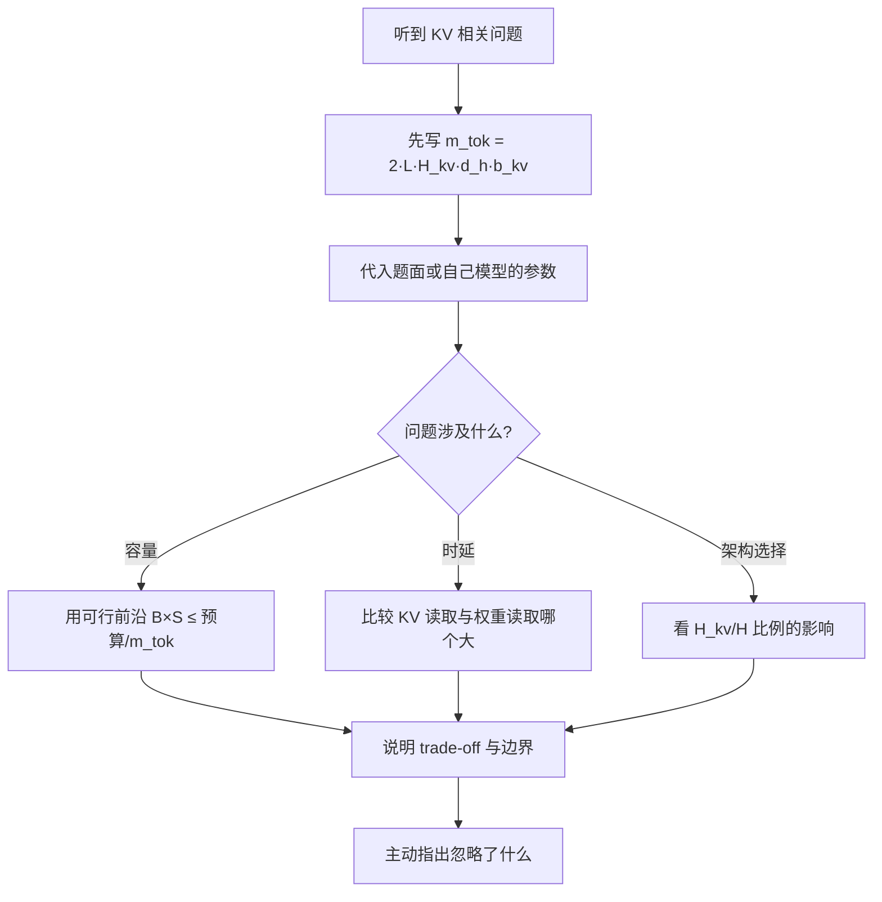

# Transformer、prefill/decode 与 KV Cache 题组（Q013–Q028）

> 位置：[InferenceAtlas](../../INDEX.md) > [模块 17](README.md) > 当前文档
> 信息截至：2026-07-29 ｜ 最后核验：2026-07-29 ｜ 内容版本：v0.1
> 时效性等级：低
> 相关主题：[模块 02](../02_transformer_and_kv_cache/)｜[第一组题](01_inference_system_design.md)｜`03_serving_scheduling_and_slo_questions.md`

## 本章导读

这一组 16 道题是推理面试的**技术核心**。如果说第一组题考的是「你有没有口径习惯」，这一组考的是「你是否真的理解自回归推理为什么长这样」。

这组题有一条主线：**KV cache 是一切的中心**。它的存在把 decode 从 $O(S^2)$ 降到 $O(S)$，但它自己的占用又成了显存的主要消耗者，进而成为并发上限、成本、以及长上下文可行性的决定因素。GQA、MQA、MLA、KV 量化、驱逐、分页——这些技术全部是在回答同一个问题：**怎么让 KV 更小或更好管**。

另一条主线是 **prefill 与 decode 的画像差异**。这两个阶段的瓶颈不同（算力 vs 带宽）、偏好的批不同、对并行方式的偏好不同、通信画像也不同。**几乎所有 serving 层的设计复杂度都源于要同时服务这两种画像**——分块 prefill、prefill/decode 分离、混合批调度，都是在处理这个矛盾。

面试中这组题的答法有一个通用要求：**要能写出 KV 容量公式并当场代入算**。$M_{\text{KV}} = 2 L S H_{kv} d_h b_{kv}$ 这个式子应当熟练到不用思考，因为它是这一组一半题目的推导起点。

## 学习目标

读完本章后，读者应能够：

1. 写出 KV cache 的容量公式并解释每个因子的来源
2. 说明 prefill 与 decode 在瓶颈、批偏好、并行偏好上的全部差异
3. 推导 GQA/MQA 对 KV 占用与 decode 算术强度的影响
4. 分析长上下文的三重成本（KV 容量、注意力时间、prefill 时间）并判断哪个先成为瓶颈
5. 在被问到任何 KV 相关问题时，先写公式再代入数字

## 核心结论

- **KV cache 用显存换计算**：把 decode 的注意力从重算整个前缀降到只算新 token，代价是 $O(S)$ 的显存。
- **prefill 计算受限、decode 带宽受限**，这一条差异是 serving 层几乎所有设计复杂度的来源。
- **GQA 按 $H_{kv}/H$ 的比例同时降低 KV 占用与 KV 读取带宽**，还顺带提高了 decode 的算术强度。
- **长上下文有三重成本**，且随长度增长的速率不同——KV 是线性、注意力是线性（decode）或二次（prefill）。
- **分页 KV 解决的是碎片问题**，它把外部碎片换成可控的内部碎片，代价是访存不连续。

## 1. 问题定义、系统边界与工作负载

本章覆盖 [模块 02](../02_transformer_and_kv_cache/) 的全部内容，并在长上下文与 KV 传输的题目上延伸到 [模块 06](../06_distributed_and_moe_inference/)。

**答题的通用起点**是两个公式：KV 容量 $M_{\text{KV}} = 2 L S H_{kv} d_h b_{kv}$ 与 decode 的带宽下界 $T \ge W/\text{BW}$。这一组题中约一半可以从这两个式子推出答案。

本章不含任何需要外部核验的模型规格数字；题目中出现的参数均为题面给定的假设值。

### 本章题目一览

| 编号 | 题目 | 难度 | 形式 |
|---|---|---|---|
| Q013 | KV cache 解决什么问题，代价是什么 | 中等 | 概念 |
| Q014 | 当场算出每 token 的 KV 占用与并发上限 | 中等 | 计算 |
| Q015 | prefill 与 decode 的完整差异清单 | 中等 | 概念 |
| Q016 | 为什么「更长上下文」与「更高并发」不能同时要 | 高 | 概念 |
| Q017 | prefill 与 decode 的注意力复杂度为什么不同 | 高 | 概念 |
| Q018 | GQA 相比 MHA 与 MQA 的取舍 | 中等 | 概念 |
| Q019 | 给定显存约束，选择哪种 KV 归约手段 | 高 | 系统设计 |
| Q020 | 分页 KV 解决什么问题，代价是什么 | 中等 | 概念 |
| Q021 | KV 量化为什么是「多重收益」，风险在哪 | 高 | 概念 |
| Q022 | 长上下文的三重成本，哪个先成为瓶颈 | 高 | 计算 |
| Q023 | 位置编码在推理系统层面有哪些影响 | 中等 | 概念 |
| Q024 | 前缀缓存的收益、失效条件与命中率影响 | 中等 | 系统设计 |
| Q025 | KV 驱逐与稀疏化的收益边界 | 高 | 概念 |
| Q026 | 多轮对话的 KV 应该怎么管 | 中等 | 系统设计 |
| Q027 | 多模态输入对 KV 与调度的影响 | 中等 | 概念 |
| Q028 | reasoning 模型对 KV 与容量规划的特殊影响 | 高 | 概念 |

## 2. 原理、数学与性能模型

这一组题反复用到的三个模型：

**（一）KV 容量与每 token 占用**

$$
M_{\text{KV}} = 2 \cdot L \cdot S \cdot H_{kv} \cdot d_h \cdot b_{kv}, \qquad m_{\text{tok}} = 2 L H_{kv} d_h b_{kv}
$$

因子 2 是 K 与 V 各一份；$L$ 是层数（每层都要存）；$H_{kv}$ 是 KV 头数（GQA 下小于 $H$）。$m_{\text{tok}}$ 是「每 token 的 KV 字节数」，是容量规划的基本单位。

**（二）decode 注意力的算术强度**

$$
I_{\text{attn}} = \frac{2 H}{H_{kv} \cdot b_{kv}}
$$

分子是每个 query 头都要与 KV 做一次点积；分母是读一份 KV 的字节数。**GQA 让多个 query 头共享一组 KV，因此提高了这个比值**——这是 GQA 除了省显存之外的第二个收益。

**（三）可行前沿**

$$
B \times S \le \frac{M_{\text{dev}} - W - M_{\text{overhead}}}{m_{\text{tok}}}
$$

批与上下文长度的**乘积**受一个常数约束。这解释了为什么「支持更长上下文」总是以「降低并发」为代价——两者在同一条双曲线上。

三个模型的完整推导见 [模块 02 第 3–6 章](../02_transformer_and_kv_cache/)。

## 3. 实现机制与系统设计

以下为本章题库正文。每题的「推荐回答」是**完整答案**，可在 2–5 分钟内口头讲完。

### Q013：KV cache 解决什么问题，代价是什么

**难度**：中等　**形式**：概念　**目标岗位**：Inference / ML Systems

**考察点**：检验候选人是否理解 KV cache 是一个「用显存换计算」的交易，而不只是「一个缓存」。

**题目**：为什么自回归生成需要 KV cache？如果不用它，decode 的复杂度会怎样？它的代价是什么？

#### 推荐回答

**结论**：KV cache 把 decode 每步的注意力计算从「重算整个前缀」降到「只算新 token 与已有 KV 的交互」，复杂度从每步 $O(S^2)$ 降到 $O(S)$；代价是 $O(S)$ 的显存占用，而这份显存成为并发上限的主要约束。

**原理**：注意力需要当前 query 与**所有历史 key/value** 做交互。如果不缓存，生成第 $t$ 个 token 时必须重新把前 $t-1$ 个 token 过一遍前向来得到它们的 K 与 V，单步代价 $O(t \cdot d)$ 的投影加 $O(t^2)$ 的注意力；生成 $S$ 个 token 的总代价是 $O(S^3)$ 量级。而 K 与 V 只依赖于各自位置的输入，**与后续 token 无关**，所以可以算一次存起来。缓存后单步只需算新 token 的 K/V（$O(d)$）并与已有 $S$ 份 KV 做点积（$O(S \cdot d)$），总代价降到 $O(S^2)$——与 prefill 一次算完同阶。

**代价**：占用 $M_{\text{KV}} = 2 L S H_{kv} d_h b_{kv}$ 字节。因子 2 是 K 与 V 各一份，$L$ 是因为每层都要存自己的 KV。这份显存与权重竞争，直接决定可并发数——**它把一个计算问题转化成了一个内存容量与内存带宽问题**，而后者恰好是现代加速器上更稀缺的资源。

**第二重代价常被忽略**：decode 每步不仅要读权重，还要读全部 KV。当 $B \cdot S \cdot m_{\text{tok}} > W$ 时，**读 KV 比读权重更耗时**，此时优化方向应当从权重量化转向 KV 量化与压缩。

**trade-off**：不用 KV cache 可以省显存换计算——这在极端显存受限的边缘场景偶尔成立，但在服务端几乎从不划算，因为重算的计算量增长太快。中间路线是**部分缓存**：丢弃或压缩远端 token 的 KV（驱逐、量化、稀疏化），这些手段都有质量代价，需要按任务容忍度选择。

**局限**：上面的复杂度分析忽略了常数因子与内存层次的影响；而「$O(S^2)$ 与 prefill 同阶」这个说法只在忽略注意力实现细节时成立。

#### 强答案必须覆盖

- KV cache 消除的是什么重复计算
- 复杂度从 $O(S^3)$ 到 $O(S^2)$ 的量级变化
- 写出容量公式并解释因子 2 与 $L$
- 指出第二重代价：decode 每步要读全部 KV
- 说明它把计算问题转化为内存容量与带宽问题

#### 常见错误

- 只说「缓存 K 和 V」不说清避免了什么重算
- 说不出容量公式里因子 2 与 $L$ 的来源
- 忽略「读 KV 的带宽成本」这第二重代价
- 认为 KV cache 是纯粹的优化而无代价

#### 可能追问

1. 什么情况下不用 KV cache 反而更好？
2. 读 KV 什么时候超过读权重？怎么判断？
3. 为什么 K 和 V 可以缓存而 query 不行？

#### 关联阅读

- [KV cache 基础](../02_transformer_and_kv_cache/04_kv_cache_fundamentals.md)
- [注意力在推理中的复杂度](../02_transformer_and_kv_cache/03_attention_complexity_during_inference.md)

### Q014：当场算出每 token 的 KV 占用与并发上限

**难度**：中等　**形式**：计算　**目标岗位**：Inference / ML Systems

**考察点**：检验候选人能否当场完成容量计算，这是推理岗最基本的动手能力。

**题目**：假设一个模型有 80 层、64 个注意力头、8 个 KV 头、头维度 128、KV 用 fp16。请算出每 token 的 KV 占用，以及在 40 GB KV 预算下 8K 上下文能支持多少并发。

#### 推荐回答

**结论**：每 token 约 320 KiB，40 GB 预算下 8K 上下文可支持约 15 个并发请求。

**第一步，算 $m_{\text{tok}}$**：

$$
m_{\text{tok}} = 2 \cdot L \cdot H_{kv} \cdot d_h \cdot b_{kv} = 2 \times 80 \times 8 \times 128 \times 2 = 327{,}680\ \text{B} = 320\ \text{KiB/token}
$$

注意这里用的是 **$H_{kv} = 8$ 而不是 $H = 64$**——GQA 下只存 8 组 KV，这是 GQA 省显存的直接体现。若是 MHA（$H_{kv} = 64$），$m_{\text{tok}}$ 会是 2.5 MiB/token，八倍。

**第二步，算单请求的 KV**：$8192 \times 320\ \text{KiB} \approx 2.6$ GB。

**第三步，算并发**：

$$
B_{\max} = \frac{40\ \text{GB}}{2.6\ \text{GB}} \approx 15
$$

**这个数字的含义**：只有 15 个并发。如果 TPOT 允许更大的批（比如 64），**KV 容量而非时延成了并发的瓶颈**——此时增加算力毫无用处，该做的是 KV 量化（$b_{kv}$ 减半直接翻倍并发）、张量并行（切分 KV）、或缩短上下文。

**可行前沿**：$B \times S \le 40\ \text{GB} / 320\ \text{KiB} \approx 122{,}880$ token。这是一条双曲线——8K 上下文对应 15 并发，2K 上下文对应 60 并发，32K 上下文只剩 3 个。**「支持更长上下文」与「支持更高并发」是同一个预算的两种花法**。

**trade-off 与优化顺序**：KV 量化到 int8 让 $m_{\text{tok}}$ 变 160 KiB，并发翻倍到 30，代价是可控的精度损失——这通常是**性价比最高的第一手段**。张量并行也切分 KV，但受 $H_{kv} = 8$ 的整除约束，TP 度超过 8 后 KV 必须复制，收益打折。

**局限**：这个计算忽略了分页的内部碎片（实际可用略少）、以及激活与通信缓冲的占用。真实系统应留 10%–20% 余量。另外题面给的是平均上下文长度，**若长度分布重尾，应当用 P95 重算**。

#### 强答案必须覆盖

- 正确用 $H_{kv}$ 而非 $H$
- 算出 320 KiB/token 与约 15 并发
- 指出可行前沿 $B \times S$ 守恒
- 识别出这是 KV 而非时延成为瓶颈
- 给出优化顺序：KV 量化优先

#### 常见错误

- 用 $H = 64$ 而不是 $H_{kv} = 8$，把 KV 算大八倍
- 忘记因子 2（K 与 V）
- 算出并发后不判断瓶颈是 KV 还是时延
- 用平均长度而非分位数，导致峰值 OOM

#### 可能追问

1. 如果 TP 度设到 16，KV 占用会怎么变？
2. KV 量化到 int4 有什么风险？
3. 分页的内部碎片大概会吃掉多少？

#### 关联阅读

- [KV cache 容量与内存模型](../02_transformer_and_kv_cache/05_kv_cache_capacity_and_memory_models.md)
- [GQA、MQA 与 MLA](../02_transformer_and_kv_cache/06_gqa_mqa_mla_and_kv_reduction.md)
- [张量并行推理](../06_distributed_and_moe_inference/02_tensor_parallel_inference.md) 2.4（$H_{kv}$ 约束）

### Q015：prefill 与 decode 的完整差异清单

**难度**：中等　**形式**：概念　**目标岗位**：Inference / ML Systems

**考察点**：检验候选人是否把这两个阶段的差异理解成一个体系，而不是零散记住几条。这是推理面试最核心的一道题。

**题目**：请系统地对比 prefill 与 decode 两个阶段的差异，并说明这些差异如何导致 serving 层的设计复杂度。

#### 推荐回答

**结论**：两个阶段在瓶颈、批偏好、并行偏好、通信画像上全都不同，而 serving 层几乎所有的设计复杂度都来自「要同时服务这两种画像」。

**差异清单**（按重要性排序）：

**瓶颈不同**。prefill 一次处理整个 prompt，批内 token 数是 $B \cdot S$，算术强度高，**算力受限**；decode 每步每请求只处理 1 个 token，算术强度 $I = 2B/b_w$ 很低，**带宽受限**。这一条是其余所有差异的根源。

**批偏好不同**。prefill 本就计算受限，中等批就能饱和算力，再大没有收益；decode 越大越好（摊薄权重读取），只受 TPOT SLO 与 KV 容量约束。

**并行方式偏好不同**。decode 只有张量并行能降低时延（切权重并行读）；流水线并行各段串行，总读取量不变，**不能降 TPOT**。而 prefill 计算受限，PP 有充足的微批（序列分块）可以填流水线，效率高；高 TP 度反而增加通信占比。

**通信画像不同**。TP 下 prefill 的 all-reduce 是大消息、带宽受限；decode 是小消息、被固定延迟乘以 $2L$ 主导。**两者想要的互联特性不同**。

**KV 行为不同**。prefill 是写入 KV，decode 是读取加追加。

**时延指标不同**。prefill 决定 TTFT，decode 决定 TPOT。

**持续时间不同**。prefill 一次就结束，decode 要跑 $L_{\text{out}}$ 步——所以 decode 阶段的请求会长时间占着 KV。

**这些差异如何变成设计复杂度**：混合部署下，任何配置都是对两者的折中。长 prompt 的 prefill 会占用几十毫秒，期间 decode 全部停滞，直接表现为 **TPOT 尖峰**。为了处理这个矛盾，serving 层发明了三层手段：**分块 prefill**（把长 prefill 切碎穿插进 decode 批，用一点 prefill 效率换 TPOT 平稳）、**优先级调度**、以及最彻底的 **prefill/decode 分离部署**（两个池各自用最优配置，代价是每请求一次 KV 传输）。

**判据**：是否值得分离，看 **prefill 占用比** $\lambda_p T_{\text{prefill}}$。TPOT 的改善倍数是 $1/(1-u)$——占用比 0.3 时只有 1.43 倍，0.8 时达 5 倍。**占用比低于 0.3 通常不值得分离的复杂度，应先把分块 prefill 调优**。

**局限**：以上差异在极端配置下会模糊——例如批极大时 decode 也会进入计算受限区；投机解码的验证步骤介于两者之间（一次处理多个 token）。

#### 强答案必须覆盖

- 瓶颈差异（算力 vs 带宽）及其为其余差异之根源
- 批偏好、并行偏好、通信画像三项差异
- 指出 PP 不能降低 decode 时延
- 说明这些差异如何产生 TPOT 尖峰
- 给出分块 prefill 与 PD 分离两层应对，并给出分离的判据

#### 常见错误

- 只说「prefill 算得多、decode 算得少」而不给算术强度
- 认为流水线并行也能降低 TPOT
- 不区分阶段就给优化建议，导致建议自相矛盾
- 直接推荐 PD 分离而不先看 prefill 占用比

#### 可能追问

1. 分块 prefill 具体怎么在两者之间折中？代价是什么？
2. 为什么 decode 的 TP 通信是「次数多」而不是「数据大」？
3. 投机解码的验证步骤属于哪个画像？

#### 关联阅读

- [prefill vs decode](../02_transformer_and_kv_cache/02_prefill_vs_decode.md)
- [prefill/decode 调度](../03_serving_engines_and_scheduling/05_prefill_decode_scheduling.md)
- [prefill/decode 分离](../06_distributed_and_moe_inference/07_prefill_decode_disaggregation.md)

### Q016：为什么「更长上下文」与「更高并发」不能同时要

**难度**：高　**形式**：概念　**目标岗位**：Inference / ML Systems

**考察点**：检验候选人是否理解 $B \times S$ 守恒这个约束，以及能否区分「重新分配预算」与「真正扩大预算」的手段。

**题目**：产品要求同时支持 128K 上下文和更高的并发。请解释这两个目标为什么冲突，以及有哪些手段能真正放松这个冲突。

#### 推荐回答

**结论**：两个目标受同一个 KV 预算约束，$B \times S$ 的乘积有上界，所以在预算不变的前提下它们是零和的。要真正放松冲突，只有**降低 $m_{\text{tok}}$ 或扩大预算**两类手段。

**原理**：可行前沿是

$$
B \times S \le \frac{M_{\text{dev}} - W - M_{\text{overhead}}}{m_{\text{tok}}}
$$

右边是一个常数，所以 $B$ 与 $S$ 落在一条双曲线上。举例：若预算允许 $B \times S = 120{,}000$ token，那么 8K 上下文可以有 15 个并发，128K 上下文只剩不到 1 个——**连一个请求都装不下**。

**手段分两类，必须区分清楚**：

**（一）真正扩大可行前沿的**——这些手段改变了公式的右边：
**KV 量化**直接降低 $m_{\text{tok}}$（int8 让前沿翻倍），是收益最直接、实现最简单的一手；**GQA/MQA/MLA** 通过降低 $H_{kv}$ 降低 $m_{\text{tok}}$，但这是模型架构的选择，部署方通常无法改；**权重量化**腾出 $W$ 占的空间给 KV；**张量并行**把 KV 切到多卡（但受 $H_{kv}$ 整除约束，TP 度超过 $H_{kv}$ 后必须复制，收益打折）；**上下文并行**沿序列维切分，不受 $H_{kv}$ 约束，是超长上下文的最后手段；**KV 卸载**把远端 KV 放到主机内存，用 PCIe 带宽换容量。

**（二）只是重新分配预算的**——这些不改变右边：
限制并发、限制上下文长度、按用户分级分配。它们是运营手段而不是技术改进。

**我会怎么回答产品**：先算出当前的可行前沿，摆出「128K 上下文对应的并发是多少」这个具体数字，然后给出扩大前沿的手段清单及各自代价，让产品在「精度损失」「成本上升」「实现复杂度」之间选。**关键是把冲突量化，而不是简单说「做不到」**。

**优先级建议**：先 KV 量化（收益直接、代价可控），再考虑张量并行，上下文并行留到前两者都不够时——因为 CP 在 decode 阶段的通信开销很高（每步要流转整个 KV），通常只适合用在 prefill 阶段。

**局限**：这个前沿假设所有请求上下文长度相同。真实负载是混合的，此时约束是「同时在飞请求的长度之和」，需要按分布规划而不是按单一 $S$。

#### 强答案必须覆盖

- 写出可行前沿公式并说明它是双曲线
- 代入数字说明 128K 上下文对应的并发有多少
- 区分「扩大前沿」与「重新分配预算」两类手段
- 给出优化优先级：KV 量化优先于 TP 优先于 CP
- 指出混合长度负载下应按分布规划

#### 常见错误

- 只说「显存不够」而不给出可行前沿的定量形式
- 把限流当作解决冲突的技术手段
- 推荐上下文并行而不先试 KV 量化
- 忽略 TP 度受 $H_{kv}$ 整除约束

#### 可能追问

1. 上下文并行在 decode 阶段为什么代价高？
2. KV 卸载的判据是什么？
3. 混合长度负载下怎么规划？

#### 关联阅读

- [KV cache 容量与内存模型](../02_transformer_and_kv_cache/05_kv_cache_capacity_and_memory_models.md)
- [长上下文推理](../02_transformer_and_kv_cache/07_long_context_inference.md)
- [序列并行与上下文并行](../06_distributed_and_moe_inference/04_sequence_context_parallel_inference.md)

### Q017：prefill 与 decode 的注意力复杂度为什么不同

**难度**：高　**形式**：概念　**目标岗位**：Inference / GPU Performance / Compiler

**考察点**：检验候选人是否能区分计算复杂度与访存复杂度，以及是否理解 decode 注意力的算术强度极低。

**题目**：请分别写出 prefill 与 decode 阶段注意力的计算复杂度与访存复杂度，并说明为什么 decode 的注意力是带宽受限的。

#### 推荐回答

**结论**：prefill 的注意力是 $O(S^2)$ 计算、$O(S^2)$ 或 $O(S)$ 访存（取决于是否用 FlashAttention）；decode 每步是 $O(S)$ 计算、$O(S)$ 访存，**且两者同阶，因此算术强度是常数且很低**——这是它带宽受限的根因。

**prefill**：$S$ 个 query 对 $S$ 个 key 做全对全的点积，得到 $S \times S$ 的注意力矩阵。计算量 $O(S^2 d)$。朴素实现要把这个矩阵写回显存再读回来做 softmax，访存 $O(S^2)$；**FlashAttention 通过分块与在线 softmax 把中间矩阵留在片上，访存降到 $O(S)$**，算术强度因此从 $O(d)$ 提升到 $O(S)$ 量级——这是它收益巨大的原因。

**decode**：每步只有 1 个新 query（每请求），要与全部 $S$ 个已缓存的 key/value 交互。计算量 $O(S \cdot d)$，访存是读全部 KV 即 $O(S \cdot m_{\text{tok}})$。**两者都是 $O(S)$，同阶**。

**算术强度的具体形式**：

$$
I_{\text{attn}} = \frac{2H}{H_{kv} \cdot b_{kv}}
$$

分子是 $H$ 个 query 头各做一次点积（乘加算 2 FLOP）；分母是读一份 KV 的字节数。**这个比值与序列长度无关**——因为计算与访存都正比于 $S$，约掉了。代入 MHA（$H_{kv} = H$）、fp16（$b_{kv}=2$）：$I = 1$ FLOP/B，远低于硬件的 ridge point（通常上百），**必然带宽受限**。

**GQA 的作用**：$H_{kv} = 8$、$H = 64$ 时 $I = 2 \times 64/(8 \times 2) = 8$ FLOP/B，提高了八倍。虽然仍然远低于 ridge point，但**每读一个字节的 KV 干了八倍的活**，所以同样的带宽能服务更多 query 头。这是 GQA 除省显存之外的第二个收益，常被忽略。

**实践含义**：decode 的注意力优化方向只有「减少要读的 KV 字节数」——KV 量化（降 $b_{kv}$）、GQA/MLA（降 $H_{kv}$）、驱逐或稀疏化（降有效 $S$）。**任何试图「让注意力算得更快」的优化在 decode 中都收益有限**，因为它本来就没在算。

**局限**：这个分析忽略了 softmax 与位置编码的开销，也忽略了分页 KV 导致的访存不连续（后者会让实际有效带宽低于峰值，进一步恶化情况）。

#### 强答案必须覆盖

- 分别写出两阶段的计算与访存复杂度
- 指出 decode 的两者同阶因此算术强度是常数
- 写出 $I_{\text{attn}} = 2H/(H_{kv} b_{kv})$ 并说明与 $S$ 无关
- 说明 FlashAttention 改变的是访存而非计算复杂度
- 推出 decode 注意力的唯一优化方向是减少 KV 字节数

#### 常见错误

- 把 decode 的注意力也说成 $O(S^2)$
- 认为 FlashAttention 降低了计算量（它降低的是访存）
- 说不出 GQA 对算术强度的影响
- 在 decode 场景提出「优化注意力计算」的建议

#### 可能追问

1. FlashAttention 的在线 softmax 具体怎么工作？
2. 分页 KV 会怎么影响这里的有效带宽？
3. 稀疏注意力在 decode 中能带来多少收益？

#### 关联阅读

- [注意力在推理中的复杂度](../02_transformer_and_kv_cache/03_attention_complexity_during_inference.md)
- [GQA、MQA 与 MLA](../02_transformer_and_kv_cache/06_gqa_mqa_mla_and_kv_reduction.md)
- [FlashAttention 与内存高效注意力](../04_compilers_runtimes_and_kernels/08_flashattention_and_memory_efficient_attention.md)

### Q018：GQA 相比 MHA 与 MQA 的取舍

**难度**：中等　**形式**：概念　**目标岗位**：Inference / ML Systems

**考察点**：检验候选人是否知道 GQA 有两重收益（显存与算术强度），以及是否知道它对张量并行度的约束。

**题目**：请说明 MHA、GQA、MQA 三者的关系，GQA 带来哪些收益，以及它有什么代价与部署上的额外约束。

#### 推荐回答

**结论**：三者是同一个谱系上的三点——MHA 每个 query 头有自己的 KV，MQA 全部 query 头共享一组 KV，GQA 在两者之间分组共享。GQA 有**两重收益**（省显存、提高算术强度），代价是表达能力的轻微损失，以及一个容易被忽略的部署约束：**它给张量并行度设了上界**。

**关系**：设 query 头数 $H$、KV 头数 $H_{kv}$。MHA 是 $H_{kv} = H$，MQA 是 $H_{kv} = 1$，GQA 是 $1 < H_{kv} < H$（每 $H/H_{kv}$ 个 query 头共享一组 KV）。

**收益一：显存**。$m_{\text{tok}} = 2 L H_{kv} d_h b_{kv}$ 正比于 $H_{kv}$，所以 KV 占用按 $H_{kv}/H$ 的比例下降。$H=64$、$H_{kv}=8$ 时省八分之七。这直接翻倍甚至数倍地扩大可行前沿。

**收益二：算术强度**（常被忽略）。decode 注意力的算术强度是 $I = 2H/(H_{kv} b_{kv})$，GQA 让它提高 $H/H_{kv}$ 倍。含义是**每读一个字节的 KV 干了更多的活**，所以同样的带宽能服务更多 query 头——这在带宽受限的 decode 中是实打实的加速。

**代价一：表达能力**。共享 KV 意味着不同 query 头看到的是同一组 key/value 表示，理论上表达能力弱于 MHA。这是训练时的取舍，部署方无法改变。

**代价二：张量并行度的上界**（这是部署方必须知道的）。TP 按头切分 KV，因此 TP 度必须整除 $H_{kv}$。**当 TP 度超过 $H_{kv}$ 时，KV 必须被复制 $N/H_{kv}$ 份**，GQA 的显存节省被部分抵消——实际节省从 $H_{kv}/H$ 退化为 $N/H$。$H_{kv} = 8$ 的模型，TP 度不宜超过 8；若时延要求迫使 TP=16，就要接受 KV 翻倍。**这个约束在实际部署中经常成为 TP 度的真正上限，而不是卡数**。

**MQA 的位置**：$H_{kv}=1$ 时显存与算术强度的收益最大，但任何 TP > 1 都需要复制 KV。不过由于 MQA 的 KV 本来就极小，复制的绝对代价往往可以接受。

**局限**：MLA 等更新的方案用低秩压缩替代显式 KV，切分方式与 GQA 不同，具体约束依实现而定——本库对此标记为待核实，不臆测细节。

#### 强答案必须覆盖

- 三者的关系与 $H_{kv}$ 的定义
- 收益一：KV 占用按 $H_{kv}/H$ 下降
- 收益二：算术强度提高 $H/H_{kv}$ 倍
- 代价：表达能力，以及 TP 度受 $H_{kv}$ 整除约束
- 指出 TP 超过 $H_{kv}$ 时节省退化为 $N/H$

#### 常见错误

- 只说「GQA 省显存」不提算术强度收益
- 不知道 TP 度受 $H_{kv}$ 约束，配置出需要复制 KV 的 TP 度而不自知
- 把 MQA 当作「更好的 GQA」而不谈它的 TP 约束
- 对 MLA 的切分方式做无依据的猜测

#### 可能追问

1. 如果时延要求迫使 TP=16 而模型只有 8 个 KV 头，你会怎么做？
2. KV 复制后 GQA 的实际节省是多少？
3. 为什么算术强度的提高在 decode 中是实打实的加速？

#### 关联阅读

- [GQA、MQA 与 MLA](../02_transformer_and_kv_cache/06_gqa_mqa_mla_and_kv_reduction.md)
- [张量并行推理](../06_distributed_and_moe_inference/02_tensor_parallel_inference.md) 2.4–2.5

### Q019：给定显存约束，选择哪种 KV 归约手段

**难度**：高　**形式**：系统设计　**目标岗位**：Inference / ML Systems

**考察点**：检验候选人是否知道「架构层手段不可用时还有哪些部署层手段」，以及能否按收益与代价排序。

**题目**：你的模型是 MHA，长上下文场景下 KV 占用无法接受，但你不能改模型架构。请给出可用的手段并排序。

#### 推荐回答

**结论**：架构层手段（GQA/MLA）不可用时，部署层还有五类手段。按「收益/代价」排序应当是：**KV 量化 → 张量并行 → 驱逐或稀疏化 → 卸载 → 上下文并行**。

**逐条说明**：

**（一）KV 量化**——把 $b_{kv}$ 从 2 降到 1（int8）直接让 $m_{\text{tok}}$ 减半，可行前沿翻倍。它的特殊价值在于**三重收益**：省显存、省 decode 时的 KV 读取带宽、并且降低任何 KV 传输或卸载的成本。实现简单，精度损失通常可控（K 与 V 对量化的敏感度不同，实践中常对 V 更激进）。**这应当是第一手**。

**（二）张量并行**——按头切分 KV，MHA 下 $H_{kv} = H$ 很大，所以 TP 度可以开得比 GQA 模型高得多，不会遇到复制问题。代价是每层两次 all-reduce，且 TP 组应限制在节点内。

**（三）驱逐或稀疏化**——只保留部分 token 的 KV（如滑窗加若干锚点）。收益可以很大（把有效 $S$ 降下来），但**有明确的质量代价**，且代价高度依赖任务——需要在自己的评估集上验证，不能照搬别人的结论。

**（四）KV 卸载**——把远端 KV 放主机内存，按需取回。判据是「从该层取回的时间是否小于重算的时间」，即该层带宽是否超过 $\text{BW}_{\min} = m_{\text{tok}} \cdot \text{FLOPS}/(2P)$。**低于这个门槛的存储层，取回还不如重算**。注意 KV 量化会降低这个门槛，使更慢的层变得可用——这是量化的又一重连锁收益。

**（五）上下文并行**——沿序列维切分，是唯一不受 $H_{kv}$ 与层数约束的维度，因此是超长上下文的最后手段。但它在 **decode 阶段代价极高**：每步要把整个 KV 在设备间流转一遍，而重叠条件 $n_q \ge (H_{kv}/H)(b_{kv}/2)(\text{FLOPS}/\text{BW})$ 在 decode（$n_q = 1$）下必然不满足。**正确用法是 prefill 用 CP，decode 前做 KV 重分布改回按头切分**。

**我的实际做法**：先做 KV 量化并测量质量影响；如果还不够，加大 TP 度；再不够则评估驱逐（需要质量验证）；卸载与 CP 留到最后。**关键是每一步都要量化收益，而不是一次上一堆手段**。

**局限**：这个排序是通用建议，具体顺序取决于你的瓶颈——若互联带宽很窄，TP 的排位应下降；若质量要求极严，驱逐应排除。

#### 强答案必须覆盖

- 列出至少四类部署层手段
- 把 KV 量化排在第一并说明三重收益
- 指出 MHA 下 TP 不受 $H_{kv}$ 限制这个优势
- 给出卸载的带宽门槛判据
- 说明 CP 在 decode 阶段的代价与正确用法

#### 常见错误

- 直接推荐上下文并行而不先试量化
- 把驱逐当作无代价的手段，不做质量验证
- 不知道卸载有一个「不如重算」的门槛
- 在 decode 阶段使用 CP 而不做 KV 重分布

#### 可能追问

1. KV 量化中 K 与 V 的敏感度为什么不同？
2. 驱逐策略怎么验证质量影响？
3. KV 重分布的具体代价是多少？

#### 关联阅读

- [KV cache 压缩、量化与驱逐](../02_transformer_and_kv_cache/08_kv_cache_compression_quantization_and_eviction.md)
- [序列并行与上下文并行](../06_distributed_and_moe_inference/04_sequence_context_parallel_inference.md)
- [KV 传输、RDMA 与远端内存](../06_distributed_and_moe_inference/08_kv_cache_transfer_and_remote_memory.md) 2.2

### Q020：分页 KV 解决什么问题，代价是什么

**难度**：中等　**形式**：概念　**目标岗位**：Inference / ML Systems

**考察点**：检验候选人是否准确理解「碎片的换取关系」，而不是笼统地说「分页消除了碎片」。

**题目**：为什么需要分页 KV cache？它相比「为每个请求预分配连续显存」好在哪里，代价是什么？

#### 推荐回答

**结论**：分页 KV 解决的是**预分配导致的浪费与外部碎片**。它把外部碎片换成了可控的内部碎片，代价是访存不连续以及页表管理的复杂度。

**预分配的问题**：请求的实际输出长度事先未知，所以只能按 `max_tokens` 预留。如果一个请求申请了 4096 token 的空间但只生成了 200 个，**其余 3896 个 token 的空间在整个请求生命周期内都被占着且无法给别人用**。在输出长度分布重尾的负载上，这个浪费可以达到很高比例。此外，请求以不同大小申请和释放连续块，会产生**外部碎片**——总空闲量足够但没有一段足够大的连续空间。

**分页的做法**：把 KV 空间切成固定大小的页（如每页 16 个 token），每个请求维护一张页表，按需一页一页地分配。**收益**：不需要预分配，实际用多少分配多少；由于所有页等大，**外部碎片被彻底消除**；页表这层间接还带来两个额外能力——**写时复制**（多个逻辑序列共享同一物理页，这是束搜索与前缀缓存的实现基础）与**换出/换入**（页可以整页搬到主机内存）。

**代价一：内部碎片**。一个序列的最后一页通常没填满，平均浪费半页。浪费比例约为「页内 token 数 / 2 / 平均序列长度」。**这是一个换取而非消除**——外部碎片换成了有界的内部碎片。

**代价二：访存不连续**。一个请求的 KV 分散在物理上不相邻的页里，注意力内核必须通过页表间接寻址。这会降低访存合并的效率，使实际有效带宽低于连续布局。**页内布局的选择（层/头/token 的排列顺序）对访存合并影响很大，是实现时必须仔细考虑的点**。

**代价三：管理复杂度**。页表、引用计数、写时复制、回收——引用计数漏减会内存泄漏，早减会数据损坏。

**页大小的 trade-off**：大页让访存更连续、KV 传输更高效（块更大，摊薄固定开销），但内部碎片更多；小页反之。**短序列多的负载偏好小页，长序列或需要 KV 传输的场景偏好大页**。

**局限**：分页不减少 KV 的总量，只是让分配更高效。如果 KV 本身就装不下，分页帮不上忙——那需要量化、切分或卸载。

#### 强答案必须覆盖

- 说明预分配的两个问题：浪费与外部碎片
- 准确表述「外部碎片换内部碎片」而非「消除碎片」
- 指出页表带来的写时复制与换出能力
- 说明访存不连续这个代价及布局的重要性
- 给出页大小的 trade-off

#### 常见错误

- 说「分页消除了碎片」而不说是换成了内部碎片
- 忽略访存不连续对有效带宽的影响
- 不知道页表是写时复制与前缀共享的基础
- 认为分页能解决「KV 总量装不下」的问题

#### 可能追问

1. 页内的内存布局怎么选才利于访存合并？
2. 写时复制在束搜索里具体怎么用？
3. 怎么根据负载的长度分布选页大小？

#### 关联阅读

- [PagedAttention 与 KV 内存管理](../03_serving_engines_and_scheduling/03_pagedattention_and_kv_memory_management.md)
- [KV 传输、RDMA 与远端内存](../06_distributed_and_moe_inference/08_kv_cache_transfer_and_remote_memory.md) 2.3
- [束搜索与约束解码](../05_decoding_and_generation_algorithms/03_beam_search_and_constrained_decoding.md) 3.1（写时复制）

### Q021：KV 量化为什么是「多重收益」，风险在哪

**难度**：高　**形式**：概念　**目标岗位**：Inference / ML Systems

**考察点**：检验候选人是否理解 KV 量化的收益不止于显存，以及是否知道 K 与 V 的敏感度差异。

**题目**：请说明 KV 量化能带来哪些收益，以及它的风险与实现要点。为什么它常被推荐为长上下文场景的第一手段？

#### 推荐回答

**结论**：KV 量化有**四重收益**——省显存、省 decode 的 KV 读取带宽、降低 KV 传输与卸载的成本、并且降低「值得使用的存储层」的门槛。这四项都直接来自同一个动作（降低 $b_{kv}$），因此它是长上下文场景性价比最高的第一手段。

**四重收益的机制**：

**显存**：$m_{\text{tok}} = 2 L H_{kv} d_h b_{kv}$ 正比于 $b_{kv}$，int8 让可行前沿 $B \times S$ 直接翻倍。

**带宽**：decode 每步要读全部 KV，读取量也正比于 $b_{kv}$。当 $B \cdot S \cdot m_{\text{tok}} > W$ 时（长上下文高并发下常见），**KV 读取是主导瓶颈，此时量化 KV 比量化权重更有效**。

**传输**：PD 分离的 KV 传输、卸载的换入换出、共享缓存的取回，传输量全部正比于 $b_{kv}$。

**门槛**：存储层「值得使用」的判据是带宽超过 $\text{BW}_{\min} = m_{\text{tok}} \cdot \text{FLOPS}/(2P)$。量化降低 $m_{\text{tok}}$ 从而降低这个门槛，**使原本「取回还不如重算」的慢存储层变得可用**。这是一个容易被忽略的连锁收益。

**风险与实现要点**：

**K 与 V 的敏感度不同**。K 参与 softmax 之前的点积，误差会被指数放大；V 只是做加权求和，误差是线性传播的。因此实践中常对 **V 用更激进的精度、对 K 保守一些**。统一精度是一个次优但简单的选择。

**量化粒度**决定精度与开销的平衡：per-tensor 最省但精度最差，per-token 或 per-head 更准但 scale 的存储开销上升。scale 本身也占空间，粒度太细会侵蚀量化的收益。

**scale 必须与数据一起管理**。这一点在 KV 传输或卸载时尤其关键——**漏传 scale 会导致完全错误的输出，而且不报错**。这是一个静默错误，必须把 scale 纳入元数据并做完整性校验。

**质量验证不能省**。KV 量化的质量影响依任务而异，长上下文任务对 KV 精度更敏感（误差会在长距离依赖上累积）。**必须在自己的评估集上验证，不能照搬别人的结论**。

**局限**：量化不改变 KV 的结构性问题——如果上下文长到连 int8 都装不下，还是需要切分、驱逐或卸载。另外极低比特（int4 及以下）在长上下文上的风险显著上升。

#### 强答案必须覆盖

- 列出至少三重收益（显存、带宽、传输）
- 指出「降低存储层门槛」这个连锁收益
- 说明 K 与 V 敏感度不同的机制
- 指出 scale 必须随数据管理，漏传是静默错误
- 强调质量验证必须在自己的任务上做

#### 常见错误

- 只说「省显存」，漏掉带宽与传输收益
- 对 K 和 V 用同样激进的精度而不知其敏感度差异
- 在 KV 传输时忘记传 scale，造成静默错误
- 照搬别人的量化配置而不做质量验证

#### 可能追问

1. 为什么 K 的量化误差会被 softmax 放大？
2. 量化粒度怎么选才不让 scale 开销吃掉收益？
3. 长上下文任务对 KV 精度更敏感的原因是什么？

#### 关联阅读

- [KV cache 压缩、量化与驱逐](../02_transformer_and_kv_cache/08_kv_cache_compression_quantization_and_eviction.md)
- [KV 传输、RDMA 与远端内存](../06_distributed_and_moe_inference/08_kv_cache_transfer_and_remote_memory.md) 2.2、4.1
- [量化内核](../04_compilers_runtimes_and_kernels/09_quantization_kernels.md)

### Q022：长上下文的三重成本，哪个先成为瓶颈

**难度**：高　**形式**：计算　**目标岗位**：Inference / ML Systems

**考察点**：检验候选人是否知道长上下文不只是显存问题，以及能否分析各项成本的增长速率。

**题目**：把上下文从 8K 扩到 128K，系统的哪些成本会上升？它们的增长速率分别是多少？哪一项通常先成为瓶颈？

#### 推荐回答

**结论**：三重成本都上升但速率不同——**KV 容量线性、decode 的注意力读取线性、prefill 时间近似线性叠加一个二次项**。哪个先成为瓶颈取决于批大小与输入输出比，但**在单请求超长上下文场景，通常是 prefill 时间先撞墙，而不是显存**。

**逐项分析**：

**（一）KV 容量：线性于 $S$**。$M_{\text{KV}} = B \cdot S \cdot m_{\text{tok}}$。8K → 128K 是 16 倍。若 $m_{\text{tok}}$ 是 320 KiB/token，单请求 128K 的 KV 就是约 42 GB——**单个请求就可能装不进一张卡**。这是最先被想到的成本，也确实很严重。

**（二）decode 的注意力读取：线性于 $S$**。每步要读全部 KV，所以 $T_{\text{attn}} = B \cdot S \cdot m_{\text{tok}} / \text{BW}$ 随 $S$ 线性增长。关键的判断是**它什么时候超过权重读取**：当 $B \cdot S \cdot m_{\text{tok}} > W$ 时。越过这条线后，**优化方向必须从权重量化转向 KV 量化**——很多团队在长上下文下仍在优化权重读取，就是因为没做这个比较。

**（三）prefill 时间：线性项加二次项**。

$$
T_{\text{prefill}} \approx \frac{2PS}{\text{FLOPS}} + \frac{c \cdot L S^2 d}{\text{FLOPS}}
$$

线性项来自权重的矩阵乘，二次项来自注意力的全对全。8K 时二次项通常还不显著，128K 时它开始主导——**16 倍的长度带来 256 倍的注意力计算**。这一项常常是超长上下文的真正墙：即使 KV 装得下，用户也可能要等几十秒到几分钟才能拿到第一个 token。

**哪个先成为瓶颈**：
高并发短上下文 → KV 容量（$B$ 大）；
低并发超长上下文 → **prefill 时间**（二次项主导）；
中等并发长上下文 → decode 的 KV 读取。

**应对手段按成本对应**：KV 容量用量化、切分、卸载；KV 读取用量化与驱逐；**prefill 时间只能用更多算力、稀疏注意力、或分块加缓存**——如果前缀可以复用，前缀缓存能把重复部分的 prefill 完全省掉，是这里收益最大的手段。

**局限**：上面把 prefill 的注意力写成简单的二次项，实际实现（FlashAttention、稀疏化）会改变常数甚至阶数；而各项的相对大小强依赖于具体参数，**必须代入自己的 $P$、$L$、$m_{\text{tok}}$ 实算**。

#### 强答案必须覆盖

- 列出三重成本并给出各自的增长速率
- 指出 prefill 的二次项在超长上下文下主导
- 给出 KV 读取超过权重读取的判据 $BSm_{\text{tok}} > W$
- 说明不同场景下先成为瓶颈的项不同
- 把手段与对应的成本项匹配起来

#### 常见错误

- 认为长上下文只是显存问题，忽略 prefill 时间
- 不做「KV 读取 vs 权重读取」的比较，优化错方向
- 忽略 prefill 注意力的二次项
- 对所有场景给同一个瓶颈答案

#### 可能追问

1. 前缀缓存在长上下文场景能省多少？
2. 稀疏注意力怎么改变这里的二次项？
3. 如果 TTFT 要求 60 秒而 prefill 要 125 秒，你会怎么办？

#### 关联阅读

- [长上下文推理](../02_transformer_and_kv_cache/07_long_context_inference.md)
- [注意力在推理中的复杂度](../02_transformer_and_kv_cache/03_attention_complexity_during_inference.md)
- [分布式推理配置案例研究](../06_distributed_and_moe_inference/11_distributed_serving_case_studies.md) 2.3（案例三）

### Q023：位置编码在推理系统层面有哪些影响

**难度**：中等　**形式**：概念　**目标岗位**：Inference / ML Systems

**考察点**：检验候选人是否知道位置编码不只是模型细节，它在分页、并行、缓存复用上都有实际影响。

**题目**：从推理系统的角度看，位置编码（如 RoPE）会带来哪些工程上的注意点？

#### 推荐回答

**结论**：位置编码在推理系统层面有四个具体影响——**它决定 KV 能否跨请求复用、它在序列切分时必须用逻辑位置、它是长上下文外推方案的落点、以及它在投机解码的树形结构中容易被算错**。

**影响一：KV 复用的前提**。RoPE 是在 Q 与 K 上按位置施加旋转。这意味着**同一个 token 在不同位置上的 K 是不同的**。因此前缀缓存只能复用「位置也相同」的前缀——把一段文本从位置 100 挪到位置 200 后，它的 KV 不能直接复用。这就是为什么前缀缓存要求**严格的前缀匹配**而不能做「子串匹配」。

**影响二：序列切分时必须用逻辑位置**。上下文并行下，KV 被切到多设备，且为了均衡因果掩码的负载常用 zigzag 切分——此时**token 的逻辑位置与它在设备上的物理偏移不再一致**。位置编码必须按逻辑位置计算，用物理偏移会产生**静默的数值错误**：模型照样输出流畅文本，但注意力关系是错的。同理，因果掩码也必须按逻辑位置判断。

**影响三：长上下文外推的落点**。要让模型处理超过训练长度的上下文，常见做法是调整 RoPE 的基频或做位置插值。**从系统角度看，这类改动的关键影响是它改变了前缀缓存的键**——不同 RoPE 配置产生的 KV 不可互换，因此缓存的哈希必须包含位置编码配置，否则会发生「错误命中」：取回的是有效字节但错误语义的 KV。

**影响四：投机解码的树形结构**。树形投机把候选展平成一个序列送入模型，但**同一层的所有候选对应同一个绝对位置**。位置编码必须按节点在树中的深度赋予，而不是按展平后的索引。用展平索引是这类实现最常见的 bug，症状同样是静默的数值错误。

**统一的检测手段**：以上三处静默错误（CP 的物理偏移、缓存的错误命中、树形投机的展平索引）都可以用同一个测试捕获——**温度为 0 时，启用该特性与不启用的输出应逐 token 完全相同**。这个不变量应当作为上线门禁。

**局限**：不同的位置编码方案（绝对、相对、RoPE、ALiBi）在这些方面的表现不同，上面主要以 RoPE 为例；具体模型用的是哪种以及外推方案的细节，需要查该模型的技术文档。

#### 强答案必须覆盖

- 指出 RoPE 使同一 token 在不同位置的 K 不同，因此前缀缓存需严格前缀匹配
- 说明序列切分时必须用逻辑位置，否则静默错误
- 指出缓存哈希必须包含位置编码配置
- 说明树形投机中位置应按树深度而非展平索引
- 给出温度 0 一致性测试作为统一检测手段

#### 常见错误

- 把位置编码当作纯模型细节，看不到系统影响
- 在上下文并行中用物理偏移做位置编码
- 缓存哈希漏掉位置编码配置，导致错误命中
- 树形投机中用展平索引赋位置

#### 可能追问

1. 为什么前缀缓存不能做子串匹配？
2. 缓存哈希还应该包含哪些因子？
3. 温度 0 一致性测试还能捕获哪些类型的 bug？

#### 关联阅读

- [长上下文推理](../02_transformer_and_kv_cache/07_long_context_inference.md)
- [序列并行与上下文并行](../06_distributed_and_moe_inference/04_sequence_context_parallel_inference.md) 3.2
- [Medusa、EAGLE 与多 token 预测](../05_decoding_and_generation_algorithms/05_medusa_eagle_and_multi_token_prediction.md) 3.2

### Q024：前缀缓存的收益、失效条件与命中率影响

**难度**：中等　**形式**：系统设计　**目标岗位**：Inference / ML Systems

**考察点**：检验候选人是否理解前缀缓存的适用边界，以及是否知道那个反直觉的「高命中率暴露传输」现象。

**题目**：前缀缓存在什么负载下收益最大？它的失效条件有哪些？为什么命中率越高，取回的传输时间反而越暴露？

#### 推荐回答

**结论**：前缀缓存在**前缀长且重复度高**的负载上收益最大（长系统提示词、多轮对话、agent 循环）。它的核心失效条件是**上下文被中途修改**。而一个反直觉的性质是：**命中率越高，取回的传输时间越暴露在 TTFT 上**。

**收益的机制**：命中的前缀不需要重新 prefill，直接复用已有 KV。节省比例约等于命中前缀占总 prompt 的比例。在 agent 场景收益最夸张——无前缀复用时累积 prefill 成本随轮数**二次增长**（第 $i$ 轮要 prefill 前 $i-1$ 轮的全部内容），有缓存则降为线性，节省比例是 $1 - 2/R$：十轮任务省约 80%，二十轮省约 90%。**这是 agent 服务收益最高的单项优化**。

**失效条件**（这是设计上必须知道的硬约束）：前缀缓存要求**上下文只追加**。任何在中间插入、删除或改写的操作，都会使该位置之后的**全部 KV 作废**：
修改系统提示词 → 全部失效；在中间插入摘要 → 插入点之后全失效；压缩或摘要历史 → 压缩点之后全失效；重排工具结果顺序 → 重排点之后全失效。

**「上下文太长就压缩」这个常见做法的代价因此很大**——一次压缩等于一次全量 prefill。推论是：压缩只在「之后还有很多轮」时划算，所以压缩决策应参考**剩余预期轮数**而不只是当前长度；更好的做法是从源头控制注入的工具结果大小，让上下文自然不超限。

**反直觉的性质**：如果缓存不在本卡显存而在更慢的层（主机内存、共享缓存服务），命中后需要把 KV 取回。而**命中的前缀越长，要取回的字节越多（传输时间长），同时要重算的部分越少（可用来掩盖传输的计算越少）**——两者反向变化。极端情况 100% 命中时，没有任何计算可以掩盖传输，取回时间完全暴露在 TTFT 上。这解释了为什么**热前缀应该优先放在最快的存储层，而不是「放得下就行」**。

**实现要点**：缓存的哈希必须包含全部影响 KV 的因子——token 序列、模型标识与版本、KV 量化配置、位置编码配置、TP 切分方式。**漏掉任何一项都会导致静默的错误命中**。

**局限**：TP 下 KV 是分片的，一个副本的分片对另一个副本没有意义，所以缓存只能在副本内共享——这限制了多副本部署的命中率，是**缓存感知路由**的动因。

#### 强答案必须覆盖

- 指出收益最大的负载特征：前缀长且重复度高
- 给出 agent 场景的 $1-2/R$ 节省比例
- 列出失效条件：上下文必须只追加
- 说明压缩的代价与「参考剩余轮数」的判据
- 解释命中率越高传输越暴露这个反直觉性质
- 指出哈希必须包含的全部因子

#### 常见错误

- 认为前缀缓存可以做子串或模糊匹配
- 在上下文超长时随意压缩，不知道会使后续 KV 全失效
- 把慢存储层的缓存当作纯收益，忽略取回时间
- 哈希漏掉模型版本或量化配置，造成错误命中

#### 可能追问

1. 缓存感知路由具体怎么设计？
2. 分层缓存的每一层怎么判断「值得使用」？
3. 多轮对话的会话亲和为什么比缓存命中更重要？

#### 关联阅读

- [prompt 缓存与前缀缓存](../03_serving_engines_and_scheduling/08_prompt_caching_and_prefix_caching.md)
- [工具调用与 agent 循环](../05_decoding_and_generation_algorithms/08_tool_use_and_agent_inference.md) 2.1、2.5
- [KV 传输、RDMA 与远端内存](../06_distributed_and_moe_inference/08_kv_cache_transfer_and_remote_memory.md) 2.5

### Q025：KV 驱逐与稀疏化的收益边界

**难度**：高　**形式**：概念　**目标岗位**：Inference / ML Systems

**考察点**：检验候选人是否知道驱逐是有质量代价的手段，以及是否有评估纪律。

**题目**：在什么情况下可以丢弃部分 KV？有哪些常见策略，如何评估它们的质量代价？

#### 推荐回答

**结论**：驱逐把「有效上下文长度」降下来，收益可以很大（KV 容量与读取带宽同时下降），但它是**本组手段中唯一必然有质量损失的**，因此必须在自己的任务上验证，且应当排在量化与切分之后考虑。

**为什么可以丢弃**：注意力权重的分布通常是不均匀的——少部分位置承担了大部分注意力质量。因此丢弃低权重位置的 KV，对输出的影响可能小于按比例预期的影响。**但这是一个统计性质，不是保证**。

**常见策略**：
**滑窗**：只保留最近 $w$ 个 token。实现最简单，代价是完全失去远端信息。
**滑窗加锚点**：保留最近 $w$ 个加上开头若干个 token。开头的 token 往往承担了不成比例的注意力，保留它们能显著减轻纯滑窗的损失。
**基于注意力得分的驱逐**：按历史注意力权重决定保留哪些。更准但需要额外统计，且**得分是随后续 token 变化的**，一个当前低分的 token 可能对后面的内容很重要。
**分层策略**：不同层用不同的保留量（浅层可能更依赖局部，深层更依赖全局）。

**评估纪律**（这是这道题的关键）：
**必须在自己的任务上验证**。驱逐的质量代价高度依赖任务——需要长距离依赖的任务（长文档问答、代码理解、多轮指代）受损远大于局部性强的任务。**照搬别人的驱逐配置是不安全的**。
**必须用能检出长距离依赖的评估集**。通用的短任务评估集对驱逐几乎不敏感，会给出「没有影响」的假象。
**要监控生产中的分布漂移**：某天流量里长依赖任务的比例上升，原本可接受的驱逐配置可能就不可接受了。

**在优化顺序中的位置**：应当排在 **KV 量化之后**。量化是无损或近无损地降低 $b_{kv}$，驱逐是有损地降低有效 $S$。先把无损的手段用尽，再考虑有损的。**如果量化已经够了，就不要引入驱逐的质量风险**。

**局限**：注意力权重分布不均匀这个前提在不同模型、不同层、不同任务上表现不同；而「保留开头 token 有效」这类经验规律的适用范围需要自行验证，本库对具体的驱逐比例与效果不给出数字（无法核验一手来源）。

#### 强答案必须覆盖

- 说明为什么可以丢弃（注意力分布不均匀）以及这只是统计性质
- 列出至少三种策略及各自代价
- 强调必须在自己的任务上验证，不能照搬
- 指出通用短评估集对驱逐不敏感这个陷阱
- 把驱逐排在量化之后（先无损后有损）

#### 常见错误

- 把驱逐当作无代价的优化
- 照搬别人的驱逐配置不做验证
- 用不含长距离依赖的评估集验证，得出「无影响」的假象
- 在量化还没用尽时就引入驱逐

#### 可能追问

1. 为什么保留开头的 token 有帮助？
2. 怎么设计一个能检出驱逐损害的评估集？
3. 基于注意力得分的驱逐有什么实现困难？

#### 关联阅读

- [KV cache 压缩、量化与驱逐](../02_transformer_and_kv_cache/08_kv_cache_compression_quantization_and_eviction.md)
- [长上下文推理](../02_transformer_and_kv_cache/07_long_context_inference.md)

### Q026：多轮对话的 KV 应该怎么管

**难度**：中等　**形式**：系统设计　**目标岗位**：Inference / ML Systems

**考察点**：检验候选人能否权衡「保留 KV 占显存」与「重算 KV 花时间」，以及是否知道会话亲和的价值。

**题目**：多轮对话中，上一轮的 KV 要不要保留？请给出决策依据与实现方案。

#### 推荐回答

**结论**：取决于轮间间隔与 KV 大小。判据是**「保留期间占用的显存机会成本」与「重算成本」的比较**；而在分离部署或多副本场景，**会话亲和路由**比「保不保留」这个决策更重要。

**基本的取舍**：保留 KV 让下一轮只需 prefill 新增的部分（省一次全量 prefill）；但保留期间这份显存不能给别人用，而人类的思考间隔可能是几秒到几分钟——在这段时间里，那份 KV 是**纯粹的空占**。

**判据**：

$$
\text{保留划算} \iff \text{重算成本} > \text{占用期间的机会成本}
$$

重算成本是 $\text{prefill}(S_{\text{full}})$；机会成本正比于「KV 大小 × 间隔时长 × 该显存的边际价值」。**推论**：短间隔（agent 循环的毫秒到秒级）倾向保留；长间隔（人类对话的分钟级）倾向释放或换出到主机内存。

**中间方案：分层保留**。不必二选一——可以把 KV 从显存降级到主机内存，下一轮再换入。是否值得取决于「从该层取回的时间是否小于重算时间」，即该层带宽是否超过门槛 $\text{BW}_{\min} = m_{\text{tok}} \cdot \text{FLOPS}/(2P)$。**低于门槛的存储层，取回还不如重算**——所以不是「放得下就存」。

**更重要的是会话亲和**。上面的讨论假设下一轮回到同一个实例。如果路由把第二轮发到另一个副本，**那里没有这份 KV，必须全量重算**——而在 TP 部署下 KV 是分片的，一个副本的分片对另一个副本没有意义，无法迁移。在 PD 分离架构下更糟：不仅要重算，还要再传一次 KV。**所以会话亲和路由的价值往往超过 KV 保留策略本身**。

**实现方案**：
会话 ID 到实例的粘性映射（带故障时的回退）；
按间隔时长决定保留层级（显存 / 主机内存 / 丢弃）；
监控**亲和命中率**——它直接决定多轮场景的实际成本；
为「亲和未命中」准备降级路径（全量重算），并统计它的发生率。

**局限**：会话亲和与负载均衡是冲突的——严格亲和会导致负载不均。实践中需要在亲和性与均衡之间做加权，且必须有故障时的回退（实例挂了必须能换）。

#### 强答案必须覆盖

- 给出「重算成本 vs 占用机会成本」的判据
- 指出短间隔倾向保留、长间隔倾向释放
- 提出分层保留并给出存储层的带宽门槛
- 说明会话亲和为什么比保留策略更重要
- 指出 TP 下 KV 分片无法跨副本迁移
- 承认亲和与负载均衡的冲突

#### 常见错误

- 只讨论「保留还是丢弃」，忽略换出到主机内存这个中间选项
- 忽略会话亲和，导致续轮全量重算
- 认为 KV 可以在副本间自由迁移
- 严格亲和而不留故障回退路径

#### 可能追问

1. 亲和与负载均衡的冲突怎么加权？
2. 存储层的带宽门槛具体怎么算？
3. PD 分离下续轮未命中亲和的代价是多少？

#### 关联阅读

- [会话记忆与对话状态](../03_serving_engines_and_scheduling/09_session_memory_and_conversation_state.md)
- [KV 传输、RDMA 与远端内存](../06_distributed_and_moe_inference/08_kv_cache_transfer_and_remote_memory.md) 2.2、3.3
- [工具调用与 agent 循环](../05_decoding_and_generation_algorithms/08_tool_use_and_agent_inference.md) 2.3

### Q027：多模态输入对 KV 与调度的影响

**难度**：中等　**形式**：概念　**目标岗位**：Inference / ML Systems

**考察点**：检验候选人是否理解多模态输入主要通过「token 数膨胀」影响系统，以及编码器带来的新画像。

**题目**：图像或音频输入会怎么改变推理系统的资源画像？与纯文本相比有哪些新的工程问题？

#### 推荐回答

**结论**：多模态输入主要通过**两个机制**影响系统——一是模态编码器引入了一个新的计算阶段（画像与 prefill 类似但不完全相同），二是编码后的 token 数可能远大于等价的文本，**直接放大 KV 占用与 prefill 成本**。

**机制一：新增的编码阶段**。图像或音频要先过一个编码器（视觉塔、音频编码器）变成一串 embedding，再拼进语言模型的输入。这带来：
一个**新的算力受限阶段**，它的批处理特性与 LLM 的 prefill 不同（形状固定、可高度并行）；
**可能需要不同的硬件配置**——编码器通常小得多，算力密度需求不同；
**一个新的流水线级**，如果编码器与语言模型分离部署，就要考虑它们之间的传输与调度。

**机制二：token 数膨胀**。一张图片编码后可能占用几百到几千个 token 的位置，而这些 token 与文本 token 一样要占 KV。**后果直接由 KV 公式给出**：$m_{\text{tok}}$ 不变，但 $S$ 大幅增加，因此 KV 占用、decode 的注意力读取、prefill 时间全部按 $S$ 的增长放大。多图输入会让这个问题成倍恶化。

**由此产生的工程问题**：

**容量规划的口径变了**。不能再按「文本长度」规划，要按「编码后的总 token 数」。而同样的「一张图」在不同分辨率下编码出的 token 数可能差几倍，**所以负载画像必须包含输入的模态构成与分辨率分布**。

**前缀缓存的键要包含模态数据的哈希**。同一张图片重复出现时可以复用，但哈希必须覆盖图像内容与预处理参数（分辨率、裁剪方式），否则会错误命中。

**批处理更复杂**。纯文本负载中一个请求就是一串 token；多模态请求由「若干图像 + 若干文本段」组成，批组装要同时考虑编码器的批与语言模型的批。

**长度预估更难**。编码后的 token 数取决于输入的模态与分辨率，在请求进入时就要能估算出来，否则准入控制无法正确预留 KV。

**局限**：不同模型的编码方式差异很大（有的用固定 token 数，有的按分辨率变化），具体的 token 膨胀比例需要查该模型的技术文档，本库不给出具体数字。

#### 强答案必须覆盖

- 指出两个机制：新增编码阶段与 token 数膨胀
- 说明 token 膨胀如何通过 KV 公式放大三重成本
- 指出容量规划的口径要改为编码后 token 数
- 说明前缀缓存的哈希要包含模态数据与预处理参数
- 指出长度预估变难对准入控制的影响

#### 常见错误

- 只说「多模态更耗资源」而不给机制
- 按文本长度做容量规划
- 缓存哈希只含文本，图像重复时错误命中
- 对具体的 token 膨胀比例给出无依据的数字

#### 可能追问

1. 编码器与语言模型分离部署有什么收益与代价？
2. 怎么在请求进入时估算编码后的 token 数？
3. 多图输入的批处理怎么组织？

#### 关联阅读

- [多模态推理](../02_transformer_and_kv_cache/09_multimodal_inference.md)
- [推理工作负载分类](../01_foundations_and_metrics/01_inference_workload_taxonomy.md)
- [prompt 缓存与前缀缓存](../03_serving_engines_and_scheduling/08_prompt_caching_and_prefix_caching.md)

### Q028：reasoning 模型对 KV 与容量规划的特殊影响

**难度**：高　**形式**：概念　**目标岗位**：Inference / ML Systems

**考察点**：检验候选人是否理解 reasoning 负载的重尾分布与抢占正反馈，这是当前最有现实意义的一道题。

**题目**：reasoning 类模型（会生成长思考链）在 KV 与容量规划上有什么特殊之处？为什么按均值规划一定会出事？

#### 推荐回答

**结论**：reasoning 负载的特殊之处是**输出长度的方差极大且分布重尾**，而 KV 峰值由「同时在飞请求的长度之和」决定——这是一个上尾问题，均值完全不反映。更糟的是它有一个**抢占正反馈**，使失效表现为「突然崩溃」而不是「缓慢变差」。

**为什么方差极大**：思考链的长度由问题难度决定，而难度是模型内部判断的，服务事先不知道。同一类问题的思考长度可能从几百 token 到几万 token。普通生成的长度分布相对集中，reasoning 的分布重尾得多。

**为什么均值规划一定出事**，有三层原因：

**第一层，峰值由上尾决定**。若长度近似对数正态，$L_{P95}/E[L]$ 在 $\sigma = 1$ 时约 3 倍，$\sigma = 1.5$ 时约 4 倍。按均值规划相当于把容量做小了三到四倍。

**第二层，长请求共存概率更高**。长请求不仅占用多，**驻留时间也长**。按 Little's Law，驻留久意味着同时在系统里的长请求更多——所以它们共存的概率**高于独立假设**，峰值比朴素估计更极端。

**第三层，抢占的正反馈**。长请求积累 → KV 紧张 → 触发抢占 → 被抢占的长请求重算（更长的上下文要重新 prefill）→ 占用时间更久 → KV 更紧张。**这是一个自我强化的循环**，所以症状是突然崩溃。

**正确的规划方法**：
测出**完整的长度分布**（至少 P50/P95/P99），用 P95 或 P99 而非均值重算并发上限；
设 KV 水位，接近时触发**准入控制**而不是等 OOM；
设**硬性的 token 预算上界**——这是唯一能截断分布尾部的手段，比任何采样参数调整都有效，而且必须在服务端强制，写在提示词里是不可靠的；
**强制收尾机制**：达到预算时不要直接截断，而是注入「请基于已有分析立即给出答案」的指令再给一小段预算——**在给出结论之前硬截断，比给一个较差的答案更糟**。

**reasoning 特有的一个弹性来源**：可以**降低单请求的计算量**（收紧思考预算、减少并行采样数），这是传统服务没有的降级维度。因此在拒绝请求之前，应该先用尽这些手段。

**局限**：对数正态只是一个方便的近似，实际分布可能更重尾，**应当直接用经验分位数而不是拟合**；而 reasoning 的长度分布会随模型版本与任务构成漂移，规划参数需要定期重估。

#### 强答案必须覆盖

- 指出方差极大且分布重尾
- 说明峰值由上尾决定，给出 P95/均值的量级
- 指出长请求共存概率高于独立假设
- 描述抢占正反馈及其导致的突然崩溃
- 给出四条规划方法，含服务端强制预算与强制收尾

#### 常见错误

- 按均值规划 KV 容量
- 忽略长请求驻留久因而共存概率更高
- 把 token 预算写在提示词里而不在服务端强制
- 达到预算时直接硬截断，用户拿到无结论的输出

#### 可能追问

1. 抢占正反馈怎么打断？
2. 强制收尾的预算怎么定？
3. reasoning 的降级维度还有哪些？

#### 关联阅读

- [reasoning 工作负载与 test-time compute](../02_transformer_and_kv_cache/10_reasoning_workloads_and_test_time_compute.md)
- [reasoning 推理与 test-time scaling 的成本治理](../05_decoding_and_generation_algorithms/07_reasoning_inference_and_test_time_scaling.md) 2.3、3.1
- [容量规划](../01_foundations_and_metrics/08_capacity_planning.md)

## 4. 性能、成本、能耗与可靠性 trade-off

这一组题的核心 trade-off 是**显存的三方竞争**：权重、KV、激活。

| 增加 | 挤压 | 后果 |
|---|---|---|
| 模型规模（权重） | KV 空间 | 并发下降 |
| 上下文长度 | 并发（$B \times S$ 守恒） | 吞吐下降 |
| 并发 | 上下文上限 | 长请求被拒或截断 |
| MoE 的专家权重 | KV 空间 | 并发下降（常被忽略的二阶效应） |

**降低 $m_{\text{tok}}$ 是唯一能同时放松所有约束的手段**——它让同样的显存装下更多 token，同时减少每步要读的 KV 字节数。具体手段按收益排序：GQA/MQA/MLA（架构层，模型侧决定）、KV 量化（部署层，收益直接）、驱逐或压缩（有质量代价）。

第二个高频 trade-off 是**分页粒度**：大页让访存连续、传输高效，但内部碎片增加（一个序列的最后一页平均浪费半页）；小页反之。**短序列多的负载偏好小页，长序列与需要 KV 传输的场景偏好大页**。

## 5. benchmark、真实案例或公开部署案例

本章题目全部可用题面给定的假设参数推导，**不依赖任何外部实测数据**。

受当前环境的网络出口策略限制（详见 [AGENTS.md 第 11 节](../../AGENTS.md)），本库无法核验任何真实模型的 $L$、$H$、$H_{kv}$、$d_h$ 等规格，也无法引用论文中的实测结果。因此本章**不给出任何真实模型的参数**。

**读者应自行准备的数据**（面试前应能报出自己模型的这几个数）：

| 数据 | 为什么面试会问 |
|---|---|
| 你的模型的 $L$、$H$、$H_{kv}$、$d_h$ | 检验你能否当场算 $m_{\text{tok}}$ |
| 算出的 $m_{\text{tok}}$（KiB/token） | 这是容量规划的基本单位 |
| 你的服务的上下文长度分布 | 决定 KV 是否是瓶颈 |
| KV 占显存的比例 | 检验你是否看过显存分配 |
| 前缀缓存的命中率 | 检验你是否量化过缓存收益 |

**准备建议**：把 $m_{\text{tok}}$ 算出来记住。它是这一组题最常用的数字，且能立刻展示你对自己系统的熟悉度。

## 6. 设计决策框架

回答这一组题的通用顺序：

**图解读**：
1. **本图展示什么**：以 $m_{\text{tok}}$ 为共同起点，按问题类型分流到三条推导路径。
2. **核心瓶颈**：瓶颈是第一步「写出公式」。能当场写出并代入的候选人，与只能定性说「KV 占很多显存」的候选人，可信度差距很大。
3. **图中的 trade-off**：写公式要花十几秒。但它把后面所有讨论都锚定在具体数字上，避免陷入空泛的定性描述。
4. **面试如何引用**：这是这一组题的元技巧——**先把公式写在白板上，再讨论**。面试官通常会顺着你的公式追问，主动权在你手里。

**第二个分叉「比较 KV 读取与权重读取」值得单独记住**：$B \cdot S \cdot m_{\text{tok}}$ vs $W$。前者大则瓶颈在 KV，优化方向是 KV 量化与压缩；后者大则瓶颈在权重，优化方向是权重量化与 TP。

## 7. 常见失败模式与排查路径

| 症状 | 根因 | 修正 |
|---|---|---|
| 说不清 KV 容量公式里的因子 2 是什么 | 没理解 K 与 V 各存一份 | 背下公式并能解释每个因子 |
| 只说「GQA 省显存」不说它提高算术强度 | 只记结论不懂机制 | 掌握 $I_{\text{attn}} = 2H/(H_{kv} b_{kv})$ |
| 把 prefill 与 decode 的优化混为一谈 | 不理解两者瓶颈不同 | 每次先问「哪个阶段」 |
| 认为长上下文只是显存问题 | 忽略了 prefill 时间与注意力时间 | 三重成本一起看 |
| 说分页 KV「消除了碎片」 | 它是把外部碎片换成内部碎片 | 准确表述换取关系 |
| 忽略 MoE 权重挤压 KV 空间 | 只看单一资源 | 显存是三方竞争 |

**最常见的是第三条**。「怎么优化推理性能」这类开放题，如果不先区分 prefill 与 decode 就开始答，几乎一定会讲出互相矛盾的建议。

## 8. 关联面试主题

1. KV cache 的容量公式与每个因子的来源——见 Q013、Q014
2. prefill 与 decode 的画像差异清单——见 Q015
3. 为什么 KV cache 是「用显存换计算」——见 Q013
4. GQA/MQA/MLA 的收益与代价——见 Q018、Q019
5. 可行前沿 $B \times S$ 守恒的含义——见 Q016
6. 长上下文的三重成本与瓶颈顺序——见 Q022、Q023
7. 分页 KV 的碎片换取关系——见 Q020
8. 前缀缓存的命中率与失效条件——见 Q024
9. KV 量化为什么是「多重收益」——见 Q021
10. 多模态与 reasoning 负载对 KV 的特殊影响——见 Q027、Q028

## 9. 小结

这一组 16 道题围绕一个中心：**KV cache**。它是自回归推理的效率来源，也是它的主要成本。

准备这组题只需要牢牢掌握三个式子。**$m_{\text{tok}} = 2 L H_{kv} d_h b_{kv}$** 是容量规划的基本单位，应当熟练到不用思考就能写出并代入自己模型的参数。**$B \times S \le$ 预算$/m_{\text{tok}}$** 解释了为什么「更长上下文」与「更高并发」是同一条双曲线上的两端。**$I_{\text{attn}} = 2H/(H_{kv} b_{kv})$** 说明 GQA 除了省显存还提高了算术强度。

另一条必须贯彻的习惯是**先问「哪个阶段」**。prefill 计算受限、decode 带宽受限，两者偏好的批、并行方式、通信画像全都不同。任何不区分阶段的优化建议都可能自相矛盾——而 serving 层的绝大部分设计复杂度（分块 prefill、PD 分离、混合批）正是在处理这个矛盾。

第三条建议是**判断瓶颈在 KV 还是权重**：比较 $B \cdot S \cdot m_{\text{tok}}$ 与 $W$。这个比较一步就能给出优化方向——前者大则做 KV 量化与压缩，后者大则做权重量化与张量并行。**很多团队在长上下文场景下仍在优化权重读取，就是因为没做这个比较**。

最后，面试前把自己模型的 $m_{\text{tok}}$ 算出来记住。它是这组题最常用的数字，且能立刻展示你对自己系统的熟悉程度。

## 关键术语

| 中文术语 | 英文 | 定义 | 单位/口径 | 关联文档 |
|---|---|---|---|---|
| KV cache | KV cache | 缓存历史 token 的 key/value 以避免重算 | 字节 | [模块 02 第 4 章](../02_transformer_and_kv_cache/04_kv_cache_fundamentals.md) |
| 每 token KV 字节数 | per-token KV footprint | $2 L H_{kv} d_h b_{kv}$ | B/token | [模块 02 第 5 章](../02_transformer_and_kv_cache/05_kv_cache_capacity_and_memory_models.md) |
| 分组查询注意力 | GQA | 多个 query 头共享一组 KV 头 | $H_{kv}$ 为计数 | [模块 02 第 6 章](../02_transformer_and_kv_cache/06_gqa_mqa_mla_and_kv_reduction.md) |
| 多查询注意力 | MQA | 全部 query 头共享一组 KV 头（$H_{kv}=1$） | — | [模块 02 第 6 章](../02_transformer_and_kv_cache/06_gqa_mqa_mla_and_kv_reduction.md) |
| 可行前沿 | feasible frontier | $B \times S$ 受 KV 预算约束的双曲线 | token | [模块 02 第 5 章](../02_transformer_and_kv_cache/05_kv_cache_capacity_and_memory_models.md) |
| 分页 KV | paged KV cache | 按固定大小页管理 KV 以减少碎片 | 页大小为 token 数 | [模块 03 第 3 章](../03_serving_engines_and_scheduling/03_pagedattention_and_kv_memory_management.md) |
| 前缀缓存 | prefix cache | 复用相同前缀已计算的 KV | 命中率 | [模块 03 第 8 章](../03_serving_engines_and_scheduling/08_prompt_caching_and_prefix_caching.md) |

## 延伸阅读

- [Transformer 推理的第一性原理](../02_transformer_and_kv_cache/01_transformer_inference_from_first_principles.md)
- [prefill vs decode](../02_transformer_and_kv_cache/02_prefill_vs_decode.md) — 两阶段差异的权威说明
- [注意力在推理中的复杂度](../02_transformer_and_kv_cache/03_attention_complexity_during_inference.md)
- [KV cache 基础](../02_transformer_and_kv_cache/04_kv_cache_fundamentals.md)
- [KV cache 容量与内存模型](../02_transformer_and_kv_cache/05_kv_cache_capacity_and_memory_models.md) — 本章最常引用
- [GQA、MQA 与 MLA](../02_transformer_and_kv_cache/06_gqa_mqa_mla_and_kv_reduction.md)
- [长上下文推理](../02_transformer_and_kv_cache/07_long_context_inference.md)
- [KV cache 压缩、量化与驱逐](../02_transformer_and_kv_cache/08_kv_cache_compression_quantization_and_eviction.md)

## 主要来源

本章全部题目与参考答案由 [模块 02](../02_transformer_and_kv_cache/) 的推导组织而成，并在长上下文与分布式相关题目上引用 [模块 06](../06_distributed_and_moe_inference/)。**不含任何需要外部核验的模型规格数字**——题目中的参数均为题面假设值，已在各题正文标注。

受当前环境的网络出口策略限制，本库无法核验真实模型的架构参数或论文中的实测结果（详见 [AGENTS.md 第 11 节](../../AGENTS.md)）。第 5 节列出了读者应自行准备的五个数字。

| 类别 | 说明 | 披露标签 |
|---|---|---|
| KV 容量公式与算术强度公式 | 由模块 02 推导 | — |
| 可行前沿 | 由 KV 容量公式导出 | — |
| 题面假设参数 | 为演示推导而设定 | — |
| 真实模型规格与论文实测数据 | **未引用** | `待核实` |

## 更新记录

| 日期 | 版本 | 变更 | 核验人 |
|---|---|---|---|
| 2026-07-29 | v0.1 | 初稿：16 道 Transformer、prefill/decode 与 KV Cache 题，每题含完整参考答案 | — |
