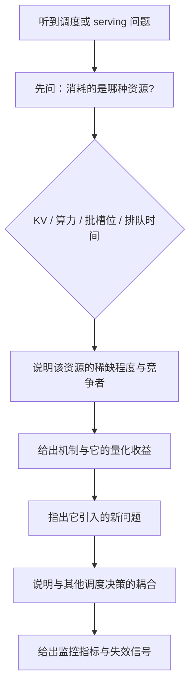

# Serving、batching、调度与 QoS 题组（Q029–Q044）

> 位置：[InferenceAtlas](../../INDEX.md) > [模块 17](README.md) > 当前文档
> 信息截至：2026-07-29 ｜ 最后核验：2026-07-29 ｜ 内容版本：v0.1
> 时效性等级：低
> 相关主题：[模块 03](../03_serving_engines_and_scheduling/)｜[第二组题](02_kv_cache_and_transformer_questions.md)｜`04_compiler_kernel_and_quantization_questions.md`

## 本章导读

这一组 16 道题考的是**服务层**。如果前两组题考「你懂不懂原理」，这一组考「你有没有真正跑过生产服务」。

这组题的共同特征是**几乎每道都能问出「你遇到过吗」**。连续批处理的机制可以背，但「抢占后请求为什么会输出重复内容」只有踩过坑的人答得出来；自动扩缩容的公式可以背，但「为什么按 GPU 利用率扩容会失效」需要理解 decode 的利用率指标是失真的。**面试官在这一组题上最容易分辨真实经验**。

另一条主线是**调度决策的耦合性**。批组装、准入控制、抢占、路由、扩缩容——这五件事看起来是五个模块，实际上共享同一批资源且互相影响：准入太松会导致抢占，抢占会拉长驻留时间，驻留时间变长会按 Little's Law 推高并发，并发推高又加剧 KV 压力。**答这一组题时能指出这种耦合，是一个强信号**。

本章按「批处理 → 内存管理 → 调度 → 路由与弹性 → 多租户」的顺序组织。

## 学习目标

读完本章后，读者应能够：

1. 解释连续批处理相对静态批处理的收益来源，并说明它引入了什么新问题
2. 设计抢占与恢复机制，并指出三个最容易出错的实现点
3. 分析五个调度决策（批组装、准入、抢占、路由、扩缩容）之间的耦合
4. 为多租户场景设计 QoS 隔离，并说明公平性与效率的冲突
5. 判断自动扩缩容应该用什么信号，以及为什么 GPU 利用率是错的

## 核心结论

- **连续批处理的收益来自消除「等最慢请求」的浪费**，代价是引入了逐步变化的批组成与由此产生的一系列状态管理问题。
- **抢占是内存压力的安全阀，但它有正反馈风险**：被抢占的长请求重算后占用更久，进一步加剧压力。
- **准入控制必须在资源被消耗之前做**，而不是等 OOM——这是「先判断再执行」与「先执行再回滚」的区别。
- **GPU 利用率不是扩缩容的正确信号**：decode 阶段它接近 100% 却算力空转，应改用队列深度与 SLO 达成率。
- **多租户的公平性与效率直接冲突**：严格隔离浪费容量，完全共享则吵闹邻居会伤害所有人。

## 1. 问题定义、系统边界与工作负载

本章覆盖 [模块 03](../03_serving_engines_and_scheduling/) 的全部内容，并在抢占恢复、降级、分离部署相关题目上延伸到 [模块 05](../05_decoding_and_generation_algorithms/) 与 [模块 06](../06_distributed_and_moe_inference/)。

**答题的通用起点**是先问「这个决策消耗的是哪种资源」——KV 显存、算力、批槽位、还是排队时间。服务层的绝大多数设计都是在这四种资源之间做分配，而它们的稀缺程度决定了正确的策略。

本章不含任何需要外部核验的规格数字；题目中的参数均为题面给定的假设值。

### 本章题目一览

| 编号 | 题目 | 难度 | 形式 |
|---|---|---|---|
| Q029 | 连续批处理的收益来自哪里 | 中等 | 概念 |
| Q030 | 实际批大小由什么决定 | 中等 | 计算 |
| Q031 | 从零设计一个 LLM 推理服务的分层 | 中等 | 系统设计 |
| Q032 | 准入控制该在什么时候做，判断什么 | 高 | 系统设计 |
| Q033 | 抢占怎么实现，三个最容易错的点 | 高 | 系统设计 |
| Q034 | 抢占率突然上升，怎么定位 | 高 | 排查 |
| Q035 | 分块 prefill 在什么之间做折中 | 高 | 概念 |
| Q036 | 怎么在推理服务里实现优先级，怎么防饥饿 | 中等 | 系统设计 |
| Q037 | 怀疑 KV 显存泄漏，怎么定位 | 中等 | 排查 |
| Q038 | 路由应该按负载还是按缓存命中 | 高 | 系统设计 |
| Q039 | 级联（先小模型后大模型）什么时候划算 | 高 | 系统设计 |
| Q040 | P99 时延是 P50 的 20 倍，怎么拆解 | 高 | 排查 |
| Q041 | 扩缩容应该用什么信号，为什么不是 GPU 利用率 | 高 | 系统设计 |
| Q042 | 冷启动是 serverless 推理的核心难题 | 中等 | 系统设计 |
| Q043 | 多租户推理的隔离怎么做，公平与效率怎么权衡 | 高 | 系统设计 |
| Q044 | 五个调度决策如何互相影响 | 专家 | 系统设计 |

## 2. 原理、数学与性能模型

这一组题反复用到四个模型：

**（一）静态批的浪费**。静态批必须等批内最慢的请求完成，因此有效利用率约为「平均输出长度 ÷ 最长输出长度」：

$$
\eta_{\text{static}} \approx \frac{E[L]}{\max L}
$$

输出长度分布越分散，这个比值越低。**连续批处理消除的正是这部分浪费**。

**（二）准入的资源预留**。一个请求进入前应确认

$$
M_{\text{free}} \ge S_{\text{prompt}} \cdot m_{\text{tok}} + \text{预期生成长度} \cdot m_{\text{tok}}
$$

**关键是「预期生成长度」事先未知**，所以准入必须基于估计，而估计要用分位数而非均值。

**（三）抢占的成本与正反馈**。抢占一个已生成 $L_g$ 个 token 的请求，恢复代价是 $\text{prefill}(S_{\text{prompt}} + L_g)$。**$L_g$ 越大代价越高，而长请求恰好是最可能被抢占的**——这是正反馈的来源。

**（四）路由的亲和性收益**。缓存命中把 prefill 成本从 $S_{\text{full}}$ 降到 $\Delta_{\text{new}}$，但严格亲和会导致负载不均。两者需要加权：

$$
\text{score} = w_1 \cdot \text{缓存命中长度} - w_2 \cdot \text{该实例当前负载}
$$

四个模型的详细推导见 [模块 03 第 2–10 章](../03_serving_engines_and_scheduling/)。

## 3. 实现机制与系统设计

以下为本章题库正文。每题的「推荐回答」是**完整答案**，可在 2–5 分钟内口头讲完。

### Q029：连续批处理的收益来自哪里

**难度**：中等　**形式**：概念　**目标岗位**：Inference / Serving / ML Systems

**考察点**：检验候选人是否理解「等最慢请求」这个浪费的具体形式，以及连续批处理消除它的机制。

**题目**：请说明静态批处理、动态批处理与连续批处理的区别，并量化连续批处理的收益来源。

#### 推荐回答

**结论**：连续批处理的收益来自**消除「批内所有请求必须等最慢那个完成」的浪费**，而这个浪费的大小约等于「1 减去平均输出长度与最长输出长度之比」。

**三者的区别**。**静态批**在服务启动时就固定批大小与成员，整批一起进、一起出。**动态批**允许在批开始前根据当前排队情况决定批大小，但批一旦开始执行，成员就固定了。**连续批处理**（也叫 iteration-level scheduling）允许在**每个 decode 迭代的边界**加入新请求、移出已完成的请求——关键词是「逐步」，批的成员每一步都在变。

**浪费的量化**。静态或动态批中，如果一个请求生成 50 个 token 而另一个生成 2000 个，前者完成后它的批槽位在剩下的 1950 步里**空转**。有效利用率约为

$$
\eta_{\text{static}} \approx \frac{E[L]}{\max L}
$$

**输出长度分布越分散，这个比值越低**。LLM 的输出长度分布通常是重尾的，所以静态批的浪费可以非常大。连续批处理让完成的请求立刻腾出槽位给新请求，把这部分浪费基本消除。

**代价：引入了一系列状态管理问题**。批成员每步都在变，因此：
每个请求的 KV 长度不同，注意力内核必须处理变长（这是 PagedAttention 等设计的动因）；
采样参数是逐请求的，必须张量化而不能按请求分支；
新加入的请求要先做 prefill，这会打断正在 decode 的请求（分块 prefill 的动因）；
请求可能被抢占，其状态必须可持久化与可恢复。

**所以「连续批处理」不是一个孤立的优化，而是一整套设计的起点**——分页 KV、分块 prefill、抢占恢复都是它的必然推论。

**局限**：连续批处理不改变单步的时间（仍是 $W/\text{BW}$ 主导），它改善的是「槽位的利用率」而非「单请求的速度」。在所有请求输出长度都相同的负载上，它相对动态批几乎没有收益。

#### 强答案必须覆盖

- 三者的准确区别，强调连续批是迭代级别的加入与退出
- 写出静态批的有效利用率 $E[L]/\max L$ 并说明分布越分散浪费越大
- 列出它引入的至少三个新问题
- 指出它是分页 KV、分块 prefill、抢占恢复的共同动因
- 说明它不改善单请求速度

#### 常见错误

- 把连续批处理与动态批处理混为一谈
- 只讲收益不讲它引入的状态管理复杂度
- 认为它能降低单请求的 TPOT
- 说不出「等最慢请求」这个浪费的定量形式

#### 可能追问

1. 变长批对注意力内核提出了什么要求？
2. 为什么采样参数必须张量化？
3. 在什么负载上连续批处理几乎没有收益？

#### 关联阅读

- [静态、动态与连续批处理](../03_serving_engines_and_scheduling/02_static_dynamic_and_continuous_batching.md)
- [PagedAttention 与 KV 内存管理](../03_serving_engines_and_scheduling/03_pagedattention_and_kv_memory_management.md)
- [采样参数](../05_decoding_and_generation_algorithms/02_greedy_sampling_topk_topp_temperature.md) 3.1

### Q030：实际批大小由什么决定

**难度**：中等　**形式**：计算　**目标岗位**：Inference / Serving / ML Systems

**考察点**：检验候选人是否知道批大小受多个上界共同约束，且配置上限往常不是真正的约束。

**题目**：你的引擎配置了 max_batch_size=256，但监控显示实际批大小常年在 40 左右。请给出可能的原因并排序。

#### 推荐回答

**结论**：配置的 `max_batch_size` 是一个上界，但实际批大小由**四个约束中最紧的那个**决定。实际值远低于配置值时，最可能的原因按概率排序是：**KV 容量、到达率不足、TPOT SLO、调度策略**。

**四个约束**：

**（一）KV 容量**（最常见）。可并发数是 $B_{\max} = M_{\text{KV}} / (S \cdot m_{\text{tok}})$。如果平均上下文是 8K 而 $m_{\text{tok}}$ 是 320 KiB，40 GB 的 KV 预算只能装约 15 个请求——**此时 256 这个配置完全没有意义**。排查方法：看 KV 使用率。如果它长期接近 100% 而批大小上不去，就是这个原因。

**（二）到达率不足**。批里没有那么多请求可装。按 Little's Law，$N = \lambda W$，如果到达率 $\lambda$ 只有 8 请求/s 而平均驻留 5 s，系统中平均就只有 40 个请求——**批大小是需求决定的，不是能力决定的**。排查方法：看队列深度。如果队列常年是空的，说明是需求不足，此时「批大小小」根本不是问题。

**（三）TPOT SLO**。如果调度器实现了 SLO 感知，它会主动限制批大小以保证 TPOT。排查方法：看是否有 SLO 相关的配置在生效。

**（四）调度策略**。某些策略会为了公平性或为 prefill 预留算力而限制 decode 批。

**排查顺序**：**先看队列深度，再看 KV 使用率**。队列空 → 需求不足，不是问题；队列有积压但 KV 满 → KV 是瓶颈；队列有积压且 KV 有余量 → 查 SLO 感知逻辑与调度策略。

**这个排查顺序很重要**：如果不先区分「需求不足」与「能力不足」，很容易去优化一个不存在的问题。**队列空而批小是完全正常的**。

**局限**：以上假设批大小的监控口径是「decode 批中的请求数」。有些系统报告的是「批中的 token 数」（混合了 prefill），两者不可比——**排查前要先确认监控的口径**。

#### 强答案必须覆盖

- 列出四个约束并按概率排序
- 指出 KV 容量最常见，并给出 $B_{\max}$ 公式
- 指出「到达率不足」这个可能性，并说明此时批小不是问题
- 给出「先看队列深度再看 KV 使用率」的排查顺序
- 提醒确认批大小的监控口径

#### 常见错误

- 假定批小一定是问题，不先检查是否需求不足
- 只想到 KV 容量，忽略到达率与 SLO 感知
- 不确认监控口径就开始排查
- 试图通过提高 max_batch_size 来解决

#### 可能追问

1. 如果队列空而批小，你还会做什么优化吗？
2. SLO 感知的批大小限制具体怎么实现？
3. 混合 prefill 的批怎么统计大小？

#### 关联阅读

- [静态、动态与连续批处理](../03_serving_engines_and_scheduling/02_static_dynamic_and_continuous_batching.md)
- [排队论](../01_foundations_and_metrics/03_queueing_theory_for_inference.md)
- [KV cache 容量与内存模型](../02_transformer_and_kv_cache/05_kv_cache_capacity_and_memory_models.md)

### Q031：从零设计一个 LLM 推理服务的分层

**难度**：中等　**形式**：系统设计　**目标岗位**：Inference / Serving / ML Systems

**考察点**：检验候选人是否有完整的服务架构图景，而不只是熟悉引擎内部。

**题目**：请设计一个 LLM 推理服务的整体架构，说明有哪些层、各层的职责、以及层之间的接口。

#### 推荐回答

**结论**：我会分五层——**接入层、调度层、引擎层、模型执行层、存储与缓存层**，并且明确每层的职责边界与它们之间传递什么。

**接入层**：协议处理（HTTP/gRPC/流式）、认证与配额、请求校验（采样参数的范围 clamp）、tokenize 与 detokenize。**这一层容易被低估**——高 QPS 下 tokenize 可能占用可观 CPU，而采样参数的校验必须在这里做（用户传入的极端值若进入内核会导致 NaN 或越界）。

**调度层**：准入控制、优先级与队列管理、路由（选实例）、批组装。**这一层是服务质量的决定者**——SLO 能否达成主要看这里。它需要知道每个实例的 KV 余量、缓存内容、当前负载。

**引擎层**：连续批处理循环、KV 内存管理（分页、分配、回收）、抢占与恢复、分块 prefill、采样。这是「推理引擎」通常指的部分。

**模型执行层**：图执行、内核调用、并行通信（TP/PP 的集合通信）、量化的反量化路径。

**存储与缓存层**：模型权重的加载与分发、前缀缓存（可能分层：显存/主机内存/远端）、会话状态的持久化。

**层间接口的关键设计**：
接入层 → 调度层传递的是「请求 + SLO 等级 + 采样参数」，**不应该传递「用哪个批」这类实现细节**；
调度层 → 引擎层传递的是「这一批要处理哪些请求」；
**引擎层必须向上暴露 KV 余量与抢占事件**，否则调度层无法做正确的准入决策——这是最容易设计错的一个接口。

**一个重要的设计原则**：**请求应当表达意图（SLO 等级），而不是指定实现（用不用投机解码、批多大）**。因为最优的实现选择依赖当前负载，只有调度层知道。用户指定「我要低时延」，系统决定在当前负载下如何达成——这可能意味着开投机解码，也可能意味着关掉它（如果批已经很大）。

**容易漏掉的横切关注点**：可观测性（每层都要能定位问题）、配置的动态下发（不重启改策略）、以及降级路径（每层都要能降级而不是只能拒绝）。

**局限**：这个分层是逻辑上的，物理部署可以合并（单进程内全部层）或拆分（调度层独立服务、prefill/decode 分离）。**拆分的收益是独立扩缩容，代价是跨进程通信与运维复杂度**。

#### 强答案必须覆盖

- 给出至少四层并说明各自职责
- 指出接入层的 tokenize 与参数校验容易被低估
- 指出「引擎层必须暴露 KV 余量与抢占事件」这个关键接口
- 提出「请求表达意图而非指定实现」的原则
- 提到可观测性、动态配置、降级三个横切关注点

#### 常见错误

- 只讲引擎内部，缺少接入层与调度层
- 让请求直接指定实现细节（批大小、是否投机）
- 引擎层不向上暴露 KV 状态，导致准入决策盲目
- 忽略参数校验，让用户的极端值进入内核

#### 可能追问

1. 调度层独立成服务有什么收益与代价？
2. 怎么设计「引擎层暴露 KV 余量」这个接口的时效性？
3. 动态配置下发要注意什么？

#### 关联阅读

- [服务架构总览](../03_serving_engines_and_scheduling/01_serving_architecture_overview.md)
- [生成质量与时延的系统级权衡](../05_decoding_and_generation_algorithms/10_generation_quality_latency_tradeoffs.md) 3.1（请求表达意图）

### Q032：准入控制该在什么时候做，判断什么

**难度**：高　**形式**：系统设计　**目标岗位**：Inference / Serving / ML Systems

**考察点**：检验候选人是否理解准入是「资源预留」而非「速率限制」，以及是否知道决策时机的重要性。

**题目**：请设计推理服务的准入控制。它应该在请求生命周期的哪个点做决策？判断的依据是什么？它与限流的区别是什么？

#### 推荐回答

**结论**：准入控制应当在**资源被消耗之前**做，判断依据是「可用资源能否覆盖这个请求的预期占用」。它与限流的本质区别是：**限流按速率，准入按资源**。

**判断什么**。一个请求进入前应确认

$$
M_{\text{free}} \ge (S_{\text{prompt}} + \hat{L}_{\text{out}}) \cdot m_{\text{tok}}
$$

其中 $\hat{L}_{\text{out}}$ 是预期输出长度。**关键困难是它事先未知**，所以只能用估计——而且**必须用分位数而非均值**，否则长请求会持续导致超额准入。保守的做法是用 `max_tokens`（硬上界），代价是可能拒绝本来能服务的请求；折中是用历史分布的 P75。

**为什么时机重要**。如果等到 KV 真的不够才处理，已经付出的成本就浪费了：
在 prefill 之后才发现放不下 → **整个 prefill 白算**；
在 PD 分离架构下，如果传输 KV 到一半才发现 decode 池装不下 → prefill 与传输都白费。
**所以正确的做法是在最上游预留资源**，而不是在下游检查。这是「先判断再执行」与「先执行再回滚」的区别。

**准入与限流的区别**：

| 维度 | 准入控制 | 限流 |
|---|---|---|
| 判断依据 | 可用资源 | 请求速率 |
| 目标 | 防止资源耗尽与抢占 | 防止过载、保护配额 |
| 粒度 | 单请求的资源占用 | 时间窗口内的请求数 |
| 一个大请求 | 可能被拒（占用大） | 不受影响（只算一个） |

**两者都需要**，因为它们防的是不同的问题。只有限流的系统会被「少量超大请求」打爆；只有准入的系统会被「大量小请求」耗尽 CPU 或队列。

**准入的正确响应不是简单拒绝**。按代价从低到高：排队等待（若预期等待可接受）、降级（缩小 max_tokens、关闭增益特性）、最后才是拒绝。**直接拒绝是最差的用户体验，应当是最后手段**。

**与抢占的关系**（这是一个加分点）：**抢占率高的根因常常是准入太松**。如果系统频繁抢占，正确的动作是收紧准入而不是优化抢占实现——抢占是安全阀，频繁触发说明上游没管住。

**局限**：$\hat{L}_{\text{out}}$ 的估计误差是这套机制的根本不确定性。对 reasoning 类负载，长度分布方差极大，估计几乎不可靠——此时只能靠硬上界加水位监控兜底。

#### 强答案必须覆盖

- 写出准入的资源判断式并指出 $\hat{L}_{\text{out}}$ 事先未知
- 强调必须用分位数而非均值估计
- 说明时机必须在资源消耗之前，并给出 prefill 白算的例子
- 清楚区分准入（按资源）与限流（按速率），并说明两者都需要
- 给出「排队 → 降级 → 拒绝」的响应阶梯
- 指出抢占率高的根因常在准入太松

#### 常见错误

- 把准入控制等同于限流
- 在 prefill 之后才做资源检查，浪费已付出的计算
- 用平均输出长度做准入估计
- 准入失败就直接拒绝，不考虑排队与降级
- 抢占频繁时去优化抢占实现而不收紧准入

#### 可能追问

1. reasoning 负载下 $\hat{L}_{\text{out}}$ 估不准，你会怎么兜底？
2. PD 分离架构下准入应该在哪一步做？
3. 怎么在准入决策里同时考虑 KV 与算力两种资源？

#### 关联阅读

- [请求调度与准入控制](../03_serving_engines_and_scheduling/04_request_scheduling_and_admission_control.md)
- [prefill/decode 分离](../06_distributed_and_moe_inference/07_prefill_decode_disaggregation.md) 4.4
- [reasoning 成本治理](../05_decoding_and_generation_algorithms/07_reasoning_inference_and_test_time_scaling.md) 3.1

### Q033：抢占怎么实现，三个最容易错的点

**难度**：高　**形式**：系统设计　**目标岗位**：Inference / Serving / ML Systems

**考察点**：检验候选人是否真的实现或调试过抢占。三个易错点几乎只有踩过坑的人能说出来。

**题目**：KV 显存不足时需要抢占在飞请求。请设计抢占与恢复机制，并指出实现中最容易出错的地方。

#### 推荐回答

**结论**：抢占的核心是「释放 KV、保留可重建的状态、之后恢复」。三个最容易出错的点是：**已生成 token 必须保留且不能重新采样、流式输出的位置必须记录、约束解码等私有状态必须一起持久化**。

**基本机制**。当 KV 不足时，选一个受害者请求，释放它的 KV 页，把它放回队列。之后资源可用时，用「原 prompt + 已生成的 token」作为新的输入重新 prefill，从中断处继续生成。

**恢复代价**：

$$
T_{\text{recover}} = \text{prefill}(S_{\text{prompt}} + L_{\text{generated}})
$$

**注意代价随已生成长度增长**——这是选受害者时的关键考虑。

**三个易错点**：

**（一）已生成的 token 必须保留，且恢复时不能重新采样**。如果只保留 prompt，恢复后会重新生成前面的内容，用户看到重复或不一致的输出。而如果保留了 token 但恢复时又对这些位置重新采样，结果会与已经发出去的不一致。**正确做法是把已生成的 token 当作输入上下文的一部分，只对新位置采样**。这意味着采样结果是**持久化状态而非可重算的中间量**。

**（二）流式输出的位置必须记录**。如果已经向用户推送了 $L_g$ 个 token，恢复后必须从第 $L_g+1$ 个开始推送——不能重复也不能跳过。实现上需要一个 `stream_offset`，且它必须与「已生成 token 列表」保持一致。

**（三）请求的私有状态必须一起持久化**。约束解码的状态机位置、重复惩罚的历史统计、投机解码的相关状态——这些如果丢失，恢复后会从错误的状态继续，产生格式错误或行为异常，**而且通常不报错**。

**受害者选择策略**：
**已生成最少的**（恢复代价最低）——但可能反复抢占同一个新请求，导致饥饿；
**最晚到达的**（LIFO，保护已投入的工作）；
**优先级最低的**（符合 QoS 但可能不公平）。
实践中常用「优先级 + 已生成长度」的加权，并配合老化防止饥饿。

**正反馈风险**（这是最重要的一点）：被抢占的长请求恢复时要重算更长的上下文，占用时间更久，进一步加剧 KV 压力 → 更多抢占。**这是一个自我强化的循环，所以症状是「突然崩溃」而非「缓慢变差」**。打断它的办法是**收紧准入**而不是优化抢占——抢占是安全阀，频繁触发说明上游没管住。

**局限**：抢占后重算是纯粹的浪费。如果显存允许，把 KV 换出到主机内存而不是丢弃会更省——判据是「换出往返成本是否小于重算成本」。

#### 强答案必须覆盖

- 给出基本机制与恢复代价公式，指出代价随已生成长度增长
- 三个易错点：已生成 token 的保留与不重采样、流式偏移、私有状态持久化
- 指出采样结果是持久化状态而非可重算的中间量
- 给出受害者选择策略与饥饿风险
- 描述正反馈并指出应收紧准入而非优化抢占
- 提到换出到主机内存作为替代

#### 常见错误

- 只保留 prompt，恢复后重新生成导致重复输出
- 忘记记录流式偏移，恢复后重复推送
- 遗漏约束解码状态机位置等私有状态
- 抢占频繁时优化抢占实现而不收紧准入
- 受害者选择只看一个维度，导致饥饿

#### 可能追问

1. 换出到主机内存 vs 丢弃重算的判据是什么？
2. 怎么防止同一个请求被反复抢占？
3. 抢占对 SLO 统计有什么影响？

#### 关联阅读

- [请求调度与准入控制](../03_serving_engines_and_scheduling/04_request_scheduling_and_admission_control.md)
- [容错与优雅降级](../06_distributed_and_moe_inference/10_fault_tolerance_and_graceful_degradation.md) 2.3、3.2
- [结构化输出与语法约束解码](../05_decoding_and_generation_algorithms/09_structured_output_and_grammar_constrained_decoding.md) 3.2

### Q034：抢占率突然上升，怎么定位

**难度**：高　**形式**：排查　**目标岗位**：Inference / Serving / ML Systems

**考察点**：检验候选人能否从症状追到上游根因，而不是只看抢占本身。

**题目**：监控显示抢占率从 0.5% 涨到 15%，同时 P99 时延恶化。请给出排查路径。

#### 推荐回答

**结论**：抢占率上升说明**KV 需求超过了供给**，根因几乎总在上游——要么需求侧变了（请求变长、并发变高），要么供给侧变了（可用 KV 减少）。**抢占本身是症状不是病因**。

**排查路径，按顺序**：

**第一步，确认是需求变了还是供给变了**。看两组数字：
需求侧——上下文长度分布（尤其 P95/P99）、到达率、平均输出长度；
供给侧——可用于 KV 的显存总量、是否有新增的显存占用者。
**这一步能把范围缩小一半**。

**第二步，如果是需求侧**，具体查：
**长度分布是否右移**——某个新接入的业务可能带来了长得多的 prompt。这是最常见的原因，而按均值做的容量规划对此完全无感（峰值由上尾决定）。
**到达率是否上升**——按 Little's Law，$N = \lambda W$，到达率上升直接推高在飞请求数进而推高 KV 需求。
**是否有新的负载类型**——reasoning 类请求的输出长度方差远大于普通生成，混入后会显著推高 KV 峰值。

**第三步，如果是供给侧**，查：
**是否有新的显存占用者**——加载了 draft 模型做投机解码？启用了更大的前缀缓存？MoE 的专家权重挤压了 KV 空间？**这些都是常见的「不知不觉吃掉 KV」的来源**。
**是否有显存泄漏或碎片**——分页 KV 下引用计数漏减会导致页无法回收。排查方法：看「已分配页数」与「活跃请求持有的页数之和」是否一致，不一致就是泄漏。

**第四步，检查准入控制是否失效**。抢占是准入的最后防线，**如果抢占频繁，说明准入没有拦住不该进来的请求**。具体查：准入用的输出长度估计是不是均值（应该用分位数）？是否根本没有实现准入而是靠抢占兜底？

**第五步，注意正反馈**。抢占的请求恢复时要重算更长的上下文，占用更久，进一步加剧压力。**所以抢占率一旦越过某个点会自我强化**，这解释了为什么它从 0.5% 跳到 15% 而不是渐变。**紧急处置应当是限流或降低 max_tokens 打断循环**，而不是等它自己恢复。

**我会先做的两件事**：看上下文长度分布是否右移（最常见），以及核对显存分配明细找新增占用者。这两项成本很低且覆盖大部分情形。

**局限**：如果抢占率上升与某次发布同时发生，应当优先怀疑那次发布——配置变更（批大小、缓存大小、投机开关）比流量变化更容易一夜之间改变 KV 平衡。

#### 强答案必须覆盖

- 先区分需求侧与供给侧
- 需求侧查长度分布右移、到达率、新负载类型
- 供给侧查新增显存占用者（draft 模型、缓存、MoE 专家）与页泄漏
- 指出抢占频繁的根因常在准入失效
- 描述正反馈并给出紧急处置（限流或降 max_tokens）
- 提到与发布时间的关联

#### 常见错误

- 只在抢占逻辑里找问题，不看上游
- 忽略「新增显存占用者」这类供给侧变化
- 不检查准入控制是否用了均值估计
- 等系统自行恢复而不打断正反馈

#### 可能追问

1. 怎么检测分页 KV 的引用计数泄漏？
2. 如果确认是长度分布右移，中长期怎么改？
3. 紧急处置时限流与降 max_tokens 哪个优先？

#### 关联阅读

- [请求调度与准入控制](../03_serving_engines_and_scheduling/04_request_scheduling_and_admission_control.md)
- [服务事故排查手册](../03_serving_engines_and_scheduling/12_serving_incident_playbook.md)
- [容量规划](../01_foundations_and_metrics/08_capacity_planning.md)

### Q035：分块 prefill 在什么之间做折中

**难度**：高　**形式**：概念　**目标岗位**：Inference / Serving / ML Systems

**考察点**：检验候选人是否理解分块 prefill 是「用 prefill 效率换 TPOT 平稳」，以及它与分离部署的替代关系。

**题目**：分块 prefill 解决什么问题？它的块大小怎么选？它与 prefill/decode 分离的关系是什么？

#### 推荐回答

**结论**：分块 prefill 解决的是**长 prompt 的 prefill 打断 decode 导致 TPOT 尖峰**的问题。它把长 prefill 切成小块穿插进 decode 批，**用一点 prefill 的效率损失，换取 TPOT 的平稳**。

**问题的形式**。混合部署下，一个长 prompt 的 prefill 可能占用几十毫秒，期间所有 decode 请求停滞。用户感受是**输出突然卡一下**。而且这个卡顿的幅度正比于 prompt 长度，所以长 prompt 混入会让 ITL 的 P99 显著恶化。

**分块的做法**：把 $S$ 个 token 的 prefill 切成若干块，每个 decode 迭代只处理一块，与 decode 的 token 一起组成混合批。这样单次打断从「整个 prefill」降到「一块」。

**块大小的 trade-off**：

| 块大小 | TPOT 平稳性 | prefill 效率 | TTFT |
|---|---|---|---|
| 小 | 好（打断短） | 差（算术强度低） | 差（prefill 拖长） |
| 大 | 差 | 好 | 好 |

**效率损失的来源**：prefill 是计算受限的，需要足够多的 token 才能饱和算力。块太小则每块的算术强度不足，算力浪费。**所以块大小应当至少让 prefill 部分保持计算受限**——这给出了一个下界，可以按 roofline 估算。

**实践做法**：把「块大小」表述为「混合批的 token 预算」更准确——每个迭代的总 token 数（decode 的 $B$ 个加 prefill 的一块）保持大致恒定。这样批的形状稳定，也利于 CUDA Graph 捕获。

**与 PD 分离的关系**：**两者解决同一个问题，是替代而非互补**。分块 prefill 是缓解（打断仍然存在，只是变小），分离是消除（decode 池完全不做 prefill）。**选择的判据是 prefill 占用比** $\lambda_p T_{\text{prefill}}$：TPOT 的改善倍数是 $1/(1-u)$，占用比 0.3 时只有 1.43 倍，0.8 时达 5 倍。**占用比低于 0.3 时，分块 prefill 通常已经够了，不值得分离的复杂度**。

**正确的顺序是：先把分块 prefill 调优，确认它不足以满足 SLO，再考虑分离**。分离引入两个池、KV 传输、两次调度与失败处理，是持续的运维成本。

**局限**：分块 prefill 无法解决「批大小折中」与「并行度折中」——prefill 的 token 仍然挤占 decode 的批槽位，两个阶段仍然共用一个 TP 度。**这两项只有分离能解决**，是分离相对分块的额外价值。

#### 强答案必须覆盖

- 说明问题：长 prefill 打断 decode 导致 TPOT 尖峰
- 给出块大小的 trade-off 表，说明效率损失来自算术强度不足
- 指出实践中应表述为「混合批的 token 预算」
- 说明与 PD 分离是替代关系，并给出 prefill 占用比的判据
- 指出分块无法解决批大小与并行度折中

#### 常见错误

- 认为分块 prefill 与 PD 分离是互补的
- 块大小设得过小，prefill 效率大幅损失
- 直接推荐 PD 分离而不先调优分块 prefill
- 说不出效率损失的具体来源

#### 可能追问

1. 混合批的 token 预算怎么定？
2. 分块 prefill 对 CUDA Graph 有什么影响？
3. prefill 占用比怎么测量？

#### 关联阅读

- [prefill/decode 调度](../03_serving_engines_and_scheduling/05_prefill_decode_scheduling.md)
- [prefill/decode 分离](../06_distributed_and_moe_inference/07_prefill_decode_disaggregation.md) 2.2、4.2

### Q036：怎么在推理服务里实现优先级，怎么防饥饿

**难度**：中等　**形式**：系统设计　**目标岗位**：Inference / Serving / ML Systems

**考察点**：检验候选人是否知道优先级需要配合老化，以及是否理解推理场景下优先级的特殊之处。

**题目**：你要为付费用户与免费用户提供不同的服务等级。请设计优先级调度，并说明如何防止低优先级请求饥饿。

#### 推荐回答

**结论**：优先级要作用在**三个决策点**（准入、批组装、抢占受害者选择），并且必须配合**老化机制**防止饥饿。推理场景的特殊之处是：**请求一旦开始生成就很难降优先级**，因为它已经占着 KV 且中途放弃是纯浪费。

**三个作用点**：

**准入**：高优先级请求可以占用更多资源、或在资源紧张时优先获得准入。低优先级请求在高负载时被排队或降级。

**批组装**：从队列选请求进批时按优先级排序。

**抢占受害者选择**：内存不足时优先抢占低优先级请求。**这一点是推理特有的**——传统服务没有「已经开始处理的请求还能被踢出去」这个操作。

**推理场景的特殊约束**：一个请求开始 decode 后，它占着 KV 且已经投入了 prefill 的计算。此时降它的优先级只能通过抢占，而抢占的恢复代价随已生成长度增长。**所以优先级的主要作用窗口是「进入之前」，而不是「进入之后」**——这与 CPU 调度很不一样。

**防饥饿：老化**。低优先级请求的有效优先级随排队时间提升：

$$
\text{eff\_priority} = \text{base\_priority} + \alpha \cdot T_{\text{queued}}
$$

$\alpha$ 决定了「等多久能追上高优先级」。**没有老化的严格优先级会让低优先级请求永久饥饿**，尤其在高负载下——这是一个必然会发生的问题，不是边缘情况。

**降级优于拒绝**。对低优先级请求，比「拒绝」更好的是「降级服务」：缩小 max_tokens、关闭增益特性（投机解码在高负载下本就是净损失，关掉几乎免费）、收紧 reasoning 预算、或路由到更小的模型。**这些手段让低优先级用户「慢一点或差一点」而不是「完全没有」**，在多数业务上是更好的取舍。

**必须监控的指标**：各优先级的排队时间分布（而非均值）、低优先级的拒绝率与降级率、以及**老化实际生效的比例**（如果老化从未把低优先级请求提上来，说明 $\alpha$ 设得太小）。

**局限**：优先级设计容易在长时间高负载下暴露不公平——此时低优先级用户可能持续处于降级状态。**这是一个产品决策而非工程决策**：要不要让部分用户长期得到较差的服务，应当由业务确认而不是工程默认。

#### 强答案必须覆盖

- 指出优先级作用在准入、批组装、抢占三个点
- 说明推理的特殊约束：进入后难降优先级，主要窗口在进入之前
- 给出老化公式并强调没有老化必然饥饿
- 提出「降级优于拒绝」并给出具体降级手段
- 给出必须监控的指标，含老化生效比例
- 指出长期不公平是产品决策

#### 常见错误

- 实现严格优先级而不加老化
- 认为可以随意降低已在生成的请求的优先级
- 低优先级请求直接拒绝，不考虑降级
- 只监控均值排队时间，看不到饥饿

#### 可能追问

1. 老化系数 $\alpha$ 怎么定？
2. 怎么判断某个请求「值得抢占」还是「值得让它跑完」？
3. 长期降级的公平性问题怎么向业务说明？

#### 关联阅读

- [请求调度与准入控制](../03_serving_engines_and_scheduling/04_request_scheduling_and_admission_control.md)
- [多租户隔离与 QoS](../03_serving_engines_and_scheduling/06_multi_tenant_isolation_and_qos.md)
- [容错与优雅降级](../06_distributed_and_moe_inference/10_fault_tolerance_and_graceful_degradation.md) 2.4

### Q037：怀疑 KV 显存泄漏，怎么定位

**难度**：中等　**形式**：排查　**目标岗位**：Inference / Serving / ML Systems

**考察点**：检验候选人是否知道分页 KV 的引用计数是泄漏的主要来源，以及能否设计出可执行的检测。

**题目**：服务运行几小时后可用 KV 逐渐减少，重启后恢复。请给出定位思路。

#### 推荐回答

**结论**：逐渐减少且重启恢复，几乎确定是**页没有被正确回收**。分页 KV 下最常见的根因是**引用计数漏减**，其次是碎片累积与缓存无上限增长。

**第一步，做一个守恒检查**（这是最有效的单项手段）：

$$
\text{已分配页数} \stackrel{?}{=} \sum_{\text{活跃请求}} \text{该请求持有的页数} + \text{缓存持有的页数}
$$

**如果左边持续大于右边，就是泄漏**，且差值就是泄漏量。这个断言应当作为常驻的自检，而不是等出问题才加。

**第二步，定位漏减的位置**。引用计数在四个地方变化：
请求结束时释放页表 → 每页引用减一；
写时复制时原页引用减一（新页引用为一）；
beam 死亡或投机候选被拒时释放；
缓存驱逐时释放。
**最容易漏的是异常路径**——请求被取消、超时、报错时的清理。正常路径通常测试覆盖了，异常路径往往没有。排查方法：构造取消与超时的用例，观察页数是否回到基线。

**第三步，区分泄漏与碎片**。碎片是「页都被正确记账但无法满足大块请求」，分页 KV 下外部碎片已被消除，所以剩下的是内部碎片（每序列最后一页平均浪费半页）——**内部碎片是稳定的，不会随时间增长**。如果占用随时间单调增长，就是泄漏而非碎片。

**第四步，检查缓存是否无上限**。前缀缓存如果没有容量上限或驱逐策略，会持续吃掉 KV 空间。这不算「泄漏」（它是有意持有的），但症状一样。排查方法：看缓存持有的页数是否单调增长。

**第五步，如果是写时复制路径**，重点查：
写入前是否检查了引用计数？引用计数大于 1 时是否复制了页？**这里的 bug 有两种症状**——漏复制导致数据损坏（更严重但更容易发现），漏减引用导致泄漏（更隐蔽）。

**我会先做的**：加上第一步的守恒断言并让它常驻。它的成本几乎为零，却能把「泄漏」从一个模糊的猜测变成一个有确切数值的事实，并且能在下次发生时立刻定位到是哪一类持有者没有释放。

**局限**：如果泄漏在框架或驱动层（而非页管理逻辑），守恒检查会显示一致但显存仍在减少——此时需要看设备级的显存分配统计，并考虑是否有非 KV 的占用者（激活缓冲、通信缓冲）在增长。

#### 强答案必须覆盖

- 提出「已分配页数 = 活跃请求持有 + 缓存持有」的守恒断言
- 列出引用计数变化的四个位置，指出异常路径最易漏
- 区分泄漏（单调增长）与内部碎片（稳定）
- 检查前缀缓存是否无上限增长
- 指出写时复制路径的两种 bug 症状
- 承认框架/驱动层泄漏的可能性

#### 常见错误

- 直接怀疑框架 bug 而不先做守恒检查
- 把内部碎片误认为泄漏
- 只测正常路径，漏掉取消与超时的清理
- 忽略前缀缓存无上限增长这个可能

#### 可能追问

1. 守恒断言应该多久检查一次？开销多大？
2. 写时复制漏复制会产生什么症状？
3. 怎么区分 KV 泄漏与激活缓冲增长？

#### 关联阅读

- [PagedAttention 与 KV 内存管理](../03_serving_engines_and_scheduling/03_pagedattention_and_kv_memory_management.md)
- [服务事故排查手册](../03_serving_engines_and_scheduling/12_serving_incident_playbook.md)
- [束搜索与约束解码](../05_decoding_and_generation_algorithms/03_beam_search_and_constrained_decoding.md) 3.1（写时复制）

### Q038：路由应该按负载还是按缓存命中

**难度**：高　**形式**：系统设计　**目标岗位**：Inference / Serving / ML Systems

**考察点**：检验候选人是否知道缓存亲和的收益常常超过负载均衡，以及能否设计加权方案。

**题目**：多副本部署下，请求路由应该按什么依据？如果缓存亲和与负载均衡冲突，怎么处理？

#### 推荐回答

**结论**：**缓存亲和通常应当优先，负载作为约束而非目标**。因为亲和命中省下的是整段 prefill 计算，量级远大于负载稍微不均带来的损失。冲突时用加权评分，并给负载设硬上限。

**为什么亲和收益更大**。缓存命中把 prefill 从 $S_{\text{full}}$ 降到 $\Delta_{\text{new}}$。在多轮对话或长系统提示词的场景，$\Delta_{\text{new}}$ 可能只占 $S_{\text{full}}$ 的几个百分点——**这是数十倍的计算节省**。而负载不均的损失通常只有百分之几十。**两者不在同一个量级**。

**为什么 KV 不能跨副本迁移**（这是一个关键约束）：TP 部署下 KV 是按头分片的，一个副本的分片对另一个副本没有意义。所以「路由到没有缓存的副本」意味着**必须全量重算**，无法通过迁移弥补。在 PD 分离架构下更糟——不仅要重算，还要再传一次 KV。

**加权评分**：

$$
\text{score}(i) = w_1 \cdot \text{命中的前缀长度}_i - w_2 \cdot \text{负载}_i
$$

并且给负载设**硬上限**——如果某个副本的 KV 使用率已经超过水位，无论缓存命中多好都不再路由给它。**「亲和优先但有负载上限」比「纯亲和」或「纯均衡」都好**。

**实现要点**：
路由层需要知道每个副本缓存了什么。完整的前缀索引成本高，实践中常用**前缀哈希的布隆过滤器或最近使用的前缀集合**，用少量误判换低开销。
**哈希必须包含全部影响 KV 的因子**——token 序列、模型版本、KV 量化配置、位置编码配置、TP 切分方式。漏掉任何一项会导致「错误命中」：路由到一个自认为有缓存但实际不兼容的副本。

**会话亲和是一个特例且更重要**。多轮对话的第二轮，其前缀就是第一轮的完整上下文，而那份 KV 就在处理第一轮的那个副本上。**所以会话亲和（按 session id 粘性路由）通常比通用的前缀缓存亲和收益更大**，且实现更简单。代价是必须有故障回退——实例挂了要能换，此时接受一次全量重算。

**必须监控的指标**：亲和命中率、各副本的负载离散度、以及**因负载上限而放弃亲和的比例**（这个数字告诉你两个目标冲突得多严重）。

**局限**：亲和会让负载分布更不均，因此需要更多的容量余量。在副本数很少时（如 2 个），亲和可能导致明显的不均衡，此时权重应当更偏向负载。

#### 强答案必须覆盖

- 指出亲和收益（数十倍的 prefill 节省）远大于负载不均的损失
- 说明 TP 下 KV 分片无法跨副本迁移，未命中必须全量重算
- 给出加权评分并强调负载要有硬上限
- 说明路由层需要缓存索引，可用布隆过滤器等近似结构
- 指出哈希必须包含全部影响 KV 的因子
- 指出会话亲和是更重要的特例，且需要故障回退

#### 常见错误

- 默认按负载均衡路由，忽略缓存亲和
- 纯亲和不设负载上限，导致个别副本过载
- 认为 KV 可以在副本间迁移
- 缓存索引的哈希漏掉模型版本或量化配置
- 会话亲和不留故障回退路径

#### 可能追问

1. 前缀索引用什么数据结构，开销多大？
2. 副本数很少时权重怎么调？
3. PD 分离架构下路由要考虑什么额外因素？

#### 关联阅读

- [prompt 缓存与前缀缓存](../03_serving_engines_and_scheduling/08_prompt_caching_and_prefix_caching.md)
- [自动扩缩容与负载均衡](../03_serving_engines_and_scheduling/10_autoscaling_and_load_balancing.md)
- [KV 传输、RDMA 与远端内存](../06_distributed_and_moe_inference/08_kv_cache_transfer_and_remote_memory.md) 3.4

### Q039：级联（先小模型后大模型）什么时候划算

**难度**：高　**形式**：系统设计　**目标岗位**：Inference / Serving / ML Systems

**考察点**：检验候选人能否量化级联的成本收益，以及是否知道它对时延的代价。

**题目**：为了降低成本，你考虑先用小模型回答，不满足质量要求再升级到大模型。请给出这个方案划算的判据与风险。

#### 推荐回答

**结论**：级联划算的判据是 $\rho < 1 - c_f/c_r$，其中 $\rho$ 是升级率、$c_f$ 与 $c_r$ 是快慢路径的成本。**当快路径远便宜时，只要升级率不接近 1 就划算**——但它的代价是升级请求的时延翻倍。

**成本推导**。设比例 $\rho$ 的请求需要升级：

$$
E[\text{cost}] = c_f + \rho \cdot c_r
$$

对比全量走大模型的 $c_r$，级联更优当且仅当

$$
c_f + \rho c_r < c_r \iff \rho < 1 - \frac{c_f}{c_r}
$$

**代入直觉**：若小模型成本是大模型的 1/10，则升级率低于 90% 就划算。这个门槛很宽松，所以**级联在成本上通常是划算的**。

**但时延是另一回事**。升级的请求要付两次生成的时间：先等小模型答完，判定不合格，再走大模型。**对这 $\rho$ 比例的请求，端到端时延接近翻倍**。如果 SLO 是按 P95 或 P99 定的，而 $\rho$ 大于 5% 或 1%，**尾部时延就会被级联主导**——此时级联在 SLO 意义上是不可接受的，尽管它在平均成本上更优。

**这是这道题的关键**：级联是一个**用尾部时延换平均成本**的交易，而不是纯粹的成本优化。

**升级判定的设计**是另一个难点。可选信号：
**可执行的验证**（代码能否跑通、答案能否校验）——最可靠，但只适用于部分任务；
**小模型自身的置信度**——便宜但不一定准；
**一个独立的判定模型**——更准但增加成本与时延；
**规则或格式检查**——只能捕获明显问题。
**判定的成本必须计入 $c_f$**，否则会低估级联的成本。

**风险**：
**判定不准**——漏判（该升级没升级）损害质量且不可见，误判（不该升级却升级）浪费成本；
**$\rho$ 会漂移**——流量构成变化会改变升级率，需要持续监控；
**双模型的运维成本**——两套权重、两套监控、两套版本管理。

**我会怎么决策**：先测 $\rho$ 与 $c_f/c_r$，代入判据看成本是否划算；然后**单独看升级请求的时延分布对 P99 的影响**。如果 P99 被打穿，要么放弃级联，要么把判定做得更早（不等小模型答完就判定）。

**局限**：这个模型假设升级是二元的。实践中可以有多级级联或部分升级（只重算不确定的部分），但复杂度显著上升。

#### 强答案必须覆盖

- 写出成本模型与判据 $\rho < 1 - c_f/c_r$
- 指出判据很宽松，成本上通常划算
- **关键**：指出升级请求时延翻倍，尾部时延可能被主导
- 把级联定位为「用尾部时延换平均成本」
- 列出升级判定的信号选项，并指出判定成本要计入 $c_f$
- 给出三类风险，含 $\rho$ 漂移

#### 常见错误

- 只算平均成本不看尾部时延
- 忽略升级判定本身的成本
- 不监控 $\rho$ 的漂移
- 认为级联是纯粹的成本优化

#### 可能追问

1. 怎么在不等小模型答完的情况下做升级判定？
2. 多级级联的复杂度值得吗？
3. 判定漏判导致的质量损失怎么监控？

#### 关联阅读

- [模型路由与级联系统](../03_serving_engines_and_scheduling/07_model_routing_and_cascade_systems.md)
- [reasoning 推理与 test-time scaling 的成本治理](../05_decoding_and_generation_algorithms/07_reasoning_inference_and_test_time_scaling.md) 3.4

### Q040：P99 时延是 P50 的 20 倍，怎么拆解

**难度**：高　**形式**：排查　**目标岗位**：Inference / Serving / ML Systems

**考察点**：检验候选人是否有结构化的时延拆解方法，而不是猜测。

**题目**：你的服务端到端时延中位数在 2 秒量级，而同一观测窗口内的 P99 达到中位数的约 20 倍。请给出系统的拆解方法，找出尾部时延的来源。

#### 推荐回答

**结论**：端到端时延由四段组成——**排队、prefill、decode、以及可能的中断**。要拆解 P99，必须**分段打点并分别看各段的分布**，而不是只看端到端的分布。

**第一步，分段打点**。每个请求记录：
到达时间、开始 prefill 时间、首 token 时间、每个 token 的时间、结束时间。由此得到排队时间、prefill 时间、decode 总时间、以及 ITL 序列。**没有分段打点，任何尾部时延排查都是猜测**。

**第二步，看哪一段贡献了尾部**。四种可能：

**（一）排队主导** → 根因是利用率或方差。排队等待是 $\rho/(1-\rho)$ 形式，在高利用率下急剧恶化；而服务时间方差还会乘一个 $(1+C_S^2)$ 因子。**推理的服务时间方差天然很大**（输出长度重尾），所以这一项常常是主因。验证：看排队时间的 P99 是否与端到端的 P99 同量级。

**（二）输出长度主导** → 这可能**根本不是问题**。如果尾部请求生成了 4000 个 token 而中位请求只生成 200 个，那么 40 秒对应 4000 token 就是 10 ms/token，完全正常。**必须看「归一化后的时延」**——即 TPOT 而不是端到端。这是最常见的误判：把「输出长」当成「系统慢」。

**（三）prefill 主导** → 长 prompt。验证：看 TTFT 的 P99 与 prompt 长度的相关性。

**（四）中断主导** → 抢占、降级、工具等待。验证：看 ITL 序列里是否有异常大的间隔，以及这些请求是否被抢占过。
**抢占过的请求应当在 SLO 统计中被标记**，否则它们会污染 P99。

**第三步，按主因处置**：
排队主导 → 降利用率（扩容或限流）或降方差（按长度分池）；
输出长度主导 → 改看 TPOT，可能无需处置；若成本是问题则限制 max_tokens；
prefill 主导 → 分块 prefill 或考虑分离；
中断主导 → 查抢占率（根因常在准入）与工具超时。

**我会先做的两件事**：确认有分段打点（若没有先补上），以及**画出「端到端时延 vs 输出长度」的散点图**。后者一眼就能区分「系统慢」与「输出长」，成本极低而信息量极大。

**局限**：分段打点本身有开销，且在高 QPS 下可能需要采样。另外若尾部时延来自外部依赖（工具调用、检索服务），推理服务内部的打点看不到根因，需要跨服务的链路追踪。

#### 强答案必须覆盖

- 提出分段打点：排队/prefill/decode/中断
- 列出四种可能的主因及各自的验证方法
- **关键**：指出「输出长度主导」可能根本不是问题，应看 TPOT
- 指出抢占过的请求应在 SLO 统计中标记
- 给出「端到端 vs 输出长度散点图」这个低成本高信息量的手段
- 承认外部依赖需要跨服务追踪

#### 常见错误

- 只看端到端分布不做分段拆解
- 把「输出长」误判为「系统慢」
- 把抢占或恢复的请求混入 SLO 统计
- 没有分段打点就开始猜测根因

#### 可能追问

1. 按输出长度分池具体怎么做，代价是什么？
2. 高 QPS 下分段打点怎么采样？
3. 抢占过的请求应该算 SLO 违反吗？

#### 关联阅读

- [服务事故排查手册](../03_serving_engines_and_scheduling/12_serving_incident_playbook.md)
- [排队论](../01_foundations_and_metrics/03_queueing_theory_for_inference.md)
- [时延、吞吐与 SLO](../01_foundations_and_metrics/02_latency_throughput_and_slo.md)

### Q041：扩缩容应该用什么信号，为什么不是 GPU 利用率

**难度**：高　**形式**：系统设计　**目标岗位**：Inference / Serving / ML Systems

**考察点**：检验候选人是否知道 decode 阶段的 GPU 利用率是失真的。这是区分「看过监控」与「没看过」的一道题。

**题目**：请设计推理服务的自动扩缩容。用什么指标触发？为什么 GPU 利用率不是好信号？

#### 推荐回答

**结论**：应当用**队列深度与 SLO 达成率**作为主信号，**不能用 GPU 利用率**——因为 decode 阶段它常年接近 100% 却算力大量空转，对负载变化几乎不敏感。

**为什么 GPU 利用率失真**。常用的利用率指标（如 `nvidia-smi` 的 GPU-Util）表示的是「至少有一个内核在执行的时间比例」，而不是「算力被有效使用的比例」。decode 阶段每步都要把全部权重从显存读一遍，SM 大部分时间在**等待 HBM**——内核确实在跑（所以利用率接近 100%），但算力在空转。**结果是：无论负载是满载还是半载，这个指标都显示接近 100%**，它对负载变化不敏感，无法作为扩缩容信号。

**应该用什么**，按优先级：

**（一）队列深度 / 排队时间**。这是最直接的「需求超过供给」信号。队列积压说明当前容量不足，且它对负载变化立即响应。

**（二）SLO 达成率**。直接对应业务目标：P99 时延是否达标、被拒绝或降级的请求比例。**这是最终目标，应当作为兜底信号**。

**（三）KV 使用率**。它是推理特有的容量指标。KV 接近满意味着无法接纳更多并发，即使算力还有余量。

**（四）goodput**。满足 SLO 的吞吐。如果 goodput 已经饱和而请求还在增加，就该扩容。

**推理特有的扩缩容困难**：

**扩容慢**。新实例要加载几十到几百 GB 的权重，还要预热（CUDA Graph 捕获、缓存重建）。**从决策到可服务可能是分钟级**，这意味着扩缩容无法应对秒级突发。应对：保留缓冲容量、或用更快的权重加载（预加载到主机内存）。

**缩容要排空**。实例上有在飞请求，每个可能还要生成几千个 token。**直接杀掉会损失这些请求**，正确做法是停止路由新请求、等在飞请求完成、再下线。排空时间取决于最长的在飞请求。

**缩容会丢缓存**。下线的实例带走它的前缀缓存，缩容后命中率会暂时下降，成本上升——**这部分损失应当计入缩容的收益计算**。

**必须区分「故障」与「负载上升」**。两者都表现为容量不足，但故障应替换失效实例，负载上升应扩容。**把故障当负载上升会掩盖问题**（在已有故障的基础上加实例）。区分方法：先查故障信号（健康检查、通信超时），无信号才按负载处理。

**降级优先于扩容**。推理服务有一个传统服务没有的选项：**降低单请求的计算量**（关投机、收紧 reasoning 预算、缩小 max_tokens）。这些手段是秒级生效的，而扩容是分钟级的。**所以正确的响应顺序是「先降级顶住，再扩容」**。

**局限**：队列深度对到达率的突发很敏感，容易引起震荡——需要滞回与最小间隔。而 SLO 达成率是滞后指标，单用它会反应太慢。**实践中应当组合使用：队列深度做快速响应，SLO 达成率做兜底**。

#### 强答案必须覆盖

- 指出 GPU 利用率失真的机制（内核在跑但等 HBM）
- 给出正确信号：队列深度、SLO 达成率、KV 使用率、goodput
- 指出扩容慢（权重加载 + 预热）是分钟级
- 指出缩容要排空且会丢缓存
- 强调必须区分故障与负载上升
- 提出「先降级顶住，再扩容」的顺序

#### 常见错误

- 用 GPU 利用率做扩缩容信号
- 缩容时直接杀实例，损失在飞请求
- 把故障当负载上升，盲目扩容
- 只用 SLO 达成率（滞后）或只用队列深度（易震荡）
- 忽略降级这个秒级手段，直接依赖分钟级的扩容

#### 可能追问

1. 怎么防止队列深度信号导致的扩缩容震荡？
2. 缩容丢缓存的损失怎么量化？
3. 预热能不能跳过？代价是什么？

#### 关联阅读

- [自动扩缩容与负载均衡](../03_serving_engines_and_scheduling/10_autoscaling_and_load_balancing.md)
- [GPU 微架构中与推理相关的部分](../07_hardware_and_server_architecture/02_gpu_architecture_for_inference.md) 1.3
- [容错与优雅降级](../06_distributed_and_moe_inference/10_fault_tolerance_and_graceful_degradation.md) 2.4、3.5

### Q042：冷启动是 serverless 推理的核心难题

**难度**：中等　**形式**：系统设计　**目标岗位**：Inference / Serving / ML Systems

**考察点**：检验候选人是否理解权重加载是冷启动的主导项，以及缓解手段的取舍。

**题目**：为什么 LLM 推理很难做成 serverless？冷启动的时间花在哪里，有哪些缓解手段？

#### 推荐回答

**结论**：难点是**冷启动时间与权重规模成正比**，而 LLM 的权重是几十到几百 GB。冷启动时间主要花在**权重加载**上，其次是预热。缓解手段都是「用某种常驻成本换启动时间」，**没有免费的解法**。

**冷启动的时间构成**：
**权重加载**（主导项）——从存储读几十到几百 GB 到显存。时间约为「权重大小 ÷ 存储或网络带宽」，这是一个硬下界；
**进程与运行时初始化**——框架加载、通信组建立（分布式时）；
**预热**——CUDA Graph 捕获、内核自动调优、首次分配；
**缓存冷启**——前缀缓存是空的，前若干请求无法受益。

**为什么这与传统 serverless 不同**：传统函数的代码是 MB 级，加载时间可以忽略，所以「按需启动」是可行的。LLM 的权重是 GB 到百 GB 级，**加载时间从毫秒级变成分钟级**，这个量级差异使「完全按需」变得不实用。

**缓解手段，全部是用常驻成本换启动时间**：

**保留最小常驻实例**（最直接）——牺牲「零成本闲置」这个 serverless 的核心卖点，但保证有请求时立即可服务。

**权重预加载到主机内存**——跳过存储读取，只付主机到设备的传输。代价是主机内存被长期占用。

**跨实例共享权重**——多个实例共享同一份只读权重（若硬件与框架支持）。能降低总内存占用，但不降低首次加载时间。

**分层加载**——先加载部分层开始服务，边服务边加载剩余。实现复杂，且前几个请求会慢。

**跳过预热**——直接开始服务，接受前几个请求慢。这是一个合理的取舍：**预热的收益是稳态性能，代价是启动延迟，在冷启动敏感的场景应当跳过**。

**更实用的方向：不做完全 serverless，做「快速伸缩 + 最小常驻」**。保留一个能承载基础流量的常驻容量，突发时快速扩容，并用**降级**（秒级生效）填补扩容的分钟级延迟。**这不是 serverless，但它解决了 serverless 想解决的成本问题**，而且可行性高得多。

**局限**：如果业务的流量是极度稀疏且突发的（例如一天几次调用），常驻成本可能仍然不可接受——此时应当考虑用共享的多租户服务（把稀疏流量聚合到一起）而不是独占实例。

#### 强答案必须覆盖

- 指出权重加载是主导项，时间是「权重大小÷带宽」的硬下界
- 说明与传统 serverless 的量级差异
- 列出至少四类缓解手段并指出它们都是用常驻成本换启动时间
- 指出跳过预热是合理取舍
- 提出「快速伸缩 + 最小常驻 + 降级填补」的更实用方向
- 指出极稀疏流量应考虑多租户聚合

#### 常见错误

- 认为可以通过纯软件优化消除冷启动
- 忽略预热与缓存冷启，只算权重加载
- 坚持完全 serverless 而不考虑最小常驻的折中
- 不提降级可以填补扩容延迟

#### 可能追问

1. 分层加载具体怎么实现？前几个请求会慢多少？
2. 跨实例共享权重有什么限制？
3. 多租户聚合稀疏流量的隔离怎么做？

#### 关联阅读

- [serverless 与突发推理](../03_serving_engines_and_scheduling/11_serverless_and_burst_inference.md)
- [自动扩缩容与负载均衡](../03_serving_engines_and_scheduling/10_autoscaling_and_load_balancing.md)
- [容错与优雅降级](../06_distributed_and_moe_inference/10_fault_tolerance_and_graceful_degradation.md) 2.2

### Q043：多租户推理的隔离怎么做，公平与效率怎么权衡

**难度**：高　**形式**：系统设计　**目标岗位**：Inference / Serving / ML Systems

**考察点**：检验候选人是否知道硬隔离与软隔离的取舍，以及吵闹邻居的具体形式。

**题目**：你要在同一批 GPU 上服务多个租户。请设计隔离方案，并说明公平性与效率的冲突如何处理。

#### 推荐回答

**结论**：**软隔离通常优于硬隔离**——共享资源池但设配额上限与优先级，对超额租户降级而非拒绝。硬隔离（每租户独占实例）保证互不干扰但浪费容量，只在合规或安全要求强制时才值得。

**推理场景的吵闹邻居有几种具体形式**（这比泛泛说「互相影响」更有说服力）：

**KV 占用**——一个租户发来大量长上下文请求，吃掉 KV 预算，导致其他租户的请求被拒或被抢占。**这是最常见也最严重的一种**。
**批槽位**——一个租户的请求填满批，其他租户排队。
**prefill 打断**——一个租户的长 prompt 导致所有租户的 TPOT 尖峰。
**缓存污染**——一个租户的请求把另一个租户的热前缀挤出缓存。

**四种形式对应四种配额**：

| 资源 | 配额形式 |
|---|---|
| KV 显存 | 每租户的 KV 页数上限 |
| 批槽位 | 每租户在批中的请求数上限 |
| prefill 算力 | 每租户的 prefill token 预算 |
| 缓存 | 每租户的缓存容量上限 |

**关键设计：配额应当是「软上限 + 可借用」**。严格的硬配额在其他租户空闲时浪费容量；**允许超出配额借用空闲资源，但在资源紧张时优先回收借用的部分**——这样既保证了最低服务水平，又不浪费容量。

**超额时降级而非拒绝**。对超出配额的租户，按代价从低到高：延长排队、缩小 max_tokens、关闭增益特性、路由到更小的模型，最后才是拒绝。

**硬隔离什么时候必要**：
**合规要求**——数据不能在同一进程内共存；
**性能 SLA 承诺**——承诺了确定性的性能，无法接受任何干扰；
**模型不同**——不同租户用不同模型，本来就要分实例。
**注意即使硬隔离也不完美**——同一节点上的实例仍共享 PCIe、网卡、以及（若用分区）部分硬件资源。

**必须监控的指标**：每租户的资源使用与配额的比值、**跨租户的时延相关性**（如果租户 A 的负载上升导致租户 B 的时延恶化，说明隔离不足），以及借用与回收的频率。

**公平性与效率的冲突无法消除**，只能选择在哪个点上。**这是一个业务决策**：是保证每个租户的最低服务水平（牺牲总吞吐），还是最大化总吞吐（接受个别租户偶尔受影响）。工程方的职责是把选项与代价量化，而不是替业务选。

**局限**：软隔离的实现比硬隔离复杂得多——需要按租户跟踪四种资源、实现借用与回收、处理配额变更。**在租户数很少（如 2–3 个）时，硬隔离的简单性可能超过它的容量浪费**。

#### 强答案必须覆盖

- 列出吵闹邻居的至少三种具体形式（KV、批槽位、prefill 打断、缓存污染）
- 给出四种资源对应的配额形式
- 提出「软上限 + 可借用 + 紧张时优先回收」的设计
- 超额时降级而非拒绝
- 说明硬隔离必要的三种情形，并指出它也不完美
- 指出跨租户时延相关性是隔离是否足够的关键指标
- 承认公平与效率的冲突是业务决策

#### 常见错误

- 只说「用配额隔离」而不说隔离哪种资源
- 实现严格硬配额，在其他租户空闲时浪费容量
- 超额直接拒绝，不考虑降级
- 认为硬隔离能完全消除干扰
- 不监控跨租户的时延相关性

#### 可能追问

1. 借用资源的回收怎么做才不影响已在生成的请求？
2. 缓存的租户隔离怎么实现？
3. 租户数很少时你会选硬隔离还是软隔离？

#### 关联阅读

- [多租户隔离与 QoS](../03_serving_engines_and_scheduling/06_multi_tenant_isolation_and_qos.md)
- [请求调度与准入控制](../03_serving_engines_and_scheduling/04_request_scheduling_and_admission_control.md)
- [推理硬件全景](../07_hardware_and_server_architecture/01_ai_inference_hardware_overview.md) 3.4（分区）

### Q044：五个调度决策如何互相影响

**难度**：专家　**形式**：系统设计　**目标岗位**：Inference / Serving / ML Systems

**考察点**：检验候选人是否有全局视角。这是本组最难的一道题，能答好说明真正运维过复杂系统。

**题目**：批组装、准入控制、抢占、路由、扩缩容这五个决策之间有哪些耦合？请给出一个「优化了一个反而恶化了另一个」的具体例子。

#### 推荐回答

**结论**：五个决策共享同一批资源（KV 显存、算力、批槽位、排队时间），因此存在多条耦合链。最重要的一条是**「准入 → 抢占 → 驻留时间 → 并发 → KV 压力 → 准入」这个闭环**，它可以变成正反馈。

**主要耦合链**：

**（一）准入 → 抢占**。准入太松让过多请求进入，KV 不足触发抢占。**所以抢占率是准入策略的一个反馈信号**——抢占频繁说明准入没管住。

**（二）抢占 → 驻留时间 → 并发**。被抢占的请求恢复时要重算，驻留时间变长。按 Little's Law $N = \lambda W$，驻留变长直接推高在飞请求数，进而推高 KV 需求——**回到准入的问题**。这就闭环了，且是正反馈。

**（三）批组装 → prefill 与 decode 的算力分配**。给 prefill 更多 token 预算改善 TTFT，但挤占 decode 的批槽位，恶化吞吐与 TPOT。

**（四）路由亲和 → 负载不均 → 扩缩容信号失真**。缓存亲和会让负载分布不均。如果扩缩容看的是「平均负载」，它可能在某些副本已经过载时仍认为整体有余量。**所以亲和路由要求扩缩容信号看分布而非均值**。

**（五）扩缩容 → 缓存命中率 → 成本**。缩容下线实例会带走它的缓存，命中率暂时下降，**单位成本反而可能上升**——缩容的收益被部分抵消。

**一个「优化一个恶化另一个」的具体例子**：

为了改善 TTFT，团队提高了 prefill 在混合批中的 token 预算。结果：TTFT 确实改善了，但 decode 的批槽位被挤压，decode 吞吐下降 → 请求驻留时间变长 → 按 Little's Law 在飞请求数上升 → KV 压力上升 → 抢占率上升 → 被抢占的请求重算，驻留时间进一步变长。**最终 P99 端到端时延反而恶化，尽管 TTFT 的 P50 改善了**。

**这个例子的教训**：**局部指标的改善可能通过资源竞争链传导为全局的恶化**。所以任何调度参数的调整都应当**同时观察端到端指标与抢占率**，而不是只看被优化的那个指标。

**实践上怎么处理这种耦合**：
**建立指标之间的因果图**——明确哪个指标是哪个决策的反馈信号（抢占率 ← 准入、负载离散度 ← 路由、批组成 ← 批组装策略）；
**任何参数变更都在目标负载下评估，且看全套指标**，不只看被优化的那一个；
**从最上游改起**——耦合链的上游是准入，改准入比改抢占实现更根本；
**留出裕度**——耦合系统在接近饱和时行为最不可预测，把工作点留在饱和之前是最简单的稳定性手段。

**局限**：这些耦合的强度依赖于具体的负载与配置，无法给出普适的定量关系。**唯一可靠的方法是在自己的系统上做参数扫描并观察全套指标**。

#### 强答案必须覆盖

- 指出五个决策共享同一批资源
- 给出「准入 → 抢占 → 驻留 → 并发 → KV → 准入」的正反馈闭环
- 给出至少三条其他耦合链
- 给出一个完整的「优化一个恶化另一个」的具体链条
- 提出建立指标因果图、看全套指标、从上游改起、留裕度四条实践
- 承认耦合强度无法普适定量

#### 常见错误

- 把五个决策当作独立模块讨论
- 只看被优化的指标，不看端到端与抢占率
- 从下游改起（优化抢占实现而不调准入）
- 把系统推到接近饱和的工作点

#### 可能追问

1. 你会怎么设计一次调度参数的 A/B 实验？
2. 指标因果图具体怎么建立与验证？
3. 如果必须运行在接近饱和的工作点，你会加什么保护？

#### 关联阅读

- [请求调度与准入控制](../03_serving_engines_and_scheduling/04_request_scheduling_and_admission_control.md)
- [prefill/decode 调度](../03_serving_engines_and_scheduling/05_prefill_decode_scheduling.md)
- [服务事故排查手册](../03_serving_engines_and_scheduling/12_serving_incident_playbook.md)
- [排队论](../01_foundations_and_metrics/03_queueing_theory_for_inference.md)

## 4. 性能、成本、能耗与可靠性 trade-off

这一组题的核心 trade-off 是**四种资源的分配**：

| 资源 | 谁在争 | 分配手段 |
|---|---|---|
| KV 显存 | 所有在飞请求 | 准入控制、抢占、驱逐 |
| 算力 | prefill 与 decode | 分块 prefill、优先级调度 |
| 批槽位 | 不同 SLO 等级的请求 | 分级批组装、配额 |
| 排队时间 | 长请求与短请求 | 优先级、老化 |

**四者不独立**：给 prefill 更多算力会挤压 decode 的批槽位；放松准入会加剧 KV 压力进而触发抢占；抢占会拉长驻留时间进而推高并发。**答题时能指出这种耦合，比逐个描述各机制更能体现系统视角**。

第二个高频 trade-off 是**公平性与效率**。严格的多租户隔离（每租户独占资源）保证了互不干扰但浪费容量；完全共享效率最高但一个吵闹邻居会伤害所有人。实践中的答案通常是**软隔离**：共享资源池但设配额上限与优先级，并对超额租户降级而非直接拒绝。

## 5. benchmark、真实案例或公开部署案例

本章题目全部可用题面给定的假设参数推导，**不依赖任何外部实测数据**。

受当前环境的网络出口策略限制（详见 [AGENTS.md 第 11 节](../../AGENTS.md)），本库无法核验各推理框架的具体实现细节或公开的性能对比，因此本章**不引用任何框架的实测数字**，涉及框架行为的陈述均标注为 `待核实`。

**读者应自行准备的数据**（面试前应能报出自己服务的这几个数）：

| 数据 | 为什么面试会问 |
|---|---|
| 实际批大小的分布（不是配置的上限） | 检验你是否知道实际运行在什么工作点 |
| 抢占率与抢占后的恢复代价 | 检验你是否遇到过内存压力 |
| 前缀缓存命中率与路由亲和命中率 | 检验你是否量化过缓存收益 |
| 排队时间占端到端时延的比例 | 检验你是否做过时延拆解 |
| 你的服务在什么信号下扩容 | 检验你是否用了正确的扩容信号 |

**准备建议**：第二个和第五个最能区分经验。抢占率如果你从没看过，说明你的服务可能一直运行在宽松的内存水位下——这本身也是一个可以讨论的信息。

## 6. 设计决策框架

回答这一组题的通用顺序：

**图解读**：
1. **本图展示什么**：服务层问题的答题结构，以「哪种资源」为分类起点，终点落在「怎么监控它是否失效」。
2. **核心瓶颈**：瓶颈是第五步「指出它引入的新问题」。任何调度机制都不是纯收益——连续批处理引入状态管理复杂度、抢占引入正反馈、亲和路由引入负载不均。**能主动说出代价的候选人明显更可信**。
3. **图中的 trade-off**：最后一步「给出监控指标」会花掉一些时间，但它是把回答从「我知道这个机制」提升到「我运维过这个机制」的关键。
4. **面试如何引用**：这是这一组题的元技巧。可以显式地说「这个机制的收益是 X，但它带来了 Y 这个新问题，所以我们监控 Z」——三段式几乎适用于本组所有题目。

**第六步「与其他决策的耦合」是加分项**：例如讲抢占时提到「抢占率高说明准入太松，所以应该先调准入而不是优化抢占实现」，这种跨机制的判断很难背出来。

## 7. 常见失败模式与排查路径

| 症状 | 根因 | 修正 |
|---|---|---|
| 说连续批处理「就是动态批」 | 没理解它是**逐步**加入与退出 | 强调批组成每步都在变 |
| 讲抢占只讲机制不讲正反馈 | 没运维过内存压力 | 补上「重算代价随已生成长度增长」 |
| 用 GPU 利用率做扩容信号 | 不知道 decode 的利用率失真 | 改用队列深度与 SLO 达成率 |
| 认为准入控制就是限流 | 混淆了「资源预留」与「速率限制」 | 准入是按资源判断，限流是按速率 |
| 多租户方案只有「硬隔离」一个选项 | 没考虑软隔离与降级 | 给出配额+优先级+降级的组合 |
| 讲路由只讲负载均衡 | 忽略缓存亲和这个更大的收益 | 亲和优先，负载作为约束 |

**最常见的是第三条**。「怎么决定扩容」这个问题，如果答「看 GPU 利用率」，面试官会立刻知道你没有仔细看过 decode 阶段的监控——那里利用率常年接近 100%。

## 8. 关联面试主题

1. 连续批处理的收益来源与新增复杂度——见 Q029、Q030
2. 抢占的成本模型与正反馈——见 Q033、Q034
3. 准入控制为什么必须在资源消耗前做——见 Q032
4. 分块 prefill 如何在 TTFT 与 TPOT 之间折中——见 Q035
5. 缓存亲和路由与负载均衡的冲突——见 Q038、Q039
6. 为什么 GPU 利用率不是扩容信号——见 Q041
7. 多租户的软隔离设计——见 Q043
8. 五个调度决策之间的耦合——见 Q044

## 9. 小结

这一组 16 道题考服务层，而服务层的本质是**四种资源的分配**：KV 显存、算力、批槽位、排队时间。几乎每一道题都可以归约到「这个机制在分配哪种资源，代价是什么，怎么监控它失效」。

三条准备建议：

**第一，每个机制都要能说出它的新问题**。连续批处理消除了等待浪费，但带来逐步变化的批组成与一系列状态管理问题；抢占是内存压力的安全阀，但有正反馈风险；亲和路由提高缓存命中，但导致负载不均。**只讲收益不讲代价的回答，会被认为是从文档里读来的**。

**第二，指出决策之间的耦合**。抢占率高的根因常在准入太松；扩容信号错误的根因常在利用率指标失真；多租户不公平的根因常在批组装策略。**能从症状追到另一个模块的根因，是运维经验最难伪装的部分**。

**第三，准备五个自己的数字**（见第 5 节）：实际批大小分布、抢占率、缓存与亲和命中率、排队时间占比、扩容信号。其中抢占率与扩容信号最能区分经验——如果你从没看过抢占率，坦率地说「我们的水位一直很宽松所以没遇到」也是一个诚实且有信息量的回答。

最后一条通用建议：**这一组题的很多正确答案是「先看上游」**。抢占频繁先看准入、时延恶化先看利用率、缓存命中低先看路由。**服务层的问题很少在它表现出来的那一层**。

## 关键术语

| 中文术语 | 英文 | 定义 | 单位/口径 | 关联文档 |
|---|---|---|---|---|
| 连续批处理 | continuous batching | 请求在迭代边界逐个加入与退出批 | — | [模块 03 第 2 章](../03_serving_engines_and_scheduling/02_static_dynamic_and_continuous_batching.md) |
| 准入控制 | admission control | 按可用资源决定是否接纳新请求 | — | [模块 03 第 4 章](../03_serving_engines_and_scheduling/04_request_scheduling_and_admission_control.md) |
| 抢占 | preemption | 内存不足时中止在飞请求并释放其 KV | 抢占率为比例 | [模块 03 第 4 章](../03_serving_engines_and_scheduling/04_request_scheduling_and_admission_control.md) |
| 分块 prefill | chunked prefill | 把长 prompt 切块穿插进 decode 批 | 块大小为 token 数 | [模块 03 第 5 章](../03_serving_engines_and_scheduling/05_prefill_decode_scheduling.md) |
| 缓存亲和路由 | cache-aware routing | 按前缀缓存命中情况选择实例 | 命中率 | [模块 03 第 8 章](../03_serving_engines_and_scheduling/08_prompt_caching_and_prefix_caching.md) |
| 老化 | aging | 随排队时间提升低优先级请求的优先级 | — | [模块 03 第 4 章](../03_serving_engines_and_scheduling/04_request_scheduling_and_admission_control.md) |
| 吵闹邻居 | noisy neighbor | 一个租户的行为损害同池其他租户 | — | [模块 03 第 6 章](../03_serving_engines_and_scheduling/06_multi_tenant_isolation_and_qos.md) |

## 延伸阅读

- [服务架构总览](../03_serving_engines_and_scheduling/01_serving_architecture_overview.md)
- [静态、动态与连续批处理](../03_serving_engines_and_scheduling/02_static_dynamic_and_continuous_batching.md)
- [PagedAttention 与 KV 内存管理](../03_serving_engines_and_scheduling/03_pagedattention_and_kv_memory_management.md)
- [请求调度与准入控制](../03_serving_engines_and_scheduling/04_request_scheduling_and_admission_control.md)
- [prefill/decode 调度](../03_serving_engines_and_scheduling/05_prefill_decode_scheduling.md)
- [多租户隔离与 QoS](../03_serving_engines_and_scheduling/06_multi_tenant_isolation_and_qos.md)
- [模型路由与级联系统](../03_serving_engines_and_scheduling/07_model_routing_and_cascade_systems.md)
- [自动扩缩容与负载均衡](../03_serving_engines_and_scheduling/10_autoscaling_and_load_balancing.md)
- [服务事故排查手册](../03_serving_engines_and_scheduling/12_serving_incident_playbook.md)

## 主要来源

本章全部题目与参考答案由 [模块 03](../03_serving_engines_and_scheduling/) 的推导组织而成，并在抢占恢复、降级与分离部署相关题目上引用模块 05 与 06。**不含任何需要外部核验的框架实现细节或性能数字**——涉及具体框架行为的陈述已标注为 `待核实`。

受当前环境的网络出口策略限制，本库无法核验各推理框架的源码或文档（详见 [AGENTS.md 第 11 节](../../AGENTS.md)）。第 5 节列出了读者应自行准备的五个数字。

| 类别 | 说明 | 披露标签 |
|---|---|---|
| 静态批浪费、准入预留、抢占成本、亲和评分四个模型 | 由模块 03 推导 | — |
| 题面假设数字 | 为演示推导而设定 | — |
| 读者自己服务的指标 | 应自行测量 | `独立可复现实验` |
| 具体框架的实现细节 | **未引用** | `待核实` |

## 更新记录

| 日期 | 版本 | 变更 | 核验人 |
|---|---|---|---|
| 2026-07-29 | v0.1 | 初稿：16 道 Serving、batching、调度与 QoS 题，每题含完整参考答案 | — |
