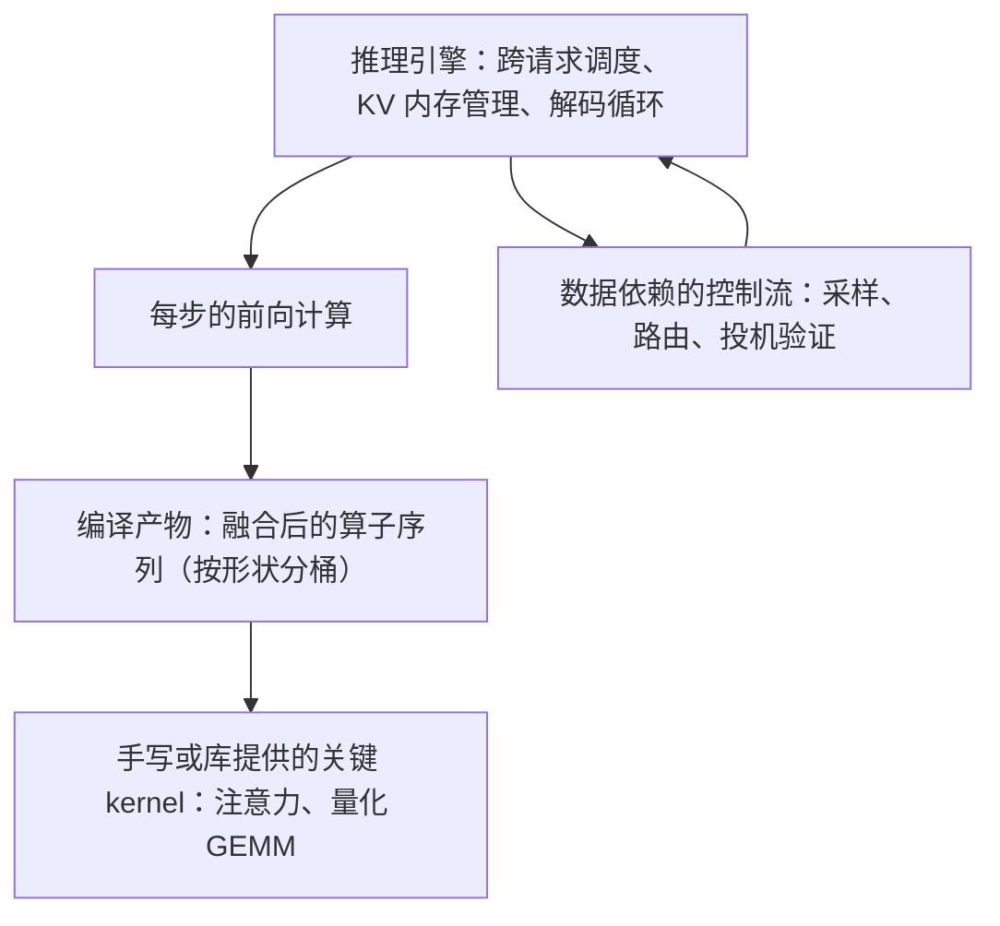
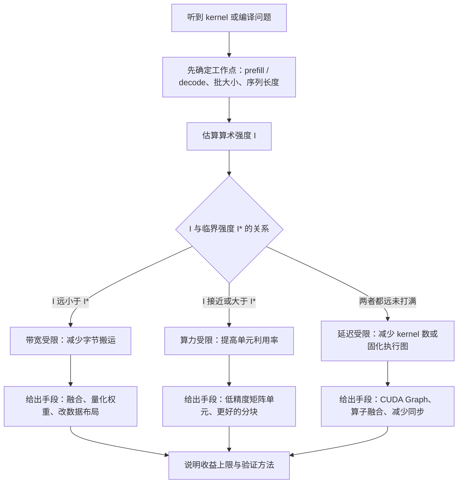

# Compiler、kernel、量化与 runtime 题组（Q045–Q058）

> 位置：[InferenceAtlas](../../INDEX.md) > [模块 17](README.md) > 当前文档
> 信息截至：2026-07-29 ｜ 最后核验：2026-07-29 ｜ 内容版本：v0.1
> 时效性等级：低
> 相关主题：[模块 04](../04_compilers_runtimes_and_kernels/)｜[第三组题](03_serving_scheduling_and_slo_questions.md)｜`05_distributed_and_moe_questions.md`

## 本章导读

这一组 14 道题考的是**执行层**：编译器、kernel、量化与运行时。它与前三组题的区别在于**答案更容易被验证**——「kernel 融合能省多少」这个问题有一个确定的读写次数模型，「量化到 INT8 后为什么大 batch 才有收益」有一个确定的 roofline 论证。**因此这一组题上含糊其辞的代价最高**。

这组题的主线是一个反复出现的判断：**当前这个 kernel 受什么限制**。算力受限、带宽受限、还是延迟受限（kernel 启动与同步开销）——三者的优化手段完全不同，而**用错手段是最常见的失败模式**。把一个带宽受限的 decode kernel 拿去优化 FLOPs 利用率，或者给一个已经被 kernel 启动开销支配的小算子做算法优化，都是白做功。

第二条主线是**量化的三个独立维度**：权重、激活、KV cache。很多候选人把「量化」当成一件事，但这三者的收益来源、精度风险与适用工作点各不相同——**能把三者分开讨论，是这一组题最容易拿分的地方**。

本章按「软件栈与编译 → kernel 与融合 → 量化 → 运行时开销与排查」的顺序组织。

## 学习目标

读完本章后，读者应能够：

1. 判断一个 kernel 是算力受限、带宽受限还是延迟受限，并给出对应的优化手段
2. 用读写次数模型量化 kernel 融合的收益上限，并说明它何时不成立
3. 解释 FlashAttention 的收益来源，并说明它为什么不是「减少了 FLOPs」
4. 把量化拆成权重、激活、KV 三个维度，分别说明收益、风险与适用工作点
5. 在精度回退时给出分层定位流程，而不是笼统地说「量化掉点」
6. 说明动态 shape 与图编译、CUDA Graph 之间的根本矛盾及缓解手段

## 核心结论

- **decode 阶段几乎总是带宽受限**，因此这一阶段的优化目标是减少字节搬运，而不是提高 FLOPs 利用率。
- **kernel 融合的收益上限由「省掉了几次全张量读写」决定**，与算术运算量基本无关；因此它在带宽受限时收益大，在算力受限时收益接近零。
- **FlashAttention 的 FLOPs 与朴素实现同阶**，它的收益来自不物化 $S \times S$ 的注意力矩阵，把 HBM 访问从 $O(S^2)$ 降到 $O(S)$ 量级。
- **权重量化在小 batch 收益最大，激活量化在大 batch 才有意义**——因为前者省的是带宽，后者省的是算力，而两者的稀缺程度随 batch 变化。
- **激活比权重更难量化**：权重是静态的、可离线逐通道校准的，激活是动态的、且存在少量幅值远超其余的通道。
- **动态 shape 是图编译与 CUDA Graph 的天敌**：两者都依赖形状固定，而推理服务的批大小与序列长度每步都在变；实用解法是分桶而不是放弃。

## 1. 问题定义、系统边界与工作负载

本章覆盖 [模块 04](../04_compilers_runtimes_and_kernels/) 的全部内容，并在 roofline 与算术强度上依赖 [模块 01 第 4–5 章](../01_foundations_and_metrics/04_roofline_and_performance_modeling.md)，在 KV 量化上延伸到 [模块 02 第 8 章](../02_transformer_and_kv_cache/08_kv_cache_compression_quantization_and_eviction.md)。

**答题的通用起点**是先确定**工作点**：prefill 还是 decode、批大小多少、序列多长。执行层的几乎所有结论都随工作点翻转——同一个优化在 prefill 有效在 decode 无效，在大 batch 有效在小 batch 无效。**不问工作点就给结论，是这一组题最典型的失分方式**。

本章不含任何需要外部核验的框架版本、编译选项或实测加速比；题目中出现的参数均为题面给定的假设值，用于演示推导过程。

### 本章题目一览

| 编号 | 题目 | 难度 | 形式 |
|---|---|---|---|
| Q045 | 怎么判断一个算子是算力受限还是带宽受限 | 中等 | 概念 |
| Q046 | 算子融合能省多少，上限从哪来 | 中等 | 计算 |
| Q047 | FlashAttention 为什么快 | 中等 | 概念 |
| Q048 | CUDA Graph 解决什么问题，什么时候用不上 | 中等 | 概念 |
| Q049 | 在推理服务里引入图编译要注意什么 | 高 | 系统设计 |
| Q050 | 量化的三个维度与各自的收益来源 | 中等 | 概念 |
| Q051 | 量化误差从哪来，粒度怎么选 | 高 | 概念 |
| Q052 | 为什么激活比权重更难量化 | 高 | 概念 |
| Q053 | 量化后精度掉了怎么定位 | 高 | 排查 |
| Q054 | 怎么为一个服务选量化方案 | 高 | 系统设计 |
| Q055 | 一个 kernel 慢了怎么用 profile 定位 | 高 | 排查 |
| Q056 | 为什么 LLM 推理很难被完全编译 | 高 | 概念 |
| Q057 | 动态 shape 怎么和静态优化共存 | 高 | 系统设计 |
| Q058 | 分页 KV 的注意力 kernel 难在哪 | 专家 | 系统设计 |

## 2. 原理、数学与性能模型

这一组题反复用到五个模型：

**（一）roofline 与临界算术强度**。设备的算力与带宽给出一个临界算术强度

$$
I^{*} = \frac{\text{FLOPS}}{\text{BW}}
$$

算子的算术强度 $I < I^{*}$ 时带宽受限，$I > I^{*}$ 时算力受限。**decode 阶段的 GEMM 退化为 GEMV，算术强度约等于批大小**，因此除极大批外一律落在带宽受限侧。

**（二）kernel 融合的收益模型**。若一串算子在未融合时对同一张量做 $n$ 次全量读写、融合后降到 $m$ 次，则带宽受限下的理论加速比为

$$
\text{speedup} \approx \frac{n}{m}
$$

**注意分子分母都是「读写次数」，不含任何算术运算量**。这解释了为什么融合逐元素算子（读写多、计算少）收益显著，而把逐元素算子融进一个已经算力受限的大 GEMM 收益很小。

**（三）注意力的访存量**。朴素注意力物化 $S \times S$ 的分数矩阵，写出再读回，HBM 流量随 $S^2$ 增长；分块 + online softmax 的实现只在片上保留分块中间量，HBM 流量降到与 $S \cdot d$ 同阶。**两者的 FLOPs 相同**——收益完全来自访存。

**（四）量化的两种收益**。设权重位宽 $b_w$、激活位宽 $b_a$：

- **权重量化省带宽**：每步读权重的字节数按 $b_w$ 等比下降，在 decode（带宽受限）直接转化为加速；
- **激活量化省算力**：只有当矩阵乘法本身用低精度单元执行时才有收益，而这在 prefill 或大 batch decode（算力受限）才是瓶颈。

由此得到一个判断规则：**看你缺的是带宽还是算力**。临界批大小可由 $I^{*}$ 与位宽估计（推导见 [模块 01 第 5 章](../01_foundations_and_metrics/05_memory_bandwidth_and_arithmetic_intensity.md)）。

**（五）运行时开销模型**。一步 decode 由数百到上千个 kernel 组成，每个 kernel 有固定的启动与同步开销 $\epsilon$。总开销为

$$
T_{\text{overhead}} \approx N_{\text{kernel}} \cdot \epsilon
$$

**当单步计算时间与 $T_{\text{overhead}}$ 同量级时，设备就出现空闲间隙**。这是 CUDA Graph（把整步固化为一次提交）与算子融合（减少 $N_{\text{kernel}}$）两条路线共同针对的问题。

## 3. 实现机制与系统设计

以下为本章题库正文。每题的「推荐回答」是**完整答案**，可在 2–5 分钟内口头讲完。

### Q045：怎么判断一个算子是算力受限还是带宽受限

**难度**：中等　**形式**：概念　**目标岗位**：Inference / ML Systems / Performance

**考察点**：检验候选人是否掌握 roofline 的实际用法，以及是否知道存在第三类瓶颈。

**题目**：给定一个算子，你如何判断它是算力受限、带宽受限还是延迟受限？请说明每一类的判据与对应的优化方向。

#### 推荐回答

**结论**：判据是**算子的算术强度与设备的临界算术强度的比较**，再加上第三个必须单独检查的情况——延迟受限。

**第一步，算算术强度**。算术强度是算子的浮点运算数除以它必须从 HBM 读写的字节数：

$$
I = \frac{\text{FLOPs}}{\text{Bytes}}
$$

设备的临界算术强度是 $I^{*} = \text{FLOPS} / \text{BW}$。**$I < I^{*}$ 则带宽受限，$I > I^{*}$ 则算力受限**。

**第二步，代入具体工作点**。以 LLM 的线性层为例，权重矩阵有 $N$ 个元素、位宽 $b_w$ 字节，批中共 $B$ 个 token 参与这一步：

- FLOPs 约为 $2 N B$；
- 权重读取字节约为 $N b_w$（激活的读写量在 $B$ 不大时可忽略）。

于是 $I \approx 2B / b_w$。**算术强度基本只由批大小和权重位宽决定，与模型大小无关**。这给出临界批大小 $B^{*} \approx I^{*} b_w / 2$：批小于它就是带宽受限。

**这个结论解释了 prefill 与 decode 的根本差异**。prefill 时一次前向里参与的 token 数是整个 prompt 长度，$B$ 很大，落在算力受限侧；decode 时每个请求每步只有 1 个 token，$B$ 等于批中的请求数，除极大批外一律落在带宽受限侧。

**第三步，检查是否延迟受限**。前两类都假设设备在满负荷工作。但 decode 单步的每个 kernel 都很小，而每个 kernel 有固定的启动与同步开销。如果一步有 $N_{\text{kernel}}$ 个 kernel、每个开销 $\epsilon$，则 $N_{\text{kernel}} \cdot \epsilon$ 可能与单步计算时间同量级。**此时算力利用率和带宽利用率都很低，两个 roofline 判据都会给出「没打满」的错误暗示**。判据是看 profile 上相邻 kernel 之间是否存在系统性的空隙。

**三类的优化方向完全不同**：

| 瓶颈 | 判据 | 优化方向 |
|---|---|---|
| 算力受限 | $I > I^{*}$，实测 FLOPS 接近峰值 | 低精度矩阵单元、更好的分块与流水 |
| 带宽受限 | $I < I^{*}$，实测带宽接近峰值 | 算子融合、权重量化、改数据布局 |
| 延迟受限 | 两者都远未打满，kernel 间有空隙 | 减少 kernel 数、固化执行图、减少同步 |

**最后一句最重要**：GPU 利用率这个指标对这三类的区分毫无帮助，它只表示「当前有 kernel 在执行」，在延迟受限时也可以接近 100%。**必须看实测 FLOPS 与实测带宽这两个绝对量**。

#### 强答案必须覆盖

- 算术强度定义与临界算术强度 $I^{*} = \text{FLOPS}/\text{BW}$
- 线性层算术强度约为 $2B/b_w$，只由批大小与位宽决定
- 由此得出 prefill 算力受限、decode 带宽受限
- 必须补上第三类：延迟受限（kernel 启动与同步开销）
- 三类的优化方向不同，用错手段是白做功
- GPU 利用率无法区分三类，须看实测 FLOPS 与带宽

#### 常见错误

- 只做算力/带宽二分，遗漏延迟受限
- 用 GPU 利用率判断瓶颈类型
- 不问工作点（prefill/decode、批大小）就给结论
- 认为算术强度随模型规模变化

#### 可能追问

1. 批大小从 1 增长到 512，这个算子的瓶颈会在什么位置翻转？
2. 如果权重量化到 4 位，临界批大小怎么变？
3. 怎么在 profile 上区分带宽受限与延迟受限？
4. 注意力算子的算术强度和线性层有什么不同？

#### 关联阅读

- [roofline 与性能建模](../01_foundations_and_metrics/04_roofline_and_performance_modeling.md)
- [内存带宽与算术强度](../01_foundations_and_metrics/05_memory_bandwidth_and_arithmetic_intensity.md)
- [prefill 与 decode](../02_transformer_and_kv_cache/02_prefill_vs_decode.md)

### Q046：算子融合能省多少，上限从哪来

**难度**：中等　**形式**：计算　**目标岗位**：Inference / ML Systems / Performance

**考察点**：检验候选人是否用读写次数而不是「减少了计算」来解释融合，以及是否会算整体上限。

**题目**：一串算子（例如 LayerNorm 后接残差加与激活函数）融合成一个 kernel 能带来多少收益？请给出收益上限的估算方法，并说明它什么时候不成立。

#### 推荐回答

**结论**：融合的收益上限由**省掉了几次全张量的 HBM 读写**决定，与算术运算量基本无关；并且必须再乘上这串算子在单步时间中的占比，才是对整体的上限。

**为什么是读写次数**。逐元素算子（LayerNorm、残差加、激活、缩放）的共同特征是**算术运算量与元素数同阶，而访存量也与元素数同阶**，所以它们的算术强度是一个很小的常数，远低于临界算术强度，一律带宽受限。带宽受限意味着时间正比于搬运的字节数，于是：

$$
\text{speedup} \approx \frac{n_{\text{unfused}}}{n_{\text{fused}}}
$$

其中 $n$ 是对全量张量的读写次数。**分子分母都只数读写，不数乘加**。

**举例算一遍**。设张量有 $E$ 个元素、每元素 $b$ 字节。未融合时三个算子各自读入写出：LayerNorm 读 1 写 1、残差加读 2 写 1、激活读 1 写 1，合计约 8 次全张量访问（残差的第二个输入也要读）。融合后一次读入、片上完成全部计算、一次写出，加上残差输入共约 3 次。**上限约 $8/3 \approx 2.7$ 倍**。

**但这是对这一串算子的上限，不是对整体的上限**。设它占单步时间的比例为 $f$，则整体加速上限为

$$
\frac{1}{(1-f) + f \cdot n_{\text{fused}}/n_{\text{unfused}}}
$$

取 $f = 0.15$、比值 $3/8$ 时，整体上限约 $1/(0.85 + 0.056) \approx 1.10$ 倍。**能算出这一步，说明你知道这项优化值不值得做**。这也是 Amdahl 定律在 kernel 优化上的直接应用。

**三种情况下融合收益显著缩水**：

**（一）目标算子已经算力受限**。把逐元素算子融进一个大 GEMM（prefill 场景）时，GEMM 的时间由算力决定，多读写一次张量的代价被计算掩盖，融合收益接近零。

**（二）片上容量不足**。融合要求中间结果留在片上。如果张量太大装不下，编译器只能分块处理，**而分块会引入重复读取**（例如残差输入被多次读），部分抵消收益。

**（三）融合破坏了访存模式**。两个算子各自的最优数据布局可能不同，融合后必须统一，可能导致其中一个访存不连续。**此时有效带宽下降，可能反而变慢**。

**验证方法**：融合前后分别测该段的实测带宽（搬运字节数 ÷ 时间）。如果融合后实测带宽持平而字节数减少，说明收益如预期兑现；如果实测带宽下降了，就是撞上了第三种情况。

#### 强答案必须覆盖

- 融合收益由全张量读写次数比决定，与算术量无关
- 给出 $n_{\text{unfused}}/n_{\text{fused}}$ 的具体数法（含残差的额外读）
- 必须再用 Amdahl 折算成对整体的上限
- 算力受限时融合收益接近零
- 片上容量不足导致分块与重复读取
- 融合可能破坏访存连续性而反向劣化
- 验证方法是比较融合前后的实测带宽

#### 常见错误

- 说融合「减少了计算量」
- 只给这串算子的加速比，不折算到整体
- 认为融合总是有正收益
- 忽略残差等多输入算子的额外读取次数

#### 可能追问

1. 如果这串算子在 prefill 阶段，结论会怎么变？
2. 融合后实测带宽反而下降了，可能是什么原因？
3. 编译器自动融合和手写融合 kernel 的差别在哪？
4. 为什么注意力的融合比逐元素算子的融合难得多？

#### 关联阅读

- [算子融合与优化](../04_compilers_runtimes_and_kernels/07_kernel_fusion_and_operator_optimization.md)
- [内存带宽与算术强度](../01_foundations_and_metrics/05_memory_bandwidth_and_arithmetic_intensity.md)

### Q047：FlashAttention 为什么快

**难度**：中等　**形式**：概念　**目标岗位**：Inference / ML Systems / Performance

**考察点**：检验候选人能否区分 FLOPs 与访存，这是执行层最基础也最常被答错的区分。

**题目**：FlashAttention 相比朴素注意力实现快在哪里？它减少了计算量吗？请说明它的收益来源和适用边界。

#### 推荐回答

**结论**：**它没有减少计算量**。FlashAttention 的 FLOPs 与朴素实现同阶，收益完全来自**不物化 $S \times S$ 的注意力分数矩阵**，把 HBM 流量从随序列长度平方增长降到线性量级。

**朴素实现的访存问题**。朴素注意力分三步：算分数矩阵 $QK^\top$ 并写回 HBM、读回做 softmax 再写回、读回与 $V$ 相乘。分数矩阵有 $S^2$ 个元素（每个注意力头），**它被写出和读回至少两轮**，于是 HBM 流量随 $S^2$ 增长。而 $Q$、$K$、$V$ 本身只有 $S \cdot d$ 个元素。**序列越长，时间就越被这个中间矩阵的搬运支配**。

**分块 + 在线 softmax**。FlashAttention 把 $Q$ 与 $K/V$ 都切块，在片上计算一个小块的分数、立即用它更新输出累加器，然后丢弃这个小块。难点在于 softmax 需要全行的归一化因子，而分块时只能看到部分。解法是**在线 softmax**：维护当前见过的最大值与指数和，遇到更大的最大值时按比例修正已累积的输出与分母。**这是精确计算，不是近似**——最终结果与朴素实现在数值误差内一致。

由此 HBM 流量降到与 $Q$、$K$、$V$、$O$ 同阶，即 $O(S d)$ 量级（严格地说还有一个与分块大小相关的因子，因为 $K/V$ 会被不同 $Q$ 块重复读）。**关键是分数矩阵再也不落地**。

**顺带得到的第二个收益是显存容量**。不物化 $S \times S$ 意味着峰值显存不再随序列长度平方增长，这是长上下文能跑通的前提之一。**「跑得更快」和「跑得下」是两个独立收益**，答题时值得分开说。

**适用边界，三点**：

**（一）它优化的是 prefill 而不是 decode**。decode 时每步只有 1 个 query token，不存在 $S \times S$ 的分数矩阵，只有 $1 \times S$ 的一行。这一阶段的瓶颈是**读取整个 KV cache 的带宽**，与分块无关。**decode 需要的是另一类 kernel 优化**（KV 布局、分页访问、KV 量化）。

**（二）收益随序列长度增长**。短序列时分数矩阵本来就不大，分块带来的额外索引与修正逻辑可能吃掉收益。**收益是 $S$ 的增函数**。

**（三）它对注意力变体有结构要求**。在线 softmax 依赖「可增量合并」的归约结构；带复杂掩码、可学习偏置或非标准归一化的注意力变体需要单独适配，不是自动获得的。

**一句话总结**：这是一个**访存优化**，属于「同样的数学、更少的搬运」这一类，和算子融合、权重量化是同一族。**把它说成计算优化是这一组题最典型的错误答案**。

#### 强答案必须覆盖

- 明确指出 FLOPs 同阶，没有减少计算量
- 朴素实现的 HBM 流量随 $S^2$ 增长，源于物化分数矩阵
- 分块 + 在线 softmax 是精确算法而非近似
- 在线 softmax 的机制：维护最大值与指数和并按比例修正
- 第二个独立收益是峰值显存不再平方增长
- 适用边界：优化 prefill 而非 decode；收益随 $S$ 增长；对注意力变体有结构要求
- 归类为访存优化，与融合、权重量化同族

#### 常见错误

- 说它「减少了计算量」或「降低了复杂度」
- 认为它是近似算法
- 认为它同样加速 decode 阶段
- 只讲速度不讲显存，或反之

#### 可能追问

1. decode 阶段的注意力 kernel 应该怎么优化？
2. 在线 softmax 的数值稳定性是怎么保证的？
3. $K/V$ 块被重复读取，这部分开销怎么估？
4. 如果注意力带一个可学习的相对位置偏置，还能用同样的分块吗？

#### 关联阅读

- [FlashAttention 与省内存注意力](../04_compilers_runtimes_and_kernels/08_flashattention_and_memory_efficient_attention.md)
- [推理时的注意力复杂度](../02_transformer_and_kv_cache/03_attention_complexity_during_inference.md)
- [长上下文推理](../02_transformer_and_kv_cache/07_long_context_inference.md)

### Q048：CUDA Graph 解决什么问题，什么时候用不上

**难度**：中等　**形式**：概念　**目标岗位**：Inference / ML Systems / Performance

**考察点**：检验候选人是否理解延迟受限这一类瓶颈，以及是否知道固化对形状稳定性的硬要求。

**题目**：执行图固化（如 CUDA Graph）解决的是什么问题？它和算子融合有什么区别？在什么情况下它带不来收益甚至有害？

#### 推荐回答

**结论**：它解决的是**逐 kernel 提交开销**——把一整步的上千次 kernel 提交压缩成一次图提交。**它不改变每个 kernel 做什么，只改变它们是怎么被下发的**。

**问题从哪来**。一步 decode 要跑完所有层，每层包含多个矩阵乘、注意力、归一化、逐元素算子，加起来是数百到上千个 kernel。每个 kernel 都要由主机侧下发，涉及参数打包、队列写入与可能的同步。设单个开销为 $\epsilon$，则

$$
T_{\text{overhead}} \approx N_{\text{kernel}} \cdot \epsilon
$$

**decode 单步的计算时间本身很短**（每个 kernel 处理的数据量小），所以这个开销可能与计算时间同量级。症状是 profile 上相邻 kernel 之间存在系统性空隙，而算力和带宽利用率都很低——**这就是延迟受限**。

**与算子融合的区别**，一句话：

| 手段 | 改变什么 | 减少的量 |
|---|---|---|
| 算子融合 | 合并计算，kernel 变少 | $N_{\text{kernel}}$ |
| 执行图固化 | 不改计算，只改下发方式 | 每个 kernel 的 $\epsilon$ |

**两者正交，可以叠加**。融合把 1000 个 kernel 降到 600 个，固化把这 600 次提交变成 1 次。**把两者说成同一件事是常见错误**。

**代价：形状与地址必须固定**。图在录制时把 kernel 的启动参数——包括张量地址与形状——一起固化了。这带来三个约束：

**（一）批大小变化需要不同的图**。而连续批处理下批大小每步都在变。实用解法是**按批大小分桶**，为若干个固定批大小各录一张图，实际批小于桶容量时用填充补齐。**填充是有成本的**：批大小 3 用容量 8 的图，就有 5 个槽位在做无用计算。

**（二）张量地址必须稳定**。这要求 KV cache 与中间缓冲区用预分配的固定内存池，而不是每步动态申请。**这实际上对内存管理提出了要求**，与分页 KV 管理的兼容需要额外设计（图内引用页表而不是引用具体页地址）。

**（三）图内不能有数据依赖的控制流**。任何「根据本步结果决定下一步做什么」的逻辑都无法固化。**这与投机解码的接受判断、MoE 的动态路由直接冲突**——这类结构需要把图切成多段，或把控制流移到图外。

**三种情况下收益很小或为负**：

1. **prefill 阶段**：单个 kernel 处理的数据量大、执行时间长，提交开销被计算完全掩盖，固化几乎没有收益。
2. **批大小方差很大**：分桶的填充浪费可能超过省下的提交开销。**这时应该先算一下：填充的无效计算比例 vs 提交开销占比**。
3. **形状变化频繁到需要频繁重录**：录图本身有成本，如果命中率低，重录开销会吃掉收益。

**验证方法**：开启前后各抓一次 trace，量相邻 kernel 的间隙总和。如果间隙总和显著下降而单 kernel 时间不变，说明收益如预期兑现。

#### 强答案必须覆盖

- 解决的是逐 kernel 提交开销，属于延迟受限这一类
- 给出 $T_{\text{overhead}} \approx N_{\text{kernel}} \cdot \epsilon$ 与症状（kernel 间空隙）
- 与算子融合正交：一个减 kernel 数，一个减单次提交开销
- 代价一：形状固定，需按批大小分桶并承担填充浪费
- 代价二：张量地址必须稳定，对内存管理提出要求
- 代价三：图内不能有数据依赖的控制流，与投机解码、MoE 路由冲突
- prefill、批方差大、需频繁重录三种情况下收益小或为负
- 验证方法是比较 trace 上的 kernel 间隙总和

#### 常见错误

- 说它「就是把 kernel 融合了」
- 不提形状固定这个硬约束
- 认为它同样能加速 prefill
- 忽略分桶填充的无效计算成本

#### 可能追问

1. 分页 KV 管理下怎么让图内的地址保持稳定？
2. 投机解码有数据依赖的控制流，还能固化吗？怎么切？
3. 怎么选分桶的批大小？桶太多有什么问题？
4. 如果算子融合已经把 kernel 数减半，固化的边际收益怎么变？

#### 关联阅读

- [CUDA Graph 与执行开销](../04_compilers_runtimes_and_kernels/10_cuda_graphs_and_execution_overhead.md)
- [算子融合与优化](../04_compilers_runtimes_and_kernels/07_kernel_fusion_and_operator_optimization.md)
- [PagedAttention 与 KV 内存管理](../03_serving_engines_and_scheduling/03_pagedattention_and_kv_memory_management.md)

### Q049：在推理服务里引入图编译要注意什么

**难度**：高　**形式**：系统设计　**目标岗位**：Inference / ML Systems / Performance

**考察点**：检验候选人是否有把编译技术落到生产服务的经验，尤其是重编译与冷启动这两个实际问题。

**题目**：你的团队想在一个已经上线的推理服务里引入图编译（如 torch.compile 一类的机制）。请说明你会怎么评估收益、以及哪些点最容易出问题。

#### 推荐回答

**结论**：这件事的成败**不在稳态加速比，而在形状稳定性与冷启动**。我会按「先量瓶颈类别、再评估形状空间、最后算冷启动代价」三步评估。

**第一步，确认瓶颈类别决定了收益天花板**。图编译的主要收益是算子融合（减访存）与减少 kernel 数（减提交开销）。**所以它只在带宽受限或延迟受限时有意义**。如果 profile 显示服务已经在大 batch prefill 上算力受限，编译能拿到的收益很有限——先做这个判断能避免几周的无效投入。具体做法是抓一步 decode 的 trace，看三个数：实测带宽利用率、实测算力利用率、kernel 间隙占比。

**第二步，评估形状空间——这是最容易翻车的地方**。编译器要为具体形状生成代码。推理服务里有两个维度在动：

- **批大小**：连续批处理下每步都在变；
- **序列长度**：prefill 时是 prompt 长度，decode 时 KV 长度每步 +1。

如果编译按「见到新形状就重新编译」的策略工作，**上线后会出现持续的重编译风暴**：延迟毛刺、CPU 占满、甚至编译缓存无限增长。这是引入编译最常见的生产事故。

**缓解手段是分桶 + 动态维度标注**：

1. 把批大小归并到少量固定桶（如 1、2、4、8、16、32），不足则填充；
2. 把序列长度标注为动态维度，让编译产物在该维度上通用——**代价是编译器在动态维度上无法做某些优化**，收益低于全静态；
3. 设置编译缓存上限与重编译计数告警，**把重编译当成一个必须监控的指标**。

**第三步，算冷启动代价**。编译发生在首次见到某个形状时。这意味着：

- 新实例启动后的前若干个请求会承担编译时间；
- **扩容期恰好是流量高峰期**，此时新实例反而更慢，可能触发进一步扩容——一个正反馈。

缓解手段是**启动时预热**：按分桶列表跑一遍假请求把所有形状编译完，健康检查在预热完成后才通过。**代价是实例就绪时间变长**，这会直接影响扩容的响应速度，需要与 [模块 03 的扩缩容策略](../03_serving_engines_and_scheduling/10_autoscaling_and_load_balancing.md) 一起权衡。如果编译产物可以持久化并跨实例复用，这个代价能显著降低。

**第四步，正确性验证**。编译会改变算子实现与融合方式，因此**数值结果不会逐位相同**。验证方案：

1. 固定输入下比较 logits 分布的差异（而不是要求逐位一致）；
2. 温度 0 下比较生成序列——**允许在长序列上发生分叉，但要看分叉位置的分布**，如果分叉在前几个 token 就出现，说明差异过大；
3. 在一批固定的评测样本上比较任务指标。

**灰度策略**：先在一个小流量分片上开，同时监控延迟分位数、重编译次数、显存占用（编译可能改变峰值显存）与输出质量指标。**重编译次数是最重要的新增监控项**——它是形状空间估计错误的直接信号。

**一句话总结**：编译的技术风险低，工程风险高。**风险几乎全部集中在「服务的形状空间比你想的大」这一点上**。

#### 强答案必须覆盖

- 先判断瓶颈类别，编译只在带宽受限或延迟受限时有收益
- 形状空间是两维的：批大小与序列长度
- 重编译风暴是最常见的生产事故，需分桶 + 动态维度标注 + 监控
- 冷启动代价与扩容期正反馈，需启动预热并权衡就绪时间
- 数值结果不会逐位一致，验证要用 logits 差异与分叉位置分布
- 灰度时把重编译次数作为核心新增监控项

#### 常见错误

- 只讲稳态加速比，不讲重编译与冷启动
- 假设编译后输出应逐位一致
- 不评估瓶颈类别就直接上编译
- 把序列长度也当成需要分桶的静态维度导致桶数爆炸

#### 可能追问

1. 预热会拖长就绪时间，怎么和扩容策略协调？
2. 编译产物能跨实例复用吗？需要注意什么？
3. 重编译次数的告警阈值怎么定？
4. 如果编译后峰值显存上升导致批大小下降，怎么权衡？

#### 关联阅读

- [torch.compile、Inductor 与 Triton](../04_compilers_runtimes_and_kernels/04_torch_compile_inductor_and_triton.md)
- [图编译器与 IR](../04_compilers_runtimes_and_kernels/02_graph_compilers_and_ir.md)
- [自动扩缩容与负载均衡](../03_serving_engines_and_scheduling/10_autoscaling_and_load_balancing.md)

### Q050：量化的三个维度与各自的收益来源

**难度**：中等　**形式**：概念　**目标岗位**：Inference / ML Systems / Performance

**考察点**：检验候选人是否把权重、激活、KV 三个维度分开，这是量化题最重要的区分点。

**题目**：「把模型量化到 8 位」这句话不够精确。请说明量化有哪几个独立维度，每个维度省的是什么资源，以及分别在什么工作点上有收益。

#### 推荐回答

**结论**：至少有**三个独立维度**——权重、激活、KV cache。三者省的资源不同（带宽、算力、显存容量），**因此有收益的工作点也不同**，不能笼统地说「量化到 8 位」。

**维度一：权重量化，省的是带宽**。

decode 每一步都要把全部权重从 HBM 读一遍。位宽从 $b_1$ 降到 $b_2$，读取字节数按 $b_2/b_1$ 等比下降。**在带宽受限时这直接转化为加速**，理论上限就是位宽比。

但这个收益随批大小衰减。回顾算术强度 $I \approx 2B/b_w$：批越大，权重读取被越多 token 摊薄。**当批大到已经算力受限时，权重量化对速度的贡献接近零**（它仍然省显存容量，从而允许更大的批或更长的上下文）。注意还有一个反向效应：位宽降低会**提高**算术强度，从而把临界批大小 $B^{*} \approx I^{*} b_w / 2$ 往下推——**也就是说量化权重之后，更小的批就进入算力受限区**。

**维度二：激活量化，省的是算力**。

只有当矩阵乘法本身在低精度单元上执行时才有收益，而这要求**两个操作数都是低精度**——所以激活量化是使用低精度矩阵单元的前提。**它的收益出现在算力受限时**：prefill、或大批 decode。

这解释了一个经常被问到的对比：

| 方案 | 省什么 | 有利的工作点 |
|---|---|---|
| 权重低位宽 + 激活高精度 | 带宽、显存 | 小批 decode |
| 权重与激活同为低位宽 | 算力（也省带宽） | prefill、大批 decode |

**「哪个更好」取决于你的工作负载是延迟敏感的小批还是吞吐导向的大批**。

**维度三：KV cache 量化，省的是显存容量与注意力阶段的带宽**。

KV cache 的大小随「批大小 × 序列长度」增长，在长上下文或大批场景下可能超过权重本身。量化它有两个收益：

1. **容量**：同样显存能放更多请求或更长上下文，间接提升吞吐（更大的批）；
2. **带宽**：decode 的注意力阶段要读整个 KV cache，位宽降低直接减少这部分字节。

**KV 量化的风险与权重量化不同**。权重量化的误差是一次性的、静态的；**KV 量化的误差会在生成过程中累积**——早期 token 的 KV 被量化后，所有后续 token 都在读这个有误差的表示。这使得长序列上的敏感度高于短序列。常见的缓解是**保留最近若干个 token 的 KV 为高精度**（详见 [模块 02 第 8 章](../02_transformer_and_kv_cache/08_kv_cache_compression_quantization_and_eviction.md)）。

**还有第四个维度值得一提：量化粒度**。同样是 8 位，per-tensor（整个张量一个缩放因子）与per-channel 或 group-wise（每通道/每组一个）的精度差别很大，而后者的 kernel 实现更复杂、可能引入额外的反量化开销。**位宽和粒度是两个正交的选择**。

**答题模板**：被问到量化时先反问或自行声明「我们说的是权重、激活还是 KV，工作点是小批 decode 还是大批 prefill」，然后按上面的对应关系给结论。**这一步几乎立刻把回答质量提升一档**。

#### 强答案必须覆盖

- 三个独立维度：权重（省带宽）、激活（省算力）、KV（省容量与注意力带宽）
- 权重量化收益随批大小衰减，且会下推临界批大小
- 激活量化是使用低精度矩阵单元的前提，收益在算力受限时
- 两种组合方案的适用工作点对比
- KV 量化的误差会随生成累积，长序列更敏感
- 量化粒度是与位宽正交的第四个选择
- 答题时先声明维度与工作点

#### 常见错误

- 笼统地说「量化到 8 位」不区分维度
- 认为量化在任何工作点都能等比加速
- 忽略 KV 量化误差的累积性
- 把位宽和粒度混为一谈

#### 可能追问

1. 批大小 512 时权重量化还有速度收益吗？为什么？
2. 权重量化后临界批大小怎么变，这意味着什么？
3. KV 量化为什么在长序列上更危险？
4. per-tensor 与 group-wise 的 kernel 开销差别在哪？

#### 关联阅读

- [量化 kernel](../04_compilers_runtimes_and_kernels/09_quantization_kernels.md)
- [KV cache 压缩、量化与驱逐](../02_transformer_and_kv_cache/08_kv_cache_compression_quantization_and_eviction.md)
- [内存带宽与算术强度](../01_foundations_and_metrics/05_memory_bandwidth_and_arithmetic_intensity.md)

### Q051：量化误差从哪来，粒度怎么选

**难度**：高　**形式**：概念　**目标岗位**：Inference / ML Systems / Performance

**考察点**：检验候选人是否理解「一个缩放因子要覆盖多大的动态范围」这个核心矛盾。

**题目**：量化误差的来源是什么？per-tensor、per-channel 与 group-wise 三种粒度在精度和开销上如何权衡？

#### 推荐回答

**结论**：量化误差的根源是**用一个缩放因子去覆盖一组数值的动态范围**。范围内如果存在少数极大值，它们会决定缩放因子，**使得绝大多数数值只用到量化区间的很小一部分，有效位宽被浪费**。粒度的作用就是缩小每个缩放因子覆盖的范围。

**误差的两个来源**。设对一组数值用对称量化，缩放因子由该组的最大绝对值决定：

$$
s = \frac{\max |x|}{2^{b-1} - 1}
$$

**（一）舍入误差**：每个值被舍入到最近的量化格点，误差上界是 $s/2$。**注意这个上界正比于组内最大值**——所以一个离群值会抬高整组所有元素的误差。

**（二）截断误差**：如果为了保护多数值而把缩放因子设小（裁剪离群值），则离群值被截断，产生的误差远大于舍入误差。

**两者是一对权衡**：$s$ 大则截断少、舍入误差大；$s$ 小则反之。**这正是「离群值问题」的本质**——它不是某个值算错了，而是它的存在使得整组的表示精度下降。

**三种粒度**：

| 粒度 | 一个缩放因子覆盖 | 精度 | 开销 |
|---|---|---|---|
| per-tensor | 整个权重张量 | 最差 | 最小：一个标量 |
| per-channel | 一个输出通道（矩阵的一行或一列） | 较好 | 每通道一个标量 |
| group-wise | 通道内连续 $g$ 个元素 | 最好 | 每组一个标量 |

**存储开销的估法**。group-wise 下每 $g$ 个元素多存一个缩放因子。若缩放因子用 $b_s$ 位、权重用 $b_w$ 位，则有效位宽为

$$
b_{\text{eff}} = b_w + \frac{b_s}{g}
$$

**这解释了为什么组大小不能太小**：$g = 32$、$b_s = 16$ 时额外开销是 0.5 位/元素，对 4 位权重意味着有效位宽 4.5 位，即多了 12.5%；$g = 8$ 时额外 2 位，有效位宽 6 位，**4 位量化的意义已被大幅削弱**。

**计算开销的估法**。反量化要为每组做一次乘法（和可能的加法）。组越小，反量化的算术与查表次数越多。**在带宽受限时这部分开销通常可被掩盖**（有空闲算力），但在算力受限时它是真实成本。这又一次说明结论依赖工作点。

**为什么 per-channel 是权重量化的常见默认**。矩阵乘法中，输出的每个元素是「一行权重 · 一列激活」。**如果缩放因子按输出通道组织，它可以被提到内积之外**——即先用整数累加，最后乘一次缩放因子。换成按输入维度分组（group-wise 沿归约方向）就做不到这一点，必须在归约中途插入反量化，实现更复杂。**「哪个维度可以把缩放因子提出内积」是判断实现难度的关键**。

**一个补充维度：对称与非对称**。对称量化假设零点在 0，非对称量化额外存一个零点偏移，能更好地拟合单侧分布（如激活函数后的输出）。**代价是矩阵乘法里多出交叉项**，需要额外的修正计算。

**选择框架**：权重是静态的，可以离线花任意时间校准，所以粒度尽量细（受有效位宽开销约束）；激活是动态的，细粒度意味着运行时统计，开销直接进入关键路径——**这是下一题（激活为什么更难量化）的起点**。

#### 强答案必须覆盖

- 误差根源是一个缩放因子覆盖的动态范围
- 舍入误差上界正比于组内最大值，故离群值抬高整组误差
- 舍入与截断是一对权衡
- 三种粒度的精度与开销对比表
- 有效位宽公式 $b_w + b_s/g$，解释组大小下界
- 反量化的算术开销在算力受限时是真实成本
- per-channel 的实现优势：缩放因子可提到内积之外
- 对称与非对称的区别及交叉项代价

#### 常见错误

- 只说「粒度越细越好」不算有效位宽开销
- 认为离群值只影响它自己的精度
- 不区分沿输出通道与沿归约方向分组的实现难度差异
- 忽略反量化的计算开销

#### 可能追问

1. group-wise 沿归约方向分组时，kernel 要怎么处理？
2. 组大小 128 和 32 在有效位宽上差多少？
3. 非对称量化的交叉项具体是什么？开销多大？
4. 为什么权重可以用比激活更细的粒度？

#### 关联阅读

- [量化 kernel](../04_compilers_runtimes_and_kernels/09_quantization_kernels.md)

### Q052：为什么激活比权重更难量化

**难度**：高　**形式**：概念　**目标岗位**：Inference / ML Systems / Performance

**考察点**：检验候选人是否理解静态与动态的区别，以及是否知道激活离群值的结构性特点。

**题目**：在实践中激活量化通常比权重量化更困难。请解释原因，并说明常见的缓解思路。

#### 推荐回答

**结论**：三个原因——**激活是动态的**（无法离线穷尽校准）、**激活存在结构性离群通道**（少数通道的幅值远高于其余）、**激活的量化开销在关键路径上**（统计与量化都要在推理时做）。

**原因一：静态 vs 动态**。

权重在部署后不再变化。这意味着可以：离线遍历全部权重求精确的动态范围、用任意复杂的方法搜索最优缩放因子、甚至做误差补偿式的逐层重构——**成本全部在离线，不进关键路径**。

激活取决于输入。同一个模型在不同 prompt 上，某一层的激活范围可以差很多倍。于是只有两条路：

- **静态量化**：用一批校准数据统计范围，固定下来。**风险是线上分布偏离校准集**——出现超出范围的激活时被截断，而截断误差远大于舍入误差；
- **动态量化**：每次推理实时统计当前激活的范围。**精度更稳，但要在关键路径上做一次归约**（求最大绝对值），这是一次额外的全张量读取，在带宽受限时代价直接可见。

**原因二：结构性离群通道**。

Transformer 的激活里存在这样的现象：**少数特征维度上的幅值系统性地远高于其余维度**，并且这些维度在不同输入之间相对稳定。这比「随机出现的离群值」更棘手也更可利用：

- 棘手在于，per-tensor 量化下这些通道决定了缩放因子，**其余绝大多数通道被压缩到很少几个量化格点**，有效位宽严重浪费；
- 可利用在于，既然它们的位置相对稳定，就可以被单独处理。

**注意方向问题**：per-channel 对权重容易（缩放因子可提到内积外），但**激活的「通道」方向恰好是矩阵乘法的归约方向**，沿它分组的缩放因子无法提出内积。**这是激活难以简单地用细粒度解决的结构性原因**——不是没想到，而是实现上与矩阵乘法的数据流冲突。

**原因三：开销在关键路径**。

激活量化需要在推理时完成「统计范围 → 量化 → 参与低精度矩阵乘 → 反量化」。统计和量化各需一次全张量访问。**如果这一层本来带宽受限，这些额外访存会吃掉一部分收益**。所以激活量化的净收益需要实测，不能只按位宽比推算。

**四类缓解思路**：

**（一）把难度从激活转移到权重**。利用矩阵乘法的等价变换：给激活的某一维除以一个系数、给权重的对应维乘上同一系数，数学结果不变，但**离群通道的幅值被搬到权重上**——而权重是静态的、更容易量化的。这类做法的核心是**选择这组系数以平衡两侧的量化难度**。

**（二）混合精度保留离群通道**。把少数离群通道保持高精度、其余低精度。**代价是 kernel 要处理两种精度的混合数据流**，实现复杂度上升，且如果离群通道位置需要动态判断，还要付出判断开销。

**（三）细化粒度到「每 token」**。沿 token 维度（而非特征维度）分组，**这个方向不是归约方向，缩放因子可以提出内积**。这是激活量化中实现代价较低的细化方向。

**（四）选择更宽的动态范围格式**。浮点格式在相同位宽下比整数格式有更大的动态范围（牺牲了均匀精度），**对存在离群值的分布更友好**。这也是低位浮点格式在激活量化上受关注的原因。

**答题要点**：区分静态/动态、指出离群通道的方向与归约方向重合、并说明开销在关键路径。**只答「激活范围变化大」是不完整的**。

#### 强答案必须覆盖

- 三个原因：动态性、结构性离群通道、开销在关键路径
- 静态量化的截断风险 vs 动态量化的归约开销
- 离群通道相对稳定，既棘手也可利用
- 关键结构原因：激活的通道方向就是矩阵乘的归约方向，缩放因子无法提出内积
- 缓解一：等价变换把难度转移到权重
- 缓解二：混合精度保留离群通道及其 kernel 复杂度代价
- 缓解三：沿 token 维度分组（非归约方向）
- 缓解四：用动态范围更大的低位浮点格式

#### 常见错误

- 只说「激活范围变化大」不提离群通道的结构性
- 不解释为什么激活不能简单用 per-channel
- 忽略动态量化的运行时归约开销
- 认为混合精度是免费的

#### 可能追问

1. 等价变换的系数怎么选？有什么约束？
2. 沿 token 维度分组为什么实现更容易？
3. 低位浮点和低位整数在离群值上的差别怎么量化？
4. 静态量化上线后怎么监控分布漂移？

#### 关联阅读

- [量化 kernel](../04_compilers_runtimes_and_kernels/09_quantization_kernels.md)

### Q053：量化后精度掉了怎么定位

**难度**：高　**形式**：排查　**目标岗位**：Inference / ML Systems / Performance

**考察点**：检验候选人是否有系统的分层定位方法，以及是否知道「回退到高位宽」不是排查。

**题目**：你把一个模型量化后上线，发现某类任务的准确率明显下降。请给出定位流程，而不是直接回退到高位宽。

#### 推荐回答

**结论**：按**「先确认是量化引起 → 再定位到层或模块 → 再定位到维度与粒度 → 最后做局部提升」**四步走。**直接回退高位宽会丢掉全部收益，而通常只有少数层是真正的问题源**。

**第零步，确认基线可比**。量化前后必须在**完全相同的解码配置**下比较：同样的温度、同样的采样参数、同样的评测集与 prompt 模板。**这一步经常被跳过，导致把配置差异误判成量化损失**。如果比较用的是采样解码，还要固定随机种子并跑多次取分布——单次结果的差异可能完全来自采样噪声。

**第一步，确认量化是原因**。把量化配置逐维度关掉：

| 配置 | 若此配置恢复精度，则问题在 |
|---|---|
| 仅权重量化 | 激活或 KV 量化 |
| 仅激活量化 | 权重或 KV 量化 |
| KV 恢复高精度 | KV 量化 |
| 全部关闭仍不恢复 | **不是量化问题**——去查部署链路 |

**最后一行最重要**。精度问题也可能来自 tokenizer 版本、prompt 模板、停止条件或权重加载错误。**先排除这些再谈量化，能省下大量时间**。

**第二步，定位到层或模块**。方法是**逐层误差分析**：用同一批输入分别跑高精度模型和量化模型，逐层记录激活的差异（如相对误差的分位数）。看两件事：

1. **哪一层的相对误差最先显著上升**——这是误差注入点；
2. **误差是否沿层数放大**——如果某层之后误差迅速扩大，说明该层对输入扰动敏感（放大器），即使它自身量化误差不大也应保护。

**注意区分「误差大」和「误差重要」**。某些层的激活误差大但对最终输出影响小，某些层误差小却直接决定输出。更可靠的做法是**逐层敏感度扫描**：一次只让一层保持高精度、其余量化，看任务指标恢复多少。**这个信号比逐层误差更直接**，代价是需要跑很多次评测。

**第三步，定位到维度与粒度**。锁定敏感层后，问三个问题：

- **是权重还是激活**：分别恢复其一，看哪个起效；
- **是粒度不够还是位宽不够**：先把粒度从 per-tensor 细化到 per-channel 或更小的组，**如果细化粒度就恢复了，说明问题是离群值而不是位宽**；
- **是不是校准集不匹配**：如果用的是静态激活量化，检查线上输入是否触发了超出校准范围的激活（可以统计截断率）。**截断率是一个应该常态监控的指标**。

**第四步，局部提升而不是全局回退**。按代价从低到高：

1. 细化敏感层的量化粒度（几乎不增加位宽，开销小）；
2. 对敏感层用等价变换转移离群值的难度；
3. 把少数敏感层提到更高位宽（**注意混合位宽会让 kernel 与内存布局复杂化**）；
4. 换用动态范围更大的数值格式；
5. 最后才考虑整体回退。

**第五步，防回归**。把这次发现的敏感层与任务指标写进量化的验收流程，并加上两个常态监控项：**激活截断率**与**关键任务指标的日常抽测**。**量化的风险是「在某类输入上失效」，而这类输入不一定出现在你的评测集里**——所以线上监控不能省。

**一句话总结**：这个问题考的不是量化知识，而是**排查方法**。「二分定位 + 一次只改一个变量 + 先排除非量化原因」这套方法适用于任何精度回归。

#### 强答案必须覆盖

- 第零步确认基线可比（解码配置、种子、多次取分布）
- 第一步逐维度关闭以确认是否量化引起，并保留「不是量化问题」这一分支
- 第二步逐层误差分析，区分误差注入点与误差放大层
- 指出「误差大」不等于「误差重要」，敏感度扫描更直接
- 第三步分维度与粒度定位；细化粒度恢复说明是离群值而非位宽
- 截断率应作为常态监控指标
- 第四步按代价从低到高做局部提升，全局回退排最后
- 第五步写入验收流程并加线上监控

#### 常见错误

- 直接回退到高位宽，丢掉全部收益
- 跳过基线可比性检查，把配置差异当成量化损失
- 不考虑精度问题可能根本不来自量化
- 只看逐层误差不做敏感度验证

#### 可能追问

1. 逐层敏感度扫描的评测成本很高，怎么减少？
2. 混合位宽对 kernel 和显存布局有什么实际影响？
3. 截断率的告警阈值怎么定？
4. 如果只有某一类 prompt 上掉点，怎么设计定位实验？

#### 关联阅读

- [量化 kernel](../04_compilers_runtimes_and_kernels/09_quantization_kernels.md)
- [编译器调试与 profiling](../04_compilers_runtimes_and_kernels/11_compiler_debugging_and_profiling.md)

### Q054：怎么为一个服务选量化方案

**难度**：高　**形式**：系统设计　**目标岗位**：Inference / ML Systems / Performance

**考察点**：检验候选人能否把 roofline 判断、精度风险与工程成本组合成一个可执行的决策。

**题目**：给定一个在线服务：延迟敏感、批大小通常较小、上下文中等长度、对输出质量有明确要求。请给出量化方案的选择流程与你的推荐。

#### 推荐回答

**结论**：这个工作点（小批、延迟敏感）**首选权重量化，激活保持较高精度，KV 视上下文长度决定**。理由完全由 roofline 给出，下面是完整推导。

**第一步，判断缺的是什么资源**。小批 decode 的算术强度约 $2B/b_w$，远低于临界算术强度，**带宽受限**。带宽受限意味着：

- **权重量化直接转化为加速**，上限是位宽比；
- **激活量化的收益接近零**——它省的是算力，而算力此刻是富余的。更糟的是，激活量化要在关键路径上做统计与量化，**这些额外访存在带宽受限时是净损失**。

**这一步就排除了「权重激活都量化」这个看起来更激进的方案**。它适合吞吐导向的大批服务，不适合这里。

**第二步，决定权重位宽**。这是收益与风险的权衡：

| 位宽 | 带宽收益（相对 16 位） | 主要风险 |
|---|---|---|
| 8 位 | 约 2 倍 | 风险较低，通常粒度不必很细 |
| 4 位 | 约 4 倍 | 风险明显上升，需要细粒度与校准 |

**注意 4 位的实际收益低于 4 倍**：细粒度分组的缩放因子要额外存储，有效位宽是 $b_w + b_s/g$（组大小 32、缩放因子 16 位时约 4.5 位），**实际带宽收益约 3.6 倍而不是 4 倍**。此外反量化的算术开销在这里可被富余算力掩盖，不构成额外成本。

**决策方法是分档实测**：8 位与 4 位各做一版，在同一批评测集上比较任务指标与延迟。**先跑 8 位建立「量化链路无 bug」的基线，再试 4 位**——这个顺序能把「量化方法问题」和「实现 bug」分开。

**第三步，决定 KV 是否量化**。判据是 KV cache 是否已成为约束：

$$
\text{KV 字节} = 2 \cdot L \cdot H_{kv} \cdot d_h \cdot b_{kv} \cdot S \cdot B
$$

把它与权重字节和可用显存比较。**如果 KV 占比不高（中等上下文、小批常常如此），先不量化 KV**——它的误差有累积性，风险回报比不如权重量化。如果上下文会增长到 KV 主导显存，再引入 KV 量化，并采用**保留最近若干 token 为高精度**的折中。

**第四步，评估工程成本**。三项容易被低估：

1. **kernel 可用性**：所选位宽与粒度组合是否有成熟的 kernel。**没有现成 kernel 的方案，其真实成本是「自己写并维护一个 kernel」**；
2. **量化流程的可重复性**：模型每次更新都要重新量化，这条流水线要能自动跑并自动验收；
3. **回滚能力**：必须能在不重启服务的前提下切回高精度版本。

**推荐方案**：权重 8 位 per-channel 起步（低风险、收益约 2 倍），验证链路无误且质量达标后，评估权重 4 位 group-wise 作为第二档；激活保持高精度；KV 暂不量化，但把 KV 占比纳入监控，当它超过某个水位再启动 KV 量化的评估。

**需要向面试官说明的一点**：上面每一档的**实际加速比和精度损失都必须实测**，因为它们依赖具体模型、具体硬件的 kernel 效率与具体任务的敏感度。**我给的是决策顺序和收益上限的估算方法，不是可以直接引用的数字**。

#### 强答案必须覆盖

- 先用 roofline 判定小批 decode 为带宽受限
- 由此排除激活量化（省算力无用，且额外访存是净损失）
- 权重位宽分档，并指出 4 位的有效位宽因缩放因子高于 4
- 先 8 位建立基线再试 4 位，以分离方法问题与实现 bug
- KV 量化的判据是 KV 是否已主导显存，且误差有累积性
- 工程成本三项：kernel 可用性、量化流程可重复性、回滚能力
- 给出明确推荐并声明所有加速比与精度损失需实测

#### 常见错误

- 不做工作点判断就推荐最激进的方案
- 按位宽比直接报加速比，忽略缩放因子开销与 kernel 效率
- 忽略 kernel 可用性这个真实约束
- 把 KV 量化当成和权重量化同等风险

#### 可能追问

1. 如果这个服务改成吞吐导向的大批离线任务，方案怎么变？
2. KV 占比的监控水位怎么定？
3. 没有现成 kernel 时怎么估自研成本？
4. 怎么做到不重启服务切回高精度？

#### 关联阅读

- [量化 kernel](../04_compilers_runtimes_and_kernels/09_quantization_kernels.md)
- [内存带宽与算术强度](../01_foundations_and_metrics/05_memory_bandwidth_and_arithmetic_intensity.md)
- [KV cache 容量与内存模型](../02_transformer_and_kv_cache/05_kv_cache_capacity_and_memory_models.md)

### Q055：一个 kernel 慢了怎么用 profile 定位

**难度**：高　**形式**：排查　**目标岗位**：Inference / ML Systems / Performance

**考察点**：检验候选人是否真的读过 profile，而不是只知道 profiler 这个词。

**题目**：profile 显示某个 kernel 占了单步时间的很大一部分。请说明你会看哪些指标、按什么顺序判断，以及每种判断对应的修正手段。

#### 推荐回答

**结论**：按**「先算它离屋顶多远 → 再看是哪种资源打满 → 再看是不是根本没打满」**三步判断。**核心是把 profile 上的相对指标换算成绝对的带宽和算力数字**。

**第一步，算两个绝对量**。

对这个 kernel：

- **实测带宽** = 它必须读写的字节数 ÷ 它的执行时间；
- **实测算力** = 它的浮点运算数 ÷ 它的执行时间。

把两者分别与设备标称值相除，得到两个利用率。**必须自己按算法算出字节数与 FLOPs**，而不是只看 profiler 报的百分比——profiler 报的访存量包含了缓存未命中带来的实际流量，**如果实际流量远大于算法所需，本身就是一个发现**（访存模式有问题）。

**第二步，三分诊断**。

| 观察 | 结论 | 修正方向 |
|---|---|---|
| 带宽利用率高、算力低 | 带宽受限 | 减少字节：融合、量化、改布局 |
| 算力利用率高、带宽低 | 算力受限 | 低精度单元、改分块与流水 |
| 两者都低 | 延迟受限或并行度不足 | 见第三步 |
| 实际访存量远超算法所需 | 访存模式问题 | 改数据布局、提高合并访问 |

**最后一行是容易被忽略的一类**。如果算法只需要读 $X$ 字节而实测流量是 $3X$，说明存在重复读取或非合并访问。**这种情况下「减少算法访存量」是白做的，应该先修访存模式**。

**第三步，两者都低时的分诊**。这是最需要经验的一步，四种可能：

**（一）并行度不足**。启动的线程/线程块数量不足以填满设备。典型场景是 decode 时张量很小，切分出的并行工作单元数少于设备的执行单元数。**判据是看启动配置与设备的执行单元数之比**。修正：改并行划分方式（例如沿 KV 长度而不是只沿批和头切分）。

**（二）kernel 太短，启动开销占比高**。判据是单 kernel 执行时间与启动开销同量级。修正：融合相邻 kernel、或固化执行图。

**（三）同步或依赖串行化**。判据是 trace 上 kernel 之间有空隙，或存在显式同步点、主机与设备之间的往返。修正：去掉不必要的同步、把主机侧决策提前、用异步拷贝。

**（四）长尾指令或分支分歧**。判据是同一 kernel 内部执行单元的负载不均。典型场景是变长序列被填充到同一长度，**填充部分的计算是浪费但仍占用执行单元**。修正：变长打包、按长度分组批处理。

**第四步，验证修正**。改完之后**重新算同样的两个绝对量**，确认它按预期方向移动。常见的假成功是「kernel 时间下降了但整步时间没变」——说明时间只是转移到了别处，或者这个 kernel 本来就不在关键路径上。**所以必须同时看单 kernel 时间和端到端单步时间**。

**一个反复出现的提醒**：GPU 利用率在这整个流程里没有位置。它只回答「有没有 kernel 在跑」，**在上面四种「两者都低」的情况里它都可以接近 100%**。如果一个候选人在这道题里提到 GPU 利用率作为判据，面试官会立刻知道他没有实际读过 profile。

#### 强答案必须覆盖

- 第一步把 profile 换算成实测带宽与实测算力两个绝对量
- 自己按算法算字节数与 FLOPs，与 profiler 报的实际流量对比
- 实际流量远超算法所需说明访存模式有问题，应先修布局
- 三分诊断表：带宽受限 / 算力受限 / 都低
- 「都低」的四种分诊：并行度不足、kernel 太短、同步串行化、负载不均
- 变长填充导致的执行单元浪费及其修正
- 验证时同时看单 kernel 时间与端到端单步时间，避免假成功
- 明确指出 GPU 利用率不是判据

#### 常见错误

- 只看 profiler 的百分比不算绝对量
- 把 GPU 利用率当判据
- 「两者都低」时无法进一步分诊
- 只看 kernel 时间下降就宣布优化成功

#### 可能追问

1. decode 阶段并行度不足，具体可以沿哪个维度补？
2. 怎么在 trace 上量化同步带来的空隙？
3. 变长打包的实现代价是什么？
4. 实际访存量是算法所需的 3 倍，可能是哪几种原因？

#### 关联阅读

- [编译器调试与 profiling](../04_compilers_runtimes_and_kernels/11_compiler_debugging_and_profiling.md)
- [roofline 与性能建模](../01_foundations_and_metrics/04_roofline_and_performance_modeling.md)

### Q056：为什么 LLM 推理很难被完全编译

**难度**：高　**形式**：概念　**目标岗位**：Inference / ML Systems / Performance

**考察点**：检验候选人是否理解编译器的抽象层次，以及编译边界为什么落在推理引擎的调度逻辑之外。

**题目**：图编译器通常把模型表示为多层 IR 再逐层下降。请说明这个分层的作用，以及为什么 LLM 推理服务很难被「完整编译成一个图」。

#### 推荐回答

**结论**：分层 IR 的作用是**在不同抽象层次上做不同类型的优化**；而 LLM 推理难以完全编译的根本原因是**服务层的控制流是数据依赖且跨请求的**，这类逻辑不属于「一个张量计算图」能表达的范畴。

**分层 IR 做什么**。典型的三层：

| 层次 | 表示什么 | 在这一层做的优化 |
|---|---|---|
| 高层图 IR | 算子与张量的数据流 | 常量折叠、代数化简、算子替换、布局选择 |
| 循环/调度 IR | 循环嵌套、分块、并行与内存层次 | 分块大小、融合、向量化、流水 |
| 目标代码 | 具体指令 | 寄存器分配、指令调度 |

**分层的价值是「每类优化在它信息最充分的层次上做」**。代数化简需要看到算子语义（高层），分块需要看到内存层次（中层），指令调度需要看到具体硬件（低层）。**把它们混在一层，要么信息不足要么搜索空间爆炸**。

**为什么 LLM 推理难以完全编译，五个原因**：

**（一）批组成每步都在变**。连续批处理下请求逐个加入退出，批大小和每个请求的 KV 长度都在变。**编译产物依赖形状，而这里形状是运行时决定的**。缓解是分桶，但桶之外的形状仍需要动态处理或填充。

**（二）KV cache 是跨步的可变状态**。一个纯函数式的计算图不自然地表达「读写一块持久的、由外部内存管理器分配的、按页组织的缓冲区」。**分页 KV 的间接寻址（页表）把访存地址变成运行时数据**，这限制了编译器做静态访存分析与优化。

**（三）解码循环的终止条件是数据依赖的**。生成何时停止取决于采样出的 token。**这意味着解码循环的迭代次数不能编译期确定**。通常的做法是只编译「一步」，循环留在外面由引擎驱动——**这就是编译边界的实际位置**。

**（四）某些结构本身含数据依赖的分支**。MoE 的专家路由由门控输出决定；投机解码的接受长度由验证结果决定；工具调用要在生成中途跳出去等外部结果。**这些都不是形状问题，而是控制流问题**，编译器只能把它们切成多段图。

**（五）调度决策是跨请求的**。准入、抢占、路由这些决策涉及多个请求的全局状态，**它们在语义上就不属于单个前向计算的范畴**。

**因此现实的分工是**：

**图解读**：
1. **本图展示什么**：编译边界的实际位置。编译器负责「一步前向的张量计算」，引擎负责循环、状态与跨请求决策。
2. **核心瓶颈**：瓶颈在 C 与 D 的分界。**注意力与量化 GEMM 这两类最关键的 kernel 通常不由通用编译器生成**，而是手写或来自专用库——因为它们的最优实现依赖对硬件的深度利用，超出了通用编译器的搜索能力。
3. **图中的 trade-off**：编译边界越往上推（编译更多东西），性能潜力越大但通用性越差；越往下收，越灵活但性能越依赖手写 kernel 的质量。
4. **面试如何引用**：可以说「编译的边界在一步前向；循环、状态和跨请求决策留给引擎——所以引入编译器时我关心的是它能不能容忍我的形状空间，而不是它的峰值加速比」。

**答题要点**：把原因分成**形状问题**（一、二）与**控制流问题**（三、四、五）两类。**形状问题可以用分桶与动态维度缓解，控制流问题只能靠切图**——这个区分比罗列五条原因更有价值。

#### 强答案必须覆盖

- 分层 IR 的价值是每类优化在信息最充分的层次上做，并给出三层与对应优化
- 五个原因：批组成变、KV 是跨步可变状态、解码终止数据依赖、结构含数据依赖分支、调度跨请求
- 把五个原因归为形状问题与控制流问题两类
- 形状问题可分桶缓解，控制流问题只能切图
- 指出编译边界实际落在「一步前向」
- 注意力与量化 GEMM 通常不由通用编译器生成
- 编译边界上移与下收的 trade-off

#### 常见错误

- 只描述 IR 分层，答不出为什么难以完全编译
- 把所有困难都归为「动态 shape」，忽略控制流
- 认为编译器可以生成最优的注意力 kernel
- 不知道编译边界在哪

#### 可能追问

1. 分页 KV 的页表寻址具体怎么影响编译器的优化？
2. MoE 路由的切图会带来多少额外开销？
3. 为什么通用编译器难以生成最优的注意力 kernel？
4. 如果把解码循环也编译进去，需要什么条件？

#### 关联阅读

- [图编译器与 IR](../04_compilers_runtimes_and_kernels/02_graph_compilers_and_ir.md)
- [推理软件栈总览](../04_compilers_runtimes_and_kernels/01_inference_software_stack.md)

### Q057：动态 shape 怎么和静态优化共存

**难度**：高　**形式**：系统设计　**目标岗位**：Inference / ML Systems / Performance

**考察点**：检验候选人能否把「分桶」这个想法完整地落成一个带成本模型的设计。

**题目**：推理服务的批大小和序列长度都在变，而图编译、执行图固化、自动调优都偏好固定形状。请设计一个在两者之间取平衡的方案。

#### 推荐回答

**结论**：方案是**沿两个维度分别处理**——批大小用**分桶 + 填充**（少量桶，静态优化可用），序列长度用**动态维度或按块对齐**（桶数会爆炸，不适合枚举）。关键是给分桶配一个**成本模型**，而不是凭感觉定桶。

**为什么两个维度要区别对待**。批大小的取值范围有限（1 到最大批），而序列长度的范围很大（几十到上万）。**如果两个维度都枚举，组合数是两者之积，编译时间与产物体积都不可接受**。所以：

| 维度 | 处理方式 | 理由 |
|---|---|---|
| 批大小 | 少量桶 + 填充 | 范围小，填充浪费可控 |
| 序列长度（prefill） | 按块对齐（如对齐到 256 的倍数） | 范围大，但分块 prefill 本来就按块处理 |
| 序列长度（decode 的 KV 长度） | 动态维度或按页粒度对齐 | 每步 +1，枚举不可能 |

**批大小分桶的成本模型**。设桶为 $\{b_1 < b_2 < \dots < b_k\}$，实际批大小 $B$ 落入最小的 $b_i \ge B$，则该步的填充浪费比例为

$$
w(B) = 1 - \frac{B}{b_i}
$$

对批大小的实际分布 $p(B)$ 取期望，得到平均浪费 $\bar{w} = \sum_B p(B) w(B)$。**桶越密 $\bar{w}$ 越小，但编译时间与产物体积随桶数线性增长**。于是设计问题是：**在给定的编译预算（桶数上限）下，选桶位置最小化 $\bar{w}$**。

**举例说明桶位置的影响**。若桶取 $\{1, 2, 4, 8, 16, 32\}$（等比），则任何 $B$ 的浪费上界是 50%（如 $B=9$ 落到 16，浪费 43.75%）；**若批大小分布集中在某个区间，在该区间加密桶比在两端加桶更划算**。所以正确做法是**先测批大小的实际分布，再按分布定桶**——而不是套用等比序列。

**填充的代价不只是算力**。填充的槽位会：

1. 占用计算单元（算力浪费）；
2. **可能占用 KV 显存**（取决于实现是否为填充槽分配 KV）；
3. 参与归约时需要掩码，否则污染结果——**这是正确性问题不是性能问题**。

**第三点是实现中最容易出 bug 的地方**：填充位置必须在注意力掩码、softmax 归一化、以及任何跨 token 的归约里被正确排除。

**序列长度的处理**。两条路：

**（一）标注为动态维度**。让编译器生成对该维度通用的代码。**代价是编译器在该维度上无法做依赖具体长度的优化**（如按长度选择分块大小），性能低于静态特化。

**（二）按块或页粒度对齐**。KV cache 本来按页管理，页大小是天然的对齐粒度；prefill 本来按块处理，块大小也是天然粒度。**利用这些已有的量化边界，可以在不增加桶数的前提下获得部分静态性**。

**运行时策略**。三件事要做对：

1. **桶命中率监控**。如果大量请求落在最大桶之外（需要动态回退），说明桶设计与实际负载不符，应重新测分布；
2. **回退路径必须存在且正确**。任何形状都要能跑，只是可能走未优化的通用路径。**没有回退路径的实现会在长尾输入上直接失败**；
3. **预热**。启动时把所有桶跑一遍，避免线上首次命中时的编译停顿（见 Q049 的冷启动讨论）。

**与调度层的耦合**。分桶会反过来影响调度：如果调度器知道桶的位置，它可以**倾向于组装出刚好等于某个桶大小的批**，从而把填充浪费降到接近零。**这是一个跨层优化，值得在面试中主动提出**——它说明你看到了编译层与调度层不是独立的。

**一句话总结**：动态 shape 不是「要不要静态优化」的二选一，而是**在编译预算约束下选择离散化粒度**的问题。**能把它表述成一个带成本模型的优化问题，是这道题的强答案标志**。

#### 强答案必须覆盖

- 两个维度区别对待：批大小分桶、序列长度用动态维度或按块页对齐
- 给出填充浪费 $w(B) = 1 - B/b_i$ 与按分布取期望的成本模型
- 指出应先测实际批大小分布再定桶，而非套用等比序列
- 填充的三重代价，尤其掩码正确性是正确性问题
- 动态维度的代价是失去依赖长度的优化
- 利用页/块这些已有的量化边界获得部分静态性
- 运行时三件事：桶命中率监控、回退路径、预热
- 跨层优化：调度器按桶位置组装批可把浪费降到接近零

#### 常见错误

- 只说「分桶」不给成本模型或桶的选法
- 两个维度都想枚举，导致组合爆炸
- 忽略填充的掩码正确性问题
- 没有为桶外形状准备回退路径

#### 可能追问

1. 桶数上限给定为 6，怎么在实测分布上选桶位置？
2. 调度器按桶组装批会不会损害公平性或时延？
3. 填充槽是否分配 KV，两种实现各有什么后果？
4. 桶命中率下降的告警应该怎么设？

#### 关联阅读

- [图编译器与 IR](../04_compilers_runtimes_and_kernels/02_graph_compilers_and_ir.md)
- [CUDA Graph 与执行开销](../04_compilers_runtimes_and_kernels/10_cuda_graphs_and_execution_overhead.md)
- [静态、动态与连续批处理](../03_serving_engines_and_scheduling/02_static_dynamic_and_continuous_batching.md)

### Q058：分页 KV 的注意力 kernel 难在哪

**难度**：专家　**形式**：系统设计　**目标岗位**：Inference / ML Systems / Performance

**考察点**：检验候选人是否理解内存管理决策如何反过来约束 kernel 实现——一个典型的跨层问题。

**题目**：在分页管理的 KV cache 上实现 decode 阶段的注意力 kernel，相比连续存储的实现有哪些额外困难？请说明每个困难的性质与应对。

#### 推荐回答

**结论**：分页把 KV 的地址从「一个基址加偏移」变成「查页表再寻址」，由此带来四类困难：**间接寻址的访存效率、变长序列的并行划分、掩码与边界的正确性、以及与执行图固化的兼容**。

**先说清背景**。连续存储下，一个请求的 KV 是一段连续内存，kernel 可以用规则的步长访问。分页把它切成固定大小的页，页在物理显存中不连续，**需要一张页表把逻辑位置映射到物理页**。这样做的收益是消除外部碎片、支持前缀共享与写时复制（见 [模块 03 第 3 章](../03_serving_engines_and_scheduling/03_pagedattention_and_kv_memory_management.md)），**代价全部落在 kernel 上**。

**困难一：间接寻址与访存效率**。

kernel 现在要先读页表、再按物理页地址读 KV。三个具体问题：

1. **多了一次依赖读取**：页表读取的结果决定了下一次读取的地址，这是一个串行依赖，**不能靠预取完全掩盖**。应对是把页表读取批量化并提前，让页表访问与前一页的计算重叠；
2. **合并访问只在页内成立**：页边界处访存被打断。**页越小，边界越频繁，有效带宽越低**——这给出了页大小的一个下界（与内存事务粒度对齐）；
3. **页表本身占带宽**：虽然远小于 KV 本身，但在 decode 这个带宽受限的阶段，任何额外访存都要算进去。

**由此得到页大小的权衡**：页大，则内部碎片多（一个请求平均浪费半页）但访存效率高；页小，则碎片少但边界开销与页表规模上升。**这是一个应该实测的参数，而不是有普适最优值**。

**困难二：变长序列的并行划分**。

decode 时批内每个请求的 KV 长度不同（各自生成到不同位置）。如果按「一个请求一个工作单元」划分，**长请求的工作单元耗时远超短请求，执行单元负载不均**。

应对是**沿 KV 长度方向再切分**：把一个请求的注意力拆成多段，每段独立算出部分结果，最后合并。**合并需要在线 softmax 的归约逻辑**——每段返回部分输出、部分指数和与该段的最大值，按 Q047 里的修正规则合并。**这是精确的，不是近似**。

这个划分的收益是负载均衡与并行度提升（decode 时并行度本来就不足，见 Q055 第三步），**代价是多了一轮归约与额外的中间存储**。分几段是一个需要按批内长度分布调的参数。

**困难三：掩码与边界的正确性**。

这是**正确性问题，不是性能问题**，因此风险等级更高。三个易错点：

1. **最后一页通常不满**。页内超出实际序列长度的位置是垃圾数据，**必须在 softmax 前被掩掉**。漏掉会导致输出错误但不报错——这类 bug 极难发现，因为输出仍然是合法文本；
2. **前缀共享下的页可能被多个请求引用**。kernel 只读，本身没问题，但**写入新 KV 时必须确认页不是共享的**，否则会污染其他请求。这要求写路径检查引用计数并在必要时复制；
3. **分段归约的边界**。沿 KV 长度切段时，**每段的有效长度不同**（最后一段可能很短），空段或零长度段必须被正确处理，否则归约里会出现除零或未初始化值。

**验证方法**：与连续存储的参考实现做逐元素比较，并且**必须覆盖三类边界输入**——序列长度恰好等于页大小的整数倍、恰好多 1、以及批内长度差异极大的组合。**只测「典型长度」是发现不了这类 bug 的**。

**困难四：与执行图固化的兼容**。

执行图固化要求 kernel 参数在录制时固定，**而分页下的物理页地址每步都可能变化**（新分配的页）。应对是让图内的参数指向**页表本身的固定地址**，而不是页表的内容——即把间接层次多加一级，使得页表内容的变化不需要重录图。**代价是 kernel 必须在运行时读页表，无法把地址作为编译期常量优化**。

**跨层总结**。这道题的价值在于展示一个通用现象：**内存管理层的一个决策（分页）把复杂度推给了 kernel 层**。分页在服务层是明确的收益（消除碎片、支持共享），在 kernel 层是明确的成本（间接寻址、边界处理、固化兼容）。**判断这个交换是否值得，需要同时量化两侧**——服务层省下的显存能换来多大的批，kernel 层损失多少有效带宽。能把问题表述成这个形式，是这道题的最强答案。

#### 强答案必须覆盖

- 说清分页的收益在服务层、成本在 kernel 层这个跨层结构
- 困难一：依赖读取不可完全预取、合并访问只在页内、页表本身占带宽
- 由此推出页大小的权衡与下界
- 困难二：变长导致负载不均，应对是沿 KV 长度分段并用在线 softmax 精确合并
- 困难三三个易错点：最后一页掩码、共享页写入需查引用计数、分段边界
- 强调掩码是正确性问题且 bug 难发现（输出仍是合法文本）
- 验证必须覆盖页边界与批内长度差异极大的组合
- 困难四：与执行图固化兼容需多加一级间接（图内指向页表地址）
- 结论是需要同时量化两侧收益与成本

#### 常见错误

- 只讲间接寻址，漏掉负载均衡与正确性问题
- 认为分页只是内存管理的事，与 kernel 无关
- 分段合并时用近似而非在线 softmax 的精确修正
- 验证只测典型长度不测页边界

#### 可能追问

1. 页大小怎么实测选择？要看哪些指标？
2. 沿 KV 长度分几段？依据是什么？
3. 写时复制的引用计数检查放在哪一层做最合适？
4. 怎么设计测试用例来捕捉最后一页的掩码 bug？

#### 关联阅读

- [FlashAttention 与省内存注意力](../04_compilers_runtimes_and_kernels/08_flashattention_and_memory_efficient_attention.md)
- [PagedAttention 与 KV 内存管理](../03_serving_engines_and_scheduling/03_pagedattention_and_kv_memory_management.md)
- [CUDA Graph 与执行开销](../04_compilers_runtimes_and_kernels/10_cuda_graphs_and_execution_overhead.md)

## 4. 性能、成本、能耗与可靠性 trade-off

这一组题的核心 trade-off 是**通用性与性能**：

| 手段 | 换来的性能 | 付出的通用性 |
|---|---|---|
| 图编译（静态 shape） | 融合与调度优化 | 形状变化需重编译 |
| CUDA Graph | 消除逐 kernel 启动开销 | 图内形状与地址必须固定 |
| 手写 kernel | 针对特定形状的极致优化 | 换模型、换硬件需重写 |
| 低位宽量化 | 带宽或算力 | 精度风险与校准成本 |
| 算子特化（如 fused MoE） | 减少读写与启动次数 | 只对特定结构有效 |

**这张表的读法是：右列的代价都是工程维护成本，而它们会随模型迭代速度放大**。一个每两个月换一次模型结构的团队，选择手写 kernel 的实际收益会被重写成本吃掉。**面试中被问「你会选编译器还是手写 kernel」时，正确的答案取决于迭代速度而不是峰值性能**。

第二个高频 trade-off 是**量化的精度与收益**。位宽每降一档带宽收益接近线性，但精度风险是非线性的——存在一个位宽，低于它之后误差从「可忽略」跳到「任务失败」。**这个断点的位置依赖模型、任务与量化粒度，必须实测而不能推断**。

第三个 trade-off 是**编译时间与服务弹性**。激进的编译（自动调优、多形状特化）能提升稳态性能，但会拉长冷启动，在需要快速扩容的场景下反而降低整体 SLO 达成率——这一点与 [模块 03 的扩缩容](../03_serving_engines_and_scheduling/10_autoscaling_and_load_balancing.md) 直接相关。

## 5. benchmark、真实案例或公开部署案例

本章题目全部可用题面给定的假设参数与 roofline 模型推导，**不依赖任何外部实测数据**。

受当前环境的网络出口策略限制（详见 [AGENTS.md 第 11 节](../../AGENTS.md)），本库无法核验任何编译器、kernel 库或量化实现的版本、选项与公开性能数据，因此本章**不引用任何具体框架的实测加速比或精度损失数字**，涉及具体实现行为的陈述均标注为 `待核实`。

**读者应自行准备的数据**（面试前应能报出自己服务的这几个数）：

| 数据 | 为什么面试会问 | 怎么测 |
|---|---|---|
| 单步 decode 的 kernel 数量 | 检验你是否看过 profile | 抓一步的 kernel trace 数条目 |
| 单步 decode 的实测带宽利用率 | 检验你是否知道离屋顶多远 | 字节数 ÷ 单步时间 ÷ 标称带宽 |
| 注意力 kernel 占单步时间的比例 | 检验你知不知道时间花在哪 | 按 kernel 分类聚合 profile |
| 量化前后的带宽利用率与精度 | 检验你是否量化验证过收益 | 同一工作点 A/B |
| 开启 CUDA Graph 前后的空闲间隙 | 检验你是否遇到过启动开销瓶颈 | trace 上量相邻 kernel 间隔 |

**准备建议**：第二个最重要。如果你能说出「我们的 decode 实测带宽利用率是多少」，面试官立刻知道你做过 roofline 分析；如果你只能说「GPU 利用率很高」，则说明你还没有区分这两个完全不同的指标。

## 6. 设计决策框架

回答这一组题的通用顺序：

**图解读**：
1. **本图展示什么**：执行层问题的三分诊断树。起点是工作点，中间是算术强度与临界强度的比较，终点是「收益上限是多少、怎么验证」。
2. **核心瓶颈**：瓶颈在第三个分支「两者都远未打满」。很多候选人只会二分（算力/带宽），而**decode 阶段最常见的实际情况恰恰是第三种**——算力和带宽都没打满，时间花在上千次 kernel 启动与同步上。能识别这第三类，是这一组题的关键区分点。
3. **图中的 trade-off**：走到 G 分支后，CUDA Graph 与算子融合都要求形状稳定，而这与服务层的动态批直接冲突。**给出手段时必须同时说出这个约束**。
4. **面试如何引用**：可以显式说「我先判断这是哪一类瓶颈：我会看 profile 里的带宽利用率、算力利用率、以及 kernel 之间的空隙——三个数字决定了往哪个方向优化」。这比直接给优化手段更有说服力。

**最后一步「收益上限」不可省略**。说「我会做算子融合」是弱回答；说「这一串算子现在做 4 次全张量读写，融合后能降到 1 次，所以在带宽受限下上限是 4 倍，但它只占单步时间的 15%，整体上限是 1.13 倍」是强回答。**给出上限说明你知道值不值得做**。

## 7. 常见失败模式与排查路径

| 症状 | 根因 | 修正 |
|---|---|---|
| 说 FlashAttention「减少了计算量」 | 没区分 FLOPs 与访存 | 强调 FLOPs 同阶，省的是 HBM 流量 |
| 认为量化总是能加速 | 没区分省带宽与省算力 | 按工作点判断缺的是哪种资源 |
| 用 GPU 利用率判断是否算力受限 | 该指标只表示「有 kernel 在跑」 | 改看实测 FLOPS 与带宽利用率 |
| 把「权重量化」和「激活量化」混为一谈 | 没拆开三个维度 | 权重/激活/KV 分别讨论 |
| 只会二分算力/带宽受限 | 忽略延迟受限这一类 | 补上 kernel 启动与同步开销 |
| 说 CUDA Graph「就是把 kernel 融合了」 | 混淆两种不同机制 | 融合减少 kernel 数，Graph 减少每个 kernel 的提交开销 |
| 精度掉了直接回退到高位宽 | 没做分层定位 | 逐层/逐模块定位再局部提升位宽 |

**最常见的是第二条**。「量化能带来多少加速」这个问题，如果答「位宽减半所以快一倍」而不问批大小，面试官会立刻追问「那 batch 等于 512 的时候呢」——这时权重读取已被摊薄，权重量化的收益接近消失。

## 8. 关联面试主题

1. roofline 与临界算术强度是本组一半题目的基础——见 Q045、Q055
2. kernel 融合的读写次数模型——见 Q046
3. FlashAttention 的收益来源与常见误解——见 Q047
4. CUDA Graph 与 kernel 启动开销——见 Q048、Q049
5. 量化三个维度的收益与风险——见 Q050、Q051、Q052
6. 量化精度回退的分层定位——见 Q053、Q054
7. 图编译 IR 分层与 LLM 推理为何难以完全编译——见 Q056
8. 动态 shape 与分桶策略——见 Q057
9. paged attention kernel 的实现难点——见 Q058

## 9. 小结

这一组 14 道题考执行层，而执行层的本质是**三类瓶颈的识别与对症下药**：算力受限、带宽受限、延迟受限。几乎每一道题都可以归约到「在这个工作点上瓶颈是哪一类，这个手段针对的是哪一类，收益上限是多少」。

四条准备建议：

**第一，任何结论都先绑定工作点**。prefill 与 decode 的瓶颈完全不同，小 batch 与大 batch 的结论常常相反。**「看情况」不是含糊，而是这一组题的正确起点**——但必须紧跟「取决于什么」，并把两种情况都算一遍。

**第二，把量化拆成三个维度**。权重量化省带宽、激活量化省算力、KV 量化省的是显存容量与注意力阶段的带宽。三者的适用工作点不同，风险来源也不同。**能主动拆开讨论，几乎立刻把回答质量提升一档**。

**第三，给出收益上限而不只是手段**。「我会做算子融合」几乎没有信息量；「这串算子省 3 次全张量读写、它占单步 15%、所以整体上限约 1.13 倍」说明你能判断一项优化值不值得做。**这是工程判断力最直接的体现**。

**第四，区分 FLOPs 与访存**。这一组题里最高频的错误答案是把访存优化说成计算优化——FlashAttention、kernel 融合、权重量化三者都是访存优化，而它们经常被误解成「减少计算」。

最后一条通用建议：**读过 profile 的人和没读过的人在这一组题上区别明显**。面试前抓一次自己服务单步 decode 的 kernel trace，数一下 kernel 数量、看一眼相邻 kernel 的间隙、算一次带宽利用率——这三个动作会让你在本组至少一半的题目上有具体可讲的内容。

## 关键术语

| 中文术语 | 英文 | 定义 | 单位/口径 | 关联文档 |
|---|---|---|---|---|
| 算术强度 | arithmetic intensity | 算子的浮点运算数除以其 HBM 访存字节数 | FLOP/Byte | [模块 01 第 5 章](../01_foundations_and_metrics/05_memory_bandwidth_and_arithmetic_intensity.md) |
| 临界算术强度 | ridge point | 设备算力除以带宽，算力受限与带宽受限的分界 | FLOP/Byte | [模块 01 第 4 章](../01_foundations_and_metrics/04_roofline_and_performance_modeling.md) |
| 算子融合 | kernel fusion | 把多个算子合成一个 kernel 以减少全张量读写 | 省掉的读写次数 | [模块 04 第 7 章](../04_compilers_runtimes_and_kernels/07_kernel_fusion_and_operator_optimization.md) |
| 在线 softmax | online softmax | 分块累积并动态修正归一化因子，无需物化全部分数 | — | [模块 04 第 8 章](../04_compilers_runtimes_and_kernels/08_flashattention_and_memory_efficient_attention.md) |
| 执行图固化 | CUDA Graph | 把一整步的 kernel 序列录制为一次提交 | 省掉的提交次数 | [模块 04 第 10 章](../04_compilers_runtimes_and_kernels/10_cuda_graphs_and_execution_overhead.md) |
| 量化粒度 | quantization granularity | 共享一组缩放因子的元素范围（张量/通道/分组） | 元素数 | [模块 04 第 9 章](../04_compilers_runtimes_and_kernels/09_quantization_kernels.md) |
| 逐通道量化 | per-channel quantization | 每个输出通道使用独立的缩放因子 | — | [模块 04 第 9 章](../04_compilers_runtimes_and_kernels/09_quantization_kernels.md) |
| 形状分桶 | shape bucketing | 把连续变化的形状归并到少量固定形状以复用编译产物 | 桶数 | [模块 04 第 2 章](../04_compilers_runtimes_and_kernels/02_graph_compilers_and_ir.md) |

## 延伸阅读

- [推理软件栈总览](../04_compilers_runtimes_and_kernels/01_inference_software_stack.md)
- [图编译器与 IR](../04_compilers_runtimes_and_kernels/02_graph_compilers_and_ir.md)
- [算子融合与优化](../04_compilers_runtimes_and_kernels/07_kernel_fusion_and_operator_optimization.md)
- [FlashAttention 与省内存注意力](../04_compilers_runtimes_and_kernels/08_flashattention_and_memory_efficient_attention.md)
- [量化 kernel](../04_compilers_runtimes_and_kernels/09_quantization_kernels.md)
- [CUDA Graph 与执行开销](../04_compilers_runtimes_and_kernels/10_cuda_graphs_and_execution_overhead.md)
- [编译器调试与 profiling](../04_compilers_runtimes_and_kernels/11_compiler_debugging_and_profiling.md)
- [roofline 与性能建模](../01_foundations_and_metrics/04_roofline_and_performance_modeling.md)
- [KV cache 压缩、量化与驱逐](../02_transformer_and_kv_cache/08_kv_cache_compression_quantization_and_eviction.md)

## 主要来源

本章全部题目与参考答案由 [模块 04](../04_compilers_runtimes_and_kernels/) 的推导组织而成，并在 roofline 与算术强度上引用模块 01，在 KV 量化上引用模块 02。**不含任何需要外部核验的框架版本、编译选项、实测加速比或精度损失数字**——涉及具体实现行为的陈述已标注为 `待核实`。

受当前环境的网络出口策略限制，本库无法核验编译器与 kernel 库的源码或文档（详见 [AGENTS.md 第 11 节](../../AGENTS.md)）。第 5 节列出了读者应自行测量的五个数字。

| 类别 | 说明 | 披露标签 |
|---|---|---|
| roofline、融合收益、访存量、量化收益、运行时开销五个模型 | 由模块 01 与 04 推导 | — |
| 题面假设数字 | 为演示推导而设定 | — |
| 读者自己服务的 profile 指标 | 应自行测量 | `独立可复现实验` |
| 具体框架的实测加速比与精度损失 | **未引用** | `待核实` |

## 更新记录

| 日期 | 版本 | 变更 | 核验人 |
|---|---|---|---|
| 2026-07-29 | v0.1 | 初稿：14 道 Compiler、kernel、量化与 runtime 题，每题含完整参考答案 | — |
