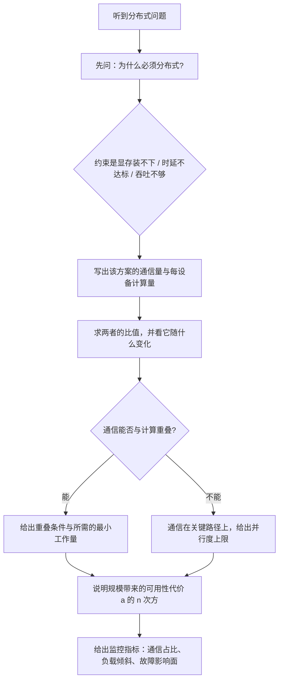

# 分布式、MoE、网络与 disaggregation 题组（Q059–Q076）

> 位置：[InferenceAtlas](../../INDEX.md) > [模块 17](README.md) > 当前文档
> 信息截至：2026-07-29 ｜ 最后核验：2026-07-29 ｜ 内容版本：v0.1
> 时效性等级：低
> 相关主题：[模块 06](../06_distributed_and_moe_inference/)｜[第四组题](04_compiler_kernel_and_quantization_questions.md)｜`06_hardware_and_datacenter_questions.md`

## 本章导读

这是七组题中**最大的一组**（18 题），也是最能区分「读过文档」与「部署过系统」的一组。分布式推理的特点是**几乎每个决策都有一个反直觉的地方**：张量并行的通信量与并行度无关、流水并行在 decode 阶段无法用微批填气泡、MoE 的「激活参数量」不能预测性能、KV 缓存命中率提高反而会让传输时间暴露出来。**这些反直觉点就是面试的考点**。

这组题的主线是**通信与计算的比值**。所有分布式方案的价值都可以归结为「它把什么计算分摊掉了，代价是引入了多少通信」，而这个比值随批大小、序列长度、模型形状变化——**因此同一个并行方案在 prefill 和 decode 阶段的评价常常相反**。

第二条主线是**规模带来的可靠性代价**。$n$ 台机器组成的一个推理组，其可用性是单机可用性的 $n$ 次方；分布式方案在提升单请求性能的同时**必然放大了故障影响面**。能主动把这一点提出来，是资深候选人的标志。

本章按「张量并行 → 流水与序列并行 → MoE → PD 分离与 KV 传输 → 拓扑与网络 → 容错与排查」的顺序组织。

## 学习目标

读完本章后，读者应能够：

1. 推导张量并行的通信量并解释它为什么与并行度无关
2. 说明流水并行的气泡公式，以及为什么 decode 阶段不能用增加微批来填气泡
3. 区分 MoE 的三个参数量，并用它们判断带宽与算力瓶颈
4. 给出 PD 分离的收益条件与 KV「传输还是重算」的判据
5. 设计多节点放置策略，并解释「组内集中、副本分散」的理由
6. 在分布式部署上定位瓶颈是通信还是计算，并说明规模对可用性的影响

## 核心结论

- **张量并行的通信量正比于「批中 token 数 × 隐藏维度」，与并行度无关**；因此增加并行度会让通信占比上升，这是 TP 的天然上限。
- **decode 阶段无法用增加微批来填流水气泡**：微批数受在飞请求数限制，而增加在飞请求会同时增大批本身，两者是耦合的。
- **MoE 的「激活参数量」预测算力而不预测带宽**：每步要读的参数量取决于批内被激活的专家的并集，批越大这个并集越接近全部专家。
- **PD 分离的收益条件是 KV 传输时间远小于重算这段 prefill 的时间**，而这个比值与序列长度无关——它只取决于链路带宽与算力的比。
- **前缀缓存命中率提高会让 KV 传输时间从被掩盖变为暴露**：命中率越高，本地 prefill 时间越短，传输的相对成本越大。
- **放置策略的通则是「一个并行组内尽可能集中、不同副本尽可能分散」**：前者最小化通信延迟，后者最小化相关故障的影响面。

## 1. 问题定义、系统边界与工作负载

本章覆盖 [模块 06](../06_distributed_and_moe_inference/) 的全部内容，并在 KV 容量与 GQA 上依赖 [模块 02 第 5–6 章](../02_transformer_and_kv_cache/05_kv_cache_capacity_and_memory_models.md)，在通信与计算的比值估算上依赖 [模块 01 第 4–5 章](../01_foundations_and_metrics/04_roofline_and_performance_modeling.md)。网络与互连的部分参见 [模块 08](../08_networking_and_interconnect/)。

**答题的通用起点**是先写出**通信量与计算量的比值**，再问「这个比值随什么变化」。分布式推理的绝大多数结论都是这个比值的推论，而它随批大小、序列长度、并行度、模型形状变化的方式各不相同。**先建立比值再讨论，能避免绝大多数错误答案**。

本章不含任何需要外部核验的互连规格、集群规模或实测通信带宽；题目中出现的参数均为题面给定的假设值，用于演示推导过程。

### 本章题目一览

| 编号 | 题目 | 难度 | 形式 |
|---|---|---|---|
| Q059 | 张量并行的通信量随并行度怎么变 | 高 | 计算 |
| Q060 | 为什么每层只需要两次归约 | 中等 | 概念 |
| Q061 | 张量并行度的上限由什么决定 | 高 | 计算 |
| Q062 | 为什么 decode 阶段不能靠加微批填气泡 | 高 | 计算 |
| Q063 | 怎么为一个模型选并行策略 | 高 | 系统设计 |
| Q064 | 序列并行怎么保证精确性，通信何时能被掩盖 | 专家 | 概念 |
| Q065 | MoE 的三个参数量分别决定什么 | 高 | 概念 |
| Q066 | 专家并行怎么划分，通信是什么形态 | 高 | 系统设计 |
| Q067 | MoE 的负载不均从哪来，容量因子怎么选 | 专家 | 计算 |
| Q068 | MoE 模型在小批 decode 上怎么部署 | 高 | 系统设计 |
| Q069 | PD 分离什么时候值得做 | 高 | 计算 |
| Q070 | KV 是传输还是重算，怎么判断 | 专家 | 计算 |
| Q071 | PD 分离的两个池怎么配比 | 高 | 计算 |
| Q072 | 多节点部署的放置策略怎么定 | 高 | 系统设计 |
| Q073 | 推理的网络需求和训练有什么不同 | 高 | 概念 |
| Q074 | 为什么小消息的集合通信这么贵 | 中等 | 计算 |
| Q075 | 分布式推理的单机故障怎么处理 | 高 | 系统设计 |
| Q076 | 分布式推理变慢了，怎么定位是通信还是计算 | 高 | 排查 |

## 2. 原理、数学与性能模型

这一组题反复用到六个模型：

**（一）张量并行的通信量**。把一层的两个线性层按「先列切后行切」配对，每层只需在行切之后做一次归约，前馈与注意力各一次，**即每层两次 all-reduce**。单次归约的数据量为

$$
D_{\text{TP}} = B \cdot d \cdot b_a
$$

其中 $B$ 是批中 token 数、$d$ 是隐藏维度、$b_a$ 是激活位宽字节数。**注意这里没有并行度 $P$**——每个设备都要发出和收到与全量激活同阶的数据。而每设备的计算量随 $P$ 下降，所以通信占比随 $P$ 上升。

**（二）通信与计算的比值**。一层的矩阵乘计算量由前馈与四个投影组成：前馈按 $d_{ff} = 4d$ 计约 $16 B d^2$，四个 $d \times d$ 投影约 $8 B d^2$，合计约 $24 B d^2$（忽略注意力分数本身），每设备分到 $24 B d^2 / P$。一层的通信量是两次归约共 $2 B d b_a$。两者相除给出一个与 $B$ 无关的比值形式

$$
\frac{\text{通信字节}}{\text{计算 FLOP/设备}} = \frac{2 B d b_a}{24 B d^2 / P} = \frac{P b_a}{12 d}
$$

**这个式子说明：$d$ 越大越适合 TP，$P$ 越大通信占比越高**。它是判断「TP 能开到多大」的第一性依据（完整推导见 [模块 06 第 2 章](../06_distributed_and_moe_inference/02_tensor_parallel_inference.md)）。

**（三）流水并行的气泡**。$N$ 级流水、$m$ 个微批时，气泡占比为

$$
\text{bubble} = \frac{N-1}{m + N - 1}
$$

**训练时 $m$ 可以自由增大，推理 decode 时不能**——微批只能来自在飞请求，而增加在飞请求会同时改变批的构成。

**（四）MoE 的三个参数量**。总参数量（决定显存）、激活参数量（决定单 token 算力）、**读取参数量（决定带宽）**。第三个是最容易被忽略的：一批 $n$ 个 token、每 token 选 $k$ 个专家、共 $E$ 个专家时，至少有一个 token 命中某个给定专家的概率给出期望覆盖率

$$
\rho(n) = 1 - \left(1 - \frac{k}{E}\right)^{n}
$$

**批越大，覆盖率越接近 1，「稀疏」在带宽意义上就消失了**。

**（五）PD 分离的传输判据**。设每 token 的 KV 字节为 $m_{\text{tok}}$、链路带宽 $\text{BW}_{\text{link}}$、prefill 算力 $\text{FLOPS}$、每 token prefill 计算量约 $2P_{\text{model}}$（$P_{\text{model}}$ 为参数量）。传输时间与 prefill 时间之比为

$$
\frac{T_{\text{transfer}}}{T_{\text{prefill}}} = \frac{m_{\text{tok}} / \text{BW}_{\text{link}}}{2 P_{\text{model}} / \text{FLOPS}}
= \frac{m_{\text{tok}}}{2 P_{\text{model}}} \cdot \frac{\text{FLOPS}}{\text{BW}_{\text{link}}}
$$

**序列长度 $S$ 在分子分母中约掉了**——这个比值与 prompt 多长无关。分离值得做的条件是这个比值远小于 1。

**（六）规模与可用性**。一个由 $n$ 台机器组成的并行组，任一台故障则整组不可用，故组可用性为

$$
a_{\text{group}} = a^{n}
$$

**并行度是有可靠性成本的**。$R$ 个副本中至少 $k$ 个可用的概率按二项分布计算，这给出冗余配置的依据（见 [模块 06 第 10 章](../06_distributed_and_moe_inference/10_fault_tolerance_and_graceful_degradation.md)）。

## 3. 实现机制与系统设计

以下为本章题库正文。每题的「推荐回答」是**完整答案**，可在 2–5 分钟内口头讲完。

### Q059：张量并行的通信量随并行度怎么变

**难度**：高　**形式**：计算　**目标岗位**：Inference / Distributed Systems / ML Systems

**考察点**：检验候选人是否真正推导过通信量，这是分布式推理最核心也最反直觉的一个结论。

**题目**：请推导张量并行下每层的通信量，并说明它随并行度如何变化。由此解释张量并行为什么存在一个实际上限。

#### 推荐回答

**结论**：**单次归约的数据量与并行度无关**，而每设备的计算量随并行度线性下降，**因此通信占比随并行度线性上升**——这就是张量并行的天然上限。

**推导通信量**。以前馈层为例，它是两个连续的线性层。张量并行的标准做法是**第一层按输出维度（列）切分、第二层按输入维度（行）切分**：

1. 第一层按列切：每设备持有 $d_{ff}/P$ 列，输入激活是完整的，**不需要通信**，输出是部分列；
2. 中间的逐元素激活函数：每设备在自己那部分列上独立完成，**不需要通信**；
3. 第二层按行切：每设备持有 $d_{ff}/P$ 行，输入正好是它自己那部分列，输出是**完整维度但只是部分和**；
4. 因此需要**一次 all-reduce** 把各设备的部分和加起来。

**这个配对的价值在于：一整个前馈块只需要一次归约**。如果两层都按列切，中间就要通信一次；配对之后中间那次被省掉了。

注意力块同理（QKV 投影按列切、输出投影按行切），**所以每个 Transformer 层共两次 all-reduce**。

单次归约的数据量是完整激活的大小：

$$
D_{\text{TP}} = B \cdot d \cdot b_a
$$

$B$ 是这一步参与计算的 token 数、$d$ 是隐藏维度、$b_a$ 是激活位宽字节数。**式子里没有 $P$**。直觉上的理由是：归约的结果是一个完整的激活张量，每个设备都必须拿到它，所以每个设备收到的数据量就是这个张量的大小——无论有多少设备参与。

**为什么这导致上限**。每设备的计算量随 $P$ 下降。一层的矩阵乘计算量约 $24 B d^2$——前馈 $16 B d^2$（取 $d_{ff} = 4d$）加四个 $d \times d$ 投影 $8 B d^2$，忽略注意力分数本身。每设备分到 $24 B d^2 / P$，而一层的通信量是两次归约共 $2 B d b_a$。通信与计算之比为

$$
\frac{2 B d b_a}{24 B d^2 / P} = \frac{P b_a}{12 d}
$$

**批大小 $B$ 也约掉了**——这个比值只由 $P$、$b_a$、$d$ 决定。

三个读法：

1. **$P$ 翻倍，通信占比翻倍**。每设备计算时间减半而通信时间不变，所以存在一个 $P$，超过它之后再加设备几乎不再降低单步时延；
2. **$d$ 越大越适合 TP**。隐藏维度大的模型有更高的计算通信比，能支撑更高的并行度；
3. **激活位宽降低直接改善比值**。这是通信量用低精度传输的动机。

**一个重要限定**：以上是数据量的分析，实际时间还包含固定的启动延迟。集合通信的时间大致是 $n_{\text{ops}} \alpha + D / \text{BW}$，**当 $D$ 很小时（小批 decode），时间由 $\alpha$ 项支配**，此时增加 $P$ 的代价体现为延迟项而不是带宽项。**decode 阶段的批很小，恰好落在这个区域**——这是 decode 阶段 TP 扩展性比 prefill 更差的另一个原因。

**答题时的加分点**：明确指出「$P$ 和 $B$ 都在比值里约掉了/没出现」，并区分带宽支配与延迟支配两个区域。

#### 强答案必须覆盖

- 列切-行切配对使每块只需一次归约，每层共两次 all-reduce
- 推导出 $D_{\text{TP}} = B d b_a$ 并指出其中没有 $P$
- 解释直觉：归约结果是完整激活，每设备都要拿到
- 通信计算比 $P b_a / (12d)$，$B$ 也约掉了
- 三个读法：$P$ 翻倍占比翻倍、$d$ 大更适合 TP、低精度通信有效
- 补上延迟项 $n_{\text{ops}}\alpha$，说明小批 decode 由延迟支配
- 由此说明 decode 的 TP 扩展性比 prefill 更差

#### 常见错误

- 认为通信量随并行度下降
- 说不清为什么每层是两次而不是四次归约
- 只讲带宽不提固定延迟项
- 忽略 prefill 与 decode 在这个问题上的差别

#### 可能追问

1. 如果两个线性层都按列切，通信次数会变成几次？
2. 把归约的数据用低精度传输，有什么风险？
3. 为什么 decode 阶段更容易落在延迟支配区？
4. 序列并行能否减少 TP 的通信量？

#### 关联阅读

- [张量并行推理](../06_distributed_and_moe_inference/02_tensor_parallel_inference.md)
- [分布式推理总览](../06_distributed_and_moe_inference/01_distributed_inference_overview.md)

### Q060：为什么每层只需要两次归约

**难度**：中等　**形式**：概念　**目标岗位**：Inference / Distributed Systems / ML Systems

**考察点**：检验候选人是否理解列切与行切的配对，这是张量并行实现正确性与效率的关键。

**题目**：有人实现张量并行时每层做了四次 all-reduce。请指出可能的问题在哪，并说明正确的切分方式为什么只需两次。

#### 推荐回答

**结论**：四次通常意味着**每个线性层后面都做了一次归约**，也就是所有线性层都按同一方向（列）切分。正确做法是**成对切分：块内第一层按列、第二层按行**，使中间结果不需要归约，每个块只在末尾归约一次。

**先看四次是怎么来的**。一层 Transformer 有四组线性变换：QKV 投影、注意力输出投影、前馈第一层、前馈第二层。如果每一组都按输出维度（列）切分，那么：

- 每组的输出都是「部分列、完整批」；
- 而下一组需要完整的输入维度；
- **所以每组之后都要做一次 all-gather 或 all-reduce**，共四次。

**正确的配对方式**。关键观察是：**行切的层输出的是「完整维度的部分和」，而列切的层需要的输入正是「完整维度」**。所以把两者反过来配：

| 位置 | 切分方向 | 输入要求 | 输出形态 | 是否需要通信 |
|---|---|---|---|---|
| 块内第一层 | 按列（输出维度） | 完整激活 | 部分列 | 否 |
| 中间逐元素运算 | 沿列自然切分 | 部分列 | 部分列 | 否 |
| 块内第二层 | 按行（输入维度） | 部分列（正好匹配） | 完整维度的部分和 | **是，一次归约** |

**「部分列」正好是行切层需要的输入分片**——这是配对成立的原因。于是前馈块一次归约、注意力块一次归约，每层共两次。

**注意力块的细节**。QKV 投影按列切时，**切分的自然单位是注意力头**：每设备负责一部分头，完整地持有这些头的 Q、K、V。这样注意力计算本身（含 softmax）**完全在设备内完成，不需要通信**——因为注意力是在每个头内部独立进行的。然后输出投影按行切，末尾一次归约。

**这个细节解释了一个重要约束**：注意力头数必须能被并行度整除。更严格地说，**在 GQA 下是 KV 头数必须能被并行度整除**，否则某些设备的 KV 头需要被复制——这会削弱 GQA 节省的 KV 显存（见 Q061）。

**还能省吗**。有两个方向：

1. **与序列并行结合**：把归约替换为 reduce-scatter + all-gather 的组合，使得逐元素算子（归一化等）也能在切分状态下计算，**总通信量相同但激活显存下降**；
2. **重叠**：归约与后续无依赖的计算重叠。但注意 all-reduce 的结果是下一层的输入，**依赖是直接的**，所以重叠空间有限——这与序列并行的环形通信不同（见 Q064）。

**排查建议**：如果怀疑实现中通信次数偏多，**直接在 profile 里数一层内的集合通信 kernel 数量**。每层两次是正确实现的基线，明显多于此就应该检查切分方向。

#### 强答案必须覆盖

- 指出四次的来源是所有线性层都按同一方向切
- 给出配对原理：行切输出部分和、列切需要完整输入
- 用表格说明块内两层的切分方向与通信需求
- 注意力块按头切分使注意力计算无需通信
- 由此引出头数（GQA 下为 KV 头数）必须被并行度整除的约束
- 两个进一步优化方向：与序列并行结合降激活显存、重叠（空间有限）
- 排查方法是在 profile 里数每层的集合通信 kernel 数

#### 常见错误

- 说不出配对的方向依据
- 不知道注意力按头切分
- 忽略头数可除性约束
- 认为 all-reduce 可以自由与后续计算重叠

#### 可能追问

1. GQA 下 KV 头数不能被并行度整除会发生什么？
2. 序列并行怎么把 all-reduce 拆成两步？为什么能省显存？
3. 为什么 TP 的归约难以与计算重叠？
4. 如果模型有并行的注意力与前馈分支，通信次数能减少吗？

#### 关联阅读

- [张量并行推理](../06_distributed_and_moe_inference/02_tensor_parallel_inference.md)
- [GQA、MQA、MLA 与 KV 缩减](../02_transformer_and_kv_cache/06_gqa_mqa_mla_and_kv_reduction.md)

### Q061：张量并行度的上限由什么决定

**难度**：高　**形式**：计算　**目标岗位**：Inference / Distributed Systems / ML Systems

**考察点**：检验候选人是否知道可除性约束及其对 KV 显存节省的破坏，这是一个容易被忽略的实际限制。

**题目**：除了通信占比，还有哪些因素限制了张量并行度能开多大？请特别说明 GQA 模型上的约束。

#### 推荐回答

**结论**：四个限制——**通信占比**、**注意力头数（GQA 下为 KV 头数）的可除性**、**每设备工作量过小导致的效率下降**、**故障影响面**。其中**第二个在 GQA 模型上是硬约束，且违反它会破坏 GQA 的显存收益**。

**限制一：通信占比**。见 Q059，通信计算比为 $P b_a / (12d)$，随 $P$ 线性上升。在小批 decode 下还要叠加固定延迟项，恶化更快。

**限制二：可除性——这是最容易被忽略的**。

张量并行按注意力头切分。设总查询头数 $H$、KV 头数 $H_{kv}$（GQA 下 $H_{kv} < H$）。并行度 $P$ 要求：

- $H$ 能被 $P$ 整除（查询头可以均分）；
- **$H_{kv}$ 能被 $P$ 整除**（每设备完整持有若干 KV 头）。

**第二个条件更紧**，因为 $H_{kv}$ 远小于 $H$。如果 $P > H_{kv}$，就没有办法给每个设备分配至少一个完整的 KV 头，**只能复制 KV**：多个设备持有同一份 KV 头。

**复制的后果是 GQA 的显存收益被削弱**。GQA 的价值在于 KV 只有 $H_{kv}$ 组而不是 $H$ 组，显存相对 MHA 降到 $H_{kv}/H$。但当 $P > H_{kv}$ 需要复制时，全系统实际存储的 KV 组数从 $H_{kv}$ 变成 $P$（每设备至少一组），**于是相对 MHA 的显存比例从 $H_{kv}/H$ 退化为 $P/H$**。

举例说明这个退化有多严重：$H = 64$、$H_{kv} = 8$ 时，GQA 本可以把 KV 显存降到 MHA 的 $8/64 = 12.5\%$。如果 $P = 8$，恰好每设备一个 KV 头，收益完整保留。但如果 $P = 32$，每个 KV 头被 4 个设备复制，全系统等效 32 组，显存比例变成 $32/64 = 50\%$——**GQA 的收益从 8 倍缩水到 2 倍**。

| 并行度 $P$ | 每设备 KV 头 | 系统等效 KV 组数 | 相对 MHA 显存 |
|---|---|---|---|
| 4 | 2 | 8 | 12.5% |
| 8 | 1 | 8 | 12.5% |
| 16 | 1（复制 2 份） | 16 | 25% |
| 32 | 1（复制 4 份） | 32 | 50% |

**这张表的结论是：$P = H_{kv}$ 是一个自然的分界点**。超过它之后每增加一倍并行度，KV 显存需求就翻一倍，**而 KV 显存决定了能装多少并发请求**——所以吞吐可能反而下降。MLA 一类把 KV 压缩到更少的潜在表示的方案，这个约束更紧。

**限制三：每设备工作量过小**。$P$ 很大时每设备的矩阵变得很窄，落入并行度不足或访存不合并的区域（见第四组题 Q055）。**症状是每设备的实测算力与带宽利用率同时下降**——此时增加 $P$ 甚至可能增加单步时延。

**限制四：故障影响面**。$P$ 台机器组成一个组，组可用性是 $a^P$。$P$ 越大，单机故障导致整组不可用的概率越高，**且一次故障影响的在飞请求数也越多**。

**综合选择方法**：先由「模型显存 ÷ 单设备可用显存」得到 $P$ 的下界，由 $H_{kv}$ 得到「不损失 GQA 收益」的上界，在这个区间内按通信占比与时延目标选择。**如果下界超过 $H_{kv}$，说明必须接受 KV 复制或改用流水/专家并行**——这是一个需要明确指出的取舍。

#### 强答案必须覆盖

- 四个限制：通信占比、可除性、每设备工作量、故障影响面
- GQA 下的紧约束是 $H_{kv}$ 而非 $H$ 的可除性
- $P > H_{kv}$ 必须复制 KV，显存比例从 $H_{kv}/H$ 退化为 $P/H$
- 给出退化的数值表并指出 $P = H_{kv}$ 是自然分界点
- KV 显存决定并发数，故超过分界点可能吞吐下降
- 每设备工作量过小的症状是算力与带宽利用率同时下降
- 组可用性 $a^P$ 与故障影响的在飞请求数
- 综合方法：显存给下界、$H_{kv}$ 给上界、区间内按时延选

#### 常见错误

- 只提通信占比，不知道可除性约束
- 认为可除性只涉及查询头数
- 不知道 KV 复制会破坏 GQA 的显存收益
- 不提可靠性代价

#### 可能追问

1. 如果显存要求的 $P$ 下界超过 $H_{kv}$，你会怎么选？
2. MLA 一类的方案在这个约束上更紧还是更松？
3. KV 复制之后，是否还能通过其他方式恢复显存收益？
4. 怎么在监控上发现每设备工作量过小？

#### 关联阅读

- [张量并行推理](../06_distributed_and_moe_inference/02_tensor_parallel_inference.md)
- [GQA、MQA、MLA 与 KV 缩减](../02_transformer_and_kv_cache/06_gqa_mqa_mla_and_kv_reduction.md)
- [KV cache 容量与内存模型](../02_transformer_and_kv_cache/05_kv_cache_capacity_and_memory_models.md)

### Q062：为什么 decode 阶段不能靠加微批填气泡

**难度**：高　**形式**：计算　**目标岗位**：Inference / Distributed Systems / ML Systems

**考察点**：检验候选人是否理解推理与训练在微批来源上的根本差异——这是把训练经验直接搬过来的典型陷阱。

**题目**：流水并行的气泡占比是 $(N-1)/(m+N-1)$，训练时增大微批数 $m$ 就能压低它。为什么这个办法在推理的 decode 阶段行不通？

#### 推荐回答

**结论**：因为**推理 decode 的微批只能来自不同的在飞请求，而增加在飞请求会同时增大批本身，两者是耦合的**。训练时一个大 batch 可以自由切成任意多个微批（同一份数据的切分），**推理时没有这样的自由度**。

**先确认气泡公式**。$N$ 级流水、$m$ 个微批，填充与排空各需 $N-1$ 个时隙，总时隙 $m + N - 1$，故气泡占比

$$
\text{bubble} = \frac{N-1}{m + N - 1}
$$

| 级数 $N$ | $m=1$ | $m=4$ | $m=8$ | $m=16$ |
|---|---|---|---|---|
| 2 | 50% | 20% | 11% | 6% |
| 4 | 75% | 43% | 27% | 16% |
| 8 | 88% | 64% | 47% | 30% |
| 16 | 94% | 79% | 65% | 48% |

**表的读法：$m$ 至少要与 $N$ 同量级，气泡才降到可接受范围**。$m = 1$ 时气泡几乎等于 $(N-1)/N$——流水完全没有流动起来。

**训练与推理的关键差异**。训练时：

- 一个 global batch 有成百上千个样本；
- 把它切成 $m$ 个微批只是**改变梯度累积的粒度**，不改变任何语义；
- 所以 $m$ 可以自由取到很大，气泡被压得很低。

推理 decode 时：

- 每个在飞请求每步只产生 **1 个 token**；
- 一个「微批」必须是若干个请求的当前 token 组成的批；
- **要有 $m$ 个微批，就需要把在飞请求分成 $m$ 组**；
- 而在飞请求总数 $C$ 是有限的，且受 KV 显存约束。

于是出现一个两难：

**（一）如果固定并发 $C$，把它切成 $m$ 组**，每组只有 $C/m$ 个请求。**每个微批的批大小变小，而小批 decode 是带宽受限的**——算术强度约 $2B/b_w$，$B$ 变小意味着每个微批的效率下降。**气泡少了，但每个微批算得更不划算**。

**（二）如果保持每个微批的批大小，就要增大总并发 $C = m \cdot B$**。但 $C$ 受 KV 显存约束：$C \cdot S \cdot m_{\text{tok}} \le M_{\text{KV}}$。**要增大 $C$ 就要牺牲上下文长度，或者根本没有余量**。

**这就是耦合的具体形式**：$m$、$B$、$C$ 三者满足 $C = m B$，而 $C$ 有显存上界、$B$ 有效率下界。**训练里 $m$ 是一个自由参数，推理里它被夹在两个约束之间**。

**还有第二个问题：时延**。流水并行下一个 token 要穿过全部 $N$ 级才能产出，**单 token 时延至少是 $N$ 段计算加 $N-1$ 次传输**。张量并行是所有设备同时算一层，单步时延随并行度下降；**流水并行的单步时延不随级数下降，反而因级间传输而略增**。所以流水并行**不是降低时延的手段，而是装下模型的手段**。

**实践中的三种应对**：

1. **减少级数**。流水主要用于「显存装不下」，所以级数应该取「刚好装下」的最小值，而不是越多越好；
2. **与张量并行组合**。用 TP 在节点内降低单步时延，用 PP 跨节点解决显存——**这也符合「组内集中」的放置原则**（见 Q072）；
3. **请求交错而非微批切分**。让不同请求处于流水的不同级，**即把「微批」理解为「时间上错开的请求流」**。这在稳态下能填满流水，但要求请求到达足够密集且长度分布不过分离散——**长度差异大时短请求先完成，会在流水中留下空隙**。

**答题的核心一句话**：训练的微批是「同一批数据的切分」，推理 decode 的微批是「不同请求的分组」，**后者的数量受在飞请求数与 KV 显存约束，不是自由参数**。

#### 强答案必须覆盖

- 写出气泡公式并给出数值表，说明 $m$ 需与 $N$ 同量级
- 训练的微批是同一批数据的切分，语义不变、$m$ 自由
- 推理 decode 的微批是请求分组，受在飞请求数限制
- 给出耦合关系 $C = mB$ 及两个约束：$C$ 受 KV 显存、$B$ 受效率下界
- 分别说明固定 $C$ 切分与增大 $C$ 两条路各自的问题
- 第二个问题：流水不降低单步时延，反而略增
- 三种应对：最小级数、与 TP 组合、请求交错
- 指出请求长度分布离散会在流水中留空隙

#### 常见错误

- 直接套用训练经验说「加微批就行」
- 不知道流水并行不降低单 token 时延
- 忽略 $C$ 受 KV 显存约束
- 认为级数越多越好

#### 可能追问

1. 请求交错在什么条件下能填满流水？
2. 如果请求长度分布很离散，流水的空隙怎么估？
3. TP + PP 的组合怎么分配两者的度数？
4. prefill 阶段的流水气泡问题和 decode 一样吗？

#### 关联阅读

- [流水并行推理](../06_distributed_and_moe_inference/03_pipeline_parallel_inference.md)
- [分布式推理总览](../06_distributed_and_moe_inference/01_distributed_inference_overview.md)
- [KV cache 容量与内存模型](../02_transformer_and_kv_cache/05_kv_cache_capacity_and_memory_models.md)

### Q063：怎么为一个模型选并行策略

**难度**：高　**形式**：系统设计　**目标岗位**：Inference / Distributed Systems / ML Systems

**考察点**：检验候选人是否会先区分三种约束——这是本组题最大的失分点。

**题目**：给定一个模型和一组硬件，请给出选择并行策略（TP / PP / EP / 多副本 / 组合）的流程。

#### 推荐回答

**结论**：**先确定约束是哪一种**——显存装不下、时延不达标、还是吞吐不够。三者的第一选择完全不同，而**「吞吐不够」的正确答案通常是加副本，不是加并行度**。

**第一步，分类约束**。

| 约束 | 判据 | 第一选择 | 理由 |
|---|---|---|---|
| 显存装不下 | 权重 + KV + 激活 > 单设备可用显存 | PP 或 EP（MoE），必要时 TP | 目标是切开权重，通信次数少的优先 |
| 时延不达标 | 单副本单步时延超 SLO | TP | 唯一能降低单步时延的方式 |
| 吞吐不够 | 时延达标但 QPS 不足 | **多副本** | 零通信开销、线性扩展、故障隔离 |

**第三行是关键**。多副本没有任何跨设备通信，扩展是线性的，而且一个副本故障只影响它自己的请求。**「吞吐不够就加 TP」是一个昂贵的错误**：它增加通信占比、扩大故障影响面，而且并不比多副本更省资源。

**第二步，如果是显存约束，算出最小并行度**。

$$
P_{\min} = \left\lceil \frac{M_{\text{weight}} + M_{\text{KV}} + M_{\text{act}}}{M_{\text{dev}} \cdot (1 - r)} \right\rceil
$$

其中 $r$ 是预留比例（碎片、临时缓冲）。**注意 $M_{\text{KV}}$ 取决于目标并发与上下文长度**，所以这一步和容量规划是耦合的：**想支持更长上下文就需要更高的并行度**。

然后在 PP、TP、EP 之间选：

- **PP 的通信量最小**（每级只传一份激活，且是点对点），**但不降低时延且有气泡**。适合跨节点。
- **TP 的通信量大且在关键路径上**，但降低单步时延。适合节点内高带宽域。
- **EP 只对 MoE 适用**，切分的是专家权重，通信是 all-to-all。

**第三步，如果是时延约束，按 TP 上限验证可行性**。TP 度数受 Q061 的四个限制。**如果所需的 TP 度数超过 $H_{kv}$，要明确指出会损失 GQA 收益**，并重新评估 KV 显存是否还够。

**第四步，组合策略的分配原则**。常见组合是「节点内 TP + 跨节点 PP（或 EP）」。理由是：

- TP 通信频繁且在关键路径，**必须放在带宽最高、延迟最低的域内**；
- PP 通信稀疏（每级一次），能容忍跨节点的较低带宽；
- **这与「组内集中」的放置原则一致**（见 Q072）。

**第五步，检查可靠性**。总并行度 $n = P_{TP} \cdot P_{PP}$ 台机器组成一组，组可用性 $a^n$。**如果算出来的组可用性低于 SLO 要求，必须增加副本冗余**——$R$ 个副本中至少 $k$ 个可用的概率按二项分布算。

**第六步，验证而非假设**。给出方案后必须说明怎么验证：

1. 测每步中通信占的时间比例，与 $P b_a/(12d)$ 的估算对比；
2. 测实际能支持的并发与上下文长度，与容量规划对比；
3. 做故障注入，测一次单机故障影响多少在飞请求、恢复多久。

**一个完整回答的形状**：「先分类约束 → 算最小并行度 → 按通信特性把不同并行放到不同层级 → 检查 GQA 与可靠性约束 → 给出三项验证」。**其中「分类约束」这一步的存在与否，基本决定了这道题的评价**。

#### 强答案必须覆盖

- 先分类三种约束并给出各自的第一选择
- 明确指出吞吐约束应加副本而非并行度，并给出三条理由
- 显存约束下给出 $P_{\min}$ 公式，并指出与容量规划耦合
- 对比 PP / TP / EP 的通信特性与适用层级
- 时延约束下需按 Q061 的限制验证 TP 可行性，尤其 $H_{kv}$
- 组合原则：TP 放高带宽域内、PP 跨节点
- 检查组可用性 $a^n$ 并按二项分布配副本冗余
- 给出三项验证方法而非只给方案

#### 常见错误

- 不分类约束就直接推荐一种并行方式
- 用 TP 解决吞吐问题
- 把 TP 跨节点部署
- 不检查 GQA 可除性与可靠性

#### 可能追问

1. 如果时延约束要求的 TP 度数超过 $H_{kv}$，你会怎么取舍？
2. PP 与 EP 都能省显存，怎么在 MoE 模型上二选一？
3. 组可用性不达标时，增加副本和降低并行度哪个更划算？
4. 怎么验证通信占比与估算是否一致？

#### 关联阅读

- [分布式推理总览](../06_distributed_and_moe_inference/01_distributed_inference_overview.md)
- [张量并行推理](../06_distributed_and_moe_inference/02_tensor_parallel_inference.md)
- [流水并行推理](../06_distributed_and_moe_inference/03_pipeline_parallel_inference.md)
- [容量规划](../01_foundations_and_metrics/08_capacity_planning.md)

### Q064：序列并行怎么保证精确性，通信何时能被掩盖

**难度**：专家　**形式**：概念　**目标岗位**：Inference / Distributed Systems / ML Systems

**考察点**：检验候选人是否理解在线 softmax 的可合并性以及重叠的定量条件。

**题目**：把序列维度切分到多个设备后，注意力需要跨设备的 K 和 V。请说明如何在不损失精确性的前提下完成计算，以及通信何时能被计算掩盖。

#### 推荐回答

**结论**：精确性靠**在线 softmax 的可合并归约**——每个设备算出局部的部分输出、局部指数和与局部最大值，按修正规则合并即得精确结果；通信能被掩盖的条件是**每设备的本地注意力计算时间不短于传输一块 KV 的时间**，这给出一个对每设备 query token 数的下界。

**为什么需要序列并行**。当序列很长时，单设备的 KV cache 与激活可能装不下，而 TP 切的是隐藏维度、PP 切的是层——**都不解决序列维度的容量问题**。序列并行按 token 位置切分：设备 $i$ 持有序列的第 $i$ 段的 K、V。

**精确合并的机制**。注意力的困难在于 softmax 需要全序列的归一化因子。环形方案让 K/V 块在设备间循环流转，每个设备依次看到所有块：

1. 每个设备持有自己的 Q（对应它负责的 query token）；
2. 每一轮，设备用当前手上的 K/V 块算出**局部**的注意力贡献，记录三个量：部分输出累加器、指数和、见过的最大分数；
3. 把 K/V 块传给下一个设备，同时接收上一个设备的块；
4. 合并时按在线 softmax 的规则修正：遇到更大的最大值，**按 $\exp(\text{旧最大} - \text{新最大})$ 的比例缩放已累积的输出与指数和**，再加入新的贡献。

**这是精确的**——最终结果与在单设备上算全序列注意力在数值误差内一致。**关键点是三个量都可增量合并，且合并操作满足结合律**，所以分块的顺序不影响结果（浮点误差除外）。

**为什么能重叠**。与 TP 的 all-reduce 不同，**这里的通信与计算之间没有立即的依赖**：设备在用第 $j$ 块算注意力的同时，可以异步接收第 $j+1$ 块。**TP 的归约结果是下一层的直接输入，无法这样错开**——这是序列并行在通信可掩盖性上的结构性优势。

**重叠的定量条件**。设每设备负责 $n_q$ 个 query token，KV 块包含 $n_{kv}$ 个 token。一轮里：

- **计算量**：$n_q$ 个 query 对 $n_{kv}$ 个 key 做注意力，约 $2 \cdot 2 \cdot n_q n_{kv} H d_h$ FLOP（分数与加权和各一次矩阵乘）；
- **传输量**：一个 KV 块的字节数，$2 n_{kv} H_{kv} d_h b_{kv}$。

要求计算时间不短于传输时间：

$$
\frac{4 n_q n_{kv} H d_h}{\text{FLOPS}} \ge \frac{2 n_{kv} H_{kv} d_h b_{kv}}{\text{BW}_{\text{link}}}
$$

两边约掉 $n_{kv} d_h$，整理得

$$
n_q \ge \frac{H_{kv}}{H} \cdot \frac{b_{kv}}{2} \cdot \frac{\text{FLOPS}}{\text{BW}_{\text{link}}}
$$

**三个读法**：

1. **块大小 $n_{kv}$ 约掉了**——重叠条件与块多大无关，只与每设备的 query 数有关；
2. **GQA 让条件更容易满足**：$H_{kv}/H < 1$ 直接放松了下界，因为传输的 KV 变少了而计算量不变；
3. **算力带宽比 $\text{FLOPS}/\text{BW}_{\text{link}}$ 是主导因子**。跨节点链路带宽远低于节点内，这个比值大得多，**所以跨节点做序列并行需要每设备有更多 query token 才能掩盖通信**。

**数值示例**（题面假设值）：设 $H_{kv}/H = 1/8$、$b_{kv} = 2$ 字节、算力带宽比为 $2000$ FLOP/Byte，则 $n_q \ge (1/8)(1) (2000) = 250$。**即每设备至少要负责 250 个 query token，通信才能被掩盖**。这解释了序列并行为什么主要用于长序列的 prefill——**decode 时每设备只有极少的 query token，完全无法掩盖通信**。

**分区方式的补充**。因果掩码使得序列后段的 query 需要注意更多的 key，**按连续段均分会导致负载严重不均**（最后一段的工作量是第一段的很多倍）。常见做法是**交错分区**：把序列切成 $2P$ 段，每个设备取一头一尾各一段，使各设备的总工作量接近相等。

**答题要点**：说清「三个量可合并所以精确」、「与 TP 不同因此可重叠」、「重叠条件里块大小约掉了、只剩 query 数」、以及「因果掩码需要交错分区」。**四点齐全即为强答案**。

#### 强答案必须覆盖

- 精确性来自在线 softmax 的三个可合并量与修正规则
- 明确说明这是精确算法而非近似，合并满足结合律
- 与 TP 对比：环形通信与计算无立即依赖，故可重叠
- 推导重叠条件并指出块大小 $n_{kv}$ 约掉了
- GQA 放松下界；算力带宽比是主导因子
- 给出数值示例并解释 decode 无法掩盖通信
- 因果掩码导致连续均分负载不均，需交错分区

#### 常见错误

- 认为需要先 all-gather 全部 KV（那就失去了省显存的意义）
- 认为分块注意力是近似算法
- 给不出重叠的定量条件
- 忽略因果掩码带来的负载不均

#### 可能追问

1. decode 阶段还有必要做序列并行吗？为什么？
2. 交错分区的具体切法是什么？为什么能均衡？
3. 如果链路带宽只有节点内的十分之一，下界怎么变？
4. 这个方案和 PD 分离能一起用吗？

#### 关联阅读

- [序列与上下文并行](../06_distributed_and_moe_inference/04_sequence_context_parallel_inference.md)
- [长上下文推理](../02_transformer_and_kv_cache/07_long_context_inference.md)
- [FlashAttention 与省内存注意力](../04_compilers_runtimes_and_kernels/08_flashattention_and_memory_efficient_attention.md)

### Q065：MoE 的三个参数量分别决定什么

**难度**：高　**形式**：概念　**目标岗位**：Inference / Distributed Systems / ML Systems

**考察点**：检验候选人是否知道第三个参数量（读取参数量），这是 MoE 性能分析的关键。

**题目**：描述一个 MoE 模型时，「总参数量」和「激活参数量」这两个数字够不够？请说明还需要什么，以及每个量决定了什么资源。

#### 推荐回答

**结论**：**不够，还需要第三个量——每步实际要读取的参数量**。三者分别决定显存、算力、带宽，**而「激活参数量」只决定算力，完全不能预测带宽需求**。

**三个参数量**：

| 参数量 | 定义 | 决定什么 | 随批大小 |
|---|---|---|---|
| 总参数量 | 所有专家加共享部分 | **显存容量** | 不变 |
| 激活参数量 | 单个 token 经过的参数 | **单 token 算力** | 不变（每 token） |
| 读取参数量 | 一步中被至少一个 token 用到的参数 | **HBM 带宽** | **随批大小增长** |

**第三个是关键**。HBM 带宽的消耗取决于「这一步要把哪些权重从显存读到片上」，而一个专家只要被批内**任意一个** token 选中，它的权重就必须被完整读取。**所以读取量由批内被激活专家的并集决定，而不是由每 token 的选择决定**。

**量化这个并集**。设共 $E$ 个专家、每 token 选 $k$ 个、批内有 $n$ 个 token，且路由近似均匀独立。某个给定专家不被任何 token 选中的概率是 $(1 - k/E)^n$，所以专家被激活的期望比例（覆盖率）为

$$
\rho(n) = 1 - \left(1 - \frac{k}{E}\right)^{n}
$$

取 $E = 64$、$k = 8$（即 $k/E = 1/8$）：

| 批内 token 数 $n$ | 覆盖率 $\rho(n)$ |
|---|---|
| 1 | 12.5% |
| 4 | 41.4% |
| 8 | 65.6% |
| 16 | 88.2% |
| 32 | 98.6% |
| 64 | 100.0%（约） |

**表的结论是：批内只要有几十个 token，几乎全部专家都会被激活**。此时每步要读的参数量接近总参数量——**MoE 在带宽意义上不再稀疏**。

**由此得到一个重要判断**。稀疏化在带宽上仍有收益的条件是覆盖率乘以专家数小于稠密情况下的等效读取量，即

$$
\rho(n) \cdot E / k < 1 \quad \Longleftrightarrow \quad \rho(n) < k/E
$$

而 $\rho(1) = k/E$ 恰好取等号，$\rho(n)$ 对 $n$ 单调增。**也就是说带宽意义上的稀疏收益只在批为 1 时完整存在，批一大就迅速消失**。

**覆盖率达到某个水平所需的批大小**。解 $\rho(n) = 0.9$ 得

$$
n = \frac{\ln 0.1}{\ln(1 - k/E)}
$$

对 $k/E = 1/8$，$\ln 0.1 / \ln(7/8) \approx 17.2$，即约 18 个 token。一个便于记忆的近似是 $n \approx 2.303 \cdot E/k$（这里给出 $18.4$）。

**三个实际含义**：

**（一）MoE 的收益主要在算力而非带宽**。激活参数量决定每 token 的 FLOP，这部分收益是真实且不随批大小衰减的。**所以 MoE 在算力受限的场景（大批、prefill）收益明确**，在带宽受限的小批 decode 上收益远小于「激活参数量比」暗示的水平。

**（二）显存需求按总参数量算，不能按激活参数量算**。所有专家都必须在显存里（或者付出从主机换入的代价）。**这是 MoE 部署最主要的成本**，也是专家并行存在的理由。

**（三）路由不均会让情况更糟**。上面假设路由均匀。实际路由有倾斜时，热门专家会被更多 token 选中，**覆盖率上升得更快，同时热门专家所在设备成为瓶颈**（见 Q067）。

**答题时的加分点**：主动指出「激活参数量预测算力、不预测带宽」，并给出覆盖率公式与「几十个 token 就接近全覆盖」这个量级结论。

#### 强答案必须覆盖

- 指出需要第三个量：每步读取参数量，决定带宽
- 三个量与显存/算力/带宽的对应，以及随批大小的变化
- 读取量由批内激活专家的并集决定，一个 token 选中即需读全
- 给出覆盖率公式 $\rho(n) = 1-(1-k/E)^n$ 与数值表
- 指出带宽意义的稀疏收益只在批为 1 时完整存在
- 给出达到 90% 覆盖所需批大小与近似式 $2.303E/k$
- 三个含义：收益在算力、显存按总量算、路由倾斜加剧

#### 常见错误

- 只说总参数量与激活参数量
- 用激活参数量比推算带宽收益
- 按激活参数量估显存需求
- 假设路由完全均匀而不提倾斜

#### 可能追问

1. 批大小 256 时，MoE 相对同等激活参数量的稠密模型还快吗？
2. 路由倾斜会怎么改变覆盖率曲线？
3. 如果把专家权重放在主机内存按需换入，代价怎么估？
4. $E$ 和 $k$ 怎么影响覆盖率上升的速度？

#### 关联阅读

- [MoE 推理与专家并行](../06_distributed_and_moe_inference/05_moe_inference_and_expert_parallelism.md)
- [MoE 路由、all-to-all 与负载均衡](../06_distributed_and_moe_inference/06_moe_routing_all_to_all_and_load_balancing.md)
- [内存带宽与算术强度](../01_foundations_and_metrics/05_memory_bandwidth_and_arithmetic_intensity.md)

### Q066：专家并行怎么划分，通信是什么形态

**难度**：高　**形式**：系统设计　**目标岗位**：Inference / Distributed Systems / ML Systems

**考察点**：检验候选人是否理解 all-to-all 的两跳结构与数据量不确定性。

**题目**：请说明专家并行的划分方式与它引入的通信形态，并解释为什么这种通信比张量并行的归约更难优化。

#### 推荐回答

**结论**：专家并行把不同专家放到不同设备，通信形态是**每个 MoE 层两次 all-to-all**（分发 token 去专家、收回结果），它比 all-reduce 更难优化的原因是**数据量在运行时才确定且各对之间不相等**。

**划分方式**。设 $E$ 个专家、$P_E$ 个设备，每设备持有 $E/P_E$ 个专家。非 MoE 部分（注意力、共享层）通常仍用 TP 或数据并行复制。一个 token 的处理流程：

1. 在它所在的设备上算出门控，得到它要去的 $k$ 个专家；
2. **第一次 all-to-all**：把 token 的激活发送到持有目标专家的设备；
3. 各设备对收到的 token 执行本地专家计算；
4. **第二次 all-to-all**：把结果发回 token 的原设备；
5. 在原设备上按门控权重加权合并。

**为什么比 all-reduce 难，四个原因**：

**（一）数据量在运行时才确定**。all-reduce 的数据量是 $B d b_a$，编译期就知道。**all-to-all 的每一对收发量取决于门控输出**，只有算完门控才知道。这意味着：

- 无法静态分配通信缓冲区（要么按最坏情况预留，要么动态分配）；
- **无法固化到执行图里**（见第四组题 Q048 的控制流限制）；
- 通信调度无法提前规划。

**（二）各对之间不相等，因此受最慢的一对支配**。如果某个专家特别热门，持有它的设备要接收远多于平均的 token，**整个 all-to-all 的完成时间由这个最忙的设备决定**。all-reduce 的各方数据量相等，没有这个问题。

**（三）两次通信都在关键路径上**。第一次 all-to-all 的结果是专家计算的输入，第二次的结果是后续层的输入——**两者都无法与本层计算重叠**。可以做的是**分块流水**：把 token 分成若干组，第一组的专家计算与第二组的分发重叠。**代价是通信次数变多，固定延迟项 $\alpha$ 的总和上升**。

**（四）跨节点时代价放大**。all-to-all 的总传输量随参与设备数增长，而 all-reduce 有高效的环形或树形算法。**如果专家并行跨节点，all-to-all 会直接压在较慢的节点间链路上**。缓解方式是**分层 all-to-all**：先在节点内聚合、再跨节点交换、再在节点内分发，**把跨节点的消息数从「设备数的平方」降到「节点数的平方」**。

**通信量估算**。设批内 $n$ 个 token、每 token 选 $k$ 个专家、隐藏维度 $d$：每个 token 的激活要被发送 $k$ 次（去 $k$ 个专家），所以第一次 all-to-all 的总发送量约 $n k d b_a$，第二次同量。**每层通信量约 $2 n k d b_a$**。

与 TP 的 $2 n d b_a$ 相比，**多了一个因子 $k$**。这是一个值得指出的对比：**专家并行的通信量是 TP 的 $k$ 倍量级**（虽然通信形态不同、可优化空间不同）。

**实践中的三个设计点**：

1. **优先把专家并行放在节点内**。如果专家数多到必须跨节点，用分层 all-to-all 并接受额外复杂度；
2. **必须配合负载均衡措施**。倾斜直接转化为 all-to-all 的尾部延迟（见 Q067）；
3. **监控每对设备的实际收发量分布**，**而不只是总通信量**——倾斜只在分布里看得见。

**一个替代方案值得提及**：如果专家数不多且显存允许，**把专家复制到每个设备（即不做专家并行）可以完全消除 all-to-all**，代价是显存。**这个取舍应该被明确计算而不是默认排除**。

#### 强答案必须覆盖

- 划分方式与五步流程，每层两次 all-to-all
- 原因一：数据量运行时才确定，无法静态分配缓冲、无法固化执行图
- 原因二：各对不相等，完成时间由最忙设备决定
- 原因三：两次通信都在关键路径，只能分块流水且增加延迟项
- 原因四：跨节点代价放大，需分层 all-to-all 降低跨节点消息数
- 通信量约 $2nkdb_a$，比 TP 多一个因子 $k$
- 三个设计点：节点内优先、必须配负载均衡、监控收发量分布
- 提出「复制专家消除 all-to-all」这个用显存换通信的替代方案

#### 常见错误

- 认为 all-to-all 和 all-reduce 难度相当
- 忽略数据量的运行时不确定性
- 不提负载倾斜对 all-to-all 的放大
- 算不出通信量与 TP 的比较

#### 可能追问

1. 分层 all-to-all 具体怎么组织？降低了多少跨节点消息？
2. 分块流水的块数怎么选？
3. 复制专家的显存代价怎么和通信收益比较？
4. 怎么在监控上发现 all-to-all 的倾斜？

#### 关联阅读

- [MoE 推理与专家并行](../06_distributed_and_moe_inference/05_moe_inference_and_expert_parallelism.md)
- [MoE 路由、all-to-all 与负载均衡](../06_distributed_and_moe_inference/06_moe_routing_all_to_all_and_load_balancing.md)

### Q067：MoE 的负载不均从哪来，容量因子怎么选

**难度**：专家　**形式**：计算　**目标岗位**：Inference / Distributed Systems / ML Systems

**考察点**：检验候选人是否能把「不均」拆成结构性与统计性两部分，以及是否知道容量因子 1.0 是错误配置。

**题目**：MoE 推理中专家负载不均会造成什么后果？请拆解不均的来源，并说明容量因子这个参数的作用与选择方法。

#### 推荐回答

**结论**：不均的后果是**整个 MoE 层被最忙的专家拖住**；来源分**结构性倾斜**（模型学到的路由偏好）与**统计性波动**（有限批的随机性）两部分；容量因子是「质量与效率」的旋钮，**而容量因子等于 1.0（即等于平均负载）是一个明显错误的配置**。

**后果先说清**。专家并行下，一层的完成时间由最慢的设备决定：

$$
T_{\text{layer}} \propto \max_i n_i
$$

其中 $n_i$ 是设备 $i$ 收到的 token 数。**如果平均是 $\lambda$ 而最大是 $2\lambda$，则一半的算力被浪费在等待上**。而且 all-to-all 的完成也由最忙的一对支配（见 Q066），**所以倾斜同时惩罚计算和通信**。

**来源一：结构性倾斜**。门控网络是训练出来的，它可能系统性地偏好某些专家（对某类输入总是路由到同几个）。**这部分倾斜不随批大小平均掉**——它是模型的属性。特征是：**在不同批上观察到的热门专家是同一批**。

**来源二：统计性波动**。即使路由完全均匀，有限批下各专家收到的 token 数也会波动。设每专家期望负载 $\lambda = nk/E$，在均匀独立假设下负载近似泊松分布。**最大值相对均值的比例可以估计为**

$$
\sigma_{\text{stat}} \approx 1 + \sqrt{\frac{2 \ln E}{\lambda}}
$$

这是 $E$ 个近似独立泊松变量最大值的量级估计。三个读法：

1. **$\lambda$ 越大波动越小**——大批能平均掉统计波动；
2. **$E$ 越大波动越大**（但只是对数增长）；
3. **$\lambda$ 很小时波动极大**。$\lambda = 4$、$E = 64$ 时，$\sqrt{2 \ln 64 / 4} = \sqrt{2.08} \approx 1.44$，即最大负载约为均值的 2.4 倍。**decode 阶段每步 token 少，正好落在这个区域**。

**两部分的区分方法**：**跨多个批统计每个专家的负载**。如果热门专家在不同批之间稳定，是结构性；如果每批的热门专家在变，是统计性。**这个诊断决定了该用哪种应对**——结构性靠重新分配专家到设备，统计性靠增大批或容量因子。

**容量因子的作用**。容量因子 $\gamma$ 规定每个专家最多接收 $\gamma \lambda$ 个 token。超出的 token 被**丢弃**（跳过该专家，只用其他被选中的专家的输出，或者直接走残差路径）。这带来一对取舍：

| $\gamma$ | 丢弃 | 填充浪费 | 效果 |
|---|---|---|---|
| 小（接近 1） | 多 | 少 | 质量受损 |
| 大（如 2） | 少 | 多 | 算力浪费 |

**关键结论：$\gamma = 1.0$ 时丢弃率相当高**。因为负载是随机的，容量等于均值意味着**任何超过均值的专家都会丢弃超出部分**，而在泊松分布下大约一半的专家会超过均值。以 $\lambda = 4$、$\gamma = 1.0$（容量 4）为例，泊松分布下期望丢弃比例约为 $19.5\%$——**近五分之一的 token-专家分配被丢弃**。$\lambda$ 越小这个比例越高。**「容量等于平均值」是一个明显错误的配置**，却因为名字里的 1.0 看起来很自然而经常被误用。

**推理与训练的一个重要差异**：训练时丢弃 token 只是损失一点梯度信号，**推理时丢弃直接改变输出**。所以推理场景对丢弃的容忍度低得多，$\gamma$ 通常需要取得比训练时更大，或者**采用不丢弃的实现**（允许专家超载，代价是该设备变慢——即用时延换质量）。

**四种应对措施**，按代价从低到高：

1. **增大批**：直接降低统计波动（$\lambda$ 上升）。**这是 prefill 阶段天然满足而 decode 阶段难以满足的**；
2. **提高容量因子**：用填充浪费换质量。浪费比例约 $\gamma / \sigma_{\text{stat}} - 1$ 量级，可以估算；
3. **重新分配专家到设备**：针对结构性倾斜，把热门专家分散到不同设备。这是一个装箱问题，**用最长处理时间优先（LPT）一类的贪心法即可得到不错的解**：按历史负载从大到小把专家依次放到当前负载最小的设备；
4. **复制热门专家**：显存换均衡，把最热的少数专家在多个设备上各放一份。**代价是显存与结果合并的复杂度**。

**监控指标**：每专家负载的最大值/均值比、丢弃率、以及**这个比值在批之间的稳定性**（用来区分两类倾斜）。**这三个指标是 MoE 部署必须有的**。

#### 强答案必须覆盖

- 后果：层完成时间由最忙专家决定，同时惩罚计算与通信
- 把不均拆成结构性与统计性两部分
- 给出统计波动估计 $1 + \sqrt{2\ln E/\lambda}$ 与三个读法
- 指出 decode 阶段 $\lambda$ 小、波动极大
- 跨批统计热门专家是否稳定，用于区分两类倾斜
- 容量因子的取舍表，并明确指出 $\gamma=1.0$ 丢弃率很高（约 19.5% 于 $\lambda=4$）
- 推理与训练的差异：推理丢弃直接改变输出，容忍度更低
- 四种应对：增大批、提容量因子、LPT 重分配、复制热门专家
- 三个必备监控指标

#### 常见错误

- 只说「负载不均会变慢」不拆解来源
- 认为容量因子 1.0 是合理默认
- 把训练的丢弃容忍度直接套到推理
- 不给区分结构性与统计性的诊断方法

#### 可能追问

1. decode 阶段 $\lambda$ 只有个位数，除了增大批还能怎么办？
2. LPT 重分配需要多久重跑一次？依据什么触发？
3. 复制热门专家后结果怎么合并？开销多大？
4. 不丢弃的实现下，时延的尾部会怎么变化？

#### 关联阅读

- [MoE 路由、all-to-all 与负载均衡](../06_distributed_and_moe_inference/06_moe_routing_all_to_all_and_load_balancing.md)
- [MoE 推理与专家并行](../06_distributed_and_moe_inference/05_moe_inference_and_expert_parallelism.md)

### Q068：MoE 模型在小批 decode 上怎么部署

**难度**：高　**形式**：系统设计　**目标岗位**：Inference / Distributed Systems / ML Systems

**考察点**：检验候选人能否把前几题的结论组合起来判断一个具体场景的可行性。

**题目**：一个 MoE 模型要部署在延迟敏感、批较小的在线服务上。请指出这个组合的困难，并给出部署方案。

#### 推荐回答

**结论**：这是 MoE **最不利的工作点**。三个困难叠加——**带宽收益消失**（小批下覆盖率虽低但每专家的 token 极少，算术强度极差）、**负载波动极大**（$\lambda$ 很小）、**all-to-all 由固定延迟支配**（消息小）。方案的核心是**尽量把 MoE 的通信留在节点内，并接受用显存换通信**。

**困难一：算术强度极差**。小批 decode 下，每个专家可能只收到个位数的 token。专家的权重必须被完整读取，而只服务这几个 token——**这一层的算术强度约为「该专家收到的 token 数」的两倍除以权重位宽**，远低于临界算术强度。换句话说：**稠密模型在小批 decode 已经是带宽受限，MoE 在这个工作点上更糟**，因为权重被更少的 token 摊薄。

注意这与 Q065 的覆盖率分析是一致的但角度不同：覆盖率说的是「要读多少专家」，这里说的是「读进来的权重被几个 token 用」。**批为 1 时只读 $k$ 个专家（覆盖率低，看起来省），但每个专家的权重只服务 1 个 token（算术强度极差）**。两个效应部分抵消，净结果是：**MoE 在批为 1 时的每 token 带宽成本与激活参数量成正比，这一点是好的；但绝对的带宽利用效率很低**。

**困难二：负载波动极大**。按 Q067 的估计，$\lambda = nk/E$ 在小批下是个位数，此时最大负载可达均值的两倍以上。**在专家并行下这直接转化为一半以上的算力等待**。

**困难三：all-to-all 被延迟支配**。小批意味着每对设备之间的消息很小，集合通信时间 $n_{\text{ops}}\alpha + D/\text{BW}$ 中 $D$ 项可忽略，**时间几乎全部是固定延迟 $\alpha$ 的累加**。而 all-to-all 的消息对数多于 all-reduce 的通信轮数，**所以延迟项的累加更严重**。

**方案，按优先级**：

**（一）首选：不做专家并行，把全部专家复制在每个设备上**。如果显存允许（总参数量能装下），这个方案：

- **完全消除 all-to-all**，去掉困难三；
- **完全消除负载不均的跨设备后果**，去掉困难二（本地仍有专家间的负载差异，但不涉及设备等待）；
- 代价是显存按总参数量而非总参数量除以 $P_E$ 计算。

**这个方案在面试中常被忽略，但在小批延迟敏感场景下往往是正确答案**。判据很简单：**总参数量能否装进单个并行组的显存**。如果能，专家并行带来的复杂度和延迟都是净损失。

**（二）如果显存装不下，把专家并行严格限制在节点内**。跨节点 all-to-all 在小消息下的延迟代价难以接受。此时的组合是：**节点内 EP + TP，跨节点 PP 或多副本**。

**（三）用不丢弃的实现，接受负载不均带来的时延波动**。延迟敏感场景不能接受输出质量的随机损失，**所以容量因子应设得足够大或干脆不设上限**，把代价放在时延而不是质量上。**但要监控时延的尾部**——不均会直接体现为 TPOT 的抖动。

**（四）在批组装上做倾斜**。既然小批是问题的根源，可以在调度层适度增大批（提高 $\lambda$），**代价是排队时间上升**。这是一个明确的 TTFT/TPOT 与吞吐的交换，应该按 SLO 预算来定，而不是取极端。

**（五）评估「是否应该用 MoE」这个问题本身**。如果这个服务的工作点是小批延迟敏感，而 MoE 的收益（算力效率）在这个工作点上无法兑现，**那么一个同等质量的稠密模型可能是更好的选择**。**这一点应该主动提出**——面试官问「怎么部署」时，指出「先确认应不应该部署」是一个成熟的反应，前提是把理由说清楚而不是回避问题。

**监控清单**：每专家负载的最大值/均值比、all-to-all 占单步时间的比例、MoE 层与非 MoE 层的时间占比、TPOT 的分位数分布。**第二项如果超过某个水平，就应该重新评估方案（一）**。

#### 强答案必须覆盖

- 三个困难：算术强度极差、负载波动极大、all-to-all 被延迟支配
- 解释小批下权重被极少 token 摊薄，并与覆盖率分析对齐
- 方案一（首选）：复制专家消除 EP，判据是总参数量能否装下
- 方案二：显存不足时把 EP 严格限制在节点内
- 方案三：不丢弃实现，把代价放在时延并监控尾部
- 方案四：调度层适度增大批，明确这是 TTFT 与吞吐的交换
- 方案五：主动质疑该工作点是否适合 MoE，并说清理由
- 给出监控清单，其中 all-to-all 占比是重新评估方案的触发条件

#### 常见错误

- 默认必须做专家并行，不考虑复制专家
- 把跨节点 EP 用在延迟敏感场景
- 沿用训练的容量因子设置
- 不提这个工作点本身可能不适合 MoE

#### 可能追问

1. 复制专家的显存代价具体怎么算？什么时候就装不下了？
2. 节点内 EP + TP 的度数怎么分配？
3. 调度层增大批，批大到多少是合理的？依据什么？
4. 怎么量化「MoE 在这个工作点的收益没有兑现」？

#### 关联阅读

- [MoE 推理与专家并行](../06_distributed_and_moe_inference/05_moe_inference_and_expert_parallelism.md)
- [MoE 路由、all-to-all 与负载均衡](../06_distributed_and_moe_inference/06_moe_routing_all_to_all_and_load_balancing.md)
- [内存带宽与算术强度](../01_foundations_and_metrics/05_memory_bandwidth_and_arithmetic_intensity.md)

### Q069：PD 分离什么时候值得做

**难度**：高　**形式**：计算　**目标岗位**：Inference / Distributed Systems / ML Systems

**考察点**：检验候选人是否能推出「传输与 prefill 时间之比与序列长度无关」这个反直觉结论。

**题目**：prefill 与 decode 分离部署的收益来自哪里？请给出判断它是否值得做的定量条件。

#### 推荐回答

**结论**：收益来自**消除 prefill 与 decode 的相互干扰**，并允许两者用不同的资源配置；判据是**KV 传输时间远小于在 decode 侧重算这段 prefill 的时间**，而**这个比值与序列长度无关**——它只取决于每 token KV 字节数、模型参数量、链路带宽与算力。

**先说干扰是什么**。混合部署时 prefill 与 decode 争同一份算力：

- **prefill 是算力密集的长任务**：一个长 prompt 的前向要占用大量算力较长时间；
- **decode 是带宽密集的高频短任务**：每个在飞请求每步都要跑一次；
- **一个 prefill 插进来，所有在飞请求的这一步都被推迟**——直接体现为 TPOT 的毛刺。

分块 prefill 能缓解但不能消除（它把大块切小，代价是 TTFT 上升）。**分离部署把两者放到不同资源池，从根本上消除干扰**。

**第二个收益：可以分别配置**。两者的瓶颈不同：prefill 需要算力，decode 需要带宽与 KV 显存。分离后可以**给两侧不同的并行度、不同的批策略、甚至不同的硬件**，并按各自的负载独立扩缩容。

**代价是必须把 KV 从 prefill 侧传到 decode 侧**。判据由此而来。

**推导判据**。备选方案是「不传输，在 decode 侧重算」，所以比较的是传输时间与重算时间：

- **传输时间**：$S$ 个 token 的 KV 是 $S \cdot m_{\text{tok}}$ 字节，$T_{\text{transfer}} = S \cdot m_{\text{tok}} / \text{BW}_{\text{link}}$；
- **prefill 时间**：$S$ 个 token 的前向约 $2 S P_{\text{model}}$ FLOP，$T_{\text{prefill}} = 2 S P_{\text{model}} / \text{FLOPS}$。

两者相除：

$$
\frac{T_{\text{transfer}}}{T_{\text{prefill}}} = \frac{m_{\text{tok}}}{2 P_{\text{model}}} \cdot \frac{\text{FLOPS}}{\text{BW}_{\text{link}}}
$$

**$S$ 约掉了**。这是一个重要且反直觉的结论：**「长 prompt 的 KV 更大所以传输更贵」是错的**——prompt 越长，重算的代价也同比例增加，两者的比值不变。

**三个读法**：

1. **模型越大越有利于分离**。$P_{\text{model}}$ 在分母，大模型的 prefill 计算量大，相对之下传输 KV 更便宜；
2. **KV 越小越有利**。GQA、MLA、KV 量化都直接降低 $m_{\text{tok}}$；
3. **链路带宽与算力的比是主导因子**。$\text{FLOPS}/\text{BW}_{\text{link}}$ 是一个纯硬件比值，**节点内链路与跨节点网络在这个比值上差别巨大**。

由此可以反解出所需的最小链路带宽：

$$
\text{BW}_{\min} = \frac{m_{\text{tok}}}{2 P_{\text{model}}} \cdot \text{FLOPS}
$$

（取比值等于 1，即传输时间等于重算时间的临界点；实用上应留出显著余量，比如要求比值小于 0.1。）**这个式子给出了「分离部署需要什么样的网络」的直接答案**。

**一个重要的耦合：前缀缓存会让传输成本暴露**。如果 prefill 侧有前缀缓存，命中时实际的 prefill 计算量远小于 $2 S P_{\text{model}}$（只算新增部分），**但 KV 传输量不变**（decode 侧需要完整的 KV）。于是比值变成

$$
\frac{T_{\text{transfer}}}{T_{\text{prefill,hit}}} = \frac{S \cdot m_{\text{tok}} / \text{BW}_{\text{link}}}{2 \Delta P_{\text{model}} / \text{FLOPS}}
$$

其中 $\Delta$ 是新增 token 数。**命中率越高（$\Delta/S$ 越小），传输的相对成本越高**。**这是一个很少被提到但很重要的结论**：缓存优化会让分离部署的传输开销从被掩盖变为暴露。缓解方式包括把缓存放在 decode 侧、或让两侧共享一个 KV 存储层。

**其他必须提的代价**：

1. **两个资源池都要有余量**，总利用率可能低于混合部署；
2. **多了一跳，TTFT 增加一个传输时间**（即使比值小，绝对值仍存在）；
3. **故障域变复杂**：一个请求跨两个池，任一侧故障都影响它；
4. **需要额外的调度层**决定哪个 prefill 实例配哪个 decode 实例。

**一句话总结**：分离值得做的条件是「传输比值远小于 1」且「干扰确实是当前的主要问题」。**如果 TPOT 毛刺不是你的瓶颈，分离带来的复杂度就是净损失**。

#### 强答案必须覆盖

- 收益一：消除 prefill 与 decode 的相互干扰（TPOT 毛刺）
- 收益二：两侧可分别配置并独立扩缩容
- 推导传输/prefill 比值并指出序列长度 $S$ 约掉了
- 三个读法：模型越大越有利、KV 越小越有利、算力带宽比主导
- 反解出最小链路带宽 $\text{BW}_{\min}$ 并说明应留余量
- 关键耦合：前缀缓存命中率提高会让传输成本从被掩盖变为暴露
- 四项代价：两池余量、多一跳 TTFT、故障域复杂、需额外调度层
- 结论须包含「干扰是否确实是主要瓶颈」这个前置条件

#### 常见错误

- 认为长 prompt 让分离更不划算（没约掉 $S$）
- 只讲收益不讲多一跳的 TTFT 与故障域代价
- 忽略前缀缓存与传输成本的耦合
- 不给最小带宽的定量条件

#### 可能追问

1. 前缀缓存放在哪一侧更合适？各有什么后果？
2. 比值要小到多少你才会做分离？依据是什么？
3. 两个池的配比怎么定？
4. 跨两个池之后，一个请求的故障恢复怎么做？

#### 关联阅读

- [prefill/decode 分离](../06_distributed_and_moe_inference/07_prefill_decode_disaggregation.md)
- [KV cache 传输与远端内存](../06_distributed_and_moe_inference/08_kv_cache_transfer_and_remote_memory.md)
- [prefill/decode 调度](../03_serving_engines_and_scheduling/05_prefill_decode_scheduling.md)

### Q070：KV 是传输还是重算，怎么判断

**难度**：专家　**形式**：计算　**目标岗位**：Inference / Distributed Systems / ML Systems

**考察点**：检验候选人能否把「传输 vs 重算」表述成一个与并行度相关的判据。

**题目**：在两个实例之间共享一个已经算好的 KV cache，可以选择传输它，也可以选择在目标实例重算。请给出判断准则。

#### 推荐回答

**结论**：判据是**传输时间与重算时间之比**，而在有张量并行的情况下这个比值还要除以并行度——**因为重算可以被 $P$ 个设备分摊，而传输量不会因并行而减少**（每个设备需要自己那份 KV 分片，总量不变）。所以准则是

$$
\frac{m_{\text{tok}}}{P} \cdot \frac{\text{FLOPS}_{\text{eff}}}{\text{BW}_{\text{link}}} \cdot \frac{1}{2 P_{\text{model}}} < 1 \ \Rightarrow\ \text{传输更优}
$$

**推导**。设目标实例用 $P$ 路张量并行，总算力 $P \cdot \text{FLOPS}_{\text{dev}}$：

- **重算时间**：$S$ 个 token 的 prefill 约 $2 S P_{\text{model}}$ FLOP，被 $P$ 个设备分摊，$T_{\text{recompute}} = 2 S P_{\text{model}} / (P \cdot \text{FLOPS}_{\text{dev}})$；
- **传输时间**：总 KV 量 $S \cdot m_{\text{tok}}$ 字节。张量并行下 KV 按头切分，每设备需要 $S m_{\text{tok}} / P$ 字节。**如果各设备的链路可以并行传输**，则 $T_{\text{transfer}} = S m_{\text{tok}} / (P \cdot \text{BW}_{\text{dev}})$。

**这里有一个关键分歧**：传输是否真的能并行。两种情况：

**（一）每个设备有独立的网络出口**（各自的网卡或独立链路）。则传输也被 $P$ 分摊，比值中 $P$ 约掉，退化为 Q069 的形式——**与并行度无关**。

**（二）整个节点共享一个网络出口**。则传输时间是 $S m_{\text{tok}} / \text{BW}_{\text{node}}$，不被 $P$ 分摊，而重算被 $P$ 分摊。此时比值

$$
\frac{T_{\text{transfer}}}{T_{\text{recompute}}} = \frac{m_{\text{tok}}}{2 P_{\text{model}}} \cdot \frac{P \cdot \text{FLOPS}_{\text{dev}}}{\text{BW}_{\text{node}}}
$$

**并行度 $P$ 出现在分子**——**并行度越高，重算越便宜，传输相对越不划算**。这是一个容易被忽略的结论：**高并行度的实例更倾向于重算**。

**注意 $S$ 在两种情况下都约掉了**（与 Q069 一致）。**「序列越长越应该传输」和「序列越长越应该重算」都是错的**。

**其他必须纳入判断的因素**：

**（一）源端是否还持有这份 KV**。如果源实例已经把它驱逐了，就没有传输这个选项。**这意味着传输方案隐含了一个 KV 保留策略**，而保留 KV 会占用源端显存——**这是一个跨实例的资源耦合**。

**（二）重算是否真的等价**。重算得到的 KV 与原始 KV 在浮点意义上可能不完全相同（不同的批组成、不同的归约顺序），**所以「重算」不保证逐 token 一致的续写**。如果业务对一致性有要求，这一点需要明确。

**（三）重算占用的是算力，传输占用的是链路**。如果目标实例的算力已经饱和而链路空闲，**即使比值大于 1，传输也可能是更好的选择**——因为它用的是不同的资源。**这一点说明判据不能只看时间比，还要看哪种资源更稀缺**。

**（四）分层流水**。传输可以按层进行：源端算完第 $\ell$ 层就把该层的 KV 发出，**目标端收到第 $\ell$ 层就可以开始它的第 $\ell$ 层计算**。这样传输与计算重叠，有效传输时间只剩第一层的延迟加上末层的尾巴。**这个优化能把比值的实际影响大幅降低**，代价是实现复杂度与更细的同步。

**实用的决策顺序**：

1. 先判断源端是否持有 KV（没有则只能重算）；
2. 算比值，注意网络出口是否被 $P$ 分摊；
3. 看哪种资源当前更稀缺（算力还是链路）；
4. 如果选传输，评估分层流水的实现成本；
5. 确认业务对逐 token 一致性的要求。

**答题的加分点**：指出「网络出口是否被并行度分摊」这个分歧，以及「判据不只是时间比，还要看资源稀缺度」。

#### 强答案必须覆盖

- 区分两种情况：每设备独立出口 vs 节点共享出口
- 共享出口时并行度 $P$ 出现在分子，高并行度更倾向重算
- 两种情况下 $S$ 都约掉了
- 因素一：源端是否仍持有 KV，隐含跨实例的保留策略与显存耦合
- 因素二：重算不保证逐 token 一致（批组成与归约顺序不同）
- 因素三：两者占用不同资源，需看哪种更稀缺
- 因素四：分层流水可让传输与计算重叠，大幅降低影响
- 给出五步决策顺序

#### 常见错误

- 只给时间比不考虑资源稀缺度
- 忽略网络出口是否被并行度分摊
- 假设重算与原始 KV 完全等价
- 不提源端 KV 保留这个前置条件

#### 可能追问

1. 分层流水的同步开销怎么估？
2. 源端保留 KV 的显存成本怎么和传输收益比较？
3. 如果两个实例的并行度不同，KV 分片怎么对应？
4. 重算导致的续写分叉，怎么在监控上发现？

#### 关联阅读

- [KV cache 传输与远端内存](../06_distributed_and_moe_inference/08_kv_cache_transfer_and_remote_memory.md)
- [prefill/decode 分离](../06_distributed_and_moe_inference/07_prefill_decode_disaggregation.md)

### Q071：PD 分离的两个池怎么配比

**难度**：高　**形式**：计算　**目标岗位**：Inference / Distributed Systems / ML Systems

**考察点**：检验候选人能否把配比表述成一个由工作负载决定的量，而不是一个固定比例。

**题目**：决定做 PD 分离之后，prefill 池和 decode 池的资源配比怎么定？请给出方法并说明它随什么变化。

#### 推荐回答

**结论**：配比由**两侧的总工作量之比**决定，而这个比值由**平均输入长度与平均输出长度的比**主导。**没有一个普适的配比**——它随工作负载变化，且必须能动态调整。

**建立工作量模型**。设平均 prompt 长度 $S_{\text{in}}$、平均输出长度 $S_{\text{out}}$、参数量 $P_{\text{model}}$。对一个请求：

- **prefill 侧工作量**：一次前向处理 $S_{\text{in}}$ 个 token，约 $2 S_{\text{in}} P_{\text{model}}$ FLOP。**这是算力受限的**；
- **decode 侧工作量**：$S_{\text{out}}$ 步，每步读一遍权重。**这是带宽受限的**，所以工作量应按「字节」而不是「FLOP」计：约 $S_{\text{out}} \cdot P_{\text{model}} \cdot b_w$ 字节的权重读取（还要加上 KV 读取，见下）。

**关键点：两侧的瓶颈资源不同，所以不能直接比 FLOP**。正确的做法是分别算「需要多少台设备才能承载这部分负载」：

$$
N_{\text{prefill}} = \frac{\lambda \cdot 2 S_{\text{in}} P_{\text{model}}}{\text{FLOPS}_{\text{eff}}}, \qquad N_{\text{decode}} = \frac{\lambda \cdot S_{\text{out}} \cdot (P_{\text{model}} b_w + \text{KV 读取})}{\text{BW}_{\text{eff}}}
$$

其中 $\lambda$ 是请求到达率。**配比就是这两个数之比**。

**注意 decode 侧的 KV 读取项**。每步除了读权重还要读 KV cache，而 KV 大小随序列长度增长。批中平均序列长度约 $S_{\text{in}} + S_{\text{out}}/2$，所以这一项约为 $B \cdot (S_{\text{in}} + S_{\text{out}}/2) \cdot m_{\text{tok}}$（每步、整批）。**长上下文场景下这一项可能超过权重读取**，此时 decode 侧的需求主要由 KV 而非权重决定。

**配比随什么变化，四个因素**：

| 因素 | 变化 | 配比方向 |
|---|---|---|
| 输入变长（如长文档摘要） | $S_{\text{in}}$ 上升 | prefill 池占比上升 |
| 输出变长（如推理模型） | $S_{\text{out}}$ 上升 | decode 池占比上升 |
| 前缀缓存命中率上升 | 有效 $S_{\text{in}}$ 下降 | prefill 池占比下降 |
| 上下文变长 | KV 读取项上升 | decode 池占比上升 |

**第三行值得强调**：前缀缓存直接减少 prefill 的实际工作量，**所以缓存命中率的变化会改变最优配比**。一个多轮对话为主的服务，命中率可能很高，prefill 需求远低于按 $S_{\text{in}}$ 的估算。

**第二行也值得强调**：**输出很长的推理型工作负载会把配比大幅推向 decode 侧**。如果一个服务从「短问答」转向「长链推理」，原有的配比会立刻不合适。

**因此配比必须是动态的**。设计上的三个要求：

1. **两侧独立扩缩容**，各自按自己的信号（prefill 侧看排队的 prompt token 总数，decode 侧看在飞请求数与 KV 占用）；
2. **能观测到配比失衡**。信号是一侧持续排队而另一侧持续空闲。**具体指标：prefill 队列深度与 decode 池的 KV 利用率**；
3. **有一个缓冲机制**。配比调整不是瞬时的（扩容需要时间），所以短期失衡要靠排队吸收，**这要求两侧都有队列且队列有明确的上界与准入控制**。

**一个实际的复杂化：不能完全按均值配**。输入和输出长度都是重尾分布，按均值配比会导致**尾部请求集中时某一侧突然过载**。所以：

- 配比按均值算作为基线；
- 容量按较高分位数留余量；
- **并且要有降级路径**：一侧过载时能把部分请求转为混合模式处理（在有余量的池里完成整个请求），或者拒绝/排队。

**答题的核心一句话**：配比不是一个常数，而是**「输入长度、输出长度、缓存命中率、上下文长度」四个量的函数**，**因此设计上必须假设它会变，而不是把它调对一次**。

#### 强答案必须覆盖

- 两侧瓶颈资源不同（算力 vs 带宽），不能直接比 FLOP
- 分别给出所需设备数的表达式并以其比值作为配比
- decode 侧必须包含 KV 读取项，长上下文下它可能主导
- 四个影响因素表，含前缀缓存命中率与输出长度
- 强调推理型长输出工作负载会大幅推向 decode 侧
- 设计三要求：独立扩缩容、可观测失衡（队列深度与 KV 利用率）、缓冲队列
- 长度重尾使得不能只按均值配，需按分位数留余量并有降级路径

#### 常见错误

- 给一个固定配比当成普适答案
- 两侧都按 FLOP 比较
- 忽略 KV 读取对 decode 侧需求的贡献
- 不考虑长度分布的重尾特性

#### 可能追问

1. 前缀缓存命中率从 20% 涨到 70%，配比大概怎么变？
2. 两侧扩缩容的信号具体怎么定义？
3. 一侧过载时降级到混合模式，会有什么副作用？
4. 怎么在不重启的情况下调整配比？

#### 关联阅读

- [prefill/decode 分离](../06_distributed_and_moe_inference/07_prefill_decode_disaggregation.md)
- [容量规划](../01_foundations_and_metrics/08_capacity_planning.md)
- [自动扩缩容与负载均衡](../03_serving_engines_and_scheduling/10_autoscaling_and_load_balancing.md)

### Q072：多节点部署的放置策略怎么定

**难度**：高　**形式**：系统设计　**目标岗位**：Inference / Distributed Systems / ML Systems

**考察点**：检验候选人是否掌握「组内集中、副本分散」这个通则及其两个相互冲突的依据。

**题目**：在一个有明确层级结构的集群里（设备内、节点内、机架内、跨机架），你会怎么放置一个需要多机的推理服务？请给出原则与理由。

#### 推荐回答

**结论**：通则是**「一个并行组内尽可能集中，不同副本尽可能分散」**。前者最小化通信代价，后者最小化相关故障的影响面——**这两个目标方向相反，通则的价值在于它们作用在不同的对象上**。

**先建立通信代价模型**。跨越一个层级的通信代价可以写成

$$
w = n_{\text{ops}} \cdot \alpha + \frac{D}{\text{BW}}
$$

其中 $\alpha$ 是该层级的固定延迟、$\text{BW}$ 是带宽、$n_{\text{ops}}$ 是集合通信的轮数、$D$ 是数据量。**层级越高（越往外），$\alpha$ 越大、$\text{BW}$ 越小**。

**「组内集中」的依据**。把并行组的一部分放到更高层级会付出代价。设组内比例 $f$ 的通信跨越了更高层级，该层级的相对代价是 $\kappa > 1$ 倍，则整组通信时间的相对增加为

$$
(1 - f) + f \kappa
$$

**这是 Amdahl 形式**：即使只有一小部分通信跨层，如果 $\kappa$ 很大，整体也会显著恶化。举例：$f = 0.25$、$\kappa = 10$ 时，相对代价是 $0.75 + 2.5 = 3.25$ 倍。**四分之一的通信跨层就让通信总时间涨了两倍多**。

**由此得出按通信频率排序的放置优先级**：

| 并行方式 | 通信频率 | 应放置的层级 |
|---|---|---|
| 张量并行 | 每层两次，同步，在关键路径 | **最内层（设备间高带宽域）** |
| 专家并行 | 每 MoE 层两次 all-to-all | 节点内 |
| 序列并行 | 每块一次，可重叠 | 节点内，跨节点需验证重叠条件 |
| 流水并行 | 每级一次，点对点 | 可跨节点 |
| 多副本 | 无 | 任意分散 |

**这张表是「组内集中」的具体化**：不是所有通信都要放在最内层，**而是按频率和是否可重叠排序，最频繁且不可重叠的放最内层**。

**「副本分散」的依据**。故障不是独立的：同一个机架共享供电与网络交换，同一个节点共享主板与电源。**如果所有副本在同一机架，一次机架级故障会让服务完全不可用**。把副本分散到不同的故障域（不同机架、不同供电域），使得单个域的故障只损失一部分容量。

**两个目标为什么不冲突**：它们作用在不同的对象上。**「集中」约束的是一个并行组内部的成员，「分散」约束的是不同并行组之间**。所以正确的布局是：**每个并行组紧凑地放在一个故障域内，不同的并行组放在不同的故障域**。

**当它们真的冲突时**：如果一个并行组大到超过单个故障域的容量（例如需要 32 台机器但一个机架只有 16 台），**就必须让组跨故障域**。此时的处理：

1. **让跨域的那部分承载通信最稀疏的并行方式**（如 PP 而不是 TP）；
2. **重新评估是否真的需要这么大的组**——能不能用更激进的量化、更小的上下文预算，把组缩到一个域内；
3. **接受更低的组可用性并相应增加副本数**。

**可用性的定量部分**。组内 $n$ 台机器，单机可用性 $a$，则组可用性 $a^n$。$R$ 个副本中至少 $k$ 个可用的概率为

$$
\Pr[X \ge k] = \sum_{j=k}^{R} \binom{R}{j} (a^n)^j (1 - a^n)^{R-j}
$$

**这个式子把「组多大」和「要几个副本」联系起来**：组越大，$a^n$ 越小，需要的副本数越多才能达到同样的服务可用性。**所以并行度的成本不只是通信，还包括额外的副本**。

**其他需要考虑的放置因素**：

1. **KV 亲和性**：如果有跨请求的前缀缓存，**同一用户/会话的请求应该路由到同一副本**，这与放置无关但与路由有关（见第三组题 Q038）；
2. **PD 分离下的配对**：prefill 与 decode 实例之间要传 KV，**配对的两侧应该在网络上邻近**，否则传输时间上升；
3. **热点与散热**：高密度集中放置会形成热点，可能触发降频——**这是一个把放置与散热耦合起来的因素**，属于 [模块 09](../09_datacenter_power_thermal_and_operations/) 的范畴。

**答题的核心一句话**：「组内集中、副本分散」之所以不矛盾，是因为**它们约束的是不同的对象**；**而当组大到跨越故障域时，应该让跨域的部分承载最稀疏的通信**。

#### 强答案必须覆盖

- 给出通信代价模型 $n_{\text{ops}}\alpha + D/\text{BW}$ 与层级差异
- 跨层惩罚的 Amdahl 形式 $(1-f) + f\kappa$ 与数值例子
- 按通信频率与可重叠性给出并行方式的放置优先级表
- 副本分散的依据是故障的相关性（共享供电与交换）
- 解释两个目标不冲突：约束的对象不同（组内成员 vs 组间）
- 组超过故障域容量时的三条处理，首选让跨域部分承载稀疏通信
- 给出组可用性 $a^n$ 与副本冗余的二项式，说明并行度隐含副本成本
- 补充 KV 亲和、PD 配对邻近、热点散热三个因素

#### 常见错误

- 只说「尽量放近」不区分不同并行方式
- 把 TP 跨机架部署
- 认为集中与分散是矛盾的而无法给出统一原则
- 不提可用性与副本数的联系

#### 可能追问

1. 一个组需要 32 台但机架只有 16 台，具体怎么切？
2. $a^n$ 算出来不达标时，加副本和降并行度哪个更省？
3. PD 分离的两侧配对，网络距离的要求怎么量化？
4. 高密度放置引发降频，怎么在放置阶段预判？

#### 关联阅读

- [多节点服务拓扑](../06_distributed_and_moe_inference/09_multi_node_serving_topologies.md)
- [容错与优雅降级](../06_distributed_and_moe_inference/10_fault_tolerance_and_graceful_degradation.md)

### Q073：推理的网络需求和训练有什么不同

**难度**：高　**形式**：概念　**目标岗位**：Inference / Distributed Systems / ML Systems

**考察点**：检验候选人是否理解推理的通信是小消息、高频、延迟敏感的，与训练的大消息带宽敏感相反。

**题目**：同样是多机分布式，推理对网络的要求和训练有什么本质差异？请从通信模式、消息大小、延迟敏感度三个角度说明。

#### 推荐回答

**结论**：三点本质差异——**推理的消息小得多**（batch 小、只传激活不传梯度）、**推理对延迟远比对带宽敏感**（通信在每步的关键路径上）、**推理的通信模式更不规则**（请求动态进出、MoE 路由动态、PD 分离的点对点传输）。

**差异一：消息大小**。

训练的主要通信是梯度同步，数据量约等于**参数量**（每个参数一个梯度），这是一个很大的固定量。推理的主要通信是**激活**，数据量约 $B \cdot d \cdot b_a$——**与参数量无关，只与批中 token 数和隐藏维度有关**。

**这个差异在 decode 阶段被放大**。decode 每步每请求只有 1 个 token，所以 $B$ 等于批内请求数（几十到几百量级）。**消息可能只有几百 KB 甚至更小**。

**后果是通信时间由固定延迟支配而非带宽**。回顾 $w = n_{\text{ops}}\alpha + D/\text{BW}$：$D$ 小时第二项可忽略，**时间几乎全是 $\alpha$**。**这意味着「换更高带宽的网络」对 decode 阶段的帮助可能很小**，而降低延迟（更少的跳数、更近的放置、更少的软件层）才有效。**这是一个与训练直觉相反的结论**。

**差异二：延迟敏感度**。

训练的梯度同步一步一次，而一步包含大量计算，**通信占比相对低，且有梯度累积、通信与反向重叠等成熟手段**。推理的 TP 归约**每层两次**，一个几十层的模型每步有上百次集合通信，而每步的计算时间可能只有几十毫秒。**通信次数多、每次的计算窗口小，所以延迟直接累加进 TPOT**。

更重要的是：**推理的时延是用户可见的 SLO**。训练慢 10% 是成本问题，**推理的 TPOT 慢 10% 可能直接违反 SLO**。

**差异三：通信模式的规则性**。

| 维度 | 训练 | 推理 |
|---|---|---|
| 参与方 | 固定的全部 worker | 随请求动态变化的实例集合 |
| 数据量 | 每步相同（参数量） | 每步不同（批大小在变） |
| 模式 | 规则的 all-reduce | all-reduce + all-to-all + 点对点 KV 传输 |
| 可预测性 | 高，可提前规划 | 低，MoE 路由与请求到达都是动态的 |

**这种不规则性的后果是难以做静态优化**：通信缓冲无法静态分配、通信调度无法提前规划、**执行图固化受限**（见第四组题 Q048）。

**推理特有的三类通信**，训练里没有对应物：

1. **KV 传输**（PD 分离、缓存共享）：点对点、量大、**但可以与计算重叠且不在每步的关键路径上**——这类通信反而是带宽敏感的，与 TP 归约相反；
2. **MoE 的 all-to-all**：数据量运行时确定、各对不等（见 Q066）；
3. **控制面通信**：调度决策、健康检查、路由表更新。量小但**延迟直接影响调度反应速度**。

**因此推理集群的网络设计要求与训练不同**：

- **节点内的高带宽域尺寸很重要**：TP 应该完全放在里面，所以「一个高带宽域能放多少设备」直接决定了 TP 的上限；
- **跨节点更看重延迟与跳数**，而不只是带宽峰值；
- **但 KV 传输这一路是带宽敏感的**，所以需求是「低延迟的小消息路径 + 高带宽的 KV 路径」的组合，**这两个需求可能需要不同的处理**（如不同的队列或优先级）；
- **软件栈的延迟开销占比更高**。消息小的时候，协议栈、内存拷贝、同步的开销可能超过线路时间——**所以减少软件层次（如零拷贝、内核旁路）对推理的收益比训练更大**。

**受核验限制的说明**：具体的互连产品带宽、延迟数字在当前环境下无法核验，因此本回答只给出**结构性差异与推理方向**，**不引用任何具体产品参数**。面试中如需引用，应明确说明数据来源与披露级别。

**答题的核心一句话**：训练的网络需求是「大消息、带宽敏感、规则」，推理是「小消息、延迟敏感、不规则」，**唯一的例外是 KV 传输这一路，它更接近训练的特征**。

#### 强答案必须覆盖

- 差异一：消息大小，训练传梯度（约参数量）vs 推理传激活（$Bdb_a$）
- decode 阶段消息极小，通信时间由固定延迟而非带宽支配
- 由此得出「提高带宽对 decode 帮助有限」这个反训练直觉的结论
- 差异二：TP 每层两次、每步上百次通信，且时延是用户可见 SLO
- 差异三：参与方、数据量、模式、可预测性的对比表
- 不规则性导致无法静态分配缓冲、无法固化执行图
- 推理特有三类通信，并指出 KV 传输是带宽敏感的例外
- 网络设计要求：高带宽域尺寸决定 TP 上限、跨节点看延迟、软件层开销占比更高
- 明确声明不引用无法核验的产品参数

#### 常见错误

- 认为推理和训练一样是带宽敏感的
- 不区分 TP 归约与 KV 传输这两类相反的需求
- 忽略软件栈延迟在小消息下的占比
- 引用无法核验的具体互连规格

#### 可能追问

1. 高带宽域能放的设备数决定了 TP 上限，这个数变化会怎么影响部署？
2. 低延迟小消息与高带宽 KV 传输共存，怎么在网络上区分处理？
3. 内核旁路一类的技术对推理的收益怎么量化？
4. MoE 的 all-to-all 在这个分类里属于哪一类需求？

#### 关联阅读

- [多节点服务拓扑](../06_distributed_and_moe_inference/09_multi_node_serving_topologies.md)
- [张量并行推理](../06_distributed_and_moe_inference/02_tensor_parallel_inference.md)
- [KV cache 传输与远端内存](../06_distributed_and_moe_inference/08_kv_cache_transfer_and_remote_memory.md)
- [模块 08：网络与互连](../08_networking_and_interconnect/)

### Q074：为什么小消息的集合通信这么贵

**难度**：中等　**形式**：计算　**目标岗位**：Inference / Distributed Systems / ML Systems

**考察点**：检验候选人是否理解延迟项与带宽项的分界，以及推理落在哪一侧。

**题目**：集合通信的时间可以写成 $n_{\text{ops}}\alpha + D/\text{BW}$。请解释这个模型，并说明它对推理的具体含义。

#### 推荐回答

**结论**：这个模型把通信时间分成**与数据量无关的固定部分**（$n_{\text{ops}}\alpha$，来自轮数与每轮的启动延迟）和**与数据量成正比的部分**（$D/\text{BW}$）。**推理的 decode 阶段消息小，落在延迟支配区**，这解释了为什么单纯提高带宽对它帮助有限。

**模型的两项分别是什么**。

**$\alpha$（延迟项）**包含：发起一次传输的软件开销（系统调用、协议栈、内存注册）、线路传播时间、交换设备的转发延迟、以及接收端的处理。**它与传多少数据无关**。

**$n_{\text{ops}}$（轮数）**取决于算法。常见集合通信的轮数量级：

| 算法 | 轮数量级 | 传输量量级 |
|---|---|---|
| 环形 all-reduce | 与设备数同阶 | 与数据量同阶（每设备约 $2D$） |
| 树形/递归倍增 all-reduce | 与设备数的对数同阶 | 略高 |
| all-to-all | 与设备数同阶（消息对数更多） | 与数据量同阶 |

**这里有一个重要的算法选择**：环形算法的传输量最优但轮数多，**树形算法轮数少但传输量略高**。所以：**小消息用轮数少的算法，大消息用传输量少的算法**。成熟的通信库会按消息大小自动切换——**知道这个切换存在，是这道题的一个加分点**。

**分界点在哪**。两项相等时：

$$
n_{\text{ops}} \alpha = \frac{D}{\text{BW}} \quad \Longrightarrow \quad D^{*} = n_{\text{ops}} \cdot \alpha \cdot \text{BW}
$$

**$D < D^{*}$ 时延迟支配，$D > D^{*}$ 时带宽支配**。注意 $D^{*}$ 正比于 $\alpha \cdot \text{BW}$——**这是「带宽延迟积」的形式**。**更高带宽的网络反而有更大的 $D^{*}$**，也就是说：**网络越快，越多的消息落在延迟支配区**。这是一个值得指出的反直觉推论。

**代入推理的数据量**。TP 每次归约的量是 $B d b_a$：

- **prefill**：$B$ 是 prompt 的 token 数（可能上千），$D$ 较大，可能进入带宽支配区；
- **decode**：$B$ 是批内请求数（几十到几百），$D$ 小得多。以 $B = 64$、$d = 8192$、$b_a = 2$ 计，$D = 64 \times 8192 \times 2 = 1$ MiB。**这个量级在高带宽链路上传输时间很短，很可能低于延迟项**。

**三个实际含义**：

**（一）decode 阶段的通信优化方向是减少延迟和轮数，不是提高带宽**。具体手段：减少跳数（放置）、减少通信次数（融合多个小归约）、减少软件层开销（零拷贝、旁路）、**用轮数少的算法**。

**（二）增加并行度在延迟支配区的代价更大**。$n_{\text{ops}}$ 通常随设备数增长（线性或对数），而在延迟支配区通信时间正比于 $n_{\text{ops}}$。**所以延迟支配区里，并行度的通信代价增长比带宽支配区更陡**——这加强了 Q059 关于 TP 上限的结论。

**（三）合并小通信是有价值的**。如果一层里有多个小归约，把它们合成一个能省下若干个 $\alpha$。**这与算子融合是同一个思想**：减少固定开销的发生次数。

**一个容易被忽略的点：$\alpha$ 里的软件部分往往占大头**。线路传播在节点内是纳秒量级，而一次通信的软件开销可能是微秒量级。**所以「优化网络」在推理的 decode 阶段常常是「优化软件栈」**，而不是换硬件。

**答题的核心一句话**：小消息贵是因为**固定开销无法被摊薄**，而 decode 阶段的消息恰好小；**且网络带宽越高，落在延迟支配区的消息越多**。

#### 强答案必须覆盖

- 解释 $\alpha$ 的构成（软件开销、传播、转发、接收处理）与它和数据量无关
- 轮数取决于算法，给出环形/树形/all-to-all 的量级对比
- 指出小消息用轮数少的算法、大消息用传输量少的算法，通信库会自动切换
- 推导分界点 $D^{*} = n_{\text{ops}}\alpha\text{BW}$ 并指出它是带宽延迟积形式
- 反直觉推论：带宽越高，越多消息落在延迟支配区
- 代入 decode 的实际数据量给出量级估计
- 三个含义：优化方向是减延迟与轮数、并行度代价更陡、合并小通信有价值
- 指出 $\alpha$ 中软件部分常占大头，优化网络常是优化软件栈

#### 常见错误

- 只知道公式不会代入推理的实际数据量
- 认为提高带宽总能改善通信
- 不知道通信库会按消息大小切换算法
- 忽略软件开销在 $\alpha$ 中的比重

#### 可能追问

1. 把一层内的多个小归约合并，能省多少？有什么限制？
2. 环形与树形算法的切换阈值大概在什么量级？
3. 并行度从 8 增到 16，在延迟支配区通信时间怎么变？
4. 怎么测量你系统里的 $\alpha$？

#### 关联阅读

- [分布式推理总览](../06_distributed_and_moe_inference/01_distributed_inference_overview.md)
- [张量并行推理](../06_distributed_and_moe_inference/02_tensor_parallel_inference.md)
- [多节点服务拓扑](../06_distributed_and_moe_inference/09_multi_node_serving_topologies.md)

### Q075：分布式推理的单机故障怎么处理

**难度**：高　**形式**：系统设计　**目标岗位**：Inference / Distributed Systems / ML Systems

**考察点**：检验候选人是否理解并行组的全或无特性，以及是否设计过带状态的恢复。

**题目**：一个 8 路张量并行的推理组里有一台机器故障了。请说明会发生什么、影响多少请求、以及你的恢复方案。

#### 推荐回答

**结论**：**整个组立刻不可用**——张量并行是全或无的，缺一个分片就无法完成任何一层的计算。组内所有在飞请求的 KV 全部丢失。恢复方案的核心是**从「已持久化的 prompt + 已返回给客户端的 token」重建**，而不是试图恢复 KV。

**第一步，说清影响面**。

- **组级**：8 台中任一台故障，整组不可用。若单机可用性为 $a$，组可用性 $a^8$。$a = 0.999$ 时组可用性约 $0.992$——**即年不可用时间从约 8.8 小时上升到约 70 小时**；
- **请求级**：组内所有在飞请求受影响。数量等于该组的并发数，可能是几十到几百；
- **状态级**：这些请求的 KV cache 全部丢失。**KV 通常不持久化**（太大、写入太频繁），所以无法从存储恢复。

**第二步，故障检测**。三个层次，延迟递增：

1. **通信超时**：集合通信因缺少一方而超时。**这是最快的信号**，但超时阈值不能太短（否则慢节点被误判）；
2. **健康检查失败**：周期性探测，延迟等于探测间隔；
3. **请求超时**：最慢的信号，此时用户已经在等待。

**设计要点：必须有比请求超时更快的检测**，否则每次故障都会先让一批用户超时。**通信超时应该被显式处理为故障信号，而不是无限重试**。

**第三步，恢复在飞请求**。KV 无法恢复，但请求可以重建。关键是**每个请求需要持久化两样东西**：

1. **原始 prompt**（在请求接入时就写入）；
2. **已经生成并返回给客户端的 token 序列**。

有了这两样，就可以在另一个健康的组上**把「prompt + 已生成部分」作为新的 prompt 重新 prefill**，然后继续生成剩余部分。**对客户端来说是一次延迟毛刺，而不是失败**。

**三个必须注意的细节**：

**（一）已返回的 token 必须被准确记录**。如果流式返回时记录落后于实际发送，**恢复后会重复发送已经给过客户端的 token**；如果记录超前，**会丢失 token**。**正确做法是「先记录、后发送」**，宁可在极端情况下重复一次（客户端可按位置去重）也不要丢失。

**（二）续写的一致性无法保证逐 token 相同**。重新 prefill 得到的 KV 与原来的在浮点意义上可能有细微差别（不同的批组成、不同的归约顺序），**所以即使温度为 0，续写内容也可能与「未发生故障时」不同**。这是可以接受的（内容仍然连贯），但**如果业务对可复现性有要求，需要明确说明**。

**（三）恢复会造成负载尖峰**。一整组的请求同时转移到其他组，**这些请求还都需要一次完整的 prefill**（比正常请求更重）。**如果不做限流，恢复本身可能压垮接收方**——这是一个典型的级联故障。所以恢复必须：**限速迁移、且接收方的准入控制正常工作**。

**第四步，容量与冗余设计**。$R$ 个组、每组 $n$ 台，要求至少 $k$ 个组可用：

$$
\Pr[\ge k] = \sum_{j=k}^{R} \binom{R}{j} (a^n)^j (1 - a^n)^{R - j}
$$

**设计上的三个决定**：

1. **$k$ 取多少**：即「最少需要几个组才能承载正常流量」。**$R - k$ 就是能容忍的同时故障组数**；
2. **是否需要热备**：冷启动一个组需要加载权重（可能几分钟），**这段时间容量是缺失的**。热备用容量换恢复速度；
3. **组大小 $n$ 与副本数 $R$ 的联合选择**：$n$ 越大 $a^n$ 越小，需要更大的 $R$。**这是 Q061/Q072 里「并行度有可靠性成本」的定量形式**。

**第五步，降级路径**。如果可用组数掉到 $k$ 以下，不应该直接全面失败，而应有分级降级：

| 级别 | 措施 | 影响 |
|---|---|---|
| 1 | 缩短最大上下文与最大输出长度 | 每请求资源下降，可服务更多 |
| 2 | 降低批内并发上限，保护 SLO | 吞吐下降，时延保持 |
| 3 | 只服务高优先级流量 | 低优先级排队或拒绝 |
| 4 | 路由到更小的备用模型 | 质量下降但可用 |
| 5 | 返回明确的容量错误 | 可用性下降但快速失败 |

**分级的价值在于「部分可用」优于「全部失败」**，而且每一级都应该是可以自动触发的。

**第六步，验证**。这些机制必须被演练：**定期做故障注入，测量检测延迟、恢复延迟、以及恢复期间对其他组的影响**。**没演练过的恢复路径应当假设它不工作**。

#### 强答案必须覆盖

- 张量并行是全或无，整组不可用，组可用性 $a^n$ 与年不可用时间的量级
- 影响面分组级、请求级、状态级三层，KV 无法从存储恢复
- 检测的三个层次，强调必须有比请求超时更快的信号
- 恢复靠持久化 prompt + 已返回 token，重新 prefill 后续写
- 细节一：先记录后发送，宁可重复不可丢失
- 细节二：续写无法保证逐 token 一致，需向业务说明
- 细节三：恢复造成负载尖峰，必须限速并依赖接收方准入控制
- 给出副本冗余的二项式与三个设计决定（$k$、热备、$n$ 与 $R$ 联合选择）
- 五级降级表，强调部分可用优于全部失败
- 必须做故障注入演练，未演练的路径视为不工作

#### 常见错误

- 认为可以恢复丢失的 KV
- 只讲重试不讲状态重建
- 忽略恢复造成的负载尖峰与级联风险
- 没有分级降级，只有「可用/不可用」两态

#### 可能追问

1. 流式返回下「先记录后发送」的具体实现是什么？
2. 热备的容量成本和恢复速度怎么权衡？
3. 恢复限速的速率怎么定？
4. 怎么设计故障注入演练，覆盖哪些场景？

#### 关联阅读

- [容错与优雅降级](../06_distributed_and_moe_inference/10_fault_tolerance_and_graceful_degradation.md)
- [多节点服务拓扑](../06_distributed_and_moe_inference/09_multi_node_serving_topologies.md)
- [服务事故排查手册](../03_serving_engines_and_scheduling/12_serving_incident_playbook.md)

### Q076：分布式推理变慢了，怎么定位是通信还是计算

**难度**：高　**形式**：排查　**目标岗位**：Inference / Distributed Systems / ML Systems

**考察点**：检验候选人是否有系统的分布式排查方法，尤其是识别「最慢的那一个」这类问题。

**题目**：一个多机推理服务的 TPOT 比预期高。请给出定位流程，区分是通信问题、计算问题、还是负载不均。

#### 推荐回答

**结论**：按**「先分段量通信占比 → 再看各设备是否一致 → 再定位不一致的原因」**三步。核心方法是**同时在所有设备上打点，然后比较它们的时间线**——**分布式性能问题的多数根因是「某一个设备比其他慢」，而这只在比较中可见**。

**第一步，量通信占比**。在每个设备上按 kernel 类别聚合单步时间，分出三类：计算 kernel、集合通信 kernel、空闲。然后：

| 观察 | 初步结论 | 下一步 |
|---|---|---|
| 通信占比远高于估算 | 通信问题 | 走第三步的通信分支 |
| 通信占比符合估算但计算慢 | 单设备计算问题 | 按单机方法排查（见第四组题 Q055） |
| 有大量空闲 | **等待其他设备** | 走第二步 |

**估算的基准是 $P b_a / (12d)$ 乘以算力带宽比**（见 Q059），**或者更简单地：在单机上跑同样的模型，比较计算时间**。**没有基准就无法判断「高」是多高**——这一步不能省。

**第二步，比较各设备的时间线——这是分布式排查的核心**。

集合通信是同步的：**所有设备必须都到达才能完成**。所以如果一个设备慢，**其他设备会在通信处等待**，**表现为「所有设备的通信时间都很长」**——这是一个极具误导性的症状。**看起来像通信问题，实际是某一个设备的计算问题**。

区分方法：**看各设备进入通信调用的时刻**。

- 如果所有设备几乎同时进入、然后一起花了很长时间 → **真的是通信慢**；
- 如果大部分设备早早进入并等待，只有一两个很晚才到 → **是那一两个设备慢，通信时间只是等待的表现**。

**这个区分需要跨设备对齐的时间戳**。所以基础设施要求是：**所有设备的 profile 能按同一时间基准对齐**。**没有这个能力，分布式性能问题基本无法定位**——这本身就是一个应该在面试中指出的工程前提。

**第三步，按分支定位根因**。

**分支 A：确实是通信慢**。四种可能：

1. **消息小、落在延迟支配区**（见 Q074）。判据：数据量除以链路带宽远小于实测通信时间。修正方向是减少轮数与软件开销，不是加带宽；
2. **跨了更高的网络层级**。判据：检查实际放置，**并行组是否被调度到了跨机架**。这是一个常见的配置错误——**放置策略写了但没有被强制执行**；
3. **链路降级或拥塞**。判据：看链路的错误计数与重传，以及是否有其他流量共享这条路径；
4. **通信算法选择不当**。判据：消息大小与算法是否匹配。

**分支 B：某个设备慢**。四种可能：

1. **硬件降频**。判据：读该设备的频率与温度。**高密度放置引起的散热问题会表现为「某一台持续慢」**；
2. **该设备有额外负载**。判据：检查是否有其他进程；
3. **数据不均**。这是 MoE 场景的典型情况：**热门专家所在的设备工作量更大**（见 Q067）。判据：统计每设备处理的 token 数；
4. **该设备的输入形状不同**。例如序列并行下因果掩码导致的负载不均（见 Q064）。判据：比较各设备的实际计算量而不只是时间。

**分支 C：抖动而非持续慢**。如果慢是间歇性的，**要看它是否与某个周期性事件相关**：健康检查、日志刷盘、其他租户的流量、**或者 KV 压力导致的抢占**（见第三组题 Q034）。判据：把 TPOT 的时间序列与这些事件的时间序列对齐看。

**第四步，验证修正**。**必须重新跑同样的分段测量**，并确认：通信占比按预期下降、各设备时间线的离散度下降、端到端 TPOT 改善。**常见的假成功是「通信时间下降但 TPOT 没变」**——说明通信本来就不是瓶颈，或者时间转移到了别处。

**必备的常态监控**（不是排查时才加）：

1. 每步的通信占比（按设备）；
2. **各设备单步时间的最大值/中位数比**——这个比值是「有设备落后」的直接信号；
3. MoE 场景下每设备的 token 数分布；
4. 设备频率与温度；
5. 链路错误与重传计数。

**第二项最重要且最容易被忽略**。**如果只监控聚合后的平均值，「一个设备落后」这类问题是完全不可见的**。

**答题的核心一句话**：分布式排查的关键动作是**比较各设备的时间线，而不是看聚合指标**；**同步通信会把「一个设备慢」伪装成「通信慢」**，区分它们靠的是「各设备进入通信调用的时刻」。

#### 强答案必须覆盖

- 第一步按 kernel 类别分出计算/通信/空闲，并强调必须有估算基准
- 第二步核心：同步通信会把「一个设备慢」伪装成「通信慢」
- 区分方法是看各设备进入通信调用的时刻
- 指出跨设备时间戳对齐是分布式排查的工程前提
- 分支 A 通信慢的四种可能，含延迟支配区与放置未被强制执行
- 分支 B 设备慢的四种可能，含降频、MoE 数据不均、序列并行掩码不均
- 分支 C 抖动需与周期性事件时间序列对齐
- 验证时避免「通信时间降但 TPOT 不变」的假成功
- 五项常态监控，尤其各设备单步时间的最大值/中位数比

#### 常见错误

- 只看聚合指标，无法发现单设备落后
- 看到通信时间长就断定是网络问题
- 没有基准就判断通信占比「偏高」
- 缺少跨设备时间戳对齐的能力还试图定位

#### 可能追问

1. 跨设备时间戳对齐具体怎么做？误差要求多少？
2. 最大值/中位数比的告警阈值怎么定？
3. 怀疑降频时，除了看频率还能看什么？
4. 放置策略没被强制执行，怎么在系统上保证？

#### 关联阅读

- [分布式服务案例分析](../06_distributed_and_moe_inference/11_distributed_serving_case_studies.md)
- [多节点服务拓扑](../06_distributed_and_moe_inference/09_multi_node_serving_topologies.md)
- [编译器调试与 profiling](../04_compilers_runtimes_and_kernels/11_compiler_debugging_and_profiling.md)

## 4. 性能、成本、能耗与可靠性 trade-off

这一组题的核心 trade-off 是**并行度与通信占比**：

| 并行方式 | 分摊了什么 | 引入的通信 | 随并行度增长 |
|---|---|---|---|
| 张量并行 | 每层的算力与权重带宽 | 每层两次 all-reduce | 通信占比线性上升 |
| 流水并行 | 权重显存 | 级间点对点传激活 | 气泡占比随级数上升 |
| 专家并行 | MoE 权重显存与带宽 | 每 MoE 层两次 all-to-all | 受负载不均放大 |
| 序列并行 | 长序列的激活与 KV | 环形传 KV 块 | 可与计算重叠（有条件） |
| PD 分离 | prefill 与 decode 的相互干扰 | 一次 KV 传输 | 与序列长度无关 |

**这张表的读法是：右两列是代价，而代价的增长方式各不相同**。张量并行的代价随并行度线性上升且不可重叠（同步归约在关键路径上）；序列并行的通信在满足条件时可以被计算掩盖；PD 分离的代价是一次性的且与序列长度无关。**「代价能不能被掩盖」比「代价有多大」更重要**。

第二个高频 trade-off 是**性能与故障影响面**。组内机器越多，单请求越快但组可用性 $a^n$ 越低；副本越分散，相关故障影响面越小但组内通信可能跨越更慢的层级。**这两个方向直接冲突，是放置策略的核心矛盾**。

第三个 trade-off 是**MoE 的质量与效率**。容量因子决定每个专家最多接收多少 token：太小则丢弃（质量损失），太大则填充（算力浪费）。**容量因子等于平均值（1.0）时丢弃率相当高，是一个明显错误的配置**。

## 5. benchmark、真实案例或公开部署案例

本章题目全部可用题面给定的假设参数与本章第 2 节的模型推导，**不依赖任何外部实测数据**。

受当前环境的网络出口策略限制（详见 [AGENTS.md 第 11 节](../../AGENTS.md)），本库无法核验任何互连产品的规格、集群规模或公开的分布式推理性能数据，因此本章**不引用任何具体互连带宽、延迟或集群配置数字**，涉及具体产品参数的陈述均标注为 `待核实`。

**读者应自行准备的数据**（面试前应能报出自己系统的这几个数）：

| 数据 | 为什么面试会问 | 怎么测 |
|---|---|---|
| 单步中通信占的时间比例 | 检验你是否量化过通信开销 | 按 kernel 类别聚合 profile |
| 你的 TP 度数与选它的理由 | 检验你是否算过通信占比 | 代入 $P b_a / (12d)$ 估算 |
| MoE 专家负载的不均程度 | 检验你是否遇到过路由倾斜 | 统计各专家收到的 token 数 |
| KV 传输时间与 prefill 时间之比 | 检验你是否验证过分离的前提 | 分段打点 |
| 一次单机故障影响多少在飞请求 | 检验你是否演练过故障 | 故障注入 |

**准备建议**：第一个和第五个最能区分经验。通信占比如果你从没量过，说明你还没有把分布式当成一个可优化的对象；故障影响面如果没演练过，说明你的系统还没有经历过真实的规模压力。

## 6. 设计决策框架

回答这一组题的通用顺序：

**图解读**：
1. **本图展示什么**：分布式问题的答题结构。起点是「为什么必须分布式」（三种不同约束导向不同方案），核心是通信与计算的比值，终点必须落在可用性代价与监控上。
2. **核心瓶颈**：瓶颈在第一步。**「显存装不下」「时延不达标」「吞吐不够」这三种约束的正确方案完全不同**——显存约束优先考虑流水或专家并行（省显存），时延约束优先考虑张量并行（分摊单步算力），吞吐约束优先考虑多副本（最简单且无通信）。**不问约束就选方案，是这一组题最大的失分点**。
3. **图中的 trade-off**：第 F 步的分叉决定了方案的天花板。不能重叠的通信直接进入关键路径，给出并行度硬上限；能重叠的通信有条件（需要足够的计算量来掩盖），条件本身要能写出来。
4. **面试如何引用**：可以显式说「我先确认约束是显存、时延还是吞吐，然后写出通信计算比，再判断通信能不能被掩盖——这三步决定了并行度的上限」。

**第 I 步不可省略**。分布式方案的讨论如果只有性能没有可靠性，会被认为缺少生产视角。**$a^n$ 这个式子应该在回答里自然出现**。

## 7. 常见失败模式与排查路径

| 症状 | 根因 | 修正 |
|---|---|---|
| 认为 TP 通信量随并行度下降 | 没推导过通信量公式 | 通信量是 $B d b_a$，与 $P$ 无关 |
| 说「加微批就能填流水气泡」 | 把训练经验搬到 decode | 微批数受在飞请求数限制且与批耦合 |
| 用激活参数量预测 MoE 的带宽需求 | 混淆算力与带宽 | 带宽由批内激活专家的并集决定 |
| 认为 MoE 的 all-to-all 和 all-reduce 差不多 | 忽略数据量不均与两跳结构 | all-to-all 受负载倾斜放大 |
| 说 PD 分离的收益随 prompt 变长而增大 | 没约掉序列长度 | 传输/prefill 比值与 $S$ 无关 |
| 讨论并行方案不提可用性 | 缺生产视角 | 补上 $a^n$ 与副本冗余 |
| 把「吞吐不够」也用张量并行解决 | 没区分三种约束 | 吞吐约束优先多副本 |

**最常见的是第一条和第七条**。张量并行的通信量公式是这一组题的第一性依据，答错它后面几乎全错；而「吞吐不够就加 TP」是一个昂贵的错误——**多副本没有任何通信开销，是吞吐约束的第一选择**。

## 8. 关联面试主题

1. 张量并行的通信量与并行度无关——见 Q059、Q060、Q061
2. 流水并行气泡与 decode 的特殊困难——见 Q062
3. 三种约束对应三种并行选择——见 Q063
4. 序列并行的精确性与重叠条件——见 Q064
5. MoE 三个参数量与覆盖率——见 Q065、Q066
6. MoE 负载不均与容量因子——见 Q067、Q068
7. PD 分离的收益条件与 KV 传输判据——见 Q069、Q070、Q071
8. 拓扑放置与网络需求差异——见 Q072、Q073、Q074
9. 规模的可靠性代价与瓶颈定位——见 Q075、Q076

## 9. 小结

这一组 18 道题考分布式，而分布式的本质是**用通信换取计算或显存的分摊**。几乎每一道题都可以归约到「通信量是多少、计算量是多少、比值随什么变化、通信能不能被掩盖」这四个问题。

五条准备建议：

**第一，先问约束再选方案**。显存装不下、时延不达标、吞吐不够是三种完全不同的问题，对应三种不同的第一选择。**「吞吐不够」的正确答案通常是加副本而不是加并行度**——这个判断本身就是一个强信号。

**第二，把通信量公式记牢并会推**。张量并行的 $D = B d b_a$ 与并行度无关，这一条推翻了很多直觉。能现场推导它（从列切行切配对开始）比记住结论更有说服力。

**第三，MoE 要分开三个参数量**。总参数量决定显存、激活参数量决定算力、**读取参数量决定带宽**。第三个由批内激活专家的并集决定，随批大小趋于全部专家。**「MoE 只激活了一小部分参数所以很省」这句话在大批下是错的**。

**第四，PD 分离要能说出「与序列长度无关」**。传输时间与 prefill 时间的比值约掉了 $S$，只剩链路带宽与算力的比。**还要能说出前缀缓存命中率提高会让传输成本暴露**——这是一个很少有人提到但很重要的耦合。

**第五，任何方案都要说可用性代价**。$a^n$ 这个式子应该在回答里自然出现。分布式在提升性能的同时必然放大故障影响面，**主动提出这一点是资深候选人最容易被识别的特征**。

最后一条通用建议：**这一组题的很多反直觉结论都来自「某个量约掉了」**。TP 通信量里约掉了并行度、PD 分离比值里约掉了序列长度、MoE 覆盖率里批大小取代了稀疏度。**养成写出式子再看什么约掉了的习惯，是这一组题最有效的准备方式**。

## 关键术语

| 中文术语 | 英文 | 定义 | 单位/口径 | 关联文档 |
|---|---|---|---|---|
| 张量并行 | tensor parallelism | 把单层的权重矩阵切分到多设备，逐层归约 | 并行度为设备数 | [模块 06 第 2 章](../06_distributed_and_moe_inference/02_tensor_parallel_inference.md) |
| 流水并行 | pipeline parallelism | 把不同层放到不同设备，激活按级传递 | 级数 | [模块 06 第 3 章](../06_distributed_and_moe_inference/03_pipeline_parallel_inference.md) |
| 流水气泡 | pipeline bubble | 流水填充与排空期间设备的空闲比例 | 无量纲比例 | [模块 06 第 3 章](../06_distributed_and_moe_inference/03_pipeline_parallel_inference.md) |
| 序列并行 | sequence/context parallelism | 把序列维度切分到多设备，环形传递 KV 块 | 并行度 | [模块 06 第 4 章](../06_distributed_and_moe_inference/04_sequence_context_parallel_inference.md) |
| 专家并行 | expert parallelism | 把 MoE 的不同专家放到不同设备 | 并行度 | [模块 06 第 5 章](../06_distributed_and_moe_inference/05_moe_inference_and_expert_parallelism.md) |
| 容量因子 | capacity factor | 每专家可接收 token 数相对平均值的倍数 | 无量纲倍数 | [模块 06 第 6 章](../06_distributed_and_moe_inference/06_moe_routing_all_to_all_and_load_balancing.md) |
| PD 分离 | prefill-decode disaggregation | 把 prefill 与 decode 放到不同资源池并传输 KV | — | [模块 06 第 7 章](../06_distributed_and_moe_inference/07_prefill_decode_disaggregation.md) |
| 组可用性 | group availability | 并行组内任一成员故障即整组不可用 | 概率 | [模块 06 第 10 章](../06_distributed_and_moe_inference/10_fault_tolerance_and_graceful_degradation.md) |

## 延伸阅读

- [分布式推理总览](../06_distributed_and_moe_inference/01_distributed_inference_overview.md)
- [张量并行推理](../06_distributed_and_moe_inference/02_tensor_parallel_inference.md)
- [流水并行推理](../06_distributed_and_moe_inference/03_pipeline_parallel_inference.md)
- [序列与上下文并行](../06_distributed_and_moe_inference/04_sequence_context_parallel_inference.md)
- [MoE 推理与专家并行](../06_distributed_and_moe_inference/05_moe_inference_and_expert_parallelism.md)
- [MoE 路由、all-to-all 与负载均衡](../06_distributed_and_moe_inference/06_moe_routing_all_to_all_and_load_balancing.md)
- [prefill/decode 分离](../06_distributed_and_moe_inference/07_prefill_decode_disaggregation.md)
- [KV cache 传输与远端内存](../06_distributed_and_moe_inference/08_kv_cache_transfer_and_remote_memory.md)
- [多节点服务拓扑](../06_distributed_and_moe_inference/09_multi_node_serving_topologies.md)
- [容错与优雅降级](../06_distributed_and_moe_inference/10_fault_tolerance_and_graceful_degradation.md)
- [分布式服务案例分析](../06_distributed_and_moe_inference/11_distributed_serving_case_studies.md)

## 主要来源

本章全部题目与参考答案由 [模块 06](../06_distributed_and_moe_inference/) 的推导组织而成，并在 KV 容量与 GQA 上引用模块 02，在 roofline 上引用模块 01。**不含任何需要外部核验的互连规格、集群规模或实测通信性能数字**——涉及具体产品参数的陈述已标注为 `待核实`。

受当前环境的网络出口策略限制，本库无法核验互连产品文档与公开的分布式推理数据（详见 [AGENTS.md 第 11 节](../../AGENTS.md)）。第 5 节列出了读者应自行测量的五个数字。

| 类别 | 说明 | 披露标签 |
|---|---|---|
| 本章第 2 节的六个模型 | 由模块 06 与模块 01 推导 | — |
| 题面假设数字 | 为演示推导而设定 | — |
| 读者自己系统的通信与负载指标 | 应自行测量 | `独立可复现实验` |
| 具体互连产品的带宽与延迟 | **未引用** | `待核实` |

## 更新记录

| 日期 | 版本 | 变更 | 核验人 |
|---|---|---|---|
| 2026-07-29 | v0.1 | 初稿：18 道分布式、MoE、网络与 disaggregation 题，每题含完整参考答案 | — |
