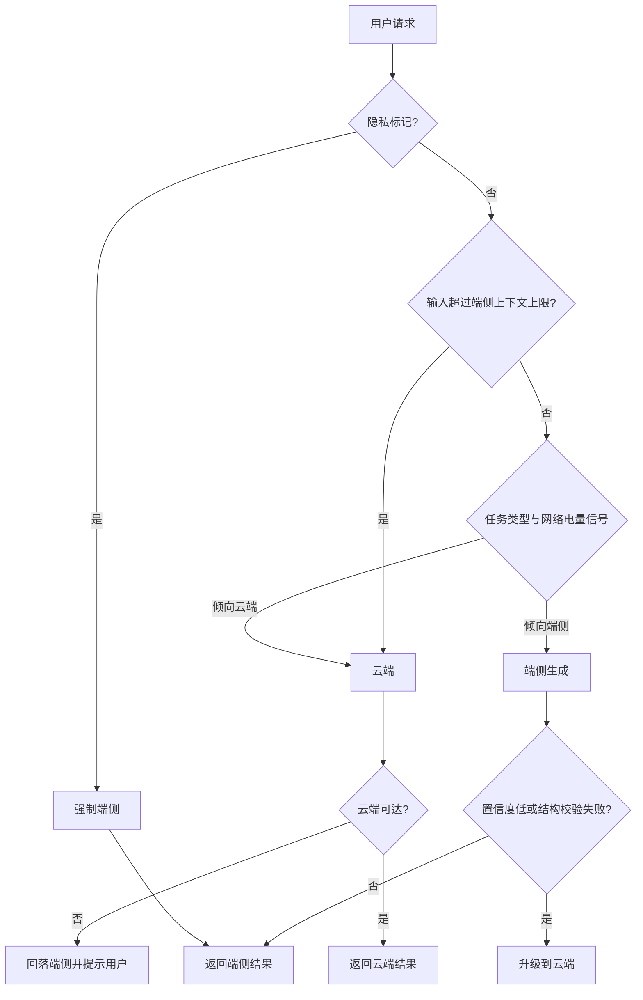
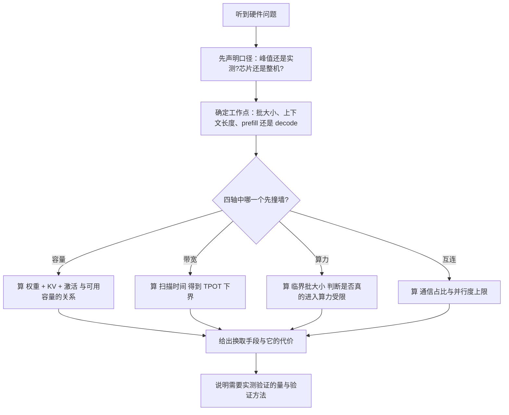

# 硬件、HBM、数据中心与 edge 题组（Q077–Q088）

> 位置：[InferenceAtlas](../../INDEX.md) > [模块 17](README.md) > 当前文档
> 信息截至：2026-07-29 ｜ 最后核验：2026-07-29 ｜ 内容版本：v0.1
> 时效性等级：低
> 相关主题：[模块 07](../07_hardware_and_server_architecture/)｜[第五组题](05_distributed_and_moe_questions.md)｜`07_debug_benchmark_and_reliability_questions.md`

## 本章导读

这一组 12 道题考的是**物理层**：加速器、显存、互连、供电、散热、以及端侧。它与前几组题的最大区别在于**这里的数字是硬约束**——显存装不下就是装不下，带宽只有那么多，机柜的供电上限不能商量。**因此这一组题的正确答案往往是一个不等式，而不是一个优化技巧**。

这组题最容易失分的地方是**引用记不清的规格数字**。面试中说错一个显存容量或带宽数字，比说「我记得是这个量级，具体需要查」要糟得多——**前者暴露了不严谨，后者只是承认了记忆的边界**。更好的策略是**掌握推导方法与量级关系**：会算「多大的批才能让这块卡不再带宽受限」比记住它的标称带宽有用得多。

**关于本章的一个重要说明**：受当前环境的网络出口策略限制（详见 [AGENTS.md 第 11 节](../../AGENTS.md)），本库无法核验任何加速器、内存或服务器产品的规格。因此本章**不包含任何具体产品的参数**，而是给出**推导框架、测量方法与可填充的表格模板**。**这也是本章推荐的答题方式**：给出方法与不等式，把具体数字标注为「需要查证的输入」。

本章按「加速器评估 → 显存与带宽 → 互连 → 供电与散热 → 容量与成本 → 端侧」的顺序组织。

## 学习目标

读完本章后，读者应能够：

1. 用四个轴评估一款加速器是否适合特定推理工作负载
2. 判断显存容量与带宽哪一个先成为瓶颈，并给出临界批大小
3. 解释为什么峰值算力数字不能用于比较推理性能
4. 在三级功耗口径与 PUE 之间正确换算每 token 能耗
5. 从目标 QPS 推导到机柜数量，并说明每一步的假设
6. 说明端侧推理的约束与云端的本质差异，以及端云协同的判据

## 核心结论

- **评估推理加速器只需四个轴**：算力、内存带宽、内存容量、互连带宽。其余规格都是这四者的实现细节。
- **临界批大小 $B^{*} \approx I^{*} b_w / 2$ 决定了一块芯片的工作区间**：批小于它就是带宽受限，此时峰值算力完全无关。
- **峰值算力不可用于比较推理性能**：它假设的数据类型、稀疏性与利用率在推理中几乎从不成立，且不同厂商的口径不一致。
- **功耗必须声明口径**：芯片、板卡、整机三级数字可能相差很大，再乘 PUE 才是设施侧的电力消耗。
- **容量规划必须从「工作点」而不是「峰值指标」出发**：同一块卡在不同批大小与上下文长度下的有效吞吐可以相差数倍。
- **端侧的第一约束是内存容量而非算力**：模型权重加 KV 必须驻留在有限且与系统共享的内存里。

## 1. 问题定义、系统边界与工作负载

本章覆盖 [模块 07](../07_hardware_and_server_architecture/) 的已完成部分，并依赖 [模块 01 第 4–8 章](../01_foundations_and_metrics/04_roofline_and_performance_modeling.md) 的 roofline、成本与能耗模型。数据中心与端侧的部分分别对应 [模块 09](../09_datacenter_power_thermal_and_operations/) 与 [模块 10](../10_edge_and_on_device_inference/)。

**答题的通用起点**是先声明**口径**：这个数字是峰值还是实测、是芯片还是整机、是标称容量还是可用容量。**硬件题的绝大多数争议来自口径不一致，而不是数值本身**。

**本章不含任何需要外部核验的产品规格数字**。题目中出现的参数均为题面给定的假设值，用于演示推导过程；所有涉及具体产品的地方都留作「需要查证的输入」。

### 本章题目一览

| 编号 | 题目 | 难度 | 形式 |
|---|---|---|---|
| Q077 | 评估一款加速器适不适合推理，看什么 | 中等 | 概念 |
| Q078 | 容量和带宽哪个先成为瓶颈 | 高 | 计算 |
| Q079 | 为什么峰值算力不能用来比较推理性能 | 中等 | 概念 |
| Q080 | 单卡装不下模型时有哪些选择 | 高 | 系统设计 |
| Q081 | 互连的层级结构怎么影响部署方案 | 高 | 概念 |
| Q082 | 每 token 能耗怎么算，口径怎么统一 | 高 | 计算 |
| Q083 | 怎么发现服务受到了降频影响 | 中等 | 排查 |
| Q084 | 从目标 QPS 推到需要多少机柜 | 高 | 计算 |
| Q085 | 每百万 token 成本怎么拆解 | 高 | 计算 |
| Q086 | 端侧推理的约束和云端有什么本质不同 | 中等 | 概念 |
| Q087 | 端侧的内存与量化策略怎么设计 | 高 | 系统设计 |
| Q088 | 端云协同推理怎么设计判据 | 高 | 系统设计 |

## 2. 原理、数学与性能模型

这一组题反复用到五个模型：

**（一）四轴评估**。一款加速器对推理的适配性由四个量决定：

| 轴 | 决定什么 | 在什么阶段是瓶颈 |
|---|---|---|
| 算力（有效，不是峰值） | 大批与 prefill 的吞吐 | prefill、大批 decode |
| 内存带宽 | 小批 decode 的时延 | decode（几乎总是） |
| 内存容量 | 模型与 KV 能否装下、并发上限 | 长上下文、大模型 |
| 互连带宽与延迟 | 多卡方案的可行性与上限 | 多卡部署 |

**（二）临界算术强度与临界批大小**。设备的临界算术强度

$$
I^{*} = \frac{\text{FLOPS}}{\text{BW}}
$$

线性层的算术强度约 $2B/b_w$，令其等于 $I^{*}$ 得**临界批大小**

$$
B^{*} \approx \frac{I^{*} b_w}{2}
$$

**批小于 $B^{*}$ 时峰值算力完全用不上**。这是本组题最常用的一个不等式。

**（三）权重扫描时间**。decode 每步至少要把权重读一遍，所以单步时延有下界

$$
\tau_{\text{sweep}} = \frac{M_{\text{weight}} + M_{\text{KV,read}}}{\text{BW}}
$$

**这是一个物理下界，与任何软件优化无关**。它给出「这块卡上这个模型的 TPOT 最好能到多少」的直接答案，是评估硬件是否满足时延 SLO 的第一步。

**（四）有效利用率**。实测性能与峰值之比

$$
\beta = \frac{\text{实测}}{\text{标称峰值}}
$$

**任何容量规划都必须用 $\beta$ 修正后的有效值，而不是峰值**。$\beta$ 依赖工作点、软件栈与形状，**只能实测，不能推断**。

**（五）三级功耗与 PUE**。功耗有三个口径，逐级包含更多部件：

$$
P_{\text{chip}} \ \le\ P_{\text{board}} \ \le\ P_{\text{server}}
$$

芯片功耗不含板上显存与供电损耗；板卡功耗不含主机 CPU、内存、风扇、存储；整机功耗才是机柜供电要承担的量。再乘设施的 PUE 得到总电力：

$$
P_{\text{facility}} = P_{\text{server}} \times \text{PUE}
$$

由此得到每 token 能耗

$$
E_{\text{tok}} = \frac{P_{\text{facility}}}{\text{有效 token 吞吐}}
$$

**分子分母的口径必须一致**：如果分子用整机功耗，分母就必须是这台整机的总吞吐（含所有卡）。完整推导见 [模块 01 第 7 章](../01_foundations_and_metrics/07_energy_efficiency_and_joules_per_token.md)。

## 3. 实现机制与系统设计

以下为本章题库正文。每题的「推荐回答」是**完整答案**，可在 2–5 分钟内口头讲完。

### Q077：评估一款加速器适不适合推理，看什么

**难度**：中等　**形式**：概念　**目标岗位**：Inference / Infrastructure / ML Systems

**考察点**：检验候选人是否有结构化的评估框架，而不是只盯着算力数字。

**题目**：给你一款新的推理加速器的规格表，你会看哪几项、按什么顺序判断它适不适合你的工作负载？

#### 推荐回答

**结论**：只需**四个轴**——算力、内存带宽、内存容量、互连带宽。其余规格都是这四者的实现细节。而**判断顺序取决于工作负载**：延迟敏感的小批服务先看带宽和容量，吞吐导向的大批服务先看算力。

**四个轴分别决定什么**：

| 轴 | 决定 | 什么时候是瓶颈 |
|---|---|---|
| 内存容量 | 模型与 KV 能否装下、并发上限 | 大模型、长上下文 |
| 内存带宽 | 小批 decode 的 TPOT 下界 | decode（几乎总是） |
| 算力 | prefill 时延与大批吞吐 | prefill、大批 decode |
| 互连带宽与延迟 | 多卡方案的可行性与并行度上限 | 多卡部署 |

**评估流程，五步**：

**第一步，容量是否够（硬门槛）**。算

$$
M_{\text{weight}} + M_{\text{KV}}(\text{目标并发}, \text{目标上下文}) + M_{\text{act}} \ \le\ M_{\text{avail}}
$$

**注意 $M_{\text{avail}}$ 不等于标称容量**：要扣除运行时保留、碎片与临时缓冲。**这是一个硬门槛，不满足就只能多卡或量化**。

**第二步，算 TPOT 的物理下界**。decode 每步至少要把权重读一遍：

$$
\tau_{\text{sweep}} = \frac{M_{\text{weight}} + M_{\text{KV,read}}}{\text{BW}}
$$

**这个下界与任何软件优化无关**。如果它已经超过你的 TPOT 目标，这块卡单卡就不可能满足 SLO——**必须多卡分摊或换更小的模型**。**这一步是最有价值的单个计算**，因为它一票否决。

**第三步，算临界批大小判断算力是否相关**。

$$
B^{*} \approx \frac{I^{*} b_w}{2}, \qquad I^{*} = \frac{\text{FLOPS}}{\text{BW}}
$$

**如果你的实际批远小于 $B^{*}$，那么算力数字对你几乎无关**——这块卡的算力再高也用不上。反之如果你的批远大于 $B^{*}$，算力才是主要指标。

**第四步，如果需要多卡，看互连**。张量并行的通信在关键路径上，所以要问「几块卡在同一个高带宽域内」——**这个数直接决定了 TP 的上限**（见第五组题 Q072）。

**第五步，把峰值换成有效值**。以上都用标称参数，而实际性能是标称乘一个有效利用率 $\beta$。**$\beta$ 只能实测**，它依赖软件栈成熟度、算子覆盖度、以及你的模型形状是否与硬件的分块结构匹配。**对新硬件，$\beta$ 往往是最大的不确定性来源**——规格表上很强的芯片可能因为软件不成熟而跑不出性能。

**规格表之外必须问的四个问题**：

1. **软件栈成熟度**：你的模型结构、量化方案、注意力变体是否有可用的高效实现？**没有 kernel 的算力等于没有算力**；
2. **数据类型支持**：峰值算力通常是在某个特定低精度下的数字，**要确认你实际用的精度对应的峰值**；
3. **可用容量的确切数字**：标称与可用之差有时不小；
4. **供电与散热要求**：**如果你的机房无法满足，芯片会降频**，实际性能低于规格（见 Q083）。

**受核验限制的说明**：本回答不引用任何具体产品的参数。评估任何一款加速器时，**上述每一项都应从厂商官方文档取值并标注为 `官方披露`，而 $\beta$ 必须自行实测并标注为 `独立可复现实验`**。

**答题的核心一句话**：先用容量与扫描时间做一票否决，再用临界批大小判断算力是否相关，**最后强调 $\beta$ 只能实测、软件成熟度可能比规格更重要**。

#### 强答案必须覆盖

- 给出四个轴及各自决定什么、何时是瓶颈
- 第一步容量硬门槛，并指出可用容量不等于标称容量
- 第二步扫描时间给出 TPOT 物理下界，可一票否决
- 第三步临界批大小判断算力是否相关
- 第四步互连决定 TP 上限
- 第五步 $\beta$ 只能实测，是新硬件最大的不确定性
- 规格表之外的四个问题，尤其软件栈成熟度
- 明确声明不引用未核验的产品参数

#### 常见错误

- 只看算力数字
- 用标称容量而非可用容量做判断
- 不算扫描时间就讨论时延可行性
- 忽略软件栈成熟度与 $\beta$

#### 可能追问

1. 扫描时间已经超过 TPOT 目标，除了多卡还有什么办法？
2. 怎么设计一组实验来测 $\beta$？
3. 软件栈不成熟的风险怎么量化到选型决策里？
4. 如果你的批远小于临界批大小，两块卡的算力差异还有意义吗？

#### 关联阅读

- [AI 推理硬件总览](../07_hardware_and_server_architecture/01_ai_inference_hardware_overview.md)
- [roofline 与性能建模](../01_foundations_and_metrics/04_roofline_and_performance_modeling.md)
- [容量规划](../01_foundations_and_metrics/08_capacity_planning.md)

### Q078：容量和带宽哪个先成为瓶颈

**难度**：高　**形式**：计算　**目标岗位**：Inference / Infrastructure / ML Systems

**考察点**：检验候选人能否把两个约束写成不等式并比较它们，而不是笼统地说「都重要」。

**题目**：对一个具体的部署场景，内存容量和内存带宽哪一个先成为瓶颈？请给出判断方法，并说明这个答案随什么变化。

#### 推荐回答

**结论**：**两个约束的形式不同，所以要分别写出来比**。容量给出「能装多少并发」的上界，带宽给出「每步最快多久」的下界。**哪一个先撞墙取决于上下文长度**：短上下文时通常带宽先撞墙，长上下文时容量先撞墙。

**容量约束**。可用容量要装下权重、KV、激活与临时缓冲：

$$
M_{\text{weight}} + C \cdot S \cdot m_{\text{tok}} + M_{\text{act}} \ \le\ M_{\text{avail}}
$$

其中 $C$ 是并发请求数、$S$ 是平均上下文长度、$m_{\text{tok}}$ 是每 token 的 KV 字节数。解出并发上界：

$$
C_{\max} = \frac{M_{\text{avail}} - M_{\text{weight}} - M_{\text{act}}}{S \cdot m_{\text{tok}}}
$$

**注意 $C_{\max}$ 与 $S$ 成反比**：上下文翻倍，并发上限减半。

**带宽约束**。decode 每步要读权重与批内全部 KV：

$$
\tau_{\text{step}} \ \ge\ \frac{M_{\text{weight}} + C \cdot S \cdot m_{\text{tok}}}{\text{BW}_{\text{eff}}}
$$

**注意分子与容量约束的左边几乎相同**——这不是巧合：**每步要读的东西就是显存里装着的东西**（除了激活与临时缓冲）。

**这个观察给出一个漂亮的结论**。把容量约束取等号（即显存刚好装满）代入带宽约束：

$$
\tau_{\text{step}} \ \ge\ \frac{M_{\text{avail}} - M_{\text{act}}}{\text{BW}_{\text{eff}}} \ \approx\ \frac{M_{\text{avail}}}{\text{BW}_{\text{eff}}}
$$

**也就是说：当显存被装满时，单步时延的下界就是「把整个显存读一遍的时间」**，这个量只由硬件决定，与模型和工作负载无关。**记作 $\tau_{\text{full}} = M_{\text{avail}} / \text{BW}_{\text{eff}}$，它是这块卡的一个固有属性**。

**由此得到一个非常有用的判据**：

- 如果你的 TPOT 目标 $> \tau_{\text{full}}$，**那么你可以把显存装满，容量是先撞墙的约束**——并发受容量限制，而带宽还有余量；
- 如果你的 TPOT 目标 $< \tau_{\text{full}}$，**那么你不能把显存装满，带宽是先撞墙的约束**——为了满足时延，你必须让在飞的 KV 少于显存容量。

**这个判据把两个看起来不可比的约束统一起来了**，而 $\tau_{\text{full}}$ 是一个纯硬件量。**能给出这一步，是这道题的强答案标志**。

**答案随什么变化，四个因素**：

| 因素 | 变化 | 更容易撞的墙 |
|---|---|---|
| 上下文变长 | KV 项占比上升 | 容量 |
| 模型变大（权重占比高） | 权重项主导 | 带宽（权重每步都读） |
| KV 量化 | $m_{\text{tok}}$ 下降 | 缓解两者 |
| 权重量化 | $M_{\text{weight}}$ 下降 | 缓解两者 |

**第二行值得说明**：权重是「每步都要完整读一遍」的，而 KV 是「每步读在飞请求的那部分」。**所以权重占比高的配置更容易被带宽限制**，而 KV 占比高的配置更容易被容量限制。

**一个重要的实际修正**：$M_{\text{avail}}$ 不是标称容量。要扣除运行时保留、分页管理的内部碎片、以及临时缓冲的峰值。**用标称容量算出的 $C_{\max}$ 会系统性偏高**，在生产里表现为「按计算应该能跑但实际 OOM」。

**答题的核心一句话**：容量给上界、带宽给下界，**用 $\tau_{\text{full}} = M_{\text{avail}}/\text{BW}$ 与 TPOT 目标比较，就能判断哪一个先撞墙**。

#### 强答案必须覆盖

- 分别写出容量约束（并发上界）与带宽约束（单步下界）
- 指出两者分子几乎相同：每步读的就是显存装的
- 推出 $\tau_{\text{full}} = M_{\text{avail}}/\text{BW}_{\text{eff}}$ 这个纯硬件量
- 给出判据：TPOT 目标与 $\tau_{\text{full}}$ 比较决定哪个先撞墙
- $C_{\max}$ 与上下文长度成反比
- 四个影响因素表，说明权重占比高更易被带宽限制
- 指出可用容量不等于标称容量，否则 $C_{\max}$ 系统性偏高

#### 常见错误

- 笼统回答「两个都重要」
- 用标称容量算并发上限
- 不区分权重（每步全读）与 KV（读在飞部分）
- 给不出统一比较两个约束的方法

#### 可能追问

1. $\tau_{\text{full}}$ 这个量在选型时怎么用？
2. KV 量化对两个约束的缓解程度一样吗？
3. 分页管理的内部碎片大概占多少？怎么测？
4. 如果 TPOT 目标恰好接近 $\tau_{\text{full}}$，你会怎么配置？

#### 关联阅读

- [AI 推理硬件总览](../07_hardware_and_server_architecture/01_ai_inference_hardware_overview.md)
- [KV cache 容量与内存模型](../02_transformer_and_kv_cache/05_kv_cache_capacity_and_memory_models.md)
- [内存带宽与算术强度](../01_foundations_and_metrics/05_memory_bandwidth_and_arithmetic_intensity.md)

### Q079：为什么峰值算力不能用来比较推理性能

**难度**：中等　**形式**：概念　**目标岗位**：Inference / Infrastructure / ML Systems

**考察点**：检验候选人是否理解峰值数字的口径问题以及推理阶段的实际瓶颈。

**题目**：两块加速器的规格表上都写着峰值算力，为什么不能直接用这个数字比较它们的推理性能？

#### 推荐回答

**结论**：三个原因——**峰值数字的口径可能不同**（数据类型、是否含稀疏加速）、**decode 阶段根本用不上算力**（带宽受限）、**实测与峰值之间有一个只能测出来的利用率 $\beta$**。

**原因一：口径不同，数字不可比**。峰值算力至少要问清四件事：

1. **哪种数据类型**。低精度的峰值通常远高于高精度。**如果两块卡报的是不同精度的峰值，数字直接不可比**；
2. **是否包含稀疏加速**。有些峰值数字假设了特定的稀疏模式，**而这个模式在推理中通常不成立**；
3. **是否是持续可达的频率**。峰值按最高频率算，而持续高负载下芯片可能因功耗或温度降频（见 Q083）；
4. **是否含累加精度的差异**。同样的输入精度，不同的累加精度对应不同的吞吐与数值行为。

**所以第一步永远是把两个数字换算到同一口径**——而这往往会改变结论。

**原因二：decode 阶段用不上算力**。这是更根本的原因。线性层的算术强度约 $2B/b_w$，临界算术强度 $I^{*} = \text{FLOPS}/\text{BW}$，临界批大小 $B^{*} \approx I^{*} b_w / 2$。

**decode 时批等于在飞请求数，通常远小于 $B^{*}$**，所以这一阶段的时延由带宽决定，**算力有多余都用不上**。

**这里有一个值得指出的反直觉之处**：算力越高的卡，$I^{*}$ 越大，$B^{*}$ 也越大——**也就是说算力更强的卡需要更大的批才能脱离带宽受限**。如果你的工作负载是小批延迟敏感的，**买算力更强的卡可能一点收益也没有，除非它的带宽也同比提高**。

**原因三：$\beta$ 只能实测**。实际达到的性能是

$$
\text{实测} = \beta \times \text{峰值}
$$

而 $\beta$ 依赖：软件栈是否有针对你的模型结构的高效实现、你的矩阵形状是否与硬件的分块粒度匹配、算子覆盖度（不支持的算子会回退到慢路径）、以及 kernel 启动开销在你的工作点上的占比。

**$\beta$ 的差异可以完全掩盖峰值的差异**。一块峰值更高但软件不成熟的卡，实际性能可能低于峰值较低但软件成熟的卡。**这是新硬件选型最大的风险，而它在规格表上完全看不到**。

**那应该比什么**。四个层次，从差到好：

| 比较对象 | 有效性 |
|---|---|
| 峰值算力 | 几乎无效（除大批 prefill） |
| 峰值带宽 | 对 decode 有指示性，但仍是峰值 |
| 你的模型的扫描时间 $\tau_{\text{sweep}}$ | 有效：给出 TPOT 物理下界 |
| **在你的工作点上的实测吞吐与时延** | **最有效** |

**最后一行是唯一真正可比的东西**，而它要求同一个模型、同一个量化方案、同一组输入输出长度、同一个并发水平、同一个分位数口径。**任何一项不同，比较就失效**——这与「如何读 benchmark」是同一个问题（见 [模块 01 第 9 章](../01_foundations_and_metrics/09_inference_metrics_cheat_sheet.md)）。

**答题的核心一句话**：峰值算力在推理里几乎总是错的比较对象，**因为 decode 是带宽受限的、口径可能不同、而 $\beta$ 只能实测**；**正确的比较是在同一工作点上的实测值**。

#### 强答案必须覆盖

- 原因一：口径问题（数据类型、稀疏、频率、累加精度）
- 原因二：decode 带宽受限，算力用不上
- 反直觉点：算力更高的卡临界批更大，小批场景可能零收益
- 原因三：$\beta$ 只能实测，可完全掩盖峰值差异
- 指出新硬件的软件成熟度风险在规格表上看不到
- 给出四个层次的比较对象，指出只有同工作点实测才真正可比
- 列出「同工作点」的具体含义（模型、量化、长度、并发、分位数）

#### 常见错误

- 直接用峰值算力比较
- 不问峰值对应的数据类型与是否含稀疏
- 认为软件成熟度不影响选型
- 比较实测值时不控制工作点

#### 可能追问

1. 怎么设计一组实验让两块卡的比较是公平的？
2. 如果只能拿到规格表，你最看重哪一项？
3. $\beta$ 在新硬件上大概怎么估？有没有代理指标？
4. 什么情况下峰值算力确实是有意义的比较对象？

#### 关联阅读

- [AI 推理硬件总览](../07_hardware_and_server_architecture/01_ai_inference_hardware_overview.md)
- [面向推理的 GPU 架构](../07_hardware_and_server_architecture/02_gpu_architecture_for_inference.md)
- [推理指标速查](../01_foundations_and_metrics/09_inference_metrics_cheat_sheet.md)

### Q080：单卡装不下模型时有哪些选择

**难度**：高　**形式**：系统设计　**目标岗位**：Inference / Infrastructure / ML Systems

**考察点**：检验候选人是否知道全部选项（包括容易被忽略的换入换出与降低目标），以及是否会比较它们的代价。

**题目**：一个模型的权重加上目标并发的 KV 超过了单卡可用显存。请列出所有可行的选择，并给出比较它们的方法。

#### 推荐回答

**结论**：**六个选择**——量化、降低目标（并发或上下文）、多卡并行、权重换入换出、KV 卸载到主机内存、换更小的模型。比较它们的统一方法是**算「每单位有效吞吐的成本」并检查时延是否仍达标**。

**先把约束写清楚**：

$$
M_{\text{weight}} + C \cdot S \cdot m_{\text{tok}} + M_{\text{act}} \ >\ M_{\text{avail}}
$$

**六个选择就是分别减小左边的各项、或增大右边**：

**（一）量化，减小 $M_{\text{weight}}$ 与 $m_{\text{tok}}$**。代价是精度风险与 kernel 可用性。**这通常是第一选择**，因为它同时缓解容量与带宽（见第四组题 Q050），而且不增加硬件成本。**判据是精度是否在可接受范围内，只能实测**。

**（二）降低目标，减小 $C$ 或 $S$**。**这个选项最常被忽略，但它经常是正确的**。如果目标并发或最大上下文是拍脑袋定的，**先确认它是否真的必要**：看实际请求的上下文长度分布——如果 99% 的请求上下文不超过某个长度，**按最长的 1% 配容量是巨大的浪费**。代价是长请求被拒绝或走单独的路径。

**（三）多卡并行，增大 $M_{\text{avail}}$**。张量并行同时分摊权重、KV 与算力，但引入每层两次归约；流水并行只分摊权重（KV 也按层分摊），通信少但不降时延且有气泡。**代价是通信开销、组可用性 $a^n$ 下降、以及成本按卡数线性上升**。注意 TP 有 $H_{kv}$ 可除性的上限（见第五组题 Q061）。

**（四）权重换入换出**。把部分权重放在主机内存，按需换入。**判据是换入时间能否被计算掩盖**：

$$
\frac{M_{\text{layer}}}{\text{BW}_{\text{host-link}}} \ \le\ T_{\text{compute}}(\text{前若干层})
$$

**主机链路带宽通常远低于显存带宽**，而 decode 每步都要读全部权重——**所以这个方案在 decode 阶段几乎必然把 TPOT 拖到不可接受**。它对**大批离线批处理**可能可行（计算时间长，能掩盖换入），**对在线小批服务基本不可行**。这个区分很重要。

**（五）KV 卸载到主机内存**。把不活跃请求的 KV 换出。**判据是换出换入的时间与该请求的等待时间的比较**：如果一个请求要等待很久（如等工具返回），换出它的 KV 是划算的——条件是 $T_{\text{wait}} > 2 M_{\text{KV,req}} / \text{BW}_{\text{link}}$（换出加换入）。**对活跃请求换出是不可行的**，因为每步都要读。

**（六）换更小的模型**。**这也是一个应该被明确评估而不是默认排除的选项**。如果任务允许，一个小模型加上更好的检索、或者小模型加大模型的级联（见第三组题 Q039），**可能在同等质量下成本低得多**。

**统一的比较方法**。对每个方案算三个量：

| 量 | 怎么算 |
|---|---|
| 是否满足时延 SLO | 算该方案下的 TPOT 与 TTFT，与目标比 |
| 有效吞吐 | 该方案下的实际 token/秒（含通信与换入开销） |
| 单位成本 | 硬件成本 ÷ 有效吞吐 |

**先用第一列筛掉不满足时延的方案，再按第三列排序**。**这个顺序很重要**：换入换出方案往往在成本上看起来最好，但会被第一列筛掉。

**还要检查两个非性能因素**：

1. **可靠性**：多卡方案的组可用性是 $a^n$，需要更多副本；
2. **运维复杂度**：换入换出与多卡都增加了故障模式的数量。

**答题的核心一句话**：六个选项对应约束式里的各项，**其中「降低目标」和「换更小的模型」最常被忽略但经常正确**；**比较时先用时延筛选，再按单位成本排序**。

#### 强答案必须覆盖

- 把约束写成不等式，六个选项对应减小各项或增大可用容量
- 量化通常是第一选择，同时缓解容量与带宽
- 「降低目标」最常被忽略，应先看上下文长度分布
- 多卡并行的三项代价：通信、$a^n$、成本线性上升
- 权重换入换出的判据，并指出 decode 阶段基本不可行、离线批处理可能可行
- KV 卸载的判据是等待时间超过两次传输时间，活跃请求不可换出
- 「换更小的模型」应被明确评估而非默认排除
- 统一比较：先用时延筛选，再按单位成本排序，并检查可靠性与运维复杂度

#### 常见错误

- 只想到多卡一个选项
- 不评估「降低目标」是否可行
- 把权重换入换出当成在线服务的可行方案
- 只比成本不先筛时延

#### 可能追问

1. 上下文长度分布很重尾，长请求怎么单独处理？
2. 换入换出在离线批处理下的收益怎么估？
3. TP 和 PP 都能解决显存，怎么二选一？
4. 级联方案的质量怎么验证？

#### 关联阅读

- [AI 推理硬件总览](../07_hardware_and_server_architecture/01_ai_inference_hardware_overview.md)
- [KV cache 容量与内存模型](../02_transformer_and_kv_cache/05_kv_cache_capacity_and_memory_models.md)
- [分布式推理总览](../06_distributed_and_moe_inference/01_distributed_inference_overview.md)

### Q081：互连的层级结构怎么影响部署方案

**难度**：高　**形式**：概念　**目标岗位**：Inference / Infrastructure / ML Systems

**考察点**：检验候选人是否理解「不同并行方式应该放在不同层级」这个映射关系。

**题目**：服务器与集群的互连是分层的：芯片内、板内、节点内、跨节点。请说明这个层级结构如何约束推理部署方案。

#### 推荐回答

**结论**：层级结构的核心事实是**每往外一层，延迟上升、带宽下降**，而**不同并行方式对延迟与带宽的敏感度不同**，因此存在一个从「并行方式」到「层级」的正确映射。**违反这个映射是分布式推理最常见的配置错误**。

**层级的定性特征**（不引用具体数字）：

| 层级 | 延迟 | 带宽 | 典型规模 |
|---|---|---|---|
| 芯片内（片上互连） | 最低 | 最高 | 单芯片内的计算单元 |
| 设备间高带宽域 | 低 | 高 | 若干设备 |
| 节点内（经主机链路） | 中 | 中 | 一台服务器内的设备 |
| 跨节点（网络） | 高 | 低 | 机架内到机架间 |

**具体的带宽与延迟数字在当前环境下无法核验，因此这里只给相对关系**。读者应从厂商官方文档填入实际值并标注 `官方披露`。

**映射规则**。按「通信频率 × 是否在关键路径 × 是否可重叠」排序：

| 并行方式 | 通信特征 | 应放的层级 | 违反的后果 |
|---|---|---|---|
| 张量并行 | 每层两次、同步、关键路径、不可重叠 | **高带宽域内** | 跨节点后通信占比可能翻数倍 |
| 专家并行 | 每 MoE 层两次 all-to-all、数据量不均 | 节点内 | 小消息延迟累加严重 |
| 序列并行 | 每块一次、可重叠（有条件） | 节点内优先 | 重叠条件在低带宽下更难满足 |
| 流水并行 | 每级一次、点对点 | 可跨节点 | 影响较小 |
| 多副本 | 无跨副本通信 | 任意 | 无 |

**「高带宽域能放多少设备」是一个关键的部署参数**：它直接决定了张量并行的实际上限。**这个数字应该在选型阶段就问清楚**，因为它比单卡的算力更能决定你能部署多大的模型。

**三个具体的约束推论**：

**（一）TP 度数不应超过高带宽域的设备数**。超过之后一部分归约要跨越更慢的层级，按 Amdahl 形式 $(1-f) + f\kappa$，**即使只有一小部分通信跨层，$\kappa$ 大时整体也显著恶化**（见第五组题 Q072）。

**（二）KV 传输的路径要单独考虑**。PD 分离或缓存共享需要传 KV，**这类通信是大消息、带宽敏感、但不在每步的关键路径上**——与 TP 归约的特征恰好相反。**所以理想的部署需要「低延迟小消息路径」与「高带宽大消息路径」两种能力**，它们可能需要不同的处理（不同的队列、优先级或物理路径）。

**（三）层级也是故障域**。同一节点共享电源与主板，同一机架共享供电与交换。**「组内集中」提高了性能但也把整组放进了同一个故障域**——这是性能与可靠性的直接冲突，解决办法是让不同的并行组落在不同故障域（见 Q072）。

**一个容易被忽略的实际问题：放置策略需要被强制执行**。写了「TP 组必须在同一高带宽域内」不等于调度器会遵守它。**如果调度系统不理解这个约束，它可能把一个组分散到多个节点**，而症状是「性能突然变差且找不到原因」。**所以必须有两件事**：调度层的亲和性约束，以及**启动时的自检**（服务启动时验证自己的组成员是否在预期的层级内，不满足则告警或拒绝启动）。

**答题的核心一句话**：层级结构的约束体现为**「从并行方式到层级的映射」**，映射规则是按通信频率与可重叠性排序；**而这个约束必须在调度层被强制执行并在启动时自检**。

#### 强答案必须覆盖

- 给出层级的相对特征（延迟上升、带宽下降），不引用未核验数字
- 给出并行方式到层级的映射表与违反后果
- 指出「高带宽域的设备数」直接决定 TP 上限，是关键选型参数
- 推论一：跨层的 Amdahl 惩罚
- 推论二：KV 传输与 TP 归约的需求相反，需要两种网络能力
- 推论三：层级同时是故障域，性能与可靠性冲突
- 强调放置约束必须在调度层强制执行并在启动时自检

#### 常见错误

- 只说「尽量放近」不给映射规则
- 把 TP 跨节点部署
- 不区分 KV 传输与集合通信的不同需求
- 假设写了放置策略就会被执行

#### 可能追问

1. 启动自检具体检查什么？怎么获得拓扑信息？
2. 如果高带宽域只有 4 个设备但需要 8 路 TP，怎么办？
3. 两种网络能力如何在同一套物理网络上区分？
4. 调度器的亲和性约束怎么表达？

#### 关联阅读

- [AI 推理硬件总览](../07_hardware_and_server_architecture/01_ai_inference_hardware_overview.md)
- [多节点服务拓扑](../06_distributed_and_moe_inference/09_multi_node_serving_topologies.md)
- [张量并行推理](../06_distributed_and_moe_inference/02_tensor_parallel_inference.md)
- [模块 08：网络与互连](../08_networking_and_interconnect/)

### Q082：每 token 能耗怎么算，口径怎么统一

**难度**：高　**形式**：计算　**目标岗位**：Inference / Infrastructure / ML Systems

**考察点**：检验候选人是否掌握三级功耗口径与 PUE，这是能效讨论中最常见的口径混乱。

**题目**：有人说他们的服务「每 token 能耗」是某个数值。要判断这个数字是否可比，你会问哪些问题？请给出正确的计算方法。

#### 推荐回答

**结论**：这个数字必须声明**四件事**才可比——**功耗的口径**（芯片/板卡/整机）、**是否含 PUE**、**分母的吞吐是在什么工作点测的**、**是否含空闲功耗**。**四者任一不同，数字就不可比**，而它们造成的差异可能很大。

**正确的计算方法**。基本式是

$$
E_{\text{tok}} = \frac{P}{\text{吞吐}}
$$

单位是「瓦 ÷ (token/秒)」＝「焦耳/token」。**关键在于分子分母的口径必须一致**。

**分子的三级口径**：

| 口径 | 包含 | 不包含 |
|---|---|---|
| 芯片功耗 | 计算芯片本身 | 板上内存、供电转换损耗、散热 |
| 板卡功耗 | 芯片 + 板上内存 + 板上供电 | 主机 CPU、系统内存、风扇、存储、网卡 |
| 整机功耗 | 整台服务器（含全部加速卡与主机部件） | 设施侧的制冷与配电损耗 |

**三者可能相差很大**，因为主机部件与供电损耗都不小。**用芯片功耗报出的每 token 能耗会系统性偏低**。

再往上一级是设施：

$$
P_{\text{facility}} = P_{\text{server}} \times \text{PUE}
$$

PUE 是设施总电力与 IT 设备电力之比，恒大于 1。**「每 token 能耗」如果用于讨论环境影响或电费，必须含 PUE；如果用于比较硬件效率，则应不含 PUE 并明确说明**。

**分母的工作点问题**。吞吐随工作点剧烈变化：

| 工作点 | 吞吐 | 每 token 能耗 |
|---|---|---|
| 大批、算力饱和 | 高 | **最低** |
| 小批、带宽受限 | 低 | 高（功耗没同比下降） |
| 空闲但通电 | 接近 0 | 趋于无穷 |

**这张表的关键含义是：每 token 能耗的最优点在大批**，**而延迟敏感的小批服务在能效上天然更差**。所以**报一个「每 token 能耗」而不说批大小与时延，是没有信息量的**——**它可以通过牺牲时延任意压低**。

**因此正确的报告方式是一条曲线或一组配对值**：「在 TPOT ≤ 某个目标的约束下，每 token 能耗是多少」。**能效必须与时延一起报，就像吞吐必须与时延一起报一样**。

**空闲功耗的处理**。如果按「运行时功耗 ÷ 运行时吞吐」算，**会忽略服务在低谷期的空闲功耗**。而实际的电费与碳排放是按整个时间段算的。所以要区分：

- **边际能耗**：多产生一个 token 的增量能耗（用于优化决策）；
- **摊薄能耗**：一段时间的总电力 ÷ 该时间段的总 token 数（用于成本与环境核算）。

**两者可能差很多**，取决于平均利用率。**利用率低的服务，摊薄能耗远高于边际能耗**——这也说明**提高利用率是能效优化中最有效的手段之一**，而它是一个调度问题而不是硬件问题。

**要问的问题清单**：

1. 功耗是芯片、板卡还是整机？
2. 是否含 PUE？PUE 取值多少？
3. 吞吐是在什么批大小、什么输入输出长度下测的？
4. 对应的时延（TTFT / TPOT）是多少？
5. 是边际能耗还是摊薄能耗？如果是摊薄，平均利用率多少？
6. 是实测还是按 TDP 推算的？（**按 TDP 推算会高估功耗**，因为实际功耗常低于 TDP 上限。）

**受核验限制的说明**：本回答不给出任何具体的功耗、PUE 或能耗数值。所有这些量都应实测或从设施与厂商的官方数据获取，并标注相应的披露级别。

**答题的核心一句话**：每 token 能耗只有在**声明了功耗口径、是否含 PUE、测量工作点、时延约束、以及边际还是摊薄**之后才是一个有意义的数字；**而它可以通过牺牲时延任意压低，所以必须与时延配对报告**。

#### 强答案必须覆盖

- 列出必须声明的四件事：功耗口径、是否含 PUE、工作点、是否含空闲
- 给出三级功耗口径表及各自包含与不包含的部件
- PUE 的定义与「何时该含、何时不该含」的区分
- 工作点对能耗的影响表，指出大批能效最优、小批天然更差
- 关键结论：能耗可通过牺牲时延任意压低，必须与时延配对报告
- 区分边际能耗与摊薄能耗，并指出提高利用率是有效手段
- 给出六项提问清单，含「是否按 TDP 推算」
- 声明不给出未核验的功耗与 PUE 数值

#### 常见错误

- 不问功耗口径就接受数字
- 报每 token 能耗不说时延
- 混淆边际与摊薄能耗
- 用 TDP 当实际功耗

#### 可能追问

1. 为什么用 TDP 推算会高估？差多少量级？
2. 边际能耗和摊薄能耗差很大时，优化方向有什么不同？
3. 提高利用率来改善能效，会不会损害时延？
4. 怎么在服务里持续测量整机功耗？

#### 关联阅读

- [能效与每 token 焦耳](../01_foundations_and_metrics/07_energy_efficiency_and_joules_per_token.md)
- [成本建模与单位经济学](../01_foundations_and_metrics/06_cost_modeling_and_unit_economics.md)
- [AI 推理硬件总览](../07_hardware_and_server_architecture/01_ai_inference_hardware_overview.md)
- [模块 09：数据中心供电、散热与运营](../09_datacenter_power_thermal_and_operations/)

### Q083：怎么发现服务受到了降频影响

**难度**：中等　**形式**：排查　**目标岗位**：Inference / Infrastructure / ML Systems

**考察点**：检验候选人是否知道硬件性能不是常数，以及是否会把物理层纳入排查范围。

**题目**：你怀疑推理服务的性能波动与硬件降频有关。请说明降频的机制、它在监控上的表现、以及怎么确认与缓解。

#### 推荐回答

**结论**：降频是芯片在**功耗超限或温度超限**时主动降低频率以自保。它的特征表现是**「性能随时间缓慢下降然后稳定在一个较低水平」**，而不是突然的阶跃——**这个时间形态是最有辨识度的信号**。

**两种降频机制**：

| 触发条件 | 机制 | 时间形态 |
|---|---|---|
| 功耗超过限制 | 降频以把功耗压回限值内 | 高负载一开始就发生，较快 |
| 温度超过阈值 | 降频以降低发热 | **有热惯性，负载开始后逐渐发生** |

**第二行的时间形态是关键诊断特征**。散热受限的降频不会立刻出现：芯片和散热系统有热容，**所以典型形态是「负载开始后性能良好，几十秒到几分钟后逐渐下降，最后稳定在一个较低的平台」**。

**这个形态解释了一类常见的困惑**：**基准测试跑得很好，上线后性能达不到测试值**。如果基准测试是短时间的（几十秒），**它可能完全跑在降频发生之前**，而生产是持续负载。**所以性能测试必须跑到热稳态**——这是一个很实际的方法论要点。

**监控上的表现，四个信号**：

1. **芯片频率**：最直接的信号，应该被常态监控；
2. **芯片温度与功耗**：与频率同时看，用来区分是温度触发还是功耗触发；
3. **同一工作点下的实测吞吐随时间下降**：这是没有频率监控时的替代信号；
4. **同型号设备之间的性能差异**：**如果同一批卡里有几张持续偏慢，很可能是它们的位置散热更差**（例如机箱内的气流下游、或机柜的上部）。

**第四个信号最有价值也最容易被忽略**。它要求**按设备而不是按聚合值监控性能**——这与第五组题 Q076 中「比较各设备时间线」是同一个方法。

**确认流程**：

1. **在受控条件下复现**：跑一个固定的持续负载，同时记录频率、温度、功耗、吞吐四条曲线；
2. **看四条曲线的时序关系**：温度先上升、然后频率下降、然后吞吐下降 → 温度触发；功耗触顶、频率立即下降 → 功耗触发；
3. **改变环境验证**：如果降低环境温度或改善气流后现象消失，确认是散热问题。

**缓解手段，分层**：

| 层次 | 手段 | 代价 |
|---|---|---|
| 设施 | 改善制冷与气流、降低进风温度 | 设施改造成本、PUE 可能上升 |
| 机柜 | 降低单柜功率密度（少装设备） | 单位面积算力下降 |
| 配置 | 主动限制功耗上限 | 峰值性能下降但**更稳定** |
| 调度 | 把落后的设备标记为降级容量 | 有效容量下降 |
| 软件 | 降低工作强度（如减小批） | 吞吐下降 |

**第三行值得说明**：主动设一个略低的功耗上限，**会降低峰值性能但让性能变得可预测**。对时延 SLO 敏感的服务，**「稳定的较低性能」常常优于「波动的较高性能」**——因为容量规划是按可保证的性能做的，**波动的峰值无法被计入容量**。这是一个反直觉但重要的取舍。

**对容量规划的影响**。降频意味着实际可用算力低于标称，**所以容量规划必须用热稳态下的实测值**。**用短时测试或标称值做规划会系统性地高估容量**，表现为「上线后容量不够但找不到明显原因」。

**答题的核心一句话**：降频的辨识特征是**「负载开始后性能逐渐下降然后稳定在较低平台」**；监控上要按设备看频率、温度与吞吐；**而对 SLO 敏感的服务，主动限功耗换稳定性常常是正确的取舍**。

#### 强答案必须覆盖

- 区分功耗触发与温度触发，并指出温度触发有热惯性
- 关键诊断特征是「逐渐下降然后稳定在较低平台」的时间形态
- 解释「基准测试好但上线达不到」，指出测试必须跑到热稳态
- 四个监控信号，尤其按设备比较以发现位置导致的散热差异
- 确认流程：受控复现、看四条曲线时序、改变环境验证
- 分层缓解手段表（设施/机柜/配置/调度/软件）
- 指出主动限功耗换稳定性对 SLO 敏感服务常是正确取舍
- 容量规划必须用热稳态实测值，否则系统性高估

#### 常见错误

- 假设芯片总能跑在标称频率
- 性能测试只跑几十秒就下结论
- 只看聚合性能，发现不了单设备散热问题
- 认为峰值性能越高越好，忽略可预测性

#### 可能追问

1. 热稳态需要跑多久？怎么判断已经稳定？
2. 主动限功耗的上限怎么定？
3. 机柜内不同位置的设备性能差异，怎么在调度上处理？
4. 降频导致的容量损失怎么量化到容量规划里？

#### 关联阅读

- [面向推理的 GPU 架构](../07_hardware_and_server_architecture/02_gpu_architecture_for_inference.md)
- [容量规划](../01_foundations_and_metrics/08_capacity_planning.md)
- [能效与每 token 焦耳](../01_foundations_and_metrics/07_energy_efficiency_and_joules_per_token.md)
- [模块 09：数据中心供电、散热与运营](../09_datacenter_power_thermal_and_operations/)

### Q084：从目标 QPS 推到需要多少机柜

**难度**：高　**形式**：计算　**目标岗位**：Inference / Infrastructure / ML Systems

**考察点**：检验候选人能否完成一条完整的容量推导链，并诚实标注每一步的不确定性。

**题目**：给定目标 QPS、平均输入输出长度与时延 SLO，请推导需要多少台服务器与多少个机柜，并说明每一步的假设。

#### 推荐回答

**结论**：推导链是**「QPS → 每请求的资源消耗 → 单机有效吞吐 → 机器数 → 加冗余 → 按机柜供电上限折算机柜数」**。**每一步都有假设，而最大的不确定性在「单机有效吞吐」这一项**——它必须实测。

**第一步，把 QPS 换成 token 速率**。设目标 $\lambda$ 请求/秒、平均输入 $S_{\text{in}}$、平均输出 $S_{\text{out}}$：

$$
R_{\text{prefill}} = \lambda S_{\text{in}} \ (\text{token/s}), \qquad R_{\text{decode}} = \lambda S_{\text{out}} \ (\text{token/s})
$$

**必须分开算，因为两者的瓶颈资源不同**（prefill 算力受限、decode 带宽受限）。**用「总 token 速率」一个数会算错**。

**假设 1**：$S_{\text{in}}$ 与 $S_{\text{out}}$ 用均值。**但两者都是重尾分布**，所以后面要用分位数留余量。

**第二步，测单机有效吞吐——这是关键且只能实测的一步**。在满足时延 SLO 的约束下，测单台服务器能达到的：

- $T_{\text{prefill}}$：prefill token/秒；
- $T_{\text{decode}}$：decode token/秒。

**「在满足时延 SLO 的约束下」是这一步的核心**。吞吐可以通过增大批任意提高，**但批越大 TPOT 越差**——所以必须先固定 SLO，再找该约束下的最大吞吐工作点。**这个工作点上的吞吐才是可用于规划的数字**。

**假设 2**：实测是在热稳态下做的（见 Q083），否则会高估。

**假设 3**：实测的输入输出长度分布与生产一致。**长度分布不同会显著改变吞吐**，因为 KV 占用与批大小都受它影响。

**第三步，算所需机器数**。两个约束分别算，取较大者：

$$
N_{\text{base}} = \max\left(\frac{R_{\text{prefill}}}{T_{\text{prefill}}}, \ \frac{R_{\text{decode}}}{T_{\text{decode}}}\right)
$$

**如果做了 PD 分离，则是两个独立的池，分别算**（见第五组题 Q071）。

**第四步，加上三类余量**。

| 余量 | 为什么需要 | 量级依据 |
|---|---|---|
| 峰谷余量 | 流量有日内与周内波动 | 峰值 QPS ÷ 平均 QPS |
| 长度尾部余量 | 输入输出长度重尾 | 用高分位数而非均值重算一遍 |
| 故障余量 | 机器会坏、要能滚动升级 | $R-k$ 个可容忍故障（见 Q075） |

**三者是乘性叠加的**：

$$
N = N_{\text{base}} \times f_{\text{peak}} \times f_{\text{tail}} \times f_{\text{fault}}
$$

**这个乘积可能相当大**，所以要逐项说明依据而不是拍一个总系数。**能逐项列出并给出依据，是这道题最能体现严谨性的地方**。

**假设 4**：峰值系数来自历史流量数据。**新服务没有历史数据，此时应该说明这是最大的未知项**，并设计成能快速扩容而不是一次性买够。

**第五步，从机器数到机柜数**。约束是机柜的供电与散热上限：

$$
N_{\text{rack}} = \left\lceil \frac{N \times P_{\text{server}}}{P_{\text{rack,limit}}} \right\rceil
$$

**注意三点**：

1. **$P_{\text{server}}$ 是整机功耗，不是芯片或板卡功耗**（见 Q082）；
2. **$P_{\text{rack,limit}}$ 通常由散热而非配电决定**，而且要留余量——**跑在机柜供电上限附近会触发降频**；
3. **物理空间也是约束**：机柜的机位数可能先于供电上限被用完，或者反过来（高功耗设备会让供电先满而机位空着）。**两个约束都要检查，取较紧的**。

**第六步，反向校验**。用得到的机柜数反算：

- 总电力（含 PUE）是否在设施能力内；
- 每 token 能耗与成本是否符合预期（见 Q082、Q085）；
- **网络拓扑是否支持你的并行方案**（高带宽域够不够，见 Q081）。

**最后一项经常被漏掉**：机器数够了但拓扑不对，**并行组被迫跨节点，实际吞吐低于规划**。

**必须明确声明的不确定性排序**：

1. **单机有效吞吐**（只能实测，且依赖软件栈成熟度）；
2. **峰值系数**（依赖流量预测）；
3. **长度分布**（可能随产品演进大幅变化）；
4. 硬件规格（可从官方文档核验）。

**前三项都不是查文档能得到的**，**所以一个诚实的容量规划应该给出区间而不是单一数字**，并说明哪些输入需要持续修正。

**受核验限制的说明**：本回答不给出任何具体的功耗、机柜供电上限或吞吐数值——这些都必须从实测与官方文档获取。

#### 强答案必须覆盖

- 第一步分开算 prefill 与 decode 的 token 速率，说明为何不能合并
- 第二步单机有效吞吐必须在满足 SLO 的约束下实测
- 指出吞吐可通过增大批任意提高，故必须先固定 SLO
- 第三步两个约束分别算取较大者；PD 分离则分池算
- 第四步三类余量乘性叠加，逐项给出依据
- 第五步按整机功耗与机柜上限折算，并指出散热常先于配电、空间也是约束
- 第六步反向校验总电力、单位成本、以及网络拓扑是否支持并行方案
- 明确声明不确定性排序，前三项无法查文档得到，应给区间
- 全程标注假设（均值、热稳态、长度分布、峰值系数来源）

#### 常见错误

- 用总 token 速率一个数算
- 用不受 SLO 约束的最大吞吐做规划
- 拍一个总余量系数而不逐项说明
- 漏掉网络拓扑校验
- 用芯片功耗算机柜数

#### 可能追问

1. 新服务没有历史流量，峰值系数怎么定？
2. 长度分布随产品演进变化，容量规划怎么跟上？
3. 机位与供电哪一个先满，对选型有什么影响？
4. 怎么设计实验测「SLO 约束下的最大吞吐」？

#### 关联阅读

- [容量规划](../01_foundations_and_metrics/08_capacity_planning.md)
- [成本建模与单位经济学](../01_foundations_and_metrics/06_cost_modeling_and_unit_economics.md)
- [AI 推理硬件总览](../07_hardware_and_server_architecture/01_ai_inference_hardware_overview.md)
- [模块 09：数据中心供电、散热与运营](../09_datacenter_power_thermal_and_operations/)

### Q085：每百万 token 成本怎么拆解

**难度**：高　**形式**：计算　**目标岗位**：Inference / Infrastructure / ML Systems

**考察点**：检验候选人是否有完整的成本模型，尤其是容易被忽略的空闲、冗余与非计算成本。

**题目**：请给出「每百万 token 成本」的完整拆解方法，并说明哪些项最容易被漏掉。

#### 推荐回答

**结论**：成本 = **（硬件摊销 + 电力 + 设施 + 运维 + 网络与存储）÷ 有效 token 产出**。**最容易被漏掉的三项是：空闲时间的成本、冗余容量的成本、以及非计算成本**。而**分母用「有效产出」而不是「理论产能」是关键**。

**分子的五项**：

| 项 | 内容 | 常见误区 |
|---|---|---|
| 硬件摊销 | 加速器与服务器按折旧年限摊销 | 只算加速器，漏掉主机部件 |
| 电力 | 整机功耗 × PUE × 电价 × 时间 | 用芯片功耗或不含 PUE |
| 设施 | 机柜空间、制冷设施的摊销 | 完全遗漏 |
| 运维 | 人力、监控系统、值班 | 完全遗漏 |
| 网络与存储 | 出网流量、模型存储、日志 | **长上下文场景下不小** |

**如果是云上部署，前三项被打包成实例价格**，但**运维、网络与存储仍需单独计算**。

**分母的核心问题：有效产出而非理论产能**。

$$
\text{有效 token} = \text{理论产能} \times u \times \frac{1}{f_{\text{redundancy}}}
$$

其中 $u$ 是平均利用率、$f_{\text{redundancy}}$ 是冗余系数。**两项都会显著抬高单位成本**：

**（一）利用率 $u$**。服务有日内与周内波动，为了满足峰值而配置的容量在低谷期是空闲的。**空闲的机器仍然在折旧、仍然占机柜、仍然有基础功耗**。如果平均利用率是 40%，**单位成本就是满负荷情况下的 2.5 倍**。

**这通常是最大的一项成本放大因素**，而它是一个**调度与产品问题，不是硬件问题**：提高利用率的手段是混合负载（把离线批处理填到低谷）、弹性扩缩容、以及多租户共享。

**（二）冗余系数**。为了容错与滚动升级保留的容量（见 Q084 的 $f_{\text{fault}}$）不产出 token 但要计入成本。

**（三）失败与重试**。被拒绝、超时、或因故障重试的请求**消耗了资源但不产出有效 token**。在故障恢复期这一项可能不小（见第五组题 Q075 的重新 prefill）。

**（四）非付费流量**。健康检查、金丝雀请求、内部测试、以及免费额度用户。**如果算的是「每百万付费 token 成本」，这些都要从分母扣除**。

**因此完整式子是**：

$$
C_{\text{1M}} = \frac{\sum_i C_i \cdot \Delta t}{\text{有效付费 token 数}} \times 10^{6}
$$

**分子按一段时间的实际支出算，分母按同一时间段的实际有效产出算**——**这种「按时间段核算」的方式自动包含了空闲、冗余与失败**，比按理论产能推算可靠得多。**推荐这种算法，是这道题的一个加分点**。

**成本优化的杠杆排序**（按典型影响从大到小）：

| 杠杆 | 机制 | 注意 |
|---|---|---|
| 提高平均利用率 | 直接摊薄固定成本 | 可能损害时延，需 SLO 约束 |
| 量化与更小的模型 | 减少每 token 的资源消耗 | 精度风险 |
| 前缀缓存 | 消除重复 prefill | 命中率依赖流量特征 |
| 提高批大小 | 改善算术强度 | 与 TPOT 直接冲突 |
| 模型级联 | 简单请求用小模型 | 需要可靠的路由判据 |
| 更省的硬件 | 单位算力成本下降 | 软件成熟度风险 |

**第一行通常是最大的杠杆而且最容易被忽略**，因为它不是一个技术优化而是一个调度与产品决策。

**报告成本时必须声明的四件事**：

1. 是否含冗余与空闲（即是按时间段核算还是按理论产能）；
2. 对应的时延 SLO（**成本可以通过牺牲时延任意压低**）；
3. 输入输出长度的比例（**输入 token 与输出 token 的成本差别很大**，因为 prefill 与 decode 的资源消耗形式不同）；
4. 前缀缓存命中率（它会显著改变有效成本）。

**第三点值得强调**：一个「每百万 token 成本」的数字，如果不说输入输出比例，**在长输入短输出与短输入长输出两种场景下可以相差很大**。**所以成熟的定价通常把输入与输出分开计价**——这本身就反映了成本结构的差异。

**受核验限制的说明**：本回答不给出任何具体的硬件价格、电价、或成本数值。所有这些都应从实际账单与合同获取。

#### 强答案必须覆盖

- 分子五项：硬件摊销、电力、设施、运维、网络与存储
- 指出云上部署时前三项被打包，但运维与网络存储仍需单列
- 分母必须是有效产出：乘利用率、除冗余系数
- 利用率通常是最大的成本放大因素，且是调度而非硬件问题
- 还要扣除失败重试与非付费流量
- 推荐「按时间段核算」，自动包含空闲、冗余与失败
- 成本优化杠杆排序，指出提高利用率最大且最易被忽略
- 报告时须声明四件事，尤其输入输出比例（故成熟定价分开计价）

#### 常见错误

- 只算加速器摊销与电力
- 分母用理论产能
- 报成本不说时延 SLO
- 不区分输入 token 与输出 token 的成本

#### 可能追问

1. 怎么把离线批处理填到低谷而不影响在线 SLO？
2. 输入与输出的单位成本差多少？怎么估？
3. 前缀缓存命中率提高 30 个百分点，成本大概降多少？
4. 云上与自建的成本比较应该怎么做才公平？

#### 关联阅读

- [成本建模与单位经济学](../01_foundations_and_metrics/06_cost_modeling_and_unit_economics.md)
- [能效与每 token 焦耳](../01_foundations_and_metrics/07_energy_efficiency_and_joules_per_token.md)
- [容量规划](../01_foundations_and_metrics/08_capacity_planning.md)

### Q086：端侧推理的约束和云端有什么本质不同

**难度**：中等　**形式**：概念　**目标岗位**：Inference / Infrastructure / ML Systems

**考察点**：检验候选人是否知道端侧的第一约束是内存容量而非算力，以及是否理解共享资源的影响。

**题目**：把一个模型部署到手机或 PC 上，约束与云端有什么本质差异？请按重要性排序并说明原因。

#### 推荐回答

**结论**：约束的**顺序不同**。云端的第一约束通常是成本与时延，端侧的顺序是**内存容量 > 功耗与热 > 算力 > 存储**。而最本质的差异是**端侧没有「加一块卡」这个选项，且所有资源都与其他应用共享**。

**约束一：内存容量（第一约束）**。

模型权重加上 KV 必须驻留在设备内存里。而端侧的内存：

- **总量远小于服务器**；
- **与操作系统和其他应用共享**——**这是最关键的差异**。你不能用掉全部内存，否则系统会杀掉你的进程或让其他应用卡顿；
- **在很多端侧平台上是统一内存**（CPU 与加速器共享），这一方面免去了显式的拷贝，另一方面**意味着你和整个系统争同一个带宽池**。

**因此端侧的可用内存预算是一个「不能超过」的软上限**，而且它随系统状态变化——**其他应用的内存压力会挤压你的预算**。**这是云端完全没有的约束形式**。

**约束二：功耗与热**。

端侧设备靠电池供电且被动散热或小型主动散热。三个后果：

1. **持续高负载会迅速升温并触发降频**（见 Q083），**而端侧的热容极小，降频发生得比服务器快得多**；
2. **电池消耗直接影响用户体验**——一个让手机发烫、掉电快的功能会被用户关掉，**所以「能跑」和「能持续跑」是两件事**；
3. **功耗预算随设备状态变化**（低电量模式、后台运行限制）。

**约束三：算力**。端侧算力远低于服务器，但**它通常不是第一个撞墙的约束**——因为在内存容量的限制下，能跑的模型本来就不大。

**约束四：存储与分发**。模型文件要占用设备存储，而且要通过网络分发。**模型体积直接影响安装包大小与更新成本**，这是一个云端完全不存在的产品层面约束。

**端侧独有的三个优势**（也应该提到）：

1. **数据不离开设备**：隐私优势，某些场景是硬需求；
2. **没有网络往返**：在网络差或离线时仍可用，**且首 token 延迟不含网络时间**；
3. **边际成本为零**：算力由用户设备提供，**这在成本结构上是根本性的差异**。

**端侧的工作点特征**。端侧几乎总是**批为 1**：一个用户、一个请求。这带来两个结论：

**（一）永远是带宽受限**。批为 1 的算术强度约 $2/b_w$，远低于任何设备的临界算术强度。**所以端侧优化的核心是减少每步要读的字节数**——权重量化是最直接有效的手段（见 Q087）。

**（二）无法用批处理摊薄开销**。云端可以靠增大批把权重读取摊薄到多个请求上，**端侧没有这个杠杆**。所以端侧的每 token 成本（能耗意义上）天然比云端差，**它的优势在于这个成本由用户承担且没有基础设施开销**。

**因此端侧的设计顺序是**：

1. 先定内存预算（可用内存的一个保守比例）；
2. 由预算反推模型规模与量化方案；
3. 检查在这个配置下的 TPOT 是否可接受（用扫描时间估）；
4. 检查持续运行的热与电池表现；
5. 检查模型体积对分发的影响。

**注意第 1 步在最前面**——**这与云端「先定 SLO 再选硬件」的顺序恰好相反**，因为端侧的硬件是给定的、不可选的。

**受核验限制的说明**：本回答不给出任何具体设备的内存容量、带宽或功耗数字。这些应从设备厂商的官方文档获取。

**答题的核心一句话**：端侧的约束顺序是**内存 > 功耗热 > 算力 > 存储**，最本质的差异是**资源与系统共享且不可扩展**；**设计顺序是从内存预算反推模型，而不是从 SLO 选硬件**。

#### 强答案必须覆盖

- 给出约束的正确顺序：内存 > 功耗与热 > 算力 > 存储
- 内存是与系统共享的软上限，且随系统状态变化
- 统一内存意味着与整个系统争同一带宽池
- 端侧热容小，降频比服务器快，「能跑」不等于「能持续跑」
- 存储与分发是云端不存在的产品层面约束
- 三个端侧优势：隐私、无网络往返、边际成本为零
- 批为 1 意味着永远带宽受限且无法摊薄开销
- 设计顺序从内存预算反推模型，与云端顺序相反

#### 常见错误

- 认为端侧的第一约束是算力
- 忽略内存与系统共享这个特性
- 只看能否跑通，不看持续运行的热与电池
- 把云端的「先定 SLO 再选硬件」顺序搬到端侧

#### 可能追问

1. 可用内存预算取可用内存的多少比例合适？依据什么？
2. 统一内存带来的带宽竞争怎么量化？
3. 怎么测量持续运行下的降频与电池消耗？
4. 模型体积对安装包与更新的影响怎么权衡？

#### 关联阅读

- [AI 推理硬件总览](../07_hardware_and_server_architecture/01_ai_inference_hardware_overview.md)
- [内存带宽与算术强度](../01_foundations_and_metrics/05_memory_bandwidth_and_arithmetic_intensity.md)
- [能效与每 token 焦耳](../01_foundations_and_metrics/07_energy_efficiency_and_joules_per_token.md)
- [模块 10：端侧与设备推理](../10_edge_and_on_device_inference/)

### Q087：端侧的内存与量化策略怎么设计

**难度**：高　**形式**：系统设计　**目标岗位**：Inference / Infrastructure / ML Systems

**考察点**：检验候选人能否在硬约束下做一组连贯的取舍，而不是罗列技术名词。

**题目**：在一个固定的端侧内存预算内，请设计模型的量化与内存策略，并说明每个决策的依据。

#### 推荐回答

**结论**：设计顺序是**「定预算 → 分配给权重与 KV → 选权重量化位宽 → 定上下文上限与 KV 策略 → 验证 TPOT 与持续运行表现」**。核心取舍是**权重位宽与上下文长度争同一份内存预算**。

**第一步，确定内存预算**。这是一个产品决策而非技术决策：

$$
M_{\text{budget}} = \text{设备可用内存} \times r_{\text{safe}}
$$

$r_{\text{safe}}$ 要保守，因为：其他应用也需要内存、系统在内存压力下会终止你的进程、**而被系统杀掉是最差的用户体验**（比慢得多更糟）。**这个比例应该按最差情况（设备内存最小的目标机型、且有其他应用在运行）来定**。

**第二步，在权重与 KV 之间分配预算**。

$$
M_{\text{budget}} \ \ge\ M_{\text{weight}}(b_w) + S_{\max} \cdot m_{\text{tok}}(b_{kv}) + M_{\text{act}}
$$

**这是一个直接的取舍**：权重位宽降低省出的空间可以用于更长的上下文，反之亦然。**两者争同一份预算，必须一起决定**。

**举例说明这个取舍的形状**（用题面假设的相对量）：若权重从 8 位降到 4 位，权重占用减半；省出的空间除以 $m_{\text{tok}}$ 就是能多支持的上下文 token 数。**所以「支持多长的上下文」和「用多少位宽」是同一个决策的两面**。

**第三步，选权重量化位宽**。端侧的判据与云端不同：

| 考虑 | 端侧 | 云端 |
|---|---|---|
| 主要收益 | **内存容量**（能否装下）+ 带宽 | 主要是带宽 |
| 批大小 | 恒为 1，永远带宽受限 | 随负载变化 |
| 可承受的精度损失 | 取决于任务，通常较宽松 | 取决于 SLA |
| kernel 可用性 | **端侧平台的算子支持更有限** | 较成熟 |

**第一行是关键差异**：云端量化主要是为了快，**端侧量化常常是为了「能不能跑」这个二元问题**。所以端侧倾向于更激进的位宽。

**注意有效位宽的开销**（见第四组题 Q051）：细粒度分组的缩放因子要额外存储，有效位宽是 $b_w + b_s/g$。**在内存是硬约束的端侧，这个额外开销必须被算进预算**，不能只按标称位宽估。

**第四步，定上下文上限与 KV 策略**。$S_{\max}$ 直接乘在 KV 项上，所以它是一个昂贵的参数。三个手段：

1. **KV 量化**：直接降低 $m_{\text{tok}}$。**注意误差会随生成累积**（见第四组题 Q050），所以常见做法是保留最近若干 token 为高精度；
2. **滑动窗口或驱逐**：只保留最近与部分重要的 token 的 KV。**代价是超出窗口的内容对模型不可见**——这是一个功能上的限制，必须让产品层知晓；
3. **分级上下文上限**：常规对话给一个较短的上限，长文档场景走单独的路径（如先摘要再处理）。

**第五步，验证**。三项必须实测：

1. **TPOT**：用扫描时间估下界，$\tau_{\text{sweep}} = (M_{\text{weight}} + M_{\text{KV,read}}) / \text{BW}$。**端侧带宽有限，这个下界可能就是主要的时延来源**；
2. **持续运行表现**：跑够长时间看降频与电池（见 Q083、Q086）。**短时测试会高估端侧性能，因为热容小、降频快**；
3. **精度**：在目标任务上验证量化后的质量，**并特别测长上下文场景**（KV 量化的误差在这里最明显）。

**还要处理两个工程问题**：

**（一）模型加载时间**。端侧首次启动要把权重读进内存，**这会成为一个可感知的等待**。缓解手段包括内存映射（按需分页）、以及**把首次加载与用户的其他等待重叠**。**注意内存映射会让「已占用内存」的统计变得模糊**，但它不改变实际的内存压力。

**（二）多个模型共存**。如果设备上有多个使用模型的功能，**它们争同一份内存预算**。这需要一个应用层的协调机制（按需加载卸载），**而卸载再加载的代价就是上面的加载时间**。

**答题的核心一句话**：端侧的设计是**在一个保守的内存预算内，让权重位宽与上下文长度共同满足约束**；**验证必须包含持续运行表现，因为端侧降频比服务器快得多**。

#### 强答案必须覆盖

- 第一步定预算，$r_{\text{safe}}$ 要按最差机型与有其他应用运行来定
- 指出被系统杀掉比慢更糟
- 第二步权重与 KV 争同一预算，必须一起决定
- 第三步端侧量化的主要收益是容量（能否跑）而非速度，故更激进
- 必须把细粒度分组的缩放因子开销算进预算
- 第四步三个 KV 手段，指出滑动窗口是功能限制需产品层知晓
- 第五步三项验证，强调持续运行与长上下文精度
- 两个工程问题：模型加载时间（内存映射）与多模型共存的协调

#### 常见错误

- 只谈量化位宽不谈它与上下文长度的取舍
- 按标称位宽估内存，忽略缩放因子开销
- 只做短时性能测试
- 不考虑内存预算需要为系统与其他应用留出余量

#### 可能追问

1. $r_{\text{safe}}$ 具体取多少？怎么验证够保守？
2. 滑动窗口的窗口大小怎么定？对哪些任务影响最大？
3. 内存映射按需分页，会不会导致生成过程中的卡顿？
4. 多个模型共存时，卸载策略怎么设计？

#### 关联阅读

- [AI 推理硬件总览](../07_hardware_and_server_architecture/01_ai_inference_hardware_overview.md)
- [KV cache 压缩、量化与驱逐](../02_transformer_and_kv_cache/08_kv_cache_compression_quantization_and_eviction.md)
- [量化 kernel](../04_compilers_runtimes_and_kernels/09_quantization_kernels.md)
- [模块 10：端侧与设备推理](../10_edge_and_on_device_inference/)

### Q088：端云协同推理怎么设计判据

**难度**：高　**形式**：系统设计　**目标岗位**：Inference / Infrastructure / ML Systems

**考察点**：检验候选人能否设计一个考虑了不确定性与失败路径的分流系统。

**题目**：一个产品既有端侧模型也有云端模型。请设计「什么请求在端上做、什么送到云上」的判据与系统结构。

#### 推荐回答

**结论**：判据应基于**「端侧能否以可接受的质量与时延完成」**，而这个判断本身有不确定性，**所以系统必须同时支持「事前路由」与「事后升级」两条路径**，并且**在云端不可达时仍然可用**。

**第一步，明确端云各自的优势**（这决定了分流的方向）：

| 维度 | 端侧 | 云端 |
|---|---|---|
| 模型能力 | 受内存预算限制，较弱 | 可以很强 |
| 时延 | 无网络往返，但 TPOT 受端侧带宽限制 | 有网络往返，TPOT 可能更好 |
| 隐私 | **数据不离开设备** | 数据需要上传 |
| 可用性 | 离线可用 | 依赖网络 |
| 边际成本 | 对服务方为零 | 按 token 计费 |

**注意时延这一行的微妙之处**：端侧没有网络往返，所以**首 token 可能更快**；但端侧带宽有限，**后续 token 的速度可能不如云端**。**所以「端侧更快」是不一定的，取决于输出长度**——短输出端侧占优，长输出云端可能占优。**这个非单调性是设计判据时的一个实际考虑**。

**第二步，事前路由的判据**。四类信号：

1. **任务类型**：某些任务（简单改写、格式转换、本地数据的问答）端侧模型足够；某些任务（复杂推理、长文档、需要外部知识）明显需要云端。**这是最可靠的信号，因为它可以由产品逻辑直接给出**；
2. **输入长度**：超过端侧上下文上限的必须走云端；
3. **隐私标记**：涉及敏感数据的**必须**留在端上（这是一个硬约束而非优化）；
4. **网络与电量状态**：无网络时只能端侧；低电量时倾向云端（省电池）——**注意这一条与「省成本」的方向相反，是一个产品取舍**。

**第三步，事后升级路径**。事前判断必然有错的时候。所以需要一个机制：**端侧先做，如果结果不满意则升级到云端**。判据可以是：

- **模型自身的不确定性信号**（如输出的置信度较低）；
- **显式的用户操作**（「换个更好的答案」）；
- **可验证的失败**（如生成的结构化输出不符合 schema）。

**代价是用户可能等两次**。所以：

- 升级应该尽快决定（**在生成早期而不是全部生成完之后**）；
- **或者并行发起**：端侧先出结果，云端同时在算，云端结果更好则替换。**代价是云端成本上升（有些请求白算了）**，所以并行只对高价值场景使用。

**第四步，处理云端不可达**。这是端云协同必须设计的失败路径：

1. **超时与降级**：云端请求超时后回落到端侧，**而不是报错**；
2. **明确的用户提示**：如果只能给端侧的（较弱的）结果，**应该让用户知道**，而不是静默降级；
3. **离线队列**：某些非实时任务可以排队等网络恢复。

**第五步，一致性问题**。端侧模型与云端模型是不同的模型，所以**同一个输入在两边的输出不同**。三个后果：

1. **多轮对话跨端云切换时，风格与能力会跳变**。缓解方式是把对话历史完整传递，**但这与隐私目标冲突**——需要明确取舍；
2. **无法用「端侧结果」做云端结果的缓存**（它们不等价）；
3. **评测必须分别做**，而且要评测「分流决策本身的正确率」，**而不只是两个模型各自的质量**。

**第三点是这道题最容易被忽略的**：**分流器是一个需要被独立评测的组件**。指标是：本该走云端却留在端上的比例（质量损失）、本可留在端上却走了云端的比例（成本浪费）。**这两类错误的代价不同，所以阈值应该按代价加权而不是取对称**。

**系统结构**：

**图解读**：
1. **本图展示什么**：端云分流的决策流。隐私是最先检查的硬约束，然后是容量约束（上下文上限），最后才是启发式的任务类型判断；两条虚线之外还有事后升级与云端不可达两条修正路径。
2. **核心瓶颈**：瓶颈在 F 节点的启发式判断。**这是唯一一个可能判断错误的节点**（前两个是硬约束，后面是修正路径），**所以它是需要被独立评测和持续调整的组件**。
3. **图中的 trade-off**：H 节点的升级判据松紧决定了「质量损失」与「成本浪费加二次等待」之间的平衡。**两类错误代价不同，阈值应按代价加权**。
4. **面试如何引用**：可以说「我会把硬约束（隐私、上下文上限）放在最前面，启发式判断放在后面并配一条事后升级路径，同时保证云端不可达时能回落——**分流器本身要被当成一个可评测的组件来对待**」。

**答题的核心一句话**：端云协同的关键不是分流规则本身，而是**承认分流会判断错，因此需要事后升级路径与云端不可达时的回落**；**而分流器是一个需要独立评测的组件，两类错误的代价不对称**。

#### 强答案必须覆盖

- 列出端云各自优势，并指出时延优劣随输出长度非单调
- 事前路由的四类信号，其中隐私是硬约束、任务类型最可靠
- 指出低电量倾向云端与省成本方向相反，是产品取舍
- 事后升级路径的三类判据与「早决定或并行发起」的取舍
- 云端不可达的三项处理，强调回落而非报错、且应提示用户
- 一致性问题三个后果，含「历史传递与隐私冲突」
- 分流器是需要独立评测的组件，两类错误代价不对称、阈值应加权
- 给出完整的决策流图，硬约束在前、启发式在后、加两条修正路径

#### 常见错误

- 只给一个静态分流规则，不考虑判断错误
- 没有云端不可达的回落路径
- 把隐私约束当成可优化项
- 不评测分流决策本身，只评测两个模型

#### 可能追问

1. 并行发起的成本浪费怎么控制在可接受范围？
2. 置信度信号怎么获得？可靠吗？
3. 跨端云的多轮对话，历史传递与隐私怎么权衡？
4. 分流器的两类错误代价怎么量化成阈值？

#### 关联阅读

- [AI 推理硬件总览](../07_hardware_and_server_architecture/01_ai_inference_hardware_overview.md)
- [模型路由与级联系统](../03_serving_engines_and_scheduling/07_model_routing_and_cascade_systems.md)
- [KV cache 容量与内存模型](../02_transformer_and_kv_cache/05_kv_cache_capacity_and_memory_models.md)
- [模块 10：端侧与设备推理](../10_edge_and_on_device_inference/)

## 4. 性能、成本、能耗与可靠性 trade-off

这一组题的核心 trade-off 是**容量、带宽、算力三者的配比与价格**：

| 如果你缺 | 症状 | 可行的换取方式 | 代价 |
|---|---|---|---|
| 内存容量 | 装不下模型或并发上不去 | 量化、更高并行度、KV 压缩 | 精度风险、通信开销 |
| 内存带宽 | 小批 TPOT 不达标 | 权重量化、投机解码、更小模型 | 精度、复杂度 |
| 算力 | 大批吞吐不足或 TTFT 长 | 低精度矩阵单元、更多卡 | 精度、成本 |
| 互连 | 多卡扩展不上去 | 降低并行度、改用多副本 | 单请求时延 |

**这张表的读法是：先确定缺什么，再看有哪些换取手段**。**最常见的错误是用错换取方式**——例如缺带宽时去买算力更强的卡，或者缺容量时去优化 kernel。

第二个高频 trade-off 是**功耗密度与散热**。更高的单卡功耗带来更高的算力密度（每机柜更多算力），但也带来更高的散热要求；**如果散热不足，芯片会降频，实际算力低于标称**——**于是「更强的卡」可能在你的机房里跑不出它的规格**。这是一个把硬件选型与设施能力耦合起来的约束。

第三个 trade-off 是**端侧的三方竞争**：模型质量、内存占用、电池。端侧没有「加一块卡」这个选项，**所有优化都是在固定的内存与功耗预算内做取舍**。

## 5. benchmark、真实案例或公开部署案例

**本章不含任何具体产品的规格数字**。

受当前环境的网络出口策略限制（详见 [AGENTS.md 第 11 节](../../AGENTS.md)），本库无法访问任何加速器厂商的技术文档、内存标准文档或服务器规格页面，因此无法核验算力、HBM 容量、带宽、功耗、互连带宽等任何一项参数。**在无可靠来源的情况下写出具体规格数字属于本库明确禁止的行为**，所以本章采用**框架 + 模板**的形式。

**读者应自行填充的规格表模板**（面试前应能对自己用的硬件填完这张表）：

| 项目 | 值 | 口径说明 | 来源与披露标签 |
|---|---|---|---|
| 峰值算力（按数据类型分别列） | 待填 | 是否含稀疏加速 | 应为 `官方披露` |
| 内存容量 | 待填 | 标称 vs 可用（扣除保留） | 应为 `官方披露` |
| 内存带宽 | 待填 | 峰值 vs 实测 | 峰值 `官方披露`，实测 `独立可复现实验` |
| 板卡功耗上限 | 待填 | 芯片 / 板卡 / 整机 | 应为 `官方披露` |
| 设备间互连带宽 | 待填 | 单向 vs 双向 | 应为 `官方披露` |
| 实测带宽利用率 $\beta$ | 待填 | 在什么工作点测的 | `独立可复现实验` |
| 你的模型在这块卡上的 $\tau_{\text{sweep}}$ | 待填 | 含 KV 读取否 | 由上面几项推算 |

**准备建议**：最后两行最重要。**峰值数字任何人都能查到，实测利用率与扫描时间只有真正跑过的人知道**。面试中能说出「我们在这块卡上的实测带宽利用率是多少、所以 TPOT 的物理下界是多少」，比背出十个规格参数有说服力得多。

**另一条建议**：准备好说「这个数字我记不准确，但它的量级是 X，推导方式是 Y」。**这比说一个错误的精确数字好得多**。

## 6. 设计决策框架

回答这一组题的通用顺序：

**图解读**：
1. **本图展示什么**：硬件问题的答题结构。起点是声明口径（这一步在硬件题里比在任何其他题里都重要），中间是四轴诊断，终点必须落在「需要实测什么」。
2. **核心瓶颈**：瓶颈在第一步。**硬件题的绝大多数分歧来自口径不一致**——两个人说的「带宽」可能一个是峰值一个是实测，「功耗」可能一个是芯片一个是整机。**先声明口径，回答就已经比多数人严谨**。
3. **图中的 trade-off**：第三步「确定工作点」会花时间，但不确定工作点的硬件结论几乎必然是错的——同一块卡在批为 1 和批为 512 时的评价完全不同。
4. **面试如何引用**：可以显式说「我先确认我们说的是峰值还是实测、然后确定工作点，再看四个轴里哪一个先撞墙」。**这个开场能立刻把讨论拉到一个严谨的框架里**。

**最后一步「需要实测验证什么」不可省略**。硬件题的所有推导都基于标称参数，而标称与实测之间有一个只能测出来的 $\beta$。**承认这一点是严谨，不是不足**。

## 7. 常见失败模式与排查路径

| 症状 | 根因 | 修正 |
|---|---|---|
| 报出记不准的具体规格数字 | 试图用记忆代替方法 | 说量级 + 推导方式，承认需查证 |
| 用峰值算力比较两块卡的推理性能 | 不知道 decode 是带宽受限 | 先算临界批大小 |
| 比较功耗时不说口径 | 不知道有三级口径 | 声明芯片/板卡/整机，并说明是否含 PUE |
| 用标称容量做容量规划 | 忽略保留与碎片 | 扣除预留比例后再算 |
| 容量规划直接用峰值吞吐 | 忽略有效利用率 $\beta$ | 用实测值，并说明测量工作点 |
| 认为端侧的瓶颈是算力 | 没算过内存预算 | 端侧第一约束是内存容量 |
| 忽略散热对实际性能的影响 | 假设芯片总能跑在标称频率 | 检查是否降频 |

**最常见的是第一条和第二条**。报错规格数字的代价很高，因为它同时暴露了「记错了」和「没意识到自己可能记错」；而用峰值算力比较推理性能则说明还没有理解 decode 阶段的基本性质。

## 8. 关联面试主题

1. 四轴评估与临界批大小——见 Q077、Q078、Q079
2. 显存装不下时的选择与成本比较——见 Q080
3. 互连层级对部署方案的约束——见 Q081
4. 三级功耗口径、PUE 与每 token 能耗——见 Q082
5. 散热、降频与它在监控上的表现——见 Q083
6. 从 QPS 到机柜数的容量规划——见 Q084
7. 每百万 token 成本的拆解——见 Q085
8. 端侧的内存约束与量化策略——见 Q086、Q087
9. 端云协同的判据——见 Q088

## 9. 小结

这一组 12 道题考物理层，而物理层的本质是**四个硬约束**：算力、内存带宽、内存容量、互连。几乎每一道题都可以归约到「在这个工作点上哪一个先撞墙、撞墙之后有哪些换取手段、每种手段的代价是什么」。

四条准备建议：

**第一，掌握方法而不是背规格**。会算临界批大小、扫描时间、每 token 能耗，比记住十款芯片的参数有用得多——**而且规格会过时，方法不会**。面试中遇到需要具体数字的地方，**说「量级是 X，推导方式是 Y，精确值我需要查」是完全可接受的**。

**第二，永远先声明口径**。峰值还是实测、芯片还是整机、标称容量还是可用容量、单向还是双向带宽。**硬件讨论里最多的错误不是算错，而是两边说的不是同一个量**。

**第三，工作点决定一切**。批为 1 和批为 512、上下文 2K 和 128K、prefill 和 decode——**同一块硬件在这些工作点上的评价可以完全相反**。不绑定工作点的硬件结论基本没有价值。

**第四，端侧要单独准备**。端侧的约束顺序（内存 > 功耗 > 算力）与云端不同，而且没有「加一块卡」这个选项。**很多候选人把云端的思路直接搬到端侧，这在第 Q086–Q088 三题上会明显暴露**。

最后一条通用建议：**这一组题最值得准备的是「你自己那块卡的几个实测数」**：实测带宽利用率、你的模型的扫描时间、以及整机功耗除以实际 token 吞吐。**这三个数把你从「读过规格表的人」变成「跑过这块卡的人」**。

## 关键术语

| 中文术语 | 英文 | 定义 | 单位/口径 | 关联文档 |
|---|---|---|---|---|
| 临界算术强度 | ridge point | 设备算力除以内存带宽 | FLOP/Byte | [模块 01 第 4 章](../01_foundations_and_metrics/04_roofline_and_performance_modeling.md) |
| 临界批大小 | critical batch size | 使算术强度达到临界值的批大小 | token 数 | [模块 07 第 1 章](../07_hardware_and_server_architecture/01_ai_inference_hardware_overview.md) |
| 权重扫描时间 | weight sweep time | 把全部权重与需读 KV 从内存读一遍的时间 | 秒 | [模块 07 第 1 章](../07_hardware_and_server_architecture/01_ai_inference_hardware_overview.md) |
| 有效利用率 | effective utilization | 实测性能与标称峰值之比 | 无量纲比例 | [模块 07 第 2 章](../07_hardware_and_server_architecture/02_gpu_architecture_for_inference.md) |
| 三级功耗口径 | chip/board/server power | 芯片、板卡、整机三个逐级包含的功耗定义 | 瓦 | [模块 01 第 7 章](../01_foundations_and_metrics/07_energy_efficiency_and_joules_per_token.md) |
| 设施能效比 | PUE | 设施总电力与 IT 设备电力之比 | 无量纲比值 | [模块 01 第 7 章](../01_foundations_and_metrics/07_energy_efficiency_and_joules_per_token.md) |
| 每 token 能耗 | joules per token | 产生一个 token 消耗的电能 | 焦耳/token | [模块 01 第 7 章](../01_foundations_and_metrics/07_energy_efficiency_and_joules_per_token.md) |
| 降频 | thermal throttling | 温度或功耗超限时芯片降低运行频率 | — | [模块 07 第 2 章](../07_hardware_and_server_architecture/02_gpu_architecture_for_inference.md) |

## 延伸阅读

- [AI 推理硬件总览](../07_hardware_and_server_architecture/01_ai_inference_hardware_overview.md)
- [面向推理的 GPU 架构](../07_hardware_and_server_architecture/02_gpu_architecture_for_inference.md)
- [roofline 与性能建模](../01_foundations_and_metrics/04_roofline_and_performance_modeling.md)
- [内存带宽与算术强度](../01_foundations_and_metrics/05_memory_bandwidth_and_arithmetic_intensity.md)
- [成本建模与单位经济学](../01_foundations_and_metrics/06_cost_modeling_and_unit_economics.md)
- [能效与每 token 焦耳](../01_foundations_and_metrics/07_energy_efficiency_and_joules_per_token.md)
- [容量规划](../01_foundations_and_metrics/08_capacity_planning.md)
- [模块 09：数据中心供电、散热与运营](../09_datacenter_power_thermal_and_operations/)
- [模块 10：端侧与设备推理](../10_edge_and_on_device_inference/)

## 主要来源

本章全部题目与参考答案由 [模块 07](../07_hardware_and_server_architecture/) 的已完成部分与 [模块 01 第 4–8 章](../01_foundations_and_metrics/) 的模型组织而成。

**本章不含任何具体产品的规格数字**。受当前环境的网络出口策略限制，本库无法访问加速器厂商文档、内存标准文档或服务器规格页面（详见 [AGENTS.md 第 11 节](../../AGENTS.md)），因此无法核验任何一项产品参数。**在无可靠来源时写出规格数字属于本库明确禁止的行为**，故本章采用框架 + 模板形式，第 5 节给出读者应自行填充的规格表。

| 类别 | 说明 | 披露标签 |
|---|---|---|
| 四轴评估、临界批大小、扫描时间、有效利用率、三级功耗五个模型 | 由模块 07 与模块 01 推导 | — |
| 题面假设数字 | 为演示推导而设定 | — |
| 读者自行填充的硬件规格 | 应查厂商官方文档 | `官方披露` |
| 读者自行测量的利用率与吞吐 | 应自行测量 | `独立可复现实验` |
| 任何具体产品的算力、容量、带宽、功耗 | **本章未给出** | `待核实` |

## 更新记录

| 日期 | 版本 | 变更 | 核验人 |
|---|---|---|---|
| 2026-07-29 | v0.1 | 初稿：12 道硬件、HBM、数据中心与 edge 题，每题含完整参考答案；不含任何未核验的产品规格 | — |
