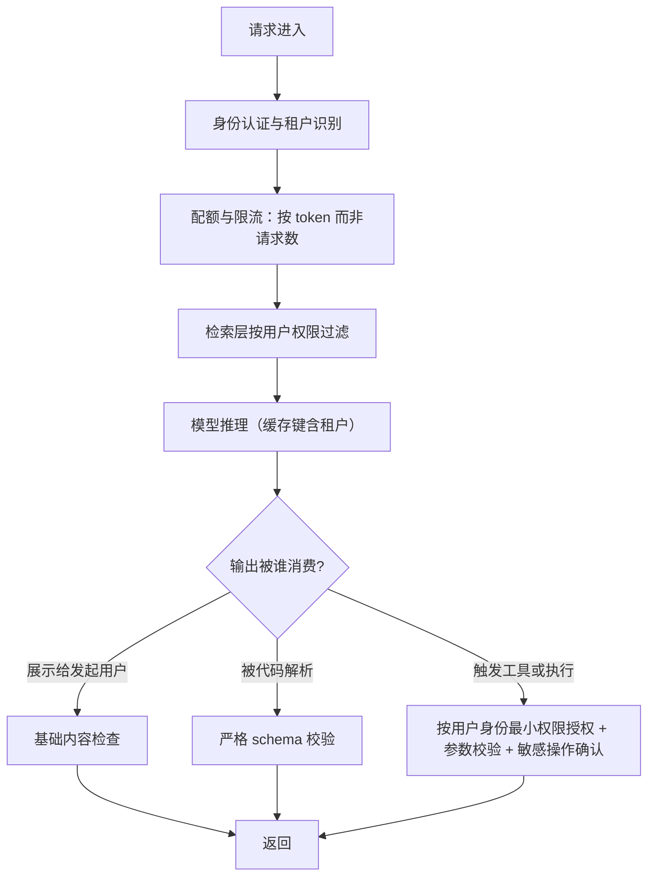
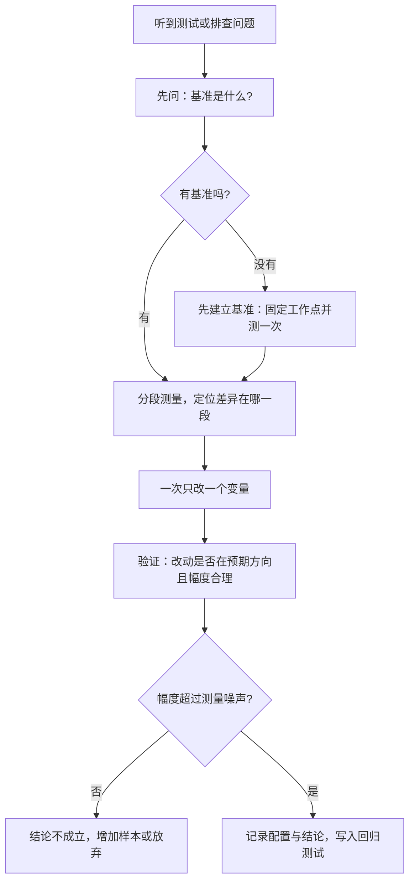

# Debug、benchmark、可靠性与安全题组（Q089–Q095）

> 位置：[InferenceAtlas](../../INDEX.md) > [模块 17](README.md) > 当前文档
> 信息截至：2026-07-29 ｜ 最后核验：2026-07-29 ｜ 内容版本：v0.1
> 时效性等级：低
> 相关主题：[模块 11](../11_benchmarking_reliability_and_observability/)｜[第六组题](06_hardware_and_datacenter_questions.md)｜`08_company_paper_and_strategy_questions.md`

## 本章导读

这一组 7 道题考的是**工程纪律**：怎么测、怎么查、怎么保证不出事、怎么防止被滥用。它与前几组题的区别在于**几乎没有可以背的知识点**——问的全是「你会怎么做」，而答案的质量取决于你有没有真正做过。

这组题的主线是**「先建立可比较的基准，再谈优化」**。推理系统的性能数字极易被口径操纵：换一个批大小、换一组输入长度、换一个分位数，同一个系统的「性能」可以差数倍。**所以这一组题的绝大多数正确答案都以「先固定什么」开头**。

第二条主线是**质量回归的隐蔽性**。性能问题会报警，**而输出质量的退化通常不会——系统仍然返回 200，仍然返回流畅的文本**。这使得质量监控必须被主动设计，**而这是很多团队直到出事才补上的一环**。

第三条主线是**安全**。推理服务的攻击面与传统 Web 服务不同：输入是自然语言、输出会被下游当成指令执行、而模型本身可能泄漏它在上下文里看到的内容。**这一组题里的安全部分最容易被准备不足的候选人跳过**。

本章按「benchmark → 排查 → 可观测性 → 质量回归 → 安全」的顺序组织。

## 学习目标

读完本章后，读者应能够：

1. 列出读一份推理 benchmark 必须核对的口径清单
2. 设计一个可复现的推理压测，并说明每一项固定的理由
3. 在有限时间内定位线上时延恶化的根因
4. 给出推理服务可观测性的最小指标集，并说明每个指标为什么必要
5. 设计输出质量回归的检测机制，而不是只监控性能
6. 识别推理服务特有的安全风险并给出分层防护

## 核心结论

- **任何推理性能数字不声明工作点都是无意义的**：模型、量化、输入输出长度、并发、分位数，缺一项就不可跨来源比较。
- **吞吐与时延必须配对报告**：吞吐可以通过增大批任意提高，而这必然恶化 TPOT。
- **排查的第一动作是分段打点而不是猜测**：排队、prefill、decode、中断四段的分布决定了根因在哪。
- **质量回归不会自己报警**：系统返回 200 且文本流畅，所以必须有金标准集与持续抽测。
- **推理服务的安全边界在「输出会被谁执行」**：模型输出若被下游当成指令或代码，注入就变成了执行漏洞。
- **多租户的隔离必须包括缓存**：前缀缓存与会话状态若跨租户共享，会成为一条数据泄漏路径。

## 1. 问题定义、系统边界与工作负载

本章覆盖 [模块 11](../11_benchmarking_reliability_and_observability/) 的范畴，并依赖 [模块 01 第 2–3 章](../01_foundations_and_metrics/02_latency_throughput_and_slo.md) 的指标与排队论、[模块 03 第 12 章](../03_serving_engines_and_scheduling/12_serving_incident_playbook.md) 的事故排查、以及 [模块 06 第 10 章](../06_distributed_and_moe_inference/10_fault_tolerance_and_graceful_degradation.md) 的容错设计。

**答题的通用起点**是先问「我们要比较什么，比较的基准是什么」。这一组题里的多数错误答案都源于**在没有基准的情况下讨论改进**。

本章不含任何需要外部核验的 benchmark 结果、厂商性能数据或安全事件案例；题目中出现的参数均为题面给定的假设值。

### 本章题目一览

| 编号 | 题目 | 难度 | 形式 |
|---|---|---|---|
| Q089 | 看到一份推理 benchmark，你会核对什么 | 中等 | 概念 |
| Q090 | 设计一个可复现的推理压测 | 高 | 系统设计 |
| Q091 | 线上时延突然恶化，怎么在半小时内定位 | 高 | 排查 |
| Q092 | 推理服务的最小可观测性指标集是什么 | 中等 | 系统设计 |
| Q093 | 怎么发现输出质量的回归 | 高 | 系统设计 |
| Q094 | 推理服务特有的安全风险有哪些 | 高 | 系统设计 |
| Q095 | 多租户推理的隔离与审计怎么设计 | 高 | 系统设计 |

## 2. 原理、数学与性能模型

这一组题反复用到四个模型：

**（一）吞吐与时延的耦合**。批越大吞吐越高、TPOT 越差。所以单独报吞吐或单独报时延都可以被操纵。**正确的报告形式是「在时延约束下的最大吞吐」**：

$$
T^{*} = \max\{T : \text{TPOT}_{p99}(T) \le \text{SLO}\}
$$

**这个量才是可以用于容量规划与横向比较的数字**。

**（二）时延的四段分解**。端到端时延由四段组成：

$$
T_{\text{e2e}} = T_{\text{queue}} + T_{\text{prefill}} + T_{\text{decode}} + T_{\text{interrupt}}
$$

**排查必须分别看四段的分布，而不是只看总和的分布**。其中排队时间在高利用率下按 $\rho/(1-\rho)$ 形式恶化，而**推理的服务时间方差天然很大**（输出长度重尾），还要乘一个 $(1 + C_S^2)$ 因子（见 [模块 01 第 3 章](../01_foundations_and_metrics/03_queueing_theory_for_inference.md)）。

**（三）归一化时延**。端到端时延的尾部常常只是「输出长」而不是「系统慢」。所以要看归一化后的量：

$$
\text{TPOT} = \frac{T_{\text{e2e}} - T_{\text{TTFT}}}{S_{\text{out}} - 1}
$$

**用 TPOT 而不是端到端时延，能避免最常见的一类误判**。

**（四）抽样与置信度**。任何分位数都需要样本量才有意义。报 P99 至少需要足以让该分位数稳定的样本数，**而在小样本下 P99 的波动可能大于你想检测的改进**。所以：

- **A/B 比较必须报样本量与观测窗口**；
- **改进幅度小于分位数本身的波动时，结论不成立**；
- 分位数不能跨窗口平均——**平均分位数没有统计意义**。

## 3. 实现机制与系统设计

以下为本章题库正文。每题的「推荐回答」是**完整答案**，可在 2–5 分钟内口头讲完。

### Q089：看到一份推理 benchmark，你会核对什么

**难度**：中等　**形式**：概念　**目标岗位**：Inference / ML Systems / SRE

**考察点**：检验候选人是否知道推理性能数字可以被口径操纵，以及具体有哪些口径。

**题目**：有人给你一份推理性能报告，声称某个系统比另一个快若干倍。请列出你会核对的口径清单，并说明每一项为什么重要。

#### 推荐回答

**结论**：至少要核对**九项**。缺任何一项，这个比较就不可采信。**而其中最容易被操纵的是批大小与分位数**——调这两项就能让同一个系统的「性能」相差数倍。

**九项口径清单**：

| 项 | 为什么重要 | 不一致的后果 |
|---|---|---|
| 模型与版本 | 不同模型的计算量差别巨大 | 完全不可比 |
| 量化方案与位宽 | 直接改变带宽与算力需求 | 数倍差异 |
| 输入长度分布 | 决定 prefill 成本与 KV 占用 | 数倍差异 |
| 输出长度分布 | 决定 decode 步数与端到端时延 | 数倍差异 |
| 并发/批大小 | **吞吐与时延的交换点** | 可任意操纵 |
| 报告的指标定义 | TTFT、TPOT、端到端各不相同 | 概念混淆 |
| 分位数与样本量 | P50 与 P99 可差一个量级 | 可任意操纵 |
| 硬件与软件版本 | 决定有效利用率 | 数倍差异 |
| 是否含前缀缓存命中 | 命中时 prefill 成本大幅下降 | 数倍差异 |

**三项最需要警惕的操纵手法**：

**（一）用大批报吞吐，用小批报时延**。吞吐随批大小上升，TPOT 随批大小恶化。**在两个不同的工作点分别取最好的数字，就得到一份看起来无懈可击的报告**。**破解方法是要求「同一次测量中的吞吐与时延配对」**，即报告 $T^{*} = \max\{T : \text{TPOT}_{p99}(T) \le \text{SLO}\}$。

**（二）用短输出掩盖 decode 的问题**。如果输出只有几十个 token，端到端时延主要由 TTFT 决定，**decode 阶段的效率几乎看不出来**。**破解方法是要求输出长度分布，并单独看 TPOT**。

**（三）前缀缓存命中未声明**。如果测试用的 prompt 高度重复，前缀缓存会让 prefill 成本大幅下降，**而这个收益在真实流量下可能不存在**。**破解方法是要求命中率数字，或要求用不重复的 prompt 重测**。

**除了口径，还要问三个方法论问题**：

1. **是否跑到了稳态**。短时测试可能跑在降频之前（见第六组题 Q083），也可能跑在缓存预热之前。**要问测试时长与是否丢弃了预热期**；
2. **负载模型是什么**。恒定速率、突发、还是闭环（固定并发数、每个请求完成后立刻发下一个）？**闭环压测会自动避免排队，因此测不出排队问题**——这是一个常见的方法缺陷；
3. **两边的调优程度是否对等**。**自家系统精细调优、对比系统用默认配置，是最常见的不公平比较**。要问对比系统的配置是怎么定的。

**闭环与开环的区别值得展开**，因为它很容易被忽略：

- **闭环压测**（固定并发）：系统慢下来时，请求发送速率自动降低，**所以队列不会积压，测不出高负载下的排队恶化**；
- **开环压测**（固定到达率）：请求按设定速率到达，**系统跟不上就积压**，能暴露排队问题。

**生产流量更接近开环**，所以**只做闭环压测会系统性地低估线上的时延尾部**。

**最后，一个建设性的表述**。面试中被问这道题时，**不要把它答成「这份报告不可信」的挑刺**，而应该答成「要让它可信，需要补充这几项信息」。**后者是协作的姿态，也更接近实际工作方式**。

**受核验限制的说明**：本回答不引用任何具体 benchmark 的结果。当前环境无法访问公开 benchmark 的方法文档，因此这里只给核对清单而不做具体评价。

#### 强答案必须覆盖

- 给出九项口径清单及不一致的后果
- 三项操纵手法：批大小错配、短输出掩盖 decode、未声明缓存命中
- 破解方法：要求同一次测量中吞吐与时延配对
- 三个方法论问题：是否稳态、负载模型、两边调优是否对等
- 展开闭环与开环的区别，指出闭环测不出排队恶化
- 指出生产流量更接近开环，故只做闭环会低估尾部
- 建议用「需要补充哪些信息」而非「不可信」的建设性表述

#### 常见错误

- 只核对硬件与模型，漏掉批大小与分位数
- 不区分闭环与开环压测
- 不问两边的调优是否对等
- 把这道题答成挑刺而非协作

#### 可能追问

1. 闭环压测有什么场合是合适的？
2. 怎么设计一个开环压测的到达过程？
3. 对比系统的配置怎么定才算公平？
4. 如果对方拒绝提供某一项口径，你怎么处理？

#### 关联阅读

- [时延、吞吐与 SLO](../01_foundations_and_metrics/02_latency_throughput_and_slo.md)
- [推理指标速查](../01_foundations_and_metrics/09_inference_metrics_cheat_sheet.md)
- [推理排队论](../01_foundations_and_metrics/03_queueing_theory_for_inference.md)
- [模块 11：benchmark、可靠性与可观测性](../11_benchmarking_reliability_and_observability/)

### Q090：设计一个可复现的推理压测

**难度**：高　**形式**：系统设计　**目标岗位**：Inference / ML Systems / SRE

**考察点**：检验候选人能否设计一个完整的测试方案，包括常被忽略的预热、隔离与记录。

**题目**：请设计一套推理服务的压测方案，要求结果可复现、可用于横向比较、也可用于回归检测。

#### 推荐回答

**结论**：可复现的压测由**五个部分**组成——**固定的工作负载定义、开环的负载发生器、完整的分段打点、受控的环境、以及完整的配置记录**。**其中「配置记录」最容易被忽略，但它决定了这次测试半年后还能不能被复现**。

**第一部分：工作负载定义**。必须固定并版本化：

1. **输入集**：一组固定的 prompt，**并且要控制它们之间的前缀重复度**——如果不控制，前缀缓存的命中率会随输入集变化，结果不可比；
2. **输出长度控制**：用固定的最大输出长度，**或者更好的做法是固定实际输出长度**（通过 ignore_eos 一类的机制强制生成到指定长度）。**理由是输出长度的随机性会引入很大的方差**，而我们想测的是系统而不是模型的话痨程度；
3. **长度分布**：至少要有两组——一组模拟生产分布（含重尾），一组是固定长度的「干净」配置用于回归检测。**两组的用途不同**：前者贴近现实，后者方差小、能检测出小的回归。

**第二部分：负载发生器要是开环的**。

按固定到达率发送请求，**而不是固定并发**。理由见 Q089：闭环压测在系统变慢时自动降速，**因此测不出排队恶化**，而排队恶化恰恰是生产中最常见的问题。

具体设计：

- 按泊松过程或固定间隔发送（**泊松更接近真实到达，且能暴露突发下的排队**）；
- **扫一组到达率**而不是只测一个点，得到「到达率 vs 时延」的曲线；
- **曲线的膝点就是系统的实际容量**——这比单点测量有信息量得多。

**注意开环压测的一个陷阱**：如果到达率超过系统容量，队列会无界增长，**时延会一直上升而不收敛**。所以必须：**设置队列上界与超时**，并**把被拒绝/超时的请求计入结果**（否则「只统计成功请求的时延」会给出一个虚假的好数字）。**这是一个很实际的坑**。

**第三部分：分段打点**。每个请求记录：

$$
\{t_{\text{arrive}}, t_{\text{admit}}, t_{\text{prefill start}}, t_{\text{first token}}, \{t_i\}, t_{\text{end}}\}
$$

由此得到排队时间、prefill 时间、每个 ITL、TPOT。**还要记录：该请求是否被抢占过、是否命中前缀缓存、以及它所在批的大小随时间的变化**。**没有这些，测出来的数字无法解释**——只能说「慢」不能说「为什么慢」。

**第四部分：受控环境**。四项：

1. **预热并丢弃预热期**：等编译完成、缓存预热、**以及温度进入稳态**（见第六组题 Q083）。**预热期的长度本身应该被记录**；
2. **独占资源**：不与其他负载共享被测设备，**包括主机的 CPU 与网络**；
3. **固定所有版本**：模型权重的哈希、推理引擎版本、驱动与固件版本、以及配置文件；
4. **多次重复**：至少跑三轮，**报告轮次之间的差异**——这个差异就是你的测量噪声下界，**任何小于它的「改进」都不成立**。

**第四项是这套方案里最有价值的一条**。**知道自己的噪声水平，才能判断一个改进是否真实**。

**第五部分：配置记录（清单）**。每次测试产出一个记录文件，含：

| 类别 | 记录项 |
|---|---|
| 被测系统 | 引擎版本、配置文件内容、启动参数 |
| 模型 | 名称、版本、权重哈希、量化方案与位宽 |
| 工作负载 | 输入集版本、长度分布、输出长度策略 |
| 负载 | 到达过程、到达率、时长、队列上界与超时 |
| 环境 | 硬件型号、驱动固件版本、预热时长 |
| 结果 | 分段时延的完整分位数、吞吐、拒绝率、样本量 |
| 元数据 | 时间、执行人、轮次间差异 |

**「结果」这一行要包含拒绝率与样本量**，否则无法判断这次测量的有效性。

**回归检测的用法**。把「干净配置」（固定长度、固定到达率）作为 CI 的一部分，每次变更后跑：

- **阈值应基于历史的轮次间差异**，而不是拍一个百分比；
- **同时检测性能与输出质量**（见 Q093）；
- **失败时保留完整的分段数据**，否则事后无法分析。

**答题的核心一句话**：可复现压测的关键是**开环负载 + 分段打点 + 多轮重复以确定噪声下界 + 完整配置记录**；**而「知道自己的噪声水平」是判断改进真实性的前提**。

#### 强答案必须覆盖

- 工作负载定义要固定并控制前缀重复度与输出长度
- 两组配置：贴近生产分布的与固定长度的干净配置，用途不同
- 负载发生器必须开环，理由是闭环测不出排队恶化
- 扫一组到达率得到曲线，膝点是实际容量
- 开环陷阱：需设队列上界与超时，且被拒绝请求必须计入结果
- 分段打点的完整字段，含抢占标记与缓存命中
- 受控环境四项，尤其多轮重复以确定噪声下界
- 完整配置记录清单，结果须含拒绝率与样本量
- 回归检测的阈值应基于历史轮次间差异

#### 常见错误

- 用闭环（固定并发）压测
- 只统计成功请求的时延
- 不做多轮重复，无法知道噪声水平
- 不记录配置，导致测试无法复现

#### 可能追问

1. 泊松到达和固定间隔到达，结果差别在哪？
2. 怎么确定预热已经完成？
3. 轮次间差异很大时怎么办？
4. CI 里的压测时长受限，怎么在短时间内得到可靠结论？

#### 关联阅读

- [时延、吞吐与 SLO](../01_foundations_and_metrics/02_latency_throughput_and_slo.md)
- [推理排队论](../01_foundations_and_metrics/03_queueing_theory_for_inference.md)
- [推理指标速查](../01_foundations_and_metrics/09_inference_metrics_cheat_sheet.md)
- [模块 11：benchmark、可靠性与可观测性](../11_benchmarking_reliability_and_observability/)

### Q091：线上时延突然恶化，怎么在半小时内定位

**难度**：高　**形式**：排查　**目标岗位**：Inference / ML Systems / SRE

**考察点**：检验候选人是否有优先级明确的排查流程，以及是否会先止损再找根因。

**题目**：线上推理服务的 P99 时延突然上升。请给出你在有限时间内的排查顺序，并说明每一步的判据。

#### 推荐回答

**结论**：顺序是**「先止损 → 查最近变更 → 分段定位 → 按段查根因」**。**「先止损」和「先查变更」必须在「深入分析」之前**——因为绝大多数突发恶化的原因是最近的变更，而回滚比诊断快得多。

**第零步（并行进行）：止损与通告**。

在开始诊断的同时：

1. **确认影响范围**：全部流量还是部分租户/区域/模型？**部分影响能极大缩小排查范围**；
2. **考虑立即降级**：如果有降级路径（缩短上下文、降低并发上限、只服务高优先级流量，见第五组题 Q075），**先降级保住核心流量，再慢慢找原因**；
3. **通告**：让依赖方知道。

**这一步的价值在于它把时间压力从诊断上移开**。**在压力下诊断容易得出错误结论**。

**第一步：查最近变更（最高优先级）**。

按时间倒序检查：代码发布、配置变更、模型版本更新、依赖服务变更、基础设施操作（扩缩容、迁移、维护）。

**判据：恶化的起始时刻与哪个变更的时刻吻合**。**这一步能解决大部分事故**，而且成本极低——如果吻合，直接回滚验证。

**注意两个陷阱**：

- **变更可能有延迟效应**。例如一个配置变更让缓存命中率缓慢下降，**症状可能在变更后数小时才显现**。所以时间窗口要放宽；
- **「没有变更」不等于没有变更**。依赖的模型服务、存储、网络都可能在你不知情的情况下变了。**要主动去问，而不是假设**。

**第二步：分段定位**。用分段打点看四段的分布：

| 哪一段恶化了 | 指向的根因 | 立即验证 |
|---|---|---|
| 排队时间 | 到达率上升或容量下降 | 看 QPS 与可用实例数 |
| prefill 时间 | 输入变长或缓存命中率下降 | 看输入长度分布与命中率 |
| decode 的 ITL | 批变大、抢占、或硬件降频 | 看批大小分布与抢占率 |
| 中断（ITL 有异常大的间隔） | 抢占、工具等待、或依赖服务慢 | 看抢占率与依赖时延 |

**在看这些之前，先做一次归一化检查**：**P99 恶化是不是仅仅因为输出变长了？**看 TPOT 而不是端到端时延。**如果 TPOT 正常而端到端恶化，那么系统没有变慢，是请求变了**——这时要去查上游（是不是有新的调用方在发长请求）。**这个检查只需要一分钟，但能避免走完全错的方向**。

**第三步：按段深入**。

**（一）排队时间恶化**。两个方向：

- **到达率上升**：看 QPS 曲线。**注意区分「真实流量增长」与「重试风暴」**——后者是一个正反馈：系统慢 → 客户端超时重试 → 负载更高 → 更慢。**判据是看请求中重试的比例**；
- **容量下降**：看可用实例数、以及**各实例的单步时间是否一致**（有实例落后会拖慢整体，见第五组题 Q076）。**「实例数没变但容量下降」的常见原因是某几个实例降频或有额外负载**。

**（二）prefill 时间恶化**。两个方向：

- **输入变长**：看输入长度分布的变化。**新的调用方或新的产品功能是常见原因**；
- **缓存命中率下降**：可能是路由变了（亲和性失效）、缓存容量不足导致驱逐加剧、或流量模式变了。**命中率是一个应该常态监控的指标**，因为它的下降会同时抬高 prefill 时间与整体负载。

**（三）decode 的 ITL 恶化**。三个方向：

- **批变大**：可能是准入放松或到达率上升。**批大小与 TPOT 直接交换**，所以这可能是「符合预期的恶化」；
- **抢占率上升**：说明 KV 压力大。**注意抢占有正反馈**（被抢占的长请求重算后占用更久），所以要往上游查准入策略；
- **硬件降频**：看频率与温度（见第六组题 Q083）。**特征是逐渐恶化而非阶跃**。

**（四）中断**。看 ITL 序列里的异常间隔，并检查这些请求是否被抢占过、或者是否在等外部工具/依赖服务。**被抢占过的请求应当在 SLO 统计中被标记**，否则它们会污染 P99 的解读。

**第四步：确认与防复发**。

1. **确认根因**：修改后症状消失，**并且能解释「为什么这个原因会产生这个症状」**。**只有相关性没有机制解释的「根因」不可靠**；
2. **写入监控**：如果这个根因当时没有直接的监控信号，**补上它**；
3. **写入回归测试**：如果是可测的（配置、代码），加入 CI。

**一个必须提到的方法论要点**：**一次只改一个变量**。事故中的压力会诱使人同时改几个配置，**但那样即使恢复了也不知道是哪个起了作用**，下次还会再遇到。**如果时间紧迫必须多改，那就在恢复后用受控实验补回归因**。

**答题的核心一句话**：顺序是**止损 → 查变更 → 归一化检查 → 分段定位 → 按段深入**；**「查最近变更」的性价比最高，而「归一化检查」只需一分钟就能避免走错方向**。

#### 强答案必须覆盖

- 第零步止损与通告，先降级保核心流量再诊断
- 确认影响范围（全量还是部分）以缩小排查空间
- 第一步查最近变更，性价比最高；注意延迟效应与「依赖也会变」
- 先做归一化检查：TPOT 正常而端到端恶化说明是请求变了
- 分段定位表：四段各自指向的根因与立即验证项
- 排队恶化要区分真实增长与重试风暴（正反馈）
- 容量下降可能是「实例数没变但有实例落后」
- 抢占率上升要往上游查准入；降频的特征是逐渐而非阶跃
- 确认根因需要机制解释而非仅相关性；并补监控与回归测试
- 强调一次只改一个变量，若必须多改则事后补归因

#### 常见错误

- 直接深入分析而不先查最近变更
- 跳过归一化检查，把「输出变长」当成「系统变慢」
- 同时改多个配置
- 症状消失就宣布找到根因，没有机制解释

#### 可能追问

1. 怎么快速判断是重试风暴而不是真实流量增长？
2. 降级路径应该自动触发还是人工触发？
3. 变更的延迟效应怎么在排查中被发现？
4. 如果所有分段都轻微恶化，说明什么？

#### 关联阅读

- [服务事故排查手册](../03_serving_engines_and_scheduling/12_serving_incident_playbook.md)
- [推理排队论](../01_foundations_and_metrics/03_queueing_theory_for_inference.md)
- [容错与优雅降级](../06_distributed_and_moe_inference/10_fault_tolerance_and_graceful_degradation.md)

### Q092：推理服务的最小可观测性指标集是什么

**难度**：中等　**形式**：系统设计　**目标岗位**：Inference / ML Systems / SRE

**考察点**：检验候选人是否知道哪些指标是推理服务特有的、以及哪些常见指标其实没用。

**题目**：如果只能保留十几个指标，你会为一个推理服务选哪些？请说明每个指标为什么必要。

#### 推荐回答

**结论**：分**五组**——请求层、时延分段、资源与批、质量、以及分布式一致性。**其中最容易被漏掉的是「批大小的实际分布」与「输出质量」**，而**最容易被错误保留的是 GPU 利用率**。

**第一组：请求层（4 个）**

| 指标 | 为什么必要 |
|---|---|
| 到达率（QPS） | 一切容量与排队分析的输入 |
| 成功/失败/拒绝/超时的分类计数 | **拒绝与超时必须单列**，否则「成功请求的时延」会给出虚假的好数字 |
| 输入长度分布 | prefill 成本与 KV 占用的驱动量 |
| 输出长度分布 | decode 成本与端到端时延的驱动量 |

**第二组：时延分段（4 个）**

| 指标 | 为什么必要 |
|---|---|
| 排队时间的分位数 | 区分「排队慢」与「计算慢」 |
| TTFT 的分位数 | 用户感知的第一个信号 |
| **TPOT 的分位数** | **归一化后的时延，避免把「输出长」当「系统慢」** |
| ITL 的异常间隔计数 | 检测中断（抢占、工具等待） |

**第三组：资源与批（4 个）**

| 指标 | 为什么必要 |
|---|---|
| **实际批大小的分布** | **配置的上限没有信息量，实际工作点才有** |
| KV 显存占用率 | 决定并发上限，是抢占的前导指标 |
| 抢占率 | 内存压力的直接信号，且抢占有正反馈 |
| 前缀缓存命中率 | 同时影响 prefill 成本与整体负载 |

**「实际批大小的分布」是最常被漏掉的一个**。配置里写着最大批 256，实际可能一直运行在 8——**而这两种情况下系统的性质完全不同**（一个带宽受限、一个可能接近算力受限）。

**第四组：质量（2 个）**

| 指标 | 为什么必要 |
|---|---|
| 金标准集的指标 | **质量回归不会自己报警**（见 Q093） |
| 输出异常率（空输出、截断、结构校验失败） | 便宜且能捕捉明显崩坏 |

**第五组：分布式一致性（2 个，多机部署才需要）**

| 指标 | 为什么必要 |
|---|---|
| 各实例单步时间的最大值/中位数比 | **「一个实例落后」在聚合指标里完全不可见** |
| 通信占单步时间的比例 | 判断分布式开销是否异常 |

**合计 16 个**。

**应该被排除的三个常见指标**：

**（一）GPU 利用率**。它只表示「当前有 kernel 在执行」。**decode 阶段它常年接近 100% 而算力在空转**（因为带宽受限）。**它既不能判断瓶颈类型，也不能作为扩缩容信号**。**如果要保留一个资源类指标，应该是实测带宽利用率而不是它**。

**（二）平均时延**。推理的时延分布重尾，**平均值被少数长请求主导，且掩盖了尾部**。分位数是唯一有用的形式。**另外分位数不能跨窗口平均**——「过去一天的平均 P99」没有统计意义。

**（三）孤立的吞吐数字**。吞吐必须与时延配对，否则它可以通过增大批任意提高（见 Q089）。

**分层采集策略**。上述指标不必都全量采集：

| 层 | 内容 | 采样 |
|---|---|---|
| 全量 | 计数类与分位数聚合 | 100% |
| 采样 | 完整的分段轨迹（每请求每 token 的时间） | 低比例 |
| 按需 | 提高采样率、开启详细 profile | 出事时临时开启 |

**「按需提高采样率」这个能力必须事先具备**。事故中才去加打点是来不及的，**而且加打点本身可能改变系统行为**。

**两个容易被忽略的设计要点**：

1. **抢占过的请求应当在 SLO 统计中被标记**，否则它们污染 P99 的解读——你会看到尾部恶化但找不到原因；
2. **指标要能按租户、模型、区域切分**。**「部分影响」是排查中最有价值的信息**（见 Q091），而它要求指标带上这些维度。

**答题的核心一句话**：五组共十六个指标，**其中「实际批大小分布」与「输出质量」最容易被漏掉，「GPU 利用率」最应该被排除**；**并且必须具备事故中临时提高采样率的能力**。

#### 强答案必须覆盖

- 五组指标：请求层、时延分段、资源与批、质量、分布式一致性
- 拒绝与超时必须单列，否则成功请求的时延给出虚假好数字
- 必须有 TPOT 分位数（归一化）而非只有端到端
- 实际批大小分布最容易被漏掉，配置上限无信息量
- 质量指标必须存在，因为质量回归不会自己报警
- 分布式必须有各实例单步时间的最大值/中位数比
- 应排除 GPU 利用率、平均时延、孤立吞吐，并说明理由
- 分层采集策略，且「按需提高采样率」需事先具备
- 抢占过的请求要标记；指标要能按租户/模型/区域切分

#### 常见错误

- 保留 GPU 利用率作为核心指标
- 只有端到端时延没有 TPOT
- 监控配置的最大批而非实际批分布
- 完全没有输出质量指标

#### 可能追问

1. 实测带宽利用率怎么在生产中持续采集？
2. 完整轨迹的采样比例怎么定？
3. 按租户切分指标，基数爆炸怎么处理？
4. 抢占过的请求标记之后，SLO 应该怎么定义？

#### 关联阅读

- [推理指标速查](../01_foundations_and_metrics/09_inference_metrics_cheat_sheet.md)
- [时延、吞吐与 SLO](../01_foundations_and_metrics/02_latency_throughput_and_slo.md)
- [服务事故排查手册](../03_serving_engines_and_scheduling/12_serving_incident_playbook.md)
- [模块 11：benchmark、可靠性与可观测性](../11_benchmarking_reliability_and_observability/)

### Q093：怎么发现输出质量的回归

**难度**：高　**形式**：系统设计　**目标岗位**：Inference / ML Systems / SRE

**考察点**：检验候选人是否意识到质量回归的隐蔽性，以及能否设计一个可执行的检测方案。

**题目**：推理服务的性能问题会报警，但输出质量的退化通常不会。请设计一套检测输出质量回归的机制。

#### 推荐回答

**结论**：质量回归**必须被主动检测**，因为它的表现是「HTTP 200 + 流畅的文本 + 内容变差」——**没有任何自动化信号会触发**。方案由**四层**组成：确定性检查、金标准集、金丝雀流量、以及用户信号。

**先说清为什么这件事特别难**。三个原因：

1. **没有唯一正确答案**。同一个 prompt 的多个输出都可能是好的，**所以不能用「输出是否与期望完全相同」做判据**；
2. **变化可能是渐进的**。量化、kernel 变更、batch 组成变化都可能带来微小的数值差异，**这些差异在多数输入上无害，只在少数输入上导致明显退化**；
3. **正常的不确定性掩盖了退化**。采样解码本身就有随机性，**所以单个坏输出不能证明有回归**。

**第一层：确定性检查（最便宜，应该全量做）**

这些是可以自动判定的、无需模型评估的检查：

| 检查 | 捕捉什么 |
|---|---|
| 空输出率 | 严重崩坏 |
| 输出长度分布 | 突然变短（提前停止）或变长（不收敛） |
| 结构化输出的 schema 校验通过率 | 约束解码或格式遵循的退化 |
| 重复片段检测 | 退化成循环重复 |
| 语言与编码合法性 | tokenizer 或解码路径的问题 |

**这一层的价值在于它极其便宜且能捕捉明显崩坏**，而明显崩坏恰恰是最严重的一类。

**第二层：金标准集（核心机制）**

一组固定的输入，加上**可自动评估的判据**。设计要点：

1. **判据必须可自动化**。可选形式：包含/不包含特定内容、数学或代码题的答案正确性、结构化输出的字段正确性、多选题的选项。**「可自动判定」比「贴近真实任务」更重要**——一个不能自动跑的评测集不会被真正持续使用；
2. **必须包含难例与边界**。如果金标准集全是简单样本，**它对渐进退化不敏感**。应该主动收集历史上出过问题的输入；
3. **温度设为 0 并固定所有解码参数**。这消除采样随机性，**但要注意温度 0 不保证逐位一致**（批组成与归约顺序会影响），**所以判据应该是「任务指标」而不是「输出逐字符相同」**；
4. **报告要给出指标与样本量**，并**用历史波动而不是拍一个百分比来定阈值**。

**这一层要在发布流程里强制执行**：发布前跑、发布后跑、并且**任何改变数值路径的变更都要跑**（量化、kernel 更新、编译选项、并行度变化）。

**第三层：金丝雀流量（持续运行）**

持续向生产发送一组固定请求并记录输出。用途：

- **检测「只在生产环境出现」的问题**：配置漂移、某个实例的权重加载错误、**或者部分实例跑的是旧版本**；
- **比较不同实例/区域的输出**。**同一个金丝雀请求在不同实例上的输出如果显著不同，说明实例之间不一致**——这是一个很有价值的信号，而且只能通过金丝雀发现。

**注意金丝雀的输出会进入缓存**，**所以要么禁用它们的缓存，要么把这一点纳入解读**。

**第四层：用户信号（最慢但最真实）**

- 显式反馈（点赞/点踩、重新生成的比例）；
- 隐式信号（会话长度、重试率、放弃率）。

**这一层的问题是延迟大且有偏**（只有少数用户反馈，且倾向于反馈负面）。**但它是唯一能发现「前三层都没覆盖到的问题」的机制**，所以不能省。

**四层的分工**：

| 层 | 延迟 | 覆盖 | 成本 |
|---|---|---|---|
| 确定性检查 | 即时 | 只有明显崩坏 | 极低 |
| 金标准集 | 发布时 | 已知的关注点 | 低 |
| 金丝雀 | 分钟级 | 环境与一致性问题 | 低 |
| 用户信号 | 天级 | 未知问题 | 中（需要产品支持） |

**「覆盖」这一列说明了为什么需要四层**：前三层只能发现你已经想到要检查的东西，**用户信号是唯一能发现「你没想到的问题」的通道**。

**两个实施上的要点**：

1. **归因要能做到**。发现质量下降后，**必须能追溯到是哪个变更引起的**。这要求金标准集的结果与版本、配置一起记录；
2. **要有回滚判据**。**「质量下降多少要回滚」应该事先约定**，而不是在事故中讨论。

**答题的核心一句话**：质量回归不会自己报警，**所以需要四层主动检测**——确定性检查、金标准集、金丝雀、用户信号；**其中前三层只覆盖你想到的问题，用户信号是唯一发现未知问题的通道**。

#### 强答案必须覆盖

- 说清质量回归为何隐蔽：200 + 流畅文本 + 内容变差
- 三个困难：无唯一正解、退化渐进、采样随机性掩盖
- 第一层确定性检查的五项，极便宜且捕捉明显崩坏
- 第二层金标准集：判据可自动化优先于贴近真实、须含难例、温度 0
- 指出温度 0 不保证逐位一致，故判据应是任务指标
- 阈值应基于历史波动而非拍百分比；数值路径变更都要跑
- 第三层金丝雀能发现环境漂移与实例间不一致；注意缓存影响
- 第四层用户信号延迟大有偏，但是唯一发现未知问题的通道
- 两个实施要点：可归因到具体变更、事先约定回滚判据

#### 常见错误

- 只做性能监控，假设质量问题会报警
- 用「输出逐字符相同」做判据
- 金标准集只有简单样本，对渐进退化不敏感
- 阈值靠拍一个百分比

#### 可能追问

1. 金标准集多大合适？怎么避免它过拟合到已知问题？
2. 金丝雀请求进入缓存会造成什么误导？
3. 用户信号有偏，怎么校正？
4. 回滚判据具体怎么定量？

#### 关联阅读

- [推理指标速查](../01_foundations_and_metrics/09_inference_metrics_cheat_sheet.md)
- [容错与优雅降级](../06_distributed_and_moe_inference/10_fault_tolerance_and_graceful_degradation.md)
- [生成质量与时延的权衡](../05_decoding_and_generation_algorithms/10_generation_quality_latency_tradeoffs.md)
- [模块 11：benchmark、可靠性与可观测性](../11_benchmarking_reliability_and_observability/)

### Q094：推理服务特有的安全风险有哪些

**难度**：高　**形式**：系统设计　**目标岗位**：Inference / ML Systems / SRE

**考察点**：检验候选人是否理解「输出会被下游执行」这个核心风险，以及是否会按消费方分级防护。

**题目**：推理服务的攻击面与传统 Web 服务有什么不同？请列出主要风险并给出分层防护思路。

#### 推荐回答

**结论**：推理服务的核心差异在于**输入是自然语言、而输出可能被下游当成指令或代码执行**。**所以风险的严重程度取决于「输出被谁消费」**，防护也应该按这个维度分级——**而不是试图在输入侧做一个万能过滤器**。

**风险一：提示注入（最核心）**。

输入里的内容被模型当成指令遵循，从而改变它的行为。**关键在于这不是一个可以「修好」的漏洞**——模型没有可靠的机制区分「系统给的指令」与「输入内容里看起来像指令的文字」。

**危害等级取决于输出的消费方**：

| 输出被谁消费 | 注入的后果 | 防护强度 |
|---|---|---|
| 直接展示给发起请求的用户 | 用户看到奇怪的回答 | 低（用户自己承担） |
| 展示给**其他**用户 | 可传播的内容问题 | 中 |
| 被下游代码解析（JSON、参数） | 结构或语义被篡改 | 高 |
| **触发工具调用或代码执行** | **等同于远程执行** | **最高** |
| 写入持久存储后被再次读取 | **注入被持久化，影响后续请求** | **最高** |

**最后两行是真正危险的**。如果模型输出能触发工具调用，**那么一个能控制输入的攻击者实际上能间接调用你的工具**。**这时的正确防护不在模型层，而在工具层**：

1. **工具的权限必须最小化**，并且**按发起请求的用户身份授权，而不是按服务身份**；
2. **敏感操作必须有独立的确认或审批**，不能仅凭模型输出触发；
3. **工具的参数必须被严格校验**，**把模型输出当成不可信输入对待**——这与处理用户提交的表单是同一个原则。

**「把模型输出当成不可信输入」是这道题最重要的一句话**。

**风险二：上下文内容泄漏**。

模型会看到系统提示、检索到的文档、工具返回的结果、以及（在多轮中）历史对话。**其中任何内容都可能被诱导输出**。三个具体形式：

- **系统提示泄漏**：暴露业务逻辑与规则。**应对是「不要把机密放在系统提示里」**——系统提示应假设是可见的；
- **检索内容的越权泄漏**：如果检索没有按用户权限过滤，**模型会把用户本无权看到的文档内容说出来**。**这是一个权限漏洞而不是模型问题**，**必须在检索层按用户身份过滤，而不是靠提示词约束模型**；
- **跨请求泄漏**：见风险三。

**风险三：缓存与状态导致的跨请求泄漏（最容易被忽略）**。

推理系统有多种缓存与共享状态：前缀缓存、会话状态、以及批内共享的资源。**如果缓存键没有包含租户/用户维度，一个用户的内容可能被另一个用户的请求命中**。

**具体的要求**：

1. **缓存键必须包含租户与（在需要时）用户标识**；
2. **只有内容完全相同的前缀才能共享**，**且共享必须限制在同一信任域内**；
3. **KV 的物理页在被复用前必须确保不会被越权读取**（页释放后重分配给另一个租户时，**不能出现读到残留数据的路径**）；
4. **会话状态的生命周期与清理**要明确，包括请求异常终止时的清理。

**这一类风险的隐蔽性在于它不产生任何错误信号**——系统正常工作，只是数据到了不该到的地方。**所以它必须靠设计与代码审查来防，而不是靠监控发现**。

**风险四：资源滥用与拒绝服务**。

推理请求的成本高度不均：一个超长 prompt 或一个诱导模型无限生成的输入，**消耗的资源可能是普通请求的数百倍**。**所以按请求数限流是不够的**，必须：

- 按 **token 数**（输入与输出分别）限额；
- **设置硬性的最大输出长度**；
- 对单租户的**并发与 KV 占用**设上限（见 Q095）；
- **检测异常的高成本模式**（如同一租户持续发送超长请求）。

**风险五：模型与权重本身**。

- **权重是资产**：需要访问控制与完整性校验（加载时校验哈希，**防止被替换的权重上线**）；
- **不要把权重、API 密钥或凭据写进镜像或代码仓库**；
- **日志中不应包含完整的请求内容**（否则日志系统成为一个新的数据泄漏面）——如果需要为排查保留内容，**要有明确的保留期与访问控制**。

**分层防护的总原则**：

**图解读**：
1. **本图展示什么**：防护的分层位置。认证与配额在最前，权限过滤在检索层，**而最强的防护在输出侧且按消费方分级**。
2. **核心瓶颈**：瓶颈在 F 节点的分支 I。**工具调用是唯一能把「文本问题」变成「执行问题」的路径**，所以它需要最强的防护，**且防护必须在工具层实现而不是靠提示词约束模型**。
3. **图中的 trade-off**：严格的输出校验会降低成功率（合法输出被拒绝）。**所以分级是必要的**——对只给人看的输出用宽松策略，对触发执行的输出用严格策略。
4. **面试如何引用**：可以说「我会把模型输出当成不可信输入，按它的消费方决定校验强度；工具权限按发起用户的身份最小化授权；并确保缓存键包含租户维度」。

**答题的核心一句话**：推理服务安全的关键是**「把模型输出当成不可信输入」**，**防护强度按输出的消费方分级**；**而缓存与状态的跨租户泄漏是最容易被忽略的一类，且不产生任何错误信号**。

#### 强答案必须覆盖

- 核心差异：输入是自然语言、输出可能被下游执行
- 注入不是可修好的漏洞，危害取决于输出的消费方
- 给出消费方分级表，指出工具调用与持久化最危险
- 关键原则：把模型输出当成不可信输入；工具权限按用户身份最小化
- 上下文泄漏三形式，强调检索必须在检索层按权限过滤而非靠提示词
- 缓存与状态的跨租户泄漏：缓存键须含租户、页复用不能读到残留
- 指出这类风险不产生错误信号，只能靠设计与代码审查防
- 资源滥用必须按 token 而非请求数限额
- 权重与日志的安全：完整性校验、不入仓库、日志不留完整内容
- 给出分层防护图并说明最强防护在输出侧

#### 常见错误

- 认为注入可以靠输入过滤彻底解决
- 靠提示词约束模型来做权限控制
- 忽略缓存与会话状态的跨租户泄漏
- 按请求数而非 token 数限流

#### 可能追问

1. 缓存键含租户后，跨租户的公共前缀还能共享吗？
2. 工具的敏感操作确认怎么设计才不损害体验？
3. 日志需要保留内容用于排查，怎么平衡？
4. 怎么检测「诱导无限生成」这类滥用？

#### 关联阅读

- [多租户隔离与 QoS](../03_serving_engines_and_scheduling/06_multi_tenant_isolation_and_qos.md)
- [结构化输出与语法约束解码](../05_decoding_and_generation_algorithms/09_structured_output_and_grammar_constrained_decoding.md)
- [工具使用与 Agent 推理](../05_decoding_and_generation_algorithms/08_tool_use_and_agent_inference.md)
- [模块 11：benchmark、可靠性与可观测性](../11_benchmarking_reliability_and_observability/)

### Q095：多租户推理的隔离与审计怎么设计

**难度**：高　**形式**：系统设计　**目标岗位**：Inference / ML Systems / SRE

**考察点**：检验候选人是否能同时处理性能与数据两类隔离，以及是否想到审计。

**题目**：一个推理平台服务多个租户。请设计隔离方案，覆盖性能隔离、数据隔离与审计三个方面。

#### 推荐回答

**结论**：三方面各有不同的手段与难点——**性能隔离靠配额与调度**（难点是公平性与效率冲突）、**数据隔离靠标识贯穿全链路**（难点是缓存与共享状态）、**审计靠不可篡改的记录**（难点是内容保留与隐私的冲突）。

**第一方面：性能隔离**。

目标是**一个租户的行为不损害其他租户的 SLO**（吵闹邻居问题）。三个层次的手段：

| 层次 | 手段 | 代价 |
|---|---|---|
| 硬隔离 | 每租户独占实例 | 容量浪费严重（利用率低） |
| **软隔离** | 共享池 + 配额上限 + 优先级 | 需要精细的调度实现 |
| 无隔离 | 完全共享 | 吵闹邻居伤害所有人 |

**实践中的答案通常是软隔离**，因为硬隔离的容量浪费太大（每个租户都要按自己的峰值配置）。

**软隔离的具体机制，四项**：

1. **按 token 而非请求数配额**。**推理请求的成本高度不均**，按请求数限流的租户可以用超长 prompt 消耗数百倍资源；
2. **KV 占用上限**。这是最关键的一项，因为 **KV 是最稀缺的资源且直接决定其他租户能否被接纳**。一个租户占满 KV 会导致其他租户的请求被拒绝或抢占；
3. **批组装时的配额感知**。如果批组装只按到达顺序，**一个高频租户会自然占据大部分批槽位**。需要在组批时考虑各租户的已用配额；
4. **超额时降级而非直接拒绝**。超出配额的请求可以降低优先级、缩短最大输出、或路由到备用容量，**这比直接拒绝的体验好得多**。

**公平性与效率的冲突**。严格的配额意味着**某个租户空闲时它的配额被浪费**。缓解方式是**可借用的配额**：允许租户超出基础配额使用空闲容量，**但在其他租户需要时能被快速回收**。**「能被快速回收」是关键**——而对推理来说回收意味着抢占，**抢占有重算代价**（见第三组题 Q033）。**所以借用的粒度不能太粗，否则回收代价过高**。

**第二方面：数据隔离**。

目标是**一个租户无法观察到另一个租户的数据**。核心要求是**租户标识贯穿全链路**：

| 环节 | 要求 |
|---|---|
| 认证 | 每个请求携带可验证的租户身份 |
| **前缀缓存** | **缓存键必须含租户标识** |
| 会话状态 | 按租户+用户分区，明确生命周期 |
| KV 页复用 | 释放后重分配不能出现读到残留数据的路径 |
| 检索 | 按租户与用户权限过滤（见 Q094） |
| 日志与指标 | 带租户维度，且访问受控 |

**「缓存键必须含租户标识」是最容易被漏掉的一条**，而它的后果是直接的数据泄漏。

**这里有一个值得讨论的取舍**：跨租户共享公共前缀（如相同的系统提示模板）能显著提高命中率，**但它意味着缓存键不完全含租户**。**如果要做这个优化，必须严格限定「什么内容可以跨租户共享」**——例如只允许平台自己定义的、不含任何租户数据的模板前缀，**并且这个白名单要是显式的而不是靠长度或频率启发式判断**。**用启发式决定什么可以共享，是一个危险的设计**。

**第三方面：审计**。

目标是**事后能回答「谁在什么时候做了什么」**。记录内容：

1. **请求元数据**：租户、用户、时间、模型、token 数、时延、结果状态。**这一层应该全量记录**；
2. **配置与版本**：这个请求用的模型版本、配置、以及是否发生了降级或抢占。**没有这一层，事后无法解释输出**；
3. **请求内容**：这一层与隐私直接冲突。

**内容保留的处理原则**：

- **默认不保留完整内容**，因为日志系统会成为一个新的、防护通常更弱的数据泄漏面；
- 如果业务需要保留（如合规要求或质量分析），则必须有：**明确的保留期、加密存储、访问审计（谁看了这些内容也要被记录）、以及租户可见的说明**；
- **采样保留优于全量保留**，在多数排查场景下采样已足够。

**审计记录本身的要求**：

1. **不可篡改**：审计日志应该是追加写、且服务本身没有删改它的权限；
2. **与业务日志分离**：避免业务日志的清理策略影响审计；
3. **可按租户导出**：租户可能有自己的合规需求。

**三方面的一个共同要求：可验证**。隔离不能只写在设计文档里。三项验证：

1. **性能隔离**：做一个租户的压力测试，**验证其他租户的 SLO 不受影响**；
2. **数据隔离**：做跨租户的探测测试，**主动尝试用一个租户的请求命中另一个租户的缓存**；
3. **审计完整性**：抽取一个历史请求，**验证能从审计记录中还原出它的完整处理路径**。

**第二项应该被写成自动化测试**，因为缓存键的逻辑很容易在后续重构中被破坏，**而这类破坏不产生任何可见的错误**。

**答题的核心一句话**：性能隔离用软隔离（按 token 配额 + KV 上限 + 配额感知的组批 + 超额降级）、数据隔离靠**租户标识贯穿全链路且缓存键必须含租户**、审计要不可篡改且默认不保留完整内容；**三者都必须有自动化的验证测试**。

#### 强答案必须覆盖

- 三方面各有手段与难点，明确区分
- 性能隔离三层次对比，指出软隔离是实践答案
- 软隔离四项机制：按 token 配额、KV 上限、配额感知组批、超额降级
- 公平与效率冲突用可借用配额缓解，但回收即抢占、有重算代价
- 数据隔离要求租户标识贯穿全链路，给出六个环节的要求
- 缓存键必须含租户；跨租户共享前缀需显式白名单而非启发式
- 审计三层内容，默认不保留完整内容，保留则需保留期+加密+访问审计
- 审计记录须不可篡改、与业务日志分离、可按租户导出
- 三项验证测试，尤其跨租户缓存探测应自动化

#### 常见错误

- 只做性能隔离不做数据隔离（或反之）
- 缓存键不含租户标识
- 用启发式决定什么内容可以跨租户共享
- 默认全量保留请求内容
- 隔离只写在设计文档里，没有验证测试

#### 可能追问

1. 可借用配额的回收粒度怎么定？
2. 配额感知的组批具体怎么实现？
3. 跨租户共享前缀的白名单怎么维护？
4. 跨租户缓存探测测试怎么写？

#### 关联阅读

- [多租户隔离与 QoS](../03_serving_engines_and_scheduling/06_multi_tenant_isolation_and_qos.md)
- [prompt 缓存与前缀缓存](../03_serving_engines_and_scheduling/08_prompt_caching_and_prefix_caching.md)
- [会话记忆与对话状态](../03_serving_engines_and_scheduling/09_session_memory_and_conversation_state.md)

## 4. 性能、成本、能耗与可靠性 trade-off

这一组题的核心 trade-off 是**严谨性与速度**：

| 场景 | 严谨的做法 | 快的做法 | 什么时候可以快 |
|---|---|---|---|
| 性能比较 | 控制全部工作点变量、跑到统计显著 | 跑一次看看 | 只用于排除量级错误 |
| 线上排查 | 完整分段打点后分析 | 按经验先改一个配置 | 有明确的近期变更嫌疑 |
| 质量验证 | 全量评测集 + 人工抽检 | 看几个样例 | 只用于发现明显崩坏 |

**这张表的读法是：快的做法不是错的，但它的结论强度必须被明确标注**。「我跑了一次，快了大概三成」是有用的信息，**只要不把它说成「我们提升了 30% 的性能」**。**混淆这两者是这一组题里最常见的严谨性问题**。

第二个高频 trade-off 是**监控成本与可观测性**。逐请求逐 token 打点能给出最完整的信息，但会带来存储与性能开销。实践中的答案是**分层**：全量采集少量关键指标、对采样的请求采集完整轨迹、**并保证出事时能临时提高采样率**。

第三个 trade-off 是**安全与可用性**。严格的输入过滤会误伤正常请求，严格的输出校验会降低成功率。**正确的做法是按「输出被谁消费」分级**：输出直接给人看的风险低，**输出被下游代码执行的风险高，必须严格校验**。

## 5. benchmark、真实案例或公开部署案例

本章题目全部围绕方法论，**不依赖任何外部实测数据**。

受当前环境的网络出口策略限制（详见 [AGENTS.md 第 11 节](../../AGENTS.md)），本库无法核验任何公开 benchmark 的结果、方法或版本，因此本章**不引用任何具体 benchmark 的数字**，只给出读它们时应核对的口径清单。

**读者应自行准备的材料**（面试前应能讲清）：

| 材料 | 为什么面试会问 |
|---|---|
| 你们压测的完整配置清单 | 检验你的测试是否可复现 |
| 一次你参与的线上事故的完整时间线 | 检验你的排查是否有方法 |
| 你们的可观测性指标清单 | 检验你知不知道该看什么 |
| 你们怎么发现输出质量回归 | **多数团队没有，能答出来是强信号** |
| 你们对 prompt 注入的防护 | 检验你是否考虑过安全面 |

**准备建议**：第二项和第四项最有价值。**一次讲得清楚的事故经历，胜过十个背下来的概念**——包括你当时的错误判断和它是怎么被纠正的。**承认走过弯路会让整个叙述更可信**。

## 6. 设计决策框架

回答这一组题的通用顺序：

**图解读**：
1. **本图展示什么**：测试与排查的通用流程。起点是「有没有基准」，核心是「分段 + 一次改一个变量」，终点是「写入回归测试」而不是「改完就走」。
2. **核心瓶颈**：瓶颈在 H 节点。**「幅度是否超过测量噪声」这一步最常被跳过**，结果是把噪声当成改进。推理系统的时延方差很大，**小幅度的改进需要相当大的样本量才能确认**。
3. **图中的 trade-off**：D 节点「先建立基准」会花时间，在事故场景下可能来不及。**这时的正确做法是并行：一边按嫌疑改配置，一边补基准**，而不是跳过基准直接凭经验操作。
4. **面试如何引用**：可以说「我会先确认有没有可比的基准，然后分段测量定位到具体环节，一次只改一个变量，最后确认改进幅度超过噪声再写进回归测试」。

**最后一步「写入回归测试」是区分资深与否的地方**。修好一个问题而不防止它复发，**意味着同一个问题会再来一次**。

## 7. 常见失败模式与排查路径

| 症状 | 根因 | 修正 |
|---|---|---|
| 报吞吐不报时延（或反之） | 不知道两者耦合 | 报「时延约束下的最大吞吐」 |
| 用端到端时延的尾部判断系统慢 | 没做归一化 | 看 TPOT 而不是端到端 |
| 把单次测量的差异当成改进 | 忽略测量噪声 | 报样本量，确认幅度超过波动 |
| 排查时同时改多个配置 | 无法归因 | 一次只改一个变量 |
| 只监控性能不监控输出质量 | 以为质量问题会报警 | 建金标准集与持续抽测 |
| 认为 prompt 注入只是「说服模型」 | 忽略输出被下游执行 | 按输出消费方分级防护 |
| 多租户隔离只做了请求隔离 | 漏掉缓存与会话状态 | 缓存键必须含租户维度 |

**最常见的是第三条和第五条**。把噪声当改进会导致一系列基于错误结论的决策；而不监控质量则意味着**质量回归只能由用户投诉来发现**——那时它已经影响了很多人。

## 8. 关联面试主题

1. 读 benchmark 的口径清单——见 Q089
2. 可复现压测的设计——见 Q090
3. 线上时延恶化的定位流程——见 Q091
4. 可观测性的最小指标集——见 Q092
5. 输出质量回归的检测——见 Q093
6. 推理服务特有的安全风险——见 Q094
7. 多租户的数据隔离与审计——见 Q095

## 9. 小结

这一组 7 道题考工程纪律，而工程纪律的核心是**「先建立可比较的基准」**。几乎每一道题都可以归约到「你拿什么和什么比、控制了哪些变量、结论的强度有多大」。

四条准备建议：

**第一，任何数字都带上口径**。模型、量化、输入输出长度、并发、分位数、样本量。**说「我们的 P99 是某个值，样本是某个窗口内的某个数量的请求」比说一个孤立的数字强得多**。

**第二，准备一次讲得清楚的事故**。包括：症状是什么、你先怀疑什么、**那个怀疑错在哪里**、最后怎么定位到真因、以及你做了什么防止复发。**中间那个「怀疑错了」的环节最有说服力**，因为它证明你的叙述是真实经历而不是事后整理的教科书流程。

**第三，质量监控是一个加分项**。多数团队只监控性能。如果你能说出「我们有一组金标准 prompt，每次发布前后都跑，指标是什么，阈值是什么」，**这会明显区别于大多数候选人**。

**第四，安全不要跳过**。推理服务的安全面与传统服务不同，而**这一组题里的安全部分是最多候选人准备不足的**。至少要能说清：注入的本质是「输出被下游当成指令」、缓存是一条被忽略的泄漏路径、以及防护应该按输出的消费方分级。

最后一条通用建议：**这一组题最看重的是「你会不会怀疑自己的测量」**。能主动说「这个数字我不确定，因为样本量不够 / 因为我没控制某个变量」的候选人，**比给出一堆确定结论的候选人可信得多**。

## 关键术语

| 中文术语 | 英文 | 定义 | 单位/口径 | 关联文档 |
|---|---|---|---|---|
| 时延约束下的最大吞吐 | throughput under SLO | 在满足时延目标的前提下能达到的最大吞吐 | token/s | [模块 01 第 2 章](../01_foundations_and_metrics/02_latency_throughput_and_slo.md) |
| 归一化时延 | normalized latency | 按输出长度归一后的时延，即 TPOT | 毫秒/token | [模块 01 第 9 章](../01_foundations_and_metrics/09_inference_metrics_cheat_sheet.md) |
| 分段打点 | segmented tracing | 分别记录排队、prefill、decode、中断四段的时间 | 毫秒 | [模块 03 第 12 章](../03_serving_engines_and_scheduling/12_serving_incident_playbook.md) |
| 金标准集 | golden set | 固定的一组输入与期望输出，用于检测质量回归 | 样本数 | [模块 11](../11_benchmarking_reliability_and_observability/) |
| 金丝雀请求 | canary request | 持续发送的固定请求，用于监控系统与输出的变化 | 频率 | [模块 06 第 10 章](../06_distributed_and_moe_inference/10_fault_tolerance_and_graceful_degradation.md) |
| 提示注入 | prompt injection | 通过输入内容改变模型的行为或指令遵循 | — | [模块 11](../11_benchmarking_reliability_and_observability/) |
| 租户隔离 | tenant isolation | 保证一个租户无法观察或影响另一个租户的数据与性能 | — | [模块 03 第 6 章](../03_serving_engines_and_scheduling/06_multi_tenant_isolation_and_qos.md) |

## 延伸阅读

- [时延、吞吐与 SLO](../01_foundations_and_metrics/02_latency_throughput_and_slo.md)
- [推理排队论](../01_foundations_and_metrics/03_queueing_theory_for_inference.md)
- [推理指标速查](../01_foundations_and_metrics/09_inference_metrics_cheat_sheet.md)
- [服务事故排查手册](../03_serving_engines_and_scheduling/12_serving_incident_playbook.md)
- [多租户隔离与 QoS](../03_serving_engines_and_scheduling/06_multi_tenant_isolation_and_qos.md)
- [容错与优雅降级](../06_distributed_and_moe_inference/10_fault_tolerance_and_graceful_degradation.md)
- [模块 11：benchmark、可靠性与可观测性](../11_benchmarking_reliability_and_observability/)

## 主要来源

本章全部题目与参考答案由 [模块 01 第 2–3、9 章](../01_foundations_and_metrics/)、[模块 03 第 6、12 章](../03_serving_engines_and_scheduling/12_serving_incident_playbook.md) 与 [模块 06 第 10 章](../06_distributed_and_moe_inference/10_fault_tolerance_and_graceful_degradation.md) 的方法整理而成。

**不含任何需要外部核验的 benchmark 结果、厂商性能数据或安全事件案例**。受当前环境的网络出口策略限制，本库无法核验公开 benchmark 的方法与结果（详见 [AGENTS.md 第 11 节](../../AGENTS.md)），因此本章只给出读它们时应核对的口径清单。

| 类别 | 说明 | 披露标签 |
|---|---|---|
| 吞吐时延耦合、四段分解、归一化、抽样四个模型 | 由模块 01 与 03 推导 | — |
| 题面假设数字 | 为演示推导而设定 | — |
| 读者自己服务的测量与事故记录 | 应自行准备 | `独立可复现实验` |
| 具体 benchmark 的结果与安全事件 | **未引用** | `待核实` |

## 更新记录

| 日期 | 版本 | 变更 | 核验人 |
|---|---|---|---|
| 2026-07-29 | v0.1 | 初稿：7 道 Debug、benchmark、可靠性与安全题，每题含完整参考答案 | — |
