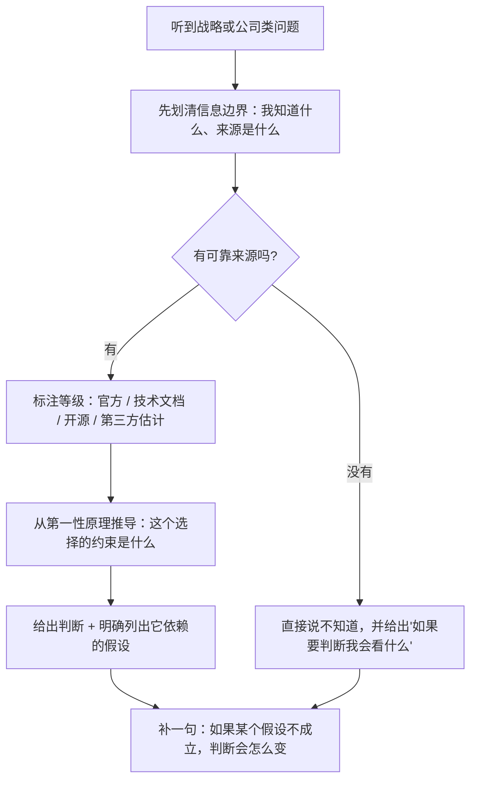

# 公司、论文与战略讨论题组（Q096–Q100）

> 位置：[InferenceAtlas](../../INDEX.md) > [模块 17](README.md) > 当前文档
> 信息截至：2026-07-29 ｜ 最后核验：2026-07-29 ｜ 内容版本：v0.1
> 时效性等级：中
> 相关主题：[模块 13](../13_research_papers_and_technical_reports/)｜[模块 14](../14_company_and_ecosystem_landscape/)｜[模块 15](../15_market_economics_and_strategy/)｜[第七组题](07_debug_benchmark_and_reliability_questions.md)

## 本章导读

这最后 5 道题不考技术细节，考**判断力与信息纪律**。它们通常出现在面试的后半段，由更资深的面试官或跨职能的面试官提出，**目的是看你能不能在信息不完整的情况下做出有依据的判断**。

这组题的共同特征是**没有唯一正确答案，但有明显错误的回答方式**。错误的方式包括：把媒体报道当成官方确认、用「最快」「最强」这类无来源的绝对化表述、以及在不知道的时候编造细节。**而正确的方式是：区分你知道什么、你推测什么、以及你不知道什么**。

**这一点在讨论具体公司时尤其重要**。关于各家公司推理基础设施的公开信息非常有限，大量流传的说法来自二手报道或匿名来源。**在面试中把这类说法讲成事实，是一个明确的负面信号**——它说明你在处理信息时不区分来源等级。**而如果面试官恰好在那家公司工作过，这个问题会立刻暴露**。

**关于本章的一个重要说明**：受当前环境的网络出口策略限制（详见 [AGENTS.md 第 11 节](../../AGENTS.md)），本库无法访问任何论文预印本站点、公司技术博客或公开财务披露，因此本章**不包含任何具体论文、公司或市场数据**。本章给出的是**读论文的判据、评估技术的框架、以及讨论公司时的信息纪律**——**这些方法本身不依赖具体数据，而且比任何具体数据都更耐用**。

本章按「读论文 → 评估技术 → 部署形态选择 → 成本趋势 → 信息纪律」的顺序组织。

## 学习目标

读完本章后，读者应能够：

1. 读一篇推理系统论文并判断它的结论能否迁移到自己的场景
2. 为「是否引入一项新技术」给出一个可执行的评估框架
3. 在自建、云实例与 API 三种形态之间做出有依据的选择
4. 分析推理成本的下降驱动因素及其对产品策略的影响
5. 在信息不完整时讨论一家公司的技术选择，且不越过披露级别

## 核心结论

- **论文的结论几乎总是绑定在它的实验配置上**：读论文的核心动作是找出「哪些条件变了结论就不成立」。
- **引入新技术的决定不取决于它的收益上限，而取决于收益 × 落地概率 ÷ 维护成本**。
- **自建、云实例与 API 的选择主要由规模与确定性决定**，而不是由单位成本的表面比较决定。
- **推理成本的下降来自算法、软件、硬件、以及利用率四条独立的线**，其中利用率常常是最大且最被忽略的一条。
- **讨论公司时必须标注信息等级**：官方披露、技术文档、开源代码、第三方估计、以及未公开——把后者说成前者是一个明确的负面信号。

## 1. 问题定义、系统边界与工作负载

本章对应 [模块 13](../13_research_papers_and_technical_reports/)、[模块 14](../14_company_and_ecosystem_landscape/) 与 [模块 15](../15_market_economics_and_strategy/) 的方法部分，并在成本分析上依赖 [模块 01 第 6 章](../01_foundations_and_metrics/06_cost_modeling_and_unit_economics.md)。

**答题的通用起点**是先声明「我知道什么、来源是什么」。这一组题里的绝大多数错误答案都源于**把不同等级的信息混在一起讲**。

**本章不含任何具体论文、公司、产品或市场数据**。所有示例均为抽象描述，题目中出现的参数均为题面给定的假设值。

### 本章题目一览

| 编号 | 题目 | 难度 | 形式 |
|---|---|---|---|
| Q096 | 怎么判断一篇推理论文的结论能不能用 | 高 | 战略讨论 |
| Q097 | 一项新技术要不要引入生产 | 高 | 战略讨论 |
| Q098 | 自建、云实例还是 API，怎么选 | 高 | 战略讨论 |
| Q099 | 推理成本下降的驱动因素是什么 | 高 | 战略讨论 |
| Q100 | 怎么在信息不完整时讨论一家公司的推理基础设施 | 高 | 战略讨论 |

## 2. 原理、数学与性能模型

这一组题反复用到四个框架：

**（一）论文结论的迁移判据**。一篇论文报告了某项技术带来某个改进，这个改进能否迁移到你的场景，取决于它的**依赖条件**是否成立。系统性的检查清单是：

$$
\text{可迁移性} = f(\text{工作点}, \text{模型}, \text{硬件}, \text{基线强度}, \text{指标口径})
$$

**其中「基线强度」最容易被忽略**：如果论文的基线是一个未优化的实现，**它报告的加速比里包含了「把基线做对」的部分**，而你的系统可能已经做对了那部分。

**（二）技术引入的期望价值**。决定是否引入一项技术时，真正的判据不是它的收益上限，而是

$$
V = \frac{\text{收益} \times \Pr[\text{落地成功}]}{\text{引入成本} + \text{持续维护成本}}
$$

**分母的第二项最常被低估**：一项技术引入后要跟着模型迭代、跟着框架升级、跟着硬件更换。**维护成本会随迭代速度放大**。

**（三）部署形态的规模判据**。自建、云实例与 API 三者的成本结构不同：

- **API**：纯变动成本，无固定成本，单位成本最高；
- **云实例**：有一定的承诺成本，单位成本中等；
- **自建**：固定成本高（硬件、设施、团队），单位成本最低。

**所以存在两个交叉点**，把规模轴分成三段。而**关键在于：交叉点的位置不只由单位成本决定，还要加上「你的负载有多可预测」**——自建的低单位成本只在高利用率下兑现，**而低可预测性会直接压低利用率**（见第六组题 Q085）。

**（四）信息等级纪律**。讨论外部信息时必须能区分：

| 等级 | 含义 | 可信度 |
|---|---|---|
| 官方披露 | 公司自己发布的正式信息 | 高（但可能有选择性） |
| 技术文档披露 | 产品文档、API 文档中的技术细节 | 高 |
| 开源代码/配置披露 | 可查证的代码与配置 | 高（但可能与生产不同） |
| 独立可复现实验 | 第三方做的、方法公开的实验 | 中高（依赖方法质量） |
| 可信第三方估计 | 有方法说明的外部推算 | 中（是估计不是事实） |
| 未公开 | 没有公开信息 | **应直接说不知道** |

**「把可信第三方估计说成官方披露」是最常见也最严重的错误**。它不是一个措辞问题，而是一个信息处理习惯的问题。

## 3. 实现机制与系统设计

以下为本章题库正文。每题的「推荐回答」是**完整答案**，可在 2–5 分钟内口头讲完。

### Q096：怎么判断一篇推理论文的结论能不能用

**难度**：高　**形式**：战略讨论　**目标岗位**：Inference / ML Systems（资深与跨职能面试）

**考察点**：检验候选人是否会评估论文而不只是复述它，尤其是否会检查基线强度。

**题目**：你读到一篇推理系统论文，报告了显著的性能改进。请说明你会怎么判断这个结论能否迁移到你自己的系统上。

#### 推荐回答

**结论**：判断可迁移性要检查**五项**——**工作点、模型结构、硬件、基线强度、指标口径**。**其中「基线强度」最容易被忽略也最容易导致高估**：如果论文的基线是未优化的实现，**它报告的改进里有一部分是「把基线做对」，而你可能已经做对了**。

**第一项：工作点**。论文的实验用了什么批大小、什么输入输出长度、prefill 还是 decode？

**这一项最容易一票否决**。推理领域的绝大多数优化都是工作点相关的：一个在大批下有效的优化在小批下可能无效，一个针对长序列的优化在短序列上收益接近零。**所以第一个动作是把论文的工作点与你的工作点对齐**，**如果差距很大，报告的数字对你没有参考价值**。

**第二项：模型结构**。注意力变体（是否 GQA、是否 MLA）、是否 MoE、隐藏维度与层数的比例、词表大小。**很多优化的收益与这些结构参数直接相关**——例如与 KV 相关的优化在 GQA 模型上的收益远小于 MHA 模型，因为 GQA 已经把 KV 压下来了。

**第三项：硬件**。算力带宽比是关键量。**同一个优化在算力带宽比不同的硬件上收益可以相反**：一个减少访存的优化在带宽紧张的硬件上收益大，在算力紧张的硬件上收益小。**所以要问「论文的硬件的算力带宽比与你的相比如何」**。

**第四项：基线强度——最重要的一项**。

三个具体的检查：

1. **基线用的是什么实现**？一个成熟的推理引擎，还是研究代码？**后者的基线可能缺少连续批处理、分页 KV、算子融合这些已经是标配的优化**；
2. **基线是否被同等程度地调优**？**「我们的方法调到最优、基线用默认配置」是最常见的不公平比较**；
3. **报告的改进是否与「已知的标配优化」重叠**？如果一篇论文报告的加速大部分来自「我们避免了物化中间矩阵」这类已经被广泛实现的东西，**那么在你的系统上这部分收益已经被拿掉了**。

**判断基线强度的一个实用方法**：看论文的基线数字是否与你自己系统在相同配置下的数字接近。**如果论文的基线明显比你现在的系统慢，那么报告的改进倍数在你这里会大幅缩水**。

**第五项：指标口径**。改进是在什么指标上？吞吐还是时延？**如果是吞吐，是否报告了对应的时延**（见第七组题 Q089——吞吐可以通过增大批任意提高）？是哪个分位数？样本量多少？

**还要检查三件事**：

**（一）质量影响**。如果这项技术改变了数值路径（量化、近似注意力、投机解码的实现），**必须看它报告的质量指标，以及质量评测是否充分**。**只报速度不报质量的论文，其结论不能直接用于生产决策**。

**（二）实现复杂度与可维护性**。论文通常不讨论这个，但它决定了落地成本。关键问题：**这项技术是否与你已有的其他机制冲突**？例如某些优化与连续批处理、分页 KV 或执行图固化不兼容——**引入它可能要放弃另一个已有的收益**。

**（三）是否有独立复现**。**一篇论文的数字与一个独立第三方复现出的数字，可信度不同**。如果有开源实现且被他人验证过，可信度显著提高。

**评估后的三种结论**：

| 结论 | 依据 | 下一步 |
|---|---|---|
| 值得试 | 工作点匹配、基线可比、有独立复现 | 做一个小规模复现验证 |
| 值得关注但不试 | 工作点不匹配，或依赖你没有的条件 | 记录下来，条件变化时重新评估 |
| 收益不可迁移 | 改进主要来自基线缺陷 | 检查自己是否已经做对了那部分 |

**最后一行有一个有价值的副产品**：即使一篇论文的方法对你没用，**它揭示的「基线缺陷」也许提醒你检查自己的实现**。

**面试中的表达方式**：讲一篇你读过的论文时，**贡献讲一半时间，局限与迁移条件讲另一半**。**只讲贡献会显得像在复述摘要**；而能说出「这个结论在我们的场景下会缩水，因为……」**才说明你真正评估了它**。

**受核验限制的说明**：本回答不引用任何具体论文。当前环境无法访问论文预印本站点，因此这里只给评估方法。

#### 强答案必须覆盖

- 五项检查：工作点、模型结构、硬件、基线强度、指标口径
- 工作点最容易一票否决，推理优化普遍工作点相关
- 模型结构影响收益，如 KV 优化在 GQA 上收益小于 MHA
- 硬件的算力带宽比不同可能使收益相反
- 基线强度三个检查：实现成熟度、是否同等调优、改进是否与标配优化重叠
- 实用方法：比较论文基线与自己系统在同配置下的数字
- 指标口径：吞吐是否配对时延、分位数与样本量
- 另外三件事：质量影响、与已有机制的兼容性、是否有独立复现
- 三种结论及其下一步；基线缺陷可作为自查提醒
- 面试表达上贡献与局限各占一半

#### 常见错误

- 只复述论文的贡献
- 不检查基线强度就采信加速比
- 忽略工作点差异
- 不看质量指标就用于生产决策

#### 可能追问

1. 怎么判断论文的基线是否被同等调优？
2. 如果这项技术与你的连续批处理不兼容，你会怎么权衡？
3. 小规模复现验证应该验证什么？
4. 没有开源实现的论文，你会投入多少去复现？

#### 关联阅读

- [时延、吞吐与 SLO](../01_foundations_and_metrics/02_latency_throughput_and_slo.md)
- [roofline 与性能建模](../01_foundations_and_metrics/04_roofline_and_performance_modeling.md)
- [模块 13：论文与技术报告](../13_research_papers_and_technical_reports/)

### Q097：一项新技术要不要引入生产

**难度**：高　**形式**：战略讨论　**目标岗位**：Inference / ML Systems（资深与跨职能面试）

**考察点**：检验候选人是否会把维护成本与落地概率纳入决策，而不只看收益上限。

**题目**：团队里有人提议引入一项新的推理优化技术。请给出你的评估框架与决策流程。

#### 推荐回答

**结论**：判据不是收益上限，而是

$$
V = \frac{\text{收益} \times \Pr[\text{落地成功}]}{\text{引入成本} + \text{持续维护成本}}
$$

**其中分母的第二项最常被低估，分子的第二项最常被忽略**。决策流程是**「先验证收益在不在 → 再估落地概率 → 再算维护成本 → 小范围试 → 定退出条件」**。

**第一步，验证收益在你的工作点上存在**。

这一步必须在投入之前做，而且往往能靠**估算**而不是实验完成：

1. **这项技术针对哪一类瓶颈**（算力、带宽、容量、延迟）？
2. **你的系统当前的瓶颈是哪一类**？
3. **如果不匹配，收益接近零，讨论结束**。

**这一步能省下大量无效投入**。举例：一项减少访存的优化对一个已经算力受限的服务几乎无用；一项提高大批吞吐的优化对一个批大小恒为个位数的延迟敏感服务没有意义。

**还要算收益的上限**。用第四组题 Q046 的 Amdahl 形式：如果这项技术优化的环节只占单步时间的一小部分，**即使那部分变成零，整体收益也有限**。**能算出上限，就能判断值不值得**。

**第二步，估落地概率**。降低概率的因素：

| 因素 | 为什么降低概率 |
|---|---|
| 与已有机制冲突 | 可能要放弃另一个已有收益 |
| 依赖不成熟的软件 | 可能卡在别人的 bug 上 |
| 需要改变数值路径 | 引入质量风险，可能验证不过 |
| 只有论文没有实现 | 复现本身就是一个项目 |
| 依赖特定硬件或版本 | 换硬件时失效 |

**「与已有机制冲突」是最容易被低估的一项**。推理系统的各个机制耦合很紧：连续批处理、分页 KV、执行图固化、投机解码、前缀缓存——**引入一个新机制常常要处理它与其中几个的交互**。

**第三步，算维护成本**。三个来源：

1. **跟随模型迭代**：模型结构变化时这项优化是否还成立？**如果它依赖特定的结构参数（如某个维度可被整除），那么每次模型变化都要重新验证**；
2. **跟随框架升级**：如果它是对框架的侵入式改动，**每次框架升级都要重新适配**；
3. **认知成本**：团队里有几个人能维护它？**如果只有一个人懂，这是一个组织风险**。

**维护成本会随迭代速度放大**。一个每两个月换模型的团队，**维护成本可能超过收益**——而这一点在初次评估时几乎从不被算进去。

**第四步，小范围试并设定明确的成功标准**。

**关键是标准要事先定，而且要可判定**：

- **性能目标**：在什么工作点上达到什么改进（含样本量要求）；
- **质量门槛**：金标准集上的指标不低于某个值（见第七组题 Q093）；
- **时间盒**：投入多长时间后如果没达到就停。

**「时间盒」这一项最容易被跳过，也最容易导致项目无限拖延**。**事先约定「什么时候放弃」比约定「什么时候成功」更重要**，因为成功时不需要决策，失败时才需要。

**第五步，定退出条件与回滚路径**。即使成功上线，也要保留：

1. **开关**：能在不重启的前提下关掉；
2. **回归测试**：防止后续变更破坏它；
3. **重新评估的触发条件**：换硬件、换模型、或框架大版本升级时要重新验证。

**一个反向的检查：不引入的代价是什么**。如果这项技术已经成为事实标准，**不引入的代价是持续的成本劣势与人才招聘上的劣势**（候选人不愿意加入技术栈落后的团队）。**这一项在纯技术评估中经常被忽略**，但它是一个真实的成本。

**面试中的加分表达**：讲一次自己参与的技术引入决策时，**包括你当时判断错的部分**——例如「我们低估了它与前缀缓存的交互，多花了一个月」。**这种坦率会让整个叙述可信得多**。

**答题的核心一句话**：判据是**收益 × 落地概率 ÷（引入成本 + 维护成本）**；**流程的第一步是验证收益在你的工作点上存在**（这一步靠估算就能完成且能省下大量投入），**而最容易跳过但最重要的是「事先约定时间盒」**。

#### 强答案必须覆盖

- 给出期望价值判据，指出维护成本与落地概率最常被忽略
- 第一步靠估算验证收益是否存在：瓶颈类别是否匹配 + Amdahl 上限
- 第二步落地概率的五个降低因素，尤其与已有机制冲突
- 列出推理系统中互相耦合的机制
- 第三步维护成本三来源，并指出会随迭代速度放大
- 第四步事先定可判定的成功标准，含时间盒
- 强调「事先约定何时放弃」比「何时成功」更重要
- 第五步退出条件：开关、回归测试、重新评估触发条件
- 反向检查「不引入的代价」，含成本劣势与招聘劣势

#### 常见错误

- 只看收益上限
- 不验证瓶颈类别是否匹配就投入
- 忽略维护成本与模型迭代速度的关系
- 没有时间盒导致项目无限拖延

#### 可能追问

1. 与已有机制冲突时，怎么判断放弃哪一个？
2. 时间盒设多久合适？依据什么？
3. 只有一个人懂这项技术，怎么降低组织风险？
4. 「不引入的代价」怎么量化？

#### 关联阅读

- [成本建模与单位经济学](../01_foundations_and_metrics/06_cost_modeling_and_unit_economics.md)
- [算子融合与优化](../04_compilers_runtimes_and_kernels/07_kernel_fusion_and_operator_optimization.md)
- [模块 15：市场、经济与战略](../15_market_economics_and_strategy/)

### Q098：自建、云实例还是 API，怎么选

**难度**：高　**形式**：战略讨论　**目标岗位**：Inference / ML Systems（资深与跨职能面试）

**考察点**：检验候选人是否理解三者的成本结构差异，以及是否会把可预测性纳入考虑。

**题目**：一个团队要部署大模型推理能力，可以调用第三方 API、在云上租实例自己部署、或者自建机房。请给出选择框架。

#### 推荐回答

**结论**：主要由**规模**与**负载的可预测性**两个轴决定，**而不是由单位成本的表面比较决定**。三者的成本结构不同——API 是纯变动成本、自建以固定成本为主——**所以存在两个交叉点，把规模轴分成三段；而低可预测性会把交叉点往右推**。

**三者的成本结构**：

| 形态 | 固定成本 | 变动成本 | 单位成本（满载时） |
|---|---|---|---|
| 第三方 API | 无 | 按 token 计费 | 最高 |
| 云实例自部署 | 中（承诺用量或预留） | 按实例小时 | 中 |
| 自建 | 高（硬件、设施、团队） | 电力与运维 | 最低 |

**「满载时」这三个字是关键**。自建的低单位成本**只在高利用率下兑现**——而实际成本是

$$
C_{\text{unit}} = \frac{C_{\text{fixed}} + C_{\text{variable}}}{\text{实际产出}}
$$

**利用率 40% 意味着固定成本部分的单位成本是满载时的 2.5 倍**（见第六组题 Q085）。**所以「自建更便宜」这个说法必须补上「如果你能把它用满」**。

**因此第一个判据是规模**。规模越大，固定成本被摊薄得越好，自建越有利。**两个交叉点把规模分成三段**：

| 规模 | 推荐 | 理由 |
|---|---|---|
| 小（不确定、验证期） | API | 无固定成本，能快速试错 |
| 中 | 云实例自部署 | 有一定规模但不足以摊薄自建的固定成本 |
| 大且稳定 | 自建（或混合） | 固定成本被充分摊薄 |

**第二个判据是可预测性**。自建要求你能预测未来的容量需求（硬件采购与设施建设都有很长的提前期）。**如果负载增长不可预测，自建的风险是「买多了闲置、买少了缺货」**，两者都很贵。**低可预测性把两个交叉点都往右推**——也就是说，需要更大的规模才值得自建。

**除了成本，还有四类必须纳入的因素**：

**（一）能力与控制**。

| 需求 | API 能否满足 |
|---|---|
| 用自己微调的模型 | 取决于服务方是否支持 |
| 控制解码参数与约束解码 | 通常部分支持 |
| 控制批策略与调度以优化时延 | **不能** |
| 保证数据不离开自己的边界 | **通常不能** |

**第三行和第四行是常见的硬性理由**。如果你需要为特定的时延 SLO 做调度优化，或者有数据不出境/不出内网的要求，**API 就被排除了，此时规模判据不再适用**。

**（二）团队能力**。自部署需要有人懂推理引擎、有人能排查性能问题、有人值班。**没有这个团队，「便宜的自建」实际上会更贵**（表现为事故频发与优化不足）。**这是一个应该被诚实评估的约束**。

**（三）时间成本**。API 可以在几天内上线，自部署需要几周到几个月，自建需要更长。**在产品还需要验证的阶段，时间成本可能远超单位成本的差异**。

**（四）供应与议价**。依赖单一 API 提供方有集中风险（价格、可用性、政策变化）。**但自建也有供应风险**（硬件交付周期）。**两者都不是零风险，只是风险形式不同**。

**混合形态往往是实际答案**。三种常见组合：

1. **基础负载自建/自部署，峰值溢出到 API**。**这直接解决了利用率问题**——自建部分按基础负载配置从而保持高利用率，波动部分由无固定成本的 API 吸收。**这是把两种成本结构的优点结合起来**，代价是要维护两条路径且它们的模型可能不同；
2. **按模型分层**：常用的小模型自部署，偶发的大模型调 API；
3. **按数据敏感度分流**：敏感数据本地处理，其余走 API（与第六组题 Q088 的端云协同是同一个思路）。

**第一种组合值得强调**，因为它针对的正是「自建的低单位成本依赖高利用率」这个核心矛盾。

**回答的形状**。这道题的正确姿态是**给出判断 + 标注它依赖的假设**：「以你描述的规模与可预测性，我会选 X；**但如果有数据边界要求，那么无论规模如何都只能自部署**；**如果负载增长不可预测，我会推迟自建的决定并先用 Y**」。

**受核验限制的说明**：本回答不给出任何具体的价格、交叉点位置或厂商比较。这些都必须用你自己的实际报价与负载数据计算。

**答题的核心一句话**：由**规模**与**可预测性**两个轴决定，**自建的低单位成本只在高利用率下兑现**；**而数据边界与调度控制这两类硬性需求会直接排除 API，使规模判据失效**；**混合形态（基础负载自建 + 峰值走 API）直接针对利用率这个核心矛盾**。

#### 强答案必须覆盖

- 三者的成本结构对比，指出固定与变动成本的差异
- 强调自建的低单位成本只在高利用率下兑现，给出单位成本式子
- 第一个判据规模，两个交叉点分成三段
- 第二个判据可预测性，低可预测性把交叉点往右推
- 四类非成本因素：能力与控制、团队能力、时间成本、供应与议价
- 指出调度控制与数据边界是硬性理由，会直接排除 API
- 诚实评估团队能力，否则「便宜的自建」实际更贵
- 混合形态三种组合，尤其基础负载自建 + 峰值走 API 针对利用率矛盾
- 回答形状是判断 + 依赖的假设 + 假设不成立时的变化

#### 常见错误

- 只比单位成本不看固定成本与利用率
- 忽略数据边界与调度控制这类硬性需求
- 不评估团队能力
- 给不出混合形态这个选项

#### 可能追问

1. 基础负载自建 + 峰值走 API，两边模型不同怎么处理？
2. 自建的硬件采购提前期怎么影响决策？
3. 团队能力不足但规模已经够大，怎么过渡？
4. 怎么量化依赖单一 API 提供方的集中风险？

#### 关联阅读

- [成本建模与单位经济学](../01_foundations_and_metrics/06_cost_modeling_and_unit_economics.md)
- [容量规划](../01_foundations_and_metrics/08_capacity_planning.md)
- [serverless 与突发推理](../03_serving_engines_and_scheduling/11_serverless_and_burst_inference.md)
- [模块 15：市场、经济与战略](../15_market_economics_and_strategy/)

### Q099：推理成本下降的驱动因素是什么

**难度**：高　**形式**：战略讨论　**目标岗位**：Inference / ML Systems（资深与跨职能面试）

**考察点**：检验候选人能否把一个笼统的趋势拆成可分析的驱动线，并指出哪些是自己能影响的。

**题目**：推理的单位成本在持续下降。请拆解驱动因素，并说明这对产品与工程策略意味着什么。

#### 推荐回答

**结论**：拆成**四条独立的线**——**算法、软件、硬件、利用率**。**其中「利用率」常常是最大也最被忽略的一条**，而且**它是唯一一条完全由你自己控制的**。

**线一：算法层**。降低每 token 的必要计算与访存量：

| 手段 | 机制 |
|---|---|
| 量化 | 减少权重与 KV 的字节数 |
| 稀疏化（如 MoE） | 减少每 token 的激活参数 |
| KV 缩减（GQA、MLA、压缩） | 减少每 token 的 KV 占用与读取 |
| 投机解码 | 用一次前向产出多个 token |
| 更小但同等质量的模型 | 直接减少全部资源需求 |

**这一条的特点是收益大但有质量风险**，而且**每一项都需要验证而不能假设**。

**线二：软件层**。提高既有硬件的有效利用率 $\beta$：

连续批处理、分页 KV、算子融合、更好的 kernel、执行图固化、前缀缓存、更好的调度。

**这一条的特点是无质量风险（如果实现正确）**，**所以它通常应该被优先做完**。但它有一个上界：**$\beta$ 不能超过 1**，所以当你已经接近硬件的物理极限时，这条线就用尽了。**判断是否用尽的方法是算实测带宽利用率**（见第六组题 Q079）。

**线三：硬件层**。单位算力与单位带宽的成本下降。**这一条基本不由你控制，你只能选择何时采用**。而采用新硬件有两个隐含成本：

1. **软件适配**：新硬件的 $\beta$ 初期可能很低（见 Q077）；
2. **迁移成本**：模型、kernel、运维流程都要适配。

**所以「新硬件单位成本更低」不等于「换了就更便宜」**。

**线四：利用率——最大且最被忽略的一条**。

$$
C_{\text{unit}} \propto \frac{1}{u}
$$

其中 $u$ 是平均利用率。**利用率从 40% 提到 80%，单位成本直接减半**——**这个幅度往往超过前三条线在同一时间内的贡献**。

提高利用率的手段：

| 手段 | 机制 | 注意 |
|---|---|---|
| 混合负载 | 用离线批处理填低谷 | 需要隔离以保护在线 SLO |
| 弹性扩缩容 | 按需增减容量 | 冷启动时间是约束 |
| 多租户共享 | 不同租户的峰谷互补 | 需要隔离（见 Q095） |
| 峰值溢出到外部 | 基础负载自建、峰值走 API | 需维护两条路径（见 Q098） |

**这一条最容易被忽略的原因是它不是一个技术优化**——它是调度、产品与商业决策的组合。**所以在纯工程的成本讨论中它经常缺席**，**而在面试中主动提出它是一个明显的加分点**。

**四条线的对比**：

| 线 | 你能控制吗 | 有质量风险吗 | 有上界吗 |
|---|---|---|---|
| 算法 | 部分（取决于是否自训模型） | **是** | 有（质量约束） |
| 软件 | 是 | 否（若实现正确） | 有（$\beta \le 1$） |
| 硬件 | 只能选择采用时机 | 否 | 无（长期持续） |
| **利用率** | **是** | 否 | 有（$u \le 1$） |

**这张表给出优先级建议**：**先做没有质量风险且你能控制的两条（软件、利用率）**，再评估算法层（需要质量验证），硬件层则按周期规划。

**对产品与工程策略的四个含义**：

**（一）今天成本上不可行的产品形态，明后天可能可行**。**所以架构应该假设成本会下降**：不要为了当下的成本约束做出难以撤销的产品妥协。**具体建议是把「模型能力」与「产品逻辑」解耦**，使得换用更强或更便宜的模型不需要重写产品。

**（二）成本下降会被需求增长吃掉**。单位成本下降常常伴随使用量上升（更长的上下文、更多的推理步数、更多的调用），**所以总成本不一定下降**。**因此成本治理（配额、预算、按需降级）不会因为单位成本下降而变得不必要**。

**（三）优化的边际收益在变化**。当硬件与软件的进步已经把成本压得很低时，**投入人力做进一步优化的性价比会下降**——**同样的人力也许更该投在产品上**。**这个判断需要定期重做，而不是一劳永逸**。

**（四）成本结构比成本水平更重要**。**「输入 token 与输出 token 的成本差异」**（prefill 与 decode 的资源消耗形式不同）会影响产品设计：**一个可以用长输入换短输出的设计，比反过来的设计便宜得多**。**这类设计层面的选择往往比工程优化的杠杆更大**。

**受核验限制的说明**：本回答不引用任何具体的价格、下降幅度或市场数据。当前环境无法核验此类数据，**而在无来源时给出具体幅度属于本库明确禁止的行为**。读者应用自己的实际账单数据做这个分析。

**答题的核心一句话**：四条线是**算法、软件、硬件、利用率**，**其中利用率是最大且最被忽略的一条，也是唯一完全由你控制且无质量风险的**；**而成本结构（输入与输出的成本差异）对产品设计的杠杆往往大于工程优化**。

#### 强答案必须覆盖

- 拆成四条独立的线：算法、软件、硬件、利用率
- 算法层收益大但有质量风险，每项需验证
- 软件层无质量风险故应优先做完，上界是 $\beta \le 1$
- 硬件层不由你控制，且新硬件有软件适配与迁移的隐含成本
- 利用率是最大且最被忽略的一条，给出 $C \propto 1/u$ 与提升手段
- 指出利用率不是技术优化而是调度产品商业的组合
- 四条线的对比表给出优先级建议
- 四个策略含义：架构假设成本下降、需求会吃掉下降、优化边际收益变化、成本结构比水平更重要
- 声明不引用未核验的价格与下降幅度

#### 常见错误

- 笼统说「成本在下降」不拆驱动因素
- 忽略利用率这条线
- 认为新硬件单位成本低就等于换了更便宜
- 给出未核验的具体下降幅度

#### 可能追问

1. 混合负载填低谷，怎么保证不影响在线 SLO？
2. 怎么判断软件层这条线是否已经用尽？
3. 输入与输出的成本差异有多大？怎么影响产品设计？
4. 成本下降被需求吃掉时，成本治理应该怎么设计？

#### 关联阅读

- [成本建模与单位经济学](../01_foundations_and_metrics/06_cost_modeling_and_unit_economics.md)
- [能效与每 token 焦耳](../01_foundations_and_metrics/07_energy_efficiency_and_joules_per_token.md)
- [容量规划](../01_foundations_and_metrics/08_capacity_planning.md)
- [模块 15：市场、经济与战略](../15_market_economics_and_strategy/)

### Q100：怎么在信息不完整时讨论一家公司的推理基础设施

**难度**：高　**形式**：战略讨论　**目标岗位**：Inference / ML Systems（资深与跨职能面试）

**考察点**：检验候选人的信息纪律——这是本题库最看重的一项素质，也是最容易被忽略的一项。

**题目**：面试官问你：你觉得某家公司的推理基础设施是怎么做的？关于这个问题的公开信息很有限。请说明你会怎么回答。

#### 推荐回答

**结论**：正确的回答方式是**「划清信息边界 → 标注等级 → 从第一性原理推导 → 给出判断并列出假设」**。**最重要的一点是：不知道的部分要明确说不知道，而不是用听说的内容填补**。

**为什么这一点如此重要**。三个理由：

1. **面试官可能就在那家公司工作过**，或者认识在那里工作的人。**编造的细节会被立刻识别**；
2. **这道题真正考察的不是你知道多少，而是你怎么处理信息**。一个把传闻当事实的人，**在工作中也会把推测写进设计文档**——这是一个可预测的行为模式；
3. **「我不知道，但如果要判断我会看什么」是一个更强的回答**，因为它展示的是方法。**方法比记忆更能预测工作表现**。

**第一步，划清信息边界并标注等级**。

把你知道的东西按来源分级：

| 等级 | 你能说什么 | 措辞 |
|---|---|---|
| 官方披露 | 公司自己发布过的 | 「他们公开说过……」 |
| 技术文档披露 | 产品或 API 文档里的技术细节 | 「他们的文档提到……」 |
| 开源代码/配置披露 | 可查证的代码 | 「他们开源的代码里……」 |
| 独立可复现实验 | 第三方公开方法的实验 | 「有第三方测过，方法是……」 |
| 可信第三方估计 | 有方法说明的外部推算 | 「有估计认为……但这是估计」 |
| 未公开 | 没有可靠信息 | **「这一点我不知道」** |

**「把可信第三方估计说成官方披露」是最常见的错误**。它往往不是故意的——**一条信息在多次转述后会丢掉它的来源标签**，而使用者不自觉地把它当成事实。**所以纪律不是「不要撒谎」，而是「主动追溯来源」**。

**同样要避免的是无来源的绝对化表述**：「最快」「最强」「最省」「领先」。**这类词几乎总是缺少比较口径**（在什么工作点上、用什么指标、和谁比）。**改成有条件的比较**：「在某个指标上、某个配置下，有公开数据显示……」。

**第二步，从第一性原理推导——这是回答的主体**。

即使不知道具体实现，**你可以从「他们的产品形态」推导「他们面临的约束」，再推导「这些约束会导向什么技术选择」**。推导链条：

| 从可观察的 | 推出约束 | 导向的技术选择 |
|---|---|---|
| 产品有很长的上下文 | KV 显存压力大 | 需要 KV 缩减、分页管理、可能的 KV 卸载 |
| 产品是交互式对话 | TPOT 是硬 SLO | 倾向张量并行、投机解码；批不能太大 |
| 定价对输入远低于输出 | prefill 成本被缓存摊薄 | 很可能有前缀缓存 |
| 有明显的多轮对话场景 | 前缀重复度高 | 缓存亲和路由的收益大 |
| 产品支持结构化输出 | 需要约束解码 | 有语法约束解码的实现 |
| 有推理型（长输出）产品 | decode 侧负载重 | 配比偏向 decode，可能有 PD 分离 |

**这张表是这道题的核心**。它展示的是**「从公开可观察的产品特征推导技术约束」的能力**，而这个能力完全不依赖内部信息。

**注意推导的措辞**：应该说「**如果**他们要支持这个产品形态，**那么**他们大概率需要解决这个问题」，**而不是「他们用了 X 技术」**。**前者是推理，后者是断言**。

**第三步，给出判断并列出假设**。

推导之后可以给一个判断，但必须带上假设：

「基于他们的产品形态，我推测他们在 KV 管理上投入很多，**这依赖两个假设**：一是他们的上下文长度确实如产品文档所述，二是他们没有用某种我不知道的方式绕过这个问题。**如果第二点不成立，我的推测就不适用**。」

**这个形状同时展示了判断力与诚实**。

**第四步，把话题转向你能贡献的部分**。

如果确实不了解，一个建设性的转向是：「关于他们的具体实现我没有可靠信息。**但如果这是我们要解决的问题，我会这样考虑……**」然后讨论你熟悉的技术权衡。

**这个转向不是逃避，而是把问题引到有价值的讨论上**。面试官问这道题通常不是要考你的行业情报，**而是想看你怎么思考一个系统的约束**。

**三种明确错误的回答方式**：

| 错误 | 为什么错 |
|---|---|
| 把传闻讲成事实 | 信息纪律问题，且容易被当场识破 |
| 用绝对化表述（最快、领先） | 缺少比较口径，显得不严谨 |
| 只说「我不知道」然后停住 | 浪费了展示方法的机会 |

**第三行也是一种错误**。**「不知道」应该是一个开头而不是结尾**——后面要接「但如果要判断，我会看什么」。

**一个可以主动提及的加分点**：说明你**怎么获取和验证这类信息**。「我会看他们的工程博客、公开演讲、开源仓库和产品文档，**并且区分这些一手来源与二手报道**。对于只有二手报道的说法，我会当成待核实的线索而不是结论。」**这句话直接展示了你的信息处理习惯**。

**受核验限制的说明**：本回答不涉及任何具体公司。当前环境无法访问公司技术博客或公开披露，**而在无可靠来源时编造任何公司的内部推理基础设施细节属于本库明确禁止的行为**。

**答题的核心一句话**：**划清边界、标注等级、从产品形态推导约束、给判断并列假设**；**「我不知道」是一个合格的开头但不是合格的结尾**，后面必须接「如果要判断我会看什么」。

#### 强答案必须覆盖

- 说清为什么信息纪律重要：面试官可能是内部人、这道题考的是信息处理方式
- 给出六级信息等级表与对应措辞
- 指出「把第三方估计说成官方披露」常因转述丢失来源标签，故纪律是主动追溯来源
- 避免无来源的绝对化表述，改为有条件的比较
- 第二步给出「从产品形态推导技术约束」的推导表（回答主体）
- 推导的措辞应是「如果…那么大概率需要」而非「他们用了 X」
- 第三步给判断并列出假设，含「假设不成立则推测不适用」
- 第四步建设性转向到自己能贡献的技术权衡
- 三种错误方式，指出「只说不知道然后停住」也是错误
- 加分点：主动说明如何获取与验证信息、区分一手与二手来源

#### 常见错误

- 把传闻或二手报道讲成事实
- 使用「最快」「领先」这类无来源的绝对化表述
- 只说「我不知道」就停住，浪费展示方法的机会
- 在不知道时编造具体的技术细节

#### 可能追问

1. 如果面试官追问「你觉得他们用了哪种并行方式」，你怎么回答？
2. 怎么区分一手来源与二手报道？有哪些常见的混淆？
3. 从产品定价能推导出哪些技术约束？
4. 如果你的推导与流传的说法矛盾，你会怎么处理？

#### 关联阅读

- [数据库使用指南](../00_start_here/00_database_guide.md)
- [推理指标速查](../01_foundations_and_metrics/09_inference_metrics_cheat_sheet.md)
- [模块 14：公司与生态图景](../14_company_and_ecosystem_landscape/)

## 4. 性能、成本、能耗与可靠性 trade-off

这一组题的核心 trade-off 是**判断的果断与信息的不足**：

| 姿态 | 优点 | 风险 |
|---|---|---|
| 给出明确判断 | 显示决断力 | 可能建立在错误的假设上 |
| 只列举各种可能 | 显示全面 | **显得无法决策** |
| **给出判断 + 标注依赖的假设** | 兼顾两者 | 需要更清楚的表达 |

**第三行是正确的姿态**。具体形式是：「基于 X 和 Y 这两个假设，我会选 A；**如果 Y 不成立，答案会变成 B**」。**这句话的后半部分是关键**——它同时展示了判断力和对不确定性的诚实。

第二个 trade-off 是**跟进新技术的节奏**。过早引入承担试错成本，过晚引入损失竞争力。**判据是「这项技术的收益是否在你的工作点上」**——很多技术在论文的工作点上收益显著，在你的工作点上可能接近零（见 Q096）。**所以「先验证收益在不在」比「快速引入」更重要**。

第三个 trade-off 是**深度与广度**。面试中被问到不熟悉的公司或论文时，**承认不熟悉然后转向你熟悉的相关问题，远优于勉强讨论**。**前者是边界清晰，后者是不可靠**。

## 5. benchmark、真实案例或公开部署案例

**本章不含任何具体论文、公司、产品或市场数据**。

受当前环境的网络出口策略限制（详见 [AGENTS.md 第 11 节](../../AGENTS.md)），本库无法访问论文预印本站点、公司技术博客、开源仓库的文档页面或任何公开财务披露，因此无法核验任何一条关于具体论文、公司技术选择或市场规模的陈述。**在无可靠来源的情况下写出这类内容属于本库明确禁止的行为**（尤其是编造公司内部推理基础设施的细节），所以本章只给方法。

**读者应自行准备的材料**：

| 材料 | 为什么面试会问 | 怎么准备 |
|---|---|---|
| 两三篇你读过并能评价的推理系统论文 | 检验你的技术判断力 | 按 Q096 的清单读，**准备好说出它的局限** |
| 一次你参与的技术引入决策 | 检验你的工程判断 | 包括**你当时判断错的部分** |
| 你所在团队的部署形态与选它的理由 | 检验你是否理解成本结构 | 按 Q098 的框架整理 |
| 你对目标公司公开信息的了解 | 检验你的准备程度与信息纪律 | **只用官方与技术文档来源** |

**准备建议**：第一项和第四项要注意方式。**读论文要准备好说它的局限而不只是它的贡献**——只会复述贡献说明你没有真正评估它。而准备公司信息时**只用官方渠道**：技术博客、工程博客、公开演讲、开源仓库、产品文档。**二手报道可以作为「我看到有报道说，但我没有核实」提及，不能作为事实陈述**。

## 6. 设计决策框架

回答这一组题的通用顺序：

**图解读**：
1. **本图展示什么**：战略类问题的答题结构。起点是划清信息边界，核心是「从第一性原理推导而不是从传闻推导」，终点是「判断 + 假设 + 假设不成立时的替代判断」。
2. **核心瓶颈**：瓶颈在 C 节点。**「没有可靠来源」时选择 D 分支需要克服一种压力**——感觉说「不知道」会显得准备不足。**但实际上 D 分支的回答质量往往高于勉强讨论**，因为它接着给出了「我会看什么」，**这展示的是方法而不是记忆**。
3. **图中的 trade-off**：F 节点的第一性原理推导需要时间，而且结论可能与流传的说法不同。**但从约束出发推导出的判断是可辩护的，而从传闻出发的判断在被追问时会崩塌**。
4. **面试如何引用**：可以说「关于这家公司的具体实现我没有可靠信息，但如果要判断，我会从他们的产品形态推导他们面临的约束——然后看这些约束会导向什么样的技术选择」。

**最后一步 H「假设不成立时会怎么变」是这一组题的加分动作**。它把一个可能被质疑的判断变成一个展示思考深度的机会。

## 7. 常见失败模式与排查路径

| 症状 | 根因 | 修正 |
|---|---|---|
| 把媒体报道讲成官方确认 | 不区分信息等级 | 明确标注来源与等级 |
| 用「最快」「最强」这类表述 | 无来源的绝对化 | 改为有条件的比较 |
| 不知道却编造细节 | 怕显得准备不足 | 说不知道 + 给出判断方法 |
| 只复述论文的贡献 | 没有真正评估 | 主动说出它的局限与迁移条件 |
| 用单位成本直接比较三种部署形态 | 忽略固定成本与利用率 | 按规模与可预测性分段 |
| 给出判断但不说假设 | 显得武断 | 补上「依赖什么假设」 |
| 只列可能不做判断 | 显得无法决策 | 给判断 + 标注假设 |

**最严重的是第一条和第三条**。它们不是知识问题而是信息处理习惯问题，**而面试官对这两条格外敏感**——因为一个不区分来源等级的人，在工作中也会把推测写进设计文档。

## 8. 关联面试主题

1. 论文结论的迁移判据与基线强度——见 Q096
2. 技术引入的期望价值框架——见 Q097
3. 三种部署形态的规模判据——见 Q098
4. 成本下降的四条驱动线——见 Q099
5. 讨论公司时的信息等级纪律——见 Q100

## 9. 小结

这最后 5 道题考判断力与信息纪律，而它们的共同核心是**「区分你知道什么、你推测什么、你不知道什么」**。

四条准备建议：

**第一，读论文要准备好说局限**。只会复述贡献的人显得像在背摘要。**能说出「这个结论依赖它的基线是未优化的实现，在我们的系统上收益会小得多」，是真正读懂了**。

**第二，技术判断要带上维护成本**。收益上限是最容易讨论的部分，**而「谁来维护它、模型换了怎么办、框架升级会不会坏」才是决定成败的部分**。

**第三，成本讨论要拆到驱动因素**。「推理成本在下降」是一个没有信息量的陈述。**拆成算法、软件、硬件、利用率四条线，并指出哪一条是你能影响的**，才是有价值的分析。

**第四，也是最重要的：不知道就说不知道**。然后紧接着给出「如果要判断，我会看什么」。**这个组合的效果远好于勉强讨论**——它展示的是方法而不是记忆，**而方法是面试真正想考察的东西**。

最后一条通用建议：**这一组题的最佳回答形状是「判断 + 假设 + 假设不成立时的替代」**。三段齐全的回答既果断又诚实，**而这恰好是资深工程师在真实决策中的样子**。

## 关键术语

| 中文术语 | 英文 | 定义 | 单位/口径 | 关联文档 |
|---|---|---|---|---|
| 基线强度 | baseline strength | 论文对照组的优化程度，决定报告改进中有多少可迁移 | — | [模块 13](../13_research_papers_and_technical_reports/) |
| 迁移条件 | transfer conditions | 论文结论成立所依赖的工作点与配置 | — | [模块 13](../13_research_papers_and_technical_reports/) |
| 维护成本 | maintenance cost | 技术引入后随模型与框架迭代而持续付出的成本 | 人力/时间 | [模块 15](../15_market_economics_and_strategy/) |
| 固定成本与变动成本 | fixed vs variable cost | 自建以固定成本为主，API 以变动成本为主 | 货币 | [模块 01 第 6 章](../01_foundations_and_metrics/06_cost_modeling_and_unit_economics.md) |
| 信息等级 | disclosure level | 一条信息的来源可信度分级 | — | [模块 14](../14_company_and_ecosystem_landscape/) |
| 可信第三方估计 | credible third-party estimate | 有方法说明的外部推算，是估计而非事实 | — | [模块 14](../14_company_and_ecosystem_landscape/) |

## 延伸阅读

- [成本建模与单位经济学](../01_foundations_and_metrics/06_cost_modeling_and_unit_economics.md)
- [容量规划](../01_foundations_and_metrics/08_capacity_planning.md)
- [模型路由与级联系统](../03_serving_engines_and_scheduling/07_model_routing_and_cascade_systems.md)
- [模块 12：开源部署与复现](../12_open_source_deployment_and_reproduction/)
- [模块 13：论文与技术报告](../13_research_papers_and_technical_reports/)
- [模块 14：公司与生态图景](../14_company_and_ecosystem_landscape/)
- [模块 15：市场、经济与战略](../15_market_economics_and_strategy/)
- [模块 16：研究前沿](../16_research_frontiers/)

## 主要来源

本章全部题目与参考答案为**方法论内容**，在成本部分依赖 [模块 01 第 6 章](../01_foundations_and_metrics/06_cost_modeling_and_unit_economics.md)。

**本章不含任何具体论文、公司、产品或市场数据**。受当前环境的网络出口策略限制，本库无法访问论文预印本站点、公司技术博客或公开财务披露（详见 [AGENTS.md 第 11 节](../../AGENTS.md)），因此无法核验任何一条此类陈述。**本库明确禁止在无可靠来源时编造公司内部推理基础设施的细节**，故本章只给方法与信息纪律。

| 类别 | 说明 | 披露标签 |
|---|---|---|
| 迁移判据、期望价值、规模判据、信息等级四个框架 | 方法论，由本库的编撰规范推导 | — |
| 题面假设数字 | 为演示推导而设定 | — |
| 读者自行准备的公司公开信息 | 应只用官方与技术文档渠道 | `官方披露` / `技术文档披露` |
| 任何具体论文、公司或市场数据 | **本章未给出** | `未公开` / `待核实` |

## 更新记录

| 日期 | 版本 | 变更 | 核验人 |
|---|---|---|---|
| 2026-07-29 | v0.1 | 初稿：5 道公司、论文与战略讨论题，每题含完整参考答案；不含任何未核验的公司或市场数据 | — |
