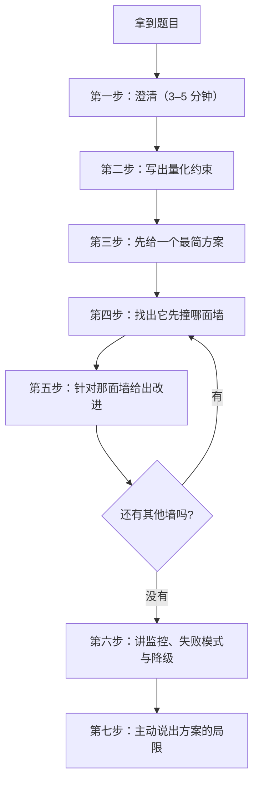

# 模拟面试案例：八个完整系统设计走查

> 位置：[InferenceAtlas](../../INDEX.md) > [模块 17](README.md) > 当前文档
> 信息截至：2026-07-29 ｜ 最后核验：2026-07-29 ｜ 内容版本：v0.1
> 时效性等级：低
> 相关主题：[题库 Q001–Q100](README.md)｜[如何设计推理系统](../00_start_here/04_how_to_design_an_inference_system.md)｜`10_coding_exercises.md`

## 本文档的定位

[题库的 100 道题](README.md)每道对应一个 2–5 分钟的口头回答。
这份文档是另一种体裁：**八个 30–45 分钟的完整系统设计走查**，
覆盖题库里没有单独成题、但模块 README 明确要求给出完整答案的设计场景。

**它与题库的三个区别**：

1. **粒度**：题库的题是「一个知识点 + 一个判断」，
   这里的案例是「从澄清问题到最终方案」的完整过程；
2. **顺序**：这里展示的是**过程**而不只是结论——
   包括在什么时候问什么澄清问题，以及在哪个环节做取舍；
3. **可延展性**：每个案例都标注了**面试官可能追问的方向**，
   以及**遇到追问时应该往哪个题库题目上引**。

**使用建议**：不要把这些案例当答案背下来。
系统设计题的评分点在**过程的合理性**而不是最终架构的相似度——
两个面试者给出完全不同的架构但都得到高分是常见的。
**要练的是「怎么从约束推导方案」这个动作**。

## 通用走查骨架

八个案例都遵循同一个骨架。**这个骨架本身就是这份文档最重要的内容**：

**图解读**：

1. **本图展示什么**：系统设计面试的推进顺序。
   起点是澄清而不是画架构图，
   核心是「最简方案 → 找墙 → 改进」的迭代循环，
   终点是监控与局限。
2. **核心瓶颈**：瓶颈在第三步「先给一个最简方案」。
   **很多面试者跳过这一步，直接给一个复杂架构**——
   结果是无法解释每个组件为什么存在。
   **从最简方案开始，每个组件的存在都有一个明确的理由（它解决了哪面墙）**，
   这让整个设计可辩护。
3. **图中的 trade-off**：第一步澄清会花掉 3–5 分钟，
   在 45 分钟的面试里是不小的比例。
   **但不澄清就设计的风险是做错题**——
   而做错题的损失远大于 5 分钟。
4. **面试如何引用**：可以在开场直接说
   「我想先问几个问题确认约束，然后给一个最简方案，
   再逐步找出它的瓶颈并改进」。
   **这句话本身就展示了结构化的思维方式**。

**第一步「澄清」要问什么**——四类问题，按价值排序：

| 类别 | 具体问题 | 为什么重要 |
|---|---|---|
| 工作负载 | 输入输出长度分布？QPS 与峰谷比？多轮还是单轮？ | **决定几乎所有后续结论** |
| SLO | TTFT 与 TPOT 的目标与分位数？可用性目标？ | 决定架构而不只是参数 |
| 约束 | 硬件给定还是可选？数据边界要求？预算？ | 可能直接排除某些方案 |
| 质量 | 模型给定还是可换？能接受量化的精度损失吗？ | 决定优化手段的范围 |

**如果面试官说「你自己假设」，那就明确说出假设并写在白板上**。
**写出来的假设可以在后面被修正，没写出来的假设会变成争议**。

---

## 案例一：面向百万 DAU 的多模型 LLM chat service

**题面**：设计一个支持百万日活的对话服务，
后端有多个不同规模的模型，需要满足交互式对话的时延要求。

### 第一步：澄清

必须问清的五件事：

1. **多模型是「用户可选」还是「系统路由」**？
   这决定了是要做容量分池还是要做路由决策；
2. **多轮对话的比例与轮次分布**？
   这决定了前缀缓存与会话状态的价值；
3. **峰谷比**？百万 DAU 的峰值 QPS 可能是均值的数倍；
4. **TTFT 与 TPOT 的目标**？流式输出下 TPOT 决定阅读体验；
5. **是否有数据边界要求**？影响能否用第三方 API 兜底。

**本案例的假设**（面试中应写在白板上）：
系统路由为主、用户可指定；多轮占多数；
峰谷比取一个显著大于 1 的值；
TTFT 与 TPOT 都有 P99 目标；无特殊数据边界要求。

### 第二步：量化约束

从 DAU 推到 token 速率，链条是：

$$
\lambda_{\text{peak}} = \text{DAU} \times \frac{\text{人均会话数} \times \text{每会话轮数}}{86400} \times f_{\text{peak}}
$$

然后按 [Q084](06_hardware_and_datacenter_questions.md) 的方法分开算两侧：

$$
R_{\text{prefill}} = \lambda_{\text{peak}} \cdot S_{\text{in}}^{\text{eff}}, \qquad
R_{\text{decode}} = \lambda_{\text{peak}} \cdot S_{\text{out}}
$$

**注意 $S_{\text{in}}^{\text{eff}}$ 是「有效」输入长度**：
多轮对话下前缀高度重复，前缀缓存命中后实际需要计算的只是新增部分。
**如果不区分这一点，prefill 侧的容量会被显著高估**——
这是这道题最重要的一个量化洞察。

设命中率 $h$、新增比例 $\delta$，则

$$
S_{\text{in}}^{\text{eff}} \approx S_{\text{in}} \cdot \left[(1-h) + h\delta\right]
$$

**多轮对话场景下 $h$ 可以很高而 $\delta$ 很小，两者相乘使这一项大幅下降**。

### 第三步：最简方案

**单一模型、单副本池、无路由、无缓存**：
一个负载均衡器后面挂一组同构实例，每个实例跑同一个模型，
请求随机分配。

**这个方案的价值在于它是一个明确的起点**，
后面每加一个组件都要说清它解决了什么问题。

### 第四步：它先撞哪面墙

按撞墙顺序：

| 顺序 | 墙 | 症状 | 对应改进 |
|---|---|---|---|
| 1 | 随机路由导致缓存命中率低 | prefill 成本远高于必要 | 缓存亲和路由 |
| 2 | 单一大模型服务全部请求 | 成本高、简单请求被浪费 | 模型路由/级联 |
| 3 | KV 显存限制并发 | 高峰期抢占与拒绝 | KV 缩减 + 准入控制 |
| 4 | prefill 干扰 decode | TPOT 出现毛刺 | 分块 prefill，必要时 PD 分离 |
| 5 | 峰谷比导致低谷期浪费 | 单位成本高 | 弹性扩缩容 + 混合负载 |
| 6 | 单区域故障 | 全服务不可用 | 多区域 + 降级 |

**这张表就是这道题的答案主体**。
**逐条讲「墙 → 改进」比一次性画出完整架构图更能展示推导能力**。

### 第五步：逐面墙的改进

**（一）缓存亲和路由**。按会话标识哈希到实例，
使同一会话的后续轮次落在同一实例上，命中已有前缀。
**但严格亲和会导致负载不均**，所以要用加权评分：

$$
\text{score} = w_1 \cdot \text{缓存命中长度} - w_2 \cdot \text{该实例当前负载}
$$

详见 [Q038](03_serving_scheduling_and_slo_questions.md)。

**（二）模型路由与级联**。简单请求走小模型，复杂请求走大模型。
**关键是路由判据的可靠性**——路由错误的代价不对称：
把复杂请求错误地送给小模型损害质量，
把简单请求送给大模型只是浪费成本。
**所以阈值应该按代价加权而非对称设置**（同 [Q100](08_company_paper_and_strategy_questions.md) 的分流器讨论）。
级联（先小后大、不满意则升级）的经济性判据见 [Q039](03_serving_scheduling_and_slo_questions.md)。

**（三）KV 缩减与准入控制**。
KV 是并发上限的决定因素。手段的优先级：
GQA/MLA 一类的结构性缩减（如果模型可选）、
KV 量化、分页管理消除碎片、以及上下文长度上限。
**准入必须在资源被消耗前判断而不是等 OOM**（[Q032](03_serving_scheduling_and_slo_questions.md)）。

**（四）prefill 与 decode 的隔离**。
先用分块 prefill（代价是 TTFT 略升），
如果 TPOT 毛刺仍不达标再考虑 PD 分离——
**但要先验证分离的判据成立**（[Q069](05_distributed_and_moe_questions.md)）：
传输时间与 prefill 时间之比远小于 1。
**注意一个耦合：本方案的高缓存命中率会让这个比值变差**
（命中时 prefill 变短，传输时间不变）。
**这个耦合是本案例最值得指出的一个非显然结论**。

**（五）弹性与利用率**。峰谷比大意味着按峰值配置会导致低谷浪费。
两个手段：按队列深度与 SLO 达成率扩缩容
（**不要用 GPU 利用率**，见 [Q041](03_serving_scheduling_and_slo_questions.md)）、
以及把离线批处理填到低谷（[Q099](08_company_paper_and_strategy_questions.md)）。

**（六）多区域与降级**。
区域级故障的处理见案例八。

### 第六步：监控与降级

核心指标取 [Q092](07_debug_benchmark_and_reliability_questions.md) 的十六项，
本案例额外需要：**按模型分开的路由分布与各模型的质量指标**
（路由错误只在这里可见）。

降级顺序：缩短上下文与输出上限 → 降低并发上限 →
只服务高优先级 → 全部路由到小模型 → 返回容量错误。

### 第七步：主动说出局限

三条应该主动提出的局限：

1. **路由判据的质量是这个设计的最大不确定性**，
   它需要独立评测且会随流量分布漂移；
2. **缓存亲和与弹性扩缩容互相冲突**——
   实例增减会打乱亲和关系，导致命中率短期下降。
   **需要一个渐进的重平衡策略而不是立即重哈希**；
3. **多模型意味着多套容量规划与多套质量监控**，
   运维复杂度是线性增长的。

### 面试官可能追问的方向

| 追问 | 引向 |
|---|---|
| 缓存亲和下扩容怎么不打乱命中？ | 一致性哈希 + 渐进迁移 |
| 路由判据怎么评测？ | [Q100](08_company_paper_and_strategy_questions.md) 分流器的两类错误 |
| 峰值超出容量怎么办？ | 案例八 + [Q032](03_serving_scheduling_and_slo_questions.md) 准入 |
| 怎么定 TPOT 的 SLO？ | [Q007](01_inference_system_design.md) |

---

## 案例二：为长上下文 RAG 设计 KV cache

**题面**：一个检索增强的问答服务，
每个请求会把检索到的多个文档片段拼进 prompt，
上下文可能很长。请设计它的 KV cache 方案。

### 第一步：澄清

三个决定性的问题：

1. **检索片段的复用程度**？
   不同请求是否常常检索到相同的片段？
   **这决定了缓存能不能跨请求复用**；
2. **片段在 prompt 里的顺序是否固定**？
   **这是本题的核心**——见下面的分析；
3. **同一用户的连续提问是否共享检索结果**？

### 第二步：本题的核心矛盾

**KV cache 只能复用「完全相同的前缀」**。
这是一个结构性限制：一个 token 的 K、V 依赖它之前的全部 token，
**所以片段 B 的 KV 在「A 之后」与在「C 之后」是不同的**。

由此得到一个关键结论：

> **如果每个请求的检索片段组合与顺序都不同，
> 那么片段的 KV 无法跨请求复用——
> 即使同一个片段出现在很多请求里。**

**这个结论决定了整个设计**，而它经常被忽略：
人们直觉上认为「同一个文档片段的 KV 应该能缓存」，
**但只有当它处于相同前缀位置时才成立**。

### 第三步：最简方案与它的问题

**最简方案**：把系统提示 + 检索片段 + 问题拼成 prompt，
每次完整 prefill，靠通用的前缀缓存自然命中系统提示那一段。

**问题**：只有系统提示（很短）能命中，
检索片段（很长）每次都要重算。
**prefill 成本几乎没有被优化**。

### 第四步：四种改进方案与它们的代价

| 方案 | 机制 | 收益 | 代价 |
|---|---|---|---|
| A. 固定片段顺序 | 按片段 ID 排序而非按相关度排序 | 相同片段集合可完整命中 | **失去按相关度排序的效果** |
| B. 分层前缀 | 把高频片段固定放在最前 | 高频部分可命中 | 只对有明显热点的语料有效 |
| C. 缩短上下文 | 只放最相关的少数片段 | 直接减少 prefill 与 KV | 可能损失召回 |
| D. 接受重算 | 不做前缀优化，优化其他环节 | 无 | prefill 成本高 |

**方案 A 是最有效但也最有争议的**：
把片段按固定顺序（如文档 ID）排列而不是按相关度排列，
使得「相同的片段集合」产生相同的前缀。
**代价是模型看到的顺序不再反映相关度**，
而**位置对模型的注意力分配是有影响的**——
所以这个改动**必须做质量验证，不能假设无害**。

**方案 B 的适用条件**要说清楚：
只有当语料有明显的热点分布（少数片段被高频检索）时才有效。
**如果检索分布接近均匀，分层前缀几乎没有收益**。

**方案 C 常常被低估**。多放片段的边际收益是递减的，
而成本是线性的（KV 与 prefill 都随长度线性增长）。
**所以「放多少片段」应该是一个被实测优化的参数**，
而不是取一个尽可能大的值。

### 第五步：容量侧的设计

无论选哪个方案，长上下文都意味着 KV 压力。按 [Q078](06_hardware_and_datacenter_questions.md)：

$$
C_{\max} = \frac{M_{\text{avail}} - M_{\text{weight}} - M_{\text{act}}}{S \cdot m_{\text{tok}}}
$$

**并发上限与上下文长度成反比**。三个手段：

1. **KV 量化**：直接降低 $m_{\text{tok}}$，
   但误差会随生成累积，故保留最近若干 token 为高精度（[Q021](02_kv_cache_and_transformer_questions.md)）；
2. **区分「检索片段」与「生成部分」的 KV 策略**。
   检索片段的 KV 在生成过程中只被读取不被修改，
   **所以它是量化或压缩的优先目标**——
   而最近生成的 token 对质量更敏感，应保持高精度。
   **这个区分是本案例特有的一个优化点**；
3. **上下文上限与分级**：常规请求给较短上限，
   长文档场景走单独路径。

### 第六步：一个容易被忽略的问题

**缓存与检索结果的一致性**。如果语料被更新，
**已缓存的 KV 对应的是旧内容**。
所以缓存必须能被按片段失效，
**这要求缓存键能追溯到它包含哪些片段版本**。
**忽略这一点会导致「更新了文档但回答仍用旧内容」的问题**，
而这类问题极难排查——因为系统一切正常。

### 第七步：局限

1. **方案 A 的质量影响必须实测**，不能推断；
2. **如果检索结果高度多样，所有前缀优化的收益都有限**，
   此时应该把力气放在缩短上下文与 KV 量化上；
3. **跨用户共享检索片段的缓存有数据隔离风险**——
   如果检索是按用户权限过滤的，
   **缓存键必须包含权限维度**（[Q095](07_debug_benchmark_and_reliability_questions.md)）。

---

## 案例三：设计投机解码并判断它是否有真实收益

**题面**：团队提议引入投机解码来降低 TPOT。
请设计方案并给出判断它是否值得的方法。

### 第一步：先算收益上限

**这一步必须在设计之前做**。投机解码的加速比模型：

设草稿模型每轮提议 $k$ 个 token、接受率 $\alpha$（逐 token 独立近似）、
草稿模型与目标模型的单步成本比为 $r$，则

$$
\text{speedup} = \frac{1 - \alpha^{k+1}}{(1-\alpha)(kr + 1)}
$$

**两个关键性质**：

1. **上界是 $\dfrac{1}{1-\alpha}$**（$k \to \infty$、$r \to 0$ 时）。
   **所以接受率决定了天花板**：$\alpha = 0.7$ 时无论怎么调都不会超过约 3.3 倍；
2. **存在最优 $k^{*}$**，超过它之后加速比下降——
   因为多提议的 token 大概率被拒绝，草稿成本却已付出。

**代入一组假设值看形状**（$\alpha = 0.7$）：

| $k$ | $r = 0.1$ | $r = 0.3$ |
|---|---|---|
| 1 | 1.55 | 1.31 |
| 2 | 1.82 | 1.37 |
| 3 | 1.95 | 1.33 |
| 4 | 1.98 | 1.26 |
| 5 | 1.96 | 1.18 |
| 8 | 1.78 | 0.94 |

**这张表有三个读法**：

1. **$r$ 从 0.1 升到 0.3 时，最优 $k$ 从 4 降到 2，
   峰值加速比从约 2.0 降到约 1.4**。
   **草稿模型的相对成本是一个很敏感的参数**；
2. **$r = 0.3$、$k = 8$ 时加速比是 0.94，即变慢了**。
   **提议过多是有害的，不只是收益递减**；
3. **即使在最好的一格（1.98）也远低于理论上界 3.33**。
   **上界只在 $r \to 0$ 时可达，而实际的草稿模型总有成本**。

**所以第一步的产出是**：
「在我们的 $\alpha$ 与 $r$ 下，理论上限是多少」。
**如果这个数字不够吸引人，讨论到此结束**。

### 第二步：三个接受率定义要区分

面试中容易混淆的三个量：

| 量 | 定义 | 用途 |
|---|---|---|
| $\alpha$ | 单个 token 被接受的概率 | 上面的公式 |
| $E[\ell]$ | 每轮实际接受的 token 数期望 | 直接可测，$= \frac{1-\alpha^{k+1}}{1-\alpha} - 1$ 的形式 |
| $\beta$ | 整轮 $k$ 个全部被接受的概率 | 描述最好情况的频率 |

**报告收益时应该用 $E[\ell]$，因为它可以直接测量**。
$\alpha$ 是一个模型参数，需要从 $E[\ell]$ 反推。

**接受率的上界有一个理论刻画**：
草稿分布 $q$ 与目标分布 $p$ 的重叠系数

$$
\sum_i \min(p_i, q_i) = 1 - \text{TV}(p, q)
$$

**即接受率的上限由两个分布的总变差距离决定**。
这解释了为什么「草稿模型要与目标模型同源」——
同一系列的小模型与大模型的分布更接近。

### 第三步：设计要点

**（一）草稿来源的三种选择**：

| 来源 | $r$ | $\alpha$ | 实现复杂度 |
|---|---|---|---|
| 独立的小模型 | 中 | 中（取决于同源程度） | 低（两个模型） |
| 目标模型上的多头预测 | 低 | 中高 | 中（需改模型） |
| n-gram / 检索式草稿 | 极低 | 低但对特定负载高 | 低 |

**第三行值得注意**：对于有大量重复内容的负载
（如代码补全、结构化输出、长文档改写），
**基于输入内容的检索式草稿可以有很高的接受率且成本几乎为零**。
**这是一个成本最低的起点**。

**（二）验证阶段必须保证的不变量**。
投机解码的正确实现**在温度为 0 时应产出与非投机完全一致的 token 序列**
（在浮点误差不导致不同 argmax 的前提下）。
**这个不变量是最强的正确性测试**：
如果不一致，说明验证逻辑有 bug。
**面试中主动提出这个测试是一个明确的加分点**。

温度大于 0 时不要求逐 token 一致，
但**要求采样分布与目标模型一致**——
这由接受-重采样规则保证，是算法的核心正确性要求。

**（三）与其他机制的交互**——这是落地的主要风险：

| 机制 | 冲突 | 处理 |
|---|---|---|
| 连续批处理 | 不同请求每轮接受的 token 数不同，批内步调不齐 | 需要支持变长推进 |
| 执行图固化 | 接受判断是数据依赖的控制流 | 图要切段（[Q048](04_compiler_kernel_and_quantization_questions.md)） |
| 分页 KV | 被拒绝的 token 的 KV 要回滚 | 页管理要支持截断 |
| 大批场景 | 批大时目标模型已算力受限，投机的额外计算不再免费 | **收益随批大小下降** |

**最后一行是最重要的**：投机解码的收益来自
「decode 阶段算力富余而带宽紧张」，
**所以它在小批下收益大、大批下收益小甚至为负**。
**这决定了它适合延迟敏感的小批服务，不适合吞吐导向的大批服务**。

### 第四步：判断是否值得的完整判据

按 [Q097](08_company_paper_and_strategy_questions.md) 的框架：

$$
V = \frac{\text{收益} \times \Pr[\text{落地成功}]}{\text{引入成本} + \text{维护成本}}
$$

具体填入：

- **收益**：由 $\alpha$ 与 $r$ 算出的上限，**再乘上你的批大小分布下的折扣**；
- **落地概率**：主要风险是与连续批处理、分页 KV、执行图固化的交互；
- **引入成本**：草稿模型的训练或选择 + 验证逻辑实现；
- **维护成本**：**每次目标模型更新都需要重新评估 $\alpha$**，
  可能需要重新训练草稿模型。**这一项常被低估**。

### 第五步：局限

1. **收益高度依赖负载**。同一套实现在不同负载上的加速比可以差数倍——
   **所以必须在自己的流量分布上测，不能用别人的数字**；
2. **它增加了尾部方差**。每轮接受的 token 数是随机的，
   **所以 ITL 的分布变宽**——
   即使平均 TPOT 改善，P99 可能改善有限；
3. **大批场景下可能是负收益**，需要按批大小动态开关。

---

## 案例四：推理引擎选型

**题面**：团队要为一个新的推理服务选择推理引擎，
候选有若干个开源与商业方案。请给出选型方法。

### 关于本案例的一个说明

**本案例不评价任何具体引擎**。
受当前环境的网络出口策略限制（详见 [AGENTS.md 第 11 节](../../AGENTS.md)），
本库无法访问任何推理引擎的源码、文档或版本说明，
**因此无法核验任何一条关于具体引擎能力的陈述**。
**在无可靠来源时写出「某引擎支持某特性」属于本库明确禁止的行为**。

**本案例给出的是选型的评估维度与验证方法**，
读者应自行按这些维度填入实际候选方案的信息，
**并标注每一条的来源与披露级别**
（官方文档为 `技术文档披露`，代码为 `开源代码/配置披露`，
自己实测为 `独立可复现实验`）。

**这也正是面试中的正确答法**：给维度与验证方法，
而不是背诵各引擎的特性列表——
**因为特性列表会过时，而选型方法不会**。

### 第一步：先确定这个选择的可逆性

**选型决策的一个特殊性质是它的切换成本很高**：
引擎决定了部署方式、监控接口、优化手段、以及团队的技能积累。
**所以第一个问题是「这个选择多久之后会被重新审视」**。

如果是一个长期的基础选择，**应该更看重可维护性与社区活跃度**；
如果是一个实验性项目，**应该更看重上手速度**。

### 第二步：评估维度（可填充表）

| 维度 | 具体检查项 | 怎么验证 | 你的候选 A | 候选 B |
|---|---|---|---|---|
| **模型支持** | 你的模型结构、注意力变体、是否 MoE | 查文档 + 实际加载 | 待填 | 待填 |
| **量化支持** | 你需要的位宽与粒度组合是否有高效 kernel | 查文档 + 实测吞吐 | 待填 | 待填 |
| **调度能力** | 连续批处理、分块 prefill、优先级、抢占 | 查文档 + 压测验证 | 待填 | 待填 |
| **KV 管理** | 分页、前缀缓存、跨请求共享、卸载 | 查文档 + 测命中率 | 待填 | 待填 |
| **并行支持** | TP / PP / EP，以及能否组合 | 查文档 + 多卡实测 | 待填 | 待填 |
| **可观测性** | 能否拿到 [Q092](07_debug_benchmark_and_reliability_questions.md) 的十六项指标 | **实际接一遍监控** | 待填 | 待填 |
| **扩展性** | 加一个自定义算子或调度策略的成本 | 读代码结构 | 待填 | 待填 |
| **稳定性** | 长时间运行是否有内存泄漏或性能漂移 | **跑一个长时压测** | 待填 | 待填 |
| **社区与维护** | 更新频率、问题响应、文档质量 | 观察仓库活动 | 待填 | 待填 |
| **许可与合规** | 许可证是否允许你的用法 | 读许可证 | 待填 | 待填 |

**其中三项最容易被低估**：

1. **可观测性**（第六行）。一个性能很好但拿不到分段指标的引擎，
   **会让你在第一次线上事故时束手无策**。
   **验证方法是实际接一遍监控，而不是看文档说支持什么**；
2. **稳定性**（第八行）。短时压测好而长时运行有泄漏或漂移的情况是真实存在的。
   **必须跑一个多小时级别的压测**，
   同时观察显存占用与吞吐是否随时间变化；
3. **扩展性**（第七行）。你几乎一定会需要一个引擎没有的功能。
   **「加一个东西要动多少地方」决定了长期的开发速度**。

### 第三步：选型流程

1. **硬性筛选**：模型支持、量化支持、许可证——
   **不满足的直接排除，不进入性能比较**；
2. **短名单实测**：在**你自己的模型、你自己的负载、你自己的硬件**上
   按 [Q090](07_debug_benchmark_and_reliability_questions.md) 的方法做可复现压测。
   **不要用任何第三方的对比数字**——
   它们的工作点几乎一定与你不同；
3. **接一遍监控**：把 [Q092](07_debug_benchmark_and_reliability_questions.md) 的指标接出来，
   看哪些拿不到；
4. **长时压测**：跑到热稳态之后继续跑，观察漂移；
5. **做一个小改动**：实际加一个小功能，感受扩展成本；
6. **综合决策**：**性能不是唯一权重**——
   如果两个方案性能接近，选可观测性与扩展性更好的。

### 第四步：一个常被忽略的选项

**「先不选，用一个薄抽象层隔离」**。
如果现在无法确定，可以在自己的服务与引擎之间加一层抽象，
**使得后续切换的成本可控**。

**代价是这层抽象会限制你使用引擎的高级特性**
（抽象只能暴露各引擎的公共子集），
**而这些高级特性往往正是选择某个引擎的理由**。
**所以这个选项适合「短期需要上线、长期需要重新评估」的场景**，
不适合追求极致性能的场景。

### 第五步：局限

1. **实测结果会随版本变化**，所以选型结论有保质期，
   **应该记录测试配置以便后续重测**；
2. **团队的既有技能是一个真实的权重**，
   但不应该成为决定性的——**否则会锁死在过时的技术上**；
3. **本案例的评估表需要读者自行填充**，
   本库不提供任何具体引擎的信息（原因见上）。

---

## 案例五：评估远端内存对 KV cache 的价值

**题面**：有人提议把 KV cache 放到设备之外的更大内存池里
（主机内存或某种远端内存），以支持更长的上下文或更高的并发。
请评估这个方案的价值。

### 第一步：先分清两种完全不同的用法

**这是本案例最重要的区分**：

| 用法 | 什么时候访问 | 判据 |
|---|---|---|
| **活跃请求的 KV 放在远端** | **每一步都要读** | 几乎必然不可行 |
| **非活跃请求的 KV 换出到远端** | 只在换出/换入时访问 | 可行，有明确判据 |

**第一种用法基本不可行，理由是定量的**。
decode 每步都要读取全部在飞请求的 KV。
如果 KV 在远端，每步都要跨链路传输：

$$
\tau_{\text{step}} \ge \frac{C \cdot S \cdot m_{\text{tok}}}{\text{BW}_{\text{link}}}
$$

而设备内存带宽远高于任何设备外链路带宽，
**所以这个下界会比放在设备内高出一个量级以上**。
**对交互式服务，这直接违反 TPOT 目标**。

**唯一的例外是把 KV 的一部分放远端并做预取**：
如果注意力只需要访问 KV 的一个子集（如稀疏注意力或滑动窗口），
**那么远端只存放不常访问的部分**。
**但这已经不是「把 KV 放远端」而是「KV 分层存储」了**，
且它依赖注意力模式的稀疏性——**必须先验证这个前提成立**。

### 第二步：第二种用法的定量判据

换出非活跃请求的 KV 是有价值的。判据是
**等待时间超过一次换出加一次换入的时间**：

$$
T_{\text{wait}} > \frac{2 M_{\text{KV,req}}}{\text{BW}_{\text{link}}}
$$

**什么场景会有长等待**：

1. **Agent 等工具返回**：一次外部调用可能耗时数秒，
   而此期间该请求不需要任何计算却占着 KV
   （[Q046 之外的 agent 讨论见模块 05](../05_decoding_and_generation_algorithms/08_tool_use_and_agent_inference.md)）；
2. **多轮对话的轮间间隔**：用户在阅读与思考，
   而下一轮很可能复用上一轮的 KV；
3. **被抢占的请求**：换出比丢弃后重算可能更便宜——
   **这是一个直接的比较**：

$$
\frac{2 M_{\text{KV,req}} / \text{BW}_{\text{link}}}{\text{prefill}(S_{\text{prompt}} + L_g)}
$$

**小于 1 则换出优于重算**。
注意分母随已生成长度 $L_g$ 增长，
**所以生成得越久的请求越值得换出而不是重算**——
这与抢占的正反馈问题（[Q033](03_serving_scheduling_and_slo_questions.md)）直接相关。

### 第三步：把它写成一个容量收益

引入换出之后，KV 的容量约束从

$$
C_{\text{active}} + C_{\text{waiting}} \le C_{\max}
$$

变成

$$
C_{\text{active}} \le C_{\max}, \qquad C_{\text{waiting}} \le C_{\text{remote}}
$$

**收益的大小取决于等待中的请求占比 $\eta = C_{\text{waiting}} / C_{\text{total}}$**。
**如果等待占比很低，这个方案的收益也很低**——
所以第一个要测的量是「有多少 KV 占用是被等待中的请求持有的」。

**这个测量是本案例的第一步行动项**，而且它很便宜：
统计在飞请求中处于等待状态的比例与它们持有的 KV 量。
**如果这个数字很小，方案讨论可以到此结束**。

### 第四步：实现层面的四个要求

1. **换出与换入要能与计算重叠**，否则会引入毛刺；
2. **换出的粒度要合适**。按整个请求换出简单但不灵活，
   按页换出灵活但管理复杂；
3. **要有换出策略**。哪些请求先换出？
   判据应该是「预期等待时间 × KV 大小」而不只是等待时间；
4. **要防止抖动**。如果一个请求被换出后立刻需要换入，
   **净效果是负的**。需要一个最小等待时间阈值。

### 第五步：局限与替代方案

**局限**：

1. **收益上限由等待占比决定**，而这是一个负载属性，不是技术属性；
2. **增加了一个新的故障与延迟来源**；
3. **远端内存的容量与带宽都需要按官方文档核实**——
   **本案例不给出任何具体的带宽或容量数字**，
   因为当前环境无法核验（同 [Q081](06_hardware_and_datacenter_questions.md) 的说明）。

**应该被一起评估的替代方案**：

| 替代 | 相对优势 |
|---|---|
| KV 量化 | 更简单、无新增故障面、同时省带宽 |
| 缩短上下文上限 | 最简单，代价是功能限制 |
| 直接重算（不换出） | 无需新基础设施，代价是算力 |
| 提高设备内存容量（换硬件） | 根本解决，代价是成本与采购周期 |

**「先做 KV 量化再考虑换出」通常是正确的顺序**，
因为量化的收益更直接且没有新增复杂度。

---

## 案例六：分析 reasoning 模型的 test-time compute 经济学

**题面**：一类模型会在回答前生成很长的思考过程，
以此换取更好的答案质量。请分析这种做法的经济学，
并说明它对服务设计的影响。

### 第一步：建立成本模型

**核心事实是这类负载的输出长度远大于常规对话，且方差极大**。

一次回答的成本近似为

$$
C = c_{\text{in}} \cdot S_{\text{in}} + c_{\text{out}} \cdot (S_{\text{think}} + S_{\text{answer}})
$$

其中 $S_{\text{think}}$ 是思考过程的长度。
**关键是 $S_{\text{think}}$ 可以远大于 $S_{\text{answer}}$**，
所以成本几乎完全由思考长度决定。

**而 decode 的每步成本还随上下文增长**（要读越来越长的 KV），
所以严格地说成本是超线性的：

$$
C_{\text{decode}} \approx \sum_{t=1}^{S_{\text{out}}} \left[ \text{权重读取} + (S_{\text{in}} + t) \cdot m_{\text{tok}} \cdot B \right]
$$

**KV 读取项对长度求和后是二次的**。
**所以「输出翻倍，成本超过翻倍」**——
这是 reasoning 负载与常规负载的一个定量差异。

### 第二步：质量收益的形状

**这是经济学分析的核心**。增加计算量的方式有几种，
它们的收益曲线不同：

| 方式 | 机制 | 收益的形状 |
|---|---|---|
| 更长的单次思考 | 一条链上想更久 | 递减，且可能因偏离而下降 |
| 并行采样多条 + 选择 | $n$ 条独立尝试取最好 | 见下面的分析 |
| 并行采样多条 + 投票 | 多数表决 | **依赖错误的分布形态** |
| 迭代修正 | 生成后自我检查修改 | 依赖检查能力 |

**并行采样的两个不同上限**。设单次正确率 $\pi$：

- **如果有可靠的验证器**（能识别哪条对了），则
  $Q_{\text{oracle}}(n) = 1 - (1-\pi)^n$，**随 $n$ 快速上升**；
- **如果只能投票**，效果取决于错误是否集中。

**投票的关键洞察是：效果由错误的分布形态决定，而不只由 $\pi$ 决定**。
如果错误分散（每次错的方式都不同），
正确答案即使不过半也往往是最大的一类，投票有效；
**如果错误集中（总是错成同一个答案），投票会放大这个错误**。

**这解释了一个实践现象**：
投票在某些任务上收益显著，在另一些任务上几乎无效甚至有害。
**所以「用投票提升质量」不是一个普适结论，必须按任务验证**。

**由此得到一个重要的服务设计含义**：
如果任务有可验证的答案（代码能跑、数学能验算），
**应该优先构建验证器而不是加大采样数**——
因为有验证器时收益曲线好得多。

### 第三步：成本的重尾特性及其后果

**思考长度是重尾分布的**。这带来四个后果：

1. **按均值做容量规划一定会出事**（[Q012](01_inference_system_design.md)、[Q028](02_kv_cache_and_transformer_questions.md)）。
   必须按高分位数配 KV 容量；
2. **单个请求可能占用 KV 很久**，
   降低了批的周转率，**放大了 KV 作为瓶颈的程度**；
3. **P99 时延与 P50 可能差一个量级**，
   而这大部分是「输出长」而不是「系统慢」——
   **所以必须用 TPOT 而不是端到端时延做 SLO**（[Q040](03_serving_scheduling_and_slo_questions.md)）；
4. **成本的方差直接传导到商业模型**。
   如果按请求收费而成本按 token，**重尾会侵蚀单位经济性**——
   这解释了为什么这类产品通常按 token 计价或设置额度。

### 第四步：服务设计的五个应对

**（一）token 预算治理**。给每个请求一个思考长度上限。
**关键是超限时的行为**：
不应该直接截断（会得到一个没有结论的输出），
而应该**触发「收尾」**——
提示模型停止探索并给出当前最好的答案。
**这个机制的存在与否直接决定了超限请求的可用性**。

**（二）分级预算**。不是所有请求都需要长思考。
按任务难度或用户等级给不同的预算，
**而难度判断本身是一个路由问题**（同案例一）。

**（三）容量按 decode 侧配置**。这类负载的 $S_{\text{out}}$ 远大于 $S_{\text{in}}$，
**所以配比大幅偏向 decode**（[Q071](05_distributed_and_moe_questions.md)）。
如果做了 PD 分离，配比要重算。

**（四）中间结果的处理**。思考过程要不要返回给用户？
如果不返回，**它仍然消耗了全部资源**——
所以「隐藏思考过程」不降低成本，只影响体验与产品定位。
**如果要流式展示思考过程，则 TPOT 对思考部分也是用户可见的**。

**（五）并行采样的资源模型**。如果用多路采样，
$n$ 条路径共享同一个 prompt 的 KV 前缀，
**所以用分页 KV + 写时复制可以只存一份前缀**——
有效的 KV 占用远小于 $n$ 倍。
**这个优化对多路采样是必要的而不是可选的**。

### 第五步：局限

1. **本案例不给出任何具体模型的思考长度、质量提升幅度或价格数据**——
   当前环境无法核验此类数据，**而在无来源时给出具体数字是被禁止的**；
2. **收益曲线是任务相关的**，
   同一套 test-time 策略在不同任务上的效果可以相反；
3. **验证器的构建成本可能超过采样成本**，
   所以「优先构建验证器」这个建议有前提：任务本身可验证。

---

## 案例七：解决模型加载与权重分发的瓶颈

**题面**：你的服务扩容时，新实例需要几分钟才能就绪，
主要时间花在加载模型权重上。请分析并优化。

### 第一步：分解就绪时间

$$
T_{\text{ready}} = T_{\text{fetch}} + T_{\text{load}} + T_{\text{warmup}} + T_{\text{healthcheck}}
$$

**四段的瓶颈完全不同，必须分别测**：

| 段 | 内容 | 常见瓶颈 |
|---|---|---|
| $T_{\text{fetch}}$ | 从存储拉取权重到本地 | 存储带宽或网络带宽；**扩容时多实例并发拉取会互相争抢** |
| $T_{\text{load}}$ | 从本地读入设备内存 | 本地盘带宽、主机到设备链路带宽 |
| $T_{\text{warmup}}$ | 编译、缓存预热、热稳态 | 编译时间（[Q049](04_compiler_kernel_and_quantization_questions.md)）、分桶数量 |
| $T_{\text{healthcheck}}$ | 通过健康检查 | 检查间隔与阈值设置 |

**第一行的「并发争抢」是本案例的核心问题**：
扩容通常是同时启动多个实例，
**它们同时从同一个存储拉取同一份权重**。
于是**扩容规模越大，单实例的拉取越慢**——
这是一个反直觉但常见的现象。

### 第二步：这为什么是一个严重问题

**因为扩容的需求出现在流量高峰**。
就绪时间长意味着：

1. **高峰期容量补充不及时**，SLO 被违反；
2. **可能触发进一步扩容**（因为现有实例过载），
   **而更多实例同时拉取会让每个都更慢**——
   **这是一个正反馈**；
3. **弹性扩缩容的价值被削弱**：
   如果就绪要几分钟，就不能做细粒度的弹性，
   **只能保持更大的余量，这直接抬高成本**。

**所以就绪时间不只是一个体验问题，它决定了弹性能力的下限**。

### 第三步：分段优化

**（一）优化 $T_{\text{fetch}}$——收益通常最大**：

| 手段 | 机制 | 代价 |
|---|---|---|
| 节点本地缓存 | 权重在节点上持久化，重启不需重拉 | 占用本地存储 |
| 镜像预置 | 把权重打进机器镜像或预拉到节点 | 镜像巨大、更新麻烦 |
| 分层分发 | 从少数节点向其他节点扩散而非都从中心拉 | 实现复杂度 |
| 限制并发拉取 | 排队而不是全部同时拉 | 后面的实例更慢，但总时间可能更短 |
| 减小权重体积 | 量化 | 精度风险（但这是量化的一个额外收益） |

**「限制并发拉取」值得说明**：
如果存储带宽是瓶颈，$n$ 个实例同时拉的总时间与排队拉的总时间接近，
**但排队时前几个实例能更早就绪并开始服务**。
**所以在容量紧张时，串行化拉取反而更快恢复服务能力**——
这是一个非直觉的调度优化。

**（二）优化 $T_{\text{load}}$**：

- **内存映射与按需分页**：不等全部加载完就开始服务，
  **代价是首批请求会触发缺页从而变慢**；
- **并行加载**：多线程读 + 多流传输；
- **格式优化**：使用能直接映射到设备内存布局的格式，
  **避免加载时的格式转换**（这一步有时占相当比例）。

**（三）优化 $T_{\text{warmup}}$**：

- **减少编译分桶数**（[Q057](04_compiler_kernel_and_quantization_questions.md)）：
  桶越少预热越快，代价是填充浪费；
- **持久化编译产物**并跨实例复用——
  **这通常是收益最大的一项**，因为它把编译从每实例一次变成全局一次；
- **区分「可以服务」与「达到最优性能」**：
  可以在预热完成前就接受流量（性能较低），
  **但要在负载均衡的权重上体现这一点**——
  给未完全预热的实例更低的权重，而不是等价对待。

**（四）优化 $T_{\text{healthcheck}}$**：
把检查间隔调小、并且**让实例主动上报就绪**而不是被动等轮询。
**这一段常常有几十秒的白等时间，是最容易拿到的收益**。

### 第四步：架构层面的两个替代思路

**（一）保持热备而不是快速冷启动**。
如果就绪时间无法压到可接受范围，
**就用容量换时间**：保持一部分空闲但已就绪的实例。
**判据是「热备的成本」与「扩容延迟导致的 SLO 违约成本」的比较**。

**（二）分离权重与实例的生命周期**。
如果多个实例可以共享一份已加载的权重
（例如同一节点上的多个进程），
**就不需要每个实例都加载一遍**。
**代价是共享带来的隔离性下降与故障耦合**。

### 第五步：局限

1. **本案例不给出任何具体的带宽、加载时间或权重体积数字**——
   这些必须实测；
2. **优化就绪时间的收益取决于你的扩容频率**。
   如果扩容很少发生，这项优化的优先级应该低；
3. **内存映射会让「已占用内存」的观测变得模糊**，
   需要相应调整监控的解读方式。

---

## 案例八：应对区域故障与容量短缺

**题面**：你的推理服务部署在若干区域。
请设计应对「一个区域完全不可用」以及「全局容量不足」两种情况的方案。

### 第一步：区分两种情况

**这两种情况的性质完全不同，混在一起讨论会得出错误结论**：

| 情况 | 本质 | 正确方向 |
|---|---|---|
| 区域故障 | **容量的一部分消失**，但总需求不变 | 把流量转移到剩余容量 + 降级 |
| 全局容量不足 | **需求超过总容量** | 只能降级或拒绝，转移无用 |

**关键区别**：区域故障时其他区域**可能**有余量；
全局容量不足时**没有地方可转移**。
**所以第二种情况的答案里没有「转移」这个选项**——
这一点如果答错，说明没有想清楚问题的本质。

### 第二步：区域故障的容量算术

设 $R$ 个区域、每区域容量 $\kappa$、总需求 $D$。
一个区域故障后剩余容量 $(R-1)\kappa$。要求

$$
(R-1)\kappa \ge D \quad \Longleftrightarrow \quad \frac{D}{R\kappa} \le \frac{R-1}{R}
$$

**即整体利用率必须低于 $\frac{R-1}{R}$ 才能容忍一个区域故障**：

| 区域数 $R$ | 可容忍一区故障的最高利用率 |
|---|---|
| 2 | 50% |
| 3 | 67% |
| 4 | 75% |
| 6 | 83% |

**这张表的含义很直接**：**区域越少，为了容错必须预留的余量越大**。
两区域部署要求利用率不超过 50%，
**也就是说一半的容量是为容错买的**——
这是一个必须被明确计算并向业务说明的成本。

**而利用率直接决定单位成本**（[Q085](06_hardware_and_datacenter_questions.md)）。
**所以「多区域容错」的成本可以被精确量化**，
这比笼统地说「需要冗余」有说服力得多。

### 第三步：区域故障的处理流程

**（一）检测**。要区分三种情况，因为处理不同：

| 现象 | 判断 | 处理 |
|---|---|---|
| 区域完全不响应 | 区域故障 | 立即摘除流量 |
| 区域响应但很慢 | **更危险**——它仍在接收流量却处理不好 | 也应摘除，但需防止误判 |
| 部分实例故障 | 局部问题 | 实例级摘除，不动区域 |

**第二行是最容易处理错的**。
「慢」比「死」更难处理：健康检查可能仍然通过，
**而流量继续被送进去然后超时**。
**所以健康检查必须包含时延判据而不只是存活判据**。

**（二）转移**。把流量切到其他区域。三个要点：

1. **限速切换**。一次性把全部流量切过去会压垮接收方——
   **这是一个典型的级联故障**。
   必须限速，并依赖接收方的准入控制（[Q032](03_serving_scheduling_and_slo_questions.md)）；
2. **在飞请求的处理**。故障区域的在飞请求 KV 已丢失。
   按 [Q075](05_distributed_and_moe_questions.md) 的方法：
   从持久化的 prompt + 已返回的 token 重建。
   **注意这些重建请求都需要完整 prefill，比正常请求更重**——
   **所以恢复本身就是一个负载尖峰**；
3. **会话亲和的失效**。转移后前缀缓存全部未命中，
   **prefill 负载会短期显著上升**。
   **这一点应该被计入转移的容量估算**——
   否则会低估接收方的压力。

**（三）降级**。如果剩余容量不足，按 [Q075](05_distributed_and_moe_questions.md) 的五级降级：
缩短上下文与输出上限 → 降低并发上限 →
只服务高优先级 → 路由到更小的模型 → 返回容量错误。

**每一级都应该能自动触发**，而不是等人工决策。

### 第四步：全局容量不足的处理

**这种情况下没有转移选项，只有三个杠杆**：

**（一）降低每请求的资源消耗**。
这是最优先的，因为它增加了可服务的请求数：
缩短上下文与输出上限、
降低采样路数（如果有多路采样）、
路由到更小的模型。

**（二）优先级与配额**。
在容量不足时，**公平分配比最大化吞吐更重要**——
因为「所有人都变慢」通常比「一部分人正常、一部分人被拒」更糟。
**具体做法是按租户配额准入，超额者降级或排队**。

**（三）明确拒绝而不是让请求超时**。
**这是一个重要的设计判断**：
在容量不足时，**快速拒绝优于慢慢超时**，因为：

1. 超时的请求消耗了资源却没有产出（[Q085](06_hardware_and_datacenter_questions.md) 的失败重试项）；
2. **客户端超时通常会重试，形成正反馈**；
3. 明确的容量错误让客户端能做出正确的处理（退避、降级、提示用户）。

**所以准入控制在容量不足时的价值是「保护系统不被压垮」而不是「限制用户」**。

### 第五步：预防与演练

**（一）容量的持续校验**。
「我们有 $R$ 个区域所以能容忍一个故障」这个陈述**必须被验证**，
因为区域的实际容量会漂移（部分实例降频、部分实例被其他负载占用）。
**验证方法是定期主动摘除一个区域的流量，看剩余容量是否真的够**。

**（二）演练**。按 [Q075](05_distributed_and_moe_questions.md) 的要求：
**未演练过的恢复路径应当假设它不工作**。
要演练的三件事：检测延迟、转移限速是否生效、
以及降级是否按预期自动触发。

**（三）依赖的一致性**。
如果推理服务依赖其他服务（检索、存储、工具），
**区域故障时这些依赖是否也跟着切换**？
**跨区域调用依赖会引入额外时延，可能本身就违反 SLO**。
**这一点常被忽略，但它决定了「转移」是否真的可行**。

### 第六步：局限

1. **多区域的成本是可计算且不小的**（见第二步的表），
   **应该明确向业务说明而不是当成技术必需项**；
2. **本案例假设各区域是对等的**。
   如果区域之间容量差异大，容量算术要按实际容量重算；
3. **同时发生的多区域故障**（例如共享的依赖故障）
   不在本方案的覆盖范围内——
   **它需要的是依赖的解耦，而不是更多区域**。

---

## 八个案例的共同模式

回顾这八个案例，有五个反复出现的模式。
**它们比任何单个案例的架构都更值得记住**：

**（一）先算清一个数，再谈方案**。
案例一算有效输入长度、案例三算加速比上限、
案例五算等待占比、案例八算可容忍的利用率。
**这个数往往直接决定方案值不值得做**，
而且它通常可以在几分钟内估出来。

**（二）区分看起来相似但性质不同的情况**。
案例五区分「活跃 KV 放远端」与「非活跃 KV 换出」、
案例八区分「区域故障」与「全局容量不足」。
**混在一起讨论会得出错误结论，而区分开之后答案往往是显然的**。

**（三）从最简方案开始，逐面墙改进**。
每个组件的存在都要有一个理由（它解决了哪面墙）。
**这让方案可辩护，也让你在被追问时有话可说**。

**（四）指出机制之间的耦合**。
案例一里缓存命中率会让 PD 分离的判据变差、
案例二里缓存与检索更新的一致性、
案例七里扩容并发会让每个实例更慢。
**这类跨机制的观察最难从文档里读到，因此最能体现真实经验**。

**（五）主动说出局限与需要实测的量**。
八个案例的每一个都以「局限」结尾，
而且都明确指出了哪些数字必须实测而不能推断。
**这不是示弱，而是把方案的适用边界讲清楚**——
**一个不知道自己方案边界的设计者是不可靠的**。

## 关键术语

| 中文术语 | 英文 | 定义 | 单位/口径 | 关联文档 |
|---|---|---|---|---|
| 有效输入长度 | effective input length | 扣除缓存命中后实际需要计算的输入长度 | token 数 | [Q024](02_kv_cache_and_transformer_questions.md) |
| 接受长度期望 | expected accepted length | 投机解码每轮实际接受的 token 数期望 | token 数 | 案例三 |
| 重叠系数 | overlap coefficient | 草稿分布与目标分布的重叠，等于 1 减总变差距离 | 无量纲 | 案例三 |
| KV 等待占比 | idle KV fraction | 被等待中的请求持有的 KV 占总 KV 的比例 | 无量纲比例 | 案例五 |
| 思考预算 | thinking budget | 单次请求允许的最大思考 token 数 | token 数 | 案例六 |
| 收尾机制 | forced wrap-up | 预算用尽时提示模型给出当前最好答案 | — | 案例六 |
| 就绪时间 | time to ready | 实例从启动到可服务的总时间 | 秒 | 案例七 |
| 容错利用率上限 | fault-tolerant utilization cap | 能容忍一个区域故障的最高整体利用率 | 无量纲比例 | 案例八 |

## 延伸阅读

- [如何设计一个推理系统](../00_start_here/04_how_to_design_an_inference_system.md)
- [如何准备推理面试](../00_start_here/05_how_to_prepare_for_inference_interviews.md)
- [题库总览与八个题组](README.md)
- [模块 03：serving 引擎与调度](../03_serving_engines_and_scheduling/)
- [模块 05：解码与生成算法](../05_decoding_and_generation_algorithms/)
- [模块 06：分布式与 MoE 推理](../06_distributed_and_moe_inference/)

## 主要来源

本文档的八个案例由题库 Q001–Q100 与模块 01–07 的推导组合而成，
**每个案例的关键计算都可追溯到对应题目或模块章节**。

**不含任何需要外部核验的产品规格、引擎特性、模型数据或价格**。
受当前环境的网络出口策略限制，本库无法访问推理引擎的源码与文档、
加速器厂商文档、或任何公开的性能与价格数据
（详见 [AGENTS.md 第 11 节](../../AGENTS.md)）。
案例四因此只给评估维度与可填充表格，
案例五、六、七明确声明不给出具体的带宽、长度与体积数字。

| 类别 | 说明 | 披露标签 |
|---|---|---|
| 八个案例的计算模型 | 由题库与模块 01–07 推导 | — |
| 题面与示例中的参数 | 为演示推导而设定的假设值 | — |
| 读者应自行填充的引擎评估表 | 应查官方文档与实测 | `技术文档披露` / `独立可复现实验` |
| 具体引擎特性、硬件规格、模型数据、价格 | **本文档未给出** | `待核实` |

## 更新记录

| 日期 | 版本 | 变更 | 核验人 |
|---|---|---|---|
| 2026-07-29 | v0.1 | 初稿：八个完整系统设计走查，覆盖模块 README 要求但题库未单独成题的设计场景 | — |
